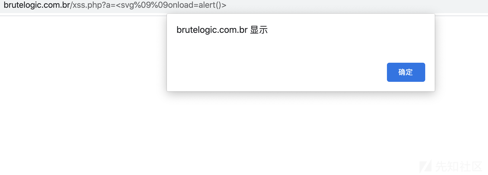
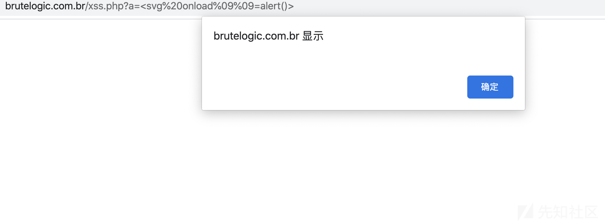
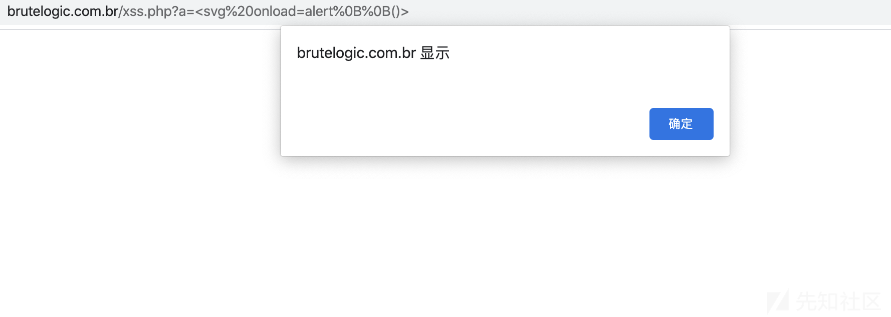
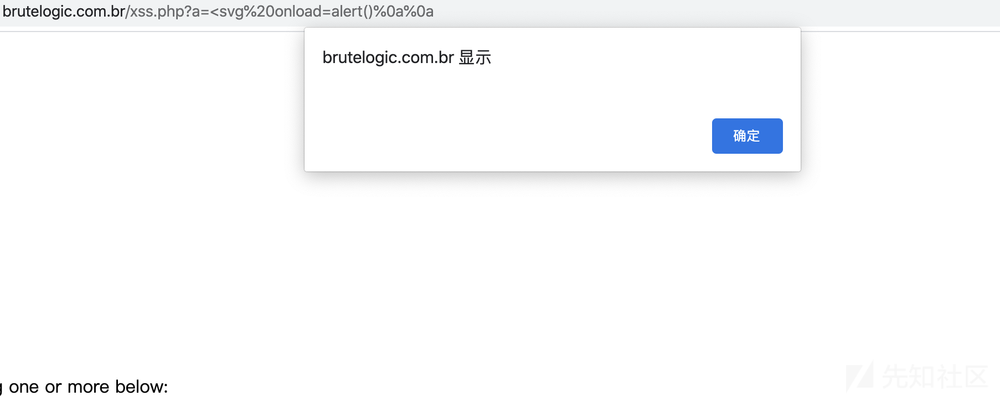

# waf && filter bypass系列——XSS之html语境下的填充符探索。 - 先知社区

waf && filter bypass系列——XSS之html语境下的填充符探索。

- - -

# 这是一个waf && filter 探索与绕过系列文章。

## 1\. 研究对象：XSS、html标签、填充符

首先大概的说一下填充符的概念。  
可被用来分隔语法关键词却不影响语义的符号。举个例子，比如说一个简单的XSS payload <svg onload=alert()>。我们可以用/来代替svg和onload之间的空格，且不会影响html的解析。我们就说，/是一个填充符。

在waf&filter bypass的过程中，填充符扮演了一个非常重要的角色——它“破坏”了语法应有的样子。

今天我们就来讲一讲，xss中，html语境下的填充符以及如何利用填充符绕过waf&filter。

## 2\. 建模

接下来的讲解我们都基于标签<svg onload=alert()>进行说明。

先来定义一下标签的各个部分。

1.  起始标签: <svg //head
2.  事件处理：onload //event  
    2.5 事件和等于号之间
3.  触发后执行函数：alert() //func  
    3.5 等于号和执行函数之间
4.  结束标签：> //tail

## 3\. 探索

测试靶场:[http://brutelogic.com.br/xss.php?a=1](http://brutelogic.com.br/xss.php?a=1)

1.起始标签与事件处理之间的填充符（url编码描述）  
BetTagAndEvent = {"%20","/","%09","%0a","%0d","/xxx/","%0c"}（且可重复，如%09%09）  
依次为 空格、/、水平制表符、换行符、回车符、/任意字符/、换页符  
把填充符叫做filler，正则描述为

```plain
(filler).*
```

[](https://xzfile.aliyuncs.com/media/upload/picture/20200316110508-f1ac537e-6732-1.png)

2.事件处理和等于号之间（url编码描述）  
{"%20","%09","%0a","%0d","%0c"}（且可重复，如%09%09）  
依次为 空格、水平制表、换行、回车、换页  
正则描述为

```plain
(filler).*
```

[](https://xzfile.aliyuncs.com/media/upload/picture/20200316111012-a68083e2-6733-1.png)  
3.等于号和执行函数之间。与2相同。

4.函数名和括号之间。  
形式：<svg onload=alert%0b()>  
{"%0B"}（且可重复，如%0B%0B）  
为垂直制表，这里说一下具体的原理，使用其他符号的时候，必须使用引号，比如 onload="alert%0a()"。引号内分隔函数和括号，依然会被认为是事件的一部分。但是在引号外，%0b可以将alert和()连在一起，不会造成分隔，所以浏览器会认为alert%0b()依然是包裹在事件内的。  
正则描述为

```plain
(%0B).*
```

[](https://xzfile.aliyuncs.com/media/upload/picture/20200316111235-fbe46c86-6733-1.png)

5.结束标签  
Tail = {"%20","//",">","%0a","%0d","%09","%0c"}(且可重复，如%0a%0a)  
正则描述为

```plain
(filler).*
```

[](https://xzfile.aliyuncs.com/media/upload/picture/20200316111551-7098bb68-6734-1.png)

## 4\. 总结

多数waf&filter场景中，往往会因为没有将所有填充符过滤掉，或者过滤不完全，规则畸形等问题，导致可以通过组合各种填充符进行绕过。  
就比如如下payload：<svg%0a%0aonload%09=%0aalert%0b()%0a  
可以绕过1.匹配onxxx= 2.匹配=alert 3. 匹配alert()的waf。

由于filter的多样性，可能需要结合具体的情景，具体分析，各位白帽子可以构建出自己的fuzz思路。

只要思路好，waf绕到老～
