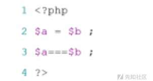
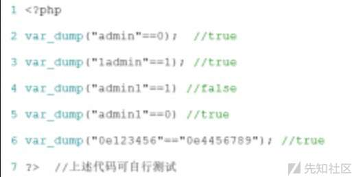
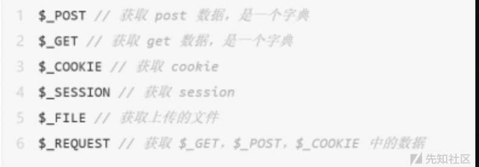

web 题型解题技巧

- - -

# web 题型解题技巧

## 思路讲解

### 工具集：

基础工具：Burpsuite、python、firefox(hackbar，foxyproxy，user-agent，swither等)

\*\*\*了解Burpsuite的使用方式、firefox(hackbar，foxyproxy，user-agent，swither等)插件的使用给漏洞挖掘带来便利。

扫描工具：nmap，nessus，openvas

\*\*\*了解nmap等扫描工具的使用。

sql注入工具：sqlmap等

```plain
***注入在CTF WEB中比较常见，通过暴库找到flag
```

xss平台：xssplatfrom，beef

```plain
***利用xss弹cookie的方式弹出flag
```

文件上传工具：cknife

文件包含工具：LFlsuite

暴力破解工具：burp暴力破解模块，md5Crack，hydra

### 常用套路总结

#### 直接查看网页源码，即可找到flag

考察基本的查看网页源代码、HTTP请求、修改页面元素等。

这些题很简单，比较难的比赛应该不会单独出，就算有因该也是Web的签到题。

实际做题的时候基本都是和其他更复杂的知识结合起来出现。

姿势：恶补基础知识就行

\*\*\*按F12就都看到了，flag一般都在注释里，有时候注释里也会有一条hint或者是对解题有用的信息。

#### 查看http请求/响应

使用burp查看http头部信息，修改或添加http请求头（referer–来源伪造，x-forwarded-for–ip伪造，user-agent–用户浏览器，cookie–维持登陆状态，用户身份识别）

可以用hackbar，有的也可以写脚本

#### HTTP头相关的题目

主要是查看和修改HTTP头。

姿势：不同的类型有不同的利用方法，基本都离不开抓包，有些简单的也可以利用浏览器F12的网络标签解决。但是最根本的应对策略，是熟悉一些常见请求头的格式、作用等，这样考题目的时候就很容易知道要怎么做了。查看相应头有时候响应头里会有hint或者题目关键信息，也有时候会直接把flag放在响应头里给，但是直接查看响应头拿flag的题目不多，因为太简单了。知识查看的话，可以不用抓包，用F12的“网络”标签就可以解决了。

#### 修改请求头、伪造Cookie

常见的有set-cookie、XFF和Referer,总之考法很灵活，做法比较固定，知道一些常见的请求头再根据题目随机应变就没问题了。有些题目还需要伪造cookie，根据题目要求做就行了。可以用Burp抓包，也可以直接在浏览器的F12“网络”标签里改。

#### ctf之流量分析

流量分析中wireshark的使用，详见下方。

#### web源码泄漏

##### vim源码泄漏(线上CTF常见)

如果发现页面上有提示vi或vim，说明存在swp文件泄漏，地址：/.index.php.swp或index.php~

##### 恢复文件 vim -r index.php，备份文件泄漏

地址：index.php.bak，www.zip，htdocs.zip，可以是zip，rar，tar.gz，7z等

##### .git源码泄漏

地址：[http://www.xxx.com/.git/config，工具：GitHack，dvcs-ripper](http://www.xxx.com/.git/config%EF%BC%8C%E5%B7%A5%E5%85%B7%EF%BC%9AGitHack%EF%BC%8Cdvcs-ripper)

##### svn导致文件泄漏

地址：[http://www/xxx/com/.svn/entries，工具：dvcs-ripper，seay-svn](http://www/xxx/com/.svn/entries%EF%BC%8C%E5%B7%A5%E5%85%B7%EF%BC%9Advcs-ripper%EF%BC%8Cseay-svn)

##### Git源码泄露

flag一般在源码的某个文件里，但也有和其他知识结合、需要进一步利用的情况，比如XCTF社区的mfw这道题。姿势：GitHack一把梭

##### 编码和加解密，各类编码和加密

可以使用在线工具解密，解码

##### windows特性，短文件名

利用～字符猜解暴露短文件/文件夹名，如backup-81231sadasdasasfa.sql的长文件，其短文件是backup~1.sql，iis解析漏洞，绕过文件上传检测

##### php弱类型

php弱类型在下方涉及。

##### PHP伪协议

在CTF中经常出现，也经常跟文件包含，文件上传，命令执行等漏洞结合在一起。

php伪协议在下方涉及。

##### 绕waf

大小写混合，使用编码，使用注释，使用空字节

##### python爬虫信息处理

这类题目一般都是给一个页面，页面中有算式或者是一些数字，要求在很短的时间内求出结果并提交，如果结果正确就可以返回flag。

因为所给时间一般都很短而且计算比较复杂，所以只能写脚本。这种题目的脚本一般都需要用到requests库BeauifulSoup库（或者re库（正则表达式）），个人感觉使用BeautifulSoup简单一些。

姿势：requests库和BeautifulSoup库熟练掌握后，再多做几道题或者写几个爬虫的项目，一般这类题目就没什么问题了。主要还是对BeautifulSoup的熟练掌握，另外还需要一点点web前端（html）的知识。

##### PHP代码审计

代码审计覆盖面特别广，分类也很多，而且几乎什么样的比赛都会有，算是比较重要的题目类型之一吧。

姿势：具体问题具体分析，归根结底还是要熟练掌握PHP这门语言，了解一些常见的会造成漏洞的函数及利用方法等。

##### 数组返回NULL绕过

PHP绝大多数函数无法处理数组，向md5函数传入数组类型的参数会使md5()函数返回NULL（转换后为False），进而绕过某些限制。如果上面的代码变成：

```plain
if(md5(a)===md5(b))
{ //两个等号变成三个
    echo $flag;
}
```

那么利用弱类型hash比较缺陷将无法绕过，这时可以使用数组绕过。传入?a\[\]=1&b\[\]=2 就可以成功绕过判断。这样的方法也可以用来绕过sha1()等hash加密函数相关的判断，也可以绕过正则判断，可以根据具体情况来灵活运用。

##### 正则表达式相关

ereg正则%00截断  
ereg函数存在NULL截断漏洞，使用NULL可以截断过滤，所以可以使用%00截断正则匹配。

Bugku ereg正则%00截断：[http://123.206.87.240:9009/5.php](http://123.206.87.240:9009/5.php)

##### 数组绕过

正则表达式相关的函数也可以使用数组绕过过滤，绕过方法详见数组返回NULL绕过。

上面那道题也可以用数组绕过。

##### 单引号绕过preg\_match()正则匹配

在每一个字符前加上单引号可以绕过preg\_match的匹配，原理暂时不明。

##### 命令执行漏洞

assert()函数引起的命令执行

ssert函数的参数为字符串时，会将字符串当做PHP命令来执行。例如：assert(‘phpinfo()’)相当于执行

<?php phpinfo() ?>

##### XSS题目

这类题目会涉及到三种XSS类型，具体类型要根据题目来判断。一般都是向后台发送一个带有XSSPayload的文本，在返回的Cookie中含有flag，解法是在XSS Payload。这类题目一般都会带有过滤和各种限制，需要了解一些常用的绕过方法。姿势：XSS归根结底还是JavaScript，JavaScript的威力有多大，XSS的威力就有多大。要知道一些常用的XSSPayload，还要把三类XSS的原理弄明白。做题时需要用到XSS平台，网上有公用的，也可以自己在VPS上搭一个。

JavisOJ babyxss：[http://web.jarvisoj.com:32800/](http://web.jarvisoj.com:32800/)

##### 绕过waf

其实绝大多数比较难的题目多多少都会对输入有过滤，毕竟在现实的网络中肯定是会对输入进行限制的，但是这里还是把过滤单独列出来了。姿势：多掌握一些不同的绕过方法。

##### 长度限制

有些题目会要求输入较长的文本，但对文本的长度进行了限制。对于这种题目，既可以用BurpSuite抓包改包绕过，也可以直接在F12里改页面源代码。

##### Bugku 计算器（修改页面源代码）：[http://123.206.87.240:8002/yanzhengma/](http://123.206.87.240:8002/yanzhengma/)

DVWA 存储型XSS的标题栏会对长度进行限制，使用BurpSuite抓包绕过。

##### 双写

双写可以绕过对输入内容过滤的单次判断，在XSS、SQL注入和PHP代码审计的题目中比较常见。双写顾名思义就是将被过滤的关键字符写两遍，比如，如果要添加XSSPayload，又需要插入HGAME2019有一道XSS题目就是过滤了

##### 等价替代

就是不用被过滤的字符，而使用没有被过滤却会产生相同效果的字符。比如，如果SQL注入题目中过滤了空格，可以用/\*\*/绕过对空格的限制

##### URL编码绕过

如果过滤了某个必须要用的字符串，输入的内容是以GET方式获取的（也就是直接在地址栏中输入），可以采用url编码绕过的方式。比如，过滤了 cat，可以使用 c%61t来绕过。

##### Linux命令使用反斜杠绕过

在Linux下，命令中加入反斜杠与原命令完全等价。例如，cat与 ca\\t两条命令等价，效果完全相同。可以利用这个特性来进行一些绕过操作（当然，这个**仅限于命令执行漏洞**）。

##### URL二次解码绕过

这个类型本来应该放在代码审计里面，但是既然是一种绕过过滤的姿势，就写在这里了。如果源码中出现了urldecode()函数，可以利用url二次解码来绕过。以下是一些常用的HTML URL编码：

##### 数组绕过

详见PHP代码审计的“数组返回NULL”绕过。数组绕过的应用很广，很多题目都可以用数组绕过。

##### SQL注入

SQL注入是一种灵活而复杂的攻击方式，归根结底还是考察对SQL语言的了解和根据输入不同数据网页的反应对后台语句的判断，当然也有sqlmap这样的自动化工具可以使用。姿势：如果不用sqlmap或者是用不了，就一定要把SQL语言弄明白，sqlmap这样的自动化工具也可以使用。

##### 使用sqlmap

sqlmap的应用范围还不大明确，我都是如果sqlmap没法注入就手工注入。

sqlmap教程：[https://www.jianshu.com/p/4509bdf5e3d0](https://www.jianshu.com/p/4509bdf5e3d0)

## 理论基础

### **php弱类型**

\== 与 ===

[](https://xzfile.aliyuncs.com/media/upload/picture/20240115101906-7567fc9a-b34c-1.jpg)

\=== 在进行比较的时候，会先判断两种字符串的类型是否相等，再比较

\== 在进行比较的时候，会先将字符串类型转化成相同，再比较

如果比较一个数字和字符串或者比较涉及到数字内容的字符串，则字符串会被转换成数值并且比较按照数值来进行

**这里明确了说如果一个数值和字符串进行比较的时候，会将字符串转换成数值**

[](https://xzfile.aliyuncs.com/media/upload/picture/20240115101839-659d58f0-b34c-1.jpg)

1 观察上述代码，"admin"==0 比较的时候，会将admin转化成数值，强制转化,由于admin是字符串，转化的结果是0自然和0相等

2 "1admin"==1 比较的时候会将1admin转化成数值,结果为1，*而“admin1“==1 却等于错误，也就是"admin1"被转化成了0,为什么呢？？*

3 "0e123456"=="0e456789"相互比较的时候，会将0e这类字符串识别为科学技术法的数字，0的无论多少次方都是零，所以相等。

> 当一个字符串被当作一个数值来取值，其结果和类型如下:
> 
> 如果该字符串没有包含'.','e','E'并且其数值值在整形的范围之内，该字符串被当作int来取值，其他所有情况下都被作为float来取值，该字符串的开始部分决定了它的值，如果该字符串以合法的数值开始，则使用该数值，否则其值为0。
> 
> 所以就解释了"admin1"==1 =>False 的原因

#### **举例：**

##### **md5绕过(Hash比较缺陷)**

```plain
<?php
if (isset($_GET['Username']) && isset($_GET['password'])) 
{
    $logined = true;
    $Username = $_GET['Username'];
    $password = $_GET['password'];
    if (!ctype_alpha($Username)) {
        $logined = false;
    }
    if (!is_numeric($password)) {
        $logined = false;
    }
    if (md5($Username) != md5($password)) {
        $logined = false;
    }

    if ($logined) {
        echo "successful";
    } else {
        echo "login failed!";
    }
}
?>
```

> 这段代码是一个简单的登录验证逻辑。它检查是否传递了 `Username` 和 `password` 参数，如果有，则进行以下步骤：

1.  将 `logined` 变量设置为 `true`。
2.  从 `$_GET` 超全局数组中获取 `Username` 和 `password` 的值。
3.  如果 `Username` 不全是字母，则将 `logined` 设置为 `false`。
4.  如果 `password` 不是数值类型，则将 `logined` 设置为 `false`。
5.  如果经过 MD5 加密的 `Username` 不等于经过 MD5 加密的 `password`，则将 `logined` 设置为 `false`。
6.  如果 `logined` 为 `true`，则输出 “successful”。
7.  如果 `logined` 为 `false`，则输出 “login failed!”。

这段代码的目的是验证用户输入的用户名和密码是否满足特定的条件，如果满足条件则认为登录成功，否则认为登录失败。

> 题目大意是要输入一个字符串和数字类型，并且他们的md5值相等，就可以成功执行下一步语句

上文提到过，**0e在比较的时候会将其视作为科学计数法，所以无论0e后面是什么，0的多少次方还是0。md5('240610708') == md5('QNKCDZO')**成功绕过!

介绍一批md5开头是0e的字符串

QNKCDZO

0e830400451993494058024219903391

s878926199a

0e545993274517709034328855841020

s155964671a

0e342768416822451524974117254469

s214587387a

0e848240448830537924465865611904

s214587387a

0e848240448830537924465865611904

s878926199a

0e545993274517709034328855841020

s1091221200a

0e940624217856561557816327384675

s1885207154a

0e509367213418206700842008763514

#### **json绕过**

## **ctf中php常见的考点**

### **1**.**系统变量**

[](https://xzfile.aliyuncs.com/media/upload/picture/20240115101721-36fdd1be-b34c-1.jpg)

### **2**.**错误控制运算符**

PHP 支持一个错误控制运算符：@。当将其放置在一个PHP 表达式之前，该表达式可能产生的任何错误信息都被忽略掉。

### **3**.**变量默认值**

当定义一个变量，如果没有设置值，默认为0

### **4.$\_GET 和 $\_POST**

[http://ctf4.shiyanbar.com/web/false.php?name\[\]=a&password\[\]=b](http://ctf4.shiyanbar.com/web/false.php?name[]=a&password[]=b)

如果 GET 参数中设置 name\[\]=a，那么 $\_GET\['name'\] = \[a\]，php 会把 \[\]=a 当成数组传入， $\_GET 会自动对参数调用 urldecode。

$\_POST同样存在此漏洞，提交的表单数据，user\[\]=admin，$\_POST\['user'\] 得到的是\['admin'\] 是一个数组。

### **5**.**内置函数的松散性**

#### **strcmp**

strcmp 函数的输出含义如下:

```plain
如果 str1 小于 str2 返回 < 0；

如果 str1 大于 str2 返回 > 0；

如果两者相等，返回 0。
```

```plain
$array=[1, 2, 3];

// 数组跟字符串比较会返回 0

//这里会输出 null，在某种意义上 null 也就是相当于 false，也就是判断为相等

var_dump(strcmp($array, 'abc'));
```

#### **sha1 和 md5 函数**

md5 和 sha1 无法处理数组，但是 php 没有抛出异常，直接返回 fasle

```plain
sha1([]) === false

md5([]) === false
```
