windows基线排查

- - -

# windows基线排查

## 1.什么是安全基线

实现基本防护需求而制定的一系列基准，通过对系统生命周期不同阶段的安全检查，建立良好的安全配置项和安全措施，通过分析安全状态的变化趋势控制安全风险

## 2.windows服务器安全基线

### （1）账户与认证

### 1.不能存在空密码账户

net user 用户

[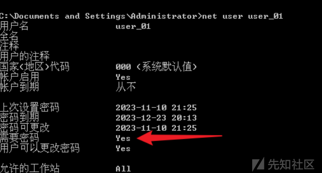](https://xzfile.aliyuncs.com/media/upload/picture/20240117111202-2f567c0e-b4e6-1.png)

### 2.管理缺省账户

-   对于管理员账户应使用非缺省账户名称，就是默认administrator名字改掉。
-   禁用guest（来宾）账户

操作步骤：

<1> net localgroup administrators ---确认除administrtor外还有没有其他重命名管理员账户

[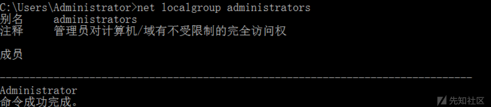](https://xzfile.aliyuncs.com/media/upload/picture/20240117111237-4400a8aa-b4e6-1.png)  
如果没有：net user user\_01 123.com /add && net localgroup administrators user\_01 /add

[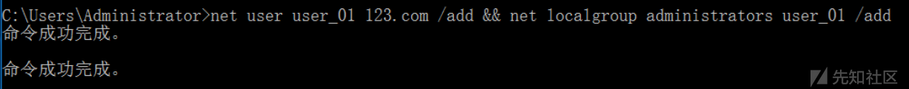](https://xzfile.aliyuncs.com/media/upload/picture/20240117111253-4d92739e-b4e6-1.png)  
禁用administrator和guest用户

net user administrator /active:no

net user guest /active:no

[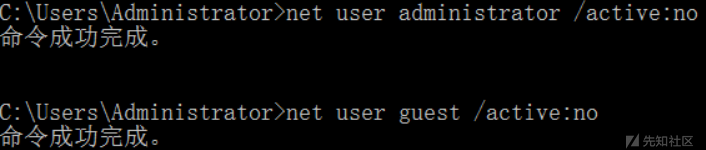](https://xzfile.aliyuncs.com/media/upload/picture/20240117111309-5722c90e-b4e6-1.png)

### 3.限制登录密码

打开组策略编辑器\[win+r+gpedit.msc\]

[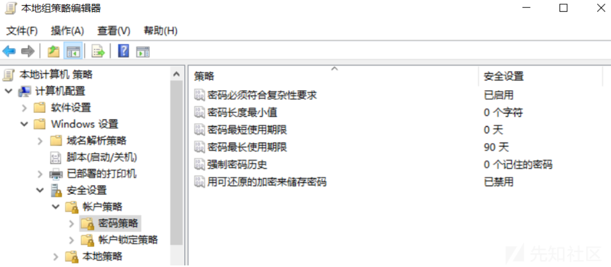](https://xzfile.aliyuncs.com/media/upload/picture/20240117111325-610a2b60-b4e6-1.png)

### 4.限制账户锁定阈值

（试错次数-防止暴力破解）

[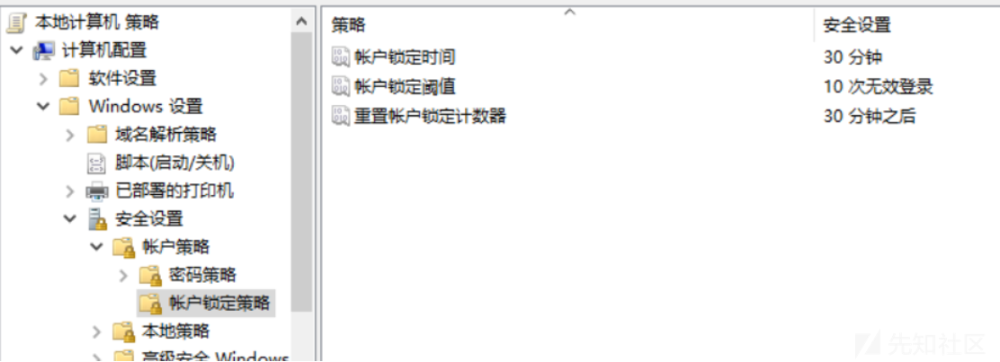](https://xzfile.aliyuncs.com/media/upload/picture/20240117111416-7f835f58-b4e6-1.png)

### 5.限制非管理员权限

除管理员组外无远程关机权限（控制面板-->管理工具-->本地安全策略）

[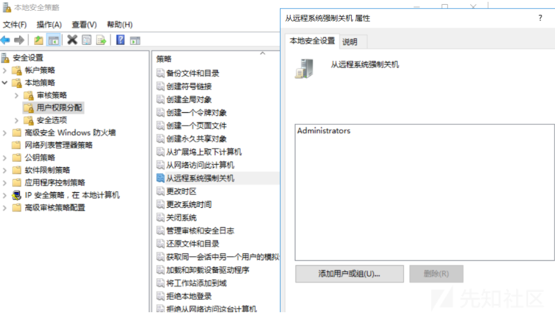](https://xzfile.aliyuncs.com/media/upload/picture/20240117111438-8c184e36-b4e6-1.png)

[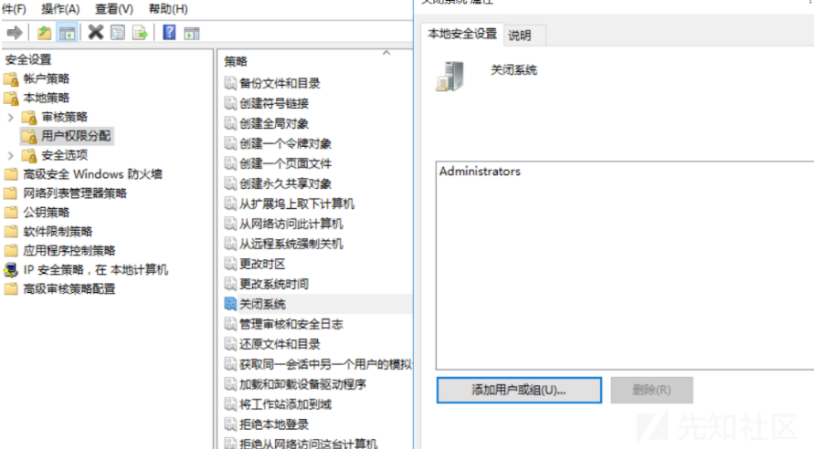](https://xzfile.aliyuncs.com/media/upload/picture/20240117111446-90edaff0-b4e6-1.png)

### （2）日志

### 审核登录事件

控制面板-->管理工具-->本地安全策略

[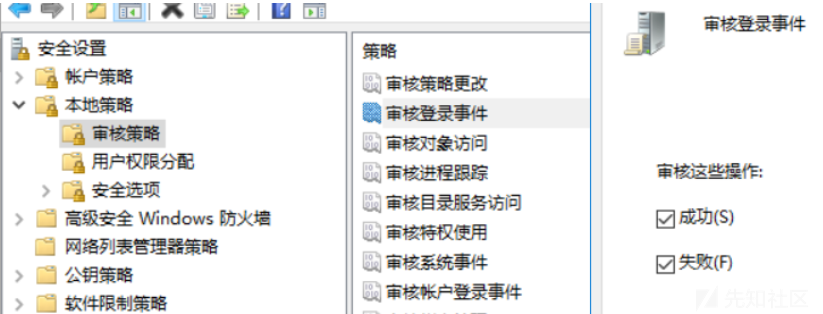](https://xzfile.aliyuncs.com/media/upload/picture/20240117111459-98a21010-b4e6-1.png)

[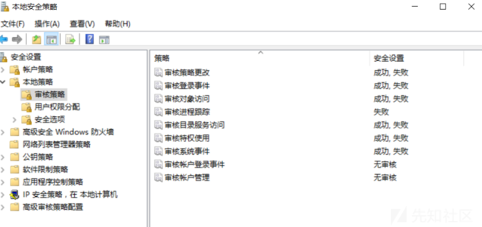](https://xzfile.aliyuncs.com/media/upload/picture/20240117111507-9d87c2c8-b4e6-1.png)

### 配置日志文件大小

设置日中文件至少为8192KB

控制面板->管理工具->事件查看器，在“Windows日志”中：查看“应用程序日志” ”系统日志“ ”安全日志“属性中的日志大小，以及设置当达到最大日志尺寸时的相应策略

[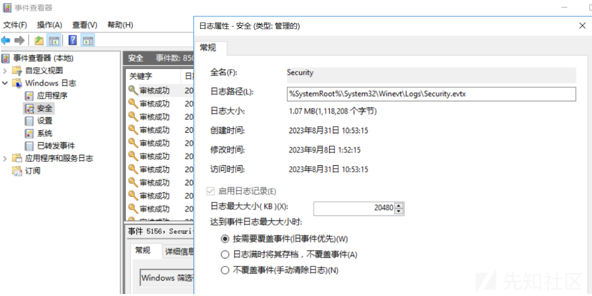](https://xzfile.aliyuncs.com/media/upload/picture/20240117111823-1295248e-b4e7-1.png)

### （3）入侵防范与访问控制

### 1.共享文件夹限制

计算机管理->系统工具->共享文件夹->共享

查看每个自定义共享文件夹的权限，若包含”Everyone",则将其删除

[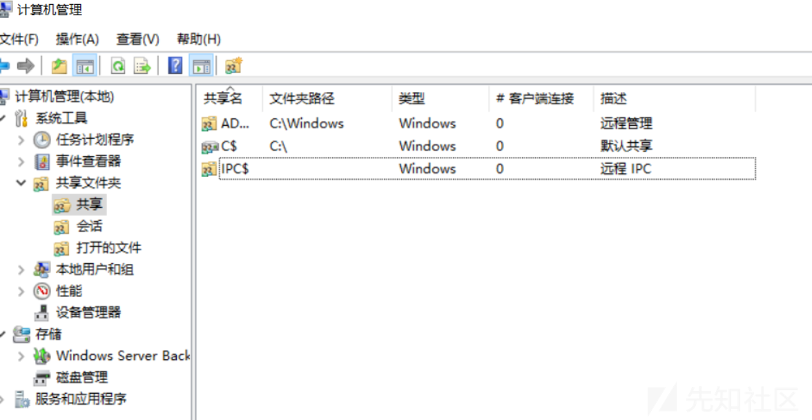](https://xzfile.aliyuncs.com/media/upload/picture/20240117111840-1c70c846-b4e7-1.png)

### 2.修改远程桌面服务端口管理

可在以下两个路径找到portnumber  
开始->运行->Regedit，查找注册表项:HKEY\_LOCAL\_MACHINE\\SYSTEM\\CurrentControlSet\\Control\\Terminal Server WinStations\\RDP.Tcp或者 HKEY\_LOCAL\_MACHINE\\SYSTEM\\CurrentControlSet\\Control\\TerminalServer\\Wds\\rdpwd\\Tdstcp 找到“PortNumber"子项，默认值00000D3D，是3389 的十六进制表示形式。切换到十进制，修改成除 3389 外的其他任何值，并保存新值，重新启动系统。

[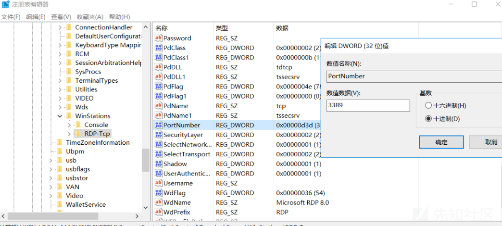](https://xzfile.aliyuncs.com/media/upload/picture/20240117112043-65fd3332-b4e7-1.png)

[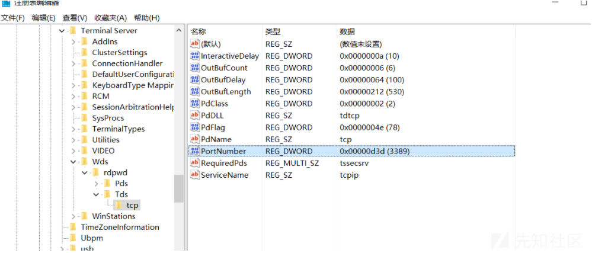](https://xzfile.aliyuncs.com/media/upload/picture/20240117112052-6b21fea6-b4e7-1.png)

### 禁止远程连接注册表

gpedit.msc 本地计算机策略->计算机配置->windows设置->安全设置->本地策略->安全选项 将“远程访问的注册表路径和子路径配置”为空

[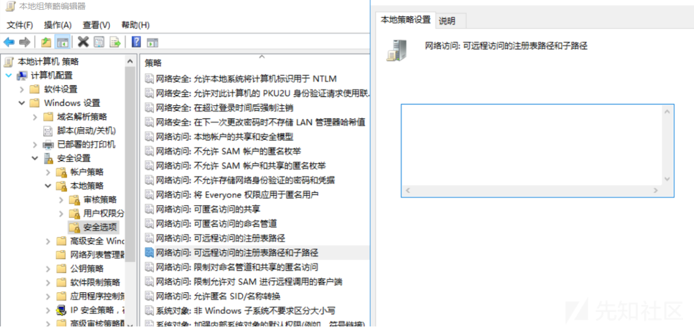](https://xzfile.aliyuncs.com/media/upload/picture/20240117112106-73ad90a8-b4e7-1.png)

### 安装杀软

免费： 360 火绒

付费：  
卡巴斯基。品牌指数: 10  
比特梵德/BitDefende。品牌指数: 9.8。  
Avast。品牌指数:9.6。  
Norton诺顿。品牌指数: 9.4  
Avira小红伞。品牌指数: 9.2。  
GData歌德塔。品牌指数: 9  
NOD32。品牌指数: 8.8。  
芬氏安全/F-Secure。品牌指数: 8.6。  
趋势。品牌指数: 8.4.  
MCAFEE。品牌指数: 8.2.

### （4）系统服务

### 1.关闭不必要的系统服务

操作步骤:  
。 进入“控制面板>管理工具->计算机管理”，进入“服务和应用程序”，查看所有服务，建议关闭以下服务:  
。 Error Reporting Service、错误报告服务  
。 Computer browser 浏览局域网计算机列表  
。 Print Spooler 打印队列服务  
。 Remote Registry 远程注册表操作  
。 Routing and Remote Access 路由与远程访问  
。 Shell Hardware Detection 为自动播放硬件事件提供通知  
。 Telnet 远程管理  
。 TCP/IP NetBIOS Helper 允许客户端共享文件，打印机和登录到网络

### （5）系统更新

系统自动更新安全补丁---打开windows更新即可

### （6）基线排查脚本【宝藏】

windows下的基线检查就是基于注册表表项进行检查，如果windows组策略有些不存在于注册表中，就要用到组策略命令行工具secedit

以下两个脚本需存放在同一目录下以管理员身份运行（脚本文件于附件中）  
security.inf  
bulid\_security\_Strategy.bat

window基线排查脚本.zip (0.002 MB) [下载附件](https://xzfile.aliyuncs.com/upload/affix/20240117112833-7e362516-b4e8-1.zip)
