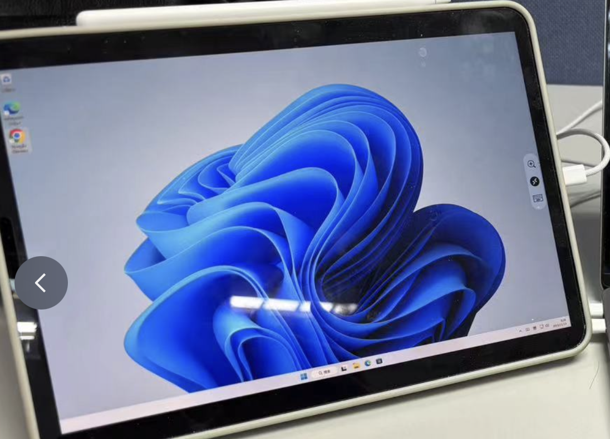
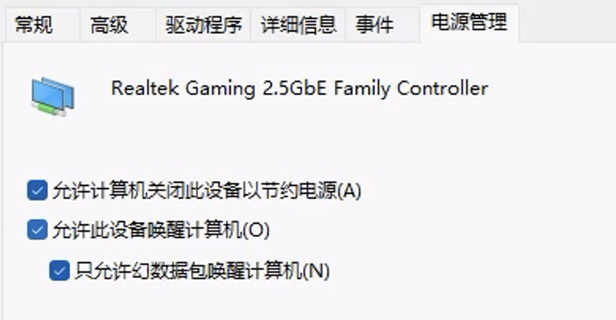
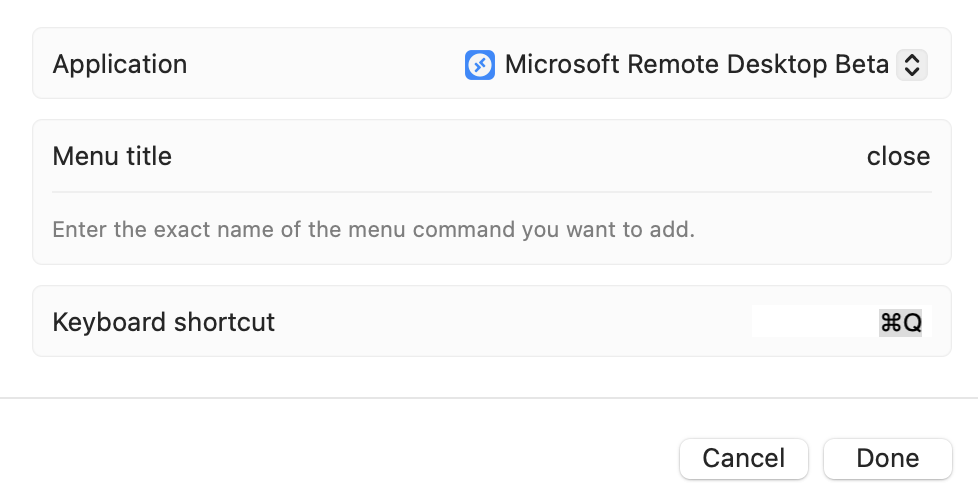

# 一份 macOS / iOS 远程使用 Windows 操作系统的笔记 - 少数派

**Matrix 首页推荐** 

[Matrix](https://sspai.com/matrix) 是少数派的写作社区，我们主张分享真实的产品体验，有实用价值的经验与思考。我们会不定期挑选 Matrix 最优质的文章，展示来自用户的最真实的体验和观点。

文章代表作者个人观点，少数派仅对标题和排版略作修改。

- - -

## 一、写在前面

作为 MacBook 十年老用户，让我换 Windows 电脑是很难的。但我有时又确实需要 Windows 软件，这种时候常常就需要用到虚拟机或模拟器。目前，虚拟 Windows 操作系统的应用程序，我用过付费的 Parallels Desktop 和免费版的 UTM；直接运行 Windows 软件而无需安装操作系统的，我用过付费的 CrossOver 和免费的 Whisky。有时不能用，有时不好用，费的心思很多，实际效果有限，且每年都得重新付费以获得更新。每次运行新软件，最难受的地方莫过于在几个软件中来回切换尝试，控制变量找问题，更新也未必总是解决问题，而可能是创造新的困难。

最近买了一台迷你主机，决定彻底解决这个问题，方法也很直观——用 MacBook 远程访问放在家里的 Windows 11 操作系统主机即可。一番折腾之后，实际效果不错。现在，我不论在家或在外，只要有网，就可以远程打开家里的电脑主机，用更为熟悉的 MacBook 键盘、触控板和屏幕远程使用 Windows 操作系统。

一个额外的惊喜是，在 iPad 上打开相同的远程控制软件时，我的 iPad 变成了 Windows 平板，可以触屏，可以使用 Apple Pencil，利用 Mac 和 iPad 的通用控制，还可以使用 Mac 的键鼠和触控板。



我的 Windows 平板（伪）

写这篇文章，一方面是记录实现的过程，以便于我在未来搬家 / 换路由器 / 换网时能够回忆起这番操作；另一方面，也分享一下方法，给有兴趣采用同样方案使用 Mac 和 Windows 的读者一点参考，了解其实现的复杂度，以及实现后仍然存在的缺憾。

本文分享的经验对以下读者可能有帮助：

-   在家/单位拥有 Windows 操作系统电脑，但在外常用 MacBook 笔记本或 iPad 移动办公；
-   已经拥有以上的任意一种，犹豫是否需要补上另一种，犹豫的原因之一是，macOS 和/或 iPadOS 系统相较于 Windows 操作系统缺少某些功能或无法兼容某些软件，在一些时候不得不使用 Windows 系统；
-   理论上，被访问的主机为 Linux 或者其他版本的 Windows 操作系统，访问的客户端是 Windows 系统或 Android 系统等情况，也可以通过类似的方式实现；
-   我理解，其中的一部分操作，比如远程连接和远程唤醒，对于搭建家庭 NAS 也是适用的。如果未来要搭建 NAS，或许可以考虑先尝试一下实现 Windows 远程桌面。

需要说明的是，我并非专业人士，以下过程纯粹是摸索而来。同时，这篇文章不会特别详细地介绍每一步的实现，而是更像一个步骤清单。对于类似我这样纯粹的外行来说，可能会一次性看到不少陌生名词。这么做的原因在于，一方面，本文所写的内容，基本上都可以在互联网上找到大量教程，只是未必有这么集中，没有必要在这篇文章中再复述一遍，对于不理解的名词或不了解具体操作，可以通过文章里的关键词来检索；另一方面，实现的路径上可选的方案众多，每个人所处的网络环境和路由器也有所不同，具体的操作步骤可能因实际环境而异，也就没有必要在一篇文章里写尽。

不过，我会尽量列出我在摸索过程中看到的各种方法，哪怕是我没有实际尝试采用的那些。

## 二、整体清单

综合来看，实现远程桌面需要完成以下四步：

-   第一步，在局域网内实现 Windows 远程桌面，这个过程需要 Windows 10 / 11 专业版或其他支持远程桌面的版本，以及访问远程桌面的软件；
-   第二步，在外网访问 Windows 远程桌面，这个过程需要公网 IP，桥接（可选），可能需要使用 DDNS，并开启 DMZ，或端口转发，或 upnp；或干脆用其他方式实现内网穿透；
-   第三步，在外网远程开机 / 唤醒 Windows 主机，这个过程可能需要支持 WoL 的路由器，或手写脚本，或其他 app，或开机棒、智能插座等其他替代方案；
-   第四步，进一步优化体验，比如图形性能，比如统一远程桌面与 macOS 操作系统的快捷键。

而为了实现以上全部目标，可能至少需要以下硬件设施：

-   MacBook 或 iPad 或 iPhone；
-   安装 Windows 操作系统的主机；
-   路由器，网线；
-   显示器，鼠标。

此外，可能会额外需要：

-   显卡欺骗器 / 坏掉的显示器；
-   带 WoL 功能的路由器 / 开机棒 / 智能电源插座。

在实现目标的过程中，可能会用到以下软件 / 应用：

-   Microsoft Remote Desktop，或其他远程桌面软件；
-   路由器 app，或其他支持远程唤醒的 app；
-   路由器固件；
-   优化效果、提升性能的工具，比如英伟达为远程桌面提供的优化工具；
-   AutoHotkey，或其他快捷操作工具；
-   网盘工具；
-   自动操作（Automator）。

## 三、具体步骤

### （一）在局域网内访问远程桌面

为什么要在局域网内访问远程桌面？

除了这是进行下面的步骤的前置和测试以外，在局域网内访问远程桌面或许也是不少人的需求——比如，像我这样桌面空间不大，不愿意再展开一组屏幕键盘鼠标的人，可以用一台电脑使用两种操作系统，加上 iPad，选择就丰富至 3 个操作系统共享一套操控和 2 块屏幕（笔记本 + 平板）；比如，在家或单位想要将 Mac 或 iPad 作为 Windows 的扩展屏；再比如，想要躺在床上拿着 iPad 假装是 Windows 平板，偶尔运行一些负担较小的独立游戏或老游戏……

不过，以防你在没有看到最后一节就抱有过高期待地上手，需要提前说明的是，这种做法有性能损耗，特别是对显示要求较高的应用程序，效果上可能比主机差很多，因此远程桌面的效果，可能不如无线投屏。

以下正式开始：

一、首先需要在主机端打开远程桌面服务。对于 Windows 10 / 11 专业版 / 企业版的主机，打开设置-系统-远程桌面即可。对于家庭版用户以及其他的一些本身无法打开「远程桌面」的系统版本，有一些[方法](https://sspai.com/link?target=https%3A%2F%2Fgithub.com%2Fstascorp%2Frdpwrap)可以让你「解锁」这个功能，这种做法是否违反用户协议可见此[讨论](https://sspai.com/link?target=https%3A%2F%2Fgithub.com%2Fstascorp%2Frdpwrap%2Fissues%2F26)。

当然，一些其他的远程桌面软件并不依赖微软的远程桌面协议（RDP），那么也就不需要开启远程桌面的服务。

二、在 macOS 上下载 [Microsoft Remote Desktop（MRD）客户端](https://sspai.com/link?target=https%3A%2F%2Finstall.appcenter.ms%2Forgs%2Frdmacios-k2vy%2Fapps%2Fmicrosoft-remote-desktop-for-mac%2Fdistribution_groups%2Fall-users-of-microsoft-remote-desktop-for-mac)，在 app Store 下载 IOS 上同样可以下载到 Microsoft Remote Desktop 客户端（RD Client）。

三、令 Windows 主机和安装有 MRD 客户端的 Mac / IOS 设备处于同一局域网内，在 Windows 系统中找到「网络与 Internet 设置」，或打开路由器设置页面，或其他网络工具，查看该 Windows 主机的 IP 地址（大概率是形如 192.168.x.x 的内网地址）。

四、打开 MRD 客户端，添加桌面，在 PC name 位置填入上面的 IP 地址，在 User account 填写 Windows 用户的账户密码。如果主机没有设置用户登录密码（空白密码），那么可能需要在设置-账户-登录选项-密码的位置设置一个密码。或者在本地安全策略（secpol.msc）-本地策略-安全选项中禁用「使用空密码的本地账户只允许进行控制台登录」。考虑到将来的外网登录，我理解还是设置一个密码为好。

五、双击点开添加的桌面，可能会弹出证书验证，选择 Show Certificate，勾选 Always trust… 那一行字，之后点击 Continue 即可。

六、如果顺利进入 Windows 系统，那么这一步就完成了。可以右键点击该桌面选择编辑，进一步设置显示方案、共享文件夹等。其中，勾选 Optimize for Retina displays 可以在很大程度上提升在 Mac 上的显示效果，值得一试，但有可能会影响性能。

七、利用其他软件也可以实现远程桌面，这可能需要在主机端和客户端同时打开软件，登录同一个账号，或使用「投屏码」等。有些软件可能需要收费，就目前我体验的其他免费软件来看，使用效果均不如 MRD。

此外，部分实现远程桌面的软件，强制要求主机连接有显示器，如果没有显示器或不想在使用远程桌面时打开 Windows 的显示器，可以用一个便宜的显卡欺骗器或者坏掉的显示器来替代，笔记本则可以打开盖上不熄屏的模式。

### （二）在外网访问远程桌面

仅在局域网内使用毕竟不够「远程」，因此，接下来的目标是在外网访问 Windows 远程桌面。从这一节开始，路由器将成为折腾的重心，虽然最终实际的操作步骤不多，但要找到一条最适合自己的路径仍然需要一定的尝试。此外，本节开始涉及的公网访问等事项，是否存在以及存在多大风险，请自行判断。

从刚才的步骤可以看出，用 MRD 访问远程桌面使用的是 Windows 主机的 IP 地址，这个逻辑也适用于在外网远程访问桌面。不过，刚才我们查看到的地址，是一个形如「192.168.x.x」的内网 IP 地址，离开了局域网，就不可能根据这个地址定位到这台主机。因此，接下来一系列操作的最终目标，其实就是获得一个能够在外网定位到这台主机的地址。以下具体说明：

首先，最好的情况是有一个**公网 IP**。有公网 IP，才能够在外网与家里的主机通信。并不是所有的家庭都有公网 IP，网上可以找到很多判断家里是否公网 IP 的方法。其中最简单的是在浏览器搜索本机 IP（注意搜索时不要使用代理），将看到的结果与登录路由器设置页面查看到的 WAN IP 对比，二者一致意味着有公网 IP。需要注意的是，如果你家里同时有光猫和路由器，需要分别登录二者的路由器设置界面看。进入路由器设置页面的地址、账号和密码一般就贴在路由器上。

如果你没有公网 IP，那么就需要向运营商申请，具体方式可以上网搜索。如果你无法申请到公网 IP，那么可能就只能搜索「内网穿透」，通过其他方式来实现在没有公网 IP 的情况下，从外网访问家里的一个主机。但这有可能需要额外租用服务器，产生费用。

在有公网 IP 的前提下，下面我先介绍我自己的具体方案，后面再列举我了解到的其他方案：

-   分别查看光猫和路由器的 WAN IP，发现光猫的 WAN IP 为我的公网 IP。这也说明我家里的光猫采用的是「路由模式」，也就是光猫同时起到了路由器的功能。因此，连接光猫的路由器只分配到了内网 IP，其 WAN IP 地址同样为形如「192.168.x.x」的内网 IP。
-   联系运营商工作人员，要到了光猫的超级管理员账号密码，以及上网的账号密码。在光猫的路由器设置界面修改状态为「桥接模式」。然后在路由器设置页面，修改 WAN 联机类型为 PPPOE，输入账号和密码，拨号上网。重启路由器后，可以看到路由器的 WAN IP 已经变化为公网 IP。
-   但是，重启路由器后看到的公网 IP，与之前在光猫看到的 WAN IP 不同，意味着这是一个动态 IP，每次重启都可能带来新的 IP 地址，这显然不利于外网访问。因此，在路由器设置页面，启动 DDNS（动态 DNS）并注册一个网址，这个固定的地址将被解析为我当下的公网 IP 地址。
-   接下来，设置端口转发 / 端口映射。目的是将主机的某个端口映射到路由器的一个端口上，这样，通过公网 IP 这个端口的通信，就能够被自动转发到被指定的这台主机的端口上。具体操作上，在路由器设置页面，启用端口转发，通信协议选择 BOTH（TCP 和 UDP），外部端口随便填写一个数字，内部端口填写 3389，这是 Windows 远程桌面的默认端口，可以在系统内需改，本地 IP 地址填写 Windows 主机 IP。
-   接下来，在任意一个 MRD 客户端上，添加一个新的远程桌面，地址不再是之前的内网 IP，而是「注册的 DDNS 服务域名 : 外部端口号」。使用流量或在外网双击该远程桌面，发现同样能够正常进入 Windows 主机。至此，这一步就完成了。

在有公网 IP 的前提下，实现「获得一个能够在外网定位到 Windows 主机的地址」这一目的，显然不只有我上面的操作方法，同样是光猫（路由模式）-路由器的情况下，至少还有如下路径：

-   两次端口转发。在光猫上，将外网 IP 的某个端口（比如3000），与路由器的一个端口（比如3500）建立端口转发，再将路由器的这个端口（3500），与 Windows 主机的远程桌面端口（3389）建立端口转发。那么，理论上也就可以通过「公网 IP 地址：3000」的形式访问该 Windows 主机。但这么做让我不能够正常开启路由器的 DDNS 功能，不确定是否有解决办法。
-   设置 DMZ 主机。DMZ 相当于映射所有端口，将主机暴露在公网上，因此，在光猫和路由器上分别设置 DMZ 主机，也当然可以实现从外网访问 Windows 主机的端口。
-   设置 UPnP。看定义为「通用即插即用」，我对此没有仔细研究，大意应该也是暴露所有端口。
-   以上端口转发、DMZ 和 UPnP，以及前面提到的桥接模式，理论上可以在光猫和路由器上有不同的组合，比如在光猫上设置路由器为 DMZ 主机，再在路由器上做端口转发。相关风险大小，请自行判断。
-   为了避免动态 IP 带来的问题，一般都需要设置 DDNS，让原来的会变化的公网 IP 地址变成一个固定的网址。

### （三）在外网远程开机

如果你尝试了上面的局域网访问和远程访问 Windows 主机，你应该已经发现了一个问题，那就是当主机处于关机或睡眠状态时，远程桌面是无法正常打开的。对此，有两个选择，第一，让主机 24\*7 开机，但这不苹（huan）果（bao），可能对于一些其他的需求，比如搭建服务器是适用的；第二，想办法远程打开计算机，也就是实现远程唤醒 Wake-on-LAN（WoL）。

在这一节中，有一些需要被访问主机的 BIOS 和路由器支持才能够实现的功能，也因为各家主板和路由器不同，这部分无法特别细致地说明。

首先先列出我**完全未尝试的方案**，倒不是因为不好用，只是因为需要额外付费，目前我已经通过其他方式基本解决，就没有进一步探索：

-   购买「开机棒」类产品，连接路由器，远程通过这个设备唤醒家里的主机。
-   购买「智能插座」类产品，就是可以远程控制是否通电的插座，将主机设置为来电开机（应当需要 BIOS 支持），实现远程开机。
-   理论上，如果你能远程控制局域网内的一台常备的智能设备，那么有可能可以通过这台设备打开主机，比如说安卓手机。

下面是**我自己的实现方法**，其中的一些准备工作可能与上面的其他方式有重合，这些准备工作包括：

-   进入主机的 BIOS，打开有关网络唤醒（Wake on Lan）的选项，不同主板描述可能不同。这里提一嘴，我是没有键盘的，进入 BIOS 的方式是进入设置-Windows更新-高级选项-恢复-高级启动，而这个选项在使用 MRD 时是被屏蔽掉的。
-   运行（Win + R）「ncpa.cpl」打开「网络链接」，当然还有很多方式进入这个位置，包括控制面板和网络设置。右键其中的有线网卡，依次点击属性-配置-电源管理，打开「允许此设备唤醒计算机」和「只允许幻数据包唤醒计算机」，切换至「高级」标签，确定「关机 网络唤醒」、「魔术封包唤醒」等选项处于打开状态。这里不勾选「只允许幻数据包唤醒计算机」似乎也是可以的，但如此一来所有数据都可以唤醒 Windows 电脑，意味着其在连接网线时可能会永远保持唤醒状态，因此还是勾选比较好。



-   完成以上步骤，确定 Windows 主机以有线的方式连接路由器以后，理论上就可以通过各种方式远程唤醒电脑了。这些方法可能包括：路由器网络设置页面，路由器 app，其他第三方 app（比如 Fing）。通常来说，可以在设置页面和 app 中类似「网络工具」的选项里找到唤醒网络的选项，此时需要输入有线网卡的 MAC 地址。这个地址可以在很多地方找到，包括但不限于路由器设置页面和 app 的连接详情，或运行（Win + R）「cmd」打开「命令提示符」，输入「ipconfig -all」查看。需要特别注意的是有线网卡与无线网卡的 MAC 地址是不同的，需要的是有线网卡的 MAC 地址，以下提到 MAC 地址时也都默认如此。
-   在局域网内成功唤醒 Windows 主机后，下一步的问题是如何远程操作，在前面已经设置 DDNS 域名的情况下，路由器设置界面和路由器 app，一般都存在远程连接或允许远程访问路由器的设置，开启即可。第三方 app 或许也有类似的远程功能。这样一来，就可以在外网远程访问路由器选择网络唤醒 Windows 主机了。

虽然说是准备工作，但到上面位置已经能够实现远程唤醒了，只是我还不满意。原因是不管是 app 还是路由器设置页面的连接速度都很慢，需要等待路由器信息全部加载，并且唤醒功能藏得比较深，需要好几步操作，增加了唤醒的复杂度。因此，我想要用别的方式来唤醒。经历了前面这么多步骤，不难将两个事情联系到一起：其一，我可以从外网通过注册的 DDNS 服务域名 + 端口的方式与家里的主机通信；其二，要网路唤醒只需要向目标主机发送名为「幻数据包」的东西。从而，进一步地：

-   经过检索得知，幻数据包最简单的构成是 6 字节的 255（FF），连接上重复 16 次的目标计算机 MAC 地址，通常使用 UDP 协议发送，发送数据的端口一般是9。此外，python 的 scocket 库，终端 / 命令行里的 netcat 命令可以用来发送和读取 UDP 数据。实际操作的时候，我在主机端用 netcat 监听（Windows 11 需要另外下载，还会被报有威胁），在客户端 macOS 上写 python 的快捷操作。
-   在已经设置好 DDNS 的情况下，增加一个端口转发，外部端口随意，内部端口为 9，本地 IP 地址填写 Windows 主机 IP。在此基础上，还需要设置 ARP，绑定被远程访问主机的内网 IP 地址和其 MAC 地址，虽然静态 DHCP 也有这个作用，但对于远程唤醒主机是无效的。如果路由器没有提供 ARP 设置的功能，可能需要通过 ssh 命令登录路由器，输入 `arp -s IP MAC地址`  来绑定，但这个绑定会在路由器重启后失效，要么每次重新输入，要么想办法设置路由器开机启动这个脚本。这部分内容因路由器而异，可能需要刷固件等，请自行检索。
-   接下来是客户端的操作，在 macOS 上打开自动操作（Automator），新建一个快捷操作（Quick Action），添加一个运行 Shell 脚本（Run Shell Script）。Shell 选择 python，最上方我选择收到 no input，位于访达（Finder.app）和 MRD，这样就可以在这两个应用的服务（Services）位置中找到这个保存的快捷操作。我的代码如下：

```python
import socket

IP = 't.a.com' #此处填写公网 IP 或注册的 DDNS 服务域名
MAC = 'AA-AA-AA-AA-AA-AA' #此处填写 MAC 主机地址
PORT = 3999 #此处填写前面设置的端口转发外部端口
packet = bytes.fromhex("F" * 12 + MAC.replace(MAC[2], "") * 16)

with socket.socket(socket.AF_INET, socket.SOCK_DGRAM) as s:
  s.setsockopt(socket.SOL_SOCKET, socket.SO_BROADCAST, 1)
  s.sendto(packet, (IP, PORT))
```

-   运行上面的快捷操作，可以实现远程唤醒的功能。但实际使用的时候，我发现用 socket 解析 DDNS 服务域名得到的 IP 有时会延迟，得到的是上一个动态 IP 地址，特别是在路由器重启以后，有时更新比较慢。为此，我又写了一个可以手动输入 IP 的快捷操作，这个仅放在 MDR 软件上，偶尔使用，中间用到一个 Ask for Text 接收 IP 地址，这里也放出代码供参考：

Run Shell Script：

```python
# 这里将 socket 解析得到的 IP 地址传入到下一步去作为默认答案，以便于对比发现无法唤醒是否是地址解析问题。

import socket
de_ip = socket.gethostbyname('t.a.com') #此处填写公网 IP 或注册的 DDNS 服务域名
print(de_ip)
```

Ask for Text：

```null
输入实际 IP 地址：
$1
```

Run Shell Script：

```python
import sys
import socket

IP = sys.argv[1]
MAC = 'AA-AA-AA-AA-AA-AA' #此处填写 MAC 主机地址
PORT = 3999 #此处填写前面设置的端口转发外部端口
packet = bytes.fromhex("F" * 12 + MAC.replace(MAC[2], "") * 16)

with socket.socket(socket.AF_INET, socket.SOCK_DGRAM) as s:
  s.setsockopt(socket.SOL_SOCKET, socket.SO_BROADCAST, 1)
  s.sendto(packet, (IP, PORT))
```

### （四）进一步优化

到这一步为止，远程唤醒和远程访问均已实现，并且基本可以通过少量点击打开，速度上部分取决于 Windows 主机开机 / 唤醒速度和网速，已经相当可用。不过，实际使用中还是会遇到一些问题，优化永远在路上，这里简单写两点，一是显示方面的性能优化，二是快捷键。

MRD 使用 RDP 协议，运行时会虚拟一张名为 Microsoft Remote Display Adapter 的显卡，影响图形性能。网上很容易找到有关 RDP 优化的文章，具体效果请自行判断，我测试起来是有一些作用的：

-   打开组策略（gpedit.msc），依次选择计算机配置-管理模板-Windows 组件-远程桌面服务-远程桌面会话主机-远程会话环境，打开「将硬件图形适配器应用于所有远程桌面服务会话」，「配置远程桌面连接的 H.264 / AVC 硬件编码」等选项。
-   启动注册表编辑器（regedit），找到HKEY\_LOCAL\_MACHINE\\SYSTEM\\CurrentControlSet\\Control\\TerminalServer\\WinStations，修改或新建名为 DWMFRAMEINTERVAL 的 DWORD 值，修改数据为 15（10 进制下）。
-   N 卡用户可以去找英伟达官方提供的 nvidia-opengl-rdp 工具，以实现在 RDP 下使用 OpenGL 加速。

其次是快捷键，作为十年 MacBook 老用户，我早已习惯使用 macOS 系统快捷键，特别是大拇指位置的 Command 键的组合按键。在 MRD 下，微软还是比较贴心地提供了一些快捷键的，包括复制、剪切、粘贴、全选、撤销和搜索，但仍不够全。比如，我习惯于使用 Command + W 这个组合来关闭窗口 / 标签页，这在 MRD 下会直接关闭当前的远程桌面窗口，非常烦人，急需解决。总体来说，解决快捷键问题分为两步：


-   一方面，是修改 macOS 系统的快捷键，以上面提到的 Command + W 组合键为例，在设置中找到 Keyboard 选项卡内的 Keyboard Shortcuts…，选择 app Shortcuts，点加号，在 application 处选择 MRD，Menu title 手动填写 close，也就是原来 Command + W 的关闭功能，下面的 Keyboard shortcut 修改为其他组合键，我这里是修改为  Command + Q，也就是原来「退出」（quit）功能的案件。因为在我看来，使用 MRD 时，用  Command + Q 关闭当前远程桌面是比较符合我使用习惯的操作。



-   另一方面，是增加 Windows 的快捷键，除了解决与 macOS 系统冲突的部分，也要修改部分习惯的内容。这里我比较惊讶的是，Windows 系统居然不自带修改快捷键的功能，因此需要第三方软件，比如 autohotkey。这个工具看起来相当好用而小巧，却能够做除修改快捷键以外很多事情。这里我先学着修改快捷键。我创建了如下 ahk 脚本，修改了 command 和 W、S 以及上下箭头的组合功能，其中与上下箭头的组合功能仅在资源管理器中使用，然后将其快捷方式放入启动文件夹（Win + R 运行 `shell:startup` 即可打开）以开机自行启动。

```null
; Commad + w -> Ctrl + w
#w::
Send, ^w
return

; Commad + s -> Ctrl + s
#s::
Send, ^s
return

; 仅在使用资源管理器时
; Commad + ↑ -> Alt + ↑
#IfWinActive ahk_class ExploreWClass 
#Up::
#IfWinActive ahk_class CabinetWClass
#Up::
Send, !{Up}
return

; 仅在使用资源管理器时
; Commad + ↓ -> Enter
#IfWinActive ahk_class ExploreWClass
#Down::
#IfWinActive ahk_class CabinetWClass
#Down::
Send, {Enter}
return
```

## 四、仍有缺憾

通过远程桌面运行的，是完整的 Windows 系统，这是任何虚拟机和模拟器不能比拟的，但也说不上完美，至少在以下几个方面仍有缺憾：

-   第一，性能比不上本地运行，但这是废话。
-   第二，受网络影响，虽然现在有 5G 信号，但相比于虚拟机，总体还是受限于运行远程桌面的客户端所处的环境。
-   第三，主机和路由器位于家里 / 单位，一旦出了什么情况，有可能是无法远程修复的——按不了电源键，虚拟机也没有这个方面的问题。
-   第四，哪怕经过上面的各种处理，我已经尽量缩短了从远程启动到远程桌面的时间，但到运行具体的软件层面，比起虚拟机的融合模式，以及直接模拟运行 Windows 系统下的软件，体验上还是有差异。
-   第五，在使用 MDR 时，哪怕是在局域网，传输文件的速度都非常慢，对于大文件，最好还是需要一个不限速网盘。

尽管如此，我至少找到了一个在不用放弃 MacBook 的基础上，能够正常运行、调试各种 Windows 应用程序方案，给我在家和在外的系统多了一个选择。折腾还是有收获的。

 > 关注 [少数派公众号](https://sspai.com/s/J71e)，解锁全新阅读体验 📰

\> 实用、好用的 [正版软件](https://sspai.com/mall)，少数派为你呈现 🚀
