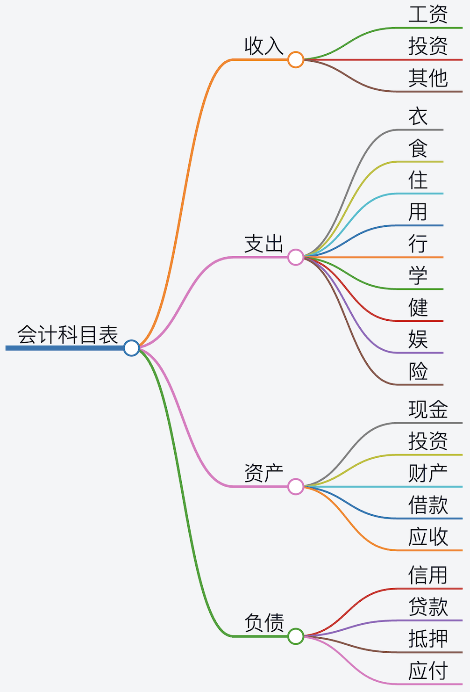

# 一文搞懂复式记账原理 - 少数派

  
我们不是财务人员也没有想要成为财务人员，为什么要学习复式记账？普通人学习复式记账有助于更好地管理个人财务，提高财务决策的准确性和效率。尽管复式记账最常见在企业会计中使用，但对普通人而言，它同样具有重要意义。了解复式记账可以帮助我们更好地应对生活中的财务挑战。无论是处理税务问题、理解贷款利率、还是财务规划，这些都需要对个人财务有清晰的认识和掌握。通过掌握复式记账的原理，普通人可以更有信心地面对各种财务情况，并做出更明智的财务决策。

复式记账听起来有点复杂，其实对于个人、家庭记账来说，并不需要像企业那样遵循很多繁琐的规定。相比企业会计，个人记账更加简单灵活，你可以用自己的方式处理。复式记账涉及到许多专业的会计概念，一开始可能会让人感到有些难以理解。我认为难点在于一般讲复式记账都是企业那一套，那确实复杂又有太多的细节，更加让人头疼的是大量的会计概念和我们平时的理解完全是不同的，与我们的日常生活有很大的距离，这也导致了普通人去学习复式记账的时候发现每个字都认识，但是却无法理解到底讲的是什么。我希望通过这篇文章用通俗易懂的语言，让你能够轻松理解复式记账的核心概念。

现代小学生所学习的数学知识在几百年前是少数精英或者专业数学家才能接触到的内容，然而现在我们的小学生都能够掌握，是我们现在的人比以前更聪明吗？我不觉得是这样，更可能是现在这些知识非常的普及，人们已经不认为这是什么高不可攀的东西了。我认为未来复式记账也会是这样，复式记账发展了四五百年，已经是非常成熟的一门学问了，这是一种高级的记账方式和思考方式，我们现代人都应该掌握。Beancount 的作者Martin Blais也说他认为在高中开始就应该教授学生复式记账的方法。

## **以物易物的交易**

艾莉

在原始社会，人们还没有发明货币，交易是通过以物易物的方式在小规模的群体中实现的。艾莉是一个部落的女手艺人，她非常善于制作陶器，她制作的陶器既美观又实用，人们都非常的喜欢。鲍薄是另一个部落的年轻小伙子，他善于用石头磨制石刀，部落里的人都非常喜欢用他做出的石刀。艾莉家养了十只鸡，鲍薄家养了一头牛，这是他们各自的财产。他们都希望通过自己的劳动能够积累更多的财富，让家里的生活越来越好。

| **艾莉的财产** | **鲍薄的财产** |
| --- | --- |
| 十只鸡 | 一头牛 |

艾莉一有空闲时间，就在自己家的作坊里开始制作陶器。鲍薄一有时间，就出外寻找合适的石材来打磨石刀。他们可以用各自的物品在部落间的小市场上交换各自所需要的物品。艾莉想要一把石刀来方便自己可以在陶器上雕刻一些花纹，这样更加的美观，会让更多的人喜欢自己的陶器。鲍薄也想获得一个陶罐来放自己寻找来的各种各样奇奇怪怪的石头收藏。

于是一天他们来到了小市场上，恰好发现了对方的物品，便聊了起来。经过他们的沟通和讨价还价，最终艾莉获得了 2 把精致锋利的石刀，而鲍薄获得了一个结实的陶罐。除此之外，鲍薄也想换只鸡来给他母亲补补身体，因此他和艾莉说了他的想法。但是艾莉觉得她不需要更多的石刀，鲍薄又没有其他可以交换的物品，因此她拒绝了鲍薄的提议。

但是鲍薄并没有放弃，他拿出了自己最好的 5 把石刀，跟艾莉说他可以用这 5 把最好的石刀和艾莉交换一只鸡，虽然艾莉目前用不上，但是她带回部落一定可以和其他人交换到她需要的物品。艾莉看了看这几把石刀，确实精美又锋利，她想到了自己部落里的几个人肯定会需要，因此就答应了鲍薄的请求。最终，他们对于各自交换得到的物品都非常的满意，各自回到了自己的部落。在这个过程中，发生了两笔交易，对于艾莉来说

| **时间** | **交易描述** |
| --- | --- |
| 3000 B.C. 1 月 2 日 | 艾莉从鲍薄那里获得两把石刀，艾莉给了鲍薄一个陶罐 |
| 3000 B.C. 1 月 2 日 | 艾莉从鲍薄那里获得五把石刀，艾莉给了鲍薄一只鸡 |

对于鲍薄来说

| **时间** | **交易描述** |
| --- | --- |
| 3000 B.C. 1 月 2 日 | 鲍薄从艾莉那里获得一个陶罐，鲍薄给了艾莉两把石刀 |
| 3000 B.C. 1 月 2 日 | 鲍薄从艾莉那里获得一只鸡，鲍薄给了艾莉五把石刀 |

在完成这两笔交易之后，艾莉和鲍薄的财产变化为

| **艾莉的财产** | **鲍薄的财产** |
| --- | --- |
| 九只鸡 | 一头牛 |
| 7 把石刀 | 一只鸡 |

艾莉和鲍薄的财产都增加了，这些增加的财产来源于他们辛勤的劳动。如果我们把这个过程使用现在的会计学术语，并且按照复式记账的思路进行记录的话，那么可以按照如下进行记录。

**期初的资产**：一个会计周期开始的时候，他们分别所拥有的资产

| **艾莉的资产** | **鲍薄的资产** |
| --- | --- |
| 十只鸡 | 一头牛 |

按照会计学术语的定义，**资产**是指由企业过去的交易或事项形成的、由企业拥有或者控制的、预期会给企业带来经济利益的资源。通俗的说就那些能够为我们未来带来收益的东西才能称为资产。

对艾莉来说，发生的交易

| **时间** | **交易描述** | **我获得的（借）** | **我付出的（贷）** |
| --- | --- | --- | --- |
| BC3000年 1 月 2 日 | 艾莉从鲍薄那里获得两把石刀，艾莉给了鲍薄一个陶罐 | 两把石刀 |     |
|     |     |     | 一个陶罐 |
| BC3000年 1 月 2 日 | 艾莉从鲍薄那里获得五把石刀，艾莉给了鲍薄一只鸡 | 五把石刀 |     |
|     |     |     | 一只鸡 |

**期末的资产**：一个会计周期结束的时候，他们分别所拥有的资产

| **艾莉的资产** | **鲍薄的资产** |
| --- | --- |
| 九只鸡 | 一头牛 |
| 五把刀 |     |

这里为什么只记录了五把刀而不是七把刀？这就需要我们搞清楚我们实际的情况，七把刀中的两把我们是为了自己使用的，并且随着磨损其也将没有太多的价值。石刀本身就是价值相对比较便宜的，没有太多作为财富的储藏价值，因此这两把刀就当成了维持自己生存的成本消耗掉了，因此就不记录在资产表上。但是其他的五把是准备和别人进行交换的，能够获取资产或者别人的劳动成果的，而且数量也比较多，因此暂时放在资产项目里面了。**从这里也可以看出，到底是把一项记录放到资产里还是作为维持自身生存的支出取决于实际的情况，因此带有一定的主观性**。

鲍薄的资产里面没有记录交换所得的一只鸡也是因为类似原因。鲍薄为了要吃掉这个鸡来维持家人的身体需要，因此鸡被消费掉了，也就不存在积累成资产的问题。如果鲍薄买很多鸡是为了下鸡蛋，用鸡蛋换更多的其他物品，那么这些鸡就需要登记成资产。因此记账本身有一定的主观性，企业记账也是如此，只不过企业记账需要受到非常多的法律和监管的要求，而个人、家庭记账就可以根据自己记账的目的来确定，因此有很大的灵活性。

> **“有借必有贷，借贷必相等”**

**复式记账最核心最基本的原则就是“有借必有贷，借贷必相等”，这里所说的“借”和“贷”不是我们平常所说的借款、贷款的意思，它们只是一种记账的符号没有特别的意思。**我自己在学习和实践中发现把“借”和“贷”分别理解成“我获得的”和“我付出的”。**这样“有借必有贷，借贷必相等”就可以理解为当我和别人发生交易的时候，我给别人的东西和我从别人那里获得的东西它们的价格必须是相等的，这其实就是等价交换原则。**如前面的故事中对于艾莉来说，她从鲍薄那里获得的两把石刀就是“我获得的”也就是“借”，她给鲍薄的一个陶罐就是“我付出的”也就是“贷”。当然这是一个不恰当的例子，因为在会计系统中，所有的东西必须有个货币价格，在原始社会还没有货币。举一个我们生活中的例子，我用 10 元钱买一个雪糕，我获得的就是一个价格 10 元钱的雪糕，我付出的就是面值 10 元的人民币，这两者在价格上是相等的。这实际上就是记录了交易的两个方面，必须有两方才能发生交易，因此复式记账记录的交易信息更完整。

## **货币为中介的交易**

鲍薄

时间来到了现代，我们的交易都在使用纸币，也就是信用货币，这给我们的交易带来了极大的便利。我们不但有了货币，也有了借贷的业务。这样即使一个人在没有资金的情况下，如果他有非常好的点子，他也可以从别人那里借到大笔的钱来开展业务。借贷的产生让整个经济更加的有活力，同时也放大了繁荣和萧条。

在文明社会的艾莉和鲍薄有了更多的选择，他们有更多的方式来积累财富。鲍薄目前有 10000 元的现金，汽车价值 10 万，其中有 5 万是银行贷款，他需要每月还银行的 1000 元贷款（等额本息）。因此他当前的净资产（在这里就是所有者权益）就是 6万元，这就是他当前的财务状况。

**期初的资产负债**：一个会计周期开始的时候，鲍薄的资产负债。在这里就是 6 月底的资产负债情况。

| **鲍薄的资产负债表** |     |     |     |
| --- | --- | --- | --- |
| **资产** |     | **负债** |     |
| 现金  | 10,000 | 贷款  | 50,000 |
| 汽车  | 100,000 |     |     |
|     |     | **所有者权益** | 60,000 |

他目前在一家物流公司工作，每月的工资是 6000 元，一个月的食物开销是 1000 元，房租 1000 元，通讯费 100 元，车贷还款 1000 元。

| **日期** | **账户** | **借（我获得的）** | **贷（我付出的）** |
| --- | --- | --- | --- |
| 7 月 1 日 | 支出:通讯费 | 100（等值通讯服务） |     |
|     | 资产:现金 |     | 100（等值现金） |
| 交易描述 |     | 支付一个月的通讯费用 |     |
| 7 月 20 日 | 支出:房租 | 1000（等值房屋使用权） |     |
|     | 资产:现金 |     | 1000（等值现金） |
| 交易描述 |     | 支付一个月的房租 |     |
| 7月 25 日 | 支出:利息 | 20（等值资金费用的勾销） |     |
|     | 负债:贷款 | 980（等值贷款勾销） |     |
|     | 资产:现金 |     | 1000（等值现金） |
| 交易描述 |     | 还车贷 |     |
| 7 月 31 日 | 支出:饮食 | 1000（等值餐饮服务） |     |
|     | 资产:现金 |     | 1000（等值现金） |
| 交易描述 |     | 7月的餐饮费用 |     |
| 7 月 31 日 | 资产:现金 | 6000（等值的现金） |     |
|     | 收入:工资 |     | 6000（等值劳动） |
| 交易描述 |     | 工资所得 |     |

交易就需要公平，因此我所获得的和我所付出的用货币表示应该是相等的。也就是所有的“借”加起来和所有的“贷”加起来应该是相等的，也就是必须满足“有借必有贷，借贷必相等”的复式记账的核心要求。有了以上的**日记账**，我们就可以进一步得到**分类账**，分类账也就是基于日记账把同一类型的账户统计到一起。例如下面的“支出”，“收入”，“现金”（属于资产账户）和“贷款”（属于负债账户）

| **支出** |     |     |     |     |
| --- | --- | --- | --- | --- |
| 日期  | 交易描述 | 借   | 贷   | 余额  |
| 7月1日 | 支付一个月的通讯费用 | 100 |     | 100 |
| 7月20日 | 支付一个月的房租 | 1000 |     | 1100 |
| 7月25日 | 还车贷 | 20  |     | 1120 |
| 7月31日 | 7月的餐饮费用 | 1000 |     | **2120** |

| **收入** |     |     |     |     |
| --- | --- | --- | --- | --- |
| 日期  | 交易描述 | 借   | 贷   | 余额  |
| 7月31日 | 工资所得 |     | 6000 | **6000** |

以上的收入和支出账户都属于**虚账户**，在每一个会计周期结束时通过收入和支出的差额可以计算出利润，对个人来说就是净收入，之后收入和支出账户将被清零，准备开始下一个会计周期的记录。**因此每个会计周期开始，收入、支出账户的余额总是为零的，可以把这两个账户想象成给水的管道**。

| **现金** |     |     |     |     |
| --- | --- | --- | --- | --- |
| 日期  | 交易描述 | 借   | 贷   | 余额  |
| 期初-6月底 |     |     |     | 10,000 |
| 7月1日 | 支付一个月的通讯费用 |     | 100 | 9,900 |
| 7月20日 | 支付一个月的房租 |     | 1000 | 8,900 |
| 7月25日 | 还车贷 |     | 1000 | 7,900 |
| 7月31日 | 7月的餐饮费用 |     | 1000 | 6,900 |
| 7月31日 | 工资所得 | 6000 |     | **12,900** |

| **贷款** |     |     |     |     |
| --- | --- | --- | --- | --- |
| 日期  | 交易描述 | 借   | 贷   | 余额  |
| 期初-6月底 |     |     |     | 50,000 |
| 7月25日 | 还车贷 | 980 |     | **49,020** |

以上的现金和贷款账户分别属于资产和负债账户，资产、负债和所有者权益账户都属于**实账户**，因为这些账户里的数字是不断的积累的，**因此在一个会计周期开始的时候其余并不为零，可以把这三个账户想象成蓄水的池子**。

基于分类账，就可以得到鲍薄这个月的**收入支出表**，也称为**损益表**

| **鲍薄的收入支出表** |     |
| --- | --- |
| **收入**： |     |
| 工资  | 6000 |
| **收入总额** | **6000** |
| **支出**： |     |
| 通讯费 | 100 |
| 房租  | 1000 |
| 车贷利息 | 20  |
| 饮食  | 1000 |
| **支出总额** | **2120** |
| **净收入**（收入-支出）： | **3880** |

| **鲍薄的资产负债表** |     |     |     |
| --- | --- | --- | --- |
| **资产** |     | **负债** |     |
| 现金  | 12,900 | 贷款  | 49,020 |
| 汽车  | 100,000 |     |     |
|     |     | **所有者权益** | 63,880 |

基于分类账，更新鲍薄的**资产负债表**，就得到他7月底的资产负债情况，也就是他的期末资产负债情况。这里的所有者权益就是期初的所有者权益余额加上净收入得到的。在这里把一个月作为了一个**会计周期**。可以看到他的净资产增加了 3880 元，这些钱都是来自于他的净收入。

> **资产 = 负债 + 所有者权益**

资产负债表就充分反应了复式记账的另一个基本原则，也就是**会计恒等式：资产=负债+所有者权益**。资产账户就是你所拥有的能够进行生产进而进一步获取收益的东西，对于个人、家庭来说主要就是现金、房产和汽车，当然也可以是股票等金融产品。负债就是你向别人索取资产、服务或者劳动的时候，你没有给出等值的东西，而是打了一张欠条承诺之后一定会还的。该账户记录的就是这个欠条承诺归还的资产价值。所有者权益就是你真正所拥有的东西，对于个人、家庭记账来说可以理解为就是资产和负债的差额也就是**净资产**。**你的每一笔资产都对应着别人的一笔负债，你每一笔负债都对应着别人的一笔资产，它们也是一枚硬币的两个面**。例如你存在银行的现金，对你来说就是资产，对于银行来说就是负债。你信用卡上的欠款对于你来说就是负债，但那却是银行的资产。

## **关于“借”和“贷”**

“借”和“贷”恐怕是复式记账里面最难理解的一对概念了。这一方面是因为，我们会把这里的“借”和“贷”往借款和贷款上去联系，试图找到其中的规律，但是**在复式记账里面，这两个字就是个符号没有实际的意义**，所以不用去联想，死记硬背是最好的办法。**当然我自己找到的一个比较好的方法就是把“借”和“贷”用“我获得的”和“我付出的”替换掉，并且在脑海里记住它们的位置。“我获得的”总是记录在左边，“我付出的”总是记录在右边**。

在记录一个具体的账目的时候，这样做就非常好去分辨到底哪个应该记录在“借”方，哪个应该记录在“贷”。解决了这个难题之后，还有一个难题需要解决，那就是在由日记账去制作分类账时会遇到的需要加总每一个不同类型的账户上的金额。例如前面的把所有的收入账户加总，在这个时候可能会遇到一个问题，那就是对于同一个账户中“借”和“贷”都有数字的时候，到底哪个应该算增加，哪个应该算减少？这个没有啥好方法就是死记硬背，**收入和负债账户的“借”是减少，“贷”是增加，相反的支出和资产账户的“借”是增加，“贷”是减少**。

这么处理是为了让每个账户正常情况下余额都为正，符合人们日常的习惯。但是如果不这么处理的话，我们就可以完全不用去记“借”和“贷”的相关内容了。还记得我们之前说过，**收入和支出是一个硬币的两面，资产和负债也是一个硬币的两面**。**还是用我之前的框架，记账时只考虑“我获得的”和“我付出的”，所有记录在“我获得的”下面的数字无论是什么账户都为正数，所有记录在“我付出的”下面的数字无论是什么账户都为负数，这也很好联想，“我获得的”是我得到的为正，“我付出的”是我给出去的应该从我拥有的扣除掉因此记为负**。

|     | **余额+** | **余额-** |
| --- | --- | --- |
| 实账户 | 资产  | 负债  |
| 虚账户 | 支出  | 收入  |

**在资产、负债、收入、支出这四个账户中，资产是需要获取的为正，相应的硬币的另一面负债是我需要承担的责任就为负，支出账户中是我获得的东西因此为正，相应的硬币的另一面收入是我需要付出就为负**。这也是受到了 Beancount 思路的启发。这样的话只需要记住资产和支出账户正常情况下余额为正，而负债和收入账户正常情况下余额为负，配合前面的“我获得的”记录为正，“我付出的”记录为负，就可以进行相关的计算了。之前的所有记录和报表都是按照传统的会计要求制作的，如果按照“我获得的”的记为正，“我付出的”记为负，资产和支出余额为正，负债和收入账户余额为负的规则情况下，所有的记录和报表应该是什么样子，读者可以自己尝试一下。

## **会计科目表**

**会计科目表不专业的说法可以理解为记账的时候所使用的所有的会计账户的总和**，当然这是一个有分类，有结构的一个表。对于个人、家庭来说主要的就是四大类账户，**收入、支出、资产和负债，这四个属于一级账户，在每个账户下面可以根据自己的需要设置二级，三级甚至更多级的账户**，但是建议对于个人、家庭记账分到三级账户就基本够用了，过于精细不利于管理和长期的记录。

如何在这四类账户底下设置更细的账户是一个见仁见智的事情，每个人的需求不一样，关心和需要追踪的东西不一样，因此会计账户的设置是有很大的灵活性的。在这四类账户中，我们普通人最常用到的是支出账户，因此支出账户下的分类就显得比较重要，很多人也常常会被卡在这里。一个好的账户分类可以让记账者少走很多弯路，但是这确实也很难有一个统一的标准。以下是我自己总结的一个到二级的分类，更详细的原则和解释可以再写一篇文章了。

会计科目表

理想的情况是在记账开始的时候就把会计科目定义好，但现实的情况是我们的认知是随着记账的不断深入不断发展的，因此我们一开始可以参照别人的账户定义结合自己当前的理解，制定一个合适自己的会计科目表，之后再不断的改进。

相信能够坚持读到这里的读者一定是有极高的耐心了，如果你之前完全没有接触过财务相关知识的话，现在一定还是一头雾水，你一定觉得太难了根本搞不懂，相信我你并不孤单。其实复式记账并不难，但是因为涉及到的概念会比较多，而且很多和我们日常的理解有所不同，因此想要一下子就把所有的概念打通是有点难度的，需要些时间让自己对这些概念变得熟悉起来，最简单的办法就是把这篇文章多读几遍，时不时得再拿出来看看，最好自己要去尝试进行记录，这样有学习、有实践、有思考、有反馈，我相信用不了多久就可以掌握复式记账的方法。

经过长期的记账实践，我觉得记账的思想和选择什么样的记账的工具都很重要，但是长期来看记账的思想比使用什么工具记账更加的重要。复式记账是目前企业通行的一套方法，因此个人掌握了复式记账的原理，理论就可以记录任何的账目。对于个人、家庭记账来说，具体的记账复杂度完全可以自己掌控，可以记得很简单，也可以记录的很详细很复杂，完全看自己的需要，因此其灵活性和扩展性都非常的好。学会复式记账的原理和思想比花同样的时间学习一款记账有用的多。
