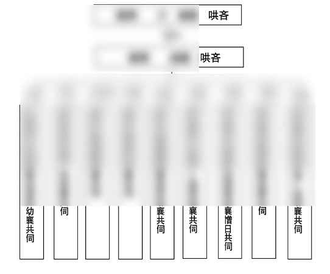
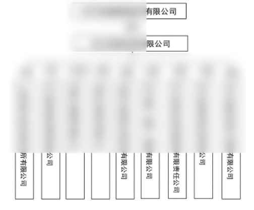
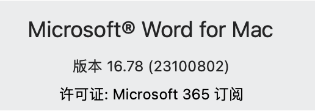
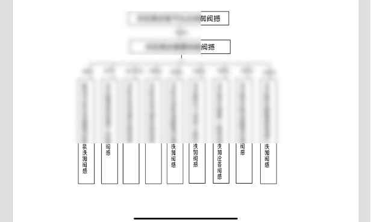
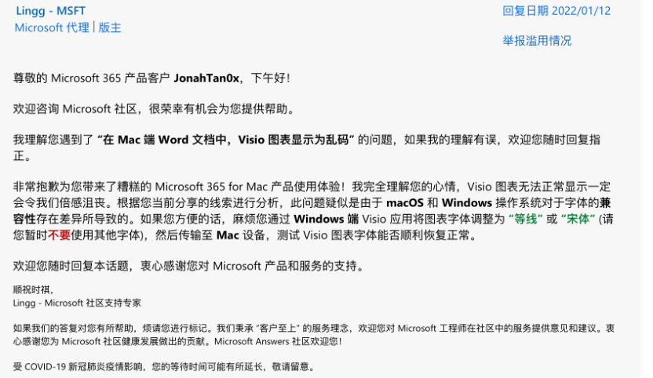
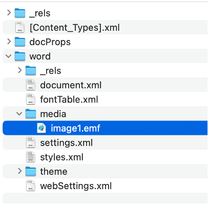
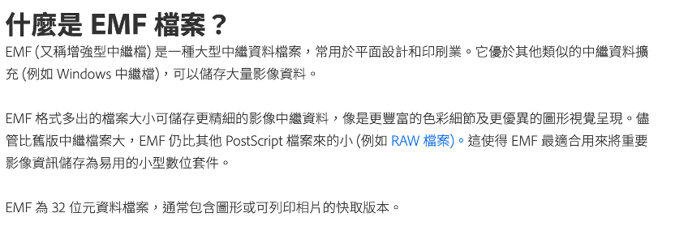

# 一日一技 | Mac 版 Word 下图片乱码的临时处理方法 - 少数派

**Matrix 首页推荐** 

[Matrix](https://sspai.com/matrix) 是少数派的写作社区，我们主张分享真实的产品体验，有实用价值的经验与思考。我们会不定期挑选 Matrix 最优质的文章，展示来自用户的最真实的体验和观点。

文章代表作者个人观点，少数派仅对标题和排版略作修改。

- - -

## 一、发现问题

我是 Mac 用户，最近在使用 Office 时遇到了一个问题。在同事发来的文档中，有一个图片中的文字变成乱码，如图：

（模糊部分为手动打码）

一开始，我以为是图片问题，但将这个文档传至 Windows 系统电脑上，可以正常看到图片内容。

我又猜测是我的 Word 的版本问题，于是我更新至最新版本，但依然不能解决。复制至 Excel 或 PowerPoint 中也同样如此。

使用 iPad 中的 Microsoft 365 (Office) 打开，同样是乱码，只不过显示的文字有所不同。

此外，用 Word 保存为 pdf 文件后，这张图片同样显示为乱码。目前暂未尝试打印机能否正确打印出文档，但公司的打印机对 Word 文档支持本来就不好，通常也是建议保存为 pdf 后再打印的。

经检索，这个问题很早就有人提出和反馈过（比如[这个链接](https://sspai.com/link?target=https%3A%2F%2Fanswers.microsoft.com%2Fzh-hans%2Fmsoffice%2Fforum%2Fall%2Fmac%25E7%2589%2588word%25E6%2596%2587%25E6%25A1%25A3%25E4%25B8%25AD%2F1e804646-7cc4-4e83-bc94-0737dc65d610)，或[这个链接](https://sspai.com/link?target=https%3A%2F%2Fanswers.microsoft.com%2Fzh-hans%2Fmsoffice%2Fforum%2Fall%2Fmicrosoft365-word-for%2F1718233d-cd4e-40c8-ace8-456486cfc7ff)），但似乎至今都没有被解决（从这个[链接](https://sspai.com/link?target=https%3A%2F%2Fwww.zhihu.com%2Fquestion%2F529964712)上看，似乎有三年以上的时间都没有解决）。

从上面的帖子看来，发生这个错误的原因，是文档的编辑者，使用了 Visio 或者其他 Word 绘图之类的工具，macOS 系统下的 Word 不能够编辑，也不能够识别这张图。

在 Microsoft 社区，可以看到如下「解决方案」。

这解决问题了吗？显然没有。

如果我自己就是作图的人，肯定不会选择付费的 Visio，因此这个问题只会在收到文档时发生。而作为打工人，作为公司里相对少数的使用 Mac 的一派，我根本不可能每次要求别人修改图片字体，再重新上传文档。

## 二、一些尝试

在对微软不解决问题感到恼火之余，我还是得明白，以后再面对这种乱码图片，我该如何处理。总体而言，需要实现的功能不算多，无非是查看图片、复制图片、保存文档为 pdf 而不出现乱码，以及将文档正常传递给下一个接收者，仅此而已。

经过一些尝试，我大致弄清楚可以对这类图片做哪些事情。

首先，对于 Mac 和 iPad 用户而言，仍然有非常多工具能够查看图片——只是 Microsoft Office 软件不行。

-   Mac 自带的预览工具，也就是对着文件单机空格键，可以正常看到文档内所有图片上的文字。
-   微信上打开文档，可以正常显示图片文字。
-   网页版 Microsoft 365 的 Word 中可以正常看到图片文字，同理，Google 等在线文档应该也可以。
-   使用其他文档类工具也可以正常查看图片文字，比如 Apple 自带的 Pages，或者其他人提到的 WPS。

其次，为了提取这些图片，我们可以将文档（docx 格式）的后缀名修改为「rar」或者「zip」，解压后依次点开 word、media 文件夹，能够看到全文档插入的图片文件，可以看到问题图片文件的后缀为「EMF」。

这是我单独复制出的一张图片，因此整个文档中仅有一个媒体文件

检索得知，EMF 格式文件是一种「Windows 增强型图元文件」——微软公司拥有的文件格式，唯独在微软的付费软件里不能够正常显示，如此讽刺。

以上是 Adobe 官网对此的介绍

因此，只要打开 EMF 格式文件，或将图片转换为其他格式，我们也就能够在 Mac 上查看、保存、编辑这种图片，理论上 Photoshop 和 Adobe Illustrator 应该都能够打开、保存甚至编辑图片。

Adobe 的介绍，当然肯定在 Mac 上

而即使没有办法打开 EMF 文件（目前，我的 Mac 上就没有任何可用的软件），也不妨碍我们在 Mac 上保存和使用正常显示文字的图片：

-   既然能查看图片，就能截图。
-   在网页版 Microsoft 365 的 Word 中打开文档，复制图片至 Word 文档中，发现可以正常显示文字。同样修改后缀名、解压后发现，复制过来的图片格式为 png。

-   在 Pages 中打开文档，复制图片至 Word 文档中，同样可以正常显示文字。修改后缀名、解压后发现，复制过来的图片文件后缀居然是「EMF」！莫非 Pages 解决了 Mac 系统中 EMF 显示的问题？当然没有，如果你在 Windows 版 Word 中打开这个文件，选择编辑图片，或者用其他能够编辑 EMF 格式文件的软件，你会发现这个 EMF 文件上只有一张包含所有内容的图片，而丢失之前可编辑的文字信息。

看到这个文件后缀名的时候还惊喜了一下

-   如果需要在其他文档中使用这张图片，并且希望文档可以继续在 Windows 中继续编辑，不将可编辑的绘图文件降级为图片，那么直接复制原文档的图片至新文档即可，上面解压出的 EMF 文件也可以直接插入到新文档中——虽然在 Mac 版 Office 中看到的仍然是乱码，但它将会在你同事的 Windows 电脑上正常显示和可编辑。

此外，如果要将包含有乱码图片的文档转为 pdf，或者打印这份文档，那么，一种方法是，将文档里的图片全部替换为可显示的图片，再另存为 pdf，这适合乱码少的文档；另一种方法是，在网页版 Microsoft 365 等工具中中打开文档，另存为 pdf 至本地。

## 三、做个总结

至此，在微软终于想起它的 Office 365 付费用户之前，遇到仅限 Mac 版 Office 软件显示为乱码的图片，并不是无法工作的：

-   首先是不必惊慌，通过空格预览可以正常查看文档内的图片，如果文档过长或遇到预览时的排版问题，那么也可以通过其他工具（包括但不限于网页版 Office 和 Pages）来查看。
-   如果更多考虑保留原始图片，那么直接复制文档内的乱码图片，或者插入修改后缀、解压得到的 EMF 文件都可以——它的数据本身并不会因为在 Mac 系统中的 Office 中打开而受损，只是显示错误罢了。
-   如果要在其他文档中使用这张图片，且不用考虑未来 Windows 用户编辑图片上文字的需求，那么截图保存图片，或者通过其他工具打开文档后将图片复制至新文档，或者单一/批量转换 EMF 格式文件为 PNG 等格式的图片都可以办到。
-   如果要将文档在 Mac 系统中保存为 pdf 或打印出来，那么要么按照上面的方法替换图片，要么使用其他能够打开和保存为 pdf 文件的工具即可。
-   如果需要编辑这张图片，那么一方面 Mac 版 Word 本来也不包含有这样的功能，另一方面 Visio 也不属于 Microsoft 365 内的产品——所以，还是另请高明，换个软件或者重新绘图罢。

\> 下载 [少数派 2.0 客户端](https://sspai.com/page/client)、关注 [少数派公众号](https://sspai.com/s/J71e)，解锁全新阅读体验 📰

\> 实用、好用的 [正版软件](https://sspai.com/mall)，少数派为你呈现 🚀
