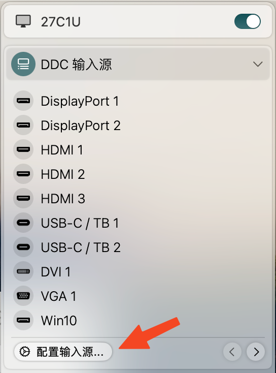

# 一日一技 | 如何只用软件实现显示器的输入源切换 - 少数派

我的办公显示器连接了两台电脑，一台是画图用的 Windows 台式机（连接到显示器的 DP 口），一台是日常爱「玩」的 MacBook Air M1（连接到显示器的 Type-C 口），当领导过来的时候我希望能快速切换到 DP 口，但是显示器自带的 OSD 实体按键(On-Screen Display)不是很好用，需要按 4 到 5 下才能切换完成，显然无法适应日常摸鱼的需求。

经过一番研究，通过 DDC/CI 协议，最终实现了键盘一键切换的效果：


这个方案需要你的显示器兼容 DDC/CI 协议，并需在 Mac 和 Windows 上分别安装对应的 DDC 控制软件。幸运的是，这些软件都可以免费下载。

**关联阅读：**[同型号共用总出问题，显示器的「身份证」为什么没用了？](https://sspai.com/post/75834)

## 显示器的统一「语言」DDC

DDC 是数据显示通道（Digital Display Channel），是一条主机和显示器之间的信息通道，通过它可以将显示器的物理数据直接传输给主机。

DDC/CI 协议是 Display Data Channel Command Interface 的简称，基于 DDC/CI 协议，我们可以通过鼠标和人性化的软件界面来完成显示器的各项设置和色彩调节，而不必使用传统的 OSD 菜单。

### 什么是 OSD

OSD（On-Screen Display）即屏幕菜单式调节方式。 一般是按 Menu 键后屏幕弹出的显示器各项调节项目信息的矩形菜单，可通过该菜单对显示器各项工作指标包括色彩、模式、几何形状等进行调整，从而达到最佳的使用状态。


我的杂牌 4K 显示器的 OSD 菜单

有些显示器（比如 Dell）可以设置快捷操作，把两个物理按键设置为输入源切换，这样可以快一点点：


Dell显示器设置好快捷切换输入源后的 OSD 菜单

而我的杂牌显示器需要按 4 到 5 次才能切换成功：


## 解决方案

### Windows 端

#### 找到显示器对应接口

首先需要知道你的显示器是否支持 DDC。在安装 [ControlMyMonitor](https://sspai.com/link?target=https%3A%2F%2Fwww.nirsoft.net%2Futils%2Fcontrol_my_monitor.html) 这个软件后，打开后如果能显示下图的界面，那就意味着你的显示器是支持 DDC 控制的；如果不能，那么这篇文章就帮不了你了。


Control My Monitor 软件界面

接着，找到 VCP Code Name 这一列找到 Input Select， Input Select 对应的 Current Value 就是你的显示器 DisplayPort 口的通道值了。


可以看到我的 DP 口对应的通道值是 8

#### 用命令行切换到其他显示器

尽管有些教程告诉你可以通过双击 Current Value 来直接输入其他通道值来改变输入源，但我个人的测试发现这样完全无效。所以，我建议还是通过命令行来进行修改。

```shell
"MyMonitor.exe" /SetValue Primary 60 7*
```


这是我的测试记录，从 0 一直尝试到 7 才切换到显示器的 C口

对 PowerShell 不太熟悉的朋友可以先把 Control My Monitor 软件的文件夹放到 D 盘根目录，接着在开始菜单的 Windows 图标上点右键，选择 Windows PowerShell，然后把 .exe 文件拖入窗口，接着输入上面的命令即可：


把这个文件拖入 PowerShell 窗口

然后在 `60` 后面就可以开始尝试输入从 `0` 到最大值（最大值也可以在Control My Monitor 软件里看到）之间的数字了，我是从 `0` 一直尝试到 `7` 才找到我的显示器 C 口对应的通道值是 `7`。

当然，每次去命令行这样输入代码也挺麻烦的，快速切换的方法无非是两种，一是将代码保存为 bat 文件，双击即可运行（方便在键盘不是连接的 Windows 电脑的情况使用）；二是通过快捷键软件来执行：

这里以 [WinHotKey](https://sspai.com/link?target=https%3A%2F%2Fdirectedge.us%2Fcontent%2Fwinhotkey%2F) 为例，在安装完软件后新建一个快捷键（我设置的是 Win+Shift+A），快捷键的作用是打开 Control My Monitor 软件，在高级选项里加入启动参数（其中 `7` 需自行更改）:

`/SetValue Primary 60 7`


选定新建的快捷键，点击 Edit Hotkey 可以设置键位组合和高级选项


自行更改

有一点需要注意的是，只有 Mac 在唤醒的状态下，才可以一键切过去。如果 Mac 进入睡眠状态了，则会先黑屏一下然后又回到 Windows。

#### Windows 笔记本值得注意的细节

本文介绍的在 Windows 和 Mac 电脑之间的切换，如果你是两台 Windows 电脑共用一个显示器，台式机的话方法一样；但如果是台式机和笔记本之间切换，则稍微复杂一些，因为笔记本自己有内建的屏幕，那么在Control My Monitor 软件里你需要看看显示器是 Display 多少:


按这里的值修改下面的代码

如果是 Display 2，那么代码需要修改为：

```shell
"ControlMyMonitor.exe" /SetValue "\\.\DISPLAY2\Monitor2*"60 8*
```

两处 \* 的位置，也就是 `DISPLAY2` 和 `8` 需根据实际情况修改。


注意Monitor0"和60之间有个空格

### Mac 端

Mac 端软件生态相对丰富，所以也没切换显示源自然也没 Windows 端那么复杂。这里我推荐 [BetterDisplay 2](https://sspai.com/link?target=https%3A%2F%2Fgithub.com%2Fwaydabber%2FBetterDisplay)，它对于很多人最常用的用途还是**给 2K 显示器开启 HiDPI** 的支持，当然这款软件也支持调节显示器亮度等等功能，这里受限于篇幅就不做展开了。

安装好后，点击菜单栏中 BetterDisplay 的图标，在弹出的选单里点击 DDC 输入源。这时候会看到很多显示接口名称，如 HDMI X、USB-C、DP 等。可能有用也可能没有用，需要自己测试。

从上文我们已经知道，当前 C 口对应的是 `7`，一般情况下，DDC 输入源可能与相邻的数字有关，所以可以尝试`6`或`8`。





这里的值就是接口对应的通道值了，描述里写的啥其实不重要

BetterDisplay默认带的 DDC 输入源菜单选项非常多，多达 4 页，你可以先一个个点击，哪个能切换到 Windows 去就记下来，然后在设置里找到这个值，把对应的描述改为 Windows，图标选成对应的接口形状（非完美主义者可以跳过），最后打到这样的效果：


这俩都在第一页，其他全部隐藏

然后当我们点击 MenuBar 里的 BetterDisplay 图标的时候，就只有两个选项了：


其实只需要 Win10 这一个就够，因为无法通过BetterDisplay从 Win 切回 Mac

点击就可以切换回 Windows 了。

显示器搞定了，鼠标键盘就看大家各显神通了。进过几天的使用，我觉得虽然看起来只是省了几下按显示器物理按键的功夫，但是时间还是能节约下来不少的，大大增加在两个系统间切换的意愿。

### 番外

最后还有个小心得，就是当 Mac 连接了显示器C 口这种一线通的线缆后，有时候其实只想充电不想输出到外接显示器（实际场景是当我要画图了，显示器是显示Windows 的，但是之前外接 Mac 的时候有些窗口是在显示器上的，在内建显示屏里看不到也没法直接都改回来），之前都只能在「设置-显示器」里，从「扩展显示器」改为「内建显示器的镜像」，比较麻烦；

现在有了 BetterDisplay 2，就可以直接在这里按一下开关：


弹出的提示里选择「再也不提示」

就可以关闭输出到外接显示器了，之前显示器上的窗口都会回到内建显示屏上。

\> 下载 [少数派 2.0 客户端](https://sspai.com/page/client)、关注 [少数派公众号](https://sspai.com/s/J71e)，解锁全新阅读体验 📰

\> 实用、好用的 [正版软件](https://sspai.com/mall)，少数派为你呈现 🚀
