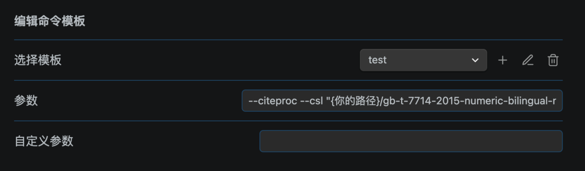

# 一日一技 | 将 Obsidian 页面按自定义模板导出为 Word 文档 - 少数派

**Matrix 首页推荐** 

[Matrix](https://sspai.com/matrix) 是少数派的写作社区，我们主张分享真实的产品体验，有实用价值的经验与思考。我们会不定期挑选 Matrix 最优质的文章，展示来自用户的最真实的体验和观点。

文章代表作者个人观点，少数派仅对标题和排版略作修改。

- - -

## 背景

从语雀事件后，我开始尝试把自己的知识库本地化，也就终于开始学习使用 [Obsidian](https://sspai.com/link?target=https%3A%2F%2Fobsidian.md%2F)。

**痛点**是 Obsidian 作为 Markdown 生态的产物，虽有诸多便利，但个人工作中的部分文档需要提供 Word 的 Docx 格式，并且需要遵循一定的格式。而且，Markdown 导出时图片显示也是一个问题。

```plain
系统信息
- 设备：Macbook Air M1（2022）
- 系统：macOS Sonoma 14.2
- 终端：iTerm2
- 包管理：Homebrew
- Obsidian 版本：V1.4.16
- Obsidian 语言：中文
```

## 解决方案

图床 + 导出。图床可以解决 Markdown 本地图片转化为 Word 无法显示的问题。

-   PicGo
-   腾讯云 OSS（其他 PicGo 支持的都行）
-   Obsidian-image-auto-upload-plugin

导出插件可以解决 Markdown 可以按照模板样式导出 Word 的问题。

-   Pandoc
-   Obsidian-enhancing-export（需要配置额外的模板相关参数）

## 图床

-   安装客户端软件：[Releases · Molunerfinn/PicGo](https://sspai.com/link?target=https%3A%2F%2Fgithub.com%2FMolunerfinn%2FPicGo%2Freleases)  
    注意：Mac M 系列的安装后提示安装包损坏，前往终端输入命令 `sudo xattr -d com.apple.quarantine "/Applications/PicGo.app"` 相关原因参考：[\[Bug\]: arm 64 文件已损坏 · Issue #1055 · Molunerfinn/PicGo](https://sspai.com/link?target=https%3A%2F%2Fgithub.com%2FMolunerfinn%2FPicGo%2Fissues%2F1055)
-   配置 PicGo：注册腾讯云 OSS（只要 Picgo 支持的均可），并按照 Picgo 文档设置并获取相关参数。（文档：[配置手册 | PicGo](https://sspai.com/link?target=https%3A%2F%2Fpicgo.github.io%2FPicGo-Doc%2Fzh%2Fguide%2Fconfig.html%23github%25E5%259B%25BE%25E5%25BA%258A)）
-   安装 Obsidian 插件：[renmu123/obsidian-image-auto-upload-plugin: auto upload image with picgo](https://sspai.com/link?target=https%3A%2F%2Fgithub.com%2Frenmu123%2Fobsidian-image-auto-upload-plugin)
-   配置插件（一般默认即可）：打开 Obsidian -> 设置 -> Image auto upload Plugin

我的配置如下：


## 导出

### 安装 Pandoc

建议使用终端的 Homebrew 安装。（Windows 可以去 Pandoc 官网直接下载。）

-   安装 Homebrew：打开终端，复制命令 `/bin/bash -c "$(curl -fsSL https://raw.githubusercontent.com/Homebrew/install/HEAD/install.sh)"` 并回车，等待安装完成即可。
-   使用 Homebrew 安装 Pandoc：打开终端，复制命令 `brew install pandoc` 并回车，等待安装完成即可。

### 安装插件

插件：[GitHub - mokeyish/obsidian-enhancing-export](https://sspai.com/link?target=https%3A%2F%2Fgithub.com%2Fmokeyish%2Fobsidian-enhancing-export)

配置方法：

1.  打开 Obsidian -> 设置 -> 导出设置；
2.  （如果默认的自动检测未生效）填写 Pandoc 路径，例如我的是 `/opt/homebrew/Cellar/pandoc/3.1.9/bin/pandoc`。如果，填写正确，会显示 Pandoc 版本。


### 设置模板

参照[设置 Word 模板，Markdown 也能自动转换为美观规范的 Word 文档](https://sspai.com/link?target=https%3A%2F%2Fld246.com%2Farticle%2F1667748681800)的说明，前往 [mini/pandoc/basic.md at main · Achuan-2/mini](https://sspai.com/link?target=https%3A%2F%2Fgithub.com%2FAchuan-2%2Fmini%2Fblob%2Fmain%2Fpandoc%2Fbasic.md) 下载三个文件：

-   `gb-t-7714-2015-numeric-bilingual-no-uppercase-no-url-doi.csl`
-   `ref.bib`
-   `templates_refine.docx`


打开 Obsidian -> 设置 -> 导出设置，在「编辑命令模板 -> 选择模板」中；


选择模板：`Word（.docx）` ，名称自定。


配置参数，参数示例如下，记得注意把{你的路径}换成你电脑上对应的路径。

`--citeproc --csl "{你的路径}/gb-t-7714-2015-numeric-bilingual-no-uppercase-no-url-doi.csl" --bibliography "{你的路径}/ref.bib" -M reference-section-title="参考文献" -M link-citations=true --reference-doc="{你的路径}/templates_refine.docx" -f markdown --resource-path="${currentDir}" --resource-path="${attachmentFolderPath}" -s -o "${outputPath}" -t docx`



注意：路径**最终的**文件名**不要使用中文**，否则 Pandoc 会解析失败，报错 `cannot encode character "\65533"`。

值得注意的是，参数中的 `--reference-doc="{你的路径}/templates_refine.docx"` 对应的文件，就是你的模板文件。你可以选择直接修改这个 Word 文件，或者复制一份新的并调整样式，记得最后修改此参数的文件路径即可。

至此，大功告成！

## 如何使用？

在 Obsidian 中，`CMD + P` （Mac）或 `Ctrl + P`（Windows）输入命令：export


然后确认文件名和导出路径即可确认导出。


#### 参考链接

-   [GitHub - mokeyish/obsidian-enhancing-export](https://sspai.com/link?target=https%3A%2F%2Fgithub.com%2Fmokeyish%2Fobsidian-enhancing-export)
-   [设置 word 模板，Markdown 也能自动转换为美观规范的 Word 文档 - 链滴](https://sspai.com/link?target=https%3A%2F%2Fld246.com%2Farticle%2F1667748681800)
-   [obsidian 导出带图片的 word - 知乎](https://sspai.com/link?target=https%3A%2F%2Fzhuanlan.zhihu.com%2Fp%2F570748937)
-   [Markdown 写作，Pandoc 转换：我的纯文本学术写作流程 - 少数派](https://sspai.com/post/64842)

题图 Designed by [Freepik](https://sspai.com/link?target=https%3A%2F%2Fwww.freepik.com%2F)

\> 下载 [少数派 2.0 客户端](https://sspai.com/page/client)、关注 [少数派公众号](https://sspai.com/s/J71e)，解锁全新阅读体验 📰

\> 实用、好用的 [正版软件](https://sspai.com/mall)，少数派为你呈现 🚀
