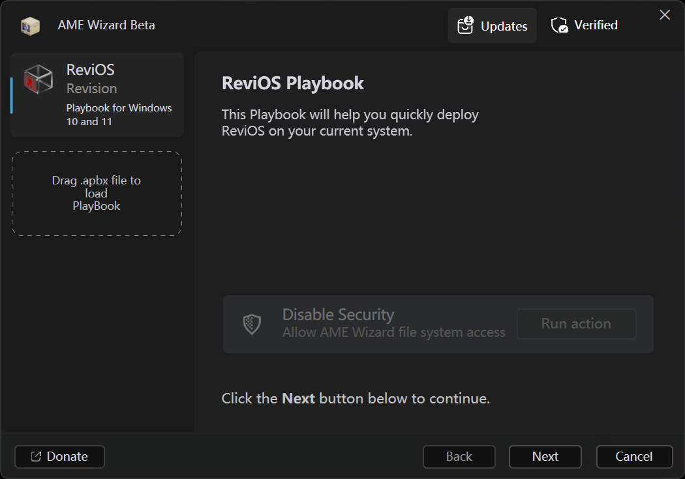
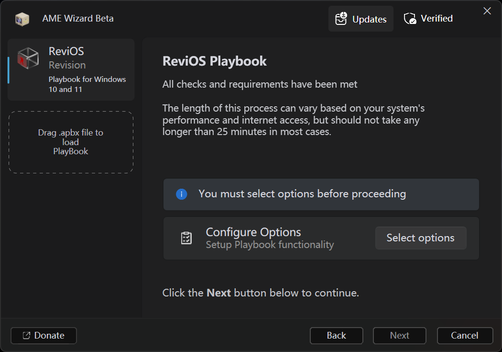
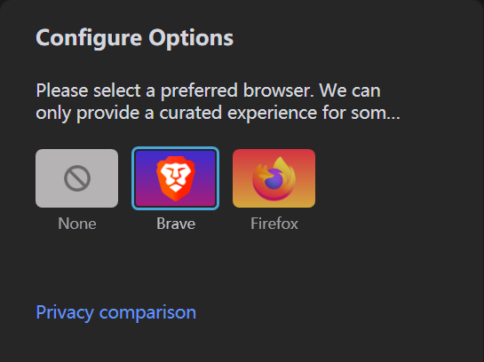
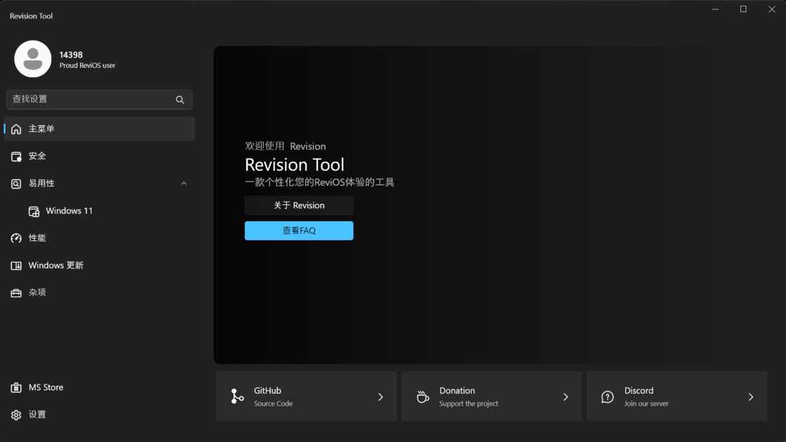

# 一日一技 | 无需重装，利用 AME Wizard 让你的 Windows PC 焕然一新 - 少数派

不知道有多少人和我一样，Windows 的电脑在使用超过一年之后，就总会存在各种各样的「小毛病」。对于大部分人来说，这通常与使用习惯有关，但是即使努力保持，Windows 系统也总会因为系统升级和日常运行产生的各种系统错误而慢慢变得不好用，尤其是经历了 Windows 10 到 11 的大版本迭代的电脑更是如此。在上个礼拜，我的电脑由于系统组件的高 CPU 占用，甚至在进行游戏时产生了 CPU 满载显卡看戏的奇葩场面。于是在寻找解决方案时，我找到了 [AME Wizard](https://sspai.com/link?target=https%3A%2F%2Fameliorated.io%2F)。

在前几年，可能有一些人听说过 AtlasOS、ReviOS、Tiny11 等一系列第三方 Windows 镜像。或许现在的 Windows 社群早就过了「[雨林木风](https://sspai.com/link?target=https%3A%2F%2Fzhuanlan.zhihu.com%2Fp%2F488050680)」那个年代，但是精简和修改版的 Windows 镜像一直都存在着，就像每次 Windows 大版本迭代时都会有一大片负面评论一样，也有一群开发者们认为，他们能让 Windows 更好，而事实上他们也确实做到了。

但是修改版系统镜像在如今这个成品 PC 全部预装正版 Windows 的时代确实已经有些小众了，几乎只有自己组装电脑的 PC 玩家们才会涉猎，而对于普通用户来说，重装系统或许已经是需要抱着电脑去维修店的「大问题」了。并且，绝大部分修改版 Windows 镜像也并没有[类似 ATO 的系统更新或者维护](https://sspai.com/link?target=https%3A%2F%2Fwww.secondfront.com%2Finsights%2Fwhat-is-an-authority-to-operate-ato)，大部分更新只能通过重装来解决，并且大部分都无法再进行正常的 Windows 更新。

而 AME Wizard 正致力于此。严格来说，AME Wizard 并不是一个修改版 Windows 镜像，而是一个 Windows 自定义工具，或者说更接近一个脚本执行器。简单来说，AME Wizard 通过使用 [YAML 语言](https://sspai.com/link?target=https%3A%2F%2Fwww.redhat.com%2Fzh%2Ftopics%2Fautomation%2Fwhat-is-yaml)的 Playbook 文件，就可以实现自定义 Windows OS 的操作，而我们也无需再下载第三方镜像了，只需要导入几 MB 大小的 Playbook 文件即可。目前受官方支持的 Playbook 就包括前文提到的 AtlasOS 和 ReviOS。

除了镜像文件的轻量化，AME Wizard 的操作比起过去的修改版系统镜像也友好了很多，无论是对于使用者还是开发者。多说无益，接下来我将以 ReviOS 的安装为例，展示安装的全流程：

首先，从 [https://ameliorated.io/](https://sspai.com/link?target=https%3A%2F%2Fameliorated.io%2F) 下载 AME Wizard，在官网的首页也可以找到 ReviOS 的外链，跳转即可下载 ReviOS 的 Playbook 文件。

进入 AME Wizard，将 ReviOS 的 Playbook 文件拖入虚线框内，随后可能会提示更新，根据提示更新即可。

进入 ReviOS 的安装界面，第一次安装会提示关闭安全软件。一般情况下，如果已经安装了火绒等第三方杀毒软件，卸载重启即可。Windows Defender 则有可能会出现无法关闭的问题。针对这种问题软件也会在等待一段时间后提示一个帮助文档链接，文档中会提供一个 Windows Defender 移除程序，效果立竿见影。

解决完门卫大哥之后，AME Wizard 就可以大干了，根据提示同意一系列条款已经一个系统环境检测之后，就进入到了 ReviOS 的配置选项过程。

在这个过程中会有一系列选项，包括移除 Edge 浏览器、OneDrive、Photos、Dev Home、Copilot、开启传统左键菜单和文件浏览器选项等等，根据自己的需求选择即可。完成选项选择之后，点击 `Restart` 即可进入配置阶段。

随后软件会进入全屏遮罩状态，无法操作其他程序，期间会经历几次重启。大概十分钟左右，你就成功安装好了 ReviOS。

安装完成之后，ReviOS 会自动安装一个设置应用，其中提供了一些系统功能的便捷开关，可以根据需求自行探索。

到这里，ReviOS 安装的全流程就完成了，对于我个人的体验来说，从 Windows11 专业版转换到 ReviOS 之后，在任务管理器中我的 CPU 占用在待机状态下直接降到了 2%，效果非常惊艳，内存占用也有缓解。而对我来说最重要的是，在进行游戏时，PC 的性能终于从 CPU 回到了 GPU，而我也终于可以以 2K 60 帧的分辨率探索夜之城了（在此之前只能 1080p 30 帧）。

尽管 AME Wizard 的体验和可靠性已经非常完美了，但是 ReviOS 在官网依然建议尽可能在重装后的新系统中进行 Playbook 安装，虽然经过我的实测非全新安装也不会产生什么 bug，但是最好还是在安装前确保对重要文件进行备份。

最后，提一嘴 AtlasOS 和 ReviOS，虽然 AME Wizard 是本文主角，但是 AtlasOS 和 ReviOS 的开发者的适配同样重要。相信有一部分朋友在前文中读到这里也会困惑这俩 OS 到底有啥区别。简单来说，AtlasOS 专注于游戏优化，操作比较激进，适合纯游戏 PC 的用户，可能会砍掉一部分常用系统组件，以压榨出 PC 的全部性能，追求高帧数与低延迟，如果你是狂热的游戏玩家，AtlasOS 绝对匹配。

而 ReviOS 则专注于隐私保护与系统精简，ReviOS 删除了大量涉及隐私的系统遥测后门（如激活 Windows 时不得不同意的各种数据共享），消除了大量在后台运行的冗余任务和服务，同时保留了一些常用的系统组件，保证了易用性和稳定性，相较 AtlasOS 来说没有那么激进，但是相较与原系统对性能的提升依旧十分显著，对于需要兼顾一部分生产力的我来说更为适用。

以上，如果你最近也有类似的需求，欢迎一试，反正只需 10 分钟。

\> 下载少数派 [客户端](https://sspai.com/page/client)、关注 [少数派小红书](https://sspai.com/link?target=https%3A%2F%2Fwww.xiaohongshu.com%2Fuser%2Fprofile%2F63f5d65d000000001001d8d4)，感受精彩数字生活 🍃

\> 实用、好用的[正版软件](https://sspai.com/mall)，少数派为你呈现🚀
