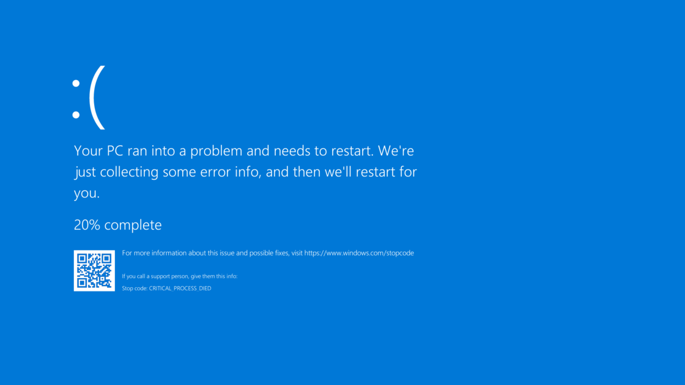
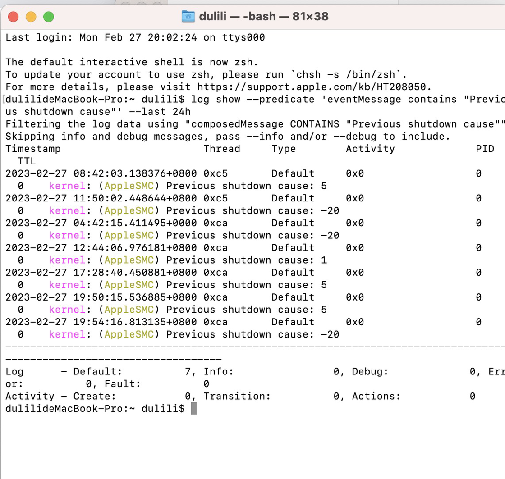
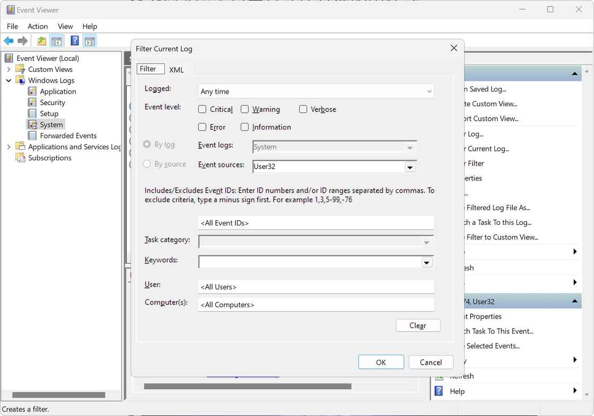
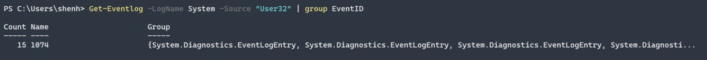
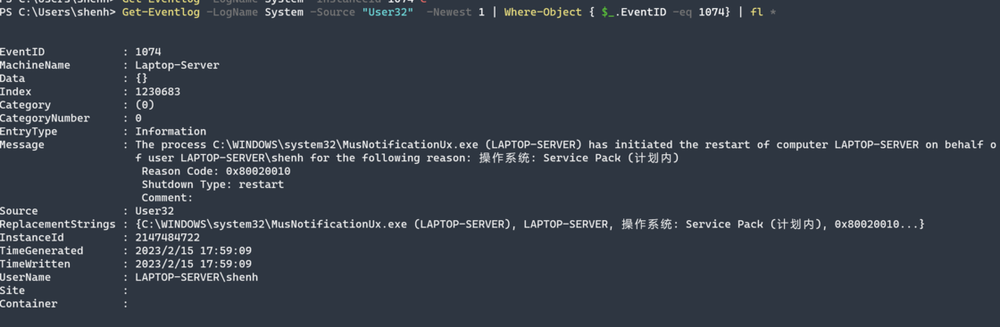

# 一日一技 | 重启试试不是长久之计，两条命令帮你排查意外关机成因 - 少数派

[03 月 08 日更新：优化 Windows 下 Powershell 代码的输出](#update-0)

即使现在的系统相比 20 年前已经稳定了很多了，使用电脑时也难免会遇到蓝屏1、意外重启、甚至是意外关机的情况。尽管这种问题可能只是偶然发生，可以说是不太走运；但更多的时候放着不管，反而会让电脑的问题出现得越来越频繁。



一个蓝屏小「贴士」

所以，这篇文章就旨在帮助大家快速找到让电脑不能正常工作的罪魁祸首，虽然不一定能「药到病除」，但也能让你离正确答案更近一步。

## macOS

尽管 macOS 是Apple为Mac产品线定制的操作系统，但实际上出现问题的机会还是很多的。虽然在macOS中我们可以通过控制台获取日志信息，但从macOS Sierra及更高版本开始，考虑到安全和隐私问题，控制台只允许访问最近的日志条目，而不是整个日志文件。

所以想要分析日志中所有和关机有关的事件，就需要通过「终端」和相应的指令进行分析。如果你的 Mac 近期出现了意外重启等问题，不妨跟着下面的步骤试一试，打开「终端」，并输入如下指令：

```shell
log show --predicate 'eventMessage contains "Previous shutdown cause"' --last 24h
```

上面这一串指令会使用 `log show` 检索系统日志，`predicate` 可以进一步筛选日志，在本文中我们筛选的日志类型是 `eventMessage`中包含`Previous shutdown cause`（此前关机的原因）的信息，而筛选的时间范围`--last 24h` 则是过去 24 小时，如果有必要的话可以扩展到 36 小时甚至更长。



来自作者群的一个朋友

静静等待一段，你就能看到如上图一样的、将日志筛选后到结果，我们需要注意的信息就是`Previous shutdown cause`后续跟随的数字，这个数字代表着 Mac 电脑上次是因为什么原因而关闭的。总的来说，负数的代码通常是因硬件而关机的，该信息由系统管理控制器 (SMC)2或处理器本身3报告；而正数因软件而关机的。以下是每个代码所包含的含义：

| 数字  | 解释  | 解决方案 |
| --- | --- | --- |
| 5   | 正常关机 | 由用户或命令发起的关机，没有问题 |
| 3   | 硬关机 | 因电源按钮关机  <br>如果不是由你按下的话，需要检查电源按钮 |
| 0   | 断电  | 因断电导致的关机，具体参见下文 |
| \-3 | 多个温度传感器温度过高 | 安装可以获取传感器温度度数的软件，  <br>检查具体传感器的问题，并在必要的  <br>情况下向 Apple 申请维修。 |
| \-14 | 瞬态尖峰或浪涌 | Mac Pro 上内置电源的问题，可能需要售后 |
| \-20 | T2 芯片关机 | 由 T2 芯片或 BridgeOS 引起的关机  <br>反复出现需要进行售后 |
| \-60 | 损坏的主目录区块 | 备份你的数据，擦除磁盘并重新安装 macOS  <br>在重新安装前可能会有数据丢失的风险 |
| \-61/-62 | 定时器监测到未响应  <br>的程序并关闭/重启系统 | 在未响应的程序导致内核崩溃之前，  <br>强行重启计算机，具体参见下文 |
| \-65 | 未知  | 重装 macOS 大概率解决 |
| \-71 | 内存模块过热 | 对于台式机：更换内存，确认是否是硬件问题  <br>对于笔记本：检查温度、风扇和传感器  <br>通用：清理风扇和气道，寻求售后 |
| \-74 | 电池温度过高 | [重置 smc](https://support.apple.com/zh-cn/HT201295)  <br>检查电池硬件是否正常，或寻求售后 |
| \-75 | 无法连接 AC 适配器 | 检查插头、适配器、线缆和硬件接口 |
| \-78 | AC 适配器回报错误的电流 | 检查插头、适配器、线缆和硬件接口 |
| \-79 | 电池回报错误的电流 | 检查电池、检查电池是否连接到主板 |
| \-85 | 芯片温度过高 | 检查 CPU、GPU、SoC 的散热系统或风扇 |
| \-95 | CPU 温度过高 | 检查 CPU 散热或风扇、[重置 smc](https://support.apple.com/zh-cn/HT201295) |
| \-100 | 电源温度过高 | 检查风扇或气流、移除外接电源 |
| \-102 | 电压过高 | 电压过高导致关机保护，检查电源或电池 |
| \-103 | 电池欠压 | 检查电池，或更换电池 |
| \-104 | 未知  | 可能与电池有关，检查电池，或更换电池 |
| \-108/-112/-128 | 未知  | 可能与内存有关，检查内存，或更换内存 |

如果你的 Mac 出现大量因为 0（断电）导致的意外关闭，那么就需要进行一定的排查。对于没有电池的台式 Mac 而言，主要检查的就是电源线有没有牢牢插入到电源接口中；如果依然出现这样的问题则很有可能是计算机内的电源出现了问题，需要进行维修。对于有电池的笔记本型 Mac 而言，需要同时检查电源线和电池；笔记本型 Mac 通常会在电池耗尽之前进入休眠状态；出现断电而导致的关机很有可能是电池或读取电量的电池控制器有硬件问题，对于 Intel 款 Mac 而言需要根据官方文档[重置 smc](https://support.apple.com/zh-cn/HT201295)，而 M 系列 Mac 需要手动重启一次。如果上述步骤依然不起作用的话，也需要进行维修。

长时间未响应可能会让整个系统崩溃，严重时还会导致相关数据丢失。定时器超时作为 macOS 中一项功能，它可以有效防止未响应的程序导致的内核崩溃。偶然发生的 -61/-62 错误可能没什么问题，但短时间内出现大量的类似错误就要对电脑进行排查了；-61 表示系统认为不能自动恢复的情况只能进行关机，而 -62 用于系统确定重启后可能解决的情况并进行重启。排查的办法很简单，在 macOS 启动时进入[安全模式](https://support.apple.com/zh-cn/guide/mac-help/mh21245/mac)，在安全模式下启动项目和守护程序都被禁用；如果没有再次意外关机则是最近安装或更新的程序出现了问题，如果再次意外关机则和系统本身有关。

以上就是 macOS 的部分了，相信这个指令可以简单帮你定位问题，并为你后续的问题解决打下一个不错的基础。

## Windows

除了 macOS，Windows 系统日志同样可以在时间查看器中查看并进行筛选，但考虑界面相对「复古」且用于筛选的 UI 选项更为复杂，因此我也更推荐大家使用命令行工具获取和筛选日志。



有的时候用 UI 界面反而会让一件事情变得更复杂

如果你的 PC 电脑近期出现了意外重启等问题，不妨跟着下面的步骤试一试：

```shell
# 命令 1
Get-Eventlog -LogName System -Source "User32" | group EventID

# 命令 2
Get-EventLog System 41 -Source Microsoft-Windows-Kernel-Power -Newest 5 | % {'{0} BugCheckCode: {1:X}' -f $_.TimeGenerated,$_.ReplacementStrings[0] }
```

`Get-EventLog` 是 Windows 中获取日志的命令，`-LogName System` 则限定了查找由系统生成的命令。`-Source` 则是来源，`User32` 和 `Microsoft-Windows-Kernel-Power` 则是两个不同的来源。

### 从用户或程序层面进行分析

`User32` 是一个 Windows 系统应用程序源，它包含了许多与用户界面相关的函数，如窗口创建、消息处理、控件操作等等；它还会负责处理用户交互方面的任务，例如鼠标、键盘输入和窗口管理等。因此由用户或是程序发起的事件，如登录、注销、锁定或解锁计算机等，都可以通过 `User32` 来源来定位。而后 `|` 用于进一步处理 `Get-EventLog` 得到的数据，这里按照 `EventID`事件 ID 来`group` 成组。



目前我电脑中只有 1074 这个事件，这个 1074 事件是计算机的正常关机的主要表现形式。如果 `User32` 有其他的 `EventID` 那么用下面的命令进一步分析：

```shell
# 本例中依然用 1074 做分析 
Get-Eventlog -LogName System -Source "User32"  -Newest 1 | Where-Object { $_.EventID -eq 1074} | fl *
```

前面的命令就不再赘述了，`-Newest 1` 表示选取最近的一个日志， `|` 用于进一步筛选 `Get-EventLog` 得到的数据。`Where-Object` 表示筛选一个对象数组，`$_` 表示当前处理的对象（也就是 `|` 传递过来的数据 ），`.EventID` 表示对象的 EventID 属性，`-eq` 是一个比较运算符，表示等于，这里等于的 1074 这个事件。`|` 依然是用于进一步处理 `Where-Object` 得到的数据，由 `fl`（也可以用完整写法 Format-List 替代）格式化输出对象的`*`所有属性。



找到其中的 Reason Code: 0x80020010 可以得知这是一个计划内的关机请求，如果不是服务器的话，这一般由 Windows Update 自动更新发起；而由用户发起的关机则会被标识为 0x0。以下是常见的 `Reason Code` 所表示的含义，完整列表可以参见[这里](https://sspai.com/link?target=https%3A%2F%2Flearn.microsoft.com%2Fen-us%2Fwindows%2Fwin32%2Fshutdown%2Fsystem-shutdown-reason-codes)：

| 值   | 含义  |
| --- | --- |
| 0x00040000/0x00030000 | 应用/软件问题导致关机/重启 |
| 0x00010000 | 硬件问题导致关机/重启 |
| 0x00020000 | 操作系统问题导致关机/重启 |
| 0x00060000 | 电源问题导致的关机 |
| 0x00050000 | 系统（通常指的是 UEFI）问题导致关机/重启 |
| 0x0000000F | 蓝屏问题导致关机/重启 |
| 0x0000000b | 电源断开导致的关机 |
| 0x00000007 | 硬盘问题导致关机/重启 |
| 0x0000000d | 驱动问题导致关机/重启 |
| 0x00000005 | 系统长时间无响应导致关机/重启 |

蓝屏问题导致关机或重启，还可以进一步下方的命令进行分析。

### 从电源管理相关的事件入手进行分析

不过很多意外关机的事件，比如蓝屏导致的，无法被 `User32` 捕获，因此从`Microsoft-Windows-Kernel-Power` 获取电源状态、电源事件以及与电源管理相关的错误和警告信息得到更多的信息。

```shell
Get-EventLog System 41 -Source Microsoft-Windows-Kernel-Power -Newest 5 | % {'{0} BugCheckCode: {1:X}' -f $_.TimeGenerated,$_.ReplacementStrings[0] }
```

代码中相似的内容不再赘述，在`Microsoft-Windows-Kernel-Power`和意外关机有关的 EventID 是 41，这个事件通常是在意外关机后重启的阶段中生成的。只不过我们这里可以用查找`BugcheckCode`有关的内容做更高效的筛选。`-Newest 5`筛选最近的 5 个事件， `|` 用于进一步筛选 `Get-EventLog` 得到的数据。`%` 在 PowerShell 中是 `ForEach-Object cmdlet` 命令的缩写，该命令会对前面得到的数据挨个操作。

在 `ForEach-Object cmdlet` 命令中，我们利用 `-f` 格式化 `$_` 表示当前处理的对象（也就是 `|` 传递过来的数据 ）中的 `TimeGenerated` 时间属性和 `ReplacementStrings` 属性。只不过 `ReplacementStrings` 属性是为了读者方便使用，我们将十进制的 `BugcheckCode` 直接转化为了下面表格对应的十六进制的值。

简单来说，输入上面的命令以后，Powershell 会输出 5 个与`Microsoft-Windows-Kernel-Power`有关的意外关机事件，每个事件都包括事件和对应的十六进制 `BugcheckCode` 的内容。

`BugcheckCode` 内容也和蓝屏时输出的错误码是相同的内容，有的时候蓝屏代码一跳而过，所以这也是找到问题的好办法。以下是常见的错误的代码以及含义，完整列表请看[这里](https://sspai.com/link?target=https%3A%2F%2Flearn.microsoft.com%2Fen-us%2Fwindows-hardware%2Fdrivers%2Fdebugger%2Fbug-check-code-reference2)：

| 代码  | 名称  | 含义  |
| --- | --- | --- |
| 0x0000009f | DRIVER\_POWER\_STATE\_FAILURE | 驱动程序所请求的电源状态不一致  <br>需要降级或更换驱动 |
| 0x000000d1 | DRIVER\_IRQL\_NOT\_LESS\_OR\_EQUAL | 驱动程序试图访问可分页内存，但中断太多  <br>需要降级或更换驱动 |
| 0x00000024 | NTFS\_FILE\_SYSTEM | NTFS 文件系统出现问题，检查文件系统  <br>或者更换硬盘 |
| 0x000000f3 | DISORDERLY\_SHUTDOWN | 由于内存不足而无法关机  <br>检查内存或添加更多的内存 |
| 0x0000001a | MEMORY\_MANAGEMENT | 内存问题  <br>内存接触不良，或是其他内存问题 |
| 0x00000034 | CACHE\_MANAGER | 文件系统的缓存管理器问题  <br>重装电脑，或者加大非分页池内存 |
| 0x000000EF | CRITICAL\_PROCESS\_DIED | 关键系统进程已终止  <br>需要修复系统，或者重装系统 |

由于错误码的种类繁多，因此这里不太可能一一列举。另外还需要注意的是，同一个错误可能会有不同的原因而导致，排查时可以从近期的软件改动入手去寻找电脑意外关机的原因，排查完软件以后才是排查硬件的真正时机。

### 关于 Powershell 7 使用中的一些细节

值得注意的是，`Get-EventLog` 只能使用 Windows 内的 Powershell 运行；Powershell 7 中因为相关 API 已被弃用，会提示无效指令，因此需要换用`Get-WinEvent`命令：

```shell
# 命令 1
Get-WinEvent -ProviderName 'User32' | group EventID

# 命令 2
Get-WinEvent -FilterHashtable @{ProviderName = "Microsoft-Windows-Kernel-Power"; Id = 41} -MaxEvents 5 | % {'{0} BugCheckCode: {1:X}' -f $_.TimeCreated,$_.Properties.value[0] }
```

`Get-WinEvent` 是 Powershell 7 中获取 Windows 日志的新命令，不同于此前的`Get-EventLog`能同时筛选具体的事件日志`-LogName`和事件源`-Source`；`Get-WinEvent`在使用时只能在筛选事件日志`-Logname`和事件源`-ProviderName`中**二选一**。`Get-WinEvent` 还可以使用一个新的写法 `-FilterHashtable`，降低命令长度的同时提高索引效率。

以上就是本文的全部内容了，希望可以在未来帮助到你。

以下内容于 03 月 08 日更新

优化 Windows 下 Powershell 代码的输出

考虑到易用性和输出的结果，在少数派读者 @Mirtle 的建议下优化了 Powershell 部分的代码。使之更易于使用，更方便读者快速定位 Windows 下的意外关机事件。

-   1蓝屏是 Windows 操作系统在无法从一个系统错误中恢复过来时所显示的屏幕图像，而 macOS 操作系统在内核崩溃以后则会显示有五国语言的黑屏图像
-   2适用于 Intel 款 Mac
-   3适用于 M 系列 Mac
