# 一次沙箱分析记录 - 先知社区

一次沙箱分析记录

- - -

## 一、计划制定

1.  确定信息收集方案
2.  收集的信息传递方案
3.  分析

## 二、 如何收集信息

通过编写代码程序，实现想要的功能，在沙箱内执行，并把数据传递出来。

这里利用在线的DNSLOG平台，用C代码发送一个http请求。

[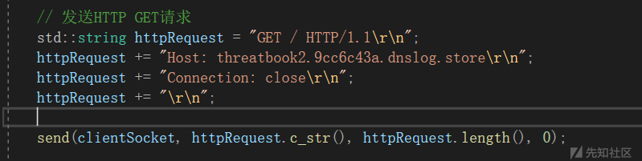](https://xzfile.aliyuncs.com/media/upload/picture/20240114105333-1afbfcda-b288-1.png)

上传程序到微步社区沙箱检测

[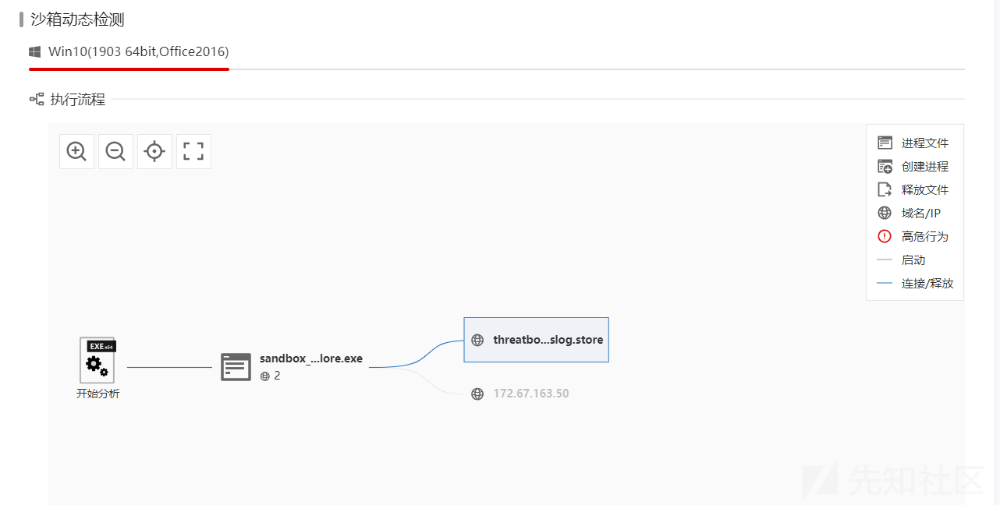](https://xzfile.aliyuncs.com/media/upload/picture/20240114105341-1fe50c8c-b288-1.png)

dnslog平台同时也收到了相应

[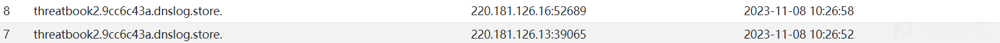](https://xzfile.aliyuncs.com/media/upload/picture/20240114105350-254a950c-b288-1.png)

由此可见，这个思路行得通。下边开始进一步尝试。

接着获取系统信息，以及系统中安装了哪些软件

[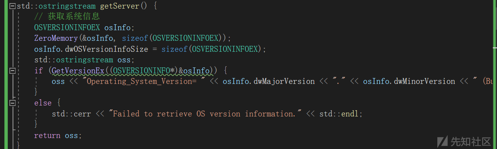](https://xzfile.aliyuncs.com/media/upload/picture/20240114105400-2b0334ea-b288-1.png)

[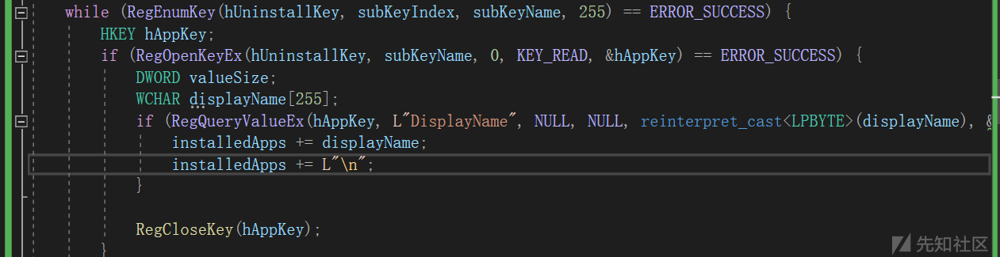](https://xzfile.aliyuncs.com/media/upload/picture/20240114105405-2e00a952-b288-1.png)

把编译好的程序上传到分析平台进行分析

[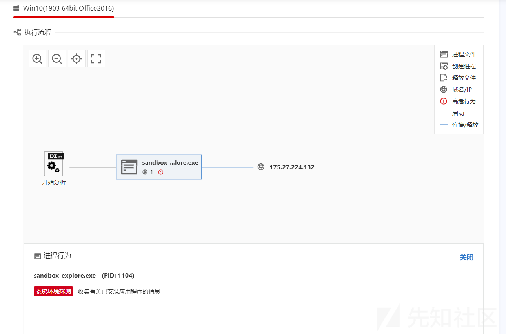](https://xzfile.aliyuncs.com/media/upload/picture/20240114105412-328d45b6-b288-1.png)

同样的，服务端也收到了相应。可以看到两个北京的IP，并且收集到安装的应用信息。

[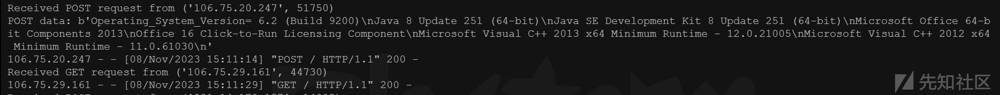](https://xzfile.aliyuncs.com/media/upload/picture/20240114105420-370e6e94-b288-1.png)

当然，这些信息可以在分析平台上直接看到。

我们的目的也不是收集这些信息，主要为了找到系统特征，从而识别沙箱系统。

一般从驱动文件、计算机主机名、CPU核心数、进程文件等方面检测是否在虚拟机中。

## 三、系统分析

主要收集沙箱的驱动文件、计算机主机名、CPU核心数、进程文件，然后从中找出特定规律，从而进行识别。

编写脚本，获取计算机名

```plain
char computerName[MAX_COMPUTERNAME_LENGTH + 1];
DWORD size = sizeof(computerName) / sizeof(computerName[0]);
if (!GetComputerNameA(computerName, &size)) {
    return "Error getting computer name";
}
```

获取CPU核心数

```plain
SYSTEM_INFO sysInfo;
GetSystemInfo(&sysInfo);
int cores = sysInfo.dwNumberOfProcessors;
```

获取进程文件

```plain
// 创建进程快照
HANDLE hProcessSnap = CreateToolhelp32Snapshot(TH32CS_SNAPPROCESS, 0);
if (hProcessSnap == INVALID_HANDLE_VALUE) {
    std::cerr << "Failed to create process snapshot." << std::endl;
    return L"";
}

PROCESSENTRY32 pe32;
pe32.dwSize = sizeof(PROCESSENTRY32);

// 获取第一个进程信息
if (!Process32First(hProcessSnap, &pe32)) {
    std::cerr << "Failed to retrieve process information." << std::endl;
    CloseHandle(hProcessSnap);
    return L"";
}
// 后边对进程进行遍历。没有采用直接获取进程的函数，因为那样获取的不完整。
```

本地进行测试

[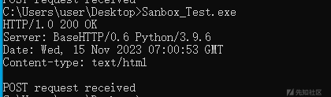](https://xzfile.aliyuncs.com/media/upload/picture/20240114105440-42f31c46-b288-1.png)

接收端

[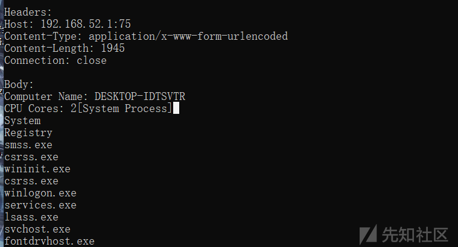](https://xzfile.aliyuncs.com/media/upload/picture/20240114105448-47ea8356-b288-1.png)

下边拿到沙箱进行测试，看看效果

查看日志，可以看到有连接过来

[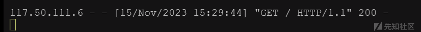](https://xzfile.aliyuncs.com/media/upload/picture/20240114105500-4ec0949a-b288-1.png)

主机名、核心数、进程等信息也成功获取。

[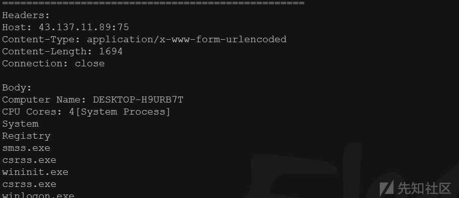](https://xzfile.aliyuncs.com/media/upload/picture/20240114105506-526efac8-b288-1.png)

主机名、CPU核心数没什么明显特征，下边详细看下进程。

共116个进程，去掉常见的系统进程`svchost.exe`，还剩59个

```plain
smss.exe - 会话管理子系统，Windows 的核心进程。
csrss.exe - 客户端/服务器运行时子系统，Windows 的另一个核心进程。
wininit.exe - Windows 启动应用程序。
winlogon.exe - Windows 登录应用程序。
services.exe - 服务和控制器应用程序，管理系统服务。
lsass.exe - 本地安全性子系统服务，处理与安全相关的功能。
fontdrvhost.exe - Windows 字体驱动程序主机，负责管理字体操作。
dwm.exe - 桌面窗口管理器，负责 Windows 中的图形效果。
spoolsv.exe - 打印池服务，管理打印任务。
audiodg.exe - Windows 音频设备图形隔离，处理与音频相关的进程。
AcrylicService.exe - 该软件是Windows的本地 DNS 代理。
sihost.exe - Shell 基础结构主机，管理 Windows 界面的多个图形元素。
ctfmon.exe - 监视活动窗口，并为语音识别、书写识别、键盘、翻译和其他中文可选用户输入方法技术提供文本输入服务支持。。
taskhostw.exe - Windows 任务主机，托管后台任务。
explorer.exe - Windows 资源管理器，文件和文件夹管理界面。
ChsIME.exe - 中文输入法编辑器（IME）。
StartMenuExperienceHost.exe - 托管 Windows 启动菜单体验。
RuntimeBroker.exe - 处理 Windows 商店应用的应用程序权限和数据访问。
ApplicationFrameHost.exe - 托管通用 Windows 平台（UWP）应用程序。
MicrosoftEdge.exe - Microsoft Edge 网页浏览器。
browser_broker.exe - Windows 浏览器代理程序，处理 Microsoft Edge 和 Windows 之间的通信。
dllhost.exe - COM 代理，将 COM 对象托管在与调用进程分开的进程中。
Windows.WARP.JITService.exe - 与 Windows Runtime Just-In-Time（JIT）编译服务相关。
MicrosoftEdgeSH.exe - Microsoft Edge SmartScreen 进程。
MicrosoftEdgeCP.exe - Microsoft Edge 内容进程。
WindowsInternal.ComposableShell.Experiences.TextInput.InputApp.exe - Windows 文本输入应用程序。
WeChat.exe - 微信应用程序。
WmiPrvSE.exe - Windows 管理规范提供者服务。
SgrmBroker.exe - 系统保护运行时监视器代理。
ShellExperienceHost.exe - Windows Shell 体验主机。
unsecapp.exe - WMI 未安全脚本宿主。
GoogleUpdateSetup.exe - Google 更新安装程序。
csfalconservice.exe - CrowdStrike公司的EDR产品。
RemindersServer.exe - 与提醒功能相关，可能是特定应用程序的一部分。
GoogleUpdate.exe - Google 更新服务。
CSFalconContainer.exe - CrowdStrike公司的EDR产品。
backgroundTaskHost.exe - 托管通用 Windows 平台（UWP）应用程序的后台任务。
WUDFHost.exe - Windows 驱动程序基础 - 用户模式驱动程序框架主机进程。
Detonate.exe - 未知。
UnThreat.exe - 与防病毒软件（UnThreat Antivirus）有关。
utsvc.exe - 与防病毒软件（UnThreat Antivirus）有关。
system.exe - 本程序。
conhost.exe - 控制台窗口主机，管理控制台窗口。
```

去掉所有系统进程，剩下如下应用进程：

```plain
dVbLgmPuXy.exe - 未知，应该是一个随机生成的名字。
WeChat.exe - 微信应用程序。
GoogleUpdateSetup.exe - Google 更新安装程序。
csfalconservice.exe - CrowdStrike公司的EDR产品。
GoogleUpdate.exe - Google 更新服务。
CSFalconContainer.exe - CrowdStrike公司的EDR产品。
Detonate.exe - 未知。
UnThreat.exe - 防病毒软件（UnThreat Antivirus）。
utsvc.exe - 防病毒软件（UnThreat Antivirus） ，是UnThreat Service Manager的一部分。
```

其中最特别的是`Detonate.exe`，网上只找到两个相关的信息。一个是病毒样本，另一个就是其他大佬分析微步沙箱时抓取的进程。那么这个很有可能就是微步沙箱的一个特征了。

[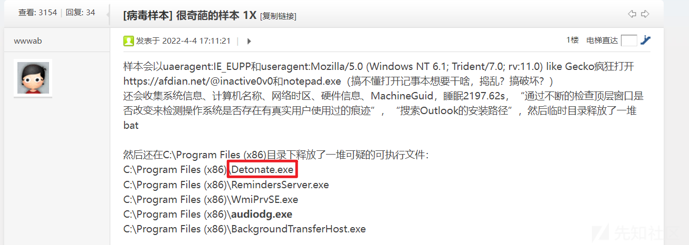](https://xzfile.aliyuncs.com/media/upload/picture/20240114105527-5efec8c2-b288-1.png)

[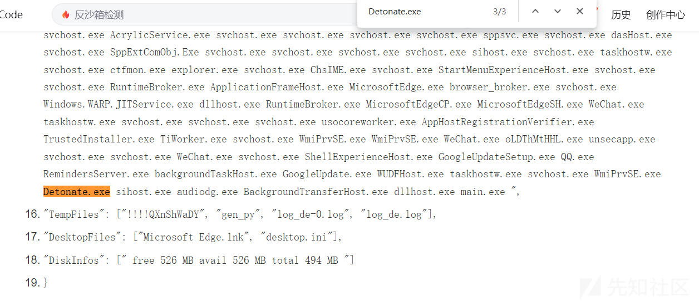](https://xzfile.aliyuncs.com/media/upload/picture/20240114105533-62962dd6-b288-1.png)

## 四、常见虚拟机分析

下边主要从驱动文件、计算机主机名、CPU核心数、进程文件等方面，分析常见虚拟机。常见的虚拟机有VMware、VirtualBox、Hyper-V、Xen、Parallels等，都有各自的驱动文件。

比如VMware的文件特征：vm。但是宿主机也会有这种特征的文件。宿主机和虚拟机都在`C:\Program Files\Common Files\VMware`目录下有一些驱动文件。但是文件略有不同，如下，左为宿主机，右为虚拟机。

[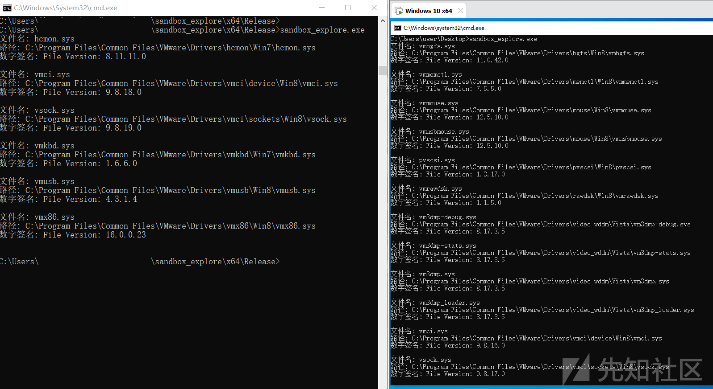](https://xzfile.aliyuncs.com/media/upload/picture/20240114105545-69b255ea-b288-1.png)

并且，部分同名文件，在宿主机和在虚拟机中的签名不一样。

[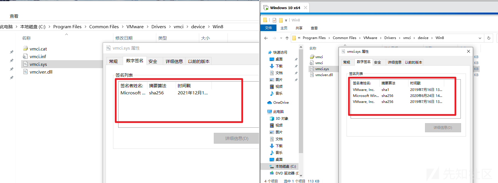](https://xzfile.aliyuncs.com/media/upload/picture/20240114105553-6ecf0d98-b288-1.png)

## 五、总结

综上所述，每种虚拟化技术特征各不相同，仅凭单一维度来确定虚拟沙箱不准确，需要多个维度综合判定。针对木马程序，想要绕过沙箱检测，针对每种沙箱编写不同的识别代码，显然很臃肿。
