# 一种Java反编译器的通用对抗手段

### 如何生成反编译失败的class文件?

build.gradle.kts

```Kotlin
plugins {
    java
    kotlin("jvm") version "1.3.61"
}

group = "org.vidar"
version = "1.0.0"

repositories {
    mavenCentral()
    maven("https://maven.hackery.site/")
}

dependencies {
    implementation(kotlin("stdlib-jdk8"))

    arrayOf("asm", "asm-tree", "asm-commons").forEach {
        implementation(group = "org.ow2.asm", name = it, version = "7.2")
    }

    implementation("codes.som.anthony:koffee:7.1.0")
}

configure<JavaPluginConvention> {
    sourceCompatibility = JavaVersion.VERSION_1_8
}
tasks {
    compileKotlin {
        kotlinOptions.jvmTarget = "1.8"
    }
    compileTestKotlin {
        kotlinOptions.jvmTarget = "1.8"
    }
}
```

使用koffee(一个class生成库)直接操作class指令

```Kotlin
import codes.som.anthony.koffee.assembleClass
import codes.som.anthony.koffee.insns.jvm.*
import codes.som.anthony.koffee.modifiers.public
import org.objectweb.asm.ClassWriter
import org.objectweb.asm.tree.ClassNode
import java.io.FileOutputStream
import java.io.PrintStream


fun saveClz(payload: ClassNode) {

    val classWriter = ClassWriter(ClassWriter.COMPUTE_MAXS)
    payload.accept(classWriter)
    val fos = FileOutputStream("Payload.class")
    fos.write(classWriter.toByteArray())
    fos.close()
    println("success")
}

fun main() {
    saveClz(assembleClass(public, "Payload") {
        method(public + static, "hack", void) {

            new(ProcessBuilder::class.java)
            dup
            iconst_1
            anewarray(String::class.java)
            dup
            iconst_0
            ldc("gnome-calculator")
            aastore
            invokespecial(ProcessBuilder::class.java,"<init>",void, Array<String>::class)
            invokevirtual(ProcessBuilder::class.java,"start",Process::class.java)
            pop

            swap

            _return
        }
    })
}
```

可以看到FernFlower反编译失败

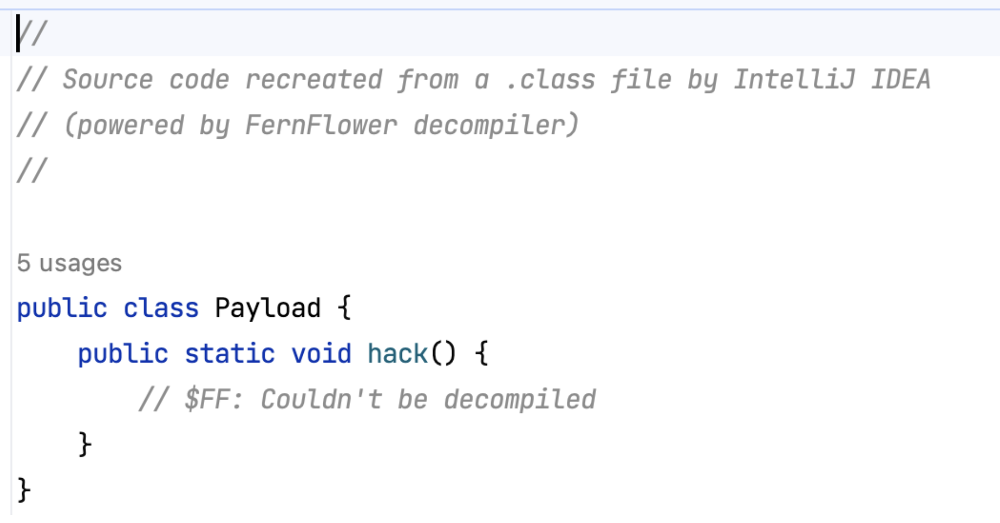

jadx-gui也同样失败

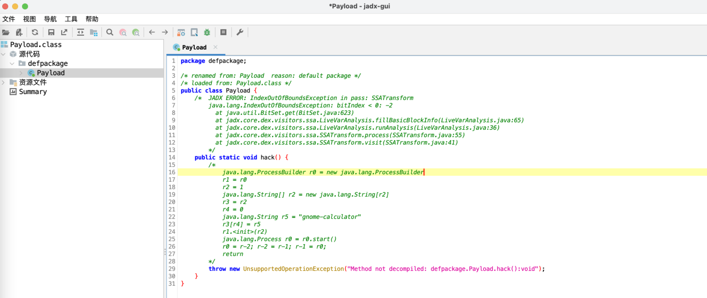

现在我们就可以肆无忌惮的给我们的class添加指令了，例如我们再添加一些逻辑指令来混淆

```Kotlin
fun main() {
    saveClz(assembleClass(public, "Payload") {
        method(public + static, "hack", void) {

            new(ProcessBuilder::class.java)
            dup
            iconst_1
            anewarray(String::class.java)
            dup
            iconst_0
            ldc("gnome-calculator")
            aastore
            invokespecial(ProcessBuilder::class.java,"<init>",void, Array<String>::class)
            invokevirtual(ProcessBuilder::class.java,"start",Process::class.java)
            pop

            bipush(3)
            istore_1 
            +L["loop_start"]
            ldc("1ue")
            iinc(1, -1) 
            iload_1
            ifne(L["loop_start"]) 
            swap
            for (i in 0 until 3) {
                getstatic(System::class, "out", PrintStream::class)
                swap
                invokevirtual(PrintStream::class, "println", void, String::class)
            }

            _return
        }
    })
}
```

这样也让jd-gui反编译失败

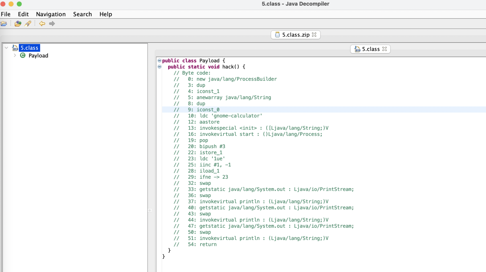

### 为什么反编译会失败？

其实你使用jclasslib直接查看jvm指令还是可以看到的（当然只是部分，我们可以再混淆一下，）

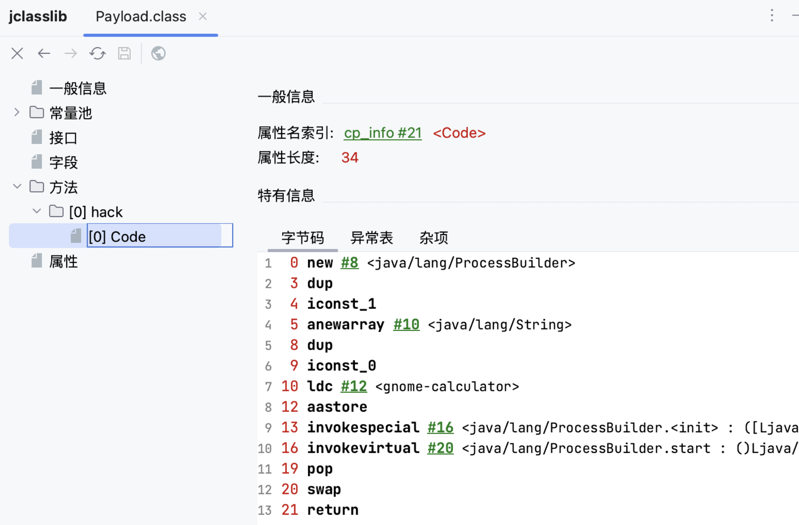

而反编译器失败的原因是，反编译器或者说jvm在运行时会对class的合法性进行校验

对于案例中的Payload.class，如果你去掉了`swap`**指令**，你会发现反编译依然可以成功。

而为什么在最后加了一个swap指令，反编译就会失败，或者说jvm校验class会不通过？

你可以在[https://en.wikipedia.org/wiki/List\_of\_Java\_bytecode\_instructions中查看swap指令对应的意思，就是交换2个栈顶的值，那么如果前面没有一些对入栈的操作，jvm在校验class的时候很有可能会失败（至少hotspot时这样）](https://en.wikipedia.org/wiki/List_of_Java_bytecode_instructions%E4%B8%AD%E6%9F%A5%E7%9C%8Bswap%E6%8C%87%E4%BB%A4%E5%AF%B9%E5%BA%94%E7%9A%84%E6%84%8F%E6%80%9D%EF%BC%8C%E5%B0%B1%E6%98%AF%E4%BA%A4%E6%8D%A22%E4%B8%AA%E6%A0%88%E9%A1%B6%E7%9A%84%E5%80%BC%EF%BC%8C%E9%82%A3%E4%B9%88%E5%A6%82%E6%9E%9C%E5%89%8D%E9%9D%A2%E6%B2%A1%E6%9C%89%E4%B8%80%E4%BA%9B%E5%AF%B9%E5%85%A5%E6%A0%88%E7%9A%84%E6%93%8D%E4%BD%9C%EF%BC%8Cjvm%E5%9C%A8%E6%A0%A1%E9%AA%8Cclass%E7%9A%84%E6%97%B6%E5%80%99%E5%BE%88%E6%9C%89%E5%8F%AF%E8%83%BD%E4%BC%9A%E5%A4%B1%E8%B4%A5%EF%BC%88%E8%87%B3%E5%B0%91hotspot%E6%97%B6%E8%BF%99%E6%A0%B7%EF%BC%89)

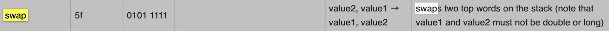

### 如何运行/加载Payload.class?

正常情况下我们想要运行Payload.class中hack()函数的逻辑，应使用如下这段代码

```Java
package org.vidar;

import java.io.IOException;
import java.lang.reflect.InvocationTargetException;
import java.lang.reflect.Method;
import java.nio.file.Files;
import java.nio.file.Paths;

public class Main {
    public static void main(String[] args) throws ClassNotFoundException, NoSuchMethodException, InvocationTargetException, IllegalAccessException {
        Class<?> payload = new InMemoryClassLoader().findClass("Payload");
        Method m = payload.getDeclaredMethod("hack");
        m.setAccessible(true);
        System.out.println(m);
        m.invoke(null);
    }

    static class InMemoryClassLoader extends ClassLoader {
        @Override
        protected Class<?> findClass(String name) throws ClassNotFoundException {
            byte[] classData = new byte[0];
            try {
                classData = Files.readAllBytes(Paths.get("/home/1ue/Downloads/Payload.class"));
            } catch (IOException e) {
                e.printStackTrace();
            }
            return defineClass(name, classData, 0, classData.length);
        }
    }
}
```

但是直接运行会报错java.lang.VerifyError也就是class没有通过校验

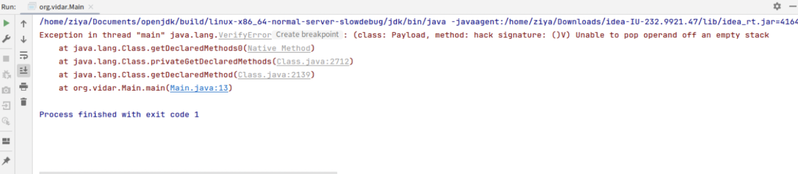

但是jvm有一个`-noverify`的启动参数，其作用是禁用字节码验证

我们在IDEA中设置一下

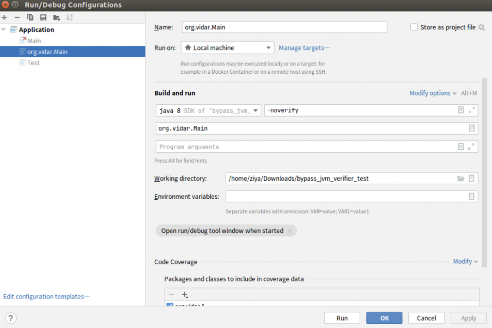

再次运行

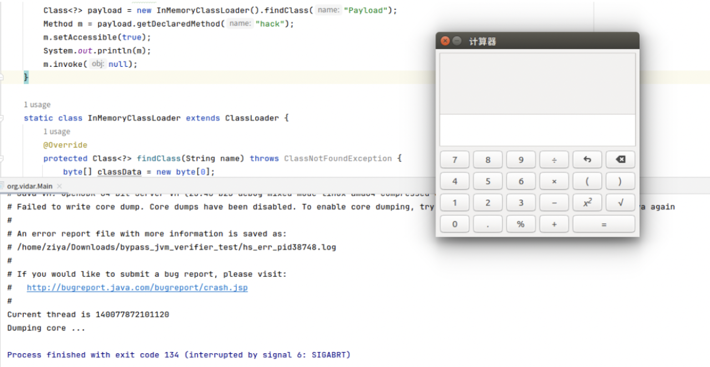

### 如何在java层利用？

如果是修改jvm的启动参数，这显得略有些鸡肋

不过庆幸的是我们可以利用**Unsafe**来为jvm添加了-noverify的参数的效果

所以我们需要知道-noverify到底做了什么

-   如图，-noverify的启动选项在java.c文件中定义，相当于添加了`-Xverify:none`的option

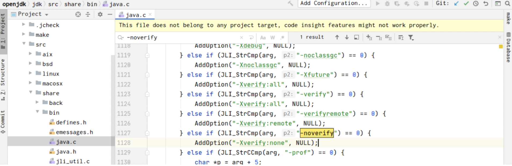

-   对于`-X`的option，hotspot对应的处理逻辑在`arguements.cpp`中，对于none来说，就相当于把`BytecodeVerificationLocal`和`BytecodeVerificationRemote`这2个值设置为**false**

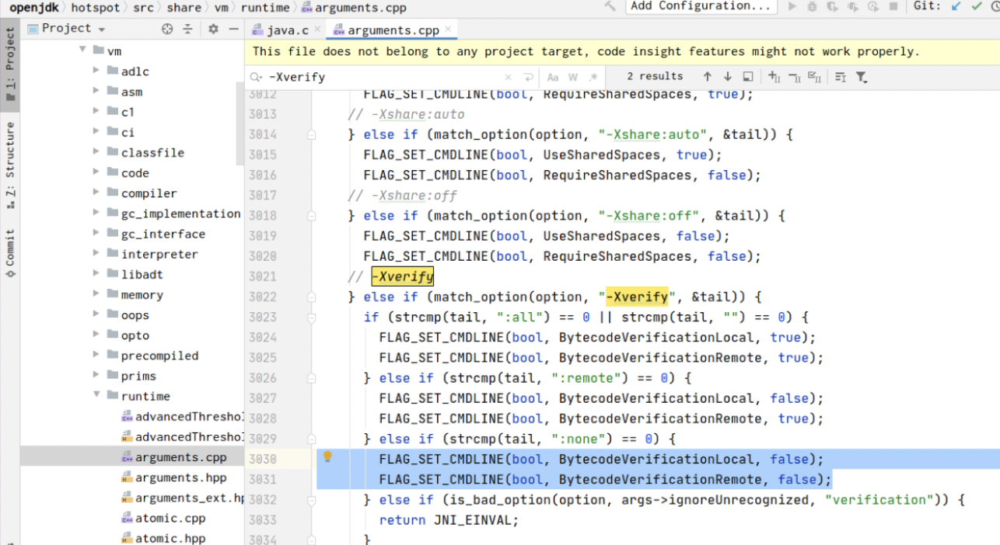

-   **所以我们现在的目的就是把这2个标志所对应的地址的值设置为0**

在x86的linux的jdk中，JVM公开了一些全局字段，以允许应用程序检查其当前状态。

```Kotlin
$ cd /usr/lib/jvm/default/jre/lib/amd64/server/
server/ $ nm -D libjvm.so | grep gHotSpot
0000000000d222e0 B gHotSpotVMIntConstantEntryArrayStride
0000000000d222f0 B gHotSpotVMIntConstantEntryNameOffset
0000000000d222e8 B gHotSpotVMIntConstantEntryValueOffset
0000000000ce4568 D gHotSpotVMIntConstants
0000000000d222c8 B gHotSpotVMLongConstantEntryArrayStride
0000000000d222d8 B gHotSpotVMLongConstantEntryNameOffset
0000000000d222d0 B gHotSpotVMLongConstantEntryValueOffset
0000000000ce4560 D gHotSpotVMLongConstants
0000000000d22338 B gHotSpotVMStructEntryAddressOffset
0000000000d22330 B gHotSpotVMStructEntryArrayStride
0000000000d22358 B gHotSpotVMStructEntryFieldNameOffset
0000000000d22348 B gHotSpotVMStructEntryIsStaticOffset
0000000000d22340 B gHotSpotVMStructEntryOffsetOffset
0000000000d22360 B gHotSpotVMStructEntryTypeNameOffset
0000000000d22350 B gHotSpotVMStructEntryTypeStringOffset
0000000000ce4578 D gHotSpotVMStructs
0000000000d222f8 B gHotSpotVMTypeEntryArrayStride
0000000000d22310 B gHotSpotVMTypeEntryIsIntegerTypeOffset
0000000000d22318 B gHotSpotVMTypeEntryIsOopTypeOffset
0000000000d22308 B gHotSpotVMTypeEntryIsUnsignedOffset
0000000000d22300 B gHotSpotVMTypeEntrySizeOffset
0000000000d22320 B gHotSpotVMTypeEntrySuperclassNameOffset
0000000000d22328 B gHotSpotVMTypeEntryTypeNameOffset
0000000000ce4570 D gHotSpotVMTypes
```

与此同时，我们可以使用`ClassLoader`的`findNative`方法来定位java native的原生句柄，也就是可以用它来查找Java进程中的任意本机符号，包括gHotSpotXXX这种

例如下面这段来测试一下gHotSpotVMStructs（它对外暴露了JVM内部的大量信息，像原始的堆的地址，线程、栈的地址等。）

```Java
public class TestVMStructs {
    public static void main(String[] args) {
        Long vmStructs = BytecodeVerifierNoper.findNative("gHotSpotVMStructs", null);
        Unsafe unsafe = BytecodeVerifierNoper.getUnsafe();
        System.out.printf(Long.toHexString(vmStructs)+
                ", value: "+ Long.toHexString(unsafe.getLong(vmStructs)));
    }
}
```

多运行几次，发现最后三位总是不变，也就是说HotSpot结构在内存中的实际地址为基地址+libjvm.so中的地址

```Java
7fcb1258dfc0, value: 7fcb1257d440
7f6245867fc0, value: 7f6245857440
7f041ca03fc0, value: 7f041c9f3440
7f0c4ca66fc0, value: 7f0c4ca56440
7f219f4f8fc0, value: 7f219f4e8440
```

如果你研究过**sa-jdi.jar**(提供调试接口)的原理，你就会发现逻辑其实和它有些相似

所以我们现在的思路：

-   遍历gHotSpotVMStructs来获取所有的VMStruct
-   遍历所有的VMStruct来获取所有的VMType
-   最后从所有的JVMType中获取所有的JVMFlag，如果是BytecodeVerificationLocal或BytecodeVerificationRemote，我们就把它置为false（0）

代码如下：

```Java
package org.vidar;

import org.vidar.entity.Fld;
import org.vidar.entity.JVMFlag;
import org.vidar.entity.JVMStruct;
import org.vidar.entity.JVMType;
import sun.misc.Unsafe;

import java.lang.reflect.Constructor;
import java.lang.reflect.InvocationTargetException;
import java.lang.reflect.Method;
import java.util.ArrayList;
import java.util.HashMap;
import java.util.List;
import java.util.Map;

public class BytecodeVerifierNoper {
    private static Unsafe unsafe = getUnsafe();
    private static Method findNativeMethod = getFindNativeMethod();

    public static void nop() {
        Map<String, JVMStruct> structs = getStructs();
        System.out.println("structs size:" + structs.size());
        Map<String, JVMType> types = getTypes(structs);
        System.out.println("types size:" + types.size());
        List<JVMFlag> flags = getFlags(types);
        for (JVMFlag flag : flags) {
            if (flag.getName().equals("BytecodeVerificationLocal")
                    || flag.getName().equals("BytecodeVerificationRemote"))  {
                unsafe.putByte(flag.getAddress(), (byte) 0);
            }
        }
    }

    public static List<JVMFlag> getFlags(Map<String, JVMType> types) {
        List<JVMFlag> jvmFlags = new ArrayList<>();

        JVMType flagType = types.get("Flag");
        if (flagType == null) {
            flagType = types.get("JVMFlag");
            if (flagType == null) {
                throw new RuntimeException("Could not resolve type 'Flag'");
            }
        }

        Fld flagsField = flagType.getFields().get("flags");
        if (flagsField == null) {
            throw new RuntimeException("Could not resolve field 'Flag.flags'");
        }
        long flags = unsafe.getAddress(flagsField.getOffset());

        Fld numFlagsField = flagType.getFields().get("numFlags");
        if (numFlagsField == null) {
            throw new RuntimeException("Could not resolve field 'Flag.numFlags'");
        }
        int numFlags = unsafe.getInt(numFlagsField.getOffset());

        Fld nameField = flagType.getFields().get("_name");
        if (nameField == null) {
            throw new RuntimeException("Could not resolve field 'Flag._name'");
        }

        Fld addrField = flagType.getFields().get("_addr");
        if (addrField == null) {
            throw new RuntimeException("Could not resolve field 'Flag._addr'");
        }

        for (int i = 0; i < numFlags; i++) {
            long flagAddress = flags + (i * flagType.getSize());
            long flagNameAddress = unsafe.getAddress(flagAddress + nameField.getOffset());
            long flagValueAddress = unsafe.getAddress(flagAddress + addrField.getOffset());

            String flagName = getString(flagNameAddress);
            if (flagName != null) {
                JVMFlag flag = new JVMFlag(flagName, flagValueAddress);
                jvmFlags.add(flag);
            }
        }

        return jvmFlags;
    }


    public static Map<String, JVMType> getTypes(Map<String, JVMStruct> structs) {
        Map<String, JVMType> types = new HashMap<>();

        long entry = symbol("gHotSpotVMTypes");
        long arrayStride = symbol("gHotSpotVMTypeEntryArrayStride");

        while (true) {
            String typeName = derefReadString(entry + offsetTypeSymbol("TypeName"));
            if (typeName == null) {
                break;
            }

            String superClassName = derefReadString(entry + offsetTypeSymbol("SuperclassName"));

            int size = unsafe.getInt(entry + offsetTypeSymbol("Size"));
            boolean oop = unsafe.getInt(entry + offsetTypeSymbol("IsOopType")) != 0;
            boolean intType = unsafe.getInt(entry + offsetTypeSymbol("IsIntegerType")) != 0;
            boolean unsigned = unsafe.getInt(entry + offsetTypeSymbol("IsUnsigned")) != 0;

            Map<String, Fld> structFields = null;
            JVMStruct struct = structs.get(typeName);
            if (struct != null) {
                structFields = struct.getFields();
            }

            JVMType jvmType = new JVMType(typeName, superClassName, size, oop, intType, unsigned);
            if (structFields != null) {
                jvmType.getFields().putAll(structFields);
            }

            types.put(typeName, jvmType);

            entry += arrayStride;
        }

        return types;
    }


    public static Map<String, JVMStruct> getStructs() {
        Map<String, JVMStruct> structs = new HashMap<>();

        long currentEntry = symbol("gHotSpotVMStructs");
        long arrayStride = symbol("gHotSpotVMStructEntryArrayStride");

        while (true) {
            String typeName = derefReadString(currentEntry + offsetStructSymbol("TypeName"));
            String fieldName = derefReadString(currentEntry + offsetStructSymbol("FieldName"));
            if (typeName == null || fieldName == null) {
                break;
            }

            String typeString = derefReadString(currentEntry + offsetStructSymbol("TypeString"));
            boolean staticField = unsafe.getInt(currentEntry + offsetStructSymbol("IsStatic")) != 0;

            long offsetOffset = staticField ? offsetStructSymbol("Address") : offsetStructSymbol("Offset");
            long offset = unsafe.getLong(currentEntry + offsetOffset);

            JVMStruct struct = structs.computeIfAbsent(typeName, JVMStruct::new);
            struct.setField(fieldName, new Fld(fieldName, typeString, offset, staticField));

            currentEntry += arrayStride;
        }

        return structs;
    }

    public static long symbol(String name) {
        return unsafe.getLong(findNative(name,null));
    }

    public static long offsetStructSymbol(String name) {
        return symbol("gHotSpotVMStructEntry" + name + "Offset");
    }

    public static long offsetTypeSymbol(String name) {
        return symbol("gHotSpotVMTypeEntry" + name + "Offset");
    }

    public static String derefReadString(long addr) {
        return getString(unsafe.getLong(addr));
    }

    public static String getString(long addr) {
        if (addr == 0L) {
            return null;
        }
        StringBuilder stringBuilder = new StringBuilder();
        int offset = 0;

        while (true) {
            byte b = unsafe.getByte(addr + offset);
            char ch = (char) b;
            if (ch == '\u0000') {
                break;
            }
            stringBuilder.append(ch);
            offset++;
        }
        return stringBuilder.toString();
    }

    public static Long findNative(String name,ClassLoader classLoader) {
        try {
            return (Long) findNativeMethod.invoke(null,classLoader,name);
        } catch (IllegalAccessException e) {
            throw new RuntimeException(e);
        } catch (InvocationTargetException e) {
            throw new RuntimeException(e);
        }
    }


    private static Method getFindNativeMethod() {
        try {
            Method findNative = ClassLoader.class.getDeclaredMethod("findNative", ClassLoader.class, String.class);
            findNative.setAccessible(true);
            return findNative;
        } catch (NoSuchMethodException e) {
            throw new RuntimeException(e);
        }
    }


    public static Unsafe getUnsafe() {
        try {
            Constructor constructor = Unsafe.class.getDeclaredConstructor();
            constructor.setAccessible(true);
            return (Unsafe) constructor.newInstance();
        } catch (NoSuchMethodException e) {
            throw new RuntimeException(e);
        } catch (InstantiationException e) {
            throw new RuntimeException(e);
        } catch (IllegalAccessException e) {
            throw new RuntimeException(e);
        } catch (InvocationTargetException e) {
            throw new RuntimeException(e);
        }
    }
}
```

具体代码可见[https://github.com/luelueking/Bypass\_JVM\_Verifier/tree/main/bypass\_jvm\_verifier\_test/src/main/java/org/vidar](https://github.com/luelueking/Bypass_JVM_Verifier/tree/main/bypass_jvm_verifier_test/src/main/java/org/vidar)

### 效果

-   在运行/加载非法class之前，我们先使用BytecodeVerifierNoper的nop函数，来使jvm不会对class进行检查
-   然后运行、加载我们的class

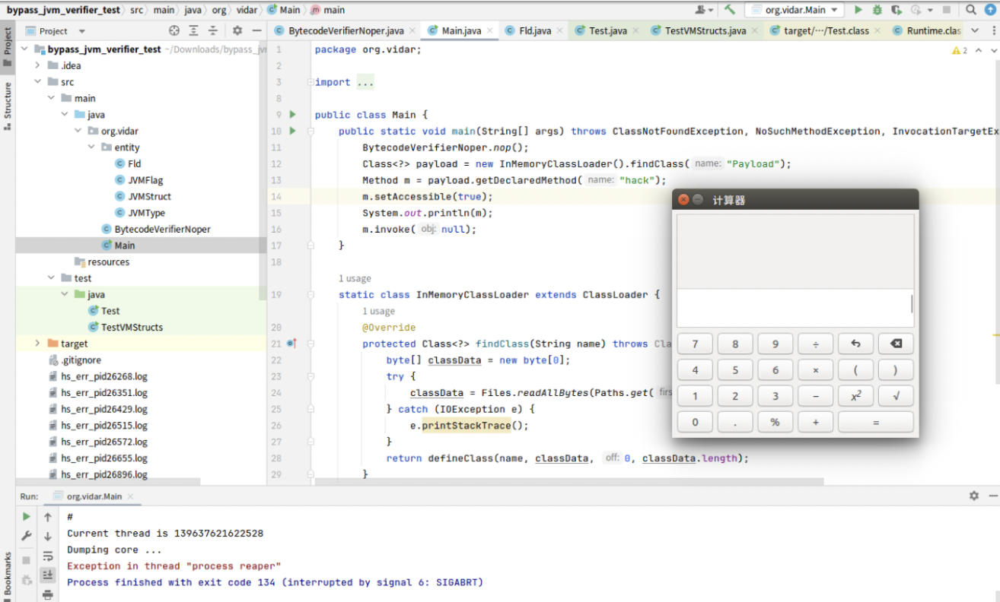

> 操作环境：ubuntu16，x86 jdk8

-   下面该到玩jvm指令的时间🐶了

### 参考

[https://som.codes/blog/2019-12-30/jvm-hackery-noverify/](https://som.codes/blog/2019-12-30/jvm-hackery-noverify/)

[https://zhuanlan.zhihu.com/p/451838451](https://zhuanlan.zhihu.com/p/451838451)

[https://juejin.cn/post/6992108216695930917](https://juejin.cn/post/6992108216695930917)
