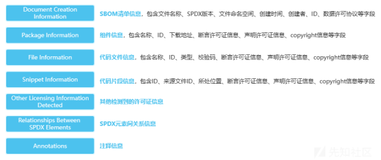
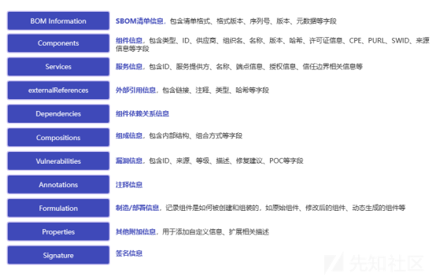
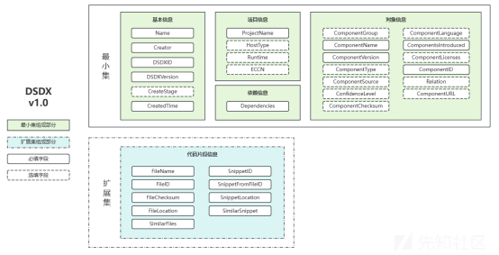
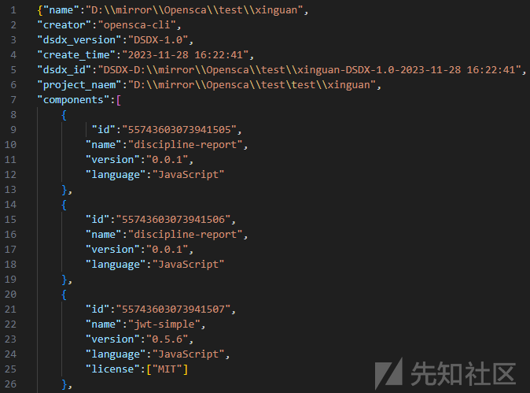
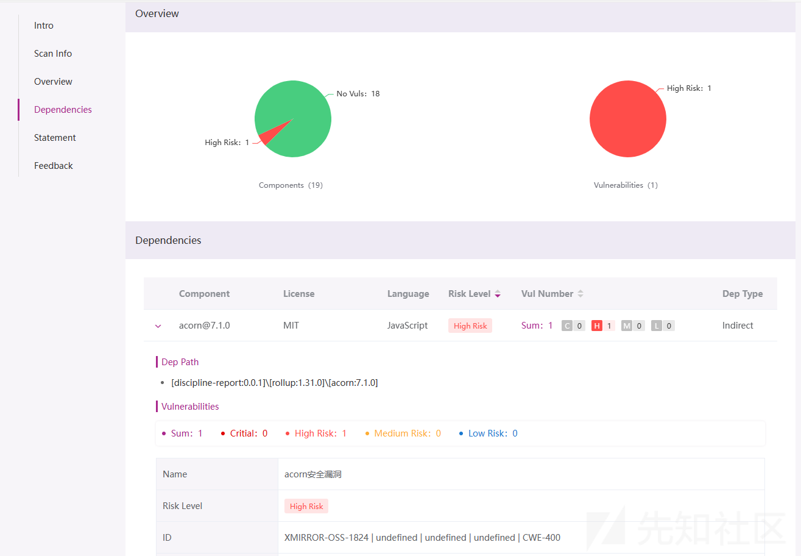

# 不同格式标准SBOM清单横评：SPDX、CDX和DSDX - 先知社区

不同格式标准SBOM清单横评：SPDX、CDX和DSDX

- - -

为了保证安全性、降低开发、采购及维护的相关成本，复杂动态的现代软件供应链对软件资产透明度提出了更高的要求。使用清晰的软件物料清单（SBOM）收集和共享信息，并在此基础上进行漏洞、许可证和授权管理等，可以揭示整个软件供应链中的弱点、提高软件供应链的透明度并增进供应链上下游间的相互信任、有效管控软件供应链攻击的威胁。

从定义上讲, SBOM是包含软件应用中使用的所有组件、库和其他依赖项的列表。国际通用的SBOM标准格式包括SPDX、CDX和SWID，前两者由于记录着更详细的依赖信息而得到了更广泛的使用。

DSDX（Digital Supply-chain Data Exchange）是由OpenSCA社区主导，开源中国、电信研究院、中兴通讯联合发起的中国首个数字供应链SBOM格式，更适配中国企业实战化应用实践场景，并且能兼容SPDX、CDX、SWID国际标准和国内标准。

更多DSDX相关信息请参考：[SCA技术进阶系列（四）：DSDX SBOM供应链安全应用实践](https://mp.weixin.qq.com/s?__biz=MzkwMjMxMDMyMQ==&mid=2247485840&idx=1&sn=f383c594a355e0cf04f6a12348e5df9a&chksm=c0a6394ef7d1b05847c5589845962a786fac4300061165312eead8596c5b520e8cdd9e7ddfa0&token=777777255&lang=zh_CN#rd "SCA技术进阶系列（四）：DSDX SBOM供应链安全应用实践")

下文将对SPDX、CDX及DSDX三种标准SBOM格式进行对比分析。

**01 SPDX**

**1.1 许可证**

cc-by-3.0

**1.2 格式简介**

SPDX（Software Package Data Exchange）是Linux基金会的一个开源项目，旨在作为收集和共享软件数据的通用格式，已于2021年9月被ISO列入SBOM国际标准（ISO/IEC 5962），也是目前唯一一个获此认可的SBOM标准格式。今年5月项目发布了v3.0-rc1（候选版本，目前尚无完整的官方文档），目前最广泛使用的仍然是2020年发布的v2.2版本。

SPDX标准格式SBOM清单中包含用于描述许可证信息的详细字段，并涵盖了代码文件及片段引用场景；自v2.1开始，安全性方面，也已支持与漏洞数据的关联。SPDX支持的输出格式包括SPDX、XML、JSON、RDF和YAML。

**1.3 字段说明**

SPDX（v2.2） 格式标准 SBOM 包含以下部分：

**02 CDX**

**2.1 许可证**

apache-2.0

**2.2 格式简介**

CDX （CycloneDX）是OWASP发布的轻量级SBOM标准，专注于自动化整个软件构建周期中对SBOM的使用和管理。目前最新的版本是今年6月发布的v1.5。

与SPDX相比，在记录授权和依赖关系的基础上，CDX提供了更多与安全性相关的信息，相对更适用于安全审计、漏洞管理等场景。此外，CDX还支持对硬件及云系统的描述，并有专门的部分记录服务信息及制造/部署信息，有更强的扩展性。不过相应地，它的完整字段设计及嵌套关系也会更加复杂。CDX支持的输出格式有XML和JSON。

**2.3 字段说明**

CDX（v1.5） 格式标准 SBOM 包含以下部分：

**03 DSDX**

**3.1 格式简介**

目前，我国尚无SBOM标准格式相关国标；基于广大社区用户的实践反馈及对国际标准格式的研究，今年8月推出的DSDX着重考虑了运行环境及供应链流转信息的引入，以最小集/扩展集的形式增强了SBOM应用的灵活性，并考虑了国内企业出海合规相关需求的场景。DSDX支持的输出格式包括DSDX、JSON和XML。

DSDX是社区实践的产物，正处于蓬勃发展的阶段，欢迎向项目组提出反馈及建议，与我们共同建设国内首个标准SBOM格式。

**3.2 字段说明**

DSDX（v1.0） 格式标准 SBOM 包含以下部分：

**04 总结**

简言之，唯一被写入ISO国际标准的SPDX在标准化的基础上相对更关注对许可证信息的描述，能记录更多安全及服务相关信息的CDX有更强的扩展性，而基于国内实践发布的DSDX则引入了运行环境及供应链流转信息并对描述对象做了最小集/扩展集的拆分。

**使用OpenSCA按需输出标准格式SBOM**

OpenSCA支持输出SPDX/CDX/DSDX及SWID标准格式SBOM文件，一站式解决各种需求；从v3.0.0开始，还新增了通过SBOM清单输出依赖、漏洞及许可证信息的能力。

**| 使用样例**

① 输出SBOM清单

opensca-cli -path ${project\_path} -out output.dsdx  

② 使用SBOM清单输出漏洞及许可证清单

opensca-cli -token ${token} -path ${sbomname.suffix} -out output.html  
\*此处suffix可以是

dsdx/dsdx.json/dsdx.xml/cdx.json/cdx.xml等

（准确起见，输入的SBOM需包含Purl信息，故而更推荐使用CDX及DSDX）

