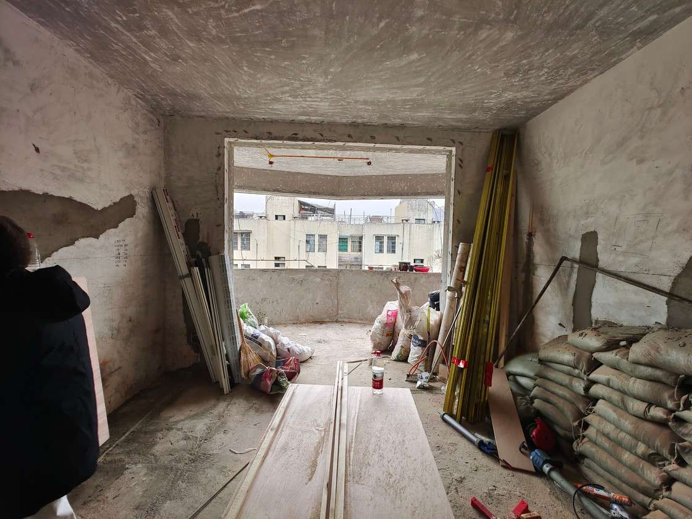

# 二十年后拆掉重建，这是我们「没有风格」的新家 - 少数派

二十年后拆掉重建，这是我们「没有风格」的新家

[念菲芃](https://sspai.com/u/ro65tba7/updates)

1 天前

**Matrix 首页推荐** 

[Matrix](https://sspai.com/matrix) 是少数派的写作社区，我们主张分享真实的产品体验，有实用价值的经验与思考。我们会不定期挑选 Matrix 最优质的文章，展示来自用户的最真实的体验和观点。   
文章代表作者个人观点，少数派仅对标题和排版略作修改。

- - -

当我们谈论装修。脑袋里浮现的，一方面是对生活的想象，另一方面才是如何靠装修实现对生活的想象。

> 装修风格重要吗？

或许重要，它提供了一些语言词汇去描述视觉上的审美喜好，但绝不该成为一种模版（从小到大模版化的生活早已经过够了！）  相比风格，功能在我看来更重要——即一切存在物都是为了满足功能需求而非仅装饰。

一切从对生活的想象开始。

这里是我和菲芃的家，未来几年，大概率两人两猫一起生活

我们希望在这个家里能得到彻底放松：有属于自己的沙发，就像《生活大爆炸》里，sheldon 也有自己作为「宇宙坐标原点」的沙发角落；在吃饭的时刻，有更多的交流，可以产生互动的餐厨空间。

能在这个家里进行一些娱乐休闲活动：游戏，看电影，听音乐，阅读，运动。

能在这里专注的工作学习：互不打扰，独属于自己的书桌角落，一面书架能放下我们所有收藏的书，杂志，文创类的东西。

能在这个家里拥有高质量的睡眠：一间光秃秃的只能睡觉的卧室，一些暗一点的光源。

……

接下来，结合房子的实际情况反推如何布局和装饰。

##  客厅 

这个房子菲芃住了近二十年，两房两厅一卫，砖混结构，意味着任何结构上的重塑都不可能，只能在原有结构上布局。卧室和书房需各占一间房，以保证高质量睡眠和高专注度工作，剩下的客厅则需承担其他几乎所有功能。因此客厅需要灵活性更高的家具。

我和菲芃都很喜欢躺（摊）在沙发上，宜家可以拆分的索得汉沙发，轻盈又宽大，适合后期灵活改变客厅格局，也适合瘫着，只选了两个单元，一人一块地。

电视则用滚轮支架支撑，无论在阳台，沙发和餐厅都能看。电视墙的抛弃，使得客厅多了一面可以承载更多功能的墙（目前是在这里放音乐和展示摄影作品）。

用边几和板凳代替茶几，除了看着更清爽，也有了在客厅中间锻炼健身的可能。

DIY 后的宜家毕利书柜，多买了两层隔板，当作下翻门；窄款的去掉背板，再加两层隔板，更像 CD 架了。

## 卧室 

为了卧室只睡觉，床头柜衣柜都通通舍弃，只需要能放下手机眼镜等小东西就够了，于是设计了这个可能只适合我家的床头板。同时开辟了衣帽间，门一关，卧室只剩下大床和一个懒人沙发。功能单一的卧室，确实让睡眠质量大有提升，几乎解决了我的失眠困扰。

由于只需睡觉，卧室的灯设置成比较暗的各种小光源，宜家的这款纸灯便宜又自带温馨氛围。

## 书房 

关于书房如何摆放书桌，菲芃和我商量了很久，我们都同意互不干扰的重要性，但他喜欢书桌贴墙，而我喜欢书桌在房中央，现在的方案，满足了两个人的喜好的同时，又有只属于自己空间的安全感，也不妨碍我们在书房偶尔的交流。

书柜依然是性价比之王宜家毕利，最重要的是能自由调节隔板，书柜不一定只放书呀。

## 厨房 

我对把女人或做饭之人关进厨房默默干活的场景，深恶痛绝！即使无法改变厨房原有格局，至少得把门拿掉。而为了让厨房融入餐厅，加上有做饮品的需求，我们把橱柜和餐边柜连通一体，在视觉设计上也尽量让它们有连贯性。

在找装修参考图的时候，发现小空间适合小砖以显精致，很喜欢的长条小砖用在了厨房，前提是我们平时很少爆炒，使用了三个月，还没出现明显污渍。

## 卫生间 

来到卫生间，这大概是家里最有「风格」的地方。一眼看中这款黑色小砖，亮黑色带有波浪，不规则的边缘有种朴拙的感觉。由于讨厌潮湿的洗手台柜，而小砖加壁挂洗手盆，又非常适合一直很爱的美式复古风格，和外面整体的视觉不算冲突。两个镜子非常便宜，却是花了大量时间才选到的样式。

## 我们的家 

前期定方案时我们思考需要什么，开始装修后，我又常常问菲芃和自己，我们真的需要 XX 吗？而答案，经常是不需要，这让我对惯性的生活有了一次审视。

上段说我们真的需要洗手台柜吗？不需要，在卫生间门口正好有可以储物的壁龛，而且我们的护肤品很少。我们真的需要晾晒衣物的阳台吗？不需要，我们更常洗烘衣物，于是只在边侧留了一个小小的电动晾衣杆。

1.  定制产品选择非模版化的厂家。我们选的定制柜和定制门厂家，有个共同点，都能接受非常规化的设计需求，或者非模版的装饰风格。比如床头柜和房门，接受使用我的设计图。
2.  在每个功能需要的地方，设置专门的光源，而非一股脑的设置一圈吊顶筒灯。同时统一色温，推荐 4000k。
3.  即使是日常的功能性的小东西，也需要仔细挑选符合自己审美或整体材质。价钱贵贱和流不流行，都不如喜欢与合适重要！挑选虽然费时间，但值得。往往是细节体现整体的风格。

常常联想到注重功能的「包豪斯风格」，但如果只是堆砌它代表的风格元素，那么又会陷入装修风格陷阱。而背后的设计思想——功能与美感的统一，才是真正的精髓，它为我从整体硬装到软装细节，提供了思想支持。

在整个装修中，美丽又昂贵的东西，数不胜数，但荷包里的钱，却数得出来。若不是去理解自己真正的需求，就很容易花大价钱最后装成某个年代的流行风格，比如前十年的北欧风，前五年的现代黑白灰，和近期的奶油风……

总之，通过装修，对惯性的生活进行一番探索，是个艰难但有趣的过程～

我是菲芃，下面是我想说的一些话。

这次装修，前前后后花了一年的时间，然而在这一年的时间里，我对装修的投入是远不及文一的，文一做了哪些事呢？

设计、选材、美缝、刷漆……我经常跟她开玩笑说，「你可以考虑改行了」。我很喜欢现在的家，也邀请了朋友过来玩，他们也喜欢（第一次来的客人，我们会邀请他们拍一张拍立得，并签上他们名字和来访日期，放在家里留作纪念）。

关于猫，考虑到它们每天都要呆在这个空间里，可能会无聊。我们在阳台原本养花的位置，放了一些鸟食，没想到现在真的有鸟过来吃，猫咪们也多了个日常观鸟的活动，每天的日子也有了盼头。

这是我们的家，希望你会喜欢。

- - -

 客厅 

卧室 

书房 

厨房 

卫生间 

我们的家 

全部评论(24)

热门排序

写下尊重、理性、友好的评论，有助于彼此更好地交流～

[wenqi\_ng](https://sspai.com/u/qbqt7apr/updates)

2 小时前

对家的爱是花时间、花精力的认真反思，反思我之前从这个空间得到什么，以及未来将要注入什么。而「装修」实际是将这些东西向外表达的一种形式。对老房子的改造本身就是对这些东西的一种传承，为作者点赞。

14

[念菲芃](https://sspai.com/u/ro65tba7/updates)

2 小时前

你说的真好，也为你点赞👍

1

[zoujia](https://sspai.com/u/zoujia/updates)

7 分钟前

喜欢这种风格和色调👍

00

[kyl0x1](https://sspai.com/u/3kbff5tj/updates)

7 分钟前

用的什么相机 很有味道

00

[纸妖](https://sspai.com/u/tndgbsc5/updates)

11 分钟前

风格拉满！共支出多少？

00

[物心](https://sspai.com/u/1xko9fl9/updates)

18 分钟前

刚在尾巴上看到，又在这里看到了，哈哈。这样的房子住起来一定很温馨

00

[李爱国](https://sspai.com/u/w7w2o7km/updates)

41 分钟前

写的真好。但下面是我想说的话那里是啥意思，从那往上都是被迫说的啊。

10

[念菲芃](https://sspai.com/u/ro65tba7/updates)

26 分钟前

这篇文章前面部分是文一写的，后面是菲芃写的一点点🤏

0

[微光的夏](https://sspai.com/u/ew7cm1zh/updates)

1 小时前

定制的越少，用起来越舒服～

10

[念菲芃](https://sspai.com/u/ro65tba7/updates)

1 小时前

确实，家里可变的空间就越多～

0

[大红](https://sspai.com/u/pnsxmm/updates)

1 小时前

求个图二的椅子和茶几链接

10

[念菲芃](https://sspai.com/u/ro65tba7/updates)

1 小时前

椅子是朋友送的，茶几是宜家的佩尔约翰，然后自己刷的黑漆

0

[MarvinCui](https://sspai.com/u/marvin_cui/updates)

1 小时前

太激动了，您居然重新开始写了！(≧∇≦)

20

[念菲芃](https://sspai.com/u/ro65tba7/updates)

1 小时前

一直都是少数派🫡🎉

1

[MarvinCui](https://sspai.com/u/marvin_cui/updates)

回复

[念菲芃](https://sspai.com/u/ro65tba7/updates)

1 小时前

哈哈哈 还记得和您聊 Apple Store 时候的情景

0

[ginnta](https://sspai.com/u/ig9ehlsn/updates)

2 小时前

重装的时候住哪里呀0 0以及旧家具 怎么存储中间前后大概多久0.0

10

[念菲芃](https://sspai.com/u/ro65tba7/updates)

2 小时前

住对象家🤫，家具基本都是比较小或者可以拆卸的，大的旧家具全部扔了，两个房子都没有电梯，所以尽量做到断舍离。

0

[小聂同学Ricky](https://sspai.com/u/nievader/updates)

2 小时前

真好啊！

00

[黑猫Bon](https://sspai.com/u/cboqolkt/updates)

2 小时前

好好看，好高级啊

10

[念菲芃](https://sspai.com/u/ro65tba7/updates)

2 小时前

试试这样黑色窄的踢脚线，和黑色的门，会很提气。

0

[长夜无穷尽](https://sspai.com/u/fu645098/updates)

2 小时前

我才不要理性评论，有喵喵就是好！

10

[念菲芃](https://sspai.com/u/ro65tba7/updates)

2 小时前

有两只，就是好上加好，好好

0

[Mariposas](https://sspai.com/u/zaiwohuijia/updates)

3 小时前

厨房洗手台那个地方太美了，一眼看四季。家整体的感觉也非常舒适

10

[念菲芃](https://sspai.com/u/ro65tba7/updates)

2 小时前

对，我们叫它四季厨房～

0

没有更多评论了哦
