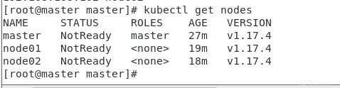

# 云上攻防(一)-K8S集群搭建 - 先知社区

云上攻防(一)-K8S集群搭建

- - -

# K8s集群搭建

## 环境配置

下载Centos 7.0 镜像  
[centos-7-isos-x86\_64安装包下载\_开源镜像站-阿里云 (aliyun.com)](https://mirrors.aliyun.com/centos/7/isos/x86_64/)

[](https://xzfile.aliyuncs.com/media/upload/picture/20231130101640-7fb60d4e-8f26-1.png)

利用VM进行配置

根据以下参考链接进行配置

```plain
https://zhuanlan.zhihu.com/p/363978095
```

配置好后，需要进入虚拟机内配置IP

[](https://xzfile.aliyuncs.com/media/upload/picture/20231130101655-886808c0-8f26-1.png)

[](https://xzfile.aliyuncs.com/media/upload/picture/20231130101706-8f087dd6-8f26-1.png)

配置如下

```plain
master 节点 ： 192.168.108.100
node01 节点 ：192.168.108.101
node02 节点 ：192.168.108.102
```

解析来编辑主机名解析，进入/etc/hosts中进行修改，添加下图红框部分

[](https://xzfile.aliyuncs.com/media/upload/picture/20231130101721-981dae1e-8f26-1.png)

这里直接是无法直接保存的，利用root权限进行配置

```plain
#切换到root去权限，这里密码是自己创建的用户密码
su root 
#利用vim进行编辑
vi /etc/hosts
#进入文本编辑后 输入:i    选择插入模式
修改完成后先按Esc退出后输入:wq      保存并推出
```

[](https://xzfile.aliyuncs.com/media/upload/picture/20231130101824-bd90f7c8-8f26-1.png)

**以下的操作指令三个虚拟机都需要执行**

-   **同步时间**

```plain
systemctl start chronyd
systemctl enable chronyd
date
```

-   禁用**iptables**和**firewalld**服务\*\*

kubernetes和docker在运行中会产生大量的**iptables**规则，为了不让系统规则跟它们混淆，直接关闭系统的规则。三台虚拟机需做同样操作：

1 关闭firewalld服务

```plain
[root@master ~]# systemctl stop firewalld
[root@master ~]# systemctl disable firewalld
```

2 关闭iptables服务,这里进行以下两个指令会报错

```plain
#Failed to stop iptables.service: Unit iptables.service not loaded.
```

<s>\[root@master ~\]# systemctl stop iptables\]</s>

实际上，[centos7](https://so.csdn.net/so/search?q=centos7&spm=1001.2101.3001.7020)后是使用的基于iptable的systemctl stop firewalld

因此改为指令

```plain
systemctl stop firewalld
```

\[root@master ~\]# systemctl disable iptables，该指令回显

```plain
Failed to execute operation: No such file or directory
```

改为

```plain
systemctl disable firewalld.service
```

-   禁用**selinux**

**selinux**是**linux**系统下的一个安全服务，如果不关闭它，在安装集群中会产生各种各样的奇葩问题

```plain
# 永久关闭
[root@master ~]# sed -i 's/enforcing/disabled/' /etc/selinux/config
# 临时关闭
[root@master ~]# setenforce 0
```

-   禁用swap分区

swap分区指的是虚拟内存分区，它的作用是在物理内存使用完之后，将磁盘空间虚拟成内存来使用启用swap设备会对系统的性能产生非常负面的影响，因此kubernetes要求每个节点都要禁用swap设备但是如果因为某些原因确实不能关闭swap分区，就需要在集群安装过程中通过明确的参数进行配置说明

```plain
# 临时关闭
[root@master ~]# swapoff -a
# 永久关闭
[root@master ~]# vim /etc/fstab
```

-   修改**linux**的内核参数

我们需要修改**linux**的内核参数，添加网桥过滤和地址转发功能，编辑`/etc/sysctl.d/kubernetes.conf`文件，添加如下配置:

```plain
net.bridge.bridge-nf-call-ip6tables = 1
net.bridge.bridge-nf-call-iptables = 1
net.ipv4.ip_forward = 1
```

[](https://xzfile.aliyuncs.com/media/upload/picture/20231130101858-d1964bec-8f26-1.png)

添加后进行以下操作：

```plain
# 重新加载配置
[root@master ~]# sysctl -p
# 加载网桥过滤模块
[root@master ~]# modprobe br_netfilter
# 查看网桥过滤模块是否加载成功
[root@master ~]# lsmod | grep br_netfilter
```

同样是在三台服务器都进行操作，成功信息如下：  
[](https://xzfile.aliyuncs.com/media/upload/picture/20231130101936-e86a4ec2-8f26-1.png)

[](https://xzfile.aliyuncs.com/media/upload/picture/20231130101955-f3d02e1c-8f26-1.png)

[](https://xzfile.aliyuncs.com/media/upload/picture/20231130102010-fc84c32e-8f26-1.png)

-   配置 **ipvs** 功能

在**kubernetes**中**service**有两种代理模型，一种是基于**iptables**的，一种是基于**ipvs**的 相比较的话，**ipvs**的性能明显要高一些，但是如果要使用它，需要手动载入**ipvs**模块

```plain
# 安装ipset和ipvsadm
[root@master ~]# yum install ipset ipvsadmin -y

# 添加需要加载的模块写入脚本文件
[root@master ~]# cat <<EOF > /etc/sysconfig/modules/ipvs.modules
#!/bin/bash
modprobe -- ip_vs
modprobe -- ip_vs_rr
modprobe -- ip_vs_wrr
modprobe -- ip_vs_sh
modprobe -- nf_conntrack_ipv4
EOF
# 为脚本文件添加执行权限
[root@master ~]# chmod +x /etc/sysconfig/modules/ipvs.modules
# 执行脚本文件
[root@master ~]# /bin/bash /etc/sysconfig/modules/ipvs.modules
# 查看对应的模块是否加载成功
[root@master ~]# lsmod | grep -e ip_vs -e nf_conntrack_ipv4
```

[](https://xzfile.aliyuncs.com/media/upload/picture/20231130102022-03d8b78e-8f27-1.png)

[](https://xzfile.aliyuncs.com/media/upload/picture/20231130102036-0be9bf9a-8f27-1.png)

[](https://xzfile.aliyuncs.com/media/upload/picture/20231130102043-107ed2e8-8f27-1.png)

-   完成以上配置后重启服务器

```plain
[root@master ~]# reboot
```

## docker安装

第一步：

```plain
# 获取镜像源
[root@master ~]# wget https://mirrors.aliyun.com/docker-ce/linux/centos/docker-ce.repo -O /etc/yum.repos.d/docker-ce.repo
```

第二步：

```plain
# 安装特定版本的docker-ce
# 必须指定--setopt=obsoletes=0，否则yum会自动安装更高版本
[root@master ~]# yum install --setopt=obsoletes=0 docker-ce-18.06.3.ce-3.el7 -y
```

第三步：

```plain
# 添加一个配置文件
# Docker在默认情况下使用的Cgroup Driver为cgroupfs，而kubernetes推荐使用systemd来代替cgroupfs
[root@master ~]# mkdir /etc/docker
```

第四步：

```plain
# 添加阿里云 yum 源, 可从阿里云容器镜像管理中复制镜像加速地址
[root@master ~]# cat <<EOF > /etc/docker/daemon.json
{
"registry-mirrors": ["https://xxxx.mirror.aliyuncs.com"]
}
EOF
```

第五步：

```plain
# 启动docker
[root@master ~]# systemctl enable docker && systemctl start docker
```

[](https://xzfile.aliyuncs.com/media/upload/picture/20231130102058-19430ab6-8f27-1.png)

-   **集群初始化**

由于 **kubernetes** 的镜像源在国外，速度比较慢，因此我们需要切换成国内的镜像源

```plain
# 编辑 /etc/yum.repos.d/kubernetes.repo 添加一下配置
[root@master ~]# vim /etc/yum.repos.d/kubernetes.repo
[kubernetes]
name=Kubernetes
baseurl=http://mirrors.aliyun.com/kubernetes/yum/repos/kubernetes-el7-x86_64
enabled=1
gpgcheck=0
repo_gpgcheck=0
gpgkey=http://mirrors.aliyun.com/kubernetes/yum/doc/yum-key.gpg
http://mirrors.aliyun.com/kubernetes/yum/doc/rpm-package-key.gpg
```

[](https://xzfile.aliyuncs.com/media/upload/picture/20231130102118-251b5f6e-8f27-1.png)

然后安装**kubeadm**、**kubelet**和**kubectl** 三个组件

```plain
yum install --setopt=obsoletes=0 kubeadm-1.17.4-0 kubelet-1.17.4-0
kubectl-1.17.4-0 -y
```

上述会遇到输入，直接输入y回车即可

配置 kubelet 的group

```plain
# 编辑 /etc/sysconfig/kubelet，添加下面的配置
KUBELET_CGROUP_ARGS="--cgroup-driver=systemd"
KUBE_PROXY_MODE="ipvs"
```

[](https://xzfile.aliyuncs.com/media/upload/picture/20231130102136-2f98146e-8f27-1.png)

这步是来初始化集群的，`因此只需在 master 服务器上执行即可`，上面那些是每个服务器都需要执行！

```plain
# 创建集群
# 由于默认拉取镜像地址 k8s.gcr.io 国内无法访问，这里指定阿里云镜像仓库地址
[root@master ~]# kubeadm init \
--apiserver-advertise-address=192.168.108.100 \
--image-repository registry.aliyuncs.com/google_containers \
--kubernetes-version=v1.17.4 \
--pod-network-cidr=10.244.0.0/16 \
--service-cidr=10.96.0.0/12
```

这里遇到报错

[](https://xzfile.aliyuncs.com/media/upload/picture/20231130102217-481d97de-8f27-1.png)

对于报错

```plain
[WARNING IsDockerSystemdCheck]: detected "cgroupfs" as the Docker cgroup driver. The recommended driver is "systemd". Please follow the guide at https://kubernetes.io/docs/setup/cri/
```

解决方法

```plain
cat > /etc/docker/daemon.json <<EOF
{
  "exec-opts": ["native.cgroupdriver=systemd"],
  "log-driver": "json-file",
  "log-opts": {
    "max-size": "100m"
  },
  "storage-driver": "overlay2",
  "storage-opts": [
    "overlay2.override_kernel_check=true"
  ]
}
EOF
```

接下来需要重启docker

```plain
systemctl restart docker
systemctl status docker
```

[](https://xzfile.aliyuncs.com/media/upload/picture/20231130102327-72467170-8f27-1.png)

对于报错

```plain
[WARNING Service-Kubelet]: kubelet service is not enabled, please run 'systemctl enable kubelet.service'
error execution phase preflight: [preflight] Some fatal errors occurred:
```

利用以下代码解决

```plain
# 设置开机启动
systemctl enable kubelet.service
```

对于报错

```plain
[ERROR Swap]: running with swap on is not supported. Please disable swap
```

使用以下方法解决

```plain
# 关掉swapoff
swapoff -a
# 注释最后一行
vi /etc/fstab

#
# /etc/fstab
# Created by anaconda on Thu Nov 14 14:43:07 2019
#
# Accessible filesystems, by reference, are maintained under '/dev/disk'
# See man pages fstab(5), findfs(8), mount(8) and/or blkid(8) for more info
#
/dev/mapper/centos-root /                       xfs     defaults        0 0
UUID=ebdb0874-2f24-4448-b72a-74af285c9988 /boot                   xfs     defaults        0 0
<将改行注释> /dev/mapper/centos-swap swap                    swap    defaults        0 0

#重起
reboot now
```

[](https://xzfile.aliyuncs.com/media/upload/picture/20231130102435-9acf0f80-8f27-1.png)

重启后重新执行命令，这个命令执行的比较久

```plain
[root@master ~]# kubeadm init \
--apiserver-advertise-address=192.168.108.100 \
--image-repository registry.aliyuncs.com/google_containers \
--kubernetes-version=v1.17.4 \
--pod-network-cidr=10.244.0.0/16 \
--service-cidr=10.96.0.0/12
```

[](https://xzfile.aliyuncs.com/media/upload/picture/20231130102501-aa087edc-8f27-1.png)

```plain
#使用 kubectl 工具
[root@master ~]# mkdir -p $HOME/.kube
[root@master ~]# sudo cp -i /etc/kubernetes/admin.conf $HOME/.kube/config
[root@master ~]# sudo chown $(id -u):$(id -g) $HOME/.kube/config
```

然后我们需要将**node** 节点加入集群中，在 `node 服务器` 上执行上述红框的命令：

```plain
kubeadm join 192.168.108.100:6443 --token 4j8uem.r9s4jxcoa6vtdjch \
    --discovery-token-ca-cert-hash sha256:9173f297b0984456cd76cc9635408e97084d4322f48eba4989dc1aab7c730083
```

[](https://xzfile.aliyuncs.com/media/upload/picture/20231130102715-fa27cf62-8f27-1.png)

解决方法是：在节点上先执行如下命令，清理kubeadm的操作，然后再重新执行join 命令：

```plain
kubeadm reset
```

输入后重新输入指令，这个也需要一段时间

```plain
kubeadm join 192.168.108.100:6443 --token 4j8uem.r9s4jxcoa6vtdjch \
    --discovery-token-ca-cert-hash sha256:9173f297b0984456cd76cc9635408e97084d4322f48eba4989dc1aab7c730083
```

但仍然不能成功报错

```plain
error execution phase preflight: couldn't validate the identity of the API Server: abort connecting to API servers after timeout of 5m0s
To see the stack trace of this error execute with --v=5 or higher
```

可能是我们重启后Cookie过期，重新执行命令

```plain
kubeadm init \
--apiserver-advertise-address=192.168.108.100 \
--image-repository registry.aliyuncs.com/google_containers \
--kubernetes-version=v1.17.4 \
--pod-network-cidr=10.244.0.0/16 \
--service-cidr=10.96.0.0/12
```

获得

```plain
kubeadm join 192.168.108.100:6443 --token nsnrqv.2dzsri8f50s2xtln \
    --discovery-token-ca-cert-hash sha256:060d5890ab2213922a3e914132424088683db30f5f0194de674d2f7a0d40efd9
```

执行命令

```plain
kubeadm join 192.168.108.100:6443 --token nsnrqv.2dzsri8f50s2xtln \
    --discovery-token-ca-cert-hash sha256:060d5890ab2213922a3e914132424088683db30f5f0194de674d2f7a0d40efd9
```

还是出现了刚开始的报错，这里我们重新操作一次，我们reset后记得换取新的Cookie

```plain
#kubeadm reset

#kubeadm init \
--apiserver-advertise-address=192.168.108.100 \
--image-repository registry.aliyuncs.com/google_containers \
--kubernetes-version=v1.17.4 \
--pod-network-cidr=10.244.0.0/16 \
--service-cidr=10.96.0.0/12 

#kubeadm join 192.168.108.100:6443 --token k20il1.zwyl50hfmjjqsl2k \
    --discovery-token-ca-cert-hash sha256:5b87f814370aff560298ec0d6e897a32c08a52eecf6fc2107ea7297132abfc52
```

一气呵成还是报错，这里我们重新发现了问题，我们这里是需要将node节点加入master，因此这个命令需要在node服务器上之执行而不是在Master上执行

[](https://xzfile.aliyuncs.com/media/upload/picture/20231130103118-8af2792a-8f28-1.png)

这三个错误请参考上面的内容，已经遇到过，解决后继续执行命令

[](https://xzfile.aliyuncs.com/media/upload/picture/20231130103208-a8d42d3a-8f28-1.png)

执行完成后执行

```plain
kubectl get nodes
```

[](https://xzfile.aliyuncs.com/media/upload/picture/20231130103237-b9cb623e-8f28-1.png)

我重启一次master之后，如果还遇到是这个报错检查下自己的

```plain
cat /etc/kubernetes/kubelet.conf
```

[](https://xzfile.aliyuncs.com/media/upload/picture/20231130103323-d52a31a4-8f28-1.png)

```plain
cat /etc/hosts
```

[](https://xzfile.aliyuncs.com/media/upload/picture/20231130103353-e71e12cc-8f28-1.png)

上述两个是否相同，修改为一致即可，如果一直还报错，请耐心等待一会

[](https://xzfile.aliyuncs.com/media/upload/picture/20231130103416-f5244c1a-8f28-1.png)

如果等了几分钟还不行的话

```plain
删除这个路径下的文件
#rm -rf $HOME/.kube

重新执行命令
mkdir -p $HOME/.kube
sudo cp -i /etc/kubernetes/admin.conf $HOME/.kube/config
sudo chown $(id -u):$(id -g) $HOME/.kube/config
```

再次获取nodes即可

但是我们这个时候查看集群状态都是为`NotReady`，这是因为还没有配置网络插件

**kubernetes**支持多种网络插件，比如**flannel**、**calico**、**canal**等等，这里选择使用**flanne**

下载 **flanneld-v0.13.0-amd64.docker** ：

```plain
https://github.com/flannel-io/flannel/releases?page=4
```

[](https://xzfile.aliyuncs.com/media/upload/picture/20231130103449-08c52f3c-8f29-1.png)

下载完成后，上传至 **master 服务器** 执行以下命令，拖动进去如果遇到下面报错直接点最右边的

[](https://xzfile.aliyuncs.com/media/upload/picture/20231130103511-157c8c98-8f29-1.png)

```plain
docker load < flanneld-v0.13.0-amd64.docker
```

执行完成后便可看到多了个 **flannel** 镜像：

[](https://xzfile.aliyuncs.com/media/upload/picture/20231130103547-2b4bf720-8f29-1.png)

然后我们需要获取**flannel**的配置文件来部署 **flannel** 服务

```plain
[root@master ~]# wget https://raw.githubusercontent.com/coreos/flannel/master/Documentation/kube-flannel.yml

# 使用配置文件启动fannel
[root@master ~]# kubectl apply -f kube-flannel.yml

# 再次查看集群节点的状态
[root@master ~]# kubectl get nodes
```

[](https://xzfile.aliyuncs.com/media/upload/picture/20231130103606-368736c2-8f29-1.png)

节点状态没有更新，这里需要等几分钟 k8s 会自动重试就会改变状态

[](https://xzfile.aliyuncs.com/media/upload/picture/20231130103628-43d12f90-8f29-1.png)

这个时候所有节点的状态都是`Ready` 的状态，到此为止，我们的 **k8s** 集群就算搭建完成了！

**5）集群功能验证**

接下来就是我们的验证时间，之前我们学 **docker** 的时候往往会启动一个 **nginx** 容器来测试是否可用，**k8s** 我们也同样来部署一个 **nginx** 来测试下服务是否可用

-   首先我们创建一个 deployment

```plain
# kubectl create deployment nginx --image=nginx:1.14-alpine
deployment.apps/nginx created

# kubectl get deploy
NAME    READY   UP-TO-DATE   AVAILABLE   AGE
nginx   1/1     1            1           31s
```

-   然后创建一个 service 来让外界能够访问到我们 nginx 服务

```plain
# kubectl expose deploy nginx --port=80 --target-port=80 --type=NodePort
service/nginx exposed

# kubectl get svc 
NAME         TYPE        CLUSTER-IP       EXTERNAL-IP   PORT(S)        AGE
kubernetes   ClusterIP   10.96.0.1      <none>        443/TCP        3d21h
nginx        NodePort    10.108.3.153   <none>        80:30426/TCP   3d20h
```

然后我们通过 node 节点的 IP 加上service 暴露出来的 nodePort 来访问我们的 nginx 服务：

[](https://xzfile.aliyuncs.com/media/upload/picture/20231130103649-5001cca2-8f29-1.png)

### 指令学习

这里需要注意我们需要切换到root权限

```plain
#查看所有pod
kubectl get pod

#查看所有node
kubectl get node

#查看nginx-6867cdf567-dw6gw 这个pod
kubectl get pod nginx-6867cdf567-dw6gw

#查看王子pod以json/yaml形式展示数据
kubectl get pod nginx-6867cdf567-dw6gw -o json
#输出结果
{
    "apiVersion": "v1",
    "kind": "Pod",
    "metadata": {
        "creationTimestamp": "2023-11-16T11:01:29Z",
        "generateName": "nginx-6867cdf567-",
        "labels": {
            "app": "nginx",
            "pod-template-hash": "6867cdf567"
        },
        "name": "nginx-6867cdf567-dw6gw",
        "namespace": "default",
        "ownerReferences": [
            {
                "apiVersion": "apps/v1",
                "blockOwnerDeletion": true,
                "controller": true,
                "kind": "ReplicaSet",
                "name": "nginx-6867cdf567",
                "uid": "62d29f47-d1ff-471b-9818-67bd469fa730"
            }
        ],
        "resourceVersion": "10818",
        "selfLink": "/api/v1/namespaces/default/pods/nginx-6867cdf567-dw6gw",
        "uid": "3b5e6270-718e-4303-bd4f-8f893f21684e"
    },
    "spec": {
        "containers": [
            {
                "image": "nginx:1.14-alpine",
                "imagePullPolicy": "IfNotPresent",
                "name": "nginx",
                "resources": {},
                "terminationMessagePath": "/dev/termination-log",
                "terminationMessagePolicy": "File",
                "volumeMounts": [
                    {
                        "mountPath": "/var/run/secrets/kubernetes.io/serviceaccount",
                        "name": "default-token-dhqqb",
                        "readOnly": true
                    }
                ]
            }
        ],
        "dnsPolicy": "ClusterFirst",
        "enableServiceLinks": true,
        "nodeName": "node01",
        "priority": 0,
        "restartPolicy": "Always",
        "schedulerName": "default-scheduler",
        "securityContext": {},
        "serviceAccount": "default",
        "serviceAccountName": "default",
        "terminationGracePeriodSeconds": 30,
        "tolerations": [
            {
                "effect": "NoExecute",
                "key": "node.kubernetes.io/not-ready",
                "operator": "Exists",
                "tolerationSeconds": 300
            },
            {
                "effect": "NoExecute",
                "key": "node.kubernetes.io/unreachable",
                "operator": "Exists",
                "tolerationSeconds": 300
            }
        ],
        "volumes": [
            {
                "name": "default-token-dhqqb",
                "secret": {
                    "defaultMode": 420,
                    "secretName": "default-token-dhqqb"
                }
            }
        ]
    },
    "status": {
        "conditions": [
            {
                "lastProbeTime": null,
                "lastTransitionTime": "2023-11-16T11:01:28Z",
                "status": "True",
                "type": "Initialized"
            },
            {
                "lastProbeTime": null,
                "lastTransitionTime": "2023-11-16T11:01:45Z",
                "status": "True",
                "type": "Ready"
            },
            {
                "lastProbeTime": null,
                "lastTransitionTime": "2023-11-16T11:01:45Z",
                "status": "True",
                "type": "ContainersReady"
            },
            {
                "lastProbeTime": null,
                "lastTransitionTime": "2023-11-16T11:01:29Z",
                "status": "True",
                "type": "PodScheduled"
            }
        ],
        "containerStatuses": [
            {
                "containerID": "docker://2ec3ede4a5f231228c51a56d7c76af5d6246bf6db840b4a6a5286ebf68f44a96",
                "image": "nginx:1.14-alpine",
                "imageID": "docker-pullable://nginx@sha256:485b610fefec7ff6c463ced9623314a04ed67e3945b9c08d7e53a47f6d108dc7",
                "lastState": {},
                "name": "nginx",
                "ready": true,
                "restartCount": 0,
                "started": true,
                "state": {
                    "running": {
                        "startedAt": "2023-11-16T11:01:44Z"
                    }
                }
            }
        ],
        "hostIP": "192.168.108.101",
        "phase": "Running",
        "podIP": "10.244.1.2",
        "podIPs": [
            {
                "ip": "10.244.1.2"
            }
        ],
        "qosClass": "BestEffort",
        "startTime": "2023-11-16T11:01:28Z"
    }
}


kubectl get pod nginx-6867cdf567-dw6gw -o yaml

#查看pod的详细信息
kubectl get pod nginx-6867cdf567-dw6gw -o wide

#描述资源信息（如果当前pod未启动成功，pullimageerror等就可以使用，查看报错信息）
kubectl describe pod nginx-6867cdf567-dw6gw
```

进入pod

```plain
#kubectl get pods   #查看所有正在运行的pod

#kubectl exec -it nginx-6867cdf567-dw6gw -- /bin/sh
```

[](https://xzfile.aliyuncs.com/media/upload/picture/20231130103752-758ad248-8f29-1.png)

距离上次搭建完后，下次使用前重启了master主机，发现nginx无法访问，删除后创建仍无法访问

删除deployment，后尝试重新创建

```plain
删除deloyment
kubectl delete deployment ngnix
删除svc
kubectl delete svc nginx
然后按照前面的方法重新创建
```

尝试重启K8s

```plain
kubeadm reset
```

# 维护

### 遇到svc无法访问

这里目前还没有深入学习原理，但我我们创建的svc被分配到了其他的node所有我们利用master和node01都访问不到，通过查看pods的详细找到其配置，看到hostIP

```plain
kubectl get pod nginx-6867cdf567-9sv8d -o json
```

[](https://xzfile.aliyuncs.com/media/upload/picture/20231130103804-7ca95f2c-8f29-1.png)

### 参考

```plain
https://blog.csdn.net/qq_21127151/article/details/109269478

https://blog.csdn.net/believe_ordinary/article/details/119046138

https://blog.csdn.net/m82_a1/article/details/97626309

https://blog.csdn.net/u012999810/article/details/79560386

https://blog.csdn.net/YouMing_Li/article/details/117553658

https://blog.csdn.net/qq_42606136/article/details/115732136
```

\`\`\`
