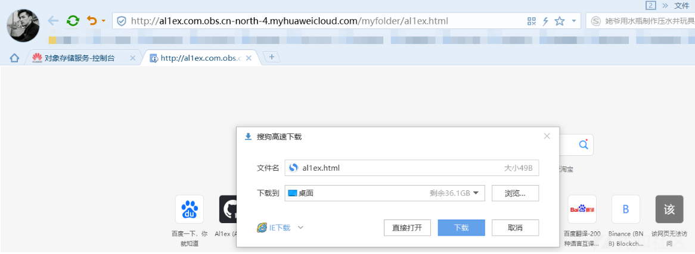
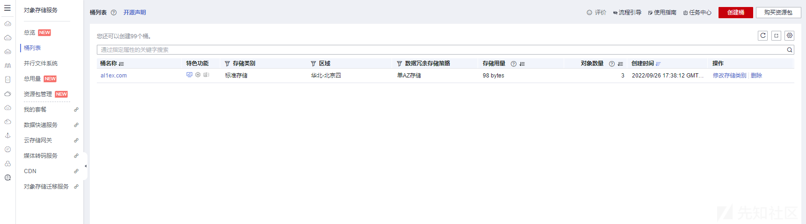
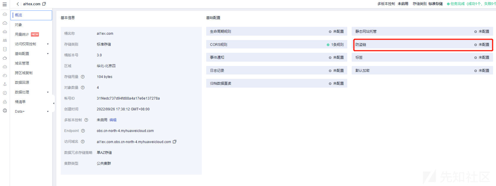
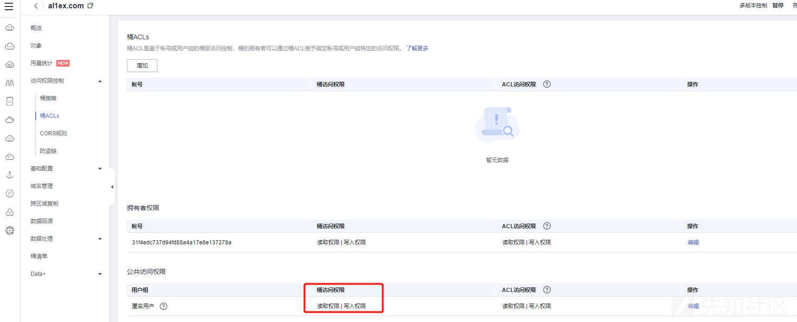

# 云上攻防之对象存储服务漏洞挖掘探索 - 先知社区

云上攻防之对象存储服务漏洞挖掘探索

- - -

## 文章前言

公司自研的新产品使用了SaaS模式，其中文件存储使用了华为云提供的对象存储服务(Object Storage Service，OBS),在初次进行云上安全巡检时就发现了对象遍历问题，而随着时间的推移逐渐又发现了关于OBS策略的一系列安全问题并进行了研究分析，本篇文章将基于此背景对华为云的OBS安全问题进行简易介绍，让你遇到OBS桶时不再仅仅局限于列对象的测试，而是扩展到基于策略、配置、策略冲突等多方面的评估，需要注意的时不同的云服务商提供的对象存储服务各有千秋

## 权限控制

华为云的OBS提供多种权限控制方式，包括IAM权限、桶策略、对象ACL、桶ACL，各个方式说明及应用场景如下表所示：  
[](https://xzfile.aliyuncs.com/media/upload/picture/20231128152320-0208842a-8dbf-1.png)  
其中OBS权限控制方式说明和应用场景如下所示：

| 方式  | 说明  | 应用场景 |
| --- | --- | --- |
| IAM权限 | IAM权限是作用于云资源的，IAM权限定义了允许和拒绝的访问操作，以此实现云资源权限访问控制。管理员创建IAM用户后，需要将用户加入到一个用户组中，IAM可以对这个组授予OBS所需的权限，组内用户自动继承用户组的所有权限 | 使用策略控制帐号下整个云资源的权限。使用策略控制帐号下OBS所有的桶和对象的权限。使用策略控制帐号下OBS指定资源的权限 |
| 桶策略 | 桶策略是作用于所配置的OBS桶及桶内对象的。桶拥有者通过桶策略可为IAM用户或其他帐号授权桶及桶内对象精确的操作权限，是对桶ACL和对象ACL的补充（更多场景下是替代) | 允许其他华为云帐号访问OBS资源，可以使用桶策略的方式授权对应权限以及当不同的桶对于不同的IAM用户有不同的访问控制需求时，需使用桶策略分别授权IAM用户不同的权限 |
| 对象ACL | 基于帐号或用户组的对象级访问控制，对象的拥有者可以通过对象ACL向指定帐号或用户组授予对象基本的读、写权限 | 需要对象级的访问权限控制时，桶策略可以授予对象或对象集访问权限，当授予一个对象集权限后，想对对象集中某一个对象再进行单独授权，通过配置桶策略的方法显然不太实际。此时建议使用对象ACL，使得单个对象的权限控制更加方便. |
| 桶ACL | 基于帐号或用户组的桶级访问控制，桶的拥有者可以通过桶ACL向指定帐号或用户组授予桶基本的读、写权限 | 授予指定帐号桶读取权限和桶写入权限，用以共享桶数据或挂载外部桶。比如，帐号A授予帐号B桶读取权限及桶写入权限后，帐号B就可以通过OBS Browser+挂载外部桶、API&SDK等方式访问到该桶 |

## 控制方式

### ACL方式

访问控制列表(Access Control List，ACL)是一个指定被授权者和所授予权限的授权列表，OBS桶和对象的ACL是基于帐号的访问控制，默认情况下创建桶和对象时会同步创建ACL，授权拥有者对桶和对象资源的完全控制权限，OBS的ACL为了实现用户简单实用地授权，包含以下特点：

-   ACL对租户和租户下的用户都生效
-   桶和对象的拥有者相同时，设置桶上的ACL默认对桶及桶中对象都生效
-   桶创建时可以携带ACL，也可以创建成功后设置ACL，对象上传时可以携带ACL，也可以上传成功后再单独设置

OBS ACL是基于帐号级别的读写权限控制，权限控制细粒度不如桶策略和IAM权限，一般情况下建议使用IAM权限和桶策略进行访问控制，OBS支持通过ACL对下表所示用户或用户组授予桶的访问权限：

| 被授权用户 | 描述  |
| --- | --- |
| 特定用户 | ACL支持通过帐号授予桶/对象的访问权限。授予帐号权限后，帐号下所有具有OBS资源权限的IAM用户都可以拥有此桶/对象的访问权限，当需要为不同IAM用户授予不同的权限时，可以通过桶策略配置 |
| 拥有者 | 桶的拥有者是指创建桶的帐号，桶拥有者默认拥有所有的桶访问权限，其中桶ACL的读取和写入这两种权限永远拥有，且不支持修改，对象的拥有者是上传对象的帐号，而不是对象所属的桶的拥有者。对象拥有者默认永远拥有对象读取权限、ACL的读取和写入权限，且不支持修改 |
| 匿名用户 | 未注册华为云的普通访客。如果匿名用户被授予了访问桶/对象的权限，则表示所有人都可以访问对应的桶/对象，并且不需要经过任何身份认证 |

### 桶策略方式

#### 桶策略

桶策略是作用于所配置的OBS桶及桶内对象的，OBS桶拥有者通过桶策略可为IAM用户或其他帐号授权桶及桶内对象的操作权限，OBS控制台预置了六种常用典型场景的桶策略模板，用户可以使用模板创建桶策略快速完成桶策略配置，选择使用模板创建时，部分模板需要指定被授权用户或资源范围，您也可以在原模板基础上修改被授权用户、资源范围、模板动作以及增加桶策略执行的条件

| 模板名称 | 被授权用户 | 资源范围 | 模板动作 |
| --- | --- | --- | --- |
| 桶只读 | 待指定 | 包含当前桶和桶内所有对象 | 允许指定用户对当前桶和桶内所有对象执行以下动作：Get*（所有获取操作） List*（所有列举操作）HeadBucket（判断桶是否存在） |
| 桶读写 | 待指定 | 包含当前桶和桶内所有对象 | 允许指定用户对当前桶和桶内所有对象执行除以下动作以外的所有动作：DeleteBucket（删除桶）PutBucketPolicy（设置桶策略）PutBucketAcl（设置桶ACL） |
| 目录只读 | 待指定 | 待指定（需指定对象前缀） | 允许指定用户对当前桶和桶内指定资源执行以下动作：ListBucket（列举桶内对象、获取桶元数据）HeadBucket（判断桶是否存在）GetBucketLocation（获取桶位置）ListBucketVersions（列举桶内多版本对象）GetObject（获取对象内容、获取对象元数据）RestoreObject（恢复归档存储对象）GetObjectAcl（获取对象ACL）GetObjectVersion（获取指定版本对象内容、获取指定版本对象元数据）GetObjectVersionAcl（获取指定版本对象ACL） |
| 目录读写 | 待指定 | 待指定（需指定对象前缀） | 允许指定用户对当前桶和桶内指定资源执行以下动作：ListBucket（列举桶内对象、获取桶元数据）HeadBucket（判断桶是否存在）GetBucketLocation（获取桶位置）ListBucketVersions（列举桶内多版本对象）GetObject（获取对象内容、获取对象元数据）RestoreObject（恢复归档存储对象）GetObjectAcl（获取对象ACL）GetObjectVersion（获取指定版本对象内容、获取指定版本对象元数据）GetObjectVersionAcl（获取指定版本对象ACL）AbortMultipartUpload（取消多段上传任务）ListMultipartUploadParts（列举已上传段）ModifyObjectMetaData（修改对象元数据） |
| 公共读 | **匿名用户** | 包含当前桶和桶内所有对象 | 允许匿名用户（所有互联网用户）对当前桶和桶内所有对象执行以下动作：ListBucket（列举桶内对象、获取桶元数据）HeadBucket（判断桶是否存在）GetBucketLocation（获取桶位置）ListBucketVersions（列举桶内多版本对象）GetObject（获取对象内容、获取对象元数据）RestoreObject（恢复归档存储对象）GetObjectVersion（获取指定版本对象内容、获取指定版本对象元数据） |
| 公共读写 | 匿名用户 | 包含当前桶和桶内所有对象 | 允许匿名用户（所有互联网用户）对当前桶和桶内所有对象执行以下动作：ListBucket（列举桶内对象、获取桶元数据）HeadBucket（判断桶是否存在）GetBucketLocation（获取桶位置）ListBucketVersions（列举桶内多版本对象）ListBucketMultipartUploads（列举多段上传任务）GetObject（获取对象内容、获取对象元数据）PutObject（PUT上传，POST上传，上传段，初始化上传段任务，合并段）RestoreObject（恢复归档存储对象）GetObjectAcl（获取对象ACL）PutObjectAcl（设置对象ACL）GetObjectVersion（获取指定版本对象内容、获取指定版本对象元数据）GetObjectVersionAcl（获取指定版本对象ACL）AbortMultipartUpload（取消多段上传任务）ListMultipartUploadParts（列举已上传段）ModifyObjectMetaData（修改对象元数据) |

备注：注意上面加黑的部分哦~

#### 对象策略

对象策略即为桶策略中针对对象的策略，桶策略中针对对象的策略是通过配置资源来实现对象匹配的，资源可配置"\*"(表示所有对象)或对象前缀(表示对象集)，对象策略则是直接选定对象后配置到选定的对象资源的策略

OBS控制台预置了四种常用典型场景的对象策略模板，用户可以使用模板创建对象策略，快速完成对象策略配置，选择使用模板创建时，部分模板需要指定被授权用户，您也可以在原模板基础上修改被授权用户、模板动作以及增加对象策略执行的条件，资源范围即为所需配置对象策略的对象，系统自动指定，无需修改

| 模板名称 | 被授权用户 | 资源范围 | 模板动作 |
| --- | --- | --- | --- |
| 只读模式 | 待指定 | 系统自动指定为已选对象，无需修改 | 允许指定用户对当前对象执行以下动作：GetObject（获取对象内容、获取对象元数据）GetObjectVersion（获取指定版本对象内容、获取指定版本对象元数据）GetObjectVersionAcl（获取指定版本对象ACL）GetObjectAcl（获取对象ACL）RestoreObject（恢复归档存储对象） |
| 读写模式 | 待指定 | 系统自动指定为已选对象，无需修改 | 允许指定用户对当前对象执行以下动作：PutObject（PUT上传，POST上传，上传段，初始化上传段任务，合并段GetObject（获取对象内容、获取对象元数据）GetObjectVersion（获取指定版本对象内容、获取指定版本对象元数据）ModifyObjectMetaData（修改对象元数据）ListMultipartUploadParts（列举已上传段）AbortMultipartUpload（取消多段上传任务）GetObjectVersionAcl（获取指定版本对象ACL）GetObjectAcl（获取对象ACL）PutObjectAcl（设置对象ACL）RestoreObject（恢复归档存储对象） |
| 公共读 | 匿名用户 | 系统自动指定为已选对象，无需修改 | 允许匿名用户（所有互联网用户）对当前对象执行以下动作：GetObject（获取对象内容、获取对象元数据）RestoreObject（恢复归档存储对象）GetObjectVersion（获取指定版本对象内容、获取指定版本对象元数据） |
| 公共读写 | 匿名用户 | 系统自动指定为已选对象，无需修改 | 允许匿名用户（所有互联网用户）对当前对象执行以下动作：PutObject（PUT上传，POST上传，上传段，初始化上传段任务，合并段）GetObject（获取对象内容、获取对象元数据）ModifyObjectMetaData（修改对象元数据）ListMultipartUploadParts（列举已上传段）AbortMultipartUpload（取消多段上传任务）RestoreObject（恢复归档存储对象）GetObjectVersion（获取指定版本对象内容、获取指定版本对象元数据）PutObjectAcl（设置对象ACL）GetObjectVersionAcl（获取指定版本对象ACL）GetObjectAcl（获取对象ACL） |

以下示例策略向帐号b4bf1b36d9ca43d984fbcb9491b6fce9(帐号ID)下的用户ID为71f3901173514e6988115ea2c26d1999的IAM用户授予PutObject和PutObjectAcl权限

```plain
{
    "Statement":[
    {
      "Sid":"AddCannedAcl",
      "Effect":"Allow",
      "Principal": {"ID": ["domain/b4bf1b36d9ca43d984fbcb9491b6fce9:user/71f3901173514e6988115ea2c26d1999"]},
      "Action":["PutObject","PutObjectAcl"],
      "Resource":["examplebucket/*"]
    }
  ]
}
```

### IAM权限方式

默认情况下管理员创建的IAM用户没有任何权限，需要将其加入用户组并给用户组授予策略和角色才能使得用户组中的用户获得策略定义的权限，这一过程称为"授权"，授权后用户就可以基于被授予的权限对云服务进行操作

对于OBS而言，IAM权限作用于OBS所有的桶和对象，如果要授予IAM用户操作OBS资源的权限则需要向IAM用户所属的用户组授予一个或多个OBS权限，OBS部署时不区分物理区域，为全局级服务，授权时，在全局级服务中设置权限，访问OBS时，不需要切换区域，IAM为各云服务预置了系统权限，方便您快速完成基础权限配置，下表为OBS的所有系统权限：

| 系统角色/策略名称 | 描述  | 类别  | 依赖关系 |
| --- | --- | --- | --- |
| Tenant Administrator | 拥有该权限的用户拥有除IAM外，其他所有服务的所有执行权限 | 系统角色 | 无   |
| Tenant Guest | 拥有该权限的用户拥有除IAM外，其他所有服务的只读权限 | 系统角色 | 无   |
| OBS Administrator | 拥有该权限的用户为OBS管理员，可以对帐号下的所有OBS资源执行任意操作 | 系统策略 | 无   |
| OBS Buckets Viewer | 拥有该权限的用户可以执行列举桶、获取桶基本信息、获取桶元数据的操作 |     |     |
| OBS ReadOnlyAccess | 拥有该权限的用户可以执行列举桶、获取桶基本信息、获取桶元数据、列举对象(不包含多版本)的操作 | 系统角色 | 无   |
| OBS OperateAccess | 拥有该权限的用户可以执行OBS ReadOnlyAccess的所有操作，在此基础上还可以执行上传对象、下载对象、删除对象、获取对象ACL等对象基本操作 | 系统策略 | 无   |

## 控制冲突

OBS权限控制要素中Effect(效果)包含两种：Allow(允许)和Deny(拒绝)分别表示允许或拒绝执行某操作的权限，基于最小权限原则，权限控制策略的结果默认为Deny， 显式的Deny始终优先于Allow，例如:IAM权限授权了用户访问对象的权限，但是桶策略拒绝了该用户访问对象的权限且没有ACL时，该用户不能访问对象，没有策略授予Allow权限时默认情况即为Deny权限，当有策略授权Allow权限，且没有其他策略Deny该权限时，Allow的权限才能生效，例如：某个桶已经存在多条Allow权限的桶策略，再新增Allow权限的桶策略会在原权限的基础上进行叠加，增大用户的权限，如果新增Deny权限的桶策略，则会根据Deny优先原则调整用户的权限，即使Deny策略中定义的动作在其他桶策略中Allow  
[](https://xzfile.aliyuncs.com/media/upload/picture/20231128155006-bee36db4-8dc2-1.png)  
桶策略、IAM权限和ACL的Allow和Deny作用结果如图所示(**非常重要，非常重要，非常重要！！！**)  
[](https://xzfile.aliyuncs.com/media/upload/picture/20231128155100-df65de3c-8dc2-1.png)

## 安全评估

### Bucket暴力猜解

#### 访问规则

##### 公网访问

通过公网访问OBS产生的流入流量(数据上传到OBS等写操作)是免费的，流出流量(下载OBS数据等读操作)是收费的，通过公网访问OBS可以直接通过URL的形式来表示OBS中的资源，OBS的URL构成如下

```plain
Protocol://[BukcetName.]Endpoint[:Port][/Object][?Param]
```

| 参数  | 描述  | 是否必选 |
| --- | --- | --- |
| Protocol | 请求使用的协议类型，如HTTP、HTTPS，HTTPS表示通过安全的HTTPS访问该资源，对象存储服务支持HTTP，HTTPS两种传输协议 | 必选  |
| BucketName | 请求使用的桶名称，在整个OBS中唯一标识一个桶 | 可选  |
| Endpoint | OBS中桶所在区域的区域域名(终端节点) | 必选  |
| Port | 请求使用的端口号，根据软件服务器的部署不同而不同，缺省时使用默认端口，各种传输协议都有默认的端口号，如HTTP的默认端口为80，HTTPS的默认端口为443，OBS对象存储服务的HTTP方式访问端口为80，HTTPS方式访问端口为443 | 可选  |
| Object | 请求使用的对象资源路径，即对象上传到OBS后的访问路径 | 可选  |
| Param | 请求使用的桶和对象的具体资源，缺省默认为请求桶或对象自身资源 | 可选  |

示例：您在华北-北京四(cn-north-4)区域有一个名为al1ex.com的桶，桶中有一个对象myfolder/al1ex.txt  
[](https://xzfile.aliyuncs.com/media/upload/picture/20231128155615-9aded4fc-8dc3-1.png)  
通过公网访问这个对象的URL地址为

```plain
http://al1ex.com.obs.cn-north-4.myhuaweicloud.com/myfolder/al1ex.html
```

[](https://xzfile.aliyuncs.com/media/upload/picture/20231128155641-aaa815f6-8dc3-1.png)

##### 内网访问

通过内网访问OBS主要指通过华为云服务之间的内部通信网络访问OBS，通过内网访问OBS产生的流入流量(数据上传到OBS等写操作)和流出流量(下载OBS数据等读操作)都是免费的，例如：在弹性云服务器(Elastic Cloud Server，ECS)上通过内网访问OBS可以避免公网网络质量带来的不利影响，达到优化性能、节省开支的目的

应用场景：某企业基于弹性云服务器(Elastic Cloud Server，ECS)构建好基础的业务后，随着数据增长硬盘已无法满足大量的图片、视频等数据存取需求，了解到华为云提供有海量、弹性的云存储服务OBS后，决定将OBS作为数据存储资源池，以减轻服务器负担，在ECS上可以通过公网和华为云内网两种网络访问OBS，当有存取对象数据的需求时，公网方式响应速度会因为网络质量而受到影响，读取数据还将收取一定的流量费用，为最大化的优化性能、节省开支，企业管理者希望通过内网的方式访问OBS

方案架构：在已搭建的ECS上通过配置内网DNS，由内网DNS解析OBS域名，即可实现在ECS上经由内网访问OBS，访问过程示意图如图所示  
[](https://xzfile.aliyuncs.com/media/upload/picture/20231128155707-b9ffb522-8dc3-1.png)

#### 差异对比

当bucket不存在时会返回"NoSuchBucket"  
[](https://xzfile.aliyuncs.com/media/upload/picture/20231128155736-cb29566e-8dc3-1.png)

当bucket存在且允许列对象时返回对象列表信息  
[](https://xzfile.aliyuncs.com/media/upload/picture/20231128155749-d31f6bec-8dc3-1.png)

当bucket存在且不允许列对象时返回AccessDenied  
[](https://xzfile.aliyuncs.com/media/upload/picture/20231128155759-d92b154a-8dc3-1.png)

#### 暴力猜解

根据以上的差异性对比我们可以对Bucket进行暴力枚举来查找存在的存储桶，至于bucket是否存在可以根据两个点来判断：

-   bucket存在且允许列对象时返回对象列表信息
-   bucket存在且不允许列对象时返回AccessDenied

### Bucket特定策略

#### 防盗链类

OBS提供同时支持允许白名单访问和阻止黑名单访问的配置来防止盗链，基本配置步骤如下：  
Step 1：在OBS管理控制台左侧导航栏选择"桶列表"  
[](https://xzfile.aliyuncs.com/media/upload/picture/20231128160004-23a6173c-8dc4-1.png)  
Step 2：在桶列表单击待操作的桶，进入"概览"页面  
[](https://xzfile.aliyuncs.com/media/upload/picture/20231128160023-2ee3093e-8dc4-1.png)  
Step 3：在页面右侧"基础配置"区域下，单击"防盗链"卡片，系统跳转至"防盗链"界面  
[](https://xzfile.aliyuncs.com/media/upload/picture/20231128160040-38bc0dc0-8dc4-1.png)  
Step 5：单击"白名单Referer"/"黑名单Referer"后的，输入白名单/黑名单，Referer规则如下：  
白名单Referer/黑名单Referer输入的字节数不能超过1024个字符

-   Referer格式：
-   Referer可以设置多个，多个Referer换行隔开
-   Referer参数支持通配符(\*)和问号(?)，通配符可代替0个或多个字符，问号可代替单个字符
-   如果下载时Referer头域包含了http或https，则Referer设置必须包含http或https
-   白名单Referer为空，黑名单Referer不空时，允许所有黑名单中指定网站以外的其他网站的请求访问目标桶中的数据
-   白名单Referer不为空，黑名单Referer为空或不空时，只允许白名单中指定网站的请求访问目标桶中的数据
-   黑名单Referer与白名单Referer都为空时，默认允许所有网站的请求访问目标桶中的数据
-   判断用户是否有对桶及其内容访问的四种权限(读取权限、写入权限、ACL读取权限、ACL写入权限)之前，需要首先检查是否符合referer字段的防盗链规则

简易实例：  
[](https://xzfile.aliyuncs.com/media/upload/picture/20231128160147-60ac9cdc-8dc4-1.png)

#### 简易示例

Step 1：获取一个分享地址  
[](https://xzfile.aliyuncs.com/media/upload/picture/20231128160229-79f30f6e-8dc4-1.png)  
Step 2：之后在浏览器中访问并使用Burpsuite抓包，可以看到"AccessDenied"，这说明我们的策略优先于四种权限(读取权限、写入权限、ACL读取权限、ACL写入权限)之前做了检查  
[](https://xzfile.aliyuncs.com/media/upload/picture/20231128160245-83b5b02e-8dc4-1.png)  
Step 3：增加Referer

[](https://xzfile.aliyuncs.com/media/upload/picture/20231128160303-8e3c003e-8dc4-1.png)

#### 测试技巧

有时候访问显示"AccessDenied"时我们可以对头部信息进行一些简单的Fuzzing测试，说不上会有惊喜~

### 对象遍历

对象遍历的话这里就不再多说了，主要是配置了ListBucket，导致可以列举桶内对象，获取桶元数据，如果用户在正确配置存储桶后再次修改存储桶桶策略并加入ListBucket，那么将可以列举桶内对象获取元数据  
常见的此类**错误**配置如下：  
[](https://xzfile.aliyuncs.com/media/upload/picture/20231128160506-d7a7a304-8dc4-1.png)  
在平时的测试中可以直接访问域名列对象

[](https://xzfile.aliyuncs.com/media/upload/picture/20231128160536-e95e352c-8dc4-1.png)

### Bucket策略冲突

这个是之前巡检的时候发现的一个问题，源于真实的环境，当时记得是ListObject是关闭的，但是很奇怪的出现了列对象的问题，所以进行了一个研究分析

#### 场景再现-列对象

**情形1：桶策略ListBuck，桶ACLs禁止匿名用户桶访问权限**  
桶策略如下  
[](https://xzfile.aliyuncs.com/media/upload/picture/20231128160747-3770b28a-8dc5-1.png)  
桶ACLs如下：  
[](https://xzfile.aliyuncs.com/media/upload/picture/20231128160803-41230df0-8dc5-1.png)  
测试结果——可以列举对象  
[](https://xzfile.aliyuncs.com/media/upload/picture/20231128160820-4b4423a0-8dc5-1.png)

**情形2：桶策略ListBuck，桶ACLs允许匿名用户桶访问权限**  
桶策略如下  
[](https://xzfile.aliyuncs.com/media/upload/picture/20231128160908-67b7e6b6-8dc5-1.png)  
桶ACLs允许匿名用户桶的访问权限：  
[](https://xzfile.aliyuncs.com/media/upload/picture/20231128161103-ac5e6830-8dc5-1.png)  
测试结果——可以列举对象  
[](https://xzfile.aliyuncs.com/media/upload/picture/20231128161120-b64c11e4-8dc5-1.png)

**情形3：桶策略无ListBuck，桶ACLs允许匿名用户桶访问权限**  
桶策略如下：  
[](https://xzfile.aliyuncs.com/media/upload/picture/20231128161142-c35fd9d8-8dc5-1.png)  
桶ACLs如下：  
[](https://xzfile.aliyuncs.com/media/upload/picture/20231128161202-cf4f2730-8dc5-1.png)

测试结果——可以列举对象  
[](https://xzfile.aliyuncs.com/media/upload/picture/20231128161224-dc7688d6-8dc5-1.png)

**情形4：桶策略无ListBuck，桶ACLs禁止匿名用户桶访问**  
桶策略如下：

[](https://xzfile.aliyuncs.com/media/upload/picture/20231128161241-e6bde88e-8dc5-1.png)

桶ACLs如下：  
[](https://xzfile.aliyuncs.com/media/upload/picture/20231128161345-0d036168-8dc6-1.png)

测试结果——不可以列举对象  
[](https://xzfile.aliyuncs.com/media/upload/picture/20231128161401-16b0df9c-8dc6-1.png)

#### 场景再现-匿名访问

**情形1：桶策略包含匿名用户，桶ACLs禁止匿名用户桶访问**

桶策略配置如下：  
[](https://xzfile.aliyuncs.com/media/upload/picture/20231128161441-2e06d7c8-8dc6-1.png)

桶ACLs禁止访问：

[](https://xzfile.aliyuncs.com/media/upload/picture/20231128161556-5adee8e4-8dc6-1.png)

访问桶中对象可以直接下载  
[](https://xzfile.aliyuncs.com/media/upload/picture/20231128161529-4b259a38-8dc6-1.png)

**情形2：桶策略不包含匿名用户，桶ACLs禁止匿名用户桶访问**  
桶策略配置如下：  
[](https://xzfile.aliyuncs.com/media/upload/picture/20231128161640-7544a2a0-8dc6-1.png)

桶ACLs禁止访问：

[](https://xzfile.aliyuncs.com/media/upload/picture/20231128161656-7f0d77f8-8dc6-1.png)  
直接访问提示"Access Denied"  
[](https://xzfile.aliyuncs.com/media/upload/picture/20231128161713-890c4086-8dc6-1.png)

#### 策略冲突

通过上面的测试可以了解到Bucket策略冲突带来的安全问题，有时候运维人员以为在桶策略项中关闭了ListBucket就不会导致列对象，但是在这种情况下如果桶ACLs中配置了桶可访问权限，那么一样会导致桶内对象可列举，同时切勿开启桶策略中的匿名用户访问，规避匿名用户直接访问桶中对象

### Bucket配置可写

#### 基本介绍

OBS ACL是基于帐号级别的读写权限控制，权限控制细粒度不如桶策略和IAM权限，OBS支持的被授权用户如下表所示：  
[](https://xzfile.aliyuncs.com/media/upload/picture/20231128161852-c3df25a2-8dc6-1.png)  
桶ACL的访问权限如表所示：

[](https://xzfile.aliyuncs.com/media/upload/picture/20231128161905-cb8c851a-8dc6-1.png)  
对象ACL的访问权限如表所示：  
[](https://xzfile.aliyuncs.com/media/upload/picture/20231128161913-d091598c-8dc6-1.png)

#### 策略可写

常见的错误配置如下  
[](https://xzfile.aliyuncs.com/media/upload/picture/20231128162008-f132a600-8dc6-1.png)

查看acls信息如下  
[](https://xzfile.aliyuncs.com/media/upload/picture/20231128162026-fbd8be6e-8dc6-1.png)  
从上面的acls查看结果可以看到此时Everyone都具备读取和写桶ACLs策略的权限，那么我们这里进行一个简单的尝试来写ACLs  
[](https://xzfile.aliyuncs.com/media/upload/picture/20231128162045-06fa73be-8dc7-1.png)  
从上面的回显结果可以看到成功改写策略，之后我们转至桶ACLs页面查看对应的策略的变化

[](https://xzfile.aliyuncs.com/media/upload/picture/20231128162112-17605a02-8dc7-1.png)  
之后再次查看ACLs策略时发现已更改为FULL\_CONTROL

[](https://xzfile.aliyuncs.com/media/upload/picture/20231128162128-20b1fc0a-8dc7-1.png)  
可以看到此时我们成功改写了桶ACLs中"公共访问权限-匿名用户"的桶访问权限，之后我们再来查看桶对象时可以看到可以成功读取桶的对象  
[](https://xzfile.aliyuncs.com/media/upload/picture/20231128162143-29ee8f86-8dc7-1.png)

有时候遇到OBS桶时，如果不存在列对象可以看看ACLs策略配置，如果桶的ACLs策略配置不当，那么便可以通过ACLs的写ACL策略来实现桶对对象的访问

### Bucket策略缺陷

#### 基本介绍

下面我们介绍一个由于运维配置错误导致的真实的Bucket信息泄露问题，造成改问题的主要原因依旧是使用率了-List\*，不过唯一的不同之处是对请求这地址进行了限制，但是华为云的请求者地址可以使用X-Forwarded-For来进行伪造导致信息泄露

#### 案例说明

在检查桶策略的时候无意中发现一处配置缺陷，具体信息如下：  
[](https://xzfile.aliyuncs.com/media/upload/picture/20231128162420-879412dc-8dc7-1.png)  
此时我们直接访问存储桶域名会发现无法访问  
[](https://xzfile.aliyuncs.com/media/upload/picture/20231128162440-93a022b4-8dc7-1.png)  
之后我们使用Burpsuite抓包并在请求头中增加X-Forwarded-for：172.16.0.1，重新发送请求数据包后可以看到回显成功：

[](https://xzfile.aliyuncs.com/media/upload/picture/20231128162512-a650028a-8dc7-1.png)

#### 修复测试

关于上面的问题，我们最终定位到了\*List问题，解决方法也比较彻底，直接去除List配置

[](https://xzfile.aliyuncs.com/media/upload/picture/20231128162729-f7f3476e-8dc7-1.png)  
之后再次请求回显结果如下：  
[](https://xzfile.aliyuncs.com/media/upload/picture/20231128162802-0ba0f414-8dc8-1.png)

## 文末小结

云上的各类产品在设计时都有其方方面面的应用场景，用户在使用时需要结合具体的场景进行合理的权限控制，这里简易遵循最小权限原则，按需分配，不要一上来就直接一个"\*"，属实非常非常不靠谱，虽然解决了当下的功能需求，但是也引入了新的安全问题，同时测试人员在进行安全评估测试时可以不必局限于列对象，如果深入挖掘一下有时候也会有很多新的安全问题逐渐浮出水面
