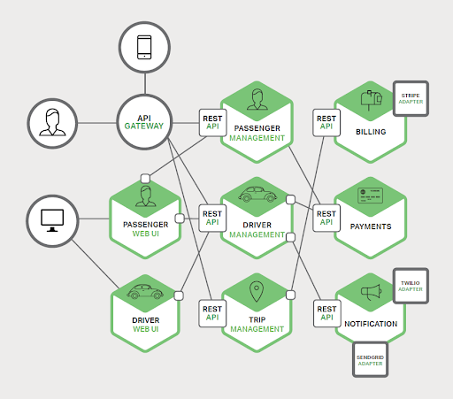
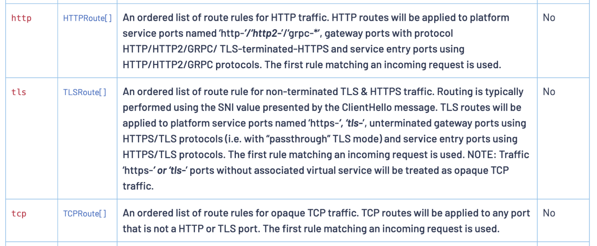

# 云原生——容器和应用安全运营实践思考

**文｜**腾讯“洋葱”入侵对抗团队 bghost

# 一、前言

随着云计算的蓬勃发展，云原生概念被提出并快速发展，公司内部也在推进使用云原生技术进行架构优化，研发模式和基础设施都发生了很大的变化，新的k8s和容器技术正逐步取代传统的物理机和虚拟机。

在云原生架构的演变过程中我们发现也带来了一些新的风险和挑战，腾讯蓝军的同事在TSRC博客上《红蓝对抗中的云原生漏洞挖掘及利用实录》一文中从攻击者视角详细介绍了云原生架构下的风险点，包括容器网络安全、容器逃逸、容器/K8S配置安全、容器镜像安全、Serverless安全、DevOps安全等多个方面，对以上详细细节感兴趣的可以在附录查看原文章。

为保障业务上云安全，安全建设也要顺应云原生的发展，一方面是安全系统的研发部署要用拥抱云原生，此前腾讯自研的HIDS/EDR“洋葱”也有分享一些经验（见附录），另一方面是安全运营要分析解决新的安全风险。

本文从安全攻击面出发，以防御视角分享我们在云原生安全运营上的一些实践和思考，欢迎大家交流探讨。

# 二、云原生安全

先简单说明下云原生的概念，云原生概念最早是在2013年由 Pivotal 公司的 Matt Stine 提出的，2015年Google主导成立CNCF（云原生计算基金会）也定义了云原生。对于云原生，不同组织有不同的理解，不同时间定义不同，时至今日比较主流的还是Pivotal 和 CNCF。

Pivotal提出的云原生的4个要点：DevOps、持续交付、微服务、容器；CNCF(云原生计算基金会)提出云原生的关键技术: 容器、服务网络、微服务、不可变基础设施和声明式API。云原生安全建设工作也是围绕这些核心元素展开，可以简单的把云原生分为基础安全、K8S/容器安全、云原生应用安全和DevSecOps。

其中基础安全主要还是底层设备/云环境的一些传统的基础安全防护，包括虚拟化安全、DDoS防护、主机安全、网络安全等，DevSecOps此前已发过一些文章（附录），本文重点介绍在k8s、容器、应用层云原生安全方向的一些安全运营建设思考。

# 三、云原生应用安全

云原生应用层涉及面广，在安全建设中结合攻击矩阵和内部业务面临的一些实际风险（基于内部蓝军演练）梳理出一些高风险点优先建设，主要聚焦在微服务安全、Serverless安全和API网关安全。

## 3.1微服务安全

利用高危服务入侵是网络攻击中最简单常见的一种方法，尤其是在内网隔离措施和安全意识没有外网严格的地方更容易被攻击。云原生架构的基础是K8S和容器，业务以微服务形式部署，服务安全相较于传统环境更加重要。我们通过服务扫描、服务隔离、服务清理、服务认证鉴权来做容器环境的服务治理。

微服务架构示意图：

### 3.1.1 服务扫描

和传统IDC网络一样，在内外网分别部署扫描节点，通过对端口进行连接和探测发现高危服务，这里主要通过腾讯自研的漏洞检测系统“洞犀”来实现，和传统扫描的区别是需要对K8S overlay网络环境做一些改造适配。K8S pod网络简单可以分为两类:

（1）pod网络和底层网络可以直接通信，pod占一个独立内网ip，和底层节点在同一个网络平面;

（2）pod网络在overlay，pod使用私有ip，默认只能在集群内互相通信。k8s开放支持了CNI网络接口以实现不同的overlay网络通信方案，目前流行的CNI插件有Flannel、Calico、Weave和Canal等。

对于pod在overlay的这种场景传统扫描器无法触达，改造方案计划是在不同TKE集群内设置扫描节点来解决，高危服务的扫描会发送安全工单，业务收到安全工单及时修复即可。

### 3.1.2 服务隔离

无状态的服务在pod重启后IP会动态变化，基于IP的ACL策略不再有效，K8S自身提供了network policy机制来实现网络隔离，可以支持按namespace或pod纬度来制定三层/四层的不同级别的隔离策略，网络策略配置可参考：[https://kubernetes.io/zh/docs/concepts/services-networking/network-policies/](https://kubernetes.io/zh/docs/concepts/services-networking/network-policies/)

目前业界也有一些容器安全产品中加入了pod隔离功能简化业务配置，有个小问题就是并不是所有的K8S CNI网络插件都支持network policy策略（支持的插件列表：[https://kubernetes.io/docs/concepts/cluster-administration/addons/#networking-and-network-policy](https://kubernetes.io/docs/concepts/cluster-administration/addons/#networking-and-network-policy)

服务隔离最大的难点是在运营落地，实施隔离需要卷入业务参与避免影响到业务稳定性，这会增加业务的运维和管理成本，业务的意愿性不强，在实际运营中需要对业务做分类分级，按业务特性、分类和安全等级分别执行不同的安全标准和运营策略。

### 3.1.3 服务最小化

按照微服务的理念在一个pod中只运行单一的服务，这种理念符合安全中的最小化原则，但在实际生产中有些业务的部署模式并不是很云原生，把容器当虚拟机用，在制作构建业务镜像时有时候会打入一些非业务服务，引入了不必要的安全风险，需要清理掉不需要的服务和组件，至少要删除掉高危服务，比如删除掉SSH服务就彻底杜绝了SSH密码爆破或密码泄露的安全风险，高危服务我们梳理了一个清单并加入到安全规范，并在基础镜像、业务镜像构建阶段建设检测和管控措施推动风险的收敛。

### 3.1.4 认证授权

微服务架构下内网服务之间的通讯十分复杂，也增加了安全建设的成本，服务网格技术很好的解决了该问题，服务网格将应用程序的网络通信部分剥离出来作为一个sidecar独立运行，所有应用程序的通信都经过sidecar代理，由服务网格做路由控制和网络管理。

基于服务网格可以把服务间的通信统一的管控起来，以istio为例，下图是服务网格 istio的安全架构，实现了统一的身份认证和访问控制，istio的身份认证是CNCF项目中spiffe安全框架的的一个实现，spiffe（Secure Production Identity Framework For Everyone）是一套安全标准，在官方文档中除了istio还有Consul、Kuma也实现了这个安全标准，istio的访问控制通过配置rbac策略实现。由于目前服务网格技术还没有形成类似k8s大一统的局面，各个云都有推出自己的Mesh，业务侧也有一些自研的Mesh方案，服务网格技术目前还处在发展中，基于服务网格做安全认证授权的落地方案还需要持续摸索。

## 3.2 Serverless安全

Serverless作为云原生的一个重要技术，安全自然也是非常重要，腾讯云也有提供Serverless平台服务——SCF。对于用户运行和部署代码无需服务器，按需付费，Serverless模式下的安全问题分为两类：平台安全和应用自身的安全。

#### （1）平台安全

平台上租户购买Serverless服务跑恶意代码或尝试攻击的行为非常常见，平台存在漏洞可能会导致跨租户攻击或资源消耗类问题，安全上主要通过租户资源隔离、环境重置和主机安全检测等机制来解决。由于这里的攻击/作恶成本很低，需要联合云平台做治理和打击方案。

#### （2）应用安全

Serverless应用也存在安全漏洞的问题。由于Serverless应用的生命周期很短，安全扫描和检测机制存在一定延时，可能还没触发安全扫描应用所在的环境已经被销毁重制了。基于这个特性运行时应用自我保护（RASP，Runtime Application Self-Protection）是一个比较合适的解决方案，RASP随应用程序启动而启动，且具备应用层实时安全检测和安全阻断的能力，运营难点在于不是通用方案，需要对不同语言和不同版本开发维护多个安全组件，由于侵入性强，配置上也需要能够支持定制化场景满足不同类型的业务需求。

# 3.3 API网关安全

API网关接管了南北向流量，方便前端调用管理复杂的后端服务。在安全上API网关产品一般都会自带提供认证加密、访问控制的安全能力，安全团队主要是解决安全防护的问题，其中基础安全中比较重要的就是WAF。腾讯自研的WAF“门神”已经在开始支持API的安全防护。

为了方便业务接入WAF，安全运营上需要有一些便捷的方式，目前我们是有两个实践：

（1） APIGW + 负载均衡（腾讯内部是CLB/TGW）架构，我们在负载均衡产品上统一实现WAF接入

（2） APIGW + SCF架构，这种架构目前主要是内网业务在用，内网业务会经过公司的办公网关，我们将WAF前置到APIGW之前，和办公网关联动实现了统一接入。在内网接入上需要注意的防护的误杀，建议是先接入流量旁路观察并提供一些配置接口给到业务自定义。

# 四、容器安全

云原生架构下基础运行环境从物理机/虚拟机变成了容器，容器安全建设有一些新的领域，也有一些领域是可以基于传统安全系统更新迭代解决的，外界有一些说法是传统安全产品完全不适用容器，笔者认为是有点夸大了，以下是我们在容器安全建设中遇到的一些问题和实践思考。

## 4.1 容器资产管理

在传统架构下通过CMDB做资产管理，云原生架构下最小管理单元不再是物理机和CVM，变成pod和容器，安全扫描、安全修复和安全应急都依赖资产信息(节点IP、容器名、容器id、负责人等)，资产信息不全可能会导致安全事件无法排查原因和修复。为了区分不同的资源类型（物理机、CVM和容器），我们在公司内发布了“虚拟资源管理注册规范”，从而保证资产信息的准确录入，对于容器资产如果支持录入CMDB的会要求容器平台直接录入，不能支持的会要求容器平台同步到安全服务中心（腾讯内部的SOC），SOC提供统一的接口便于各个安全系统查询使用。

## 4.2 集群安全配置

腾讯内部业务主要是部署在TKEx平台上，TKEx的底层是k8S， k8s安全配置业界有一些安全标准，比较公认的是CIS（互联网安全中心）发布的安全基准 - Kubernetes。前段时间NSA（美国国家安全局）也发布了一个k8s加固指南：

英文版：Kubernetes Hardening Guidance”

[https://media.defense.gov/2021/Aug/03/2002820425/-1/-1/1/CTR\_KUBERNETES%20HARDENING%20GUIDANCE.PDF](https://media.defense.gov/2021/Aug/03/2002820425/-1/-1/1/CTR_KUBERNETES%20HARDENING%20GUIDANCE.PDF)

中文版《Kubernetes 加固指南》中文版  
[https://jimmysong.io/kubernetes-hardening-guidance/](https://jimmysong.io/kubernetes-hardening-guidance/)

由于这些指南内容较长且有一定的学习成本，为方便公司业务快速发现和收敛高风险问题，结合腾讯蓝军的攻防实践经验和腾讯安全应急响应中心（TSRC）处置过的真实安全案例总结了四类高风险场景优先推动修复，具体包括：

（1）会导致信息泄漏或权限控制的k8s/docker端口服务  
（2）会导致逃逸提权的配置不当  
（3）会导致getshell或信息泄漏的高危漏洞  
（4）节点未安装HIDS“洋葱”

接下来就是推动风险收敛，在运营上我们把安全作为云原生成熟度的一个子指标，和资源利用、研发效能工作一同推进；同时需要控制增量风险的收敛——开启PSP策略，PodSecurityPolicy（简称PSP）可以配置定义一些安全参数来限制pod启动，只有pod满足配置安全参数才会被启动，PSP支持的配置项包括 特权容器、目录映射等（详见：[https://kubernetes.io/docs/concepts/policy/pod-security-policy/?spm=a2c4g.11186623.2.14.703c8b7fMCIbrz](https://kubernetes.io/docs/concepts/policy/pod-security-policy/?spm=a2c4g.11186623.2.14.703c8b7fMCIbrz) ），通过开启PSP策略可以解决多项配置不当风险。需要注意的是PodSecurityPolicy 在Kubernetes v1.21版本中被弃用，将在v1.25中删除，需要关注下k8s后续的替代方案。

## 4.3 容器镜像安全

公司在传统物理机和CVM上OS都是统一管控的TLinux，安全性较高。而容器是基于镜像构建的，公网上有很多公共镜像，这些从公网下载的镜像如果被植入了恶意代码或者是包含了不安全的组件会直接影响到现网业务，由于镜像的复用性甚至会产生规模性的影响。在保障容器镜像安全上可以在镜像仓库和发布两个方面做安全加固：

（1）搭建内部安全的镜像仓库，控制和管理基础镜像，各个镜像仓库维护一批可信的基础镜像，仅允许在这批镜像上构建业务镜像，并对仓库的镜像做持续安全扫描，主要扫描项有：安全漏洞、恶意文件、敏感信息和安全基线配置。

（2）流水线安全扫描：在业务发布镜像的过程中做安全扫描和管控，安全扫描插件和镜像构建插件集成到一起，减少业务接入成本并实现默认安全。

## 4.4 容器运行时安全

入侵检测是容器运行时安全的重要安全手段。在传统架构下，我们通过HIDS“洋葱”来解决服务器的入侵检测问题。在容器环境下需要采集容器内的数据做安全分析，架构上我们还是基于HIDS实现容器的数据采集，用一套HIDS的好处是可以减少业务团队的成本，业务无需做任何改造或安装其他系统，支持容器环境的webshell、反弹shell和异常进程检测等多种安全功能。在容器镜像上支持传统的tlinux/centos/ubuntu镜像，也支持alpine这类轻量容器。

## 4.5 容器登录管理

安全上建议“去console运维”不登录容器，实际情况还是会存在业务有登录的需求，需要有安全方案，先看一下几种容器登录通道：

（1）容器内部署sshd服务，业务把容器当作虚拟机用通过SSH登录容器做运维，这种模式不符合云原生架构的理念，且sshd服务通过密码登录存在非常大的安全风险（密码被爆破或口令泄漏），此类登录方式安全上不推荐，建议删除容器的sshd服务。

（2）先登录到容器node节点再docker exec进入容器，由于一个节点上会运行多个容器，同一个节点上的容器可能并不属于同一个负责人，这种模式会存在权限分配过大的问题。

（3）通过k8s的webconsole或kubectl客户端登录。这种模式也存在权限管理的问题，有些业务是按照业务粒度做授权，会导致权限分配过大的问题。

基于这些权限管理问题我们研发了服务器权限管理系统“铁将军”，集中管理公司服务器/容器资产的账号和权限，按资产粒度细粒度授权，实现权限最小化分配，并支持操作审计能力。

## 4.6 容器网络安全

流量检测是解决网络安全问题的常用方案，可以通过IDS做安全检测和防护，在云原生架构下IDS的一个难点是抓取容器东西向的流量通信，我们通过“洋葱”在node节点采集容器的东西向四层通信流量做了一些安全检测，主机检测的难点是需要控制资源消耗避免影响业务，在数据采集的丰富度和IDS还是有一些差距。除此之外服务网格也带来了一些新的内网流量采集方式，以istio服务网格为例详细说明下。下图是istio提供了一个bookinfo示例，productpage 、reviews、ratings、details是不同的微服务。

我们把productpage访问reviews的东西向流量镜像一份到测试容器Nginx，这里需要配置一个VirtualService，VirtualService在istio中负责流量路由转发，在VirtualService配置中加以下几行代码实现流量镜像。

1.  `mirror:`
2.  `host: nginx`
3.  `port:`
4.  `number: 80`
5.  `mirrorPercentage:`
6.  `value: 100.0`

镜像到的数据如下：

1.  `GET /reviews/0 HTTP/1.1`
2.  `host: reviews-shadow:9080`
3.  `user-agent: Mozilla/5.0 (Macintosh; Intel Mac OS X 10_15_7) AppleWebKit/537.36 (KHTML, like Gecko) Chrome/91.0.4472.101 Safari/537.36`
4.  `accept-encoding: gzip, deflate`
5.  `accept: */*`
6.  `x-request-id: 7f7344ac-039a-99ee-910b-7a1716fa9a6e`
7.  `x-forwarded-proto: http`
8.  `x-envoy-attempt-count: 1`
9.  `x-forwarded-for: 10.1.0.52`
10.  `x-envoy-internal: true`
11.  `x-forwarded-client-cert: By=spiffe://cluster.local/ns/default/sa/default;Hash=e40c57e2bcafed8e7f59e9bb84c0c2ea0bafed4f085efc285774ea0cca7a34df;Subject="";URI=spiffe://cluster.local/ns/default/sa/bookinfo-productpage`
12.  `x-b3-traceid: d605f723bc9ff6b76e19334ef7882929`
13.  `x-b3-spanid: 9611f0bb69e6f424`
14.  `x-b3-parentspanid: 224863ccc44fdd12`
15.  `x-b3-sampled: 0`

跟原始数据相比，除了HTTP协议头中的host和x-forwarded-for值不同，其他都一样，host字段在原数据上加了一个“-shadow”后缀。不过在istio的官方文档中，VirturalService当前支持对 http,tls,tcp 三种类型的流量进行路由配置，仅http流量有mirror流量镜像的配置选项。

# 五、写在最后

云原生技术处在一个快速发展的阶段，云原生安全建设也没有标准答案，还需要在发展中不断实践和摸索。最后欢迎大家扫描下方二维码关注腾讯安全应急响应中心公众号，公众号上会定期分享安全技术文章，涵盖DDoS防护、云原生安全、DevSecOps、流量安全、前沿研究、红蓝对抗等多个方面。

### 附录

《[红蓝对抗中的云原生漏洞挖掘及利用实录](https://mp.weixin.qq.com/s/Aq8RrH34PTkmF8lKzdY38g "红蓝对抗中的云原生漏洞挖掘及利用实录")》  
《[腾讯自研HIDS「洋葱」后台上云架构演进实践](https://mp.weixin.qq.com/s/zQ4_6GrO_47GWAMQNN5sFg "腾讯自研HIDS「洋葱」后台上云架构演进实践")》  
《[安全需要每个工程师的参与”-DevSecOps理念及思考](https://mp.weixin.qq.com/s/_jBmFdtyXY5D_YrrTUP1iQ "安全需要每个工程师的参与”-DevSecOps理念及思考")》  
《[安全左移理念，腾讯DevSecOps如何实践？](https://mp.weixin.qq.com/s/_jBmFdtyXY5D_YrrTUP1iQ "安全左移理念，腾讯DevSecOps如何实践？")》
