# 云攻防课程系列（四）：云服务安全攻防

### 云攻防课程系列（四）：云服务安全攻防

[2023-06-05](https://blog.nsfocus.net/cloudservice/ "云攻防课程系列（四）：云服务安全攻防")[李来冰](https://blog.nsfocus.net/author/lilaibing/ "View all posts by 李来冰")[云服务攻防](https://blog.nsfocus.net/tag/%e4%ba%91%e6%9c%8d%e5%8a%a1%e6%94%bb%e9%98%b2/), [公有云攻防](https://blog.nsfocus.net/tag/%e5%85%ac%e6%9c%89%e4%ba%91%e6%94%bb%e9%98%b2/)

阅读： 487

## ****一、概述****

近日，绿盟科技星云实验室与北京豪密科技有限公司联合推出了一项云攻防技术培训课程。该课程旨在根据客户需求，为客户提供专题培训，帮助客户熟悉常见的云安全架构，并提供云攻防技术理解，同时结合模拟攻击实验提升攻防能力。该课程参与学员涵盖了特殊行业的单位、国企等十多家单位。课程共分为六个章节，分别就云计算基础、云上攻击路径、云上资产发现与信息收集、云服务安全攻防、云原生安全攻防以及虚拟化安全攻防进行了详细介绍。

本系列文章旨在以科普为目的面向各位读者推出，本文是该系列的第四篇，主要介绍的内容是云服务安全攻防，涵盖了云服务安全事件、不同类型云服务的攻防技术以及AWS攻防实验。

## ****二、云服务安全事件****

公有云厂商提供的云服务种类较多，涵盖计算、容器、数据库、存储、无服务器等类别，不同的云厂商提供的云服务也不尽相同。近年来，公有云服务也不断披露出相关风险，如下所示：

### ****2.1 AWS Log4Shell********热补丁漏洞****

Log4Shell（CVE-2021-44228）是2021年最严重的漏洞之一。AWS为了帮助用户防御这个漏洞，针对不同的环境开源了几个热补丁解决方案。热补丁是向有漏洞的运行中的应用程序注入一个修复程序的过程。它的目的是作为一个短期的解决方案，直到新的固定版本的应用程序被部署。但研究人员发现这些补丁可以被利用来进行容器逃逸和权限提升\[1\]，验证结果如图1所示：

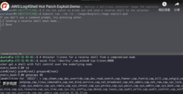

图1 AWS Log4Shell热补丁漏洞

### ****2.2**** Microsoft Azure Service Fabic权限提升漏洞

2022年6月，Microsoft Azure Service Fabric服务被曝CVE-2022-30137\[2\]，该漏洞允许攻击者在容器内提升权限至主机节点root权限，且利用门槛低，危害较大。

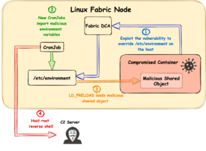

图2 Microsoft Azure Service Fabic权限提升

### ****2********.3 C********l********oud PostgreSQL********漏洞****

2022年8月，Wiz研究员披露了GCP（Google Cloud Platform）的PostgreSQL存在漏洞，由于GCP对PostgreSQL代码进行二次修改，导致攻击者可以在云服务环境中进行容器逃逸，实现跨租户攻击。

通过以上不同公有云厂商发生的云安全事件可以了解到，云上租户在使用公有云服务时，除了考虑自身业务的安全风险外，还需考虑是否会受到公有云本身的影响。为了便于管理多租户环境，公有云厂商往往会在云环境中安装一些管理组件，但此类组件一般以较高权限运行，一旦被攻击者恶意利用，将会对公有云环境造成严重危害。

## ****三、云服务攻防技术****

那么都有哪些云服务可能会被攻击者利用呢？攻击者又如何利用？下面介绍一下云服务相关的攻击技术。

### ****3********.1 C********loud********S********hell****

多数云厂商会提供CloudShell的服务，便于用户通过CloudShell快速运行脚本、管理云服务资源，界面如图3所示：

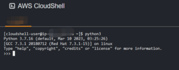

图3 AWS CloudShell

可以看到，CloudShell类似于云服务器实例的shell，默认安装了一些软件包，因此攻击者可以在不购买云服务器资源的情况下，利用该shell进行恶意攻击，如安装恶意python脚本并执行。

### ****3.********2**** ****元数据服务****

元数据服务的概念在此不做赘述。当攻击者通过一些手段获取到云服务器的访问权限时，便可以尝试利用元数据服务进行权限提升。通过元数据服务可以访问实例的敏感数据，例如角色的临时凭据，然后利用该凭据进行横向移动或权限提升。不同云厂商的元数据服务地址不同，如下所示：

-   AWS元数据服务：
    
    [↓↓↓](http://169.254.169.254/latest/meta-data/)  
      
    http://169.254.169.254/latest/meta-data/  
      
    [↑↑↑](http://169.254.169.254/latest/meta-data/)
    
-   GCP元数据服务：
    
    [↓↓↓](http://metadata.google.internal/computeMetadata/v1/)  
      
    http://metadata.google.internal/computeMetadata/v1/  
      
    [↑↑↑](http://metadata.google.internal/computeMetadata/v1/)
    
-   Azure元数据服务：
    
    [↓↓↓](http://169.254.169.254/metadata/instance?api-version=2021-02-01)  
      
    http://169.254.169.254/metadata/instance?api-version=2021-02-01  
      
    [↑↑↑](http://169.254.169.254/metadata/instance?api-version=2021-02-01)
    
-   腾讯云元数据服务：
    
    [↓↓↓](http://metadata.tencentyun.com/latest/meta-data/)  
      
    http://metadata.tencentyun.com/latest/meta-data/  
      
    [↑↑↑](http://metadata.tencentyun.com/latest/meta-data/)
    
-   阿里云元数据服务：
    
    [↓↓↓](http://100.100.100.200/latest/meta-data)  
      
    http://100.100.100.200/latest/meta-data  
      
    [↑↑↑](http://100.100.100.200/latest/meta-data)
    

### ****3.********3 IAM********服务****

IAM即身份与访问管理，各大云厂商都有自己的IAM服务。但IAM权限、角色在使用过程中可能存在配置不当，从而产生安全风险。

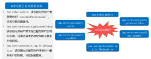

图4 GCP IAM风险权限

如图4所示，GCP的IAM服务中存在一些风险权限：

-   roles.update：该权限允许用户更新角色的”includedPermissions”，从而导致权限提升。
-   serviceAccounts.implicitDelegation：该权限允许服务账户继承另一服务账户的权限，导致权限提升。
-   serviceAccounts.getAccessToken：该权限允许用户请求指定服务账户的访问令牌，可通过请求更高权限的令牌来升级权限。

一旦某些权限被配置在业务环境中，可能会被攻击者恶意利用。

### ****3.********4**** ****对象存储服务****

对象存储服务是近几年较为流行的云服务，如AWS S3、阿里云OSS、腾讯云COS、七牛云Kodo等。但存储桶也在不断曝出相关的安全事件，如图5所示：

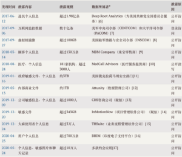

图5 S3存储桶数据泄露事件示例

用户在使用云存储服务时，可能会出现错误设置的情况，导致可以公开读或公开写存储桶中的数据，造成数据泄露。针对对象存储桶的攻击路径主要有以下几种：

-   Bucket公开访问
-   Bucket桶爆破
-   特定的Bucket策略配置
-   Bucket Object遍历
-   任意文件上传与覆盖
-   AccessKeyId/SecretAccessKey泄露
-   Bucket劫持与子域接管
-   存储桶的配置可写
-   修改Bucket策略为Deny使业务瘫痪
-   修改网站引用的S3资源进行钓鱼

### ****3********.5 CloudTrail********服务****

AWS CloudTrail 是一项 AWS 服务，可帮助您对 AWS 账户进行操作和风险审核、监管和合规性检查。用户、角色或 AWS 服务执行的操作将记录为 CloudTrail 中的事件。事件包括在 AWS Management Console、AWS Command Line Interface 和 AWS 开发工具包和 API 中执行的操作。通俗地说， CloudTrail监视着用户的所有行为。如图6所示，是CloudTrail的日志记录：

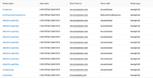

图6 CloudTrail日志

由于CloudTrail服务会记录下大部分AWS账户日志，因此在攻击AWS时攻击者往往会考虑绕过该服务的检测。针对CloudTrail的绕过方式主要有以下几种：

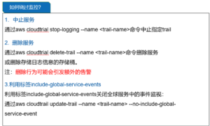

图7 CloudTrail绕过

### ****3********.6 RDS********服务****

RDS即关系型数据库，为了保护数据安全，数据用户往往会进行数据库备份。而为了便于数据恢复，给数据库拍快照是常用一种手段，当快照配置错误时会导致未加密的RDS快照作为公有快照进行共享，如图8所示：

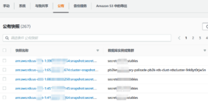

图8 RDS公有快照

当攻击者获取到还原数据库的权限时，便可以将公有快照还原至某个可控的实例中，从实例中窃取用户数据。

### ****3********.7 AWS ECS********服务****

AWS ECS即是弹性容器服务，用户可以使用它来运行、停止和管理集群上的容器。使用 AWS ECS，用户的容器是在用于运行单个任务或服务内的Task Definitions中定义的。而Task Definitions可配置的参数包括如图9所示：

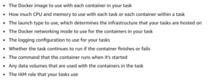

图9 Task Definitions配置参数

其中可能包含容器在启动时运行的命令信息、租户运行任务时使用的 IAM 角色信息等。

## ****四、A********WS********攻防实验****

为了加深对攻防技术的理解，本次课程通过搭建公有云攻防靶场进行了实操练习。关于AWS的攻防靶场，笔者推荐RhinoSecurityLabs开源的cloudgoat\[3\]，可通过命令行的方式快速部署脆弱环境，例如：

实验：利用SSRF漏洞获取S3存储桶数据

命令：./cloudgoat.py create ec2\_ssrf

参考攻击路径：

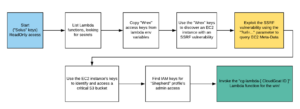

图10 ec2\_ssrf参考攻击路径

## ****五、总结****

本文作者根据课程内容，简要介绍了一些与云服务相关的安全事件以及云服务的利用技巧，然后推荐了相关的实验环境，旨在科普公有云服务相关知识，帮助更多读者了解和掌握云服务的攻防技巧。

最后笔者推荐由星云实验室牵头对外发布的一些参考资料，希望可以给各位读者带来帮助。

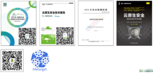

图11 推荐阅读

### ****参考文献****

1.  [↓↓↓](https://unit42.paloaltonetworks.com/aws-log4shell-hot-patch-vulnerabilities/)  
      
    https://unit42.paloaltonetworks.com/aws-log4shell-hot-patch-vulnerabilities/  
      
    [↑↑↑](https://unit42.paloaltonetworks.com/aws-log4shell-hot-patch-vulnerabilities/)
    
2.  [↓↓↓](https://unit42.paloaltonetworks.com/fabricscape-cve-2022-30137/)  
      
    https://unit42.paloaltonetworks.com/fabricscape-cve-2022-30137/  
      
    [↑↑↑](https://unit42.paloaltonetworks.com/fabricscape-cve-2022-30137/)
    
3.  [↓↓↓](https://github.com/RhinoSecurityLabs/cloudgoat/)  
      
    https://github.com/RhinoSecurityLabs/cloudgoat/  
      
    [↑↑↑](https://github.com/RhinoSecurityLabs/cloudgoat/)
    

### 推荐阅读

[云攻防课程系列（一）：云计算基础与整体安全](https://blog.nsfocus.net/cloudcomputing/)    

[云攻防课程系列（二）：云上攻击路径](https://blog.nsfocus.net/cloud/)

[云攻防课程系列（三）：云上资产发现与信息收集](https://blog.nsfocus.net/cloudasset/)

**版权声明**

本站“技术博客”所有内容的版权持有者为绿盟科技集团股份有限公司（“绿盟科技”）。作为分享技术资讯的平台，绿盟科技期待与广大用户互动交流，并欢迎在标明出处（绿盟科技-技术博客）及网址的情形下，全文转发。  
上述情形之外的任何使用形式，均需提前向绿盟科技（010-68438880-5462）申请版权授权。如擅自使用，绿盟科技保留追责权利。同时，如因擅自使用博客内容引发法律纠纷，由使用者自行承担全部法律责任，与绿盟科技无关。
