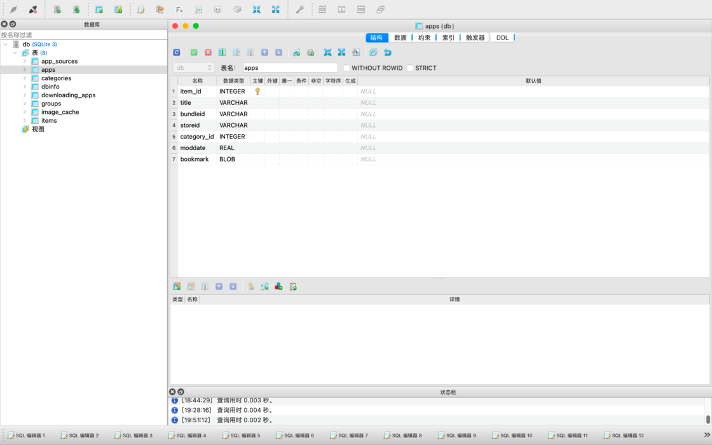
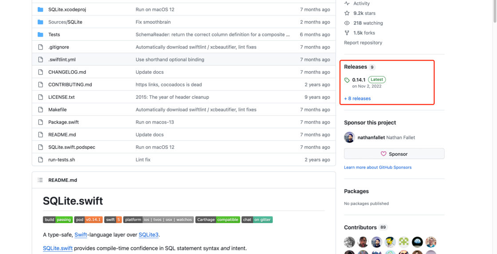
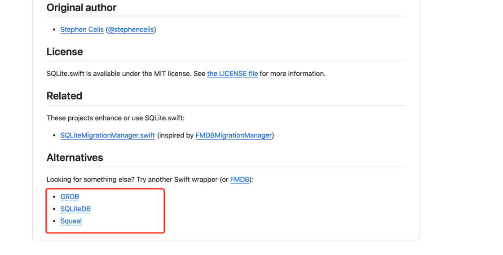
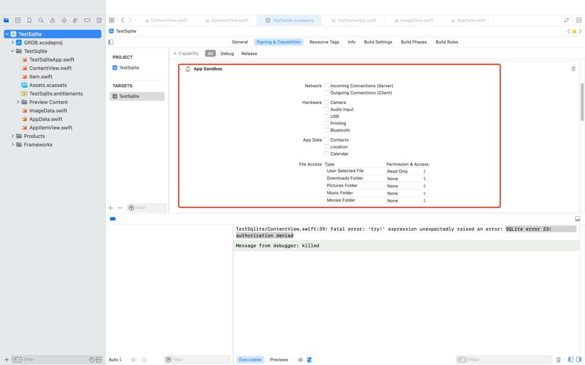
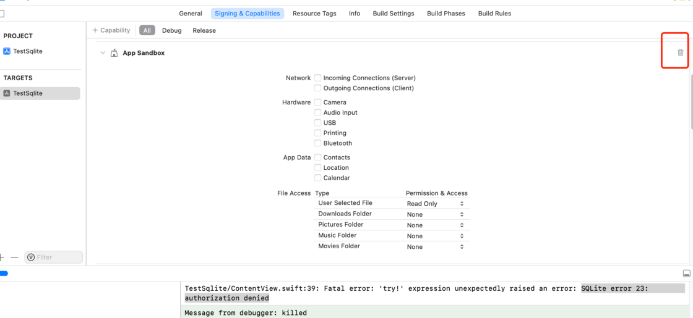

# 从头开始做个Mac小工具01：启动台数据分析&数据读取 - 少数派

在我的上篇文章[《为啥Mac启动台图标删不掉？（老赖图标终极解决方案）》](https://sspai.com/post/85136)中提到，我无意中发现了MacOS启动台的配置数据，很巧的是这个数据并未加密，我很容易的就读出了其中的数据并对其进行了少量的改变，从而解决了图标总是去不掉的小问题。

从本期内容开始，我将围绕这个数据库，尝试开发一个小工具，通过可视化的方法对启动台的图标进行维护。

读前声明：我主业是Unity3D和C++，没有太多的脚本语言开发经验，对苹果生态的Swift语言也只有初步的了解。本内容将肉眼可见的存在大量野路子代码，希望各位多包涵，重点看看我的折腾过程和解决问题的思路。

闲话少说，让我们进入正题。

## 启动台包下的db数据库文件分析

可预期的启动台应用`com.apple.dock.launchpad`包下的db数据库文件将是我们这个小工具的业务核心，因此在开始写代码前我们先分析分析这个数据到底是怎么组成的。

这里我将通过Mac下的SQLite数据库可视化管理工具：[SQLiteStudio](https://sspai.com/link?target=https%3A%2F%2Fgithub.com%2Fpawelsalawa%2Fsqlitestudio)（本软件开源，感兴趣的可以点击软件名称进入Github页面下载） 直接连接数据进行分析。

作为一个轻量级的SQLite数据库管理工具，SQLIteStudio已经足够了

我们可以很明显的注意到，启动台的这个数据库包含八张表，除掉与数据库配置相关的dbinfo表外，其余的七张表都将会在接下来的工作中发挥作用。

初步分析的数据库各表间的关系

通过我初步画的数据库表结构，我们已经可以发现各表间的关系。这个数据库和常规的数据库很大的不同，主键都没有用UUID，而是用的自增长的整形数字。甚至在apps、categories等几张表中，直接用了items的主键作为自己的主键。

因为今天是初步启动这个项目，我们重点先关注影响启动台图标的三张表，即：items、apps和image\_cahe。

其中items表是启动台上各个图标的主表，不论是文件夹groups还是应用apps都依赖这张表的rowid。而启动台图标的缓存图片则来自image\_cache表，该表中包含图标大小以及图标png解码后的data数据。

### 给自己的项目添加SQLite的开源库

初步分析过数据库后，我们来试着写一个Mac程序来读取这个数据库的数据吧。

虽然MacOS的已经自带了SQLite3的命令行工具，很容易就可以通过调用终端，用指令的方式实现数据读取。但是作为一个想要快速迭代的工具，我第一时间还是选择在github上找找有没有开源的库可以使用。

很快我就发现了第一个Swift的SQLite库：**SQLite.swift**，就在我开心的下载的时候，release数据却给我泼了盆冷水：这个库的最新release已经是在2022年11月。再经过23年WWDC发布SwiftUI 5.0后，大概率这个库已经用不了了。

最后一起发布已经离现在超过一年的时间

我不信邪的下载下来，不出所料，就是不能用了。但是很幸运的是，虽然这位叫[stephencelis](https://sspai.com/link?target=https%3A%2F%2Fgithub.com%2Fstephencelis)的老哥已经不再维护自己的项目了，却在这个项目的介绍下给我们推荐了几个类似的项目。

虽然项目已经不维护了，但是给老哥给大家推荐了几个同类项目。

经过分析，我最后选择了GRDB项目（因为SQLiteDB没单独release的包要自己连接库，而Squeal的最后更新时间是17年，比SQLite.swift还老……）。

### 尝试读取数据库数据

成功`import GRDB`后，我开始尝试读取启动台的配置数据库，此时一个很奇怪的报错却挡在了我面前。

提示我SQLite error 23: authorization denied，没有读写权限

因为我建的项目是MacOS的项目，当时我的逻辑依旧保持在Windows开发的那拖逻辑上，第一反应是`/private/var/folders`下的文件是系统文件，普通APP没有读取权限。

在经过了多次的`chmod`操作我始终都没有找到问题的解决方案，直到我看随手点到了项目配置文件里面，发现一个PC的程序居然是在沙盒下运行的，怪不得不能访问外部文件！

想不通，为啥Mac的程序要在沙盒里运行……

于是我开始尝试在沙盒配置里找到访问外部文件的方法，结果发现没有这个选项，只能开放下载、图片、音乐等少量的几个文件夹的访问权限。

就在我百思不得其解的时候，我发现整个沙盒配置脚步的左上角有一个垃圾筒图标，我试着把这个配置项删除，项目居然就运行正常了……

不是必须的你早说啊！

### 先做个简单的展示页

在绕了几个小时弯路之后，我终于实现了小工具的初步功能：读取启动台的配置数据库，并将其中的数据展示出来。

两个晚上的纠结，终于如我所愿。

希望接下来能够一切顺利吧！

### 下个阶段做啥？

因为这个项目不算复杂，所以准备整个项目开源，等架子搭好后我会把正式项目上传github或者Gitee等平台，供大家查阅。

再说说这个小工具的几个重点功能吧：

**图标删除：**就像上篇文章提到的，删除无法删除的启动台图标是这个小工具最核心的功能。

如果各位还有什么好想法，也可和我说呀～
