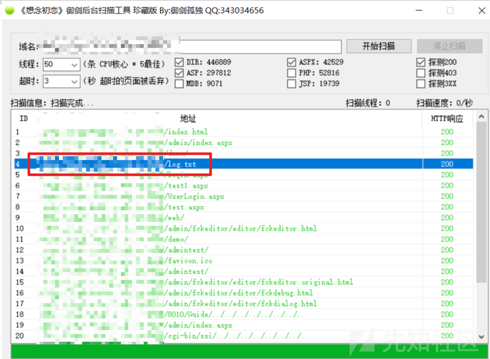
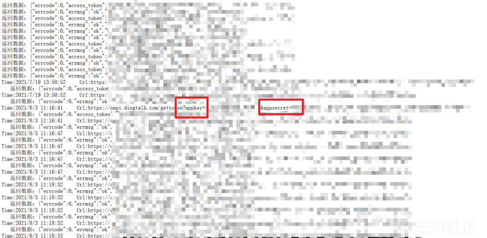
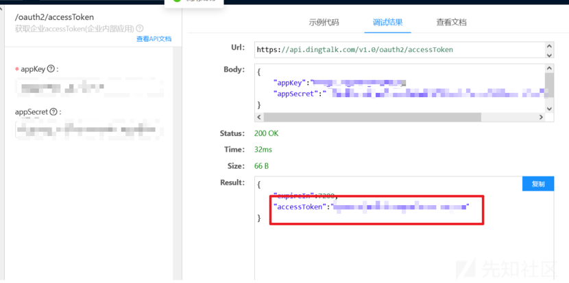
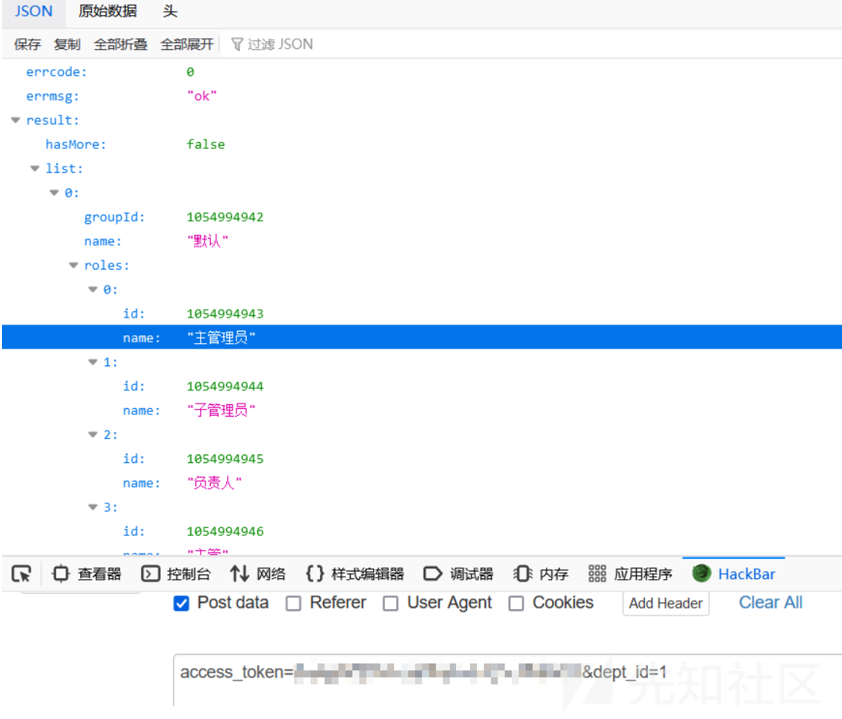
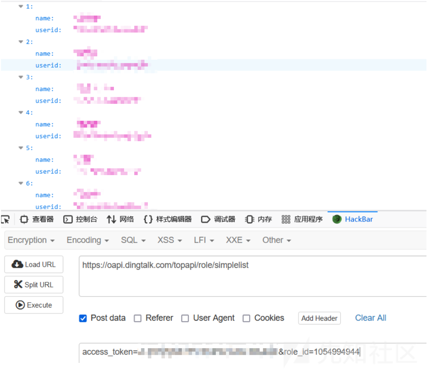
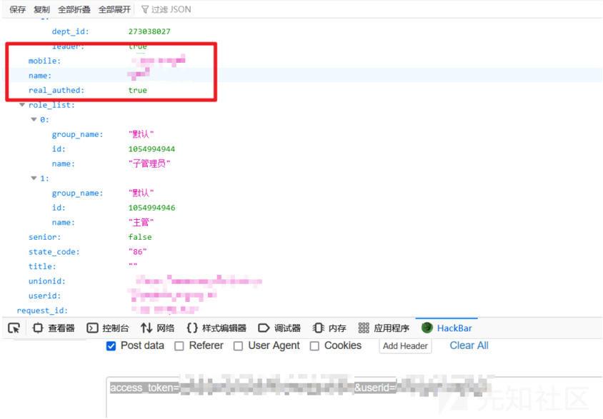
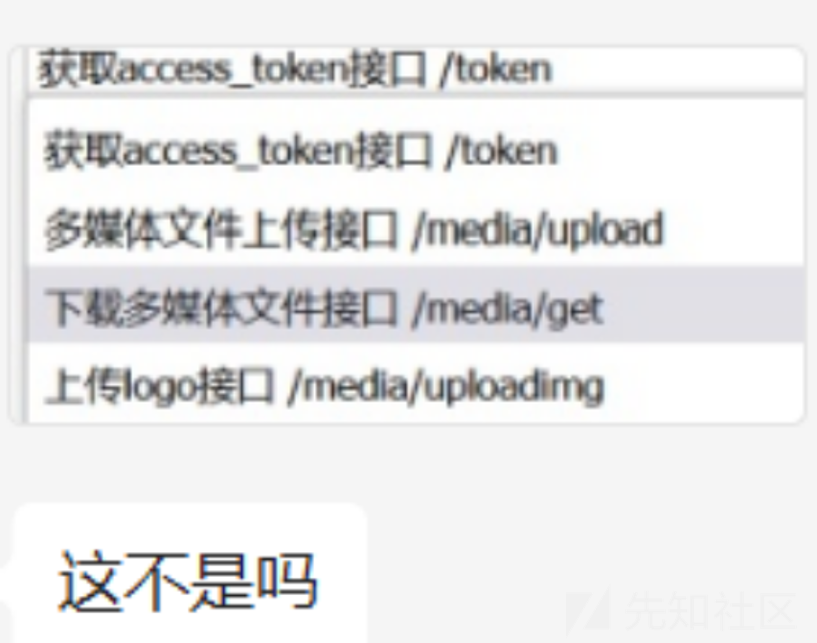

# 从日志文件泄露Dingtalk API秘钥到利用 - 先知社区

从日志文件泄露Dingtalk API秘钥到利用

- - -

### 发现 Dingtalk API 秘钥

今天遇到个日志文件泄露

里面有钉钉的appkey和appsecret

第一次见感觉挺新奇的就写个文章记录下

访问 [http://xxx.edu.cn/Login.aspx](http://xxx.edu.cn/Login.aspx) 如下图所示

稍稍测了一下没弱口令也没啥裸的接口

扫了一下目录吧...

发现有个日志文件

其中存在 dingtalk 的 appkey 和 appsecret

拿着 appkey 和 appscret 到以下钉钉的开放 Api 去拿 access\_token

[https://open-dev.dingtalk.com/apiExplorer#/?devType=org&api=oauth2\_1.0%23GetAccessToken](https://open-dev.dingtalk.com/apiExplorer#/?devType=org&api=oauth2_1.0%23GetAccessToken)

拿到 access\_token 后，在浏览器上直接访问接口去测试是否可用

（注意：不要直接在钉钉调，会说不是所属企业，但实际上是可以调的）

### 利用 Dingtalk API 秘钥

#### 获取所有角色

[https://oapi.dingtalk.com/topapi/role/list](https://oapi.dingtalk.com/topapi/role/list)

POST：access\_token=xxxxxxxx&dept\_id=1

（PS：这里面的dept\_id是指部门编号，1就是根部门编号，由于是必要参数所以就带上了）

#### 获取某角色组下所有成员

[https://oapi.dingtalk.com/topapi/role/simplelist](https://oapi.dingtalk.com/topapi/role/simplelist)

POST：access\_token=xxxxxxxxxxx&role\_id=1054994944

#### 获取特定成员的详细信息

[https://oapi.dingtalk.com/topapi/v2/user/get](https://oapi.dingtalk.com/topapi/v2/user/get)

POST：access\_token=xxxxxxxxxxxxxx&userid=xxxxxxxxxxxxxxxx

因为之前没见过钉钉的秘钥泄露，所以不清楚是啥危害

于是上群问了一下，有个师傅说 dingtalk 是有个接口可以上传文件的

然后私发了我张截图

简单尝试了下不行，给师傅也试了下，也不行

虽然没利用成功，但这也不妨碍我的大胆幻想

如果能够利用成功上传文件呢？

哈哈哈结束了

最后参考了下湘南第一深情师傅的文章

就当这个洞是中危吧

（PS：因为打歪了这个资产不属于目标资产的所以被拒了呜呜呜呜呜）
