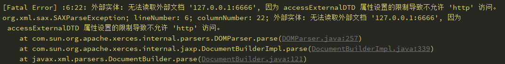
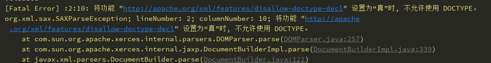
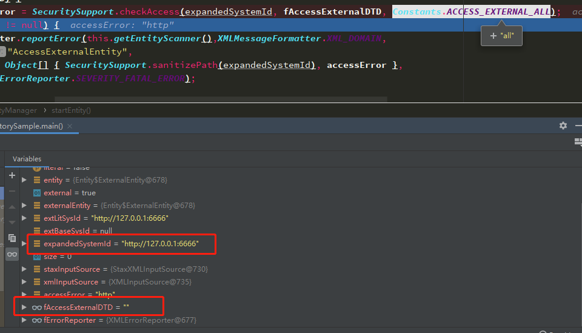
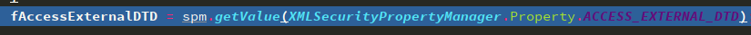
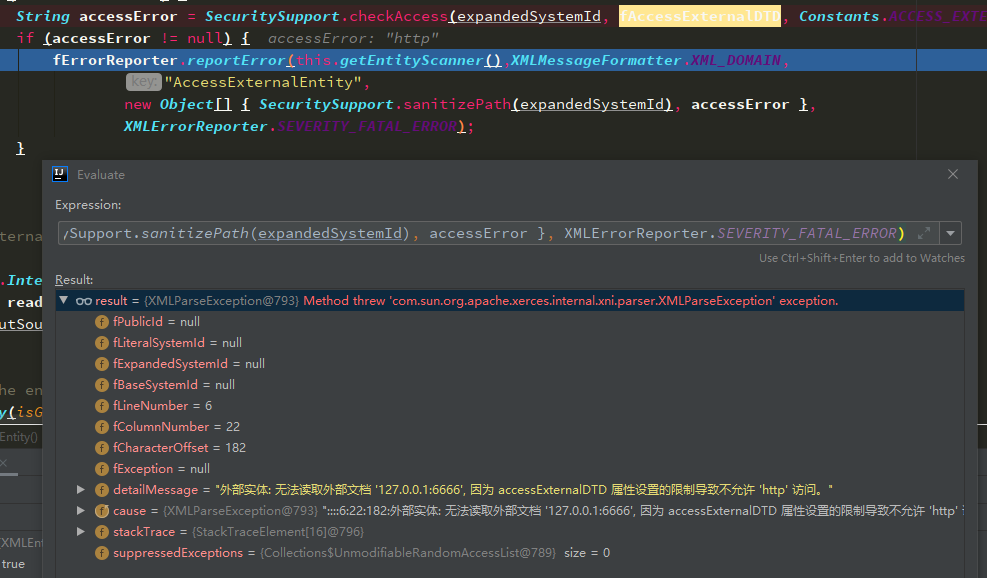
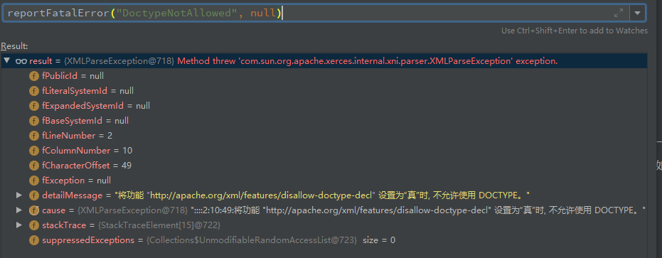

# 从源码层面看XXE的防御 - 先知社区

从源码层面看XXE的防御

- - -

# 前言

XXE的防御来说，实现方法千奇百怪（这里指的是那些基础库，像apache-poi这种解析excel的XXE，内部还是调用的那些基础库，修复方式当然只要升级对应版本即可）

Owasp的修复文档 [https://cheatsheetseries.owasp.org/cheatsheets/XML\_External\_Entity\_Prevention\_Cheat\_Sheet.html](https://cheatsheetseries.owasp.org/cheatsheets/XML_External_Entity_Prevention_Cheat_Sheet.html)

主要方式都是`setFeature`的方式来设置几个`features`，而且设置的都是一些无规律和章法的url常量，对于一个初学XXE的人来说，想要知道其中的原理，学习成本可能要比单纯的了解XXE要复杂的多。

由于具体的XML解析实现类比较多，这里就只挑一两个来分析，比较幸运的是，他们的最底层都是调用的同一个处理XML的库，应该就是位于`com.sun.org.apache.xerces.internal`之下的代码。

以下的漏洞实例代码来自 [https://github.com/LeadroyaL/java-xxe-defense-demo](https://github.com/LeadroyaL/java-xxe-defense-demo)

# DocumentBuilderFactory

一个正常的可以被攻击的实例代码

```plain
DocumentBuilderFactory dbf = DocumentBuilderFactory.newInstance();
DocumentBuilder builder = dbf.newDocumentBuilder();
builder.parse(ResourceUtils.getPoc1());
```

设置`XMLConstants.FEATURE_SECURE_PROCESSING`（常量的值也就是`http://javax.xml.XMLConstants/feature/secure-processing`）

```plain
FEATURE = XMLConstants.FEATURE_SECURE_PROCESSING;
dbf.setFeature(FEATURE, true);
```

可以看到

[](https://raw.githubusercontent.com/kingkaki/cloud-img/master/img/20200112213401.png)

或者设置`http://apache.org/xml/features/disallow-doctype-decl`

```plain
FEATURE = "http://apache.org/xml/features/disallow-doctype-decl";
dbf.setFeature(FEATURE, true);
```

报错也换了一种方式

[](https://raw.githubusercontent.com/kingkaki/cloud-img/master/img/20200112213601.png)

## secure-processing

可以先来跟一下这部分的处理逻辑，由于是对`DocumentBuilderFactory`这个`Factory`设置的feature，最后造成XXE的是工厂生成的`DocumentBuilder`，所以features变量肯定也会跟着进入`DocumentBuilder`中。

跟进`dbf.setFeature(FEATURE, true);`可以看到

```plain
if (features == null) {
    features = new HashMap<>();
}
if (name.equals(XMLConstants.FEATURE_SECURE_PROCESSING)) {
    if (System.getSecurityManager() != null && (!value)) {
        throw new ParserConfigurationException(
            SAXMessageFormatter.formatMessage(null,
                                              "jaxp-secureprocessing-feature", null));
    }
    fSecureProcess = value;
    features.put(name, value ? Boolean.TRUE : Boolean.FALSE);
    return;
}
```

可以看到这里只是将设置的feature存到了成员变量features中，那主要的传递逻辑就应该在`newDocumentBuilder`中

可以看到生成的时候，`DocumentBuilderFactory`将自己的features等一些属性传入了`DocumentBuilder`的初始化列表中

```plain
return new DocumentBuilderImpl(this, attributes, features, fSecureProcess);
```

跟到`DocumentBuilderImpl`构造函数中，一开始时是对`domParser`进行了一系列的setFeature

```plain
domParser = new DOMParser();
domParser.setFeature(VALIDATION_FEATURE, dbf.isValidating());

// "namespaceAware" == SAX Namespaces feature
domParser.setFeature(NAMESPACES_FEATURE, dbf.isNamespaceAware());

// Set various parameters obtained from DocumentBuilderFactory
domParser.setFeature(INCLUDE_IGNORABLE_WHITESPACE,
                     !dbf.isIgnoringElementContentWhitespace());
domParser.setFeature(CREATE_ENTITY_REF_NODES_FEATURE,
                     !dbf.isExpandEntityReferences());
domParser.setFeature(INCLUDE_COMMENTS_FEATURE,
                     !dbf.isIgnoringComments());
domParser.setFeature(CREATE_CDATA_NODES_FEATURE,
                     !dbf.isCoalescing());
if (dbf.isXIncludeAware()) {
    domParser.setFeature(XINCLUDE_FEATURE, true);
}

fSecurityPropertyMgr = new XMLSecurityPropertyManager();
domParser.setProperty(XML_SECURITY_PROPERTY_MANAGER, fSecurityPropertyMgr);

fSecurityManager = new XMLSecurityManager(secureProcessing);
domParser.setProperty(SECURITY_MANAGER, fSecurityManager);
```

跟到后面可以看到设置features的部分

```plain
if (secureProcessing) {
    /**
             * If secure processing is explicitly set on the factory, the
             * access properties will be set unless the corresponding
             * System Properties or jaxp.properties are set
             */
    if (features != null) {
        Boolean temp = features.get(XMLConstants.FEATURE_SECURE_PROCESSING);
        if (temp != null) {
            if (temp && Constants.IS_JDK8_OR_ABOVE) {
                fSecurityPropertyMgr.setValue(Property.ACCESS_EXTERNAL_DTD,
                                              State.FSP, Constants.EXTERNAL_ACCESS_DEFAULT_FSP);
                fSecurityPropertyMgr.setValue(Property.ACCESS_EXTERNAL_SCHEMA,
                                              State.FSP, Constants.EXTERNAL_ACCESS_DEFAULT_FSP);
            }
        }
    }
}
...
setFeatures(features);
```

可以看到这里假如features中存在`XMLConstants.FEATURE_SECURE_PROCESSING`，就会将如下两个property设置为空

-   `Property.ACCESS_EXTERNAL_DTD`
-   `Property.ACCESS_EXTERNAL_SCHEMA`

然后后面的`setFeatures(features)`就是将features再依次存到`domParser`中

```plain
private void setFeatures( Map<String, Boolean> features)
    throws SAXNotSupportedException, SAXNotRecognizedException {
    if (features != null) {
        for (Map.Entry<String, Boolean> entry : features.entrySet()) {
            domParser.setFeature(entry.getKey(), entry.getValue());
        }
    }
}
```

到这里`DocumentBuilder`初始化就算完成了。之后就进入到`parse`的环节，在`com/sun/org/apache/xerces/internal/parsers/XML11Configuration.java:796`的`parse()`中

有一个比较需要注意的点，在真正的扫描节点之前，会有一个`resetCommon()`动作

在这里根据feature设置了很多`XMLEntityManager`中的参数`com/sun/org/apache/xerces/internal/impl/XMLEntityManager.java:1486`

```plain
// sax features
fValidation = componentManager.getFeature(VALIDATION, false);
fExternalGeneralEntities = componentManager.getFeature(EXTERNAL_GENERAL_ENTITIES, true);
fExternalParameterEntities = componentManager.getFeature(EXTERNAL_PARAMETER_ENTITIES, true);

// xerces features
fAllowJavaEncodings = componentManager.getFeature(ALLOW_JAVA_ENCODINGS, false);
fWarnDuplicateEntityDef = componentManager.getFeature(WARN_ON_DUPLICATE_ENTITYDEF, false);
fStrictURI = componentManager.getFeature(STANDARD_URI_CONFORMANT, false);
fLoadExternalDTD = componentManager.getFeature(LOAD_EXTERNAL_DTD, true);

// xerces properties
fSymbolTable = (SymbolTable)componentManager.getProperty(SYMBOL_TABLE);
fErrorReporter = (XMLErrorReporter)componentManager.getProperty(ERROR_REPORTER);
fEntityResolver = (XMLEntityResolver)componentManager.getProperty(ENTITY_RESOLVER, null);
fStaxEntityResolver = (StaxEntityResolverWrapper)componentManager.getProperty(STAX_ENTITY_RESOLVER, null);
fValidationManager = (ValidationManager)componentManager.getProperty(VALIDATION_MANAGER, null);
fSecurityManager = (XMLSecurityManager)componentManager.getProperty(SECURITY_MANAGER, null);
entityExpansionIndex = fSecurityManager.getIndex(Constants.JDK_ENTITY_EXPANSION_LIMIT);

//StAX Property
fSupportDTD = true;
fReplaceEntityReferences = true;
fSupportExternalEntities = true;

// JAXP 1.5 feature
XMLSecurityPropertyManager spm = (XMLSecurityPropertyManager) componentManager.getProperty(XML_SECURITY_PROPERTY_MANAGER, null);
if (spm == null) {
    spm = new XMLSecurityPropertyManager();
}
fAccessExternalDTD = spm.getValue(XMLSecurityPropertyManager.Property.ACCESS_EXTERNAL_DTD);
```

其实可以看到蛮多和XXE相关的参数`fSupportDTD`、`fLoadExternalDTD`、`fSupportExternalEntities`、`fAccessExternalDTD`

之后就继续回到解析XML的部分`fCurrentScanner.scanDocument(complete)`

可以跟到`com/sun/org/apache/xerces/internal/impl/XMLDocumentFragmentScannerImpl.java:436`这里的`scanDocument`，具体扫描的过程先不深究，跟到`next()`中开始开始解析Entity的部分

代码比较多，只挑出一些比较重要的部分`com/sun/org/apache/xerces/internal/impl/XMLEntityManager.java:1116`

```plain
// should we skip external entities?
boolean external = entity.isExternal();
...
if (external) {
    staxInputSource = resolveEntityAsPerStax(externalEntity.entityLocation);
    /** xxx:  Waiting from the EG
             * //simply return if there was entity resolver registered and application
             * //returns either XMLStreamReader or XMLEventReader.
             * if(staxInputSource.hasXMLStreamOrXMLEventReader()) return ;
             */
    xmlInputSource = staxInputSource.getXMLInputSource() ;
    if (!fISCreatedByResolver) {
        //let the not-LoadExternalDTD or not-SupportDTD process to handle the situation
        if (fLoadExternalDTD) {
            String accessError = SecuritySupport.checkAccess(expandedSystemId, fAccessExternalDTD, Constants.ACCESS_EXTERNAL_ALL);
            if (accessError != null) {
                fErrorReporter.reportError(this.getEntityScanner(),XMLMessageFormatter.XML_DOMAIN,
                                           "AccessExternalEntity",
                                           new Object[] { SecuritySupport.sanitizePath(expandedSystemId), accessError },
                                           XMLErrorReporter.SEVERITY_FATAL_ERROR);
            }
        }
    }
}
...
```

可以看到这里就是解析外部实体的部分。如果有外部实体解析的话，就需要经过`SecuritySupport.checkAccess`的判断

```plain
public static String checkAccess(String systemId, String allowedProtocols, String accessAny) throws IOException {
    if (systemId == null || (allowedProtocols != null &&
                             allowedProtocols.equalsIgnoreCase(accessAny))) {
        return null;
    }

    String protocol;
    if (systemId.indexOf(":")==-1) {
        protocol = "file";
    } else {
        URL url = new URL(systemId);
        protocol = url.getProtocol();
        if (protocol.equalsIgnoreCase("jar")) {
            String path = url.getPath();
            protocol = path.substring(0, path.indexOf(":"));
        }
    }

    if (isProtocolAllowed(protocol, allowedProtocols)) {
        //access allowed
        return null;
    } else {
        return protocol;
    }
}
```

可以看到`allowedProtocols`类似于一个白名单的参数，不在白名单内部的协议将被返回

动态调试可以看到，这里的`expandedSystemId`和`fAccessExternalDTD`分别是payload中的url，和空字符串

[](https://raw.githubusercontent.com/kingkaki/cloud-img/master/img/20200113115602.png)

还记得之前`reset()`时候的一堆属性赋值么，其中就有`fAccessExternalDTD`

[](https://raw.githubusercontent.com/kingkaki/cloud-img/master/img/20200113152015.png)

而且之前`DocumentBuilderImpl`初始化时设置的`XMLConstants.FEATURE_SECURE_PROCESSING`会在内部演变成两个属性的值为空

-   `Property.ACCESS_EXTERNAL_DTD`
-   `Property.ACCESS_EXTERNAL_SCHEMA`

也就是将这里安全检查时，允许的协议从`all`设置成了空，从而禁止解析外部实体。

这里的异常信息也正是设置了`XMLConstants.FEATURE_SECURE_PROCESSING`之后抛出的异常。

[](https://raw.githubusercontent.com/kingkaki/cloud-img/master/img/20200113140550.png)

## disallow-doctype-decl

```plain
FEATURE = "http://apache.org/xml/features/disallow-doctype-decl"; // 开启可挡回显xxe和blind-xxe
dbf.setFeature(FEATURE, true);
```

这里前期`DocumentBuilderFactory`的内容也都是一致的，只是将feature值设存到工厂的features属性中

不过这里需要细跟一下`domParser`的`setFeature`部分

```plain
if (featureId.equals(USE_ENTITY_RESOLVER2)) {
    if (state != fUseEntityResolver2) {
        fUseEntityResolver2 = state;
        // Refresh EntityResolver wrapper.
        setEntityResolver(getEntityResolver());
    }
    return;
}

fConfiguration.setFeature(featureId, state);
```

这里最后对`XIncludeAwareParserConfiguration`设置feature，最后可以一直跟到`XMLDocumentScannerImpl`的setFeature

```plain
public void setFeature(String featureId, boolean state)
    throws XMLConfigurationException {
    super.setFeature(featureId, state);

    // Xerces properties
    if (featureId.startsWith(Constants.XERCES_FEATURE_PREFIX)) {
        final int suffixLength = featureId.length() - Constants.XERCES_FEATURE_PREFIX.length();

        if (suffixLength == Constants.LOAD_EXTERNAL_DTD_FEATURE.length() &&
            featureId.endsWith(Constants.LOAD_EXTERNAL_DTD_FEATURE)) {
            fLoadExternalDTD = state;
            return;
        }
        else if (suffixLength == Constants.DISALLOW_DOCTYPE_DECL_FEATURE.length() &&
                 featureId.endsWith(Constants.DISALLOW_DOCTYPE_DECL_FEATURE)) {
            fDisallowDoctype = state;
            return;
        }
    }

}
```

后面的`Xerces properties`比较有意思，简而言之就是

设置了`http://apache.org/xml/features/nonvalidating/load-external-dtd`则设置`fLoadExternalDTD`为指定值（应该就是禁用DTD)

设置了`http://apache.org/xml/features/disallow-doctype-decl`则设置`fDisallowDoctype`为指定值（应该就是禁用Doctype）

到这里就应该差不多了，后面就是带入到`DocumentBuilder`的初始化过程中。

之后parse的过程类似，在`com/sun/org/apache/xerces/internal/impl/XMLDocumentScannerImpl.java:824`的next函数中，可以看到有一系列的case语句，应该是用来区分解析的XML位置的，在解析Doctype的`SCANNER_STATE_DOCTYPE`的case分支下可以看到

```plain
switch(fScannerState){
    case SCANNER_STATE_COMMENT: {
        ...
    }
    case SCANNER_STATE_PI: {
        ...
    }
    case SCANNER_STATE_DOCTYPE: {
        if (fDisallowDoctype) {
            reportFatalError("DoctypeNotAllowed", null);
        }

        if (fSeenDoctypeDecl) {
            reportFatalError("AlreadySeenDoctype", null);
        }
        fSeenDoctypeDecl = true;

        // scanDoctypeDecl() sends XNI doctypeDecl event that
        // in SAX is converted to startDTD() event.
        if (scanDoctypeDecl(fSupportDTD)) {
            ...
    }
```

可以看到这里在一开始的部分，就对之前设置过了的`fDisallowDoctype`进行判断，如果设为false的话，就抛出异常

[](https://raw.githubusercontent.com/kingkaki/cloud-img/master/img/20200113144749.png)

## 其余的一些方式

其余的防御方式还有类似的

```plain
FEATURE = "http://xml.org/sax/features/external-parameter-entities";
dbf.setFeature(FEATURE, false);
FEATURE = "http://xml.org/sax/features/external-general-entities";
dbf.setFeature(FEATURE, false);
```

仔细看下之前`reset()`的代码

```plain
fExternalGeneralEntities = componentManager.getFeature(EXTERNAL_GENERAL_ENTITIES, true);
fExternalParameterEntities = componentManager.getFeature(EXTERNAL_PARAMETER_ENTITIES, true);
```

再搜一下这些参数在解析时候的作用，就差不多能知道具体的原理了`com/sun/org/apache/xerces/internal/impl/XMLEntityManager.java:1147`

```plain
if (unparsed || (general && !fExternalGeneralEntities) ||
    (parameter && !fExternalParameterEntities) ||
    !fSupportDTD || !fSupportExternalEntities) {

    if (fEntityHandler != null) {
        fResourceIdentifier.clear();
        final String encoding = null;
        fResourceIdentifier.setValues(
            (externalEntity.entityLocation != null ? externalEntity.entityLocation.getPublicId() : null),
            extLitSysId, extBaseSysId, expandedSystemId);
        fEntityAugs.removeAllItems();
        fEntityAugs.putItem(Constants.ENTITY_SKIPPED, Boolean.TRUE);
        fEntityHandler.startEntity(entityName, fResourceIdentifier, encoding, fEntityAugs);
        fEntityAugs.removeAllItems();
        fEntityAugs.putItem(Constants.ENTITY_SKIPPED, Boolean.TRUE);
        fEntityHandler.endEntity(entityName, fEntityAugs);
    }
    return;
}
... // 解析Doctype
```

可以看到在解析Doctype之前，就会对这些参数进行判断，如果设置了，最后就直接进入return逻辑，不会进入Doctype的解析。

所以在设置这两个参数之后，xml的解析不会抛出任何异常提示，只是单纯的不解析外部实体。

# XMLInputFactory

这个XML库是用流的方式解析的XML数据，前期处理的步骤有一些小差异

```plain
XMLInputFactory xmlInputFactory = XMLInputFactory.newFactory();
// "javax.xml.stream.supportDTD"
xmlInputFactory.setProperty(XMLInputFactory.SUPPORT_DTD, false);
// "javax.xml.stream.isSupportingExternalEntities"
xmlInputFactory.setProperty(XMLInputFactory.IS_SUPPORTING_EXTERNAL_ENTITIES, false);
XMLStreamReader parse = xmlInputFactory.createXMLStreamReader(ResourceUtils.getPoc1());
while (parse.hasNext()) {
    parse.next();
}
```

一开始也是`setProperty`,将变量存在一个属性管理器中

```plain
public void setProperty(String name, Object value) throws IllegalArgumentException {
    ...
    this.fPropertyManager.setProperty(name, value);
    ...
}
```

然后初始化`XMLStreamReader`来到`com/sun/org/apache/xerces/internal/impl/XMLStreamReaderImpl.java:181`

```plain
public XMLStreamReaderImpl(XMLInputSource inputSource, PropertyManager props) throws  XMLStreamException {
    init(props);
    //pass the input source to document scanner impl.
    setInputSource(inputSource);
}
```

重点关注下初始化props的地方，里面有个reset，可以一直跟进到`com/sun/org/apache/xerces/internal/impl/XMLEntityManager.java:1431`

发现又回到了XMLEntityManager的reset函数，但是这回是另外的一个重载函数(之前的是从`XMLComponentManager`进行reset)

```plain
public void reset(PropertyManager propertyManager){
    // xerces properties
    fSymbolTable = (SymbolTable)propertyManager.getProperty(Constants.XERCES_PROPERTY_PREFIX + Constants.SYMBOL_TABLE_PROPERTY);
    fErrorReporter = (XMLErrorReporter)propertyManager.getProperty(Constants.XERCES_PROPERTY_PREFIX + Constants.ERROR_REPORTER_PROPERTY);
    try {
        fStaxEntityResolver = (StaxEntityResolverWrapper)propertyManager.getProperty(STAX_ENTITY_RESOLVER);
    } catch (XMLConfigurationException e) {
        fStaxEntityResolver = null;
    }

    fSupportDTD = ((Boolean)propertyManager.getProperty(XMLInputFactory.SUPPORT_DTD)).booleanValue();
    fReplaceEntityReferences = ((Boolean)propertyManager.getProperty(XMLInputFactory.IS_REPLACING_ENTITY_REFERENCES)).booleanValue();
    fSupportExternalEntities = ((Boolean)propertyManager.getProperty(XMLInputFactory.IS_SUPPORTING_EXTERNAL_ENTITIES)).booleanValue();

    // Zephyr feature ignore-external-dtd is the opposite of Xerces' load-external-dtd
    fLoadExternalDTD = !((Boolean)propertyManager.getProperty(Constants.ZEPHYR_PROPERTY_PREFIX + Constants.IGNORE_EXTERNAL_DTD)).booleanValue();

    // JAXP 1.5 feature
    XMLSecurityPropertyManager spm = (XMLSecurityPropertyManager) propertyManager.getProperty(XML_SECURITY_PROPERTY_MANAGER);
    fAccessExternalDTD = spm.getValue(XMLSecurityPropertyManager.Property.ACCESS_EXTERNAL_DTD);

    fSecurityManager = (XMLSecurityManager)propertyManager.getProperty(SECURITY_MANAGER);

    fLimitAnalyzer = new XMLLimitAnalyzer();
    //reset fEntityStorage
    fEntityStorage.reset(propertyManager);
    //reset XMLEntityReaderImpl
    fEntityScanner.reset(propertyManager);

    // initialize state
    //fStandalone = false;
    fEntities.clear();
    fEntityStack.removeAllElements();
    fCurrentEntity = null;
    fValidation = false;
    fExternalGeneralEntities = true;
    fExternalParameterEntities = true;
    fAllowJavaEncodings = true ;
}
```

可以看到这三行对于`XMLInputFactory`参数的处理

```plain
fSupportDTD = ((Boolean)propertyManager.getProperty(XMLInputFactory.SUPPORT_DTD)).booleanValue();
fReplaceEntityReferences = ((Boolean)propertyManager.getProperty(XMLInputFactory.IS_REPLACING_ENTITY_REFERENCES)).booleanValue();
fSupportExternalEntities = ((Boolean)propertyManager.getProperty(XMLInputFactory.IS_SUPPORTING_EXTERNAL_ENTITIES)).booleanValue();
```

设置完参数之后，就和之前差不多，来到之前跟过的XML解析的`scanEntityReference`部分。`com/sun/org/apache/xerces/internal/impl/XMLDocumentFragmentScannerImpl.java:1890`

```plain
//1. if the entity is external and support to external entities is not required
// 2. or entities should not be replaced
//3. or if it is built in entity reference.
boolean isEE = fEntityStore.isExternalEntity(name);
if((isEE && !fSupportExternalEntities) || (!isEE && !fReplaceEntityReferences) || foundBuiltInRefs){
    fScannerState = SCANNER_STATE_REFERENCE;
    return ;
}
// start general entity
if (!fEntityStore.isDeclaredEntity(name)) {
    //SUPPORT_DTD=false && ReplaceEntityReferences should throw exception
    if (!fSupportDTD && fReplaceEntityReferences) {
        reportFatalError("EntityNotDeclared", new Object[]{name});
        return;
    }
    //REVISIT: one more case needs to be included: external PE and standalone is no
    if ( fHasExternalDTD && !fStandalone) {
        if (fValidation)
            fErrorReporter.reportError(fEntityScanner, XMLMessageFormatter.XML_DOMAIN,"EntityNotDeclared",
                                       new Object[]{name}, XMLErrorReporter.SEVERITY_ERROR);
    } else
        reportFatalError("EntityNotDeclared", new Object[]{name});
}
```

可以看到这里对`fSupportExternalEntities`和`fSupportDTD`都进行了判断，抛出对应的异常。

# 一些总结

虽然只分析了两种XML解析的方式，但比较庆幸的是，其余几种XML的解析库，底层调用的都是`com.sun.org.apache.xerces.internal`中xml解析的代码，还算是有一定的共性。

（但个人感觉参数的设置其实还是相当冗余和混乱的，没有一个统一的规范，比如`XMLInputFactory`的参数就可以看出，在很多环节做了很多重复判断）

大致可以根据防御的属性和XMLEntityManager中的注释可以做以下的分类

1、sax features

```plain
// http://javax.xml.XMLConstants/feature/secure-processing
XMLConstants.FEATURE_SECURE_PROCESSING
// http://javax.xml.XMLConstants/property/accessExternalDTD
XMLConstants.ACCESS_EXTERNAL_DTD
// http://javax.xml.XMLConstants/property/accessExternalStylesheet
XMLConstants.ACCESS_EXTERNAL_STYLESHEET
// http://javax.xml.XMLConstants/property/accessExternalSchema
XMLConstants.ACCESS_EXTERNAL_SCHEMA
```

`FEATURE_SECURE_PROCESSING`相当于`ACCESS_EXTERNAL_DTD`和`ACCESS_EXTERNAL_SCHEMA`

将外部实体中允许的协议设为空，相当于允许外部实体的加载，但是禁用协议，只允许一些常量的定义

2、指定部位的解析

```plain
// sax features
// http://xml.org/sax/features/external-general-entities
fExternalGeneralEntities = componentManager.getFeature(EXTERNAL_GENERAL_ENTITIES, true);
// http://xml.org/sax/features/external-parameter-entities
fExternalParameterEntities = componentManager.getFeature(EXTERNAL_PARAMETER_ENTITIES, true);

// xerces features
// http://apache.org/xml/features/nonvalidating/load-external-dtd
fLoadExternalDTD = componentManager.getFeature(LOAD_EXTERNAL_DTD, true);
```

相当于设置XMl解析的时候，解析指定的部分，所以这种参数的设置之后也不会抛出异常

3、StAX Property

```plain
// javax.xml.stream.supportDTD
fSupportDTD = ((Boolean)propertyManager.getProperty(XMLInputFactory.SUPPORT_DTD)).booleanValue();
// javax.xml.stream.isSupportingExternalEntitie
fSupportExternalEntities = ((Boolean)propertyManager.getProperty(XMLInputFactory.IS_SUPPORTING_EXTERNAL_ENTITIES)).booleanValue();
// javax.xml.stream.isReplacingEntityReferences
fReplaceEntityReferences = ((Boolean)propertyManager.getProperty(XMLInputFactory.IS_REPLACING_ENTITY_REFERENCES)).booleanValue();
```

感觉像是为XMLInput额外添加的属性，作用其实是和之前禁用的差不多，解析外部实体时会抛出异常。

4、disallow-doctype-decl

```plain
http://apache.org/xml/features/disallow-doctype-decl
```

相当于在scanner解析的时候，做了一个判断，设置了之后则禁止Doctype的解析

# 最后的最后

算是大致搞懂了设置feature中的原理，虽然没有完整的跟完每一个的流程，但是最后的解析xml库确实是同一个，那大致原理应该也就类似，之前每个库可能前期会做很多设置，一味的跟这一部分其实没有太多意义。

最后的感觉就是，这种feature的设置，感觉应该是前期设计的时候没有考虑到XXE这部分，后期对在原有基础上的修改，增加了很多的属性，和很多的if判断，弄得代码禁用的方式有些千奇百怪，没有一个统一的方式（当然只是我猜的）。而且没有文档的情况下，开发人员也很难知道要设置哪些值，分别对应那些限制。

感谢能看到最后，由于个人能力有限分析的过程中有些没讲清楚，或者错误的地方欢迎各位指出：）
