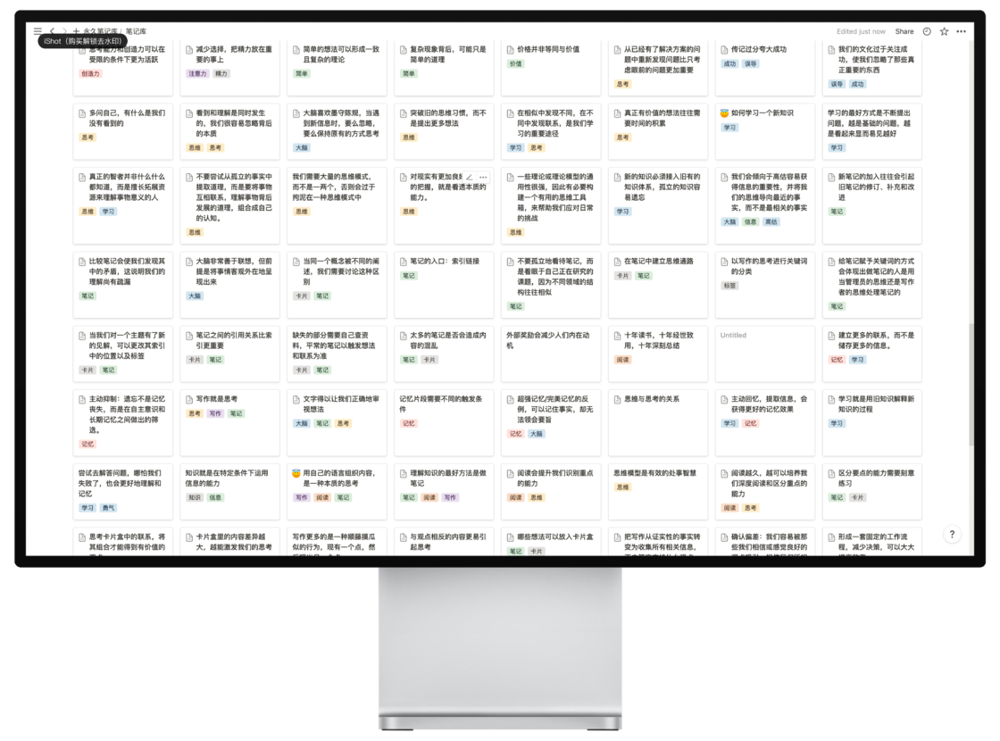
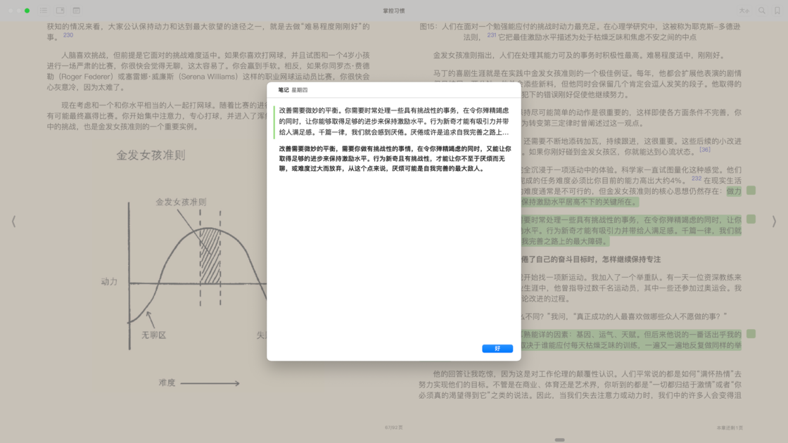
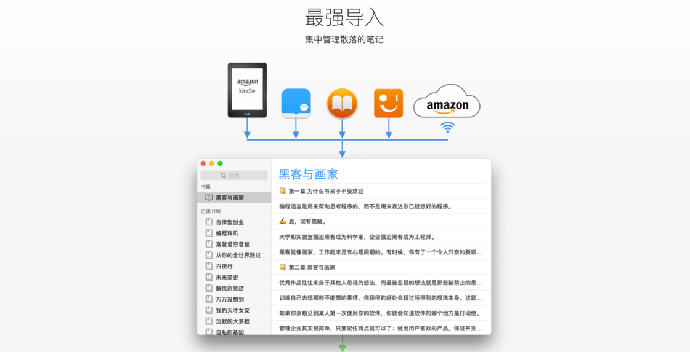
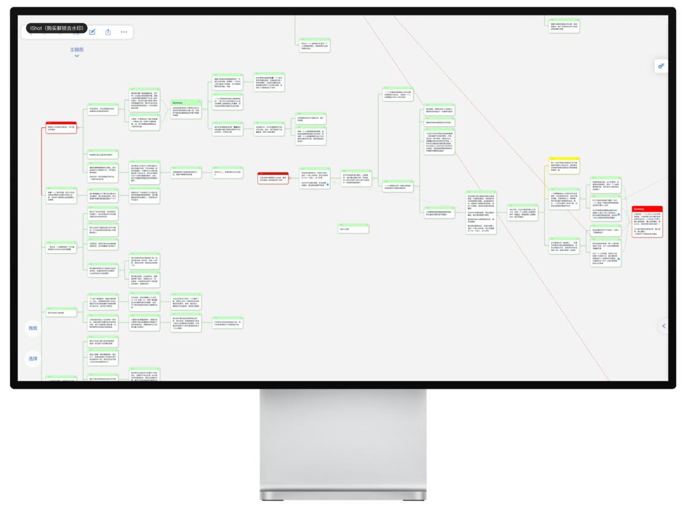

# 从阅读到输出，我是如何用数字工具完成这一切的 - 少数派

**Matrix 首页推荐** 

[Matrix](https://sspai.com/matrix) 是少数派的写作社区，我们主张分享真实的产品体验，有实用价值的经验与思考。我们会不定期挑选 Matrix 最优质的文章，展示来自用户的最真实的体验和观点。

文章代表作者个人观点，少数派仅对标题和排版略作修改。

- - -

进入信息时代，大多数人的阅读习惯已经从纸媒转向了数字媒体。然而，如何运用现代化的工具消化其中的知识，甚至用来输出，一直是新时代的读书人绕不开的问题。

今天，我想为你介绍我的阅读工具合集。目前为止，这套阅读流程已经累计帮助我输出了十万余字的读书笔记和文章，对知识的理解和运用大幅度提高，还为我的简历增色不少，意外获得一份还不错的工作机会。

卡片式笔记

如果你也有关于阅读的困惑或疑问，这篇文章或许会对你有帮助。需要注意的是，这是一套针对 macOS 的电子书阅读流程，包含从挑选图书到输出内容的全过程，字数为 4500 字左右，预计阅读时间 8 分钟。

## **需要用到的工具集合：**

-   系统：macOS
-   首次阅读：图书 app
-   二次阅读： MarginNote 3
-   笔记 app ：Notion（做永久笔记）、Klib（将图书 app 的笔记汇总）、flomo（文献笔记）

## **一、选择合适的书籍**

感觉肚子里没墨水？第一步自然是找到墨水的原料——书籍。无论是思考还是输出，我们都需要先找到对自己有益的书籍，只有经历了优质信息的浸染，我们才会产生出自己的独特想法。找到自己感兴趣书单的方法大致有以下几类：

-   以你喜欢的书籍为准，去豆瓣或者「微信读书」搜索相关的书籍名字，在底下的评论区或者「猜你喜欢」往往会有同类书籍推荐。

搜索书名，以《掌控习惯》为例

底下的推荐书单

-   出版社或某些读书 up 主推荐的书籍。我自己就关注了「中信出版社」的媒体账号，有很多不错的书单都是从这里获得的。
-   某些历史名人的推荐书目，爱默生有一句名言，「如果我们遇到一个才华横溢的人，我们应该问他读什么书。」如果一本书改变了一个人的生活——不管是什么主题或风格——那么这本书可能是值得阅读的。如果它改变了你敬佩的人，那它至少可能会帮助你。
-   被他人多次引用或提及的书籍。

电子书的获取方式，一般在正版书籍中都会附赠，或通过其他方式下载，这里不做介绍。因为习惯使用图书 app ，我一般会下载 epub 格式的电子书，以获得最佳的阅读体验。

## **二、阅读与笔记，让书本属于你**

在阅读过程中，我会将自己有想法或者觉得尚未理解的地方，用自己的话复述一遍。也就是「费曼学习法」的读书实践：

1.  列出一个概念，及其基本的知识；
2.  把概念讲给他人听，不能用任何专有名词，要求大学新生也能听懂；
3.  卡壳的地方重新回去搜索；
4.  重新解释概念，简化并挑出重点，使用类比的方法解释；要求是能让一个新手在听完你的解释后理解这个概念。

如果我们身边没有其他人，就**用自己的语言将笔记写在原文下**。「图书」 app 自带的笔记功能虽然孱弱，但是完全够用。写下你的理解，如果中途卡壳，可以看一下原文，然后从头开始继续写。

用自己的话默写一遍知识

每到卡壳的地方就看一下原文，直到自己可以完整复述出来为止。运用这个办法，可以迅速检验我们是否理解了文本内容，防止机械僵化的形式主义。

坚持卡片笔记写作法的卢曼教授认为：

> 不写作，就无法思考。
> 
> 无论是明确的还是隐含在概念中的想法，人们必须以某种方式标记差异，跟踪区别。只有当这些联系被固定在外部时，它们才能被讨论，为进一步的思考赋予意义。

运用这种方法，相当于每次笔记都是一次微写作的过程，你可以借此机会锻炼自己的文笔，并检验对文本内容的理解程度，是一项十分简单好用的阅读技巧。《如何阅读一本书》的作者在章节「如何让一本书真正属于你自己」中提到：

> “阅读，如果是主动的，就是一种思考，而思考倾向于用语言表达出来——不管是用讲的还是写的。一个人如果说他知道他在想些什么，却说不出来，通常是他其实并不知道自己在想些什么。”

要让一本书属于自己，必须在阅读的过程中不断提出问题。而当你对书本的内容还不甚理解时，这种方式可以让你将重点放在文本和句义上，汇聚更多思考。同时还能防止你打瞌睡，一举两得。

在记笔记的过程中，我会用不同颜色的笔记表示不同的意义：绿色表示主要知识点，黄色表示疑问，蓝色表示一些素材或分支知识，红色表示重要知识点；一般来说，阅读 app 至少会提供 4 种颜色加以区分，在所有的电子书笔记 app 中，我都是运用这一套颜色逻辑，帮助自己更方便地标记知识点，为之后的温习作打算。

不同颜色的标注

## **三、整理永久笔记，固化知识**

运用上述方法后，通常会有厚厚的一沓笔记等待处理。我们需要将这些笔记复制出来粘贴到我们的主力笔记软件中。

Klib 同步的图书笔记

在这里我用的是书摘管理工具 Klib ，它不仅能将所有的笔记内容以 markdown 的格式一次性提取出来，还能锁定每个笔记在书中的原始位置，大大方便了我进行上下文的回顾，而且支持 Kindle、Apple Books 和微信读书这几个我常用的读书 app ，几乎能满足我的所有电子阅读需求。

官网介绍

在阅读流程中，我通常是用 Klib 一键复制到 Notion 中，然后新开一个页面，左右对照着开始做永久笔记。

分屏做笔记

如果对某个知识点有疑问，就可以用原文迅速在图书 app 中锁定位置，翻查上下文信息，回顾知识点，十分方便。

一键点击跳转

在这里简要介绍一下我用 Notion 做永久笔记包含的几个关键信息：

-   标签：用来区分笔记的主题
-   关联文献笔记：用来记录原文出处，即文献笔记
-   关联笔记：链接有关联信息的永久笔记
-   参考信息：书籍或文章链接
-   关键词：当需要用到该笔记时，方便搜索的关键字

通常，如果是一本难度和理解曲线平滑的书籍，做到前 3 步就已经足够了，但如果你有更高的阅读和理解需求，让知识形成条理和体系，第 4 个步骤就是不可或缺的。

## **四、制作结构笔记，让知识形成体系**

到了这一步，通常意味着书的体量或信息密度到了一个空前的高度，不借助结构化的笔记，很难消化知识，成为一个系统。在这里，我们可以借助读书笔记中有「瑞士军刀」之称的 MarginNote 3（下文简称为 MN），对一些难啃的书籍做系统化的拆分，真正实现「把书读薄」。

在「访达」的「下载文件」中找到对应书籍，选择「打开方式」—— MarginNote 3 ，桌面端的 MN 个人感觉一直不是很好用，我一般是在 iPad 端完成这一步骤的。

MN 的使用方法在我派也有详细的讲解，具体可看[这篇文章](https://sspai.com/post/47317#!)。虽然使用 MN 具有一定的学习门槛，但聚焦在一些常用的高频动作上，如划线、笔记、拖拽「成为子节点」或「独立节点」上就已经完全足够，可以覆盖日常 90% 以上的功能，其他功能都可看作是对某些特殊状态的补充，在日后碰到需要时，再翻看使用手册即可。

使用 MaginNote3 制作的思维导图笔记

主要难点就是需要判断，新知识点与旧有知识是具有逻辑的递进关系，还是同级别的并列关系。一个简单的判断方法，就是不借助旧知识点，看新知识是否能够独立存在，如果能，则是并列关系；不能则表明是递进关系。

在 MN 中我会用步骤 2 中相同的颜色逻辑，将一些重要段落勾画出来。对比图书 app ，MN 中的颜色功能一目了然，更容易看到那些重要的知识点在结构树中的作用，以及它们在整个知识体系中所属的位置。

借助 MN 强大的卡片笔记功能，只需要点击对应的卡片笔记就可以轻松锁定原文位置，方便快速回忆，有什么新的发现或想法可以及时修改笔记，或者构建链接，让知识闭环，形成通路。

点击卡片快速定位原文

在做结构笔记的过程中，也就是第 2 次阅读书籍的时候，往往会有很多意想不到的收获。很多开头或初次阅读难以理解的片段，在第二次阅读时会清晰很多，对知识的进一步理解不仅仅加深了记忆点，也加深了对知识的内化程度。

## **为什么需要做两种笔记**

要回答这个问题，首先要回答卡片式笔记和结构式笔记有什么不同。

简单来说，卡片式笔记方便输出知识，结构式笔记方便记录和消化知识，二者的目的不同。为了输出文章，将自己理解的知识进行新一轮的归纳和总结，我会选择卡片式笔记，方便找到不同知识点之间的联系，将过去的知识打通。

卡片式笔记适合寻找关联，是最好的输出手段

而对于一些更加复杂和系统化的领域，卡片式笔记就不能满足我的要求了，例如经济学、心理学或者哲学领域，对于这类结构化的知识，我更习惯于用结构式的笔记列出大纲。这就像是在庞大的知识宫殿中找到一张地图，借此索引自身的位置，并寻求下一个相关的讯息，如果没有形成这种结构化的思维，在输出相关文章，或是回忆对应的知识结构时会十分茫然。

结构化的笔记适合建立体系，形成系统

因为「图书」app 和 MN 都支持 epub 格式，在「图书」app 内做完笔记后，可以无缝衔接到 MN 中做二次的结构笔记。《如何阅读一本书》的作者提到笔记的 2 种形式——概念笔记和结构笔记。概念笔记就是对知识的关联、反思和理解，可以简化为对一个点的理解；而结构笔记着重于梳理整本书的结构，发现不同内容之间的关系，也就是对整个知识面的理解。

在阅读中，概念笔记让我深入了解知识，结构笔记则让我理解不同知识点之间的关联和从属关系。我结合两者的优缺点，采用了目前这套做笔记的方式。大部分 Notion 中的知识点是为了输出文章，如果涉及的其他系统化的知识则会进行二次笔记，也就是结构式笔记，在二次阅读的过程中，梳理整本书的结构，从点到线，看到面与面之间的联系，也给我带来了很多不同的收获。

## **对流程的评价**

整个流程的好处在于成本很低，大部分软件均为免费或买断，哪怕是需要付费的 Klib 也有 10 本书的免费额度，非常适合学生党以及初入工作不久的年轻人。

通过电子书的方式，不仅可以大大降低我们的筛选成本，还能提供一种简单易行的方式进行浏览和试读，最大程度上满足我们的阅读深度和广度，减少沉没成本。

用电子笔记的方式记录，还方便我们对相应的内容做系统性的回顾，进行增删修改。之前在纸质书上，我总是很难手写笔记，一般都是找到对应的电子版本，然后在 MN 中用键盘完成。

当然，就阅读观感来说，我认为系统原生的「图书」app 提供的字体跟背景是最舒适的，因此首次阅读都是放在「图书」 app 内完成，如果你并不介意这点，完全可以在 MN 中获得更加完整的体验。

## **写在最后**

如果你是一个阅读新手，大可不必被上述的阅读步骤和工具劝退。更重要的是培养阅读兴趣，等你对阅读有了更高的要求，再回看此文不迟。

当然，不是所有的书都需要反复阅读。真正值得我们细读、反复读的好书其实并不多。大部分都是我在阅读后觉得有很多价值，且逻辑结构比较复杂的书籍，才会进行这两类笔记的汇总。

毕竟两种笔记做下来，要花费的时间也不少。在电脑上习惯用各种数字工具做笔记后，我就很难再用纸笔的方式去做书面笔记，但是我个人还是很喜欢纸质书的阅读沉浸感。于是，我个人的解决方案就是看纸质版的书，用电子版本做笔记，虽然一来一去有点麻烦，但保持了做笔记的动力和连贯性。

在阅读的早期阶段，我跟所有人一样，追求阅读页数的快感，恨不得几分钟量子速读完一本书，享受一种虚构起来的努力感和满足感。

但这是徒劳的，人无法欺骗自己，面对读完一本书后空空的头脑，只会引发更多的焦虑，于是机械重复地再去速读另一本书，毫无意义。

恰恰需要将书读得慢些，越慢越好，随时将自己阅读的想法记录下来，去构思，去联想，去将信息联系起来。2 个小时下来我往往只能看几页书，但上面却遍布着我的思考和联系，这几页纸比我之前读完一整本书的信息量都多。

所以在这个体系中我渐渐明白了另一个道理，**慢即是快**。很多看起来能速成的东西，其实并不合适，一步一个脚印才能走的更加长远。

以上就是我的全部阅读流程，十分感谢你看到这里，毕竟这实在不是一篇轻松舒适的文章，能看到这里，说明你已经比常人拥有更加可贵的耐心和品质，相信也一定能沉下心来，吸收书里的知识。

祝你阅读愉快。

\> 关注 [少数派公众号](https://sspai.com/s/J71e)，解锁全新阅读体验 📰

\> 实用、好用的 [正版软件](https://sspai.com/mall)，少数派为你呈现 🚀
