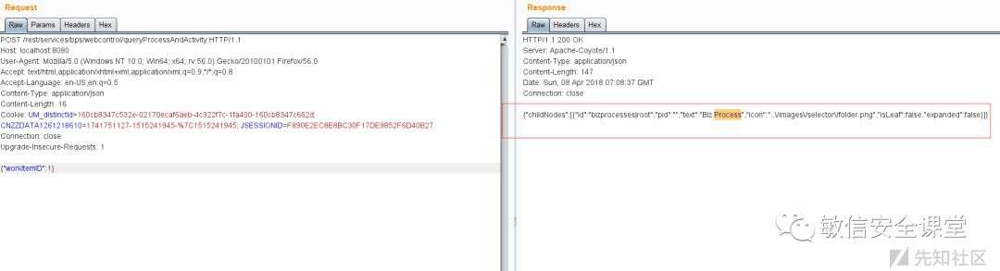
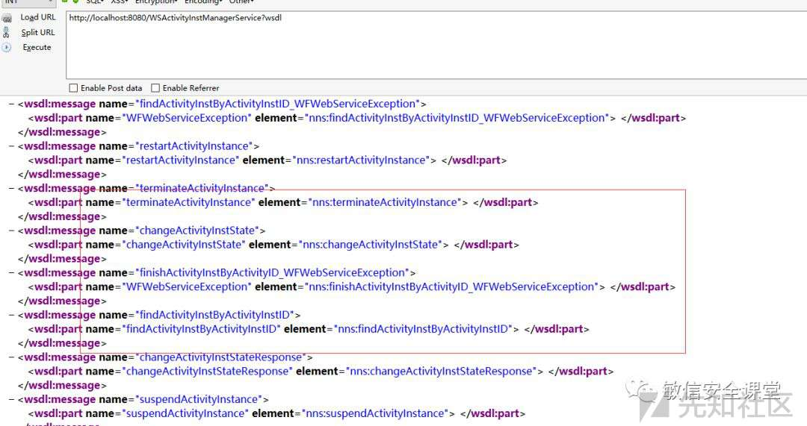
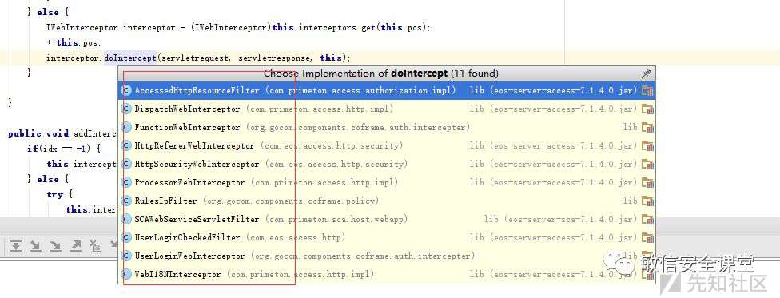
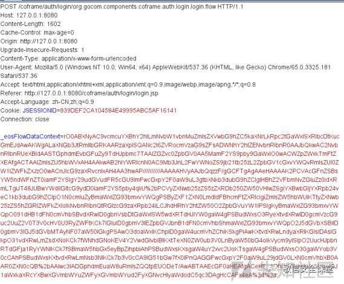
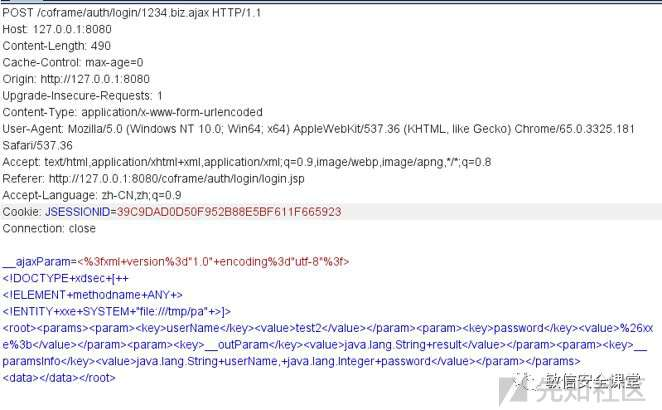
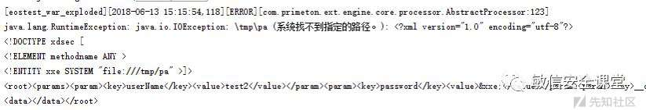

代码审计系列之EOS开发框架

- - -

# 代码审计系列之EOS开发框架

## EOS框架简介

Primeton EOS（Entriprise Operation System），以下简称EOS，是基于J2EE平台、采用面向构件技术实现企业级应用开发、运行、管理、监控、维护的中间件平台。EOS6是普元公司推出的基于SOA架构，支持SCA1.0、SDO2.1规范的新一代EOS产品。基于EOS6开发的应用具备符合国际标准，易于扩展，易于集成的特性。

参考链接：[http://www.primeton.com/products/ep/overview.php](http://www.primeton.com/products/ep/overview.php)

## 前言

今天要说的是一个通用型的开发框架，涉及领域比较宽泛，不讲解漏洞，只讲解整个框架的调用流程

## 默认配置&&安全

根据官网给出来的默认配置如下web.xml

```plain
<?xml version="1.0" encoding="UTF-8" standalone="no"?>
<web-app xmlns="http://java.sun.com/xml/ns/j2ee" xmlns:xsi="http://www.w3.org/2001/XMLSchema-instance"
         id="defaultWebApp"
         version="2.4"
         xsi:schemaLocation="http://java.sun.com/xml/ns/j2ee http://java.sun.com/xml/ns/j2ee/web-app_2_4.xsd">
    <context-param>
        <param-name>rest.config.locations</param-name>
        <param-value>
            classpath*:META-INF/services/restconfig.properties
        </param-value>
    </context-param>
    <context-param>
        <param-name>resteasy.injector.factory</param-name>
        <param-value>com.primeton.components.rest.extend.JSONInjectorFactoryImpl</param-value>
    </context-param>
    <filter>
        <filter-name>InterceptorFilter</filter-name>
        <filter-class>com.eos.access.http.InterceptorFilter</filter-class>
    </filter>
    <listener>
        <listener-class>com.primeton.sca.host.webapp.SCAWebServiceServletListener</listener-class>
    </listener>
    <listener>
        <listener-class>com.primeton.ext.runtime.core.RuntimeJ2EEHost</listener-class>
    </listener>
    <listener>
        <listener-class>com.primeton.engine.core.impl.process.SessionListener</listener-class>
    </listener>
    <listener>
        <listener-class>com.eos.access.http.UserObjectSessionListener</listener-class>
    </listener>
    <filter-mapping>
        <filter-name>InterceptorFilter</filter-name>
        <url-pattern>/*</url-pattern>
        <dispatcher>FORWARD</dispatcher>
        <dispatcher>REQUEST</dispatcher>
        <dispatcher>INCLUDE</dispatcher>
    </filter-mapping>
    <servlet>
        <servlet-name>ControllerServlet</servlet-name>
        <servlet-class>
            com.eos.access.http.ControllerServlet
        </servlet-class>
        <load-on-startup>10</load-on-startup>
    </servlet>
    <servlet-mapping>
        <servlet-name>ControllerServlet</servlet-name>
        <url-pattern>/WSActivityInstManagerService</url-pattern>
    </servlet-mapping>
    ......
    <servlet-mapping>
        <servlet-name>ControllerServlet</servlet-name>
        <url-pattern>/WSWorklistQueryManagerService</url-pattern>
    </servlet-mapping>
    <servlet-mapping>
        <servlet-name>ControllerServlet</servlet-name>
        <url-pattern>*.flow</url-pattern>
    </servlet-mapping>
    <servlet-mapping>
        <servlet-name>ControllerServlet</servlet-name>
        <url-pattern>*.flowx</url-pattern>
    </servlet-mapping>
    <servlet-mapping>
        <servlet-name>ControllerServlet</servlet-name>
        <url-pattern>*.gzip</url-pattern>
    </servlet-mapping>
    <servlet-mapping>
        <servlet-name>ControllerServlet</servlet-name>
        <url-pattern>*.ajax</url-pattern>
    </servlet-mapping>
    <servlet-mapping>
        <servlet-name>ControllerServlet</servlet-name>
        <url-pattern>*.beanx</url-pattern>
    </servlet-mapping>
    <servlet-mapping>
        <servlet-name>ControllerServlet</servlet-name>
        <url-pattern>*.debug</url-pattern>
    </servlet-mapping>
    <servlet-mapping>
        <servlet-name>ControllerServlet</servlet-name>
        <url-pattern>/common.remote</url-pattern>
    </servlet-mapping>
    <servlet-mapping>
        <servlet-name>ControllerServlet</servlet-name>
        <url-pattern>*.precompile</url-pattern>
    </servlet-mapping>
    <servlet-mapping>
        <servlet-name>ControllerServlet</servlet-name>
        <url-pattern>*.ext</url-pattern>
    </servlet-mapping>
    <servlet-mapping>
        <servlet-name>ControllerServlet</servlet-name>
        <url-pattern>*.terminate</url-pattern>
    </servlet-mapping>
    <servlet>
        <servlet-name>resteasyservlet</servlet-name>
        <servlet-class>
            com.primeton.components.rest.extend.CustomHttpServletDispatcher
        </servlet-class>
    </servlet>
    <servlet-mapping>
        <servlet-name>resteasyservlet</servlet-name>
        <url-pattern>/rest/services/*</url-pattern>
    </servlet-mapping>
    <session-config>
        <session-timeout>30</session-timeout>
    </session-config>
    <welcome-file-list>
        <welcome-file>index.jsp</welcome-file>
        <welcome-file>coframe/index.jsp</welcome-file>
    </welcome-file-list>
    <mime-mapping>
        <extension>xml</extension>
        <mime-type>application/xml</mime-type>
    </mime-mapping>
    <mime-mapping>
        <extension>war</extension>
        <mime-type>application/zip</mime-type>
    </mime-mapping>
    <mime-mapping>
        <extension>ear</extension>
        <mime-type>application/zip</mime-type>
    </mime-mapping>
    <mime-mapping>
        <extension>zip</extension>
        <mime-type>application/zip</mime-type>
    </mime-mapping>
    <error-page>
        <error-code>404</error-code>
        <location>/common/notFound.jsp</location>
    </error-page>
    <!--
    <jsp-config>
    <jsp-property-group>
    <url-pattern>*.jsp</url-pattern>
    <page-encoding>UTF-8</page-encoding>
    </jsp-property-group>
    </jsp-config>
    -->
</web-app>
```

上面的配置效果，再加上程序开发者的拿来主义习惯，可能会造成以下2个问题

1.  webservice接口泄露
2.  rest接口泄露

rest接口是通过一个配置文件映射（restconfig.properties）：

```plain
resteasy.resources=com.primeton.bps.web.control.restful.WebControlRestService

@Path("/rest/services/bps/webcontrol")
@Consumes({"application/json", "application/x-www-form-urlencoded"})
@Produces({"application/json"})
public class WebControlRestService {
    public WebControlRestService() {
    }

    @POST
    @Path("/queryParticipants")
    public Map<String, Object> queryParticipants(HashMap<String, Object> mapObject) throws WFServiceException, JSONException {

        HashMap resultMap = new HashMap();
        String nodeBody = String.valueOf(getJsonFromMap(mapObject));
        DataObject node = (DataObject) changeToDataObject("node", nodeBody, Boolean.valueOf(true));
        DataObject otherParamObj = (DataObject) changeToDataObject("otherParamObj", nodeBody, Boolean.valueOf(true));
        resultMap.put("childNodes", ServiceUtil.queryParticipants(node, otherParamObj))
        return resultMap;
    }

    @POST
    @Path("/searchParticipants")
    public Map<String, Object> searchParticipants(HashMap<String, Object> mapObject) throws WFServiceException {

        HashMap resultMap = new HashMap();
        String name = String.valueOf(mapObject.get("name"));
        Map extData = (Map) mapObject.get("extData");
        PageCond page = (PageCond) mapObject.get("page");
        resultMap.put("childNodes", ServiceUtil.searchParticipants(name, extData, page)
        return resultMap;
    }
..................
..................
```

调用方式参数通过json传递

```plain
POST /rest/services/bps/webcontrol/queryProcessAndActivity HTTP/1.1
Host: localhost: 8080
User-Agent: Mozilla/5.0 (Windows NT 10.0; Win64; x64; rv:56.0) Gecko/ 20100101 Firefox/56.
Accept: text/html,application/xhtml+xml,application/xml;q=0.9,*/*;q=0.
Accept-Language: en-US,en;q=0.
Content-Type: application/json
Content-Length: 16
Cookie: 
Connection: close
Upgrade-Insecure-Requests: 1

{"workItemID":1}
```

[](https://xzfile.aliyuncs.com/media/upload/picture/20240119165151-fd2a3c98-b6a7-1.jpg)

webservice接口就相对简单了这里总共有十处

```plain
<servlet-mapping>
        <servlet-name>ControllerServlet</servlet-name>
        <url-pattern>/WSActivityInstManagerService</url-pattern>
    </servlet-mapping>
    <servlet-mapping>
        <servlet-name>ControllerServlet</servlet-name>
        <url-pattern>/WSAgentManagerService</url-pattern>
    </servlet-mapping>
    <servlet-mapping>
        <servlet-name>ControllerServlet</servlet-name>
        <url-pattern>/WSAppointActivityManagerService</url-pattern>
    </servlet-mapping>
    <servlet-mapping>
        <servlet-name>ControllerServlet</servlet-name>
        <url-pattern>/WSBackActivityManagerService</url-pattern>
    </servlet-mapping>
    <servlet-mapping>
        <servlet-name>ControllerServlet</servlet-name>
        <url-pattern>/WSDefinitionQueryManagerService</url-pattern>
    </servlet-mapping>
    <servlet-mapping>
        <servlet-name>ControllerServlet</servlet-name>
        <url-pattern>/WSDelegateManagerService</url-pattern>
    </servlet-mapping>
    <servlet-mapping>
        <servlet-name>ControllerServlet</servlet-name>
        <url-pattern>/WSFreeFlowManagerService</url-pattern>
    </servlet-mapping>
    <servlet-mapping>
        <servlet-name>ControllerServlet</servlet-name>
        <url-pattern>/WSProcessInstManagerService</url-pattern>
    </servlet-mapping>
    <servlet-mapping>
        <servlet-name>ControllerServlet</servlet-name>
        <url-pattern>/WSRelativeDataManagerService</url-pattern>
    </servlet-mapping>
    <servlet-mapping>
        <servlet-name>ControllerServlet</servlet-name>
        <url-pattern>/WSWorkItemDrawbackManagerService</url-pattern>
    </servlet-mapping>
    <servlet-mapping>
        <servlet-name>ControllerServlet</servlet-name>
        <url-pattern>/WSWorkItemManagerService</url-pattern>
    </servlet-mapping>
     <servlet-mapping>
        <servlet-name>ControllerServlet</servlet-name>
        <url-pattern>/WSWorklistQueryManagerService</url-pattern>
    </servlet-mapping>
```

调用方式可以通过wsdl进行解析

访问[http://localhost:8080/WSActivityInstManagerService?wsdl](http://localhost:8080/WSActivityInstManagerService?wsdl)

[](https://xzfile.aliyuncs.com/media/upload/picture/20240119165204-04ecb366-b6a8-1.jpg)

注意：EOS框架整体上来讲都是需要授权登陆的，只有这两个接口调用方式不需要授权，webservice通过ControllerServlet进行映射，这里一章节放到框架讲解里面

## EOS框架讲解

整个框架通过拦截器com.eos.access.http.InterceptorFilter和com.eos.access.http.ControllerServlet来实现的

#### 拦截器的调用流程

初始化子拦截器

```plain
public void init(FilterConfig arg0) throws ServletException {
        this.init();
    }

    public void init() {
        logger.info("init InterceptorFilter.");
        Map processors = RequstProcessors.INSTANCE.getAllProcessors();
        Iterator e = processors.entrySet().iterator();
        while (e.hasNext()) {
            Entry interceptors = (Entry) e.next();
            WebInterceptorConfig i$ = new WebInterceptorConfig();
            i$.setFilterId("ProcessorInterceptor_" + (String) interceptors.getKey());
            i$.setSortIdx(2147483647);
            i$.setPattern((String) interceptors.getKey());
            i$.setClassName(ProcessorWebInterceptor.class.getName());
            WebInterceptorManager.INSTANCE.addInterceptorConfig(i$);
            ProcessorWebInterceptor interceptor = (ProcessorWebInterceptor) WebInterceptorManager.INSTANCE.getInterceptor("ProcessorInterceptor_" + (String) interceptors.getKey())
            if (interceptor != null) {
                interceptor.setProcessor((IProcessor) interceptors.getValue());
            }
        }
        try {
            Field e1 = ClassUtil.getField(WebInterceptorManager.class, "interceptors");
            e1.setAccessible(true);
            List interceptors1 = (List) e1.get(WebInterceptorManager.INSTANCE);
            Iterator i$1 = interceptors1.iterator();
            while (i$1.hasNext()) {
                IWebInterceptor interceptor1 = (IWebInterceptor) i$1.next();
                if (interceptor1 instanceof ILifeCycleWebInterceptor) {
                    try {
                        ((ILifeCycleWebInterceptor) interceptor1).init();
                    } catch (Throwable var7) {
                        logger.error(var7);
                    }
                }
            }
        } catch (Throwable var8) {
            logger.error(var8);
        }
    }
```

里面两次初始化了调用链对象

第一层：

```plain
Map processors = RequstProcessors.INSTANCE.getAllProcessors();
```

跟进代码分析：

```plain
public static final RequstProcessors INSTANCE = new RequstProcessors();

    private RequstProcessors() {
        File configDir = new File(ApplicationContext.getInstance().getApplicationConfigPath());
        HandlerRegistry processorRegistry = HandlerRegistry.load(RequstProcessors.class.getClassLoader, configDir, "handler-processor.xml", IProcessor.class, "handler", "id", "class", "sortIdx", 0.false);
        Iterator i$ = processorRegistry.getEffectiveHandlerModels().iterator();
        while (i$.hasNext()) {
            HandlerModel model = (HandlerModel) i$.next();
            Element handlerElement = model.getHandlerElement();
            String suffix = handlerElement.getAttribute("suffix");
            String processorClassName = handlerElement.getAttribute("class");
            StringTokenizer stk = new StringTokenizer(suffix, ",");
            try {
                while (stk.hasMoreElements()) {
                    String e = stk.nextToken();
                    IProcessor processor = (IProcessor) Class.forName(processorClassName).newInstance();
                    processor.setRequestSuffix(e);
                    logger.info("the url suffix with [" + e + "] will be processed by [" + processorClassName + "].");
                    this.requestProcessors.put(e, processor);
                }
            } catch (Throwable var11) {
                logger.error("create processor instance fail!", var11);
            }
        }
    }
```

这里进行了配置文件的解析，并且初始化了配置信息，映射信息来自handler-processor.xml

```plain
<?xml version="1.0" encoding="UTF-8"?>
<handlers>
    <handler id="flowProcessor" suffix=".flow" sortIdx="0"
             class="com.primeton.ext.engine.core.processor.HttpPageFlowProcessor"/>
    <handler id="actionProcessor" suffix=".action" sortIdx="0"
             class="com.primeton.ext.engine.core.processor.ActionProcessor"/>
    <handler id="downloadProcessor" suffix=".download" sortIdx="0"
             class="com.primeton.access.http.impl.processor.DownloadProcessor"/>
    <handler id="downloadConfigProcessor" suffix=".configdownload" sortIdx="0"
             class="com.primeton.access.http.impl.processor.DownloadConfigProcessor"/>
    <handler id="ConfigurationDownloadProcessor" suffix=".governordownload" sortIdx="0"
             class="com.primeton.access.http.impl.processor.GovernorDownloadConfigProcessor"/>
    <handler id="GovernorDownloadConfigurationProcessor" suffix=".governordownload" sortIdx="0"
             class="com.primeton.access.http.impl.processor.GovernorDownloadConfigProcessor"/>   
    <!--    <handler id="ajaxFlowProcessor" suffix=".flow.ajax,.flowx.ajax"      sortIdx="0"        
                  class="com.primeton.ext.engine.core.processor.AjaxPageflowProcessor" />     -->
    <handler id="commonServiceProcessor" suffix=".remote" sortIdx="0"
             class="com.primeton.access.client.impl.processor.CommonServiceProcessor"/>
    <handler id="ajaxBizProcessor" suffix=".biz.ajax" sortIdx="0"
             class="com.primeton.ext.engine.core.processor.AjaxBizProcessor"/>
    ...............
    ...............
```

第二层：

```plain
ProcessorWebInterceptor interceptor = (ProcessorWebInterceptor)WebInterceptorManager.INSTANCE.getInterceptor("ProcessorInterceptor_" + (String)interceptors.getKey());
```

跟进代码进行分析：

```plain
public static final WebInterceptorManager INSTANCE = new WebInterceptorManager();
    private List<WebInterceptorConfig> configs = new ArrayList();
    private List<IWebInterceptor> interceptors = new ArrayList();
    private ReentrantReadWriteLock lock = new ReentrantReadWriteLock(true);

    private WebInterceptorManager() {
        this.readConfigFile();
    }

    private void readConfigFile() {
        File configDir = new File(ApplicationContext.getInstance().getApplicationConfigPath());
        HandlerRegistry inteceptorRegistry = HandlerRegistry.load(WebInterceptorManager.class.getClassLoader(), configDir, "handler-web.xml", IWebInterceptor.class, "handler", "id", "class", "sortIdx", 100, false);
        Iterator i$ = inteceptorRegistry.getEffectiveHandlerModels().iterator();
        while (i$.hasNext()) {
            HandlerModel model = (HandlerModel) i$.next();
            try {
                Element e = model.getHandlerElement();
                String className = e.getAttribute("class");
                String pattern = e.getAttribute("pattern");
                WebInterceptorConfig config = new WebInterceptorConfig();
                config.setFilterId(model.getId());
                config.setClassName(className);
                if (pattern != null && !pattern.equals("")) {
                    config.setPattern(pattern);
                }
                int idx = model.getIndex();
                if (idx < 0) {
                    logger.error("the WebInterceptor\'s sortIdx not allow lower than 0!");
                } else {
                    config.setSortIdx(idx);
                    this.addInterceptorConfig(config);
                }
            } catch (Exception var10) {
                logger.error("the WebInterceptor config has error!", var10);
            }
        }
    }

    public void addInterceptorConfig(WebInterceptorConfig config) {
        this.lock.writeLock().lock();
        try {
            IWebInterceptor interceptor = this.createInterceptor(config.getClassName());
            int idx;
            int willAddPos;
            int i;
            if (config.isDefaultSortIdx()) {
                idx = 0;
                boolean e = false;
                willAddPos = 0;
                for (i = this.configs.size(); willAddPos < i; ++willAddPos) {
                    WebInterceptorConfig length = (WebInterceptorConfig) this.configs.get(willAddPos);
                    if (length.getSortIdx() > idx && !length.isDefaultSortIdx()) {
                        this.configs.add(idx, config);
                        this.interceptors.add(idx, interceptor);
```

在这个类中我们初始化了handler-web.xml里面对应的拦截器，存放在参数this.interceptors里面

```plain
<?xml version="1.0" encoding="UTF-8"?>
<handlers>
    <handler id="WSInterceptor" sortIdx="0" pattern="/*"
             class="com.primeton.sca.host.webapp.SCAWebServiceServletFilter"/>
    <handler id="WebI18NInterceptor" sortIdx="1" pattern="/*" class="com.primeton.access.http.impl.WebI18NInterceptor"/>
    <handler id="HttpSecurityWebInterceptor" sortIdx="2" pattern="*.flow,*.jsp"
             class="com.eos.access.http.security.HttpSecurityWebInterceptor"/>
    <handler id="HttpRefererWebInterceptor" sortIdx="3" pattern="/*"
             class="com.eos.access.http.security.HttpRefererWebInterceptor"/>
    <handler id="UserLoginInterceptor" sortIdx="100" pattern="/*" class="com.eos.access.http.UserLoginCheckedFilter"/>
    <handler id="AccessedResourceInterceptor" sortIdx="101" pattern="/*"
             class="com.primeton.access.authorization.impl.AccessedHttpResourceFilter"/>
</handlers>
```

跟进调用doFilter

```plain
public void doFilter(ServletRequest arg0, ServletResponse arg1, FilterChain filterChain) throws IOException, ServletException {
        HttpServletRequest request = (HttpServletRequest) arg0;
        HttpServletResponse response = (HttpServletResponse) arg1;
        request.setCharacterEncoding(MultipartResolver.getEncoding());
        if (UserLoginCheckedFilter.isPortal() && request.getSession().getAttribute("userObject") == null) {
            IUserObject session = CustomObjectProviderProvider.getProvider().getVirtualUserObject(VirtualUserObjectTypes.PORTAL_USER);
            ((UserObject) session).setUserRemoteIP(HttpHelper.getRemoteAddr(request));
            ((UserObject) session).setSessionId(request.getSession().getId());
            ((UserObject) session).setUniqueId(request.getSession().getId());
            OnlineUserManager.login(session);
            request.getSession().setAttribute("userObject", session);
        } ............... ............... ...............try {
            Throwable e;
            try {
                if (var15 != null) {
                    muo = MUODataContextHelper.create(var15);
                    DataContextManager.current().setMUODataContext(muo);
                }
                WebInterceptorChainImpl var16 = (WebInterceptorChainImpl) WebInterceptorManager.INSTANCE.createChain(request, response);
                var16.setFilterChain(filterChain);
                var16.doIntercept(request, response);
```

这里追踪一下doIntercept方法

```plain
public class WebInterceptorChainImpl implements IWebInterceptorChain {
        private List<IWebInterceptor> interceptors = new ArrayList();
        private static final int DEFAULT_IDX = -1;
        private int pos = 0;
        private FilterChain filterChain;

        public WebInterceptorChainImpl() {
        }

        public void doIntercept(HttpServletRequest servletrequest, HttpServletResponse servletresponse) throws IOException, ServletException {
            if (this.pos == this.interceptors.size()) {
                if (this.filterChain != null) {
                    this.filterChain.doFilter(servletrequest, servletresponse);
                }
            } else {
                IWebInterceptor interceptor = (IWebInterceptor) this.interceptors.get(this.pos);
                ++this.pos;
                interceptor.doIntercept(servletrequest, servletresponse, this);
            }
        }
```

从最后一句可以看出来，不管任何一个请求，都要遍历两个映射文件对应的拦截器的doIntercept

[](https://xzfile.aliyuncs.com/media/upload/picture/20240119165226-11c0bf10-b6a8-1.jpg)

上面是一个整体的调用逻辑，说明一下这几个filter的作用

1.  WSInterceptor webservice的请求路由
2.  WebI18NInterceptor
3.  HttpSecurityWebInterceptor 整体的框架路由
4.  HttpRefererWebInterceptor referer检查
5.  UserLoginInterceptor 登陆检查
6.  AccessedResourceInterceptor 资源的访问权限检查

webservice直接forward到了axis2请求上的

```plain
public void doIntercept(HttpServletRequest request, HttpServletResponse response, IWebInterceptorChain chain) throws IOException, ServletException {        ..........        ..........
        ..........
        ..........
        RequestDispatcher dispatcher = WebAppServletHost.getInstance().getRequestDispatcher(path);
        if (dispatcher != null) {
            String url = request.getRequestURL().toString();
            String serviceName;
            try {
                URI contextPath = new URI(url);
                serviceName = contextPath.getHost();
                String e = this.getIpAddress();
                url = url.replaceAll(serviceName, e);
            } catch (URISyntaxException var14) {
                ;
            }
            String contextPath1 = request.getContextPath();
            if (StringUtils.isEmpty(contextPath1)) {
                serviceName = this.getServiceName(url);
            } else {
                serviceName = this.getServiceName(contextPath1, url);
            }
            try {
                IDataObjectType e1 = DataObjectTypeFactory.createDataObjectType();
                String servicePath = AegisFileCache.getFilePath(serviceName);
                Class clazz = WebServiceMapping.getServiceClass(serviceName);
                DefinitionFactory.createDefinition(serviceName, servicePath, clazz, url, e1);
            } catch (Exception var13) {
                var13.printStackTrace();
            }
            dispatcher.forward(request, response);
```

整体的框架调用基本上分析完了，接下来就是业务层的东西，重点看handler-processor.xml

```plain
<handler id="flowProcessor" suffix=".flow" sortIdx="0"        class="com.primeton.ext.engine.core.processor.HttpPageFlowProcessor" />


public class HttpPageFlowProcessor extends AbstractPageFlowProcessor {
        public HttpPageFlowProcessor() {
        }

        public IParameterSet createParameterSet(HttpServletRequest request, HttpServletResponse response) {
            return ParameterBuilder.createHttpParamSet(request);
        }
    }
```

分析父类解析参数规则：

```plain
public abstract class AbstractPageFlowProcessor extends AbstractProcessor {
        private static final Logger logger = TraceLoggerFactory.getLogger(AbstractPageFlowProcessor.class);
        public static final String CACHE_EOS_PAGEFLOW = "_eosFlowCache";
        public static final String EOS_PAGEFLOW_KEY = "_eosFlowKey";
        public static final String EOS_PAGEFLOW_ACTION = "_eosFlowAction";
        public static final String EOS_PAGEFLOW_AJAX = "_eosAjax";
        public static final String EOS_CURRENT_PAGEFLOW_INSTANCE = "_eosCurrentInstanceID";
        public static final String EOS_PARENT_PAGEFLOW_INSTANCE = "_eosParentInstanceID";
        public static final String EOS_PAGEFLOW_DATACONTEXT = "_eosFlowDataContext";
        public static final String EOS_REQUEST_DATACONTEXT = "_eosRequestDataContext";
        private static final List<String> innerVariables = new ArrayList();

        public AbstractPageFlowProcessor() {
        }

        public void process(HttpServletRequest request, HttpServletResponse response) throws IOException, ServletException {
            try {
                HttpServletRequest e = MultipartResolverFactory.getMultipartResolver().resolveMultipart(request);
                HttpMapContextFactory config1 = new HttpMapContextFactory(e, response);
                DataContextManager.current().setMapContextFactory(config1);
                this.doProcess(e, response, (IParameterSet) null);
```

继续跟进这里面的doProcess

```plain
public abstract class AbstractPageFlowProcessor extends AbstractProcessor {
        .....
        public void process(HttpServletRequest request, HttpServletResponse response) throws IOException, ServletException {
            try {
                .....
                this.doProcess(e, response, (IParameterSet) null);
            } catch (Throwable var7) {
            .....
            }
        }

        public void doProcess(HttpServletRequest request, HttpServletResponse response, IParameterSet parameterSetA) throws IOException, ServletException {
            .....
            try {
                .....
                Object var35 = request.getAttribute("_eosRequestDataContext");
                if (var35 != null && var35 instanceof PageflowRuntimeContext) {
                    .....
                    .....
                    if (!this.hasUserDataConvert(pageFlowInstance, var32.getStateName(), current_error_uri, this.getRequestedFlowID(request))) {
                        IParameterSet var42 = this.createParameterSet(request, response);
                        IVariable[] var44 = this.moveInnerParams((IVariable[]) var38);
                        var42.build(var44, context);
```

build函数里面对参数\_eosRequestDataContext进行了解析：

```plain
public void build(IVariable[] vars, IDataContext context) {
        Map serverTypeMapping = this.getTypeMapping(vars);
        IVariable _eosFlowKey;
        Class _eosFlowDataContext;
        for (int customerTypeMapping = 0; customerTypeMapping < this.customVars.size(); ++customerTypeMapping) {
            IVariable typeMapping = (IVariable) this.customVars.get(customerTypeMapping);
            String varsMap = typeMapping.getName();
            _eosFlowKey = this.getDefinedVariable(varsMap, vars);
            if (_eosFlowKey != null) {
                _eosFlowDataContext = _eosFlowKey.getTypeClass();
                if (varsMap.equals(_eosFlowKey.getName()) && (_eosFlowKey.isDataObject() || isConcreteClass(_eosFlowDataContext))) {
                    this.customVars.remove(customerTypeMapping);
                    --customerTypeMapping;
                }
            } else {
                this.customVars.remove(customerTypeMapping);
                --customerTypeMapping;
            }
        }
        Map var26 = this.getTypeMapping((IVariable[]) this.customVars.toArray(new IVariable[this.customVars.size()]));
        HashMap var25 = new HashMap(serverTypeMapping);
        var25.putAll(var26);
        context.setTypeMappings(var25);
        HashMap var27 = new HashMap();
        if (vars != null) {
            IVariable[] var28 = vars;
            int var30 = vars.length;
            for (int _eosFlowAction = 0; _eosFlowAction < var30; ++_eosFlowAction) {
                IVariable xpathSorter = var28[_eosFlowAction];
                String fixedMap = xpathSorter.getName();
                var27.put(fixedMap, xpathSorter);
            }
        }
        Iterator var29 = this.customVars.iterator();
        String var34;
        while (var29.hasNext()) {
            IVariable var32 = (IVariable) var29.next();
            var34 = var32.getName();
            var27.put(var34, var32);
        }
        _eosFlowKey = null;
        String var31;
        try {
            var31 = (String) this.values.get("_eosFlowKey");
        } catch (Exception var22) {
            throw new RuntimeException("process _eosFlowKey has exception!", var22);
        }
        _eosFlowDataContext = null;
        String var33;
        try {
            var33 = (String) this.values.get("_eosFlowDataContext");
        } catch (Exception var21) {
            throw new RuntimeException("process _eosFlowDataContext has exception!", var21);
        }
        var34 = null;
        try {
            var34 = (String) this.values.get("_eosFlowAction");
        } catch (Exception var20) {
            throw new RuntimeException("process _eosFlowAction has exception!", var20);
        }
        if (var34 != null && !var34.equals("")) {
            context.set("_eosFlowAction", var34);
        }
        if (var31 != null && !var31.equals("")) {
            context.set("_eosFlowKey", var31);
        }
        Iterator i$;
        Map var37;
        if (var33 != null && !var33.equals("")) {
            try {
                Object var35 = ContextSerializer.deserialize(var33);
```

最终代码逻辑流入了反序列化里面：

```plain
public static Object deserialize(String codedString) throws IOException, ClassNotFoundException {
        BASE64Decoder decoder = new BASE64Decoder();
        byte[] buf = decoder.decodeBuffer(codedString);
        ByteArrayInputStream bais = new ByteArrayInputStream(buf);
        ObjectInputStream oos = new ObjectInputStream(bais);
        Object o = oos.readObject();
        oos.close();
        return o;
    }
```

[](https://xzfile.aliyuncs.com/media/upload/picture/20240119165251-2084e04e-b6a8-1.jpg)

继续跟进分析第二点：

```plain
<handler id="ajaxBizProcessor" suffix=".biz.ajax"        sortIdx="0"        class="com.primeton.ext.engine.core.processor.AjaxBizProcessor" />
```

映射类里面代码逻辑如下：

```plain
public class AjaxBizProcessor extends AbstractBizProcessor {
        public AjaxBizProcessor() {
        }

        public IParameterSet createParameterSet(HttpServletRequest request, HttpServletResponse response) {
            response.setCharacterEncoding("UTF-8");
            return ParameterBuilder.createAjaxParamSet(request);
        }
    }

    public static IParameterSet createAjaxParamSet(HttpServletRequest request) {
        AjaxParameterSet parameterSet = new AjaxParameterSet();
        parameterSet.setRequest(request);
        buildParameterSet(parameterSet);
        return parameterSet;
    }

    private static void buildParameterSet(AbstractParameterSet parameterSet) {
        parameterSet.init();
    }

    public void init() {
        new StringBuffer();
        StringBuffer buffer;
        String e;
        try {
            e = this.request.getParameter("__ajaxParam");
            if (e == null) {
                e = "<root><params></params><data></data></root>";
            }
            buffer = new StringBuffer(URLDecoder.decode(e, "UTF-8"));
        } catch (UnsupportedEncodingException var10) {
            logger.error(var10);
            throw new RuntimeException(var10);
        }
        try {
            if (buffer.toString().trim().equals("")) {
                buffer.append("<root><params></params><data></data></root>");
            }
            e = null;
            String xml = buffer.toString();
            Document var11;
            if (!getXMLHeader(xml).contains("encoding")) {
                String paramNode = MultipartResolver.getEncoding();
                var11 = XmlUtil.parseStringThrowsException(xml, paramNode);
            } else {
                var11 = XmlUtil.parseString(xml);
            }
```

这里进行了xml的解析，没有进行实体的转换

[](https://xzfile.aliyuncs.com/media/upload/picture/20240119165311-2cdfe1ae-b6a8-1.jpg)

根据后台日志信息可以看出来跟我们分析的一样，报错文件找不到，说明xxe执行

[](https://xzfile.aliyuncs.com/media/upload/picture/20240119165328-3710b716-b6a8-1.jpg)

#### 总结

1.  发布网站要避免默认配置保留发布
2.  对于rest定义的接口尽量采用复杂命名，防止由于默认配置导致的接口泄露
3.  禁用xml解析库的实体，如果从第三方库没有禁用标志，可以尝试在filter里面添加
4.  对于反序列化漏洞，升级jdk，或者相关反序列化调用的类库

原文链接：[https://mp.weixin.qq.com/s/4Ejshk7x71L9INB0grj5mw](https://mp.weixin.qq.com/s/4Ejshk7x71L9INB0grj5mw)
