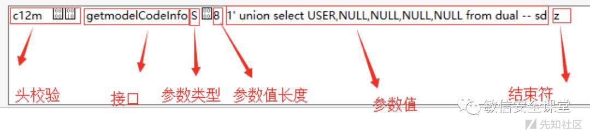
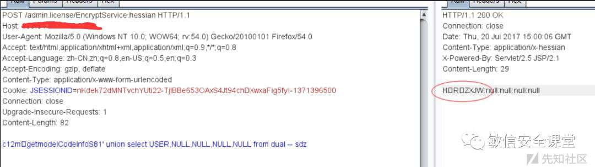
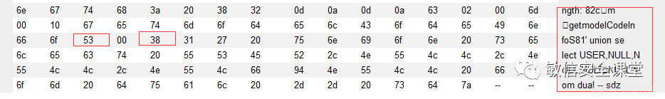
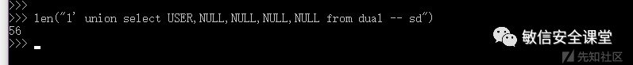

# 代码审计系列之Hessian开发框架

## Hessian框架简介

Hessian是一个轻量级的remoting onhttp工具，使用简单的方法提供了RMI的功能。 相比WebService，Hessian更简单、快捷。采用的是二进制RPC协议，因为采用的是二进制协议，所以它很适合于发送二进制数据。

参考链接：[http://hessian.caucho.com/doc/hessian-overview.xtp](http://hessian.caucho.com/doc/hessian-overview.xtp)

## 前言

很多人做安全服务经常会碰到hessian开发的应用，特别是在app中应用最多，这次通过讲解hessian框架的包结构进一步分解渗透测试的难度，让二进制包的测试变的跟普通的请求包一样简单。

## 框架代码分析

根据官网给出来的默认配置如下web.xml

```plain
<servlet-mapping>
        <servlet-name>HessianSpringInvokeService</servlet-name>
        <url-pattern>/*.hessian</url-pattern>
    </servlet-mapping>
```

跟进分析HessianSpringInvokeService：

```plain
protected void service(HttpServletRequest var1, HttpServletResponse var2) throws ServletException, IOException {
        String var3 = var1.getRequestURI();
        int var4 = var3.lastIndexOf("/");
        if(var4 > 0) {
            var3 = var3.substring(var4 + 1);
        }

        if(!var1.getMethod().equals("POST")) {
            var2.setStatus(500, "Hessian Requires POST");
            PrintWriter var16 = var2.getWriter();
            var2.setContentType("text/html");
            var16.println("<h1>Hessian Requires POST</h1>");
        } else {
            try {
                ServletInputStream var7 = var1.getInputStream();
                ServletOutputStream var8 = var2.getOutputStream();
                var2.setContentType("application/x-hessian");
                int var9 = var7.read();
                int var10;
                int var11;
                Object var12;
                Object var13;
                if(var9 == 72) {
                    var10 = var7.read();
                    var11 = var7.read();
                    if(var10 != 2 || var11 != 0) {
                        throw new IOException("Version " + var10 + "." + var11 + " is not understood");
                    }

                    var12 = this.createHessian2Input(var7);
                    var13 = new Hessian2Output(var8);
                    ((AbstractHessianInput)var12).readCall();
                } else {
                    if(var9 != 99) {
                        throw new IOException("expected \'H\' (Hessian 2.0) or \'c\' (Hessian 1.0) in hessian input at " + var9);
                    }

                    var10 = var7.read();
                    var11 = var7.read();
                    var12 = new HessianInput(var7);
                    if(var10 >= 2) {
                        var13 = new Hessian2Output(var8);
                    } else {
                        var13 = new HessianOutput(var8);
                    }
                }

                SerializerFactory var14 = this.getSerializerFactory();
                ((AbstractHessianInput)var12).setSerializerFactory(var14);
                ((AbstractHessianOutput)var13).setSerializerFactory(var14);
                this.getSkeletonByServiceId(var3).invoke((AbstractHessianInput)var12, (AbstractHessianOutput)var13);
            } catch (Throwable var15) {
                throw new ServletException(var15);
            }
        }
    }
```

从上面的逻辑可分析出来两个主要走向

1.  `int var9 = var7.read();` 如果这个值得ascii码为72，也就是H，紧接着又读取了两个字符，如果这两个字符的ascii不等于2或者0，那么直接就走进了反序列化逻辑
    
    ```plain
    var12 = this.createHessian2Input(var7);
    var13 = new Hessian2Output(var8);
    ```
    
    这里存在rec漏洞，不是我们今天要讲解的，漏洞可以参考：[https://github.com/mbechler/marshalsec](https://github.com/mbechler/marshalsec) 里面对于hessian的反序列化
    
2.  `int var9 = var7.read();` 如果这个值得ascii码为99，也就是c，然后再连读两个字符，从这里看出来并没有实际意义，分析为占位符，此时的post数据可以假定为c11，初始化了hessian的上下文：
    
    ```plain
    SerializerFactory var14 = this.getSerializerFactory();
    ((AbstractHessianInput)var12).setSerializerFactory(var14);
    ((AbstractHessianOutput)var13).setSerializerFactory(var14);
    ```
    
    然后就是根据rmi服务端注册的，进行调用，这里要重点分析一下：
    
    跟进getSkeletonByServiceId这个函数：
    
    ```plain
    private HessianSkeleton getSkeletonByServiceId(String var1) {
           HessianSkeleton var2 = (HessianSkeleton)this.skeletons.get(var1);
           if(var2 != null) {
               return var2;
           } else {
               Object var3 = ApplusContext.getBean(var1);
               var2 = new HessianSkeleton(var3, var3.getClass());
               this.skeletons.put(var1, var2);
               return var2;
           }
       }
    ```
    
    所有的映射都存在this.skeletons里面，假设我们要访问的请求url为：
    
    [http://127.0.0.1/admin.license/EncryptService.hessian](http://127.0.0.1/admin.license/EncryptService.hessian)
    
    首先我们通过`String var3 = var1.getRequestURI()`获取到的uri为`/admin.license/EncryptService.hessian`
    
    hessian和spring整合的最多，所以必定也会存在一个映射配置文件applicationContext-all.xml：
    
    ```plain
    <?xml version="1.0" encoding="UTF-8"?>
    
    <!--
    - Application context definition for JPetStore's business layer.
    - Contains bean references to the transaction manager and to the DAOs in
    - dataAccessContext-local/jta.xml (see web.xml's "contextConfigLocation").
    -->
    <beans xmlns="http://www.springframework.org/schema/beans"
    xmlns:xsi="http://www.w3.org/2001/XMLSchema-instance"
    xmlns:aop="http://www.springframework.org/schema/aop"
    xmlns:tx="http://www.springframework.org/schema/tx"
    xsi:schemaLocation="
       http://www.springframework.org/schema/beans http://www.springframework.org/schema/beans/spring-beans-2.0.xsd
       http://www.springframework.org/schema/tx http://www.springframework.org/schema/tx/spring-tx-2.0.xsd
       http://www.springframework.org/schema/aop http://www.springframework.org/schema/aop/spring-aop-2.0.xsd">
    
     <!-- hessian服务通过spring暴露出去 -->
     <bean id ="EncryptService.hessian" class ="com.ufgov.admin.license.svc.EncryptServiceImpl">
     </bean>
    
    </beans>
    ```
    
    回头看看刚才那个函数，跟进：
    
    ```plain
    public static Object getBean(String var0) {
           Object var1 = threadLocal.get();
           if(var1 != null && var1 instanceof Long) {
               Long var2 = (Long)var1;
               Bundle var3 = Activator.getInstance().getBundleContext().getBundle(var2.longValue());
               ApplicationContext var4 = getApplicationContext(var3.getSymbolicName());
               if(var4 == null) {
                   var4 = (ApplicationContext)applicationContexts.get(var1);
               }
    
               if(var4 != null) {
                   try {
                       return var4.getBean(var0);
                   } catch (Throwable var5) {
                       ;
                   }
               }
    
               return getBeanFromRequiredBundles(var0, new ArrayList(), var3);
           } else {
               return null;
           }
       }
    ```
    
    这里就是从配置文件获取绑定的bean，此时这个映射的hessian对应的实现接口类就有了`com.ufgov.admin.license.svc.EncryptServiceImpl`，当然了这个里面存在了所有的对外接口，不做分析，直接看数据包的结构，跟进invoke函数：
    
    ```plain
    public void invoke(Object service, AbstractHessianInput in, AbstractHessianOutput out) throws Exception {
           ServiceContext context = ServiceContext.getContext();
           in.skipOptionalCall();
    
           String header;
           while((header = in.readHeader()) != null) {
               Object methodName = in.readObject();
               context.addHeader(header, methodName);
           }
    
           String var14 = in.readMethod();
           int argLength = in.readMethodArgLength();
           Method method = this.getMethod(var14 + "__" + argLength);
           if(method == null) {
               method = this.getMethod(var14);
           }
    
           if(method == null) {
               out.writeFault("NoSuchMethodException", "The service has no method named: " + in.getMethod(), (Object)null);
               out.close();
           } else if("_hessian_getAttribute".equals(var14)) {
               String var15 = in.readString();
               in.completeCall();
               String var16 = null;
               if("java.api.class".equals(var15)) {
                   var16 = this.getAPIClassName();
               } else if("java.home.class".equals(var15)) {
                   var16 = this.getHomeClassName();
               } else if("java.object.class".equals(var15)) {
                   var16 = this.getObjectClassName();
               }
    
               out.writeReply(var16);
               out.close();
           } else {
               Class[] args = method.getParameterTypes();
               if(argLength != args.length && argLength >= 0) {
                   out.writeFault("NoSuchMethod", "method " + method + " argument length mismatch, received length=" + argLength, (Object)null);
                   out.close();
               } else {
                   Object[] values = new Object[args.length];
    
                   for(int result = 0; result < args.length; ++result) {
                       values[result] = in.readObject(args[result]);
                   }
    
                   Object var17 = null;
    
                   try {
                       var17 = method.invoke(service, values);
                   } catch (Throwable var13) {
                       Throwable e = var13;
                       if(var13 instanceof InvocationTargetException) {
                           e = ((InvocationTargetException)var13).getTargetException();
                       }
    
                       log.log(Level.FINE, this + " " + e.toString(), e);
                       out.writeFault("ServiceException", e.getMessage(), e);
                       out.close();
                       return;
                   }
    
                   in.completeCall();
                   out.writeReply(var17);
                   out.close();
               }
           }
       }
    ```
    
    这里的readHeader先不关注其内容，直接跳跃读取method
    
    ```plain
    public String readMethod() throws IOException {
           int tag = this.read();
           if(tag != 109) {
               throw this.error("expected hessian method (\'m\') at " + this.codeName(tag));
           } else {
               int d1 = this.read();
               int d2 = this.read();
               this._isLastChunk = true;
               this._chunkLength = d1 * 256 + d2;
               this._sbuf.setLength(0);
    
               int ch;
               while((ch = this.parseChar()) >= 0) {
                   this._sbuf.append((char)ch);
               }
    
               this._method = this._sbuf.toString();
               return this._method;
           }
       }
    ```
    
    从这里可以看出来，获取接口里面函数的方法字符为ascii为109 也就是m，这时候的post为c12m，然后继续再读取两个字符，用他的ascii码了通过计算一个长度，并取得后面的字符串，我们假设方法为getmodelCodeInfo，那么m后面的两个字符算出来要是个16长度最后才能返回getmodelCodeInfo  
    如果d1为0x00字符，d2 为0x10,这样就是一个十六，那么此时的post为`c12m%00%10getmodelCodeInfo`
    
    下来走到：
    
    ```plain
    Method method = this.getMethod(var14 + "__" + argLength);
    ```
    
    这里我看看初始化是怎么存储的：
    
    ```plain
    protected AbstractSkeleton(Class apiClass) {
           this._apiClass = apiClass;
           Method[] methodList = apiClass.getMethods();
    
           for(int i = 0; i < methodList.length; ++i) {
               Method method = methodList[i];
               if(this._methodMap.get(method.getName()) == null) {
                   this._methodMap.put(method.getName(), methodList[i]);
               }
    
               Class[] param = method.getParameterTypes();
               String mangledName = method.getName() + "__" + param.length;
               this._methodMap.put(mangledName, methodList[i]);
               this._methodMap.put(mangleName(method, false), methodList[i]);
           }
    
       }
    ```
    
    这里获取了所有的rmi的服务端接口所对应的方法，存储的是”方法名\_参数的个数”，最后通过`var17 = method.invoke(service, values);`直接进行了反射调用，后面就是读取以后的参数字符串
    
    ```plain
    public Object readObject() throws IOException {
           int tag = this.read();
           String type;
           int type1;
           switch(tag) {
           case 66:
           case 98:
               this._isLastChunk = tag == 66;
               this._chunkLength = (this.read() << 8) + this.read();
               ByteArrayOutputStream url2 = new ByteArrayOutputStream();
    
               while((type1 = this.parseByte()) >= 0) {
                   url2.write(type1);
               }
    
               return url2.toByteArray();
           case 68:
               return new Double(this.parseDouble());
           case 70:
               return Boolean.valueOf(false);
           case 73:
               return new Integer(this.parseInt());
           case 76:
               return new Long(this.parseLong());
           case 77:
               type = this.readType();
               return this._serializerFactory.readMap(this, type);
           case 78:
               return null;
           case 82:
               type1 = this.parseInt();
               return this._refs.get(type1);
           case 83:
           case 115:
               this._isLastChunk = tag == 83;
               this._chunkLength = (this.read() << 8) + this.read();
               this._sbuf.setLength(0);
    
               while((type1 = this.parseChar()) >= 0) {
                   this._sbuf.append((char)type1);
               }
    
               return this._sbuf.toString();
           case 84:
               return Boolean.valueOf(true);
           case 86:
               type = this.readType();
               int url1 = this.readLength();
               return this._serializerFactory.readList(this, url1, type);
           case 88:
           case 120:
               this._isLastChunk = tag == 88;
               this._chunkLength = (this.read() << 8) + this.read();
               return this.parseXML();
           case 100:
               return new Date(this.parseLong());
           case 114:
               type = this.readType();
               String url = this.readString();
               return this.resolveRemote(type, url);
           default:
               throw this.error("unknown code for readObject at " + this.codeName(tag));
           }
       }
    ```
    
    这里这里我们选择asiic为83的而不选择115 因为两个逻辑等级，因为后面的parseChar有问题
    
    ```plain
    private int parseChar() throws IOException {
           while(this._chunkLength <= 0) {
               if(this._isLastChunk) {
                   return -1;
               }
    
               int code = this.read();
               switch(code) {
               case 83:
               case 88:
                   this._isLastChunk = true;
                   this._chunkLength = (this.read() << 8) + this.read();
                   break;
               case 115:
               case 120:
                   this._isLastChunk = false;
                   this._chunkLength = (this.read() << 8) + this.read();
                   break;
               default:
                   throw this.expect("string", code);
               }
           }
    
           --this._chunkLength;
           return this.parseUTF8Char();
       }
    ```
    
    如果是83 那么久说明标志位结束了，整个语句结束的所有标志位：
    
    ```plain
    public void readEnd() throws IOException {
           int code = this.read();
           if(code != 122) {
               throw this.error("unknown code at " + this.codeName(code));
           }
       }
    ```
    
    可以看出来结束字符为z，那么此时的postdata就基本已经成型了，`c12m%00%10getmodelCodeInfoS%0081’ union select USER,NULL,NULL,NULL,NULL from dual – sdz`
    
    这里的包结构就一目了然了
    
    [](https://xzfile.aliyuncs.com/media/upload/picture/20240119151602-9a184b3e-b69a-1.jpeg)
    
    这里一定要记住参数长度是十六进制的表示，到此整个框架的流程，和数据包的构成方式就一目了然，对外网一个框架的请求演示如下：
    
    [](https://xzfile.aliyuncs.com/media/upload/picture/20240119151631-ab831d40-b69a-1.jpeg)
    

## 渗透测试方法

对上面的请求包hex：

[](https://xzfile.aliyuncs.com/media/upload/picture/20240119151700-bcadc3e0-b69a-1.png)

53表示S，00表示占位，38表示后面的参数值的长度这里换算为56个字符

[](https://xzfile.aliyuncs.com/media/upload/picture/20240119151717-c6cee638-b69a-1.png)

## 总结

1.  hessian结构的要严格限制序列化和反序列化操作，以官方最新版本为主
2.  正常的构造请求包，修改参数值，相对应的要去修改对应的步长，不管数据结构有多复杂，不管是字符型，数字型，对象型，最终的解释都落在值上，只需要修改被测试的值前面的步长大于等于payload长度，多出来的字符可以用空格替代或者任意字符，比如注入可以用注释，然后多出来的就任意字符占位即可

原文链接： [https://mp.weixin.qq.com/s/Rm5Fjj7GGbNw5oRh8toGVw](https://mp.weixin.qq.com/s/Rm5Fjj7GGbNw5oRh8toGVw)
