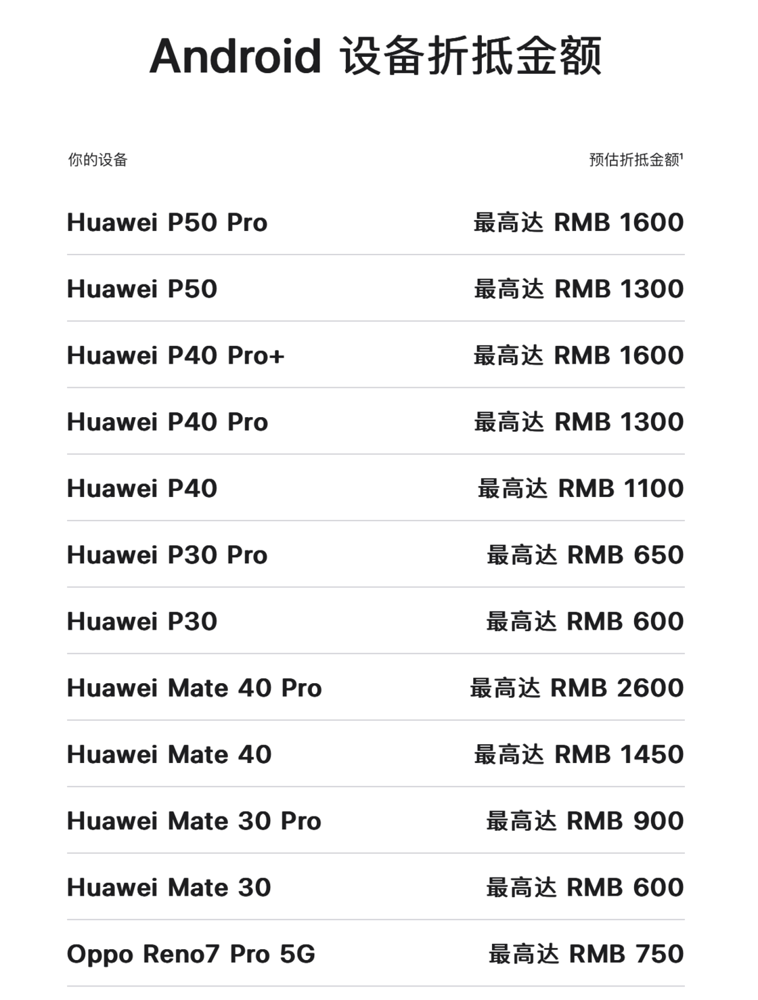
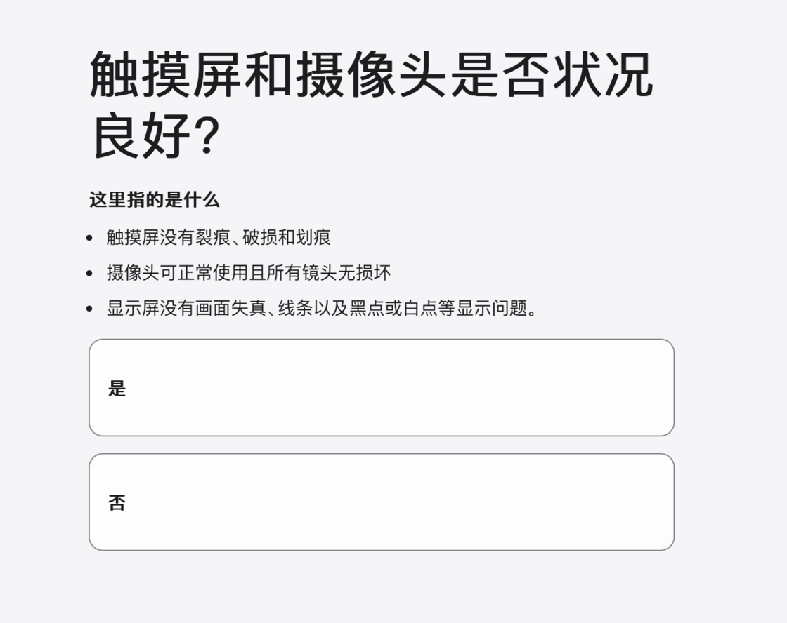
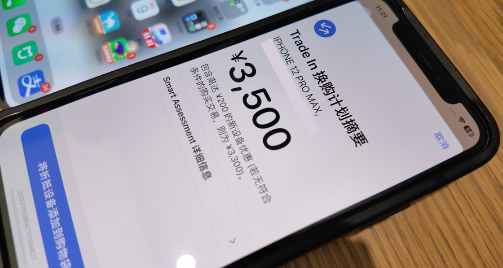

# 价格好、更省心：Apple 官方「以旧换新」更划算了 - 少数派

iPhone 15 系列的 4 款机型上市之后，不少人都发现今年在官方渠道买 iPhone 似乎变得比以前更为划算了：不仅年年焕新的折抵价格首次超过了购机价格的 50%，就连 Apple Trade In 换购计划也比往年估价高了不少，甚至提供了额外的购机优惠，还超出了不少第三方回收平台的价格。

我虽然是多年的年年焕新用户，但是却没体验过 Apple Trade In 换购计划的完整流程，也只在若干年前为了省事以线上邮寄的形式通过官网折抵了我的首代 Apple Watch。

近期，我终于才在 Apple 西湖完整地体验了一次这项计划的完整流程，并向店员咨询了多个 Apple Trade In 换购计划的相关细节，因此整理了一些问题分享给你，如果你有在近期购入新设备的计划，希望这些内容能够给你提供参考。

## Apple Trade In 换购计划是什么

简单来说，Apple Trade In 换购计划是 Apple 官方推出的二手设备回收服务，通过向 Apple 官方出售你的二手设备，你可以直接获取出售设备所获得的相应现金，或者直接抵扣二手设备的折抵金额购买新的 Apple 设备。

## 哪些类型的设备可以参与

目前，Apple 官方推出的设备中，iPhone、iPad、Mac、Apple Watch 均可以参与换购计划获得系统估价，第三方设备中各大主流品牌推出的 Android 机型也都可以参与换购并获得估价。事实上，Apple 也在官网标注出了若干热门 Android 机型的换购预估价格，方便相关用户提前查看和判断。

所有配件类及上述未提及类型产品，均不可参与 Apple Trad In 换购计划，比如 Apple 自家的耳机产品、HomePod 音箱等产品也不可以获得折抵金额。不过，对于不能获得折抵金额的产品，Apple 同时提供了免费回收服务，可以帮你免费处理这些不需要的产品，如果你真的愿意的话。

## 哪些第三方品牌可以参与

据官网信息可知，目前可参与 Apple Trade In 换购设备的第三方品牌有：

-   HTC
-   华为
-   OPPO
-   一加
-   三星
-   索尼
-   vivo
-   小米 (包括红米)

## 设备如何获得估价

在换购之前，我们可以直接通过 Apple 在官网提供的评估程序提前判断设备的大致折抵金额，程序会询问设备型号、存储容量，外观是否完好、按键及镜头是否工作正常等等，即使设备出现外观磨损或者功能不正常等情况，仍然可能可以获得折抵金额换购新机。

比如我在官网估价时，尝试在「触摸屏和摄像头是否状况良好？」部分选择了否，评估系统依然给出了一个预估金额，只不过会比状况正常的设备估价要低不少，店员也告诉我们如果系统给出了估价，用户是可以不选择维修直接进行折抵的。

在线下换购流程中，店员会大致检查设备之后发起设备智能评估服务，折抵设备需要联网扫描相关二维码后由 Apple 系统自动进行检测评估，并在评估服务结束后给出折抵金额。Apple Watch 由于无法扫码发起智能评估服务，会由店员在详细检查填写评估选项表获得折抵金额。

## 折抵金额怎么确定

与店员交流我们得知，目前除了 Apple Watch 之外的其它设备折抵金额均由 Apple 系统自动检测完成，无法通过人工进行任何干预，Apple Watch 设备的折抵金额同样由系统根据人工所填选项自动给出。且在通过 Apple Trade In 换购计划新购设备时，仅能进行一次换购折抵金额，无法以多台符合资格的旧设备抵扣一台新设备的购买金额。

目前 Apple 针对部分机型还推出了额外的折抵优惠，比如我们现场折抵的这部 iPhone 12 Pro Max，系统给出的设备折抵金额为 3300 元，但如果选择购买新的设备，则能再享受额外 200 元的购机优惠，抵扣 3500 元的购机金额，如果选择直接将折抵金额转银行卡，则无法享受这额外的 200 元优惠。另外需要注意的是，如果希望直接获得现金，那么只能以在线方式参与折抵，线下只能为你提供折抵换购相应的购机优惠。

店员还向我们补充说明，发起 Apple Trade In 换购计划并获得额外优惠之后，如果需要更多时间备份和传输数据资料，用户可以选择先购买新的设备，只要确保获得新设备的 14 天内 Apple 方面收到了你的折抵设备，依然可以继续享受额外购机优惠。

## 新的设备也能参与折抵吗

我们特地向店员询问，新上市的设备何时能够参与折抵换购，比如当用户想将手里的 iPhone 15 换购成 iPhone 15 Pro 的时候。店员告诉我们，新上市的设备一般无法参与折抵，只有当下一代机型上市之后，前一代机型才能够获得系统估价参与折抵。

## 经过第三方维修也可以折抵吗

店员告诉我们，除了前往 Apple 零售店维修设备，通过第三方授权经销商维修的设备也可以正常参与 Apple Trade In 折抵换购。店员也提醒我们，虽然折抵金额以系统评估为准，但是经过非官方渠道维修过的设备应该无法参与换购，也建议大家尽量选择官方渠道维修设备，不仅能够获得更好的零配件维修服务，隐私方面也更有保障。

## 在线换购也一样吗

如果选择在线折抵旧的设备，需要将设备寄至 Apple 指定的检测地点，等待第三方服务商的检测结果以及给出的最终折抵价格。据 [Apple Trade In 换购计划法律信息](https://www.apple.com.cn/legal/sales-support/trade-in/cn/)可知，目前在线参加该计划的第三方折抵换购供应商有两家：

-   爱锋派
-   爱回收

其中爱锋派为富士康旗下全资子公司，爱回收则为知名的老牌电子产品回收平台。许多人担心通过线上邮寄再检测的方式充满不确定性，且检测方均为第三方机构，折抵金额会受到影响。

店员也告诉我们不用有此担心，即使是第三方回收机构，回收标准也完全按照 Apple 方面要求执行，与线下 Apple Store 折抵流程保持一致，不会以外观使用痕迹等因素故意压低折抵金额。店员还向我们解释说，在设备正常功能无障碍的前提下，影响折抵金额的最大因素为存储容量，其它配置方面的因素影响较小。当然了，通过官方渠道折抵设备，也完全不会像第三方平台一样因为各种使用痕迹、划痕等等因素影响折抵金额。

## 反悔了怎么办

如果以在线方式发起折抵换购，但是设备还未正式寄出，则继续保留设备即可取消折抵换购。此外，不论是以线上 (寄出之后) 还是线下的方式获得了折抵报价之后，用户可以直接拒绝估价取消折抵换购，在线寄出的设备会通过快递寄回给你。

当然，如果你已经通过换购获得了新的设备，但是根据正常的退货退款政策退回了你新购买的设备，设备会根据折抵渠道决定是否能够退还给你。如果前往 Apple 零售店折抵设备，店员告诉我们旧的设备将不会因为新的设备退货而退还给你，相应部分将以对应折抵金额直接转账给你；但是依据官网所列条款，如果你选择的是在线邮寄折抵的方式，新的设备按照规定退货之后，旧的设备依然可以重新退还至你的手中。

值得一提的是，此前年年焕新法律信息规定，升级新 iPhone 后 8 天内退货可以收回旧的设备，但目前这一政策已经[取消](https://www.apple.com.cn/legal/sales-support/iphoneupgrade_cn/)，通过年年焕新购买的 iPhone 可以享受正常的 14 天内退货退款政策，但无法退回参与年年焕新的原 iPhone，此部分将以设备抵扣金额由第三方换购服务商转账给你。

## 与年年焕新比谁更划算

需要提前说明的是，年年焕新政策今年有了多项更新，其中折抵金额也由原来的「现有 iPhone 原零售价格的 50% 」变更为了「现有 iPhone 原零售价格的至少 50% 」。询问店员之后我们得到确认，如果仅比较原设备折抵金额，年年焕新中原 iPhone 的折抵价格绝对不会低于 Apple Trade In 换购计划的折抵价格。

但考虑到需要加购 AppleCare+ 服务计划，相关成本需要一并计入，当然 AppleCare+ 能够提供保外维修，在一定程度上避免高昂的设备损坏维修费用，还是比较建议考虑选购。

## 折抵换购可以享受教育优惠吗

可以。店员告诉我们，提供了教育优惠的产品如 iPad、Mac，参与 Apple Trade In 折抵换购时同样可以进行选购。

## 结语

以上就是我参加 Apple Trade In 折抵换购之后整理的一些经验总结，希望能为你提供帮助，如果你还有其它问题，也欢迎在评论区提出。
