## 企业级苹果Mac用户安全防御指南（译文）

- - -

## [概述](#toc_)

在本指南中，我们将为读者全面介绍Apple Mac和macOS平台内置安全控制机制的优缺点。我们将重点考察运行macOS设备的企业中的安全和IT团队所面临的各种挑战，并概述macOS 12 Monterey系统于2022年推出后，将对威胁格局产生怎样的影响。

## [引言](#toc__1)

目前，苹果公司的Mac电脑在企业中越来越流行，但是，对于在企业中运行这些电脑对安全所带来的影响，人们仍然缺乏足够的了解。管理Mac设备的系统管理员和安全团队经常面临的困惑包括：

-   Mac在设计上有多安全？
-   是否需要第三方的AV安全控制机制？
-   哪种安全软件在macOS系统上效果最好？
-   在保护macOS系统的时候，哪些方法是最有效的？
-   对于运行大量macOS系统的企业来说，在2021年遭遇了哪些类型的安全威胁？

在本指南中，我们对上述以及其他安全问题进行了客观的评估，以便为希望清楚了解当前macOS安全挑战的人提供宝贵的指导和参考。

在下文中，我们将一起考察下列问题：

-   架构与代码设计  
    新的M1架构是否比英特尔机器的安全性更高？在这两种架构的macOS Big Sur上是否仍能运行未签名的恶意代码？
-   Gatekeeper  
    虽然Gatekeeper声称能够防止系统执行不受信任的代码，但是，恶意软件或恶意的内部人员绕过Gatekeeper机制的难易程度到底有多大？
-   公证（Notarization）与OCSP机制  
    公证机制能实现什么功能，管理员需要了解苹果公司公证机制的哪些局限性？公证与OCSP之间的区别是什么？恶意软件是如何绕过这些检查机制的？
-   测试已知的恶意软件：警惕虚假的安全感  
    如何确保针对已知恶意软件样本的测试与针对在野恶意软件家族的测试同样有效？
    
-   XProtect与MRT  
    苹果公司的XProtect和恶意软件清除工具MRT.app在现代版本的macOS上的运行机制是什么，它们在阻止现实世界的ITW恶意软件方面有多有效？
    
-   透明、同意与控制（TCC）  
    TCC控制框架，包括全磁盘访问，旨在保护用户数据免受进程和其他用户的窥探。问题是：它们在多大程度上实现了这一目标？同时，管理员是否应该了解TCC的运行机制，以确保用户数据得到真正的保护？
-   解决企业环境下的macOS系统安全挑战  
    您如何判断哪些供应商正在开发既高效又有效的解决方案？与那些将平台视为事后考虑的供应商相比，哪些供应商真正投资于Mac EDR的先进技术？目前macOS面临哪些针对性的威胁？

本指南将揭示苹果公司用于保护macOS平台的各种技术中的各种弱点和不足之处。需要声明的是，我们此举的本意并非抨击苹果公司：作为一个硬件、软件和服务开发商和供应商，苹果公司除了寻找、检测和防御恶意软件之外，还有很多事情要做。相反，我们的目的是根据当今面临的实际威胁，来描述和评估这些技术。

当然，还有许多其他与苹果公司的Mac平台安全相关的话题，本指南将不会进行介绍。其中包括某些苹果公司提供的保护机制，如Filevault、安全引导和系统完整性保护(SIP)。这些是系统设置，通常最好保持默认的“打开”状态。有关这些技术的更多信息，可以在苹果公司的平台安全指南中找到

## [体系结构与代码签名](#toc__2)

摘要：虽然英特尔的体系结构与苹果公司的silicon体系结构在处理代码签名要求方面存在差异，但管理员需要清楚的一点是：恶意代码（包括已签名和未签名的）仍然可以在任一体系结构上不受阻碍地运行。

2020年末，苹果Mac推出了一种新的体系结构：一种基于ARM架构的苹果自研芯片，名为“Apple silicon”。第一代M1苹果系统因其相对较低的价格和高性能而广受赞誉。这些特性使M1 Mac成为各企业竞相购买的热门之选。

第一代M1 Mac是与macOS Big Sur 11一起交付的，与之前的10.15 Catalina和英特尔机器上的Big Sur相比，带来了许多安全变化。其中最重要的一点是，M1 Mac是第一台被限制运行未签名代码的苹果电脑。

```plain
在Apple silicon架构的Mac电脑上的macOS 11中，以及从下一个macOS Big Sur 11测试版开始，操作系统将强制要求只有获取了有效签名的可执行文件才能在其上运行。

——苹果公司2020开发者大会 
```

从安全的角度来看，这样做的好处应该是保证没有经过已知和公认的开发人员签名的软件将无法在机器上运行。

然而，现实世界并不那么简单，该技术也没有想象中的那么牢靠。事实证明，至少有两种方法可以使未签名的代码在M1 Mac上绕过代码签名限制。这些方法并没有利用安全漏洞或绕过技术，而是利用了苹果公司设计出来的“功能特性”。

```plain
这项新政策并不适用于在Rosetta下运行的已编译x86二进制代码，也不适用于在Intel平台上运行的macOS 11系统。
——苹果公司2020开发者大会
```

这就为未签名代码在M1设备上运行提供了两扇窗户：

-   未签名的恶意软件可以通过Rosetta在M1 Mac上运行；
-   未签名的恶意软件可以通过Ad Hoc代码签名在M1 Mac上运行。

虽然基于Apple silicon架构的Mac机器确实不允许运行本机arm64代码（除非提供有效签名），但在Rosetta“翻译”的x86\_64代码不受此限制。

您可以使用简单的“hello world”程序在运行macOS 12 Monterey的M1 Mac上验证这一点。如果我们首先将下面的程序编译为arm64e格式，那么，操作系统会在我们尝试执行时阻止该程序，因为它缺乏代码签名；但是，一旦我们将同一份源代码重新编译为x86\_64格式的可执行文件，那么，生成的hello.out就可以畅通无阻的运行了：

[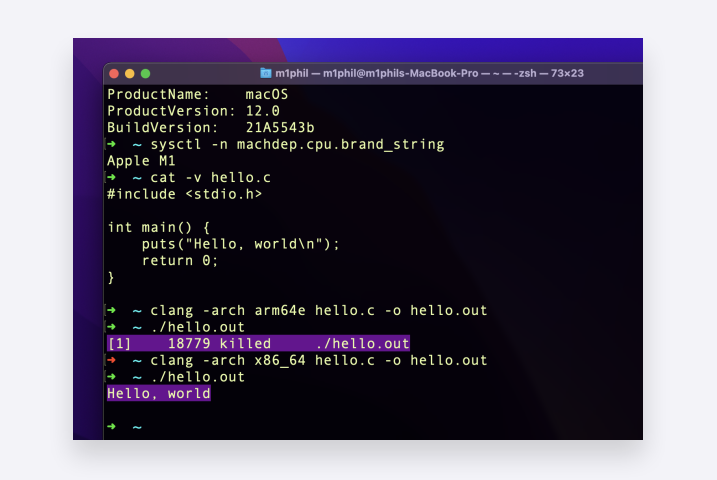](https://storage.tttang.com/media/attachment/2021/11/29/43300bd2-9c15-49af-83a6-8a9124c955ea.png)  
Rosetta允许未签名的代码在Apple Silicon M1上运行

结论：这为篡改软件打开了一扇大门——通过Rosetta转译技术，将软件转换为只运行于英特尔架构上的二进制代码的过程中，不仅会对代码进行相应的修改，同时，还会删除其代码签名。这样一来，即使在缺乏有效开发人员代码签名的情况下，转换后的程序也能通过Rosetta正常执行。

实际上，即使不借助于Rosetta，要想在不使用苹果的有效开发者证书签名的情况下在M1上运行原生ARM64代码也并非难事。这是因为，该系统允许使用即时创建的临时签名。众所周知，像XCSSET这样的恶意软件就利用了这种技术。当不知情的用户运行良性的第一阶段payload后，该恶意软件会下载恶意payload，并在内存中进行签名，这样它就可以在M1 Mac上正常运行了，而不会受到苹果代码签名检查的影响。

[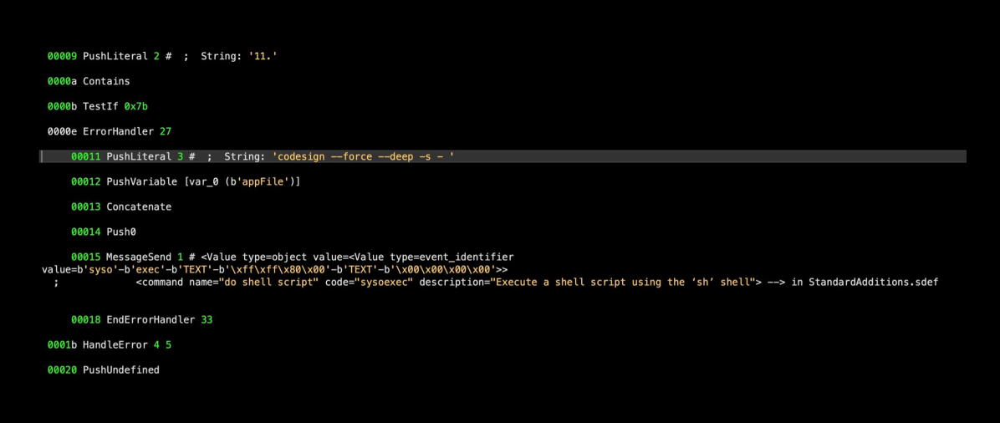](https://storage.tttang.com/media/attachment/2021/11/29/eb6bdd24-9ebc-4c88-9781-b918dd4c066e.png)  
XCSSET恶意软件在内存中为自己的代码创建签名

简而言之，使用基于M1芯片而不是英特尔芯片的Mac确实会获得一些安全优势，不过，如果您在Mac上运行安全软件，请确保它是为M1架构本地编译的，而不是通过Rosetta运行的。然而，恶意软件作者已经找到了绕过苹果代码签名检查的方法，所以，我们不能仅仅依靠这些来防止Mac设备运行未经授权的代码或恶意软件。

## [Gatekeeper](#toc_gatekeeper)

简介：Gatekeeper防止执行有害程序的底层机制不够安全，因为这些机制可以被恶意内部人员或没有管理员权限的恶意代码所覆盖。

根据苹果公司称，“macOS包括一项名为Gatekeeper的技术，旨在确保只有可信的软件才能在Mac上运行。”实际上，Gatekeeper是命令行工具spctl的前端，而该工具的作用就是管理安全评估策略。根据其手册页，spctl工具用于“维护和评估决定系统是否允许在其中安装、执行程序以及其对文件执行其他操作的规则”。用户通常通过System Preferences应用（可以通过Security & Privacy窗格的“General”选项卡找到）与Gatekeeper进行交互；在这里，为允许运行的软件来源提供了有限的选择：

[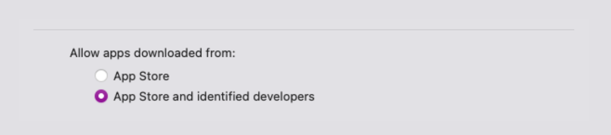](https://storage.tttang.com/media/attachment/2021/11/29/4bef8229-cbde-45b6-9aa8-07a9c336d87b.png)

Gatekeeper在System Preferences中的默认设置

事实上，用户可以通过设置系统策略，来允许spctl程序通过命令行方式安装、打开和执行从任何地方下载的应用程序——这是苹果公司的有意之举，旨在阻止这种行为，因为大多数用户都讨厌命令行——即使他们拥有管理员凭证。

[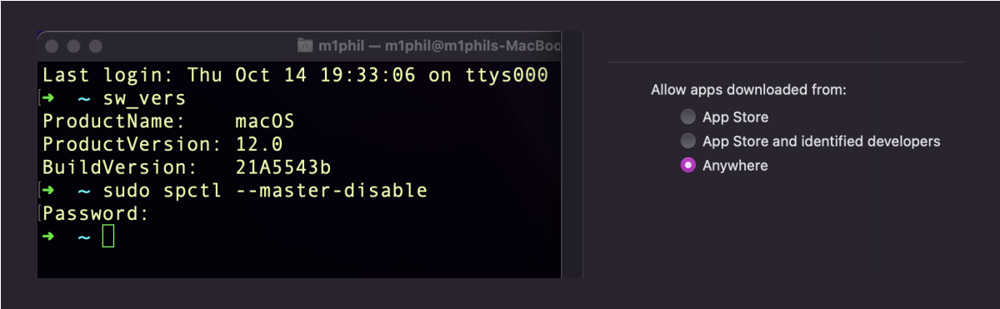](https://storage.tttang.com/media/attachment/2021/11/29/bc57a24b-dbaa-4571-ae0c-ca2188f256bb.png)  
命令行可以用来允许运行从任何来源下载的程序

不幸的是，对于安全团队来说，这个密码要求是完全没有必要的。尽管修改整个系统的设置需要密码，但对于任何可以绕过该设置，比如可以通过Finder来下载和执行不受信任的软件的特定用户来说，这完全就是形同虚设。

结论：Gatekeeper系统策略的设计是为了让用户在没有认证的情况下也能绕过安全设置。

苹果的安全控制从未考虑过企业用户，而Gatekeeper（以及macOS上的许多其他东西）的设计方式背后的基本假设是，“管理员”和“标准”用户是同一个人，只是操作两个账户而已。

我们可以求助于一些常见的macOS恶意软件，来考察攻击者是如何“绕过”这种保护机制的。

在macOS 11 Big Sur之前，恶意软件的安装程序通常只是向“自愿的”受害者提供图形说明，展示如何从Finder内启动不受信任的应用程序，并且不要求进行提权。

[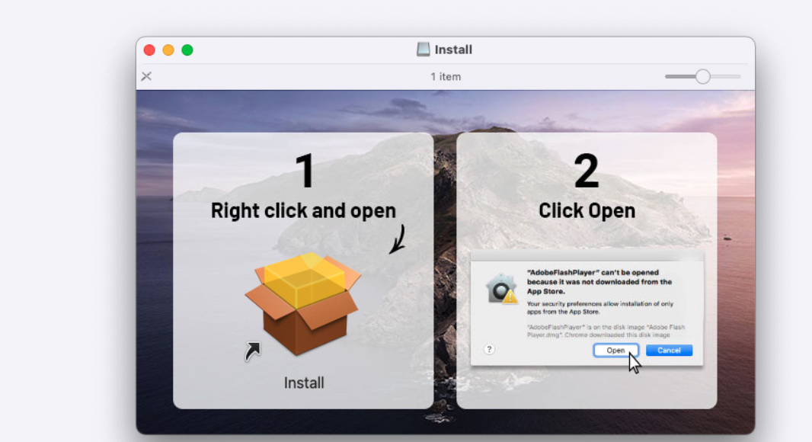](https://storage.tttang.com/media/attachment/2021/11/29/7be53242-12c3-4d43-9bba-14c954d1863a.png)  
一些恶意软件会告诉用户如何绕过自己的安全设置

这种情况在macOS Monterey上仍然如此，并且在macOS的下一次迭代中可能仍然如此。

然而，如果没有必要的话，恶意软件作者是懒得对用户进行社工攻击的。

自Big Sur以来，Bundlore和Shlayer等恶意软件运营商已经消除了这种复杂性，并利用了一种出人意料的方法绕过了整个安全评估策略。该绕过漏洞的CVE编号为CVE-2021-30657，简单来说，该漏洞允许任何打包了missing Info.plist和shell脚本的可执行文件（不同于常见的Mach-O文件）的应用程序包，都能轻松绕过macOS的安全策略检查。

虽然该漏洞仅影响苹果公司自己的内置安全机制，但是，使用该技术的恶意软件仍会被可靠的第三方安全解决方案（如 SentinelOne）检测到。

[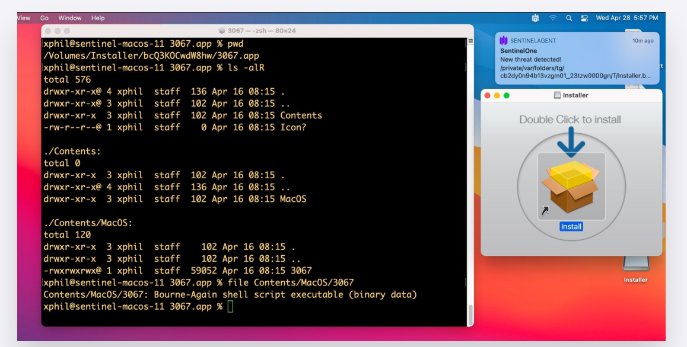](https://storage.tttang.com/media/attachment/2021/11/29/ad77b7e7-d666-43dd-bac7-e3be3fa6df9e.png)  
绕过Gatekeeper机制的恶意软件仍然可以被其他安全解决方案检测到

除此之外，还有多种其他方法可以绕过Gatekeeper，它们的总体思路都是在下载时用扩展属性（com.apple.quarantine标志）对下载文件进行标记。实际上，正是文件上这个属性的存在才会触发Gatekeeper的检查过程的，所以，如果在程序执行前没有发现隔离标志（无论是原先就不存在或者后来被删除的），Gatekeeper就不会被触发。

这个属性需要通过下载应用程序（如浏览器、邮件客户端等）附加到下载的文件上的。然而，像 curl 这样的命令行工具并不执行这一功能。另外，在设计层面上，安装包也会删除已安装到可执行文件上的隔离标志。第三方文件获取GUI应用程序也可以选择不在下载时添加隔离标志。

可以说，大多数 GUI 应用程序确实会对下载的文件进行相应的标记，但由用户或其他进程删除隔离标志时也不需要提升权限，因此，即使是普通用户或以普通用户身份运行的进程也可以轻松绕过Gatekeeper的安全检查。

结论：即使是非管理员、没有特权的用户和进程也可以通过多种方式轻松地绕过Gatekeeper的安全检查。

对于攻击者来说，他们通常采取的策略是设法说服不知情的用户运行一些看似无害的程序，然后由该程序通过curl下载并执行恶意payload。

此外，一些macOS恶意软件安装程序甚至会确保删除任何文件隔离属性，就像本例中从Bundlore脚本中删除的那样。

[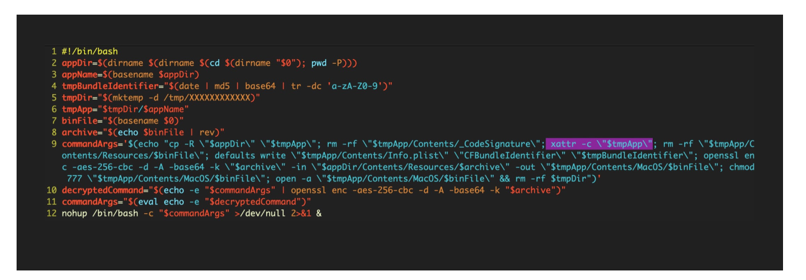](https://storage.tttang.com/media/attachment/2021/11/29/26e218d2-2c16-4fba-8557-61235a299cee.png)

Bundlore删除了Gatekeeper所依赖的扩展属性

我们将在后文中进一步讨论隔离标志（quarantine bit），因为它在苹果的其他安全层中也发挥了重要作用，但简而言之，用于阻止恶意软件执行的Gatekeeper的效果并不尽如人意。苹果可能会辩称，Gatekeeper只是分层防御方法的第一道防线。我们是“纵深防御”方法的强烈倡导者，所以，让我们进一步考察下一层的安全控制有哪些，它们的运行机制是什么，以及效果如何。

## [公证与OCSP](#toc_ocsp)

摘要：公证和OCSP机制用于实现签名代码的在线检测；然而，曾经出现多起恶意软件获得苹果公证的案例，并且，如果在恶意软件启动期间设备的互联网连接暂时中断，OCSP机制就会形同虚设。

实际上，公证和OCSP是两种完全不同的技术，我们之所以把它们放到一起讨论，是因为它们都涉及对已经通过（或获得）Gatekeeper的签名代码的在线检查。

公证，现在已经成为对所有希望在macOS平台上分发签名代码的开发人员的一项硬性要求。这项技术在Catalina 10.15中首次出现，并从Big Sur 11开始成为非应用商店的第三方代码执行的先决条件。

当一个已获得签名的程序试图在MacOS 11或更高版本的系统上运行时，系统会检查设备上的代码，看它是否提供了有效的“公证”票证。如果没有，或者是第一次执行代码，那么就会向苹果公司的服务器发送一个请求，以查看代码是否经过了苹果的公证。

理论上，如果出现以下任何一种情况，设备就应该阻止允许该代码：

-   已获得签名的代码没有附加本地公证票据，而且设备无法联系苹果公司的服务器进行在线检查（例如，如果设备没有互联网连接）；
-   已获得签名的代码没有附加本地公证票据，而且在线检查发现该代码没有在苹果公司的公证数据库中注册；
-   在苹果公司的公证数据库中能够查到该签名代码，但其公证证书已被撤销。

重要的是，系统不会对未签名代码进行公证检查。正如我们在体系结构一节中看到的，在macOS上运行未签名代码的技术（即使是在Monterey或Big Sur的M1 Mac上）已经在恶意软件作者群体中广泛流传和应用。

就像对合法软件开发人员一样，运行签名代码的限制对攻击者也有好处：这使得恶意软件的分发变得更容易——只要能通过Gatekeeper的检测，用户就会认为它是合法的，这反过来有助于恶意软件实现其他目标，如实现持久性、提升特权和设备配置篡改等。

出于这个原因，入侵者都乐于对恶意代码进行公证，他们倒不是想测试苹果的恶意软件检测算法到底有多好，相反，他们只是希望自己的软件能够通过公证，以便让用户获得虚假的安全感。在这方面，他们获得了惊人的成功，“公证恶意软件”的案例，虽然不常见，但确实经常出现。

[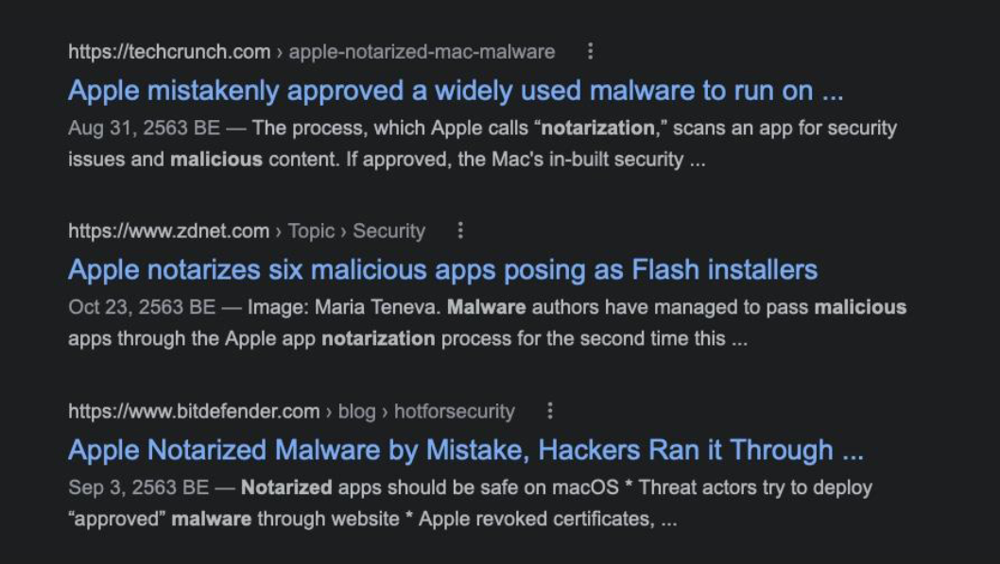](https://storage.tttang.com/media/attachment/2021/11/29/b7a0a67d-ff47-48f4-b144-77427bbfa6dc.png)  
通过苹果公司公证的恶意软件已经出现多起引人注目的案例

[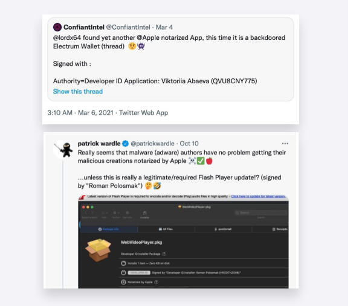](https://storage.tttang.com/media/attachment/2021/11/29/57e2cffe-bc80-4871-9def-74131693abf3.png)  
2020年和2021年期间出现的通过公证的恶意软件

与流氓代码签名一样，苹果公司也在用自己的安全控制手段进行一场打鼹鼠游戏：在发现某公证票据与恶意代码有关后，就会撤销该公证票据。

然而，绕过公证机制并不一定意味着必须通过网上检查。在野外看到的另一种方法是防止在线检查发生。就像一般的Gatekeeper和早期版本的macOS上的XProtect一样，公证检查也依赖于保存代码的文件中是否存在的一个扩展属性：如果没有找到该属性，系统就不会进行相应的公证（或Gatekeeper）检查。

正如我们在Gatekeeper中看到的那样，攻击者不仅可以通过curl下载来绕过公证（在这种情况下，不附加com.apple.quarantine扩展属性），还可以利用内置的xattr实用程序删除该属性来绕过该检测。同样，后一种方法也不需要提升的特权，可以由普通用户或使用普通用户权限运行的另一个进程来完成该任务。

公证并不是Mac设备在启动代码时进行的唯一在线检查。第二个单独的检查被称为OCSP或在线证书状态协议，由macOS的trustd守护程序负责相应的处理。

[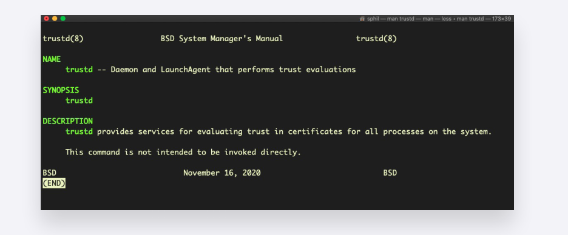](https://storage.tttang.com/media/attachment/2021/11/29/0890b469-0988-4330-b578-bc0b2a821aab.png)  
trustd守护进程负责检查被撤销的开发者证书

实际上，trustd和OCSP的目的，就是检查待运行的软件所使用的开发者证书是否已被撤销。开发者证书与我们已经讨论过的公证票据不同，它是在某人注册苹果的开发者计划时从苹果公司获得的证书。

与公证票据可以附加到所有应用程序并从中撤销不同的是，同一个开发者证书只能附加到由该开发者账户签名的所有软件上。这意味着，当苹果公司撤销一个开发者证书时，所有使用该证书签名的软件（即使是非恶意应用程序，如果有的话）都将无法通过OCSP检查并被阻止启动。

撤销开发者证书是苹果处理已知恶意软件的一种方式。通过使用OCSP响应器服务，苹果公司希望能在几分钟内阻止所有使用被撤销的开发者证书的软件在世界各地的Mac上都无法启动。

尽管在2020年11月该安全措施受到了重创，但该系统仍不失为一个相对强大且有用的安全技术。与公证和Gatekeeper安全检查不同，撤销服务不依赖于com.apple.quarantine标志。然而，OCSP也确实存在其不足之处，所以一定要多加注意。

恶意软件可以通过两种方法来绕过OCSP检查。最简单的方法是完全删除（或不提供）代码签名。尽管这带来了其他障碍，但在Intel和M1 Mac上运行未签名代码的可能性很大，直到macOS 12 Monterey，正如我们在本指南的前面部分所看到的那样。

第二种绕过OCSP的方法比较麻烦，但仍然可以实现。我们知道，这项检查只在代码的实际启动过程中进行，同时，还要求检查时具有互联网连接。如果在恶意软件启动期间，设法让设备暂时离线，那么trustd服务将跳过对OCSP的调用。一旦代码启动并运行，设备就可以恢复在线，以满足恶意软件本身的网络连接需求。

暂时使设备离线的任务，不仅可以由用户手动完成，也可以通过代码编程完成。

尽管无法通过命令行在未经授权的情况下更改网络设置，但程序仍然可以对host文件进行写入操作，以禁用所有或选定的网络调用。例如，通过写入下列命令

```plain
echo 127.0.0.1 ocsp.apple.com | sudo tee -a /etc/hosts
```

恶意软件的dropper或installer就可以阻止所有OCSP检查，同时仍然允许所有其他进程访问互联网。这对用户来说是不可见的，除非他们采取了相应的安全控制措施来提醒他们注意该行为。

结论：公证和OCSP证书检查都能被恶意软件所绕过，届时用户可能还蒙在鼓里。

## [测试已知的恶意软件？警惕虚幻的安全感](#toc__3)

摘要：当针对已知的恶意软件测试安全解决方案的防御效果时，一定要使用最新的恶意软件样本。使用旧的样本通常会给防御者造成一种假象，使其认为所有恶意软件家族都被拒之门外了，而事实上，被阻止的只是用被撤销的证书签名的个别样本而已。

虽然这里讨论的只有代码签名和证书检查（如公证和OCSP），但在评估Mac在现实世界的恶意软件面前的安全性时，还有一个重要的注意事项需要牢记。

作为一家安全解决方案供应商，SentinelOne鼓励客户测试其安全解决方案的有效性——无论是第三方还是苹果作为macOS平台的一部分提供的解决方案，但这个过程中，可能会因测试内容而得到误导性的结果。

正如我们上面提到的，苹果公司会定期撤销分发恶意软件的开发者的代码签名证书，同时，借助于公证检查，苹果还可以通过撤销其公证票据来阻止已经公证的特定代码样本。

这意味着，如果使用代码签名和/或公证票据已被苹果撤销的恶意样本来测试特定已知恶意软件家族的话，当然会看到该样本将在测试过程中被“成功”拦截。然而，重要的是，您并不能从该测试中得出如下结论：您能拦截同一恶意软件家族的其他样本。

例如，这里的Silver Sparrow恶意软件样本，它可以从一个著名的macOS安全研究人员的博客上下载，如果您试图运行它，它将被操作系统拦截：

[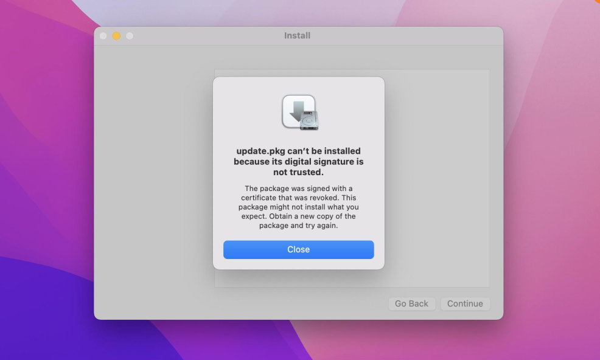](https://storage.tttang.com/media/attachment/2021/11/29/6b33ae4f-b093-4b25-aad6-02d055fb0dd1.png)  
即使恶意开发者的签名被撤消了，也不意味着您就安全了

## [通过证书撤销拦截恶意样本](#toc__4)

但是，通过删除签名或使用不同的证书给同一个恶意软件样本重新签名，它就能堂而皇之地通过这些检查了。

注意：要测试这一点，一定使用像第一次测试时那样的干净环境，因为一旦代码被拦截，本地设备就记住该代码曾经被拦截过，即使重新签名或使用其他处理方式也没用。

同样，正如我们在上一节中看到的，通过干扰网络连接来阻止对OCSP的访问也可以绕过这些检查。

依靠代码签名作为第一道防线固然不错，但考虑到“攻击者的死缠烂打”，即相同的恶意软件不断变换签名证书，这是一个很容易被绕过的安全措施。

结论：真正重要的是事情，是能否够针对恶意软件家族提供防御，而不是只能拦截单个样本。苹果公司提供了一种称为XProtect的内置技术来扫描已知恶意软件家族的可执行文件。下面，让我们看看它的效果如何。

## [XProtect与MRT](#toc_xprotectmrt)

摘要：苹果公司提供了一种静态签名检查技术，名为XProtect；同时，还提供了一种恶意软件删除工具，名为MRT。

虽然它们能够捕获很大一部分已知的恶意软件，但这些工具存在多种问题，包括ITW绕过、检测缺陷、静态签名规则的固有弱点以及管理团队缺乏可见性。

macOS内置恶意软件检测系统的核心是一个名为XProtect的静态YARA规则的内部列表。多年来，XProtect虽然不时变化其位置并更改其格式，但在终端上可以很容易地找到它：

```plain
% mdfind -name XProtect.bundle | grep -i coreservices
```

[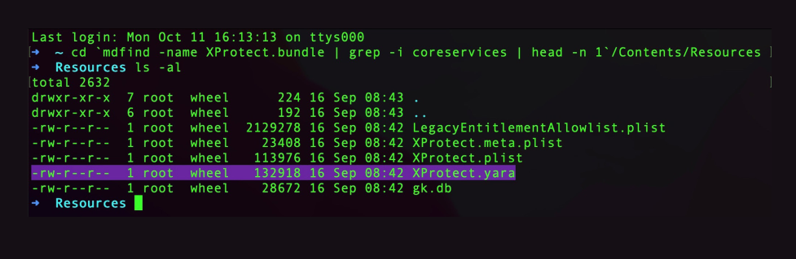](https://storage.tttang.com/media/attachment/2021/11/29/c73a2e91-72ee-45fc-80d3-8e7ecac1a047.png)  
在本地系统上查找XProtect

要在任意目录下检查您的设备当前安装了哪个版本的XProtect，可以键入下列命令（请注意该命令中的反引号）：

```plain
% plutil -p `mdfind -name XProtect.bundle | grep -i coreservices | head -n 1`/Contents/ Info.plist | grep -i shortversion
```

[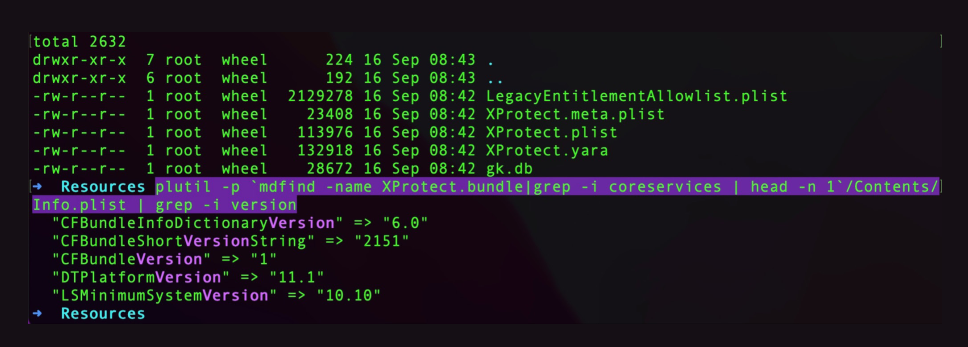](https://storage.tttang.com/media/attachment/2021/11/29/7d98483c-865d-4468-8845-7bafa609f1c2.png)  
检查最新的XProtect版本

在XProtect的Resources文件夹中，可以查看XProtect的YARA文件具体包含多少条规则，方法是在行首搜索“rule”，在撰写本文时返回的数量为158。

```plain
% grep ^rule XProtect.yara | wc -l
```

[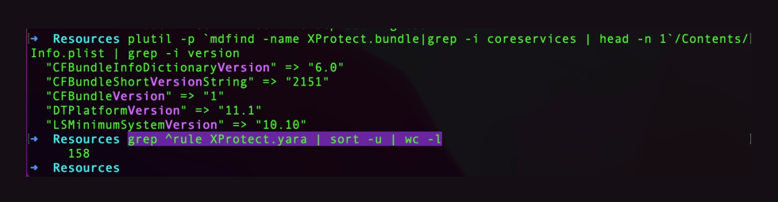](https://storage.tttang.com/media/attachment/2021/11/29/cc814252-28a8-43dc-a54b-e289c8c97972.png)  
XProtect只有158个恶意软件的签名，但恶意软件可远不止这些

在过去的18个月左右，苹果公司从使用描述性规则名称转向使用以\_macos\_（原为\_osx\_)为前缀的简短的hexstyle标识符。浏览一下，我们可以看到苹果已经增加了大约68条规则（我们说“大约”，是因为苹果公司偶尔也会删除过时或糟糕的规则）。

[](https://storage.tttang.com/media/attachment/2021/11/29/d29e0330-7232-46d7-bdaf-741692466925.png)  
最近的添加到XProtect中的规则使用了不同的命名约定

尽管这些规则使用了没有提示作用的名称和无意义的描述，但我们维护一个运行列表，将每个规则与常见的行业名称相匹配，并在可用的情况下为每个规则检测到的内容提供具有代表性的样本哈希值。我们维护的列表名为“SentinelLabs XProtect Malware Families and Signature Names list”，可以在我们的Github上找到。

[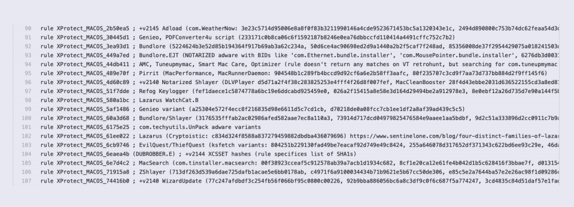](https://storage.tttang.com/media/attachment/2021/11/29/1b3db25e-e61e-4550-aa9a-adb0d3a75bc3.png)  
SentinelLabs维护了一份XProtect签名对应的常见恶意软件名称列表

至关重要的是，从安全团队或IT管理员的角度来看，XProtect没有为下面的检查任务提供任何类型的用户界面：检查样本或可疑文件是否已经被XProtect所致，从而无需实际尝试执行该文件（这是一种高风险策略，因为如果检查结果为假阴性，则自然会导致系统被感染）。然而，那些希望进行这种检查的人可以通过先安装开源的YARA工具来实现这一点。

安装了YARA之后，进行测试就很简单了：首先，提供XProtect.YARA规则文件的路径，然后，提供要测试的文件或文件夹内容的路径。在这里，我们发现XProtect将User的Downloads文件夹中的两个文件识别为恶意软件，这证明我们的测试是有效的。

[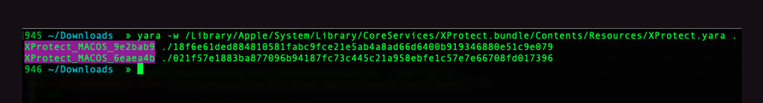](https://storage.tttang.com/media/attachment/2021/11/29/34b59a4d-067e-4022-8b9c-0fc99f0541fe.png)  
安装YARA测试XProtect

以下是从常见macOS恶意软件的VT中摘取的20个哈希值：

[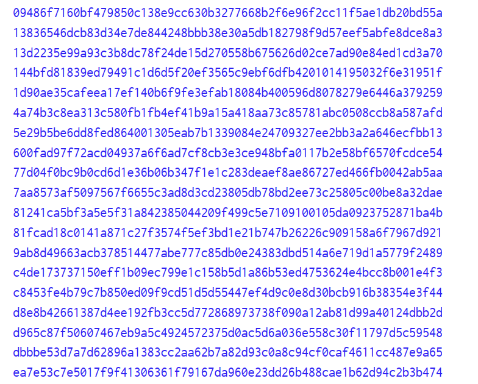](https://storage.tttang.com/media/attachment/2021/11/29/a0d5f50a-886f-433c-859b-84de9169cee0.png)

我们可以把这些哈希值提交到VirusTotal中，这时会发现所有20个样本都是已知的恶意软件，有些是最近几个月发现的，另一些则是几年前发现的。

[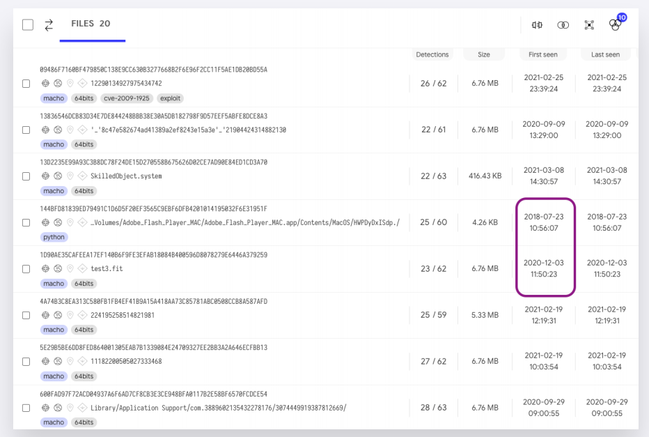](https://storage.tttang.com/media/attachment/2021/11/29/0ade7e22-37ab-4a5b-bfc2-3a561036dd05.png)  
在VirusTotal上可以找到XProtect无法识别的新旧恶意软件

让我们使用刚刚安装的YARA工具，看看有多少恶意样本是XProtect能够识别的。

[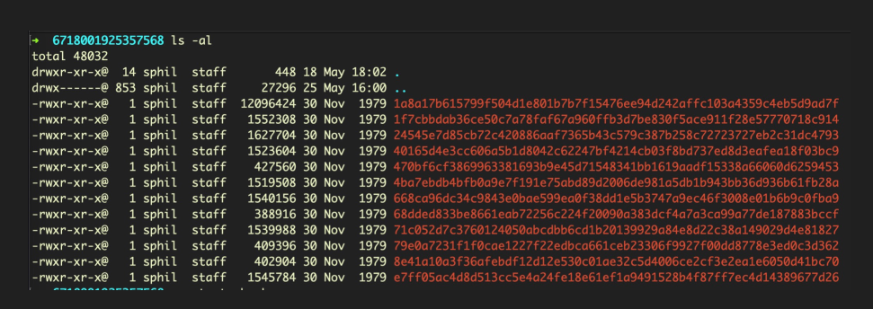](https://storage.tttang.com/media/attachment/2021/11/29/72a913ee-a8b7-4e5c-9455-62b120cbcac1.png)  
不幸的是，XProtect无法识别这些样本中的任何一个

XProtect这次干得不错，在我们的12个样本中识别出了8个。

[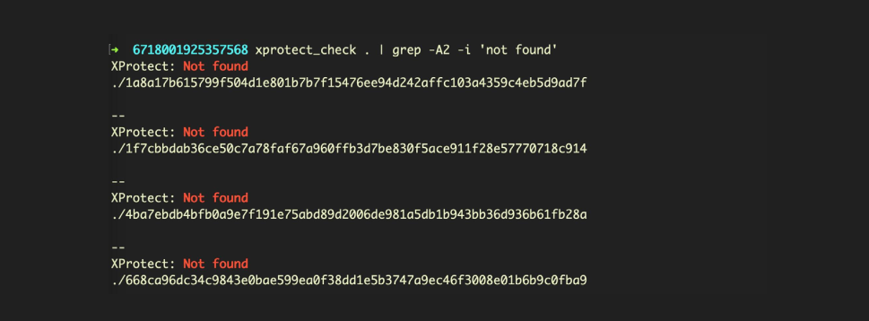](https://storage.tttang.com/media/attachment/2021/11/29/a475701b-09c8-42ec-b621-e5a4c4169c96.png)  
XProtect在12个Adload样本中识别处了8个

难道是这些恶意软件太新了，XProtect还无法正常识别？让我们把这4个哈希值导入VirusTotal，看一看这些样本的新旧情况。

[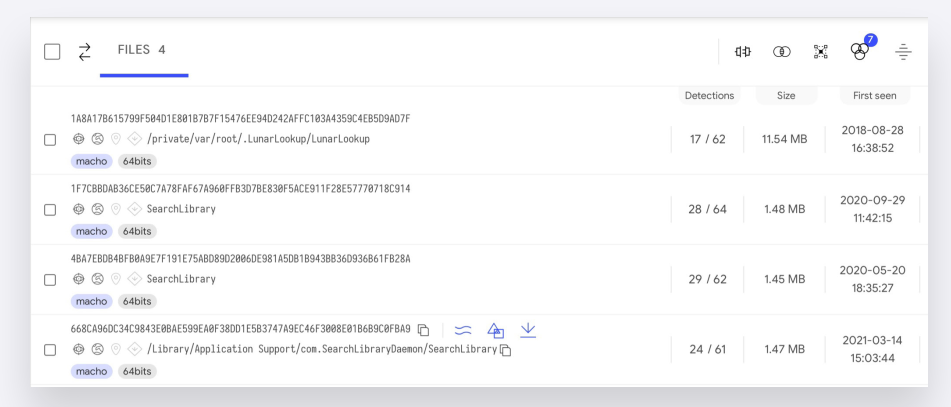](https://storage.tttang.com/media/attachment/2021/11/29/1803acaf-4b38-4c99-b115-c9bf71355d30.png)  
无法识别的恶意样本的出现时间，从6个月到3年不等

不，似乎这些都是VirusTotal上的引擎所熟知的恶意样本，它们在几个月甚至3年多前就出现了。这些样本只是我们在日常研究中发现的许多样本中的一小部分，但是XProtect的YARA规则太少了，以至于没有涵盖这些样本。

结论：需要注意的是，如果您将XProtect作为抵御已知恶意软件的主要防御手段，那么您就要小心了。如果将其用于抵御未知的恶意软件，那您就等着崩溃吧。

就像在前言中所说的那样，我们这里的目的不是抨击苹果：作为一个硬件、软件和服务开发商和供应商，苹果除了寻找恶意软件之外还有很多事情要做。我们的观点纯粹是描述性的：事实表明，您根本无法依赖苹果的内置工具来检测当今企业面临的所有威胁。无论苹果公司的工具能提供多大程度的帮助，都是值得欢迎的，但如果企业自身没有专门为今天的威胁现实而设计的更全面的解决方案来增强这些工具，企业就会将自己暴露在危险之中。

在评估内置的XProtect工具如何保护您的Mac设备免受恶意软件侵害时，还需要了解其他问题。由于XProtect完全依赖于必须由苹果公司编写并推送到您的设备上的静态签名，因此，这并不能保护企业免受苹果公司尚未发现并开发出特定检测机制的任何恶意软件的影响。相比之下，像SentinelOne这样的解决方案，采用多引擎技术，利用机器学习、行为规则、静态人工智能和云信誉的深度文件检查，可以保护您的系统免受已知和未知恶意软件的影响。

除了已知的检测失误之外，XProtect还多次被恶意软件绕过。在Catalina之前的macOS版本中，恶意软件通常会通过删除隔离标志来绕过XProtect（请参阅Gatekeeper一节了解更多相关信息）。尽管苹果公司现在会对所有文件（无论它们是否设置了隔离标志）都进行XProtect扫描，但这仍然无法阻止恶意软件作者找到绕过方法。

在这方面来说，最近报告的案例是CVE-2021-30657漏洞，它利用了一种至少自2014年以来就已知的技术，来创建带有shell脚本可执行文件的应用程序包。当然，这是Shlayer和ZShlayer恶意软件的一个技术特征，在过去的一年或更长的时间里，ZShlayer恶意软件已经成为该平台上最突出的恶意软件家族之一。

## [实际测试MRT对抗恶意软件样本的效果](#toc_mrt)

备份XProtect是苹果公司用于补救目的的另一个工具：MRT（Malware Removal Tool，恶意软件删除工具）.app。与XProtect一样，MRT在最近版本的macOS中也改变了存放位置，但目前与XProtect包位于同一个CoreServices文件夹中。

[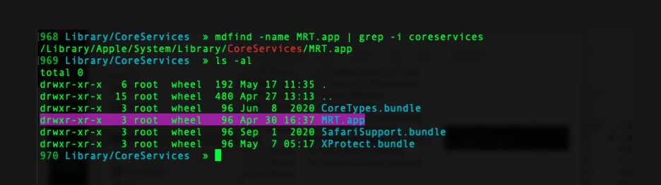](https://storage.tttang.com/media/attachment/2021/11/30/6ca439a0-e046-480e-88a5-b22102e01909.png)  
与XProtect一样，mrt.app也位于CoreServices文件夹中

与XProtect不同，您实际上可以直接在命令行中调用mrt.app，而无需使用sudo。不幸的是，该工具并没有提供太多的反馈信息：

[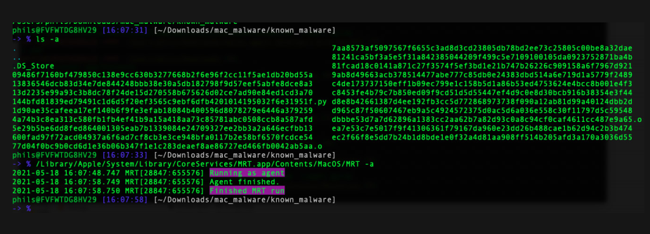](https://storage.tttang.com/media/attachment/2021/11/30/287f0e01-4b12-4d90-bb51-fb6eb664b3eb.png)  
从命令行调用mrt.app

不幸的是，即使使用-a（user agent）和-d（-daemon）开关运行sudo之后，我们已知的恶意软件文件仍然“岿然不动”：

[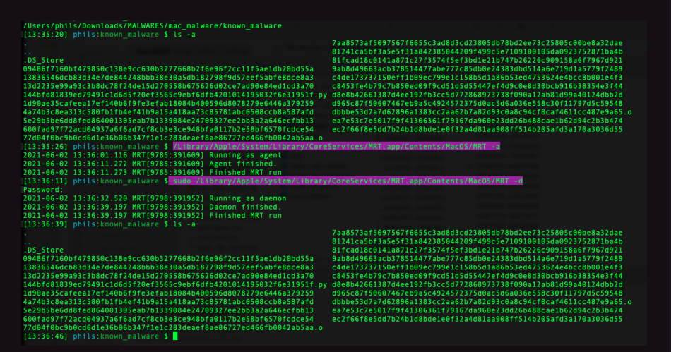](https://storage.tttang.com/media/attachment/2021/11/30/0544ebfa-79b4-4862-956c-c53548dd91eb.png)  
MRT.app无法检测出某些特定的二进制文件

但也许这不是一个公平的测试。恶意软件删除工具主要搜索某些位置（某些文件路径）中已知的恶意软件，并悄悄地删除与之匹配的任何内容（MRT似乎还有其他功能，例如扫描所有应用程序以查看它们是否被篡改，但我们不会在这里深入讨论这些功能）。

我们可以通过将恶意软件文件放到某个位置，并且我们知道MRT被编程来检查这个位置并确保将其删除，以考察MRT.app的主要功能是否正常。

一旦确认MRT.app工作正常，我们就可以将其他恶意软件文件放在已知的位置，看看MRT是否也会删除这些文件。这应当是一个相当可靠的测试，用于确定MRT是否能够检测出已知位置的任何特定恶意软件样本。

如果你想完成这个实验，则需要搭建一个测试环境，其中包括一个隔离的虚拟机，以运行最新版本的macOS；同时，最好还要打上所有的更新补丁。

首先，让我们从MRT.app中提取字符串，以了解它可能查找的内容。

为此，我们可以使用grep命令来查找“LaunchAgents”，因为这些是MacOS恶意软件持久性尝试的常见目标。

```plain
% strings -a MRT | grep ‘LaunchAgents/’
```

[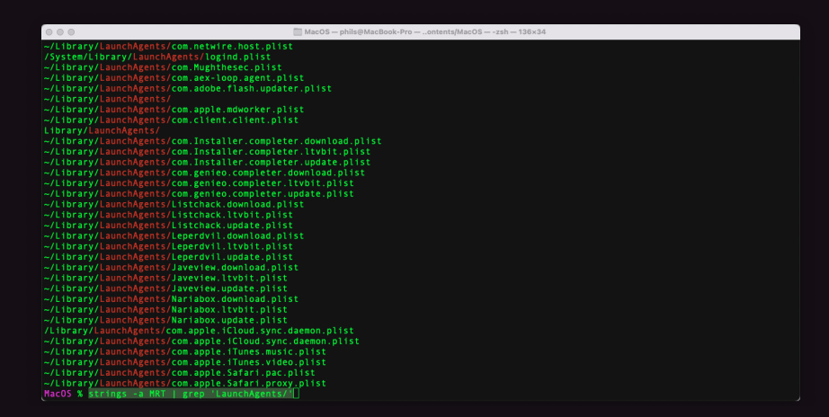](https://storage.tttang.com/media/attachment/2021/11/30/640d5758-8c1e-41e2-8ff7-9b62fc53920b.png)  
检查MRT.app二进制文件中的字符串

您可以从输出中随意进行选择，但我们将使用“com.apple.Safari.pac.plist”，并在该用户的LaunchAgents文件夹中创建一个同名的零字节文件。

```plain
% touch ~/Library/LaunchAgents/com.apple.Safari.pac.plist 
```

然后，我们切换到MRT所在的MacOS文件夹，并使用-a开关在命令行中运行MRT：

```plain
→ LaunchAgents ls -al
total 24
drwxr-xr-x 5 user staff 160 18 May 17:18 .
drwx------@ 111 user staff 3552 4 Mar 20:35 ..
-rw-r--r--@ 1 user staff 6148 4 Mar 20:32 .DS_Store
-rw-r--r-- 1 user staff 0 18 May 17:18 com.apple.Safari.pac.plist
→ LaunchAgents cd -
/Library/Apple/System/Library/CoreServices/MRT.app/Contents/MacOS
→ MacOS ./MRT -a
2021-05-18 17:20:19.458 MRT[21792:3643786] Running as agent
2021-05-18 17:20:24.628 MRT[21792:3643786] Found OSX.Dok.A infection.
~/Library/LaunchAgents/com.apple.Safari.pac.plist: Unload failed
~/Library/LaunchAgents/com.apple.Safari.proxy.plist: Unload failed
~/Library/LaunchAgents/com.apple.Safari.pac.plist: Delete
~/Library/LaunchAgents/com.apple.Safari.proxy.plist: Delete failed
2021-05-18 17:20:28.332 MRT[21792:3643786] err Error reading data of file ethcheck
2021-05-18 17:20:30.072 MRT[21792:3643786] err Error reading data of file ethcheck
2021-05-18 17:20:33.646 MRT[21792:3643786] Agent finished.
2021-05-18 17:20:33.646 MRT[21792:3643786] Finished MRT run
→ MacOS cd -
~/Library/LaunchAgents
→ LaunchAgents ls -al
total 24
drwxr-xr-x 4 user staff 128 18 May 17:20 .
drwx------@ 111 user staff 3552 4 Mar 20:35 ..
-rw-r--r--@ 1 user staff 6148 4 Mar 20:32 .DS_Store
```

如上面的输出所示，在发出几条错误消息后，MRT.app将删除该文件。同时，它还会查找并尝试删除明显与OSX.Dok.A感染相关的另一个文件。

到目前为止，一切正常：我们已经确认MRT应用程序工作正常，并且我们知道该如何调用它。现在让我们看看MRT到底能否检测出在野的MacOS恶意软件。

苹果公司在混淆MRT使用的许多字符串方面可谓煞费苦心（我们先前从 strings工具中输出的大部分内容都是取自MRT的早期版本）。在早期版本的MRT中，最初使用的是明文字符串，后来改为使用堆栈字符串，但在我们早些时候报道了这一点之后，苹果公司又改变了他们的字符串编码程序。现在，要想从MRT中提取这些字符串的话，则需要借助于先进的逆向工程技术，非专业人员很难胜任这项工作。然而，我们可以重复上面的方法，看看MRT是否能轻松地检测出它们。

再次重申，您需要在一个隔离的VM环境中完成这些操作，因为我们将要处理的是“活体”恶意软件样本，因为没人希望在自己的生产机器上鼓捣恶意软件。

我们将选择Adload的一个变体进行测试，因为这是一个在macOS上流行了几年的恶意软件家族。具体来说，我们将测试SearchLibrary，它至少在2021年3月中旬就已为人所知，至少在VirusTotal上已经声名狼藉。

[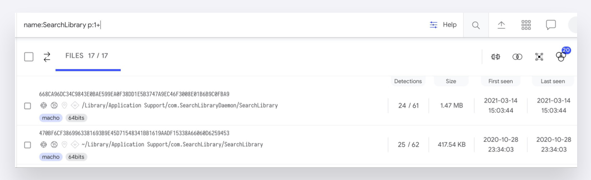](https://storage.tttang.com/media/attachment/2021/11/30/1f296a3f-055a-4d22-b288-142216a0a7f2.png)  
恶意软件的SearchLoad变体的出现已经有些时日了

[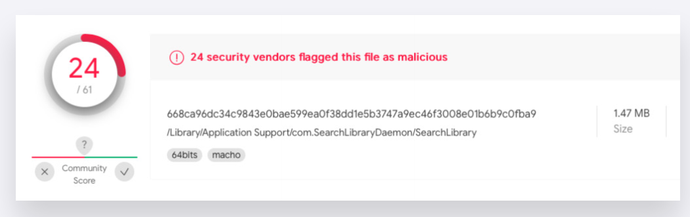](https://storage.tttang.com/media/attachment/2021/11/30/c9915746-526c-464e-8125-8aef99614557.png)  
SHA256: 668ca96dc34c98 43e0bae599ea0f38dd1e5 b3747a9ec46f3008e01b6 b9c0fba9\]

为了测试该样本，我们将在上图所示的路径上创建一个文件夹，具体命令如下：

```plain
% mkdir -p /Library/Application\ Support/com.SearchLibraryDaemon 
```

现在，我们取一个恶意软件可执行文件的样本，把它放到刚刚创建的名为SearchLibrary的文件夹中，并重复我们上面的测试，并通过带有-a和-d开关的sudo命令来运行MRT。那么，MRT是否真的删除了该恶意软件呢？

在撰写这篇文章的时候，该恶意软件样本已经出现在VirusTotal上三个月之久了，但是Mrt.app仍然不会删除该样本，所以，我们可以得出结论，Mrt.app无法识别这个恶意软件。当你读到这篇文章的时候，这种情况很可能已经发生了改变（我们希望如此，尤其是如果苹果公司读过这篇文章的话），但是，这种情况并非个例。如果您不放心的话，可以用自己选择的任何样本重复测试。实际上，您所需要的只是这样一个样本：它在磁盘上的确切文件路径是已知的（这通常可以从VirusTotal上的行为报告中确定）。通过这种测试，就可以帮您了解内置工具是否能保护您免受该样本的攻击。

我们能从中得出什么结论呢？像XProtect一样，Mrt.app毫无疑问也是设计用于检测已被曝光的恶意软件的。这个测试表明，Mrt.app根本无法识别一些众所周知的macOS恶意软件样本，我们从中得出的结论是，Mac内置的工具需要借助于其他更强大的安全解决方案进行加固。

## [透明、同意与控制](#toc__5)

摘要：TCC旨在保护用户数据不被非法访问，但已知有多种方法可以部分和完全绕过这种保护机制，至少有一个已知绕过方法已经在野外被积极利用。另外，系统设计中的弱点也意味着TCC很容易被管理员无意中破坏。

近年来，保护设备上的敏感用户数据变得越来越重要，特别是现在我们的手机、平板电脑和计算机通常被用来创建、存储和传输我们的最敏感的数据：从自拍和家庭视频，到密码、银行信息、健康和医疗数据，以及几乎所有其他东西。 在macOS上，苹果很早就在保护用户数据方面表明了强有力的立场，早在2012年就在OSX Mountain Lion中实施了控制，该框架被称为“Transparency, Consent and Control”，简称TCC。从那以后，随着macOS的每一次升级，TCC的保护范围都在扩大，以至于用户如果不通过"同意"或"控制"选项来赋予相关应用特定权限的话，甚至几乎无法访问自己的数据，因为数据都是通过这些应用程序进行访问的。

这些严厉的控制措施，已经导致用户的很多抱怨，但我们不打算在这里重新讨论这些。我们在这里关注的是，当用户和IT管理员合理地期望TCC发挥保护作用时，却出现了多种绕过方式。

当前版本的《平台安全指南》规定：

```plain
苹果设备使用各种技术措施来防止应用程序在未经许可的情况下访问用户的个人信息……[在]macOS的系统首选项中，用户可以看到他们已经允许哪些应用程序访问哪些信息，以及批准或撤销任何未来的访问请求。 
```

在通常情况下，我们谈论的是隐私保护，这主要由用户在系统偏好设置的安全和隐私窗格的隐私选项卡中进行管理。

[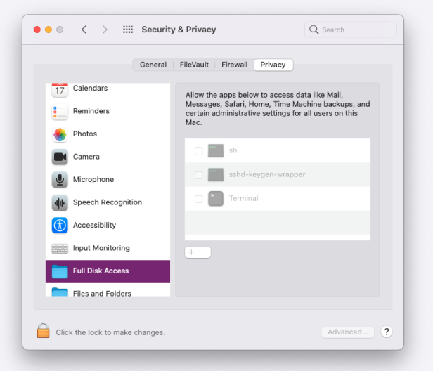](https://storage.tttang.com/media/attachment/2021/11/30/425da332-9b6d-4959-a609-e2b26e235c7a.png)  
系统偏好中的用户隐私控制

由MDM解决方案控制的Mac设备也可以通过配置文件的方式设置各种隐私偏好。在实际情况下，虽然这些偏好不会在上述隐私窗格中对用户可见；然而，它们可以通过TCC数据库被列举出来。不过，在Big Sur及以后续版本中实现该操作的命令略有不同。

对于macOS 11 (Big Sur)及后续版本来说，相应的命令为：

```plain
sudo sqlite3 /Library/Application Support/com.apple.TCC/TCC.db “SELECT client,auth_value FROM access WHERE service==’kTCCServiceSystemPolicyAllFiles’” | grep ‘2’$
```

对于macOS 10.15（Catalina）以及之前的版本来说，相应的命令为：

```plain
sudo sqlite3 /Library/Application Support/com.apple.TCC/TCC.db “SELECT client,allowed FROM access WHERE service == ‘kTCCServiceSystemPolicyAllFiles’” | grep ‘1’$ 
```

实际上，在命令行环境下，系统还向用户和管理员提供了/usr/bin/tccutil实用程序，尽管它声称提供“管理隐私数据库”的功能有点夸张，因为唯一有文档记录的命令被重置了。如果您需要全面擦除系统或用户的TCC权限，则该工具非常有用，但除此之外几乎没有其他功能。

[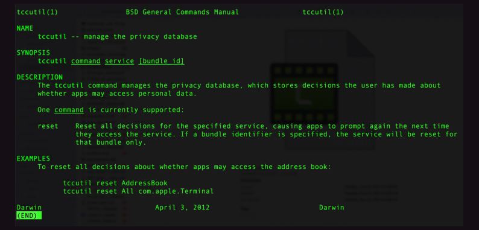](https://storage.tttang.com/media/attachment/2021/11/30/0583b13a-0601-4ae8-9d66-b4e3cdb0dcc4.png)  
tccutil工具用于管理隐私数据库

实际上，所有这些权限都由tcc.framework管理的，其地址为/system/library/privateframeworks/tcc.framework/versions/a/resources/tccd。

[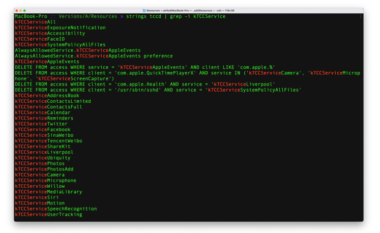](https://storage.tttang.com/media/attachment/2021/11/30/2a1f6370-5e0f-4866-81bb-aec3c6e2cfa9.png)  
tccd二进制文件中与用户权限相关的字符串

从用户实际操作Mac的狭隘角度来看，有人可能会争辩说，当用户(和应用程序)在狭义上的行为符合预期时，苹果用这个框架设计的隐私控制就会起到预期的作用。然而，正如我们下面所看到的，当其中一个或两个偏离预期时，问题就会随之出现。

## [全盘访问：一个打破所有规则的规则](#toc__6)

为了理解苹果TCC实现中的问题，重点在于要理解TCC特权存在于两个级别：用户级别和系统级别——这一点非常重要。在用户级别，单个用户可以授予某些权限，这些权限只应用于他们自己的帐户，而无法应用于其他人的帐户。如果爱丽丝允许Terminal访问她的桌面或下载文件夹，这对鲍勃来说并不会带来什么问题。因为当Bob登录时，Terminal仍然无法访问Bob的桌面或下载文件夹。

至少，它应该是如我们所期望的那样工作的，但是如果爱丽丝是一名管理员用户，并赋予Terminal全盘访问(FDA)权限，那么爱丽丝就能轻松访问鲍勃的桌面以及Downloads文件夹（和其他人的文件夹），而无论鲍勃（或其他用户）设置了什么TCC设置。请注意，即使鲍勃也是管理员用户，也无法获得任何特殊保护。所谓全盘访问权限，就像它的名称所暗示的那样：该权限可以由一个具有管理权限的用户进行设置，并授予系统范围内所有用户的数据访问权。

虽然这对系统管理员来说似乎是个好消息，但其中的含义可能并不明显，并且这些含义会影响管理员自己的数据安全。当爱丽丝为自己向Terminal授予FDA权限时，所有用户现在也可以通过Terminal拥有FDA权限。结果是，爱丽丝不仅授予自己访问他人数据的特权，还授予他人访问她数据的特权。

令人惊讶的是，爱丽丝（毫无疑问）并非本意的授权，也扩展到了无特权的用户。正如CVE-2020-9771漏洞报告的那样，允许Terminal拥有完全的磁盘访问权限，将会使所有数据都变为可读的，而无需进行任何鉴权：即使非管理员用户也可以安装和读取整个磁盘。这篇博客文章详细介绍了它的工作原理，但简而言之，任何用户都可以创建和挂载系统的本地快照，并读取所有其他用户的数据。

[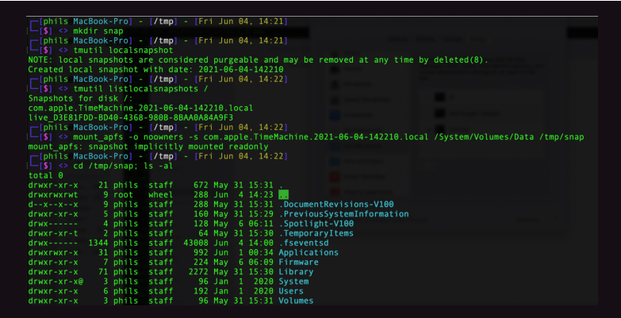](https://storage.tttang.com/media/attachment/2021/11/30/9c0d5fd3-aa2b-4245-b54d-5da8637a8d81.png)  
即使是普通用户也可以读取管理员的私人数据

这里的“关键”在于两个命令行实用程序，并且这两个实用程序对所有用户都可用：/usr/bin/tmutil和/sbin/mount。第一个工具允许我们创建整个系统的本地快照，第二个工具则允许我们将该快照挂载为apfs只读文件系统。这样的话，我们可以访问安装快照上捕获的所有用户数据了。

需要声明的是，这不是一个漏洞，因此也不会被修复（至少，在撰写本文时，“按预期工作”似乎仍是苹果的立场）。上面提到的CVE漏洞，是一个在没有全盘访问权限的情况下就能够利用这个缺陷的安全漏洞。苹果的修复措施是，只有在授予全盘访问权限的情况下，才可能出现这种情况。

结论：当您授予自己完全的磁盘访问权限时，您实际上会授予所有用户（即使是无特权用户）读取磁盘上所有其他用户数据的能力，包括您自己的数据。

## [通过Automation选项实现全盘访问的后门化](#toc_automation)

这种情况不仅限于用户：它还可以扩展到用户进程。根据设计，任何被授予全盘访问权限的应用程序都可以访问所有用户数据。如果该应用程序是恶意软件，或者可以被恶意软件控制，那么该恶意软件也能如此。但是应用程序控制是由TCC的另一个首选项即Automation自动化来管理的。

除此之外，这里还有一个陷阱：Mac上有一个应用程序始终拥有全盘访问权，但从未出现在系统偏好设置的全盘访问窗格中，这个程序就是Finder。

也就是说，任何可以控制Finder的应用程序（在隐私窗格的“Automation”中列出）也会拥有全盘访问权，尽管我们不会看到Finder或控制应用程序在全盘访问窗格中列出。

鉴于这种复杂性，管理员必须意识到，即使他们从未授予FDA权限，或者即使他们锁定了全盘访问权（例如通过MDM解决方案），只要允许应用程序通过"Automation"窗格来控制Finder，就能绕过这些限制。

[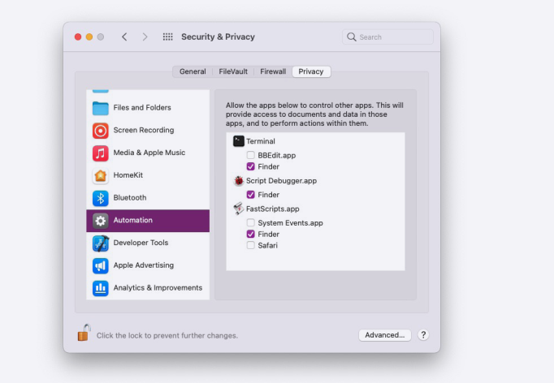](https://storage.tttang.com/media/attachment/2021/11/30/a7bdec06-fb25-4641-8896-f7f098950058.png)  
自动化Finder可以用于控制应用程序进行全磁盘访问

在上图中，Terminal和两个合法的第三方自动化应用程序Script Debugger和FastScripts都获得了全盘访问权限，尽管在全盘访问权隐私窗格中并没有显示出这一点：

[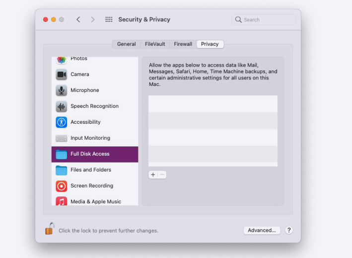](https://storage.tttang.com/media/attachment/2021/11/30/2d725e5d-33fe-48d2-8572-d710622e17fe.png)  
通过自动化“窃取”FDA权限的应用程序并不会显示在FDA窗格中

如上所述，这是因为Finder具有不可撤销的FDA权限，而这些应用程序又获得了对Finder的自动化控制。为了了解其中缘由，请看下面的命令：

```plain
% osascript<<EOD
set a_user to do shell script “logname”
tell application “Finder”
set desc to path to home folder
set copyFile to duplicate (item “private.txt” of folder “Desktop” of folder a_user of item
“Users” of disk of home) to folder desc with replacing
set t to paragraphs of (do shell script “cat “ & POSIX path of (copyFile as alias)) as text
end tell
do shell script “rm “ & POSIX path of (copyFile as alias)
t
```

尽管Terminal没有被授予全盘访问权，但如果它在过去由于任何原因被授予了自动化权限，那么在Terminal中执行上述脚本时，将返回“private.txt”文件的内容。由于“private.txt”位于用户的桌面上，而该位置按说是受到TCC保护的，因此，用户可能会合理地认为，如果没有应用程序被明确授予FDA权限，这个文件的内容将无法被访问。但事实显然不是这样的。

[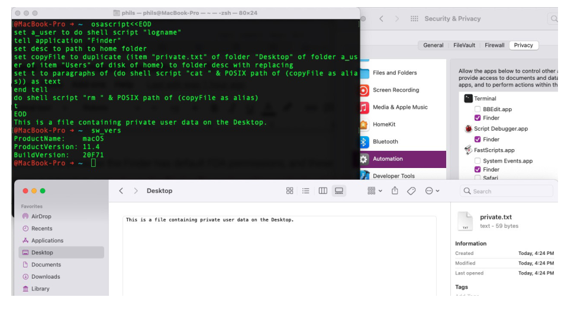](https://storage.tttang.com/media/attachment/2021/11/30/82cfbf57-ee9e-4452-b5db-32ea524a7539.png)  
通过自动化Finder来实现FDA访问权限的后门化

对于这种情况，一个显而易见的缓解措施就是禁止应用程序自动操作Finder。然而，这个建议有两点需要注意。

首先，有许多合理的理由将Finder的自动化授予Terminal或其他生产率应用程序：任何对通过自动化提高生产率感兴趣的轻度熟练用户很可能已经这样做或希望这样做。不幸的是，上述建议完全就是一种一刀切的做法。 如果用户有这样做的特定目的，则没有办法阻止他们通过其他不合法的方式为Terminal（或其他程序）赋予这种访问权限。

其次，以这种方式后门化FDA访问权限会降低授权障碍。 以常规的方式授予FDA权限是需要管理员密码的。然而，人们可以在没有密码的情况下授权Finder的自动化操作（从而实现FDA的后门化）。为此，他们只需简单点击即可操作同意对话框：

[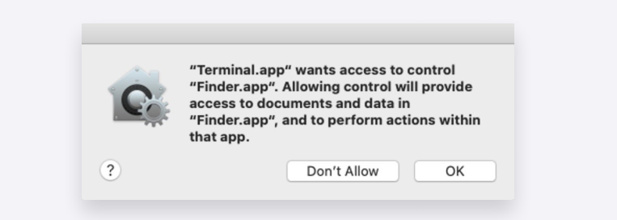](https://storage.tttang.com/media/attachment/2021/11/30/f8cd0fc7-3529-4ce3-ad7b-28a490a461bf.png)  
轻松点击“OK”按钮就能获得Finder的访问权限，进而提升为全盘访问权限

虽然警告文本足够明确（如果用户阅读了的话），但鉴于Finder的全盘访问权是无法撤销的，因此，在控制应用程序时所授予的权限，实际上远远超出了当前用户的同意或控制范围，这一点是很不透明的。

更为严重的是，这种授权不是每次都需要用户同意。如果该权限在过去的任何时候被授予，则该权限将一直有效，直到用户通过系统首选项"Automation"窗格或通过前面提到的TCUTIL reset命令撤消该权限为止，这一点往往是许多用户并不知晓的。

结论：密切关注并定期检查系统偏好设置隐私面板中允许自动执行Finder的程序。

## [TCC被绕过的悲催往事](#toc_tcc)

到目前为止，我们提到的所有内容实际上都是设计使然，但也需要牢记TCC被绕过的悠久历史。当macOS Mojave首次公开发行时，SentinelOne是第一个注意到TCC可以通过SSH绕过的公司（这一发现后来被其他人复制）。自那以后，其他研究人员陆续发表了许多其他的绕过方法。

2020年8月，在发现被XCSSET恶意软件利用后，又曝光了TCC被绕过的事件。尽管苹果公司在大约9个月后的2021年5月修补了这个特定的缺陷，但在尚未更新到macOS 11.4或最新安全更新到10.15.7的系统上，该漏洞仍然可被利用。

在易受攻击的系统上，复现这一漏洞非常简单。

1.创建一个需要TCC权限的简单木马应用程序。在这里，我们将创建一个需要访问当前用户桌面的应用程序，以枚举保存在那里的文件。

```plain
% osacompile -e ‘do shell script “ls -al /Users/sphil/Desktop >> /tmp/lsout”’ -o / tmp/ls.app 
```

2.将此“ls.app”特洛伊木马复制到已授予TCC访问桌面权限的应用程序包中。

```plain
% cp -R /tmp/ls.app /Applications/Some Privileged.app/ 
```

在了解当前已授权的应用程序时，一种方法是从系统首选项“安全和隐私”窗格的隐私选项卡中的“文件和文件夹”类别（恶意软件采用另一种方法，我们很快就会解释）中进行查找。

3.执行特洛伊木马应用程序：

```plain
%open/applications/some privileged.app/ls.app
```

安全意识较强的读者无疑会想很纳闷，攻击者是如何在不了解TCC权限的情况下实现第2步的？除非Terminal具有全盘访问权限，否则是无法从Terminal枚举TCC.db中的特权应用程序清单的。

即使目标尚未出于其他合法原因授予TerminalFDA特权（现在这种情况很少见了吧？），攻击者、红队成员或恶意软件可以改为枚举Applications文件夹的内容，并根据在其中发现的文件进行有根据的猜测，并根据在其中发现的内容进行有根据的猜测，例如，Xcode、Camtasia和Zoom都是安装后可能授予特权的应用程序。

同样，可以对已知具有此类权限的应用程序列表进行硬编码，并在目标机器上搜索它们。实际上，这正XCSSE恶意软件的采取的方式：该恶意软件会硬编码一组可能拥有屏幕捕获权限的应用程序，并将其自己的应用程序注入到找到的这类应用程序包中。

[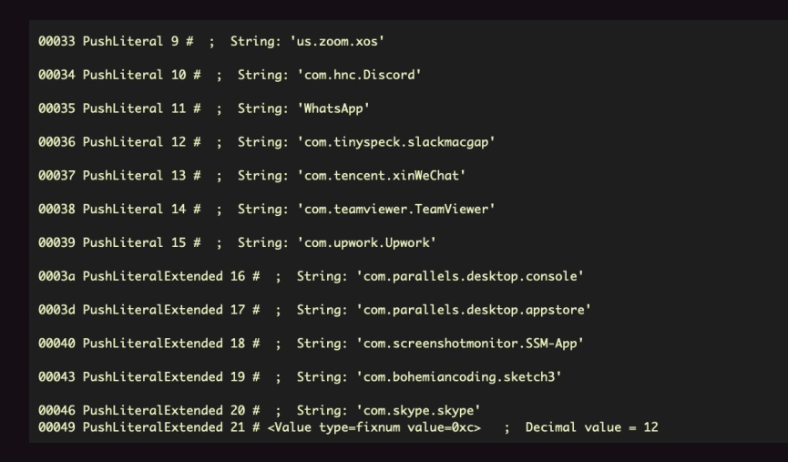](https://storage.tttang.com/media/attachment/2021/11/30/cd6ee774-cdad-4714-b2ad-e6ee499778ac.png)  
来自XCSSET恶意软件的解码字符串显示了它用来获取TCC权限的应用程序列表

不幸的是，针对这个特定漏洞的修复并不能有效地阻止恶意软件作者。如果绕过失败，他们只需冒充Finder，并请求用户赋予控制权限就可以了。与自动化请求一样，这只需要用户点击即可同意，根本就不需要提供密码。

[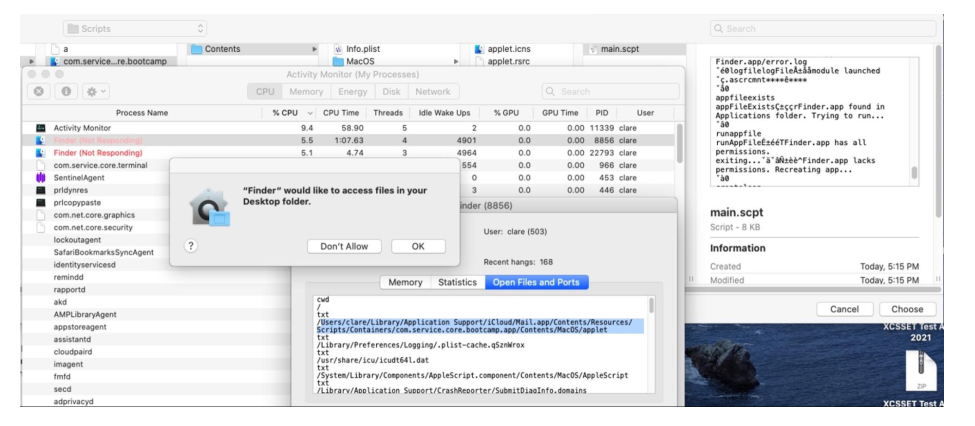](https://storage.tttang.com/media/attachment/2021/11/30/98d7b871-6a2b-4218-8ba7-c57e07003b9d.png)  
假冒的Finder应用程序被XCSSET恶意软件用来访问受保护区域

正如我们上面所指出的，（真正的）Finder已经默认拥有全盘访问权，所以，当用户看到要求授予Finder对任何文件夹的访问权的请求对话框时，通常并不会引起用户的怀疑。

结论：我们知道，恶意软件滥用了TCC的一些漏洞，并且存在各种尚未修补的TCC漏洞。所以，我们唯一的结论是，无论是用户还是管理员，都不应该过于信任TCC的能力，因为它目前的功能完全是为了保护数据免受未经授权的访问。

## [TCC也可以用来对付您](#toc_tcc_1)

对苹果用户隐私控制的一个常见误解是，它阻止了对某些位置的访问（例如，Desktop、Documents、Downloads、iCloud等文件夹）。然而，情况并非如此。

管理员需要知道，TCC不能防止非特权进程将文件写入TCC保护区域，同样也不能阻止这些进程读取这些写入的文件。

[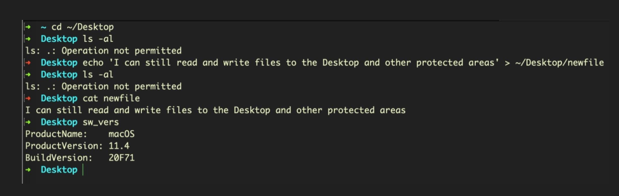](https://storage.tttang.com/media/attachment/2021/11/30/afa3d947-cdc9-4229-bca2-f2f67f43be01.png)  
进程可以写入TCC保护区域，并读取它写入的文件

结论：如果您安装了任何无法访问TCC保护区域的安全或监控软件，则没有什么可以阻止恶意软件将其部分或全部组件隐藏在这些保护区域中。

## [解决macOS在企业中面临的安全问题](#toc_macos)

在Apple silicon架构的系统上面，我们需要选择一个不依赖Rosetta转译技术的安全解决方案，并考察相应的供应商在研究macOS特定威胁方面的声誉。

正如以上章节中的讨论的那样，部署最新Apple Mac设备的企业所面临的威胁仅靠Apple提供的内置安全机制是无法充分解决的。在最好的情况下，这些机制也只能算提供了单薄的第一道防线，但它们显然无法阻止一些已曝光的恶意软件、苹果公司未知的新型恶意软件或有针对性的攻击。从Mac管理员的角度来看，苹果平台在可见性、威胁搜索或设备控制方面没有提供任何帮助。

那么，我们应该寻找什么样的安全解决方案呢？众所周知，现在并不乏提供macOS安全软件的厂商，但并不是所有的厂商都有专门的macOS生态系统的专业知识，或者在研究特定于MacOS平台的恶意软件威胁方面有渊源。

### [不要依赖Rosetta](#toc_rosetta)

首先，确保您正在考虑的任何macOS安全软件不仅能在苹果公司的英特尔平台上运行，还能在其“Apple silicon”M1芯片平台上运行。这意味着解决方案不应依赖苹果公司的Rosetta转译技术来兼容苹果公司的芯片，而应专门为这两个平台单独进行编译。

如前文所述，仅靠Apple silicon在架构方面的变化来阻止macOS恶意软件作者作用不大，同样，如果一个安全应用程序通过Rosetta转译技术运行，这有有何不同呢？对于安全应用程序来说，它需要同时考虑转译在安全性和性能两个方面的影响。

与转译后的代码相比，本机arm64代码至少有两个性能优势，因此后者特别适用于大型复杂程序，如EDR产品。Rosetta使用了两种转译技术：“提前翻译”(AOT)，这发生在软件第一次启动时；以及“实时翻译”，它在相应代码运行时才会翻译。

当需要JIT编译时，内核将控制转移给一个特殊的Rosetta转译存根，由它负责这项工作。对于非常复杂的程序（例如EDR解决方案）来说，通常至少需要通过Rosetta技术对其部分英特尔代码进行JIT编译，与运行本机arm64代码的安全解决方案相比，这种转换将导致性能损失。苹果公司在自己的文档中提到了这一事实：“翻译过程需要时间，所以用户可能会觉得翻译后的应用程序有时启动或运行得更慢”。

但性能并不是唯一需要担心的事情。正如我们在架构部分看到的那样，通过Rosetta可以运行没有代码签名的英特尔代码。这使得软件有可能被篡改：通过Rosetta 转译仅作为英特尔二进制运行的安全软件可以删除其代码签名，更改其代码，并在没有有效开发人员代码签名的情况下通过Rosetta执行程序。

检查已安装的软件是以原生方式还是通过Rosetta运行的最简单方法，就是使用带有图形用户界面的“System Information.app”软件，或在命令行环境下使用的system\_profiler工具。

要启动System Information.app，请在Spotlight中键入“sys”，选择相应的结果并单击“return”按钮。当应用程序打开时，单击侧栏中的“Applications”。这时，在“Kind”列中显示为“Universal”的程序都是以本机代码方式运行的。

[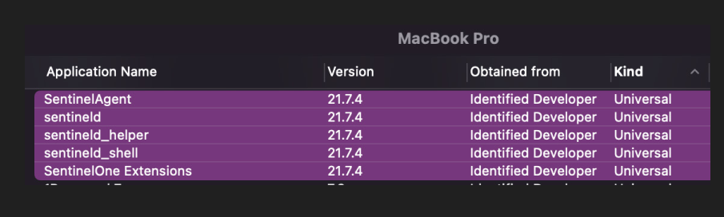](https://storage.tttang.com/media/attachment/2021/11/30/c53e8f71-9deb-49eb-80e7-ba020f309840.png)  
本机M1应用程序使用的是“Universal”二进制格式

在ARM M1 Mac电脑上，转译得到的程序都带有“Intel”标记：

[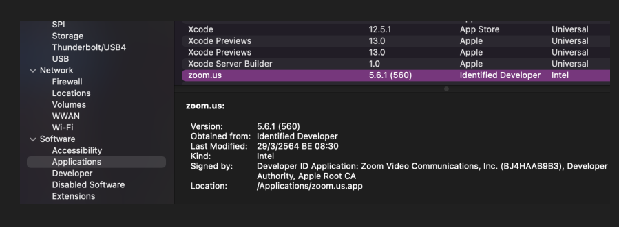](https://storage.tttang.com/media/attachment/2021/11/30/73fb1048-384e-4529-88ba-cbc055b0d255.png)

在Apple silicon架构的机器上，通过Rosetta运行的的应用程序将标记为"Intel"

另外，我们也可以通过下面的命令来输出一个类似的列表，以便利用脚本进行相应的处理：

```plain
% system_profiler SPApplicationsDataType 
```

结论：在M1 Mac上以本机代码运行的安全解决方案不仅更具操作性和安全性，而且同时还表明供应商在macOS平台上投入了足够的资金。

### [寻找在macOS威胁方面具有成熟专业知识的供应商](#toc_macos_1)

了解您的供应商是否长期投资于macOS平台，这是非常重要的，因为开发软件和检测恶意软件是不同的专业领域。所以，我们一定要寻找具有macOS恶意软件研究和威胁情报记录的供应商。之所以这样要求，是因为不积极研究新的macOS威胁的供应商，通常只能跟在其他领先供应商的屁股后面跑，因此，他们的解决方案总是落后一步，所以，我们无法指望这样的解决方案来保护您的企业免受新出现的或正在浮现的威胁。

就SentinelOne来说，多年来一直在macOS研究领域处于领先地位，在2020/2021年，我们报告的新macOS威胁比任何其他供应商都多。

[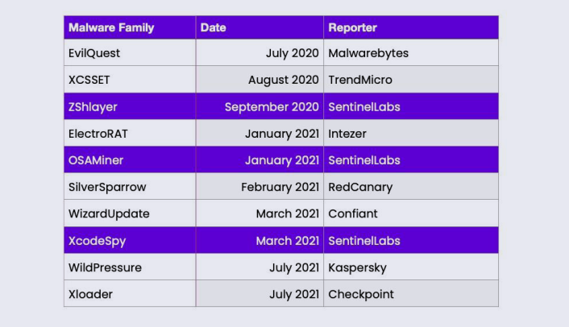](https://storage.tttang.com/media/attachment/2021/11/30/577b3644-ccbf-487f-a185-3633803412ff.png)  
2020-2021年发现的10大新macOS恶意软件

正如您所料，我们在MITRE的macOS ATT&CK框架中被广泛引用，包括macOS攻击者和TTP的条目，这些条目完全或主要依赖于我们的研究，如Lazarus团队的加密恶意软件的MITRE条目，以及攻击者使用AppleScript作为TTP的各种方式。

[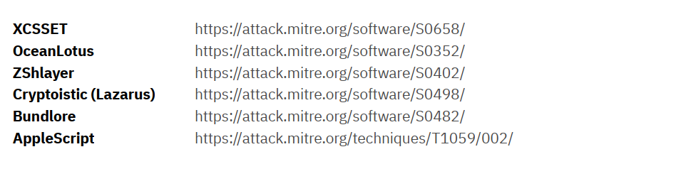](https://storage.tttang.com/media/attachment/2021/11/30/d1bfd028-c2c5-478a-9d9a-d8b2a180fb08.png)

[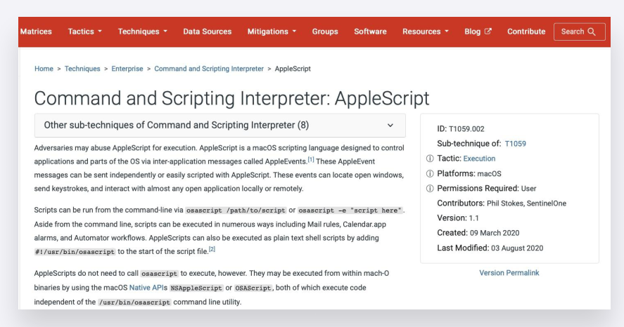](https://storage.tttang.com/media/attachment/2021/11/30/2d75e913-88c5-4569-9be5-b95360a85add.png)

SentinelOne是公认的MITRE Att&CK的贡献者

我们的开创性研究可在SentinelLabs网站上查阅，涵盖了macOS管理员和安全专业人员感兴趣的各种主题，从新兴和发展中的威胁到平台漏洞和恶意软件分类。

[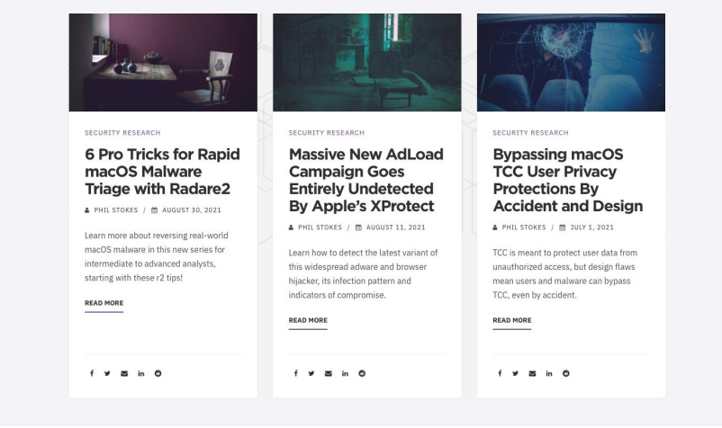](https://storage.tttang.com/media/attachment/2021/11/30/f53db83c-0a15-4994-8893-0dfacd806155.png)  
SentinelLabs涵盖了与macOS相关的广泛问题

结论：积极参与macOS研究的安全厂商能够更好地为您的企业提供所需的检测和防御功能，以确保您的macOS机群得到更好的保护。

### [哪些恶意软件威胁是专门针对macOS系统的？](#toc_macos_2)

在过去的18个月到两年的时间内，我们看到macOS威胁的数量和种类都在快速发展。过去，针对该平台的恶意软件，主要是广告软件和PUP供应商，它们的目标都是最终用户；但现在，除了这些传统威胁外，还出现了针对开发人员的攻击（XCSSET、XCodeSpy），以及针对特定企业环境（如 Xloader）的恶意软件。

如今，广告软件/PUP供应商也明显变得更加激进。像Shlayer、ZShlayer和Silver Sparrow这样的恶意软件已经开始使用零日漏洞和新颖的脚本方法来绕过苹果公司内置的防御技术，如XProtect和GateKeeper。我们还看到，不仅这些恶意软件，还有其他传统的恶意软件，如Adload和Pirrit，也在积极地收集受感染目标的环境信息，攻击者很可能会将其出售给更多的恶意攻击者，或者用于自己的后续攻击。

此外，虽然勒索软件在Mac平台上仍然是一种边缘威胁，但我们看到以后门和RATS形式出现的恶意软件和间谍软件正在与日俱增，这些软件通常是由Go甚至Rust等跨平台代码编译而成的。与此同时，诸如Smaug之类的暗网RaaS服务也开始为macOS提供勒索软件payload，尽管我们还没有看到任何成功的ITW感染案例。这种产品的提供表明正在浮现一个新兴市场，我们将对此保持积极关注。

随着Mac在企业中的普及，特别是在开发人员、经理和C-Suite高管等高价值目标用户群中的普及，不可避免的是，更多的攻击者将开发针对该平台的威胁工具。在企业不仅需要更强大的检测功能，同时还需要对整个macOS机群发生的事情有可见性的情况下，要想依靠Mac的内置安全工具来提供安全保障是根本不现实的。

## [小结](#toc__7)

如果您企业中正在运行许多Macs机器，那么您比任何人都需要清楚的是，Mac不同于其他操作系统。尽管与Linux一样，该系统也时源自Unix传统，但苹果的macOS是非常独特的一个系统，所以，它的攻击面也非常独特。在苹果公司已经远离英特尔架构的情况下，情况更是如此。出于这个原因，在考虑macOS安全性时，需要考虑一个在Mac平台上本地运行的解决方案，这个解决方案必须是由一个在检测Mac特定威胁方面具有良好记录的团队构建的。

正如您在本文所看到的那样，虽然没有人比苹果公司自己更适合做这件事，但正如该公司自己最近承认的那样，苹果公司在确保操作系统安全方面的尝试存在很多不足之处。

安全防护并非苹果的主要业务，也不太可能是您的主要业务。但是，保护您的macOS机群既不能成为一份兼职工作，也不能成为一项次要的需求，或者是事后的想法。在SentinelOne公司，安全是我们的业务，我们也是Mac用户。我们投资于macOS专业知识和资源，以确保我们的解决方案为Mac端点提供最佳保护。如果您想亲眼看看SentinelOne如何保护您的macOS“舰队”，欢迎联系我们了解更多信息或请求免费演示。

原文地址：[https://www.sentinelone.com/wp-content/uploads/2021/11/The-Complete-Guide-to-Understanding-Apple-Mac-Security-for-Enterprise.pdf](https://www.sentinelone.com/wp-content/uploads/2021/11/The-Complete-Guide-to-Understanding-Apple-Mac-Security-for-Enterprise.pdf)
