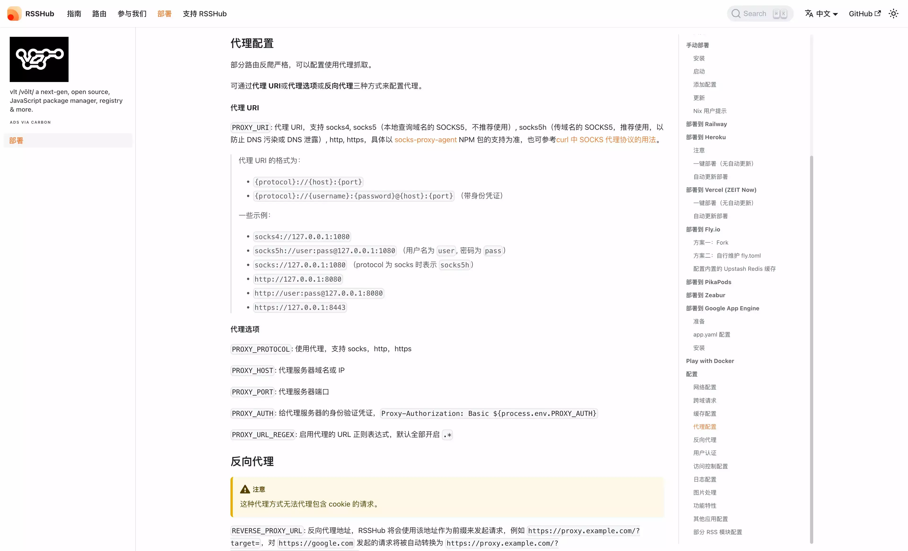
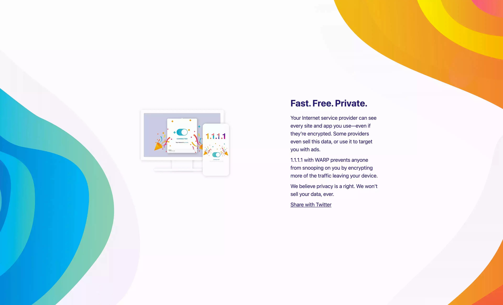

# 优雅使用 Cloudflare WARP 应对 RSSHub 反爬难题 - DIYgod

## 优雅使用 Cloudflare WARP 应对 RSSHub 反爬难题

2023年8月18日[#创作集](https://diygod.cc/tag/%E5%88%9B%E4%BD%9C%E9%9B%86)4684[](https://scan.crossbell.io/tx/0x14c63bea3c28d5472f322f994ce2de3c9653231b243cd80a16d996838bb1b481)

AI 生成的摘要

这篇文章讨论了作者在开发RSSHub过程中遇到的IP隐藏需求，并介绍了如何使用Cloudflare WARP作为代理来解决这个问题。作者分享了一个在GitHub上找到的封装的Docker，可以将WARP包装为通用的代理。作者还提到了使用WARP后成功访问了一些被屏蔽的网站，并发现每次重启WARP时IP会自动更改，这对于解决反爬问题是一个好消息。最后，作者提到可以进一步自定义WireGuard的配置，包括使用付费版WARP+和自定义endpoint，以获取更好的结果。作者计划在几天内进行验证并更新。

🕊️ 本文送给更开放的互联网

- - -

起因是看到 [@geekbb](https://geekbb.xlog.app/) 介绍 Warp 的[推文](https://twitter.com/geekbb/status/1663443373544583168)。尽管 Warp 已经发布了很长时间，就保护 IP 隐私而言，它并没有 iCloud Private Relay 好用，我也没有魔法上网的需求。但是我突然意识到，我还是有隐藏 IP 的需求。

在开发 RSSHub 的几年中，我发现提供公共 API 的站点非常少，许多站点还会采取严格的反爬控制来限制其平台内容的获取。有些站点会屏蔽同一 IP 发出过多请求，而还有一些站点则会全面屏蔽常见云服务器厂商的 IP 地址。因此，仅仅为了获取最新几条内容更新却变得非常困难。


这种情况需要使用代理，但是专门的爬虫代理通常价格昂贵，性价比极低，如果 Cloudflare WARP 的无限流量和丰富的 IP 资源能被 RSSHub 利用就太棒了。RSSHub 已经支持了通用的代理协议，只要能将 WARP 包装为通用的 proxy 就可以。



虽然无法直接在命令行环境中方便地使用官方客户端，但这么容易想到的点子肯定已经被别人实现过了。我在 GitHub 上找到了一个封装的 Docker。

[Mon-ius/Docker-Warp-Socks](https://github.com/Mon-ius/Docker-Warp-Socks)

Connet to CloudFlare WARP, exposing \`socks5\` proxy all together.

Shell14318

然后只需要在 RSSHub 的 `docker-compose.yml` 中再添加这样一个 service 来启用代理服务

```yml
warp-socks:
    image: monius/docker-warp-socks:latest
    privileged: true
    volumes:
        - /lib/modules:/lib/modules
    cap_add:
        - NET_ADMIN
        - SYS_ADMIN
    sysctls:
        net.ipv6.conf.all.disable_ipv6: 0
        net.ipv4.conf.all.src_valid_mark: 1
    healthcheck:
        test: ["CMD", "curl", "-f", "https://www.cloudflare.com/cdn-cgi/trace"]
        interval: 30s
        timeout: 10s
        retries: 5
```

最后给 RSSHub 加一个 PROXY\_URI 环境变量来使用代理

```yml
PROXY_URI: 'socks5h://warp-socks:9091'
```

我选取了一个我经常使用的 hotukdeals 路由（英国版的什么值得买）进行测试。该站点会屏蔽所有 DigitalOcean 的 IP，因此一直处于 403 状态。


加上 WARP 后可顺利访问


此外，我发现每次重启 WARP 时，都会输出新的 IP。尽管我没有时间验证，但我感觉 IP 应该会经常自动更改，这对解决反爬是一个好消息。


还可以进一步自定义 WireGuard 的配置，包括使用付费版 WARP+ 和自定义 endpoint，以获取可能更好的结果。

生成 WireGuard 配置文件可以使用

[ViRb3/wgcf](https://github.com/ViRb3/wgcf)

🚤 Cross-platform, unofficial CLI for Cloudflare Warp

Go4582538

刷 WARP+ 流量和筛选 endpoint 可以使用

### Github Repo not found

The embedded github repo could not be found…

有说法是 WARP+ 的速度并无明显差异（[《WARP、WARP + 速度对比，以及 WARP 速度上限》](https://www.nodeseek.com/post-9449-1)），但是是否影响反爬效果还需要进一步验证。

如果一切顺利，RSSHub 官方实例中许多严格反爬的路由应该能重新使用。我将在几天内进行验证并在此更新。



38

0

17

38

-   
-   
-   
-   +35
    

0

加载中...
