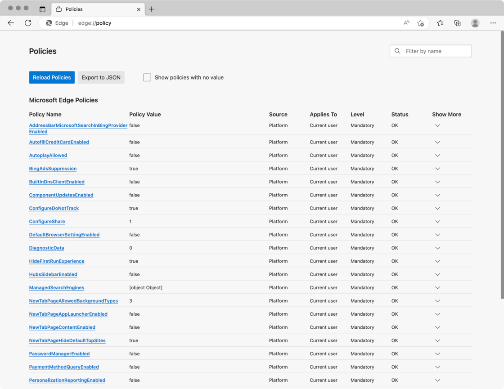
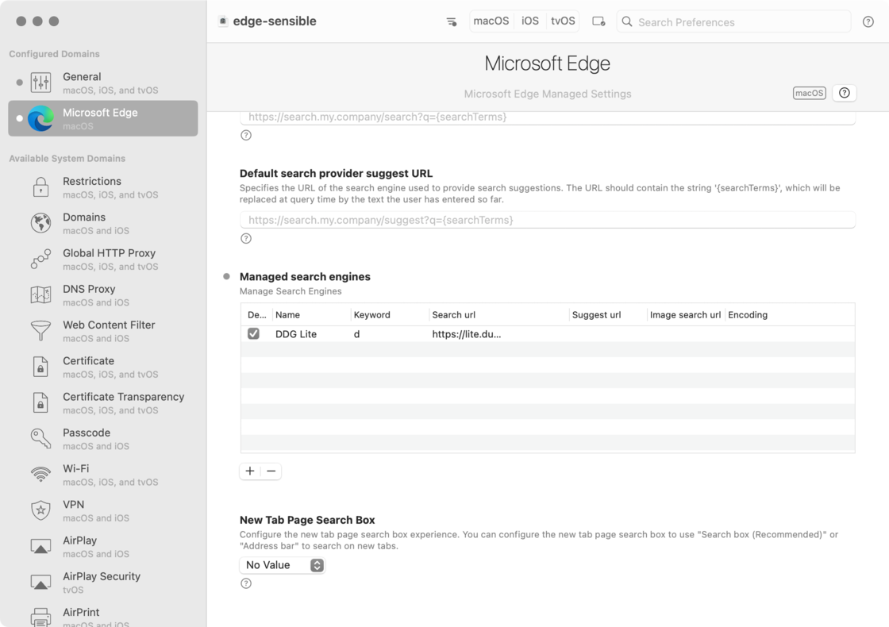

# 你与清爽 Mac 版 Edge 浏览器还差一个配置文件的距离 - 少数派

作为微软当下不遗余力暴力推广的产品，Edge 浏览器的一些功能巧思是有目共睹的，但在某些方面也把家族的劣根性发挥到了极致，包括「应加尽加」的推广植入，以及掘地三尺的数据收集等。

对此，在前几个月的一篇[文章](https://sspai.com/post/75083)中，少数派编辑部的 Windows 代言人 Clyde 介绍了一系列让 Edge 浏览器更「干净」的技巧。尽管这篇文章主要是面向 Windows 用户写作的，但出于普度众生的目的，最后还是照顾了一下 macOS 用户，链接到了微软官方文档[针对 macOS 版 Edge 的配置说明](https://sspai.com/link?target=https%3A%2F%2Flearn.microsoft.com%2Fzh-cn%2Fdeployedge%2Fconfigure-microsoft-edge-on-mac)。

但如果点开这个文档，你可能会大失所望。根据其中说法，macOS 版 Edge 的高级配置似乎是企业用户专用的功能。接连便是难懂的话，什么「MDM 解决方案」「部署」之类，引得你都被气笑出来，屏幕内外充满了快活的空气。

本文为 macOS 用户提供一个翻身做主的通用解决方案。

## **文长不看版**

1.  [下载](https://sspai.com/link?target=https%3A%2F%2Fgist.github.com%2Ffirexcy%2Fe7e4039dc6ea48519f25c74fd2a49491)我做好的配置文件（点击页面上的 **Raw** 按钮），双击打开；
2.  点击屏幕右上角弹出的通知，或者手动打开苹果菜单 >「系统设置」，进入「隐私与安全性」>「配置文件」面板；
3.  双击列表中带有感叹号标记的配置文件「edge-sensible」，确认安装；
4.  重启 Edge 浏览器。


修改前后的效果对比如下。


你可以在 Edge 中访问 `about:policy` 来检查具体导入了哪些配置，以及配置是否生效。此外，点击配置项名称可以跳转到官方文档的对应解释。



如果要删除配置文件，回到「配置文件」设置面板，点击配置文件右侧的减号图标即可将其卸载。

当然，如果你愿意多花一点时间，我还是建议不要直接导入，先看看下面的具体解释。毕竟我们是陌生人；**玩电脑不要轻信陌生人。**

- - -

## 完整版

我们知道，当微软说一个功能是企业功能的时候，有大概 1% 的可能是因为这个功能真的只有企业用得上。剩下 99% 的可能是：(i) 它真的不知道怎么用人话来解释这个功能，(ii) 它真的很不甘心让所有人白用这个功能，或者 (iii) 两者兼有。

macOS 版 Edge 的高级配置就属于 99% 那类。根据微软介绍的方法，你需要从 Edge 策略列表中查找想调整的选项，将其以 XML 语法保存为 `.plist` 格式（property list 或属性列表，苹果系统用于记录偏好设置的文件格式），然后通过移动设备管理 （Mobile Device Management, MDM）工具安装到受管理到的设备上（术语称「部署」）。

但微软没有告诉你的是，管理高级配置并不依赖任何 MDM 工具。只要按照官方文档介绍的方法写出 plist 格式的配置，加上少量额外信息后保存成 `.mobileconfig` 格式，所得的配置文件就可以直接双击安装，实现「自己管理自己」。

（如果你比较喜欢折腾 iOS 设备，应该不会对 `.mobileconfig` 这个格式感到陌生。是的，每年七月苹果推出新版测试系统后，很多人哭着闹着找下载、黄牛腆着脸零成本兜售的「测试系统配置文件」，就是以 `.mobileconfig` 的格式分发的。）

下面，我们开头所提供配置中的部分设置为例，说明怎么自己制作一个配置文件。

### 方法一：手动制作配置文件

#### **关闭所有诊断数据**

在默认状态下，Edge 只允许用户关闭「可选」的诊断数据，对于所谓「必要」的诊断数据则不仅不允许关闭，还耀武扬威地在设置页留了个说明，摆明着要气死你。

为了停用所有诊断数据，我们首先检索微软提供的 Edge 浏览器[策略参考](https://sspai.com/link?target=https%3A%2F%2Flearn.microsoft.com%2Fzh-cn%2Fdeployedge%2Fconfigure-microsoft-edge-on-mac)，发现其中相关的策略是 `DiagnosticData`。它的值是一个整数，`0`、`1`、`2` 分别代表完全关闭、允许必要诊断数据、允许可选诊断数据。

根据 [plist 语法](https://developer.apple.com/library/archive/documentation/CoreFoundation/Conceptual/CFPropertyLists/Articles/StructureAndContents.html#//apple_ref/doc/uid/20001171-CJBEJBHH)，对于键值对类型的元素，名称写在 `<key>` 元素中，其值通过紧邻其后的元素记录，元素名称取决于键的类型。因此，「完全关闭」用 plist 格式来表示就是：

```htmlembedded
<key>DiagnosticData</key>
<integer>0</integer>
```

#### **关闭新标签页的牛皮癣**

如果你是一个简洁主义者，Edge 那充斥着小广告和垃圾新闻的默认新标签页一定能让你当场心脏病发。这其中有的可以通过设置关掉，有的不那么容易关掉，但总之不如直接写配置来得彻底。

为此，我们以「新标签页」为关键词在策略参考中检索，可以看到相关策略包括 `NewTabPageAppLauncherEnabled`（应用启动器，即新标签页左上角的微软应用菜单）、`NewTabPageContentEnabled`（资讯内容）、`NewTabPageHideDefaultTopSites`（快捷链接）等几个布尔类型。

因此，关闭启动器、关闭推广内容并隐藏快捷链接的配置是：

```htmlembedded
<key>NewTabPageAppLauncherEnabled</key>
<false/>
<key>NewTabPageContentEnabled</key>
<false/>
<key>NewTabPageHideDefaultTopSites</key>
<true/>
```

#### **更换默认搜索链接**

举这个例子的目的是说明稍复杂配置如何表达。Edge 浏览器默认使用 Bing 搜索，水平上高不成低不就，审美上一言难尽。虽然可以自己在设置里调整添加，但 Edge 的搜索引擎设置大概是所有浏览器里藏得最深的，还不如写成配置文件方便多次使用。

为此，我们还是从参考文档里通过搜索找到对应的策略 ManagedSearchEngines。观察示例可以知道，它的值是一个数组元素（`<array>`），其内部每一个词典（`<dict>`）元素对应一个自定义搜索引擎，必要内容包括名称、搜索链接、是否默认、关键词等，其他配置都是可选的。

因此，添加一个[简洁版 DuckDuckGo](https://sspai.com/link?target=https%3A%2F%2Flite.duckduckgo.com%2Flite) 的配置就是：

```htmlembedded
<key>ManagedSearchEngines</key>
<array>
    <dict>
        <key>is_default</key>
        <true/>
        <key>keyword</key>
        <string>d</string>
        <key>name</key>
        <string>DDG Lite</string>
        <key>search_url</key>
        <string>https://lite.duckduckgo.com/lite/?q={searchTerms}</string>
    </dict>
</array>
```

你还可以通过关闭 `AddressBarMicrosoftSearchInBingProviderEnabled` 策略（搜索建议中的 Bing 推荐结果）更彻底地抹除 Bing 的痕迹。

#### **汇总并制作配置文件**

如开头所述，收集并配置好自己想调节的策略后，我们需要将其「包裹」在一个 `.mobileconfig` 文件中，以便实现双击安装。

苹果在一份文档中介绍了 `.mobileconfig` 格式的结构。从中可知，配置文件可以存储多个应用的配置；每个应用的配置都放在一个词典元素（`<dict>`）中，这些词典元素共同作为数组元素 `PayloadContent` 的值。

为此，我们首先构建**配置 Edge 浏览器的词典元素**。将上述准备好的配置片段拼接起来，并在其相邻位置（词典元素内部无所谓先后顺序）加上文档要求的[必要元素](https://developer.apple.com/documentation/devicemanagement/commonpayloadkeys)，形如：

```htmlembedded
<!-- Microsoft Edge 策略 -->
<key>PayloadContent</key>
<dict>
    <!-- 该组策略的名称（选填） -->
    <key>PayloadDisplayName</key>
    <string>Microsoft Edge</string>
    <!-- 该组策略反向 DNS 格式的识别符（必填） -->
    <key>PayloadIdentifier</key>
    <string>com.microsoft.Edge.13D4EE1D-74BF-4963-AE69-88E61F9FD9EA</string>
    <!-- 该组策略的应用对象（必填） -->
    <key>PayloadType</key>
    <string>com.microsoft.Edge</string>
    <!-- 该组策略 UUDI 格式的识别符（必填） -->
    <key>PayloadUUID</key>
    <string>AB70BBA2-D881-4C1A-8E36-9EE591429F3E</string>
    <!-- 该组策略的版本号（必填） -->
    <key>PayloadVersion</key>
    <integer>1</integer>
    <!-- 下方拼接配置内容 -->
    . . .
</dict>
```

上述元素中，除了 `PayloadType` 必须填写 Edge 的包名 `com.microsoft.Edge` 以便正确生效外，其他都只起识别目的，可以任填。对于识别符格式的内容，推荐方法是在终端使用 `uuidgen` 命令随机生成一个（或者使用[网页工具](https://sspai.com/link?target=https%3A%2F%2Fwww.uuidgen.org%2Fv%2F4)）。

做好这个配置 Edge 的词典元素之后，我们进一步在该元素的相邻位置加上[必要的顶层元素](https://developer.apple.com/documentation/devicemanagement/toplevel)，整体包裹在一个词典元素中，再加上 plist 文件的头部信息：

```htmlembedded
<!-- plist 文件惯常头部信息 -->
<?xml version="1.0" encoding="UTF-8"?>
<!DOCTYPE plist PUBLIC "-//Apple//DTD PLIST 1.0//EN" "http://www.apple.com/DTDs/PropertyList-1.0.dtd">
<plist version="1.0">
<dict>
  <!-- 配置文件名称（选填） -->
	<key>PayloadDisplayName</key>
	<string>edge-sensible</string>
	<!-- 配置文件反向 DNS 格式的识别符（必填） -->
	<key>PayloadIdentifier</key>
	<string>com.example.edge-sensible</string>
	<!-- 配置文件类型（必填） -->
	<key>PayloadType</key>
	<string>Configuration</string>
	<!-- 配置文件 UUDI 格式的识别符（必填） -->
	<key>PayloadUUID</key>
	<string>6BAC9A8B-19F3-4876-99D9-BCA6C8B30238</string>
	<!-- 配置文件的版本号（必填） -->
	<key>PayloadVersion</key>
	<integer>1</integer>
	<!-- 配置文件的适用设备（选填，5 表示 Mac 平台） -->
	<key>TargetDeviceType</key>
	<integer>5</integer>
	<!-- 下方拼接 PayloadContent 键及其内容 -->
	<key>PayloadContent</key>
	<dict>
    	. . .
  </dict>
</dict>
</plist>
```

识别符格式的内容的生成方式与上文类似。

移除各行注释，将这个文件保存为 `.mobileconfig` 格式，就得到了一个可以双击安装的配置文件。

### 方法二：用第三方工具辅助创建配置文件

如果嫌手动制作太麻烦，也可以用第三方工具来辅助创建配置文件。

你或许知道苹果推出过一个叫做 [Apple Configurator](https://apps.apple.com/us/app/apple-configurator-2/id1037126344) 的工具，其主要功能之一就是用来辅助制作配置文件（例如，在 iOS 尚未原生支持字体安装的年代，我曾经介绍过怎样用这个工具[安装自定义字体](https://sspai.com/post/41714)），但对于第三方应用就无能为力了。

好在，Mac 管理员用户社区共同维护了一个 [ProfileManifests](https://sspai.com/link?target=https%3A%2F%2Fgithub.com%2FProfileCreator%2FProfileManifests) 项目。这个项目收集了各类第三方应用的高级配置，按照苹果规范的 [preference manifest 格式](https://developer.apple.com/library/archive/documentation/MacOSXServer/Conceptual/Preference_Manifest_Files/Preface/Preface.html)汇总起来。

在 ProfileManifests 项目的基础上，又产生了 [ProfileCreator](https://sspai.com/link?target=https%3A%2F%2Fgithub.com%2FProfileCreator%2FProfileCreator)（开源）和 [iMazing Profile Editor](https://sspai.com/link?target=https%3A%2F%2Fimazing.com%2Fprofile-editor)（闭源免费，与著名 iOS 管理软件 iMazing 同门）等第三方配置文件制作工具。它们和 Apple Configurator 的功能有所重合，但能配置第三方应用的高级设置，在一些细节上也更灵活。两者中，我更推荐 iMazing Profile Editor，因为它更新更及时、界面更美观，而且支持 macOS 和 Windows 双平台。

安装并打开 iMazing Profile Editor 之后，先在 General 部分填写标记为必选的栏位（实际上就对应了上述手动方法中补充的各项信息），然后在侧边栏找到 Microsoft Edge 一项，按需调整即可。对于不明白含义的选项，可以点击问号图标，跳转到上述微软官方文档的对应小节。



全部设置完后，直接保存即可得到与手工方法相同的 `.mobileconfig` 格式文件。

需要说明的是，由于 iMazing Profile Editor 的设置项基于社区项目，其更新必然不可能是最及时的，也难免有些错漏。通过比较可以发现，它提供的 Edge 策略中，有的是官方明确已经标注为过时的，而一些新的策略则还没有加入。因此，即使使用这种第三方工具，最好也确认一遍所调整策略的文档，并辅之以必要的手动编辑。
