# 供应链安全情报 | 恶意py包伪装代理SDK进行后门攻击，目标锁定python开发者 - 先知社区

供应链安全情报 | 恶意py包伪装代理SDK进行后门攻击，目标锁定python开发者

- - -

**概述**

2023年11月28号，悬镜供应链安全实验室在Pypi官方仓库（[https://pypi.org）](https://pypi.org)/) 监测到两起伪装成http和socks5代理SDK的开源组件投毒事件。python开发者一旦下载安装这些投毒Py包（libproxy、libsocks5），会触发执行Py包中的恶意代码，最终将导致开发者系统被投毒者植入恶意后门。

[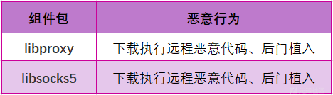](https://xzfile.aliyuncs.com/media/upload/picture/20231201172806-ef0ebd48-902b-1.png)

这些恶意Py包在官方仓库上的本周下载量大约500多次。

[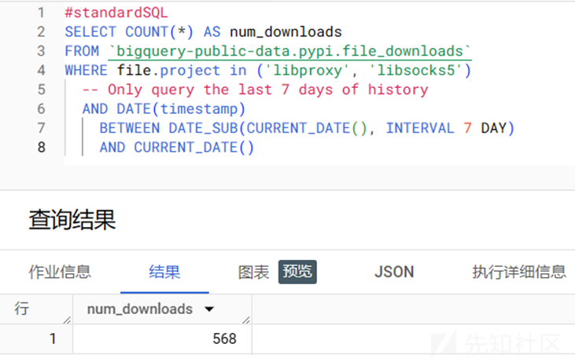](https://xzfile.aliyuncs.com/media/upload/picture/20231201172815-f491132e-902b-1.png)

目前恶意Py包已从官方仓库下架，但国内部分主流Pypi镜像源依旧可访问下载这些恶意包，实际的受害者数量将会更多，尤其对于国内广大开发者来说仍存在被投毒攻击的风险。

[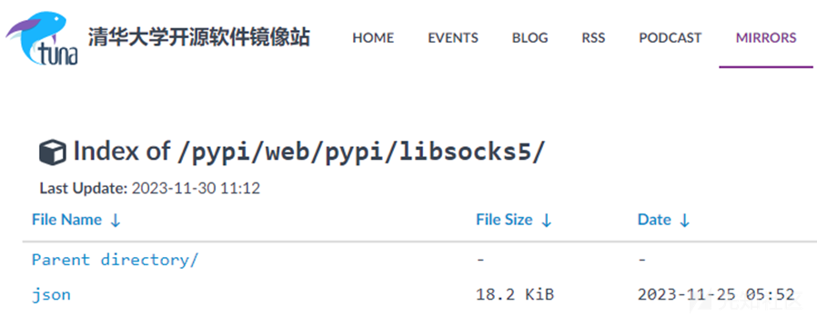](https://xzfile.aliyuncs.com/media/upload/picture/20231201172823-f9390594-902b-1.png)

国内Python开发者们可自行排查是否安装或引用以下恶意py组件包。

[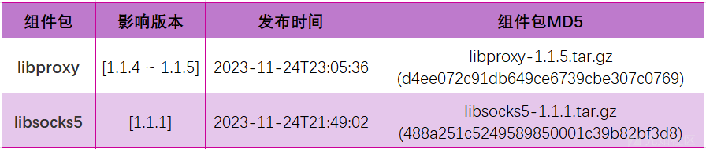](https://xzfile.aliyuncs.com/media/upload/picture/20231201172835-004ebcc0-902c-1.png)

**投毒组件分析**

本次py投毒组件在安装包setup.py脚本中自定义install命令类执行恶意操作，通过从远程服务器上拉取加密的恶意代码进行解密释放出第二阶段攻击使用的shellcode代码，shellcode代码直接在系统内存中执行，无恶意文件落盘行为，具备较高的攻击隐蔽性。

**Part 1 加载远程攻击载荷**

以`libsocks5`为例，该组件包setup.py的cmdclass::install被定义为VerifyInstallationChecksum类。

[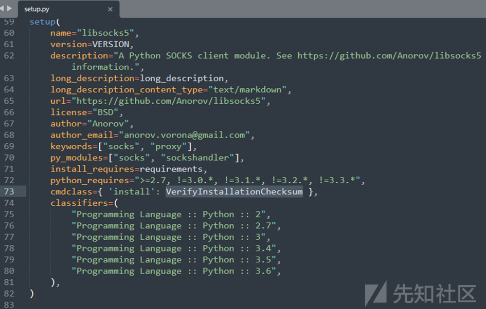](https://xzfile.aliyuncs.com/media/upload/picture/20231201172857-0d6118c2-902c-1.png)

当开发者通过pip install libsocks5 安装py包时，VerifyInstallationChecksum的run函数将被调用执行第一阶段攻击代码。Run函数先将base64编码的url进行解码后通过urllib远程下载加密的恶意代码，最后会对恶意代码进行解密并调用eval执行进入第二阶段攻击代码。

[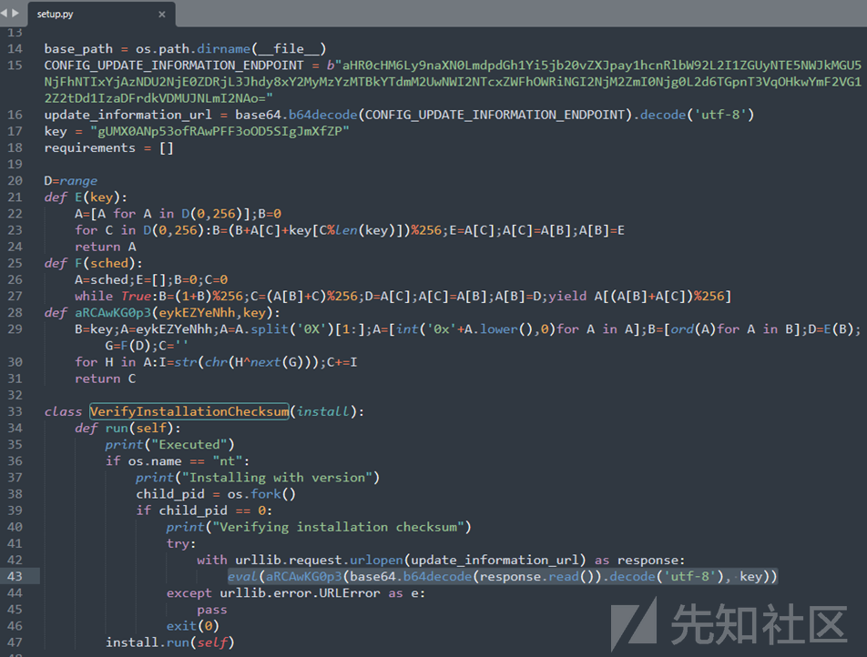](https://xzfile.aliyuncs.com/media/upload/picture/20231201172913-1729fdb0-902c-1.png)

base64编码的恶意代码url为：

```plain
aHR0cHM6Ly9naXN0LmdpdGh1Yi5jb20vZXJpay1hcnRlbW92L2I1ZGUyNTE5NWJkMGU5NjFhNTIxYjAzNDU2NjE0ZDRjL3Jhdy8xY2MyMzYzMTBkYTdmM2UwNWI2NTcxZWFhOWRiNGI2NjM2ZmI0Njg0L2d6TGpnT3VqOHkwYmF2VG12Z2tDd1IzaDFrdkVDMUJNLmI2NAo=
```

解码后的url为：

```plain
https://gist.github.com/erik-artemov/b5de25195bd0e961a521b03456614d4c/raw/1cc236310da7f3e05b6571eaa9db4b6636fb4684/gzLjgOuj8y0bavTmvgkCwR3h1kvEC1BM.b64
```

**Part 2 shellcode解密执行**

解密后的第二阶段攻击代码(如下图所示)被混淆处理，其大致逻辑是通过调用python ctypes库动态分配一段可读可写可执行的RWX系统内存，并将内置加密压缩后的shellcode代码解密释放到RWX内存上，最后直接控制PC寄存器跳转到RWX内存中执行shellcode进入第三阶段攻击代码。

[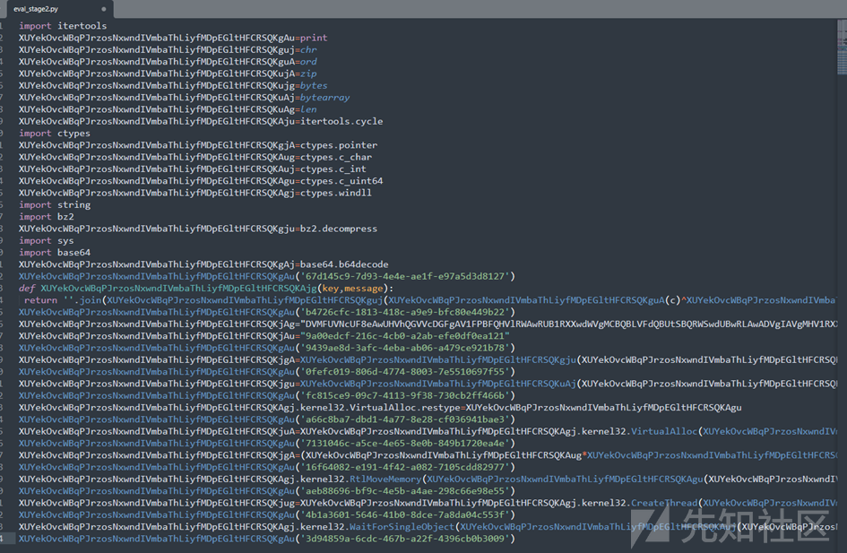](https://xzfile.aliyuncs.com/media/upload/picture/20231201173002-3409f49e-902c-1.png)

第二阶段攻击代码去除混淆后的伪代码如下如图所示：

[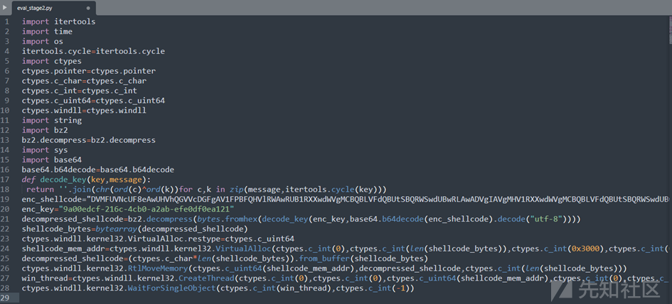](https://xzfile.aliyuncs.com/media/upload/picture/20231201173012-39f26bac-902c-1.png)

**Part 3 后门植入**

通过IDA逆向第三阶段shellcode攻击代码(shellcode\_stage1)，伪代码如下所示，shellcode先调用系统接口分配一块可读可写可执行的RWX内存，接着将内置的异或编码后的shellcode解码释放到RWX内存中执行下一阶段攻击。

[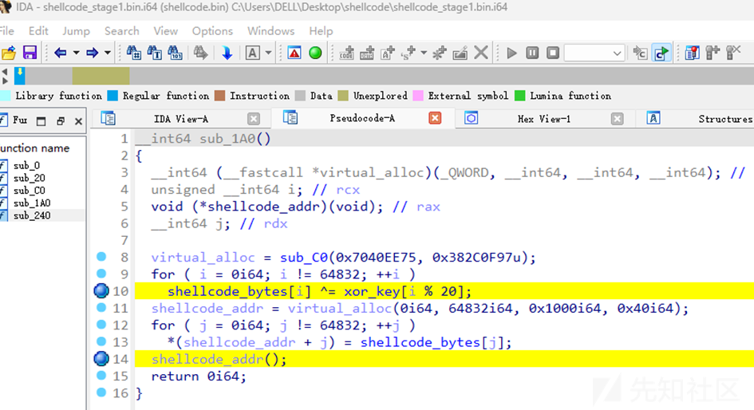](https://xzfile.aliyuncs.com/media/upload/picture/20231201173035-47c97018-902c-1.png)

[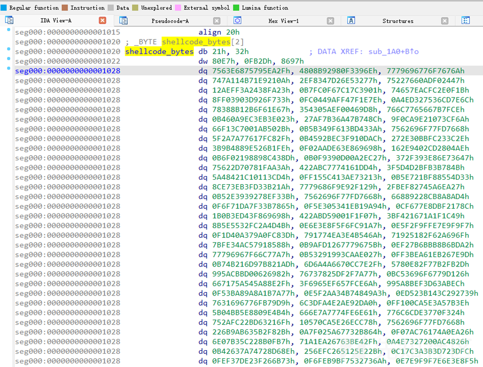](https://xzfile.aliyuncs.com/media/upload/picture/20231201173051-512e7b44-902c-1.png)

通过逆向分析，我们发现在第三阶段攻击代码shellcode\_stage1执行后，需要持续经过16轮 shellcode解码释放操作，最终才会释放出真实的攻击代码shellcode\_stage17。

从shellcode\_stage1到shellcode\_stage17阶段的代码都是直接在系统内存上执行，不在文件系统中生成恶意代码。通过IDA自动化脚本，我们可以从shellcode\_stage1中将后续16轮的shellcode代码全部还原提取（如下图所示）。

[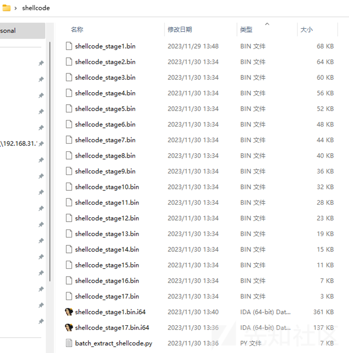](https://xzfile.aliyuncs.com/media/upload/picture/20231201173104-5921d95e-902c-1.png)

shellcode\_stage17的攻击代码最终会从投毒者控制的服务器下载后门程序RuntimeBroker.exe并植入到受害者系统中。

3478.qt-api-worker-threads.workers.dev  
[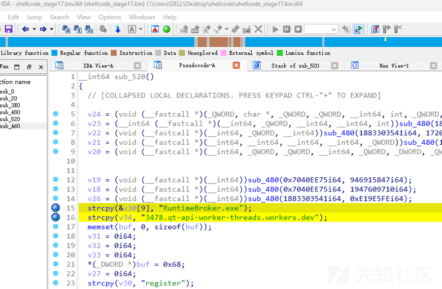](https://xzfile.aliyuncs.com/media/upload/picture/20231201173128-676a627e-902c-1.png)

**Part 4 IoC数据**

此次投毒组件包涉及的IoC数据如下所示：

[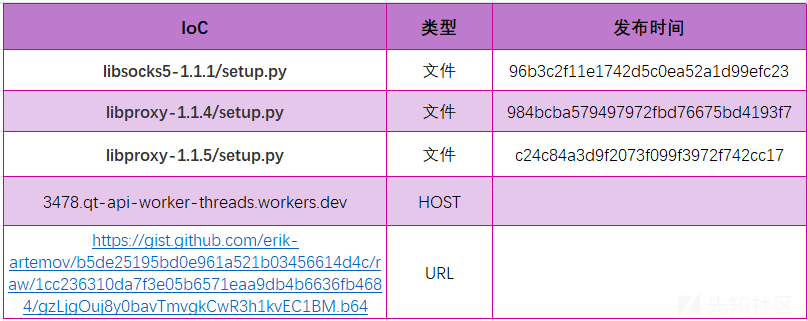](https://xzfile.aliyuncs.com/media/upload/picture/20231201173142-70196884-902c-1.png)

**总结**

截至目前，这些恶意组件包仍可从国内主流Pypi镜像源正常下载安装，国内Python开发者仍面临被投毒攻击的安全风险，开发者需提高安全防护意识，可自行根据以上IoC和组件信息排查是否安装或引用恶意组件包。除此之外，也可使用悬镜开源的OpenSCA安全治理工具进行扫描检测。

**快速排查**

使用OpenSCA-cli，将受影响的组件包按如下示例保存为db.json文件（可参考总结中提到的组件包信息按格式增减），直接执行扫描命令（opensca-cli -db db.json -path ${project\_path}），即可快速获知您的项目是否受到投毒包影响。

\[  
{  
"product": "libproxy",  
"version": "\[1.1.4, 1.1.5\]",  
"language": "python",  
"id": "XMIRROR-2023-113001",  
"description": "恶意Pypi组件包投毒。",  
"release\_date": "2023-11-30"  
},  
{  
"product": "libsocks5",  
"version": "\[1.1.1, 1.1.1\]",  
"language": "python",  
"id": "XMIRROR-2023-113002",  
"description": "恶意Pypi组件包投毒。",  
"release\_date": "2023-11-30"  
}  
\]  
悬镜供应链安全情报中心将持续监测全网主流开源软件仓库，对潜在风险的开源组件包进行动态跟踪和溯源，实现快速捕获开源组件投毒攻击事件并第一时间提供精准安全预警。
