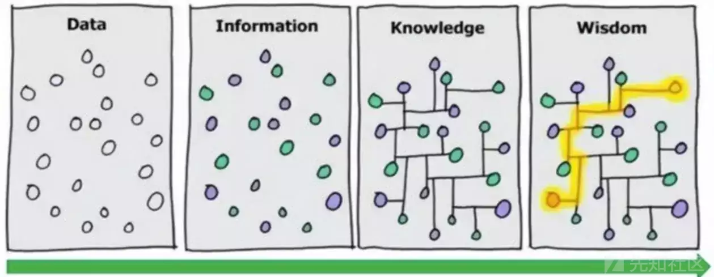

# 信任的传递：图计算可信策略的一点思考 - 先知社区

信任的传递：图计算可信策略的一点思考

- - -

# 安全策略的演进

其实自从安全策略演进到白名单可信策略后，不可避免的陷入了一个瓶颈。在检出更多的同时，带来更多的误报，更高的成本。  
如何解决这个问题，是一直以来思考的一个问题。

**现在，我们先回顾下安全策略的演进过程，看几个简化后的例子：**  
理论版本一：单维度黑名单，满足条件A就是异常  
条件表达式：$A

实际版本一：单维度黑名单+白名单去误报，满足条件A且不满足条件B就是异常  
条件表达式：$A && !$B

理论版本二：多维度黑名单，满足条件A或/且满足条件B，就是异常  
条件表达式：$A || $B，$A && $B

实际版本二：多维度黑名单+白名单去误报，满足条件A或/且满足条件B，且不满足条件C，就是异常  
条件表达式：($A || $B) && !$C、($A && $B) && !$C

**接下来步入白名单，每一步都是误报爆炸。**

理论版本三：单维度白名单，不满足条件A就是异常  
条件表达式：!$A

实际版本三：单维度白名单+白名单去误报，不满足条件A且不满足条件B就是异常  
条件表达式：!$A && !$B

理论版本四：多维度白名单，不满足（条件A和条件B）就是异常  
条件表达式： !($a && $b)，  
每增加一个维度，误报就会更多。!($a && $b && $c)能检出更多，但误报也更多。

实际版本四：多维度白名单+白名单去误报，不满足（条件A和条件B），且不满足条件C，就是异常  
条件表达式： !($a && $b) && !$c，  
每增加一个维度，误报就会更多。!($a && $b && $c)能检出更多，但误报也更多。

理想版本四：除了空间的多维，如果再加上时间维度时间序列的话，条件表达式必须写成!(A && B)，A在B前面。问题复杂度又上升了一个量级。

**到这里，已经进入瓶颈了，很难平衡高检出和低误报。然后不可避免的会想到下面这种方式。**

版本五：多维度灰名单，不满足条件A且不满足条件B，就是异常。  
条件表达式：!$A and !$B，再去误报 。  
意思是指A维度不可信+B维度不可信=整体更不可信。

客观上来说，这种其实是取巧的做法，只关注头部的不可信行为，会造成白名单过粗从而导致检出遗漏的问题。理论上来说，我们的理想做法还是基于版本四，要所有的维度都可信，整体才可信，反过来说，就是只要有1个维度不可信，那就是异常。

# 安全策略瓶颈的解法思考

无论是单维度还是多维度，黑名单还是白名单，其实都是在解一个平衡问题。单维度的平衡：相当于检出和误报都只是及格线的水平。  
  
多维度的平衡，相当于检出和误报都要达到优秀的水平。  
  
要检出更多，势必左边砝码会变重，所以右边也要找到更重的砝码，这样天平才能平衡。整个问题的复杂度也同时更高，所以要确保精准且优雅，不然一不小心，天平就翻了。

如果能找到更多的a1、a2，b1、b2，将表达式!($a && $b)变成：  
!(($a1 && $b1) || ($a2 && $b2) || ($a3 && $b3))，或者!($a1 && $b1) && !($a2 && $b2) && !($a3 && $b3)

其中a~a1~a2~a3，a约等于a1约等于a2约等于a3，b~b1~b2~b3，既能保证左边砝码更重，更准确，也能保证右边砝码更重， 误报更少。

**关键是得找到更多的aN和bN。从实际的历史基线数据中可以得到直接触发的关系对，但这只是所有可信关系对中的一部分，经常达不到去误报的要求和砝码重量，因此需要从逻辑层面找到和构建更多的可信关系对。**  
等值变化过程中，关键点在于构建信任链，传递信任关系。就像小学时候学过的A=B，B=C，那么A=C。朋友的朋友也是朋友。

# 图计算传递信任关系

理论方面，提到构建信任关系中的关系，联想到了图，因为之前陷入瓶颈，于是在和外界交流的过程中，听图计算领域的朋友说过一句：如果要用到“关系”，那么图会很适合，如果是多度关系/深度关系，那么图将是最佳选择。

实践方面，之前做过一个case是，检测员工在内部日志平台非预期查询应用日志的场景，在员工层面和查询应用层面做了信任关系的传递。比如A员工是B应用的owner，可查询B应用日志，对A员工进行组织维度信任关系传递后得到同组A1员工，同组的A1员工也可以查询B应用，对B应用进行上下游调用链路维度信任关系传递后得到B1、B2应用，A和A1员工也都可以查询B1、B2应用日志用于研发和测试问题排查。  
  
当时认为这是个特殊的case，没有想到用图实现。现在看来可能是个通用问题和解法，用图实现，会更优雅，也能扩展到>=3度关系，得到更多可信关系对。当然还需要考虑的是一般随着信任链路变长，每一次传递，信任都会损耗，最终信任度也会逐级降低。除非，每一层关系都是强可信关系，99.9%*99.9%*99.9%=99.7%，才能保证信任的传递到最后还是信任。

# 图计算可信策略

看上去可以用图计算传递信任关系，解决安全策略的瓶颈问题。现在问题的关键是：如何将业务问题转化为图计算问题？如何传递信任关系？

先看下，图计算与知识图谱在其他不同场景是如何应用的。

**业务安全领域应用：重点是汇聚点边周边信息，判断、推理、决策出某个节点/实体或边/关系的可信度。这也是为什么很多业务安全风控场景采用知识图谱作为解决方案的原因。主要是基于知识图谱本身具有节点和边异质，存在逻辑性的特点。采用知识图谱可以更好的将业务场景解释性和不同性质的节点/边进行关联。**  
边可信的应用方面，在环境可信、设备可信等点可信的前提下，可以基于现有关系增加关系可信，判断交易安全，服务于业务安全风险决策；也可以使用知识图谱边推理算法，基于现有关系推理、补全现有知识图谱中不完整的关系。  
点可信的应用方面：比如构建企业风险图谱，推理出企业背后的最终受益人、企业是否是空壳企业、是否是有经营风险的企业。

信息安全领域应用：基于安全一张图的可信策略，思路和做法应该类似，关键点是定义节点和信任关系，构建信任链。节点包括人、终端、浏览器、设备IP地址、身份凭据、云账号、应用、服务器或容器IP地址、接口、敏感数据存储实体等，每个属性都可以是实体。信任关系包括人与人的信任关系，应用与应用的信任关系，人与应用的信任关系，人与终端的信任关系，云账号主账号和子账号的信任关系，子账号和AK的信任关系，AK和浏览器头的信任关系，接口与接口的关系，应用和容器IP地址的关系，IP地址和浏览器头的关系、应用和敏感数据存储的关系等。总之，**可以不断沉淀将数据按照特定逻辑汇聚到图中，形成安全一张图，让安全数据和信息彼此之间相互联系，形成安全知识和智慧，同时也满足安全的可解释性的特殊要求。**  

图计算可信策略实际使用，关键在于找出和传递信任关系。  

1.  理论上来说，最严格的可信策略应该是：!($A2 && $B2 && $C2 && $D2 && $E2 && $F2 && $G2)，然后这种写法误报太高，无法落地运营。
2.  因此实际上，可信关系对应该也包括推导出的间接可信关系对，具体包括到什么程度，在于对关系的信任程度的理解，员工2的同组员工1也访问应用D2，就一定可信吗？某1台容器利用AK访问了，是否意味着同一个应用的其他容器也有权限利用同样AK去访问？
3.  对于这些问题暂时我也没有答案，留给我去解决。做白名单可信策略就像拼夕夕的砍一刀，需要一点一点砍，砍很多刀，砍不知道多少刀，但应该是有最终答案的。
